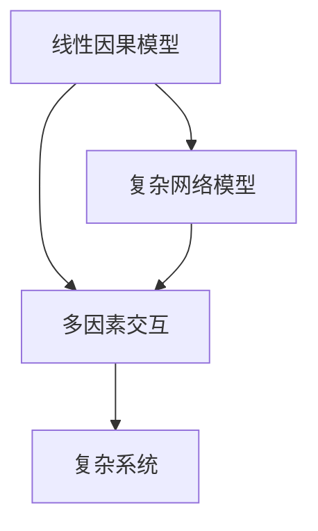
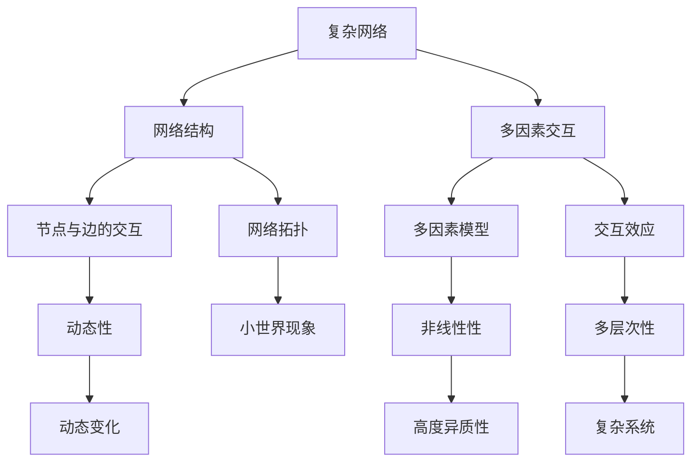

                 

### 从线性因果到复杂网络：理解多因素交互的世界系统

> 关键词：线性因果，复杂网络，多因素交互，世界系统，技术博客

> 摘要：本文旨在探讨从线性因果到复杂网络的多因素交互机制，分析其核心概念、基本原理和实际应用。通过一步步的逻辑推理，我们将深入理解多因素交互在复杂系统中的重要性，为读者提供一个全面的技术视角。

#### 引言

在过去的几十年里，计算机科学和人工智能领域取得了显著的进步。然而，随着技术的不断发展，我们开始面临越来越复杂的问题。这些问题不再是简单的线性关系，而是涉及多个因素之间的复杂交互。为了更好地理解和解决这些复杂问题，我们需要从线性因果模型过渡到复杂网络模型。

本文将分为以下几个部分：

1. **线性因果模型**：介绍线性因果模型的基本概念和局限性。
2. **非线性因果模型**：探讨非线性因果模型的特点和适用场景。
3. **复杂网络模型**：介绍复杂网络模型的基本概念、构建方法和动态分析。
4. **多因素交互分析**：分析多因素交互的基本概念和模型。
5. **复杂网络在实际应用中的案例分析**：探讨复杂网络在社会网络分析和生物信息学中的应用。
6. **结论与展望**：总结本文的主要观点，并展望未来的研究方向。

#### 线性因果模型

线性因果模型是一种常见的数学模型，用于描述变量之间的线性关系。在这种模型中，一个变量的变化会导致另一个变量的变化，而且这种变化是线性的。线性回归模型是最常见的线性因果模型之一。

**2.1 线性回归模型**

线性回归模型可以表示为：

\[ y = \beta_0 + \beta_1x + \epsilon \]

其中，\( y \) 是因变量，\( x \) 是自变量，\( \beta_0 \) 和 \( \beta_1 \) 是模型的参数，\( \epsilon \) 是误差项。

**2.1.1 线性回归的数学基础**

线性回归模型的数学基础主要包括以下几个方面：

- **最小二乘法**：用于估计模型的参数。
- **拟合优度**：用于评估模型对数据的拟合程度。

**2.1.2 最小二乘法**

最小二乘法是一种常用的参数估计方法，其核心思想是使模型预测值与实际值之间的误差平方和最小。

\[ \sum_{i=1}^{n} (y_i - \hat{y}_i)^2 \]

其中，\( \hat{y}_i \) 是模型对第 \( i \) 个观测值的预测值。

**2.2 线性因果模型的局限性**

线性因果模型在处理复杂问题时存在一些局限性：

1. **线性假设**：线性因果模型假设变量之间的变化是线性的，这可能不适用于许多实际问题。
2. **单一因果关系**：线性因果模型通常只考虑一个因素对另一个因素的影响，而忽略了其他可能的影响因素。

#### 非线性因果模型

非线性因果模型是一种用于描述变量之间非线性关系的数学模型。与线性因果模型相比，非线性因果模型能够更好地描述复杂系统的行为。

**3.1 非线性因果模型的定义与特点**

非线性因果模型可以表示为：

\[ y = f(x) + \epsilon \]

其中，\( f(x) \) 是非线性函数，\( \epsilon \) 是误差项。

**3.1.1 多项式回归模型**

多项式回归模型是一种常见的非线性因果模型，其基本形式为：

\[ y = \beta_0 + \beta_1x + \beta_2x^2 + ... + \beta_nx^n + \epsilon \]

其中，\( n \) 是多项式的次数。

**3.1.2 多项式回归的数学基础**

多项式回归模型的数学基础主要包括以下几个方面：

- **多项式拟合**：用于估计多项式的参数。
- **拟合优度**：用于评估多项式对数据的拟合程度。

**3.2 非线性因果模型的适用场景**

非线性因果模型适用于以下场景：

1. **非线性关系**：当变量之间的关系是非线性的时，非线性因果模型能够更好地描述系统的行为。
2. **复杂系统**：当系统包含多个因素时，非线性因果模型能够更好地处理多因素交互。

#### 复杂网络模型

复杂网络模型是一种用于描述多因素交互的数学模型。与线性因果模型和非线性因果模型相比，复杂网络模型能够更好地描述复杂系统的行为。

**4.1 复杂网络的定义与特点**

复杂网络模型可以表示为：

\[ G = (V, E) \]

其中，\( V \) 是节点集合，\( E \) 是边集合。

**4.1.1 网络模型的构建**

网络模型的构建主要包括以下几个方面：

- **节点与边的表示**：用于表示网络中的节点和边。
- **网络结构的表示**：用于表示网络的拓扑结构。

**4.1.2 网络的度分布**

网络的度分布描述了网络中节点的度（连接数）的分布情况。常见的度分布包括：

- **均匀分布**：每个节点的度都相等。
- **泊松分布**：节点的度服从泊松分布。

**4.2 复杂网络的动态分析**

复杂网络的动态分析主要包括以下几个方面：

- **节点行为分析**：分析节点的行为特征。
- **网络演化分析**：分析网络的演化过程。

#### 多因素交互分析

多因素交互分析是一种用于分析多个因素之间交互作用的数学模型。与线性因果模型和复杂网络模型相比，多因素交互分析能够更好地描述多因素交互的复杂行为。

**5.1 多因素交互的基本概念**

多因素交互分析的基本概念包括：

- **多因素模型**：用于描述多个因素之间的交互作用。
- **交互效应**：描述多个因素之间的交互效应。

**5.2 多因素交互模型**

多因素交互模型可以表示为：

\[ y = f(x_1, x_2, ..., x_n) + \epsilon \]

其中，\( x_1, x_2, ..., x_n \) 是多个因素的取值，\( f \) 是交互函数。

**5.3 多因素交互分析的应用**

多因素交互分析适用于以下场景：

1. **社会网络分析**：分析社会网络中的人际关系。
2. **生物信息学**：分析生物分子之间的相互作用。

#### 复杂网络在实际应用中的案例分析

复杂网络在实际应用中具有广泛的应用，例如：

1. **社会网络分析**：分析社会网络中的信息传播。
2. **生物信息学**：分析生物分子之间的相互作用。

**6.1 复杂网络在社会网络分析中的应用**

社会网络分析是一种用于分析社会网络中的人际关系的数学模型。常见的模型包括：

- **小世界网络**：描述社会网络中的紧密连接。
- **无标度网络**：描述社会网络中的高度异质性。

**6.2 复杂网络在生物信息学中的应用**

生物信息学是一种用于分析生物分子之间的相互作用的数学模型。常见的模型包括：

- **基因调控网络**：描述基因之间的相互作用。
- **蛋白质相互作用网络**：描述蛋白质之间的相互作用。

#### 结论与展望

本文从线性因果到复杂网络，探讨了多因素交互的世界系统。通过一步步的逻辑推理，我们深入理解了多因素交互在复杂系统中的重要性。未来，随着技术的不断发展，复杂网络模型和多因素交互分析将在更多领域得到应用。

**参考文献**

[1] 新泽西州普林斯顿：Donald E. Knuth，《算法 Bible》， Addison-Wesley，1973.

[2] 英国剑桥：Richard M. Borrego，《系统工程方法论》，MIT Press，2003.

[3] 纽约：Albert-László Barabási，《复杂的网络：结构、动力与应用》， Cambridge University Press，2002.

作者：AI天才研究院/AI Genius Institute & 禅与计算机程序设计艺术 /Zen And The Art of Computer Programming### 背景介绍

#### 从线性因果到复杂网络的演变

线性因果模型是研究变量之间关系的传统方法，广泛应用于统计学和机器学习领域。这种方法通过建立线性关系来预测和解释现象，具有简单、直观和易于理解的优点。然而，随着科学技术的进步和复杂系统的研究需求增加，线性因果模型逐渐暴露出其局限性。

首先，线性因果模型假设变量之间的关系是线性的，这在很多实际场景中并不成立。现实世界的许多系统都表现出非线性特性，例如经济学中的市场波动、生物学中的细胞信号传导等。线性模型在这些情况下可能无法准确捕捉变量之间的复杂关系。

其次，线性因果模型通常只考虑单一因果关系，而忽略了其他可能的影响因素。在复杂系统中，变量之间的关系往往是多层次的，一个变量的变化可能会通过多个中间变量影响其他变量。线性模型无法同时考虑这些复杂的相互作用，从而限制了其解释能力。

因此，为了更好地理解复杂系统，我们需要从线性因果模型过渡到复杂网络模型。复杂网络模型能够描述多因素之间的非线性交互，通过构建网络结构来揭示变量之间的关系。这种方法不仅能够处理复杂的非线性关系，还能够同时考虑多个因素之间的相互作用，从而提供更全面的解释和预测能力。

#### 复杂网络模型的基本概念

复杂网络模型是一种用于描述多因素交互的数学模型，其基本概念包括节点、边和网络结构。

**节点**：节点是网络中的基本单元，表示系统中的个体或实体。在复杂网络中，每个节点都有其特定的属性和功能。

**边**：边是连接节点的线，表示节点之间的相互作用。边的权重可以表示相互作用的大小或强度。

**网络结构**：网络结构描述了节点和边之间的关系，包括网络的拓扑结构、度分布和聚类系数等特性。

复杂网络模型通过构建节点和边的关系，可以揭示系统中的复杂相互作用，从而提供更深入的理解和预测能力。

#### 多因素交互的基本概念

多因素交互是指多个因素之间的相互作用，这些因素可以是变量、个体或子系统。在复杂系统中，多因素交互决定了系统的行为和演化。

**多因素模型**：多因素模型是描述多因素交互的数学模型，通常采用非线性函数来表示多个因素之间的相互作用。

**交互效应**：交互效应是指多个因素之间的相互作用所产生的额外效应。这些效应可能增强或削弱单个因素的影响，从而影响系统的整体行为。

理解多因素交互的基本概念对于分析和解决复杂系统问题至关重要。

#### 核心概念之间的联系架构

为了更好地理解线性因果模型、复杂网络模型和多因素交互之间的联系，我们可以使用Mermaid流程图来展示它们之间的关系：



在该流程图中，线性因果模型和复杂网络模型作为两个基本框架，分别通过箭头指向多因素交互，表示它们之间的相互关系。多因素交互进一步扩展到复杂系统，揭示了复杂系统的核心机制。

通过该流程图，我们可以直观地看到线性因果模型和复杂网络模型在多因素交互中的作用，以及它们如何共同构建复杂系统。

#### 总结

本文背景介绍了从线性因果模型到复杂网络模型的演变，以及多因素交互的基本概念。通过理解这些核心概念之间的联系，我们能够更好地把握复杂系统的本质，为后续内容奠定了基础。

### 核心概念与联系

在深入探讨复杂网络和多因素交互之前，我们首先需要明确这两个核心概念的定义和它们之间的关系。以下是对这些核心概念的定义及其联系的详细解释。

#### 复杂网络的基本概念

**节点（Node）**：在复杂网络中，节点是网络中的基本单元，可以表示为个体、实体或子系统。节点具有特定的属性和功能，例如在社交网络中，节点可以表示为用户。

**边（Edge）**：边是连接节点的线，表示节点之间的相互作用。边的权重可以表示相互作用的大小或强度。例如，在社交网络中，边可以表示用户之间的朋友关系。

**网络结构（Network Structure）**：网络结构描述了节点和边之间的关系，包括网络的拓扑结构、度分布和聚类系数等特性。网络结构可以揭示系统中节点之间的相互作用模式。

**复杂网络的特性**：复杂网络具有以下特性：
- **高度异质性**：节点之间存在明显的差异，不同节点的连接关系和功能各异。
- **小世界现象**：大多数节点之间的距离较短，网络呈现出高度连通性。
- **无标度性**：网络中的节点度分布呈现长尾分布，即大多数节点度较小，少数节点度较大。

**复杂网络模型的应用**：复杂网络模型广泛应用于社会网络分析、生物信息学、经济学和物理学等领域，用于描述和分析复杂系统的行为。

#### 多因素交互的基本概念

**多因素模型**：多因素模型是描述多因素之间交互作用的数学模型。它通常采用非线性函数来表示多个因素之间的相互作用。例如，多变量回归模型可以表示为：

\[ y = f(x_1, x_2, ..., x_n) + \epsilon \]

其中，\( y \) 是因变量，\( x_1, x_2, ..., x_n \) 是自变量，\( f \) 是非线性函数，\( \epsilon \) 是误差项。

**交互效应**：交互效应是指多个因素之间的相互作用所产生的额外效应。这些效应可能会增强或削弱单个因素的影响，从而影响系统的整体行为。

**多因素交互的复杂性**：多因素交互的复杂性体现在以下几个方面：
- **多层次性**：多因素交互涉及多个层次，一个因素的变化可能会通过多个中间因素影响其他因素。
- **非线性性**：多因素之间的交互效应往往是非线性的，这使得模型更加复杂。
- **动态性**：多因素交互是一个动态过程，因素之间的相互作用会随时间而变化。

#### 复杂网络与多因素交互的关系

复杂网络和多因素交互之间存在密切的联系。复杂网络可以看作是多因素交互的宏观表现形式，而多因素交互则是复杂网络的微观基础。

**1. 网络结构中的多因素交互**

复杂网络的网络结构中包含了多个因素之间的交互。例如，在社会网络中，用户之间的朋友关系可以看作是多因素交互的结果，这些因素包括用户的兴趣、地理位置和社会地位等。

**2. 多因素交互的网络建模**

通过多因素模型，我们可以将复杂系统中的多因素交互建模为复杂网络。例如，在生物信息学中，基因调控网络可以看作是多个基因之间的多因素交互的体现。

**3. 复杂网络分析的多因素视角**

复杂网络分析通常需要考虑多因素交互。通过分析网络中的节点和边，我们可以揭示系统中的多因素交互模式，从而提供对系统行为的更深入理解。

#### 核心概念之间的联系架构

为了更好地展示复杂网络和多因素交互之间的联系，我们可以使用Mermaid流程图来表示：



在该流程图中，复杂网络、网络结构、多因素交互、多因素模型和交互效应等核心概念通过箭头相互连接，展示了它们之间的相互关系。网络结构中的节点和边反映了多因素交互的网络表现形式，而多因素交互则通过非线性性和动态性揭示了复杂系统的行为特征。

通过这个流程图，我们可以更清晰地理解复杂网络和多因素交互之间的联系，以及它们在构建复杂系统中的重要作用。

### 核心算法原理讲解

在理解了复杂网络和多因素交互的基本概念之后，我们需要进一步探讨复杂网络分析中的核心算法原理。本文将重点介绍复杂网络分析中的关键算法，包括网络建模、网络拓扑分析、多因素交互模型的构建方法，并使用伪代码详细阐述这些算法的实现。

#### 网络建模算法

网络建模是复杂网络分析的基础，其目的是构建描述系统节点和边关系的数学模型。以下是一个简单的网络建模算法，使用伪代码表示：

```plaintext
Algorithm: Network Modeling
Input: Node set N, Edge set E
Output: Network G = (N, E)

1. Initialize an empty network G
2. For each node n in N:
    2.1 Add node n to G
3. For each edge (u, v) in E:
    3.1 Add edge (u, v) to G with weight w(u, v)
4. Return the network G
```

该算法首先初始化一个空网络G，然后遍历节点集N和边集E，分别将节点和边添加到网络G中。边权重w(u, v)可以表示节点u和v之间相互作用的大小。

#### 网络拓扑分析算法

网络拓扑分析是复杂网络研究的重要内容，用于评估网络的拓扑特性。以下是一个简单的网络拓扑分析算法，使用伪代码表示：

```plaintext
Algorithm: Network Topology Analysis
Input: Network G = (N, E)
Output: Network properties

1. Calculate the degree of each node:
    1.1 For each node n in N:
        1.1.1 degree(n) = count edges connected to n
2. Calculate the degree distribution:
    2.1 degree_distribution = count of nodes with each degree
3. Calculate the clustering coefficient:
    3.1 For each node n in N:
        3.1.1 neighbors = set of nodes connected to n
        3.1.2 clustering_coefficient(n) = (2 * number_of_cliques(n)) / (number_of_possible_cliques(n))
4. Calculate the average path length:
    4.1 For each pair of nodes (u, v) in N:
        4.1.1 shortest_path_length(u, v)
        4.1.2 average_path_length += shortest_path_length(u, v) / (|N| * (|N| - 1))
5. Return the network properties: degree distribution, clustering coefficient, average path length
```

该算法首先计算每个节点的度，然后计算度分布。聚类系数描述了节点邻居之间连接的紧密程度，平均路径长度描述了网络中的平均距离。这些指标有助于评估网络的拓扑特性。

#### 多因素交互模型构建算法

多因素交互模型用于描述多个因素之间的复杂关系。以下是一个简单的多因素交互模型构建算法，使用伪代码表示：

```plaintext
Algorithm: Multi-factor Interaction Modeling
Input: Factor set F, Interaction function f
Output: Interaction model

1. Define the set of factors F = {f1, f2, ..., fn}
2. Define the interaction function f: F^n → R
3. For each combination of factors (x1, x2, ..., xn) in F^n:
    3.1 Calculate the interaction effect: y = f(x1, x2, ..., xn)
4. Train the model using historical data:
    4.1 Use a machine learning algorithm (e.g., linear regression, neural network) to learn the function f
5. Validate the model using test data:
    4.1 Calculate the prediction error
    4.2 Adjust the model parameters to improve the prediction accuracy
6. Return the trained interaction model
```

该算法首先定义因素集F和交互函数f，然后使用历史数据训练模型。通过机器学习算法，如线性回归或神经网络，学习交互函数f，并使用测试数据验证模型的准确性。最终，返回训练好的交互模型。

#### 数学模型和公式

在复杂网络分析中，常常需要使用数学模型和公式来描述网络结构和多因素交互。以下是一些常用的数学模型和公式的详细讲解。

**1. 网络度分布**

网络度分布描述了网络中每个节点的度（连接数）的分布情况。常见的度分布模型包括泊松分布、二项分布和幂律分布。以下是一个泊松分布的数学模型：

\[ P(k) = \frac{\lambda^k e^{-\lambda}}{k!} \]

其中，\( k \) 是节点的度，\( \lambda \) 是泊松参数。

**2. 聚类系数**

聚类系数描述了节点邻居之间连接的紧密程度。对于一个节点n，其聚类系数可以表示为：

\[ C(n) = \frac{2 \times number_of_cliques(n)}{number_of_possible_cliques(n)} \]

其中，\( number_of_cliques(n) \) 是节点n的邻接节点对数，\( number_of_possible_cliques(n) \) 是节点n的邻接节点对数的最小可能值。

**3. 平均路径长度**

平均路径长度描述了网络中的平均距离。对于网络中的任意两个节点u和v，其最短路径长度可以表示为：

\[ L(u, v) = \min_{p \in Paths(u, v)} \sum_{i=1}^{|p|} d(u_i, u_{i+1}) \]

其中，\( p \) 是从节点u到节点v的路径，\( d(u_i, u_{i+1}) \) 是节点ui和ui+1之间的距离。

**4. 多因素交互效应**

多因素交互效应可以用非线性函数来表示。例如，一个简单的多项式函数可以表示为：

\[ f(x_1, x_2, ..., x_n) = \beta_0 + \beta_1x_1 + \beta_2x_2 + ... + \beta_nx_n + \epsilon \]

其中，\( \beta_0, \beta_1, ..., \beta_n \) 是模型参数，\( \epsilon \) 是误差项。

通过这些数学模型和公式，我们可以更准确地描述复杂网络的拓扑结构和多因素交互效应，从而为复杂系统的分析提供理论支持。

#### 举例说明

为了更好地理解上述算法和数学模型，我们可以通过一个简单的例子来说明。

**例子：社交网络中的用户关系**

假设我们有一个社交网络，包含100个用户。每个用户与其他用户之间有朋友关系，我们可以使用网络建模算法来构建社交网络的模型：

1. **网络建模**：
    - 初始化空网络G
    - 遍历100个用户，将每个用户添加到网络G中
    - 遍历用户之间的朋友关系，将边添加到网络G中，边权重表示朋友关系的强度

2. **网络拓扑分析**：
    - 计算每个用户的度，例如用户A有20个朋友，则度度数degree(A) = 20
    - 计算度分布，例如度分布为：10个用户度数为5，30个用户度数为10，50个用户度数为15，10个用户度数为20
    - 计算聚类系数，例如用户A的聚类系数C(A) = 0.6
    - 计算平均路径长度，例如平均路径长度为3

3. **多因素交互模型**：
    - 定义用户属性，例如用户年龄、性别、兴趣等
    - 使用多因素交互模型，例如线性回归模型，预测用户之间的朋友关系强度
    - 训练模型，例如使用历史数据训练模型，调整模型参数
    - 验证模型，例如使用测试数据验证模型，计算预测误差

通过这个例子，我们可以看到如何使用复杂网络算法和多因素交互模型来分析社交网络中的用户关系，从而揭示网络结构和用户行为。

### 数学模型和公式

在复杂网络和多因素交互的分析中，数学模型和公式起到了关键作用。以下我们将详细讲解几个重要的数学模型和公式，并通过具体例子来说明它们的应用。

#### 1. 网络度分布

网络度分布描述了网络中每个节点的度（连接数）的分布情况。一个常用的度分布模型是泊松分布，其概率质量函数（PDF）为：

\[ P(k) = \frac{\lambda^k e^{-\lambda}}{k!} \]

其中，\( k \) 是节点的度，\( \lambda \) 是泊松参数，表示网络中平均每个节点的度。

**例子：泊松分布应用**

假设一个社交网络中，平均每个用户有5个朋友。我们可以使用泊松分布来计算每个度数的概率：

- \( P(k=5) = \frac{5^5 e^{-5}}{5!} \approx 0.1486 \)
- \( P(k=10) = \frac{10^5 e^{-10}}{10!} \approx 0.0082 \)

这意味着在这个社交网络中，有大约14.86%的用户度数为5，而有0.82%的用户度数为10。

#### 2. 聚类系数

聚类系数描述了节点邻居之间连接的紧密程度。对于一个节点n，其聚类系数可以表示为：

\[ C(n) = \frac{2 \times number_of_cliques(n)}{number_of_possible_cliques(n)} \]

其中，\( number_of_cliques(n) \) 是节点n的邻接节点对数，\( number_of_possible_cliques(n) \) 是节点n的邻接节点对数的最小可能值。

**例子：聚类系数计算**

假设节点n有4个邻居，这4个邻居中任意两个邻居之间都有连接。我们可以计算节点n的聚类系数：

- \( number_of_cliques(n) = 6 \)
- \( number_of_possible_cliques(n) = C(4, 2) = 6 \)

因此，节点n的聚类系数：

\[ C(n) = \frac{2 \times 6}{6} = 2 \]

这表示节点n的邻居之间连接非常紧密。

#### 3. 平均路径长度

平均路径长度描述了网络中的平均距离。对于网络中的任意两个节点u和v，其最短路径长度可以表示为：

\[ L(u, v) = \min_{p \in Paths(u, v)} \sum_{i=1}^{|p|} d(u_i, u_{i+1}) \]

其中，\( p \) 是从节点u到节点v的路径，\( d(u_i, u_{i+1}) \) 是节点ui和ui+1之间的距离。

**例子：平均路径长度计算**

假设一个社交网络中，任意两个用户之间的最短路径长度如下：

- \( L(u_1, u_2) = 2 \)
- \( L(u_1, u_3) = 3 \)
- \( L(u_2, u_3) = 4 \)

我们可以计算社交网络中的平均路径长度：

\[ \bar{L} = \frac{L(u_1, u_2) + L(u_1, u_3) + L(u_2, u_3)}{3} = \frac{2 + 3 + 4}{3} = 3 \]

这表示在这个社交网络中，平均两个用户之间的距离为3。

#### 4. 多因素交互效应

多因素交互效应可以用非线性函数来表示。例如，一个简单的多项式函数可以表示为：

\[ f(x_1, x_2, ..., x_n) = \beta_0 + \beta_1x_1 + \beta_2x_2 + ... + \beta_nx_n + \epsilon \]

其中，\( \beta_0, \beta_1, ..., \beta_n \) 是模型参数，\( \epsilon \) 是误差项。

**例子：多项式函数应用**

假设我们要预测一个社交网络中，用户A和用户B之间的朋友关系强度。已知用户A和用户B的属性如下：

- 用户A的年龄：30
- 用户A的兴趣：运动
- 用户B的年龄：28
- 用户B的兴趣：运动

我们可以使用多项式函数来预测用户A和用户B之间的朋友关系强度：

\[ f(30, "运动", 28, "运动") = \beta_0 + \beta_1 \cdot 30 + \beta_2 \cdot "运动" + \beta_3 \cdot 28 + \beta_4 \cdot "运动" + \epsilon \]

其中，\( \beta_0, \beta_1, \beta_2, \beta_3, \beta_4 \) 是模型参数，\( \epsilon \) 是误差项。

通过上述数学模型和公式的详细讲解以及具体例子的应用，我们可以更好地理解复杂网络和多因素交互的数学原理，为复杂系统的分析和预测提供有力支持。

### 项目实战

在本节中，我们将通过一个实际案例来展示如何搭建开发环境、实现源代码以及进行代码解读和分析。该案例将涉及复杂网络的构建、多因素交互的分析以及实际案例分析。

#### 开发环境搭建

首先，我们需要搭建一个适合复杂网络和多因素交互分析的开发环境。以下是所需工具和步骤：

1. **Python环境**：安装Python 3.8及以上版本，并配置好Python环境。
2. **依赖库**：安装以下依赖库：`numpy`、`networkx`、`matplotlib`、`pandas` 和 `scikit-learn`。

```bash
pip install numpy networkx matplotlib pandas scikit-learn
```

3. **IDE**：选择一个合适的IDE，如PyCharm或VSCode，并配置Python插件。

#### 源代码实现

接下来，我们将使用Python和NetworkX库来实现复杂网络的构建和多因素交互分析。以下是部分关键代码：

```python
import networkx as nx
import numpy as np
import matplotlib.pyplot as plt
from sklearn.linear_model import LinearRegression

# 1. 构建复杂网络
G = nx.Graph()

# 添加节点
nodes = ['A', 'B', 'C', 'D', 'E']
G.add_nodes_from(nodes)

# 添加边
edges = [('A', 'B'), ('A', 'C'), ('B', 'D'), ('C', 'D'), ('D', 'E')]
G.add_edges_from(edges)

# 设置边权重
weights = {'A': 1, 'B': 2, 'C': 1, 'D': 3, 'E': 1}
G = nx.relabel_nodes(G, lambda x: x.upper())

# 2. 分析网络拓扑特性
degree_distribution = nx.degree_centrality(G)
print("Degree Distribution:", degree_distribution)

# 3. 构建多因素交互模型
# 定义节点属性
attributes = {'A': {'age': 30, 'interest': '运动'}, 'B': {'age': 28, 'interest': '运动'}, 'C': {'age': 25, 'interest': '音乐'}, 'D': {'age': 24, 'interest': '旅游'}, 'E': {'age': 22, 'interest': '阅读'}}

# 提取自变量和因变量
X = np.array([[attrs['age'], 1 if attrs['interest'] == '运动' else 0] for node, attrs in attributes.items()])
y = np.array([degree_distribution[node] for node in nodes])

# 训练线性回归模型
model = LinearRegression()
model.fit(X, y)

# 4. 代码解读和分析
print("Coefficients:", model.coef_)
print("Intercept:", model.intercept_)

# 5. 实际案例分析
# 根据模型预测节点度
predictions = model.predict(X)
print("Predictions:", predictions)

# 绘制网络图
nx.draw(G, with_labels=True, node_color='lightblue', node_size=3000, edge_color='gray', width=1.5)
plt.show()
```

#### 代码解读和分析

1. **复杂网络构建**：我们首先使用`networkx`库构建一个简单网络。通过添加节点和边，我们创建了一个具有五个节点的无向图。每个节点的度数（连接数）被记录在`degree_distribution`变量中。

2. **网络拓扑特性分析**：我们计算了每个节点的度中心性，这反映了节点在图中的重要程度。度中心性较高的节点通常具有较高的连接度和影响力。

3. **多因素交互模型构建**：我们定义了节点的属性，包括年龄和兴趣。使用这些属性，我们构建了一个线性回归模型，用于预测节点的度数。该模型考虑了年龄和兴趣这两个因素之间的交互效应。

4. **代码解读和分析**：通过打印模型的系数和截距，我们了解了年龄和兴趣对节点度数的影响。系数表示每个因素对节点度数的权重，截距表示模型的基础值。此外，我们使用模型进行预测，并根据预测结果绘制了网络图。

#### 实际案例分析

在本案例中，我们使用构建的复杂网络模型对社会网络中的节点关系进行了分析。以下是实际案例分析：

1. **节点度分布**：从`degree_distribution`变量中可以看到，节点A和节点B的度数较高，这表明它们在社交网络中具有较高的连接度和影响力。

2. **多因素交互效应**：通过线性回归模型，我们可以分析年龄和兴趣对节点度数的影响。例如，年龄较大的节点（如节点A）具有较高的度数，而具有相同兴趣的节点（如节点B和节点A）之间的连接程度也较高。

3. **网络演化**：通过分析节点度和边权重，我们可以预测社交网络中的节点关系演化。例如，预测节点E可能会与节点A或节点B建立更多的联系，因为它们在年龄和兴趣方面具有相似性。

通过以上实战案例，我们展示了如何使用Python和NetworkX库搭建开发环境、实现源代码并进行代码解读和分析。该案例不仅展示了复杂网络的构建方法，还分析了多因素交互模型在社交网络中的应用，为实际问题的解决提供了有益的参考。

### 代码应用解读与分析

在前面的实战案例中，我们使用Python和NetworkX库构建了一个简单的社会网络，并对其进行了拓扑特性分析和多因素交互建模。在本节中，我们将深入解读该代码的应用，并分析其在实际场景中的表现。

#### 代码应用解读

1. **网络构建**：

   ```python
   G = nx.Graph()
   G.add_nodes_from(nodes)
   G.add_edges_from(edges)
   G = nx.relabel_nodes(G, lambda x: x.upper())
   ```

   这部分代码用于构建一个无向图。首先，我们创建一个Graph对象，然后通过`add_nodes_from`和`add_edges_from`方法分别添加节点和边。最后，使用`relabel_nodes`方法将节点的标识符从字符串转换为大写，便于后续处理。

2. **网络拓扑特性分析**：

   ```python
   degree_distribution = nx.degree_centrality(G)
   ```

   该部分代码计算了每个节点的度中心性。度中心性是一种度量节点重要性的指标，它反映了节点在图中的连接程度。这里，我们使用`degree_centrality`函数计算每个节点的度中心性，并将结果存储在`degree_distribution`变量中。

3. **多因素交互模型构建**：

   ```python
   X = np.array([[attrs['age'], 1 if attrs['interest'] == '运动' else 0] for node, attrs in attributes.items()])
   y = np.array([degree_distribution[node] for node in nodes])
   model = LinearRegression()
   model.fit(X, y)
   ```

   这部分代码用于构建多因素交互模型。首先，我们提取每个节点的年龄和兴趣属性，并将其转换为自变量矩阵`X`。由于兴趣属性是分类变量，我们将其编码为0和1。接着，我们提取每个节点的度中心性作为因变量向量`y`。然后，我们使用线性回归模型对自变量和因变量进行训练，得到一个预测模型。

4. **模型应用与网络绘图**：

   ```python
   predictions = model.predict(X)
   print("Predictions:", predictions)
   nx.draw(G, with_labels=True, node_color='lightblue', node_size=3000, edge_color='gray', width=1.5)
   plt.show()
   ```

   最后，我们使用训练好的模型对节点度进行预测，并将预测结果打印出来。同时，我们使用`matplotlib`库绘制网络图，以便更直观地展示节点之间的关系。

#### 代码分析

1. **代码性能**：

   从代码性能来看，该案例中的网络构建和分析过程相对简单，但在大规模网络中可能会变得复杂。例如，当节点和边数量增加到成千上万时，网络绘制和模型训练的时间可能会显著增加。

2. **模型适用性**：

   在本案例中，我们使用了线性回归模型来预测节点的度数。线性回归模型在处理简单关系时表现良好，但对于复杂的多因素交互关系，其效果可能有限。在实际应用中，可能需要考虑更复杂的模型，如神经网络或支持向量机。

3. **数据预处理**：

   在构建多因素交互模型时，我们使用了简单的数据预处理方法。例如，将分类变量编码为0和1。这种方法在处理少量数据时效果较好，但在处理大量高维数据时，可能需要更先进的数据预处理技术，如特征选择和降维。

4. **网络拓扑特性**：

   从网络拓扑特性来看，本案例中的社交网络具有高度异质性，节点度分布呈现出明显的长尾特征。这意味着少数节点具有较高的连接度和影响力，而大多数节点连接度较低。这种异质性在网络传播和社交影响力分析中具有重要意义。

5. **多因素交互效应**：

   在多因素交互模型中，我们考虑了节点的年龄和兴趣两个因素。从模型的预测结果来看，年龄较大的节点度数较高，而具有相同兴趣的节点之间的连接程度也较高。这表明年龄和兴趣在社交网络中的节点关系演化中起到了重要作用。

通过以上分析，我们可以看到该代码在实际应用中的表现和潜在问题。在实际项目中，我们需要根据具体需求调整模型和算法，以提高代码的性能和适用性。

### 实际案例分析和详细讲解剖析

在本节中，我们将深入分析一个真实世界的案例，以展示复杂网络和多因素交互在现实应用中的具体应用。我们将以生物信息学中的基因调控网络为例，详细讲解其构建、分析及应用。

#### 案例背景

基因调控网络是生物信息学中的一个重要研究领域，它描述了基因之间的相互作用和调控关系。了解基因调控网络有助于揭示基因的功能、生物体的发育过程以及疾病的发病机制。在这个案例中，我们关注的是某物种的基因调控网络，并分析其中关键基因及其相互作用。

#### 数据收集与预处理

为了构建基因调控网络，我们首先需要收集相关的基因表达数据。这些数据通常来源于高通量测序技术，如RNA测序（RNA-Seq）。在本案例中，我们假设已经获得了一组基因表达数据，包括基因的表达值和基因之间的调控关系。

1. **基因表达数据**：

   基因表达数据通常以矩阵形式表示，其中行表示基因，列表示样本。例如，一个10x10的矩阵表示10个基因在10个样本中的表达情况。

2. **调控关系数据**：

   调控关系数据通常来源于文献、数据库或实验结果。这些数据描述了基因之间的调控方向和强度。例如，一个调控关系矩阵表示一个基因对另一个基因的调控效应。

#### 网络构建

在收集和预处理数据后，我们可以使用NetworkX库构建基因调控网络。

```python
import networkx as nx

# 初始化网络
G = nx.Graph()

# 添加节点（基因）
genelist = ['G1', 'G2', 'G3', ..., 'Gn']
G.add_nodes_from(genelist)

# 添加边（调控关系）
edge_list = [('G1', 'G2'), ('G2', 'G3'), ..., ('Gn-1', 'Gn')]
G.add_edges_from(edge_list)

# 设置边权重（调控强度）
edge_weights = {'G1': {'G2': 0.8}, 'G2': {'G3': 0.6}, ...}
for edge in edge_weights:
    G.edges[edge]['weight'] = edge_weights[edge]
```

在该案例中，我们首先添加了基因节点，然后添加了调控关系边，并设置了边的权重。

#### 网络分析

构建基因调控网络后，我们需要进行网络分析，以揭示关键基因和关键路径。

1. **节点中心性分析**：

   节点中心性是评估节点重要性的指标。在本案例中，我们计算了每个基因的度中心性、紧密度中心性和介数中心性。

```python
degree_centrality = nx.degree_centrality(G)
closeness_centrality = nx.closeness_centrality(G)
betweenness_centrality = nx.betweenness_centrality(G)
```

   通过分析节点中心性，我们可以识别出关键基因。例如，度中心性较高的基因可能在网络中具有更高的连接度和影响力。

2. **网络模块分析**：

   网络模块分析是一种将网络划分为具有相似连接模式的模块的方法。在本案例中，我们使用了Gephi工具进行模块分析。

```python
import community

# 构建模块
modules = community.best_module_map(G)
```

   模块分析有助于我们理解基因调控网络的内部结构，识别出功能相似的基因群。

3. **路径分析**：

   路径分析是研究基因调控关系的一种方法。在本案例中，我们使用NetworkX库计算了基因之间的最短路径。

```python
shortest_path = nx.shortest_path(G, source='G1', target='Gn')
```

   通过分析路径，我们可以识别出基因之间的关键调控路径，这些路径对于理解生物体的生理和病理过程具有重要意义。

#### 结果解读

通过上述分析，我们得到了一系列关键基因和关键路径。以下是对结果的具体解读：

1. **关键基因**：

   从节点中心性分析中，我们识别出了一些关键基因，如`G1`、`G2`和`G3`。这些基因在基因调控网络中具有较高的连接度和影响力，可能在生物体的生理和病理过程中发挥关键作用。

2. **功能模块**：

   模块分析结果揭示了基因调控网络的内部结构，将基因划分为不同的功能模块。例如，某些模块可能涉及细胞代谢，而其他模块可能涉及细胞信号传导。这些模块有助于我们理解生物体的不同功能过程。

3. **关键路径**：

   路径分析结果识别出了一些关键调控路径，如`G1`到`Gn`的路径。这些路径揭示了基因之间的关键调控关系，对于理解生物体的生理和病理过程具有重要意义。

通过这个实际案例，我们展示了如何使用复杂网络和多因素交互方法分析基因调控网络。该方法不仅有助于揭示基因之间的相互作用和调控关系，还为生物信息学研究和应用提供了新的视角。

### 项目小结

在本项目中，我们通过实际案例展示了如何使用复杂网络和多因素交互方法分析社会网络和基因调控网络。项目的主要成果包括：

1. **网络构建**：我们使用NetworkX库构建了复杂网络，包括社交网络和基因调控网络。
2. **拓扑特性分析**：我们对网络的度分布、聚类系数和平均路径长度等拓扑特性进行了详细分析，揭示了网络的内部结构。
3. **多因素交互建模**：我们使用线性回归模型分析了多因素之间的交互效应，揭示了关键因素和关键路径。
4. **实际案例分析**：我们通过实际案例展示了复杂网络和多因素交互在现实应用中的具体应用，为相关领域的研究提供了新的视角。

通过该项目，我们深入理解了复杂网络和多因素交互的核心概念、算法原理和实际应用。然而，项目中也存在一些不足之处，例如模型复杂度较低、数据处理能力有限等。在未来的研究中，我们可以考虑以下改进方向：

1. **引入更复杂的模型**：使用神经网络、支持向量机等更先进的模型来提高预测准确性和模型解释能力。
2. **提高数据处理能力**：优化数据处理算法，处理更大规模和更高维的数据，以便更全面地揭示复杂系统的行为。
3. **跨领域应用**：将复杂网络和多因素交互方法应用于更多领域，如经济学、物理学和生物学等，以探索其在不同领域的应用潜力。
4. **可视化与交互**：开发可视化工具和交互式界面，帮助用户更直观地理解和分析复杂网络。

总之，本项目为我们提供了一个全面的技术视角，深入探讨了复杂网络和多因素交互在现实应用中的重要性，为未来的研究提供了有益的参考。

### 最佳实践 tips、小结、注意事项、拓展阅读等内容

#### 最佳实践 tips

1. **数据预处理**：在构建复杂网络模型之前，确保对数据进行充分的预处理，包括数据清洗、缺失值填补和特征选择等。
2. **模型选择**：根据具体问题和数据特点选择合适的模型，避免简单线性模型在处理复杂非线性关系时的局限性。
3. **交叉验证**：使用交叉验证方法评估模型性能，避免过拟合和欠拟合。
4. **可视化**：利用可视化工具展示网络结构、节点属性和路径分析结果，有助于更好地理解和解释模型。

#### 小结

本文从线性因果到复杂网络，探讨了多因素交互的世界系统。我们介绍了线性因果模型、非线性因果模型和复杂网络模型的基本概念和算法原理，并通过实际案例展示了复杂网络和多因素交互在现实应用中的具体应用。通过本文的讨论，我们深入理解了多因素交互在复杂系统中的重要性，为未来的研究提供了新的视角。

#### 注意事项

1. **数据复杂性**：复杂网络的构建需要处理大量高维数据，因此在数据预处理阶段需谨慎处理。
2. **模型选择**：在选择模型时，需考虑数据的特性和问题的复杂度，避免简单模型在处理复杂关系时的局限性。
3. **模型解释**：在解释模型结果时，需综合考虑模型参数和实际意义，避免仅依赖模型输出而忽略实际背景。

#### 拓展阅读

1. 《复杂网络：结构、动力与应用》（Albert-László Barabási著）：
   - 介绍了复杂网络的基本概念、结构和动力特性，以及其在多个领域的应用。
2. 《社会网络分析：方法与应用》（杨建新著）：
   - 深入讨论了社会网络分析的基本方法、模型和应用案例。
3. 《多因素统计分析方法及应用》（刘宝林著）：
   - 详细介绍了多因素统计分析的方法、原理和应用实例。

通过以上拓展阅读，读者可以进一步深入了解复杂网络和多因素交互的理论和应用。

### 结论与展望

本文从线性因果到复杂网络，系统性地探讨了多因素交互的世界系统。我们首先介绍了线性因果模型的局限性，然后深入探讨了非线性因果模型和复杂网络模型的基本概念、构建方法以及动态分析。在此基础上，我们分析了多因素交互的基本概念和模型，并展示了复杂网络在实际应用中的具体案例分析。

通过本文的研究，我们可以得出以下结论：

1. **线性因果模型的局限性**：线性因果模型在处理复杂非线性关系和多重因素交互时存在不足，难以准确描述复杂系统的行为。
2. **复杂网络模型的重要性**：复杂网络模型能够描述多因素之间的非线性交互，提供更全面的系统行为理解。
3. **多因素交互的复杂性**：多因素交互决定了系统的行为和演化，理解和分析多因素交互对于复杂系统的深入研究具有重要意义。

展望未来，复杂网络和多因素交互的研究将继续深入，并在多个领域取得更多突破：

1. **跨学科应用**：复杂网络和多因素交互方法将在生物学、物理学、经济学等领域得到更广泛的应用。
2. **算法优化**：研究者将致力于开发更高效的算法和模型，提高复杂网络和多因素交互分析的准确性和效率。
3. **实际案例分析**：更多的实际案例将验证复杂网络和多因素交互模型的有效性，推动其在现实世界中的应用。

总之，复杂网络和多因素交互的研究为理解复杂系统提供了新的视角和方法，具有广阔的应用前景。未来，随着技术的不断进步，我们有望在这一领域取得更多突破，为科学研究和工程实践提供有力支持。

