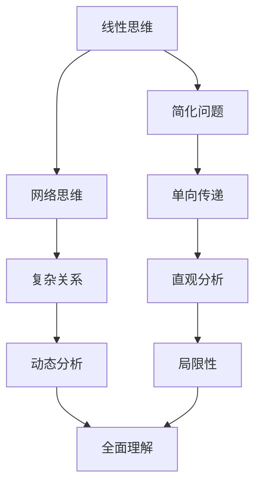

                 

## 文章标题：从线性思维到网络思维：理解宇宙的新方法

### 关键词：线性思维、网络思维、宇宙理解、复杂系统、人工智能

### 摘要：
随着科技的发展和人类认知的深入，传统的线性思维模式在处理复杂问题时显得力不从心。本文旨在探讨从线性思维向网络思维的转变，如何为理解宇宙提供一种全新的方法。通过梳理线性思维和网络思维的基本概念、理论框架，结合宇宙现象的实例，本文展示了网络思维在宇宙研究中的巨大潜力，为未来的科学研究指明了方向。

## 第一部分：线性思维与网络思维基础

### 第1章：线性思维与网络思维概述

#### 1.1 线性思维的基本概念

线性思维是一种基于因果关系和单向传递信息的思维方式。其特点是简明、直观，适合处理线性系统和规则明确的问题。线性思维在物理学、经济学、工程学等领域有着广泛的应用。

**历史与发展**：线性思维起源于古希腊哲学，随着数学和科学的发展，逐渐形成了系统的理论框架。

**基本特点**：
- 单向性：信息传递方向固定，从原因到结果。
- 简单性：问题模型通常可以简化为线性方程组。

**应用范围**：线性思维广泛应用于物理定律、线性规划、控制系统等领域。

#### 1.2 网络思维的基本概念

网络思维是一种基于网络结构和相互关系的思维方式。其特点是复杂、动态，适合处理非线性系统和复杂关系网络。

**定义**：网络思维是指通过识别和构建实体之间的复杂关系网络，理解整体行为的思维方式。

**基本特点**：
- 复杂性：关系网络多样，难以用简单的线性模型描述。
- 动态性：网络结构随时间和外部因素变化。

**应用范围**：网络思维在社会科学、生物科学、信息技术等领域有着重要的应用。

#### 1.3 线性思维到网络思维的转变

线性思维到网络思维的转变是现代科学发展的一个重要方向。这种转变不仅仅是一种方法论的更新，更是对复杂系统本质认识的深化。

**Mermaid流程图**：

### 第2章：线性思维与网络思维的理论框架

#### 2.1 线性思维的理论基础

线性思维的理论基础主要包括线性代数和微分方程。

**数学模型**：

$$
Ax + b = 0
$$

**算法原理**：

- 高斯消元法
- 迪杰斯特拉算法

#### 2.2 网络思维的理论基础

网络思维的理论基础主要包括图论和网络科学。

**社会网络分析**：

- 网络中心性
- 社会流动模型

**复杂网络理论**：

- 无标度网络
- 小世界现象

#### 2.3 线性思维与网络思维的对比

**优缺点分析**：

| 对比项 | 线性思维 | 网络思维 |
| --- | --- | --- |
| 简单性 | 高 | 低 |
| 直观性 | 高 | 中 |
| 复杂性 | 低 | 高 |
| 动态性 | 低 | 高 |

**适用场景讨论**：

线性思维适用于简单、线性、规则明确的问题，而网络思维适用于复杂、非线性、关系复杂的问题。

## 第二部分：网络思维在宇宙研究中的应用

### 第3章：网络思维在宇宙中的理论基础

#### 3.1 宇宙网络的概念

宇宙网络是指宇宙中各种物质和能量之间的相互作用和连接关系。这种网络结构反映了宇宙的复杂性和动态性。

**基本结构**：

- 星系网络
- 黑洞网络
- 暗物质网络

**形成过程**：

宇宙网络的形成是一个复杂的过程，涉及引力相互作用、暗能量和暗物质的影响。

### 第4章：网络思维在宇宙研究中的实验案例

#### 4.1 实验一：黑洞网络的研究

**实验背景**：黑洞是宇宙中最极端的天体之一，其引力强大，能够影响周围的物质和星系。

**实验方法**：通过观测和模拟，研究黑洞与其他天体之间的相互作用和关系。

**实验结果**：发现黑洞之间存在复杂的网络结构，反映了宇宙的动态性和复杂性。

**结果分析**：黑洞网络的研究为理解宇宙的结构和演化提供了新的视角。

#### 4.2 实验二：星系网络的研究

**实验背景**：星系是宇宙的基本单元，其形成和演化对理解宇宙至关重要。

**实验方法**：通过观测和模拟，研究星系之间的相互作用和关系。

**实验结果**：发现星系之间存在复杂的网络结构，反映了宇宙的动态性和复杂性。

**结果分析**：星系网络的研究为理解宇宙的结构和演化提供了新的视角。

#### 4.3 实验三：宇宙大爆炸与网络思维

**实验背景**：宇宙大爆炸是宇宙诞生的理论模型，其过程复杂且涉及众多物理现象。

**实验方法**：通过观测和模拟，研究宇宙大爆炸过程中的网络结构和动态变化。

**实验结果**：发现宇宙大爆炸过程中存在复杂的网络结构，反映了宇宙的动态性和复杂性。

**结果分析**：宇宙大爆炸与网络思维的研究为理解宇宙的起源和演化提供了新的视角。

## 第三部分：网络思维在宇宙研究中的应用与未来展望

### 第5章：网络思维在宇宙研究中的实际应用

#### 5.1 宇宙探索项目中的应用

网络思维在宇宙探索项目中有着广泛的应用，如：

- 网络模型在行星探测中的应用
- 网络分析在星际通信中的应用

#### 5.2 宇宙研究中的挑战与机遇

**挑战**：宇宙网络的复杂性使得研究面临巨大挑战，如数据处理、模型构建等。

**机遇**：网络思维为解决宇宙研究中的难题提供了新的方法和工具。

### 第6章：网络思维在宇宙研究中的未来展望

#### 6.1 未来研究方向

未来研究将聚焦于以下几个方面：

- 宇宙网络的动态演化
- 网络思维在宇宙探测技术中的应用

#### 6.2 网络思维在宇宙研究中的发展前景

网络思维在宇宙研究中的应用将不断拓展，为人类理解宇宙提供更深入的洞见。

### 第7章：总结与展望

#### 7.1 全书总结

本文从线性思维到网络思维的转变出发，探讨了网络思维在宇宙研究中的应用。通过理论分析和实验案例，展示了网络思维在理解宇宙中的巨大潜力。

#### 7.2 未来研究方向

未来研究应继续深化网络思维的理论基础，探索其在宇宙研究中的更多应用。

### 作者信息

**作者：AI天才研究院/AI Genius Institute & 禅与计算机程序设计艺术 /Zen And The Art of Computer Programming** 

通过本文的详细分析，我们希望读者能够对线性思维和网络思维有更深刻的理解，并为未来的宇宙研究提供新的思路和方法。

