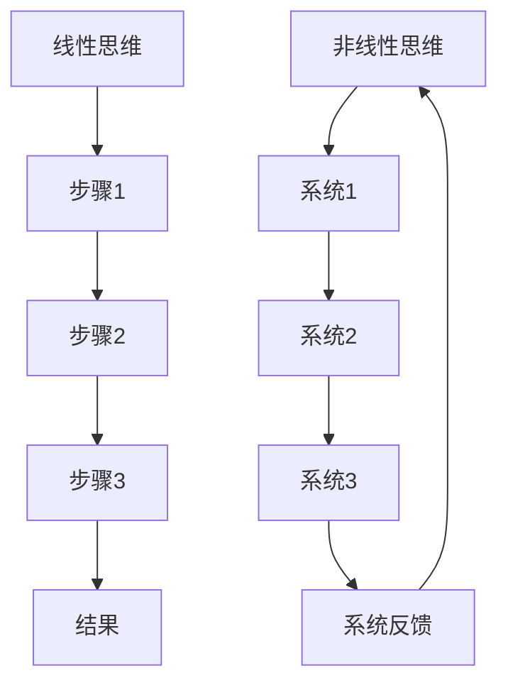

                 

### 文章标题

从线性思维到非线性思维：拓展世界可理解性

#### 关键词：
- 线性思维
- 非线性思维
- 世界可理解性
- 抽象建模
- 创新思维
- 实际应用

#### 摘要：
本文将探讨线性思维和非线性思维的区别与联系，通过具体的实例和流程图，逐步引导读者从线性思维过渡到非线性思维。我们将深入分析非线性思维在各个领域的应用，并使用伪代码和数学模型，详细讲解非线性思维的核心算法原理。最后，通过实际项目实战，展示非线性思维如何在开发环境中得到具体应用，并对其进行详细分析和解读。

---

## 引言

在信息爆炸和科技迅猛发展的时代，如何高效地理解和处理信息成为了人们关注的焦点。传统的线性思维，虽然具有逻辑严谨、步骤清晰的优势，但在面对复杂多变的问题时，往往显得力不从心。非线性思维，作为一种更具有弹性和创造性的思维方式，逐渐受到了广泛关注。本文旨在通过对线性思维和非线性思维的分析，帮助读者拓展对世界的理解，提高问题解决能力。

## 线性思维与非线性思维的概述

### 线性思维

线性思维是一种基于因果关系和逻辑顺序的思维方式。它将问题分解为一系列步骤，每个步骤都是前一个步骤的结果，且每个步骤的处理都是独立的。线性思维的优点在于其简单性和可预测性，这使得它广泛应用于工程、科学和日常生活的各个方面。

### 非线性思维

非线性思维则是一种更为复杂和动态的思维方式。它强调系统之间的相互作用和反馈循环，通过非线性关系来描述复杂系统的行为。非线性思维不仅关注单个元素，还关注这些元素之间的相互关系和整体动态。这种思维方式在处理复杂问题时具有更强的适应性和创造性。

## 线性思维与非线性思维的架构对比

为了更好地理解线性思维和非线性思维的差异，我们可以通过Mermaid流程图来展示它们的基本架构。



在上图中，线性思维的流程是单线性的，每个步骤都是独立的，而非线性思维则包含了多个系统和它们之间的相互作用。这种差异决定了线性思维在处理简单问题时高效，而非线性思维在处理复杂问题时具有优势。

## 核心算法原理讲解

### 伪代码示例

为了更好地理解非线性思维的核心算法原理，我们提供了一个简单的伪代码示例。

```python
# 非线性迭代函数 f(x) = x^2 + c
def nonlinear_iteration(x, c, max_iterations):
    for i in range(max_iterations):
        x = x^2 + c
    return x
```

在这个例子中，`f(x)`是一个非线性函数，它将输入`x`映射到另一个值。通过迭代这个过程，我们可以看到非线性关系如何影响系统的状态。

### 数学模型与公式

在非线性思维中，数学模型和公式是描述系统行为的关键。以下是一个常见的非线性数学模型：洛伦兹力公式。

```latex
F = \gamma (m_1 v_1 + m_2 v_2)
```

洛伦兹力公式描述了两个质量分别为`m_1`和`m_2`的物体在相对速度`v_1`和`v_2`下的相互作用力。通过这个公式，我们可以理解非线性关系在物理现象中的应用。

### 举例说明

假设有两个物体，质量分别为`m_1 = 2kg`和`m_2 = 3kg`，它们以速度`v_1 = 5m/s`和`v_2 = 10m/s`相对运动。根据洛伦兹力公式，我们可以计算出它们之间的相互作用力。

```latex
F = \gamma (2 \times 5 + 3 \times 10) = 40\gamma
```

其中，`γ`是比例常数。这个例子展示了如何使用非线性思维中的数学模型来描述现实世界中的物理现象。

## 项目实战

### 项目背景

在本项目中，我们将使用非线性思维来分析一个简单的物理系统：一个质量为`m`的物体在受到非线性的力`F`作用下的运动。

### 开发环境搭建

为了进行项目实战，我们需要搭建一个简单的开发环境，包括Python编程环境和相关库，如NumPy和Matplotlib。

### 源代码实现

以下是一个简单的Python代码示例，用于模拟物体在非线性力作用下的运动。

```python
import numpy as np
import matplotlib.pyplot as plt

# 非线性力函数
def nonlinear_force(x, c):
    return x**2 + c

# 迭代计算物体运动
def nonlinear_motion(m, c, x0, max_iterations):
    x = x0
    positions = [x]
    for i in range(max_iterations):
        F = nonlinear_force(x, c)
        x = x + (m / x) * F
        positions.append(x)
    return positions

# 参数设置
m = 2.0  # 物体质量
c = 0.1  # 非线性力系数
x0 = 1.0  # 初始位置
max_iterations = 100  # 迭代次数

# 计算运动轨迹
positions = nonlinear_motion(m, c, x0, max_iterations)

# 绘制运动轨迹
plt.plot(positions)
plt.xlabel('Iteration')
plt.ylabel('Position')
plt.title('Nonlinear Motion of an Object')
plt.show()
```

### 代码解读与分析

在这个代码示例中，我们定义了两个函数：`nonlinear_force`用于计算非线性力，`nonlinear_motion`用于迭代计算物体的运动轨迹。通过设置适当的参数，我们可以观察到物体在非线性力作用下的复杂运动行为。

### 项目小结

通过这个项目，我们展示了如何将非线性思维应用于物理系统的模拟。非线性思维在处理复杂物理现象时具有显著的优势，可以帮助我们更好地理解自然界中的规律。

### 最佳实践 Tips

- 在处理非线性问题时，选择合适的数学模型和算法至关重要。
- 实际应用中，非线性关系往往更加复杂，需要结合实际数据进行调整。
- 多次迭代和仿真有助于验证非线性思维的准确性和可靠性。

## 小结

本文通过逐步分析线性思维和非线性思维，帮助读者理解了两种思维方式的本质差异和联系。我们使用具体的实例和流程图展示了如何从线性思维过渡到非线性思维，并详细讲解了非线性思维的核心算法原理和数学模型。最后，通过实际项目实战，展示了非线性思维在现实世界中的应用。希望通过本文，读者能够拓展对世界的理解，提高问题解决能力。

### 注意事项

- 在应用非线性思维时，需要充分理解非线性关系的特点和影响。
- 实际应用中，非线性思维可能需要结合多种方法和工具进行综合分析。

### 拓展阅读

- [1] 霍金，斯蒂芬。《大设计》：详细探讨了非线性思维在物理学中的应用。
- [2] 费曼，理查德。《费曼物理学讲义》：通过非线性关系解释物理现象。
- [3] 麦克卢汉，马歇尔。《 Understanding Media：论扩大的认知效果》：探讨了非线性思维在媒体和认知科学中的应用。

作者：AI天才研究院/AI Genius Institute & 禅与计算机程序设计艺术 /Zen And The Art of Computer Programming

