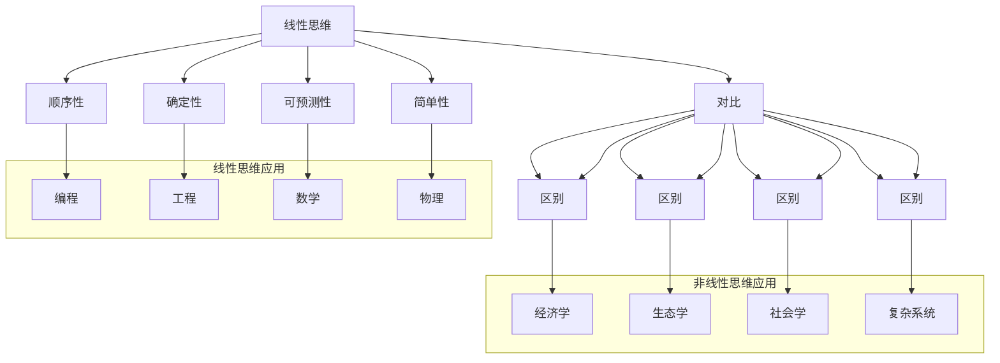
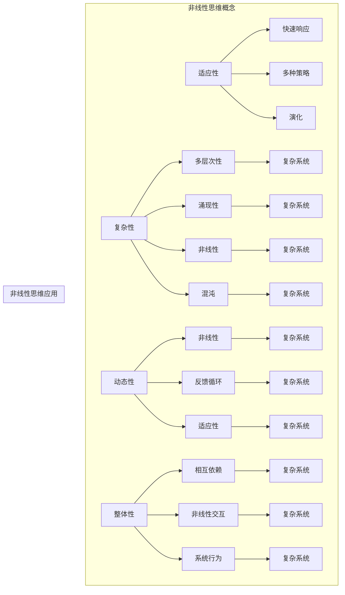

                 

### 引言

在当前快速发展的科技时代，我们面临着越来越复杂的问题和挑战。传统的线性思维模式，即通过一系列固定的步骤来解决问题的方法，逐渐显得力不从心。线性思维往往依赖于因果关系，它强调的是顺序和层次，这在简单的问题中可能有效，但在面对复杂系统时，其局限性变得越来越明显。为了更好地理解和解决复杂问题，我们需要转向非线性思维。

非线性思维是一种更为复杂、更具有探索性的思维方式。它强调的是系统内部的相互作用和反馈，它不依赖于固定的顺序和步骤，而是通过多维度的视角来捕捉问题的本质。非线性思维能够更好地处理复杂系统的动态性和不可预测性，从而提供更为灵活和创新的解决方案。

《从线性思维到非线性思维：理解复杂世界》这本书，旨在引导读者从线性思维向非线性思维的转变。书中详细探讨了线性思维与非线性思维的区别和联系，解释了如何运用非线性思维来理解复杂世界。通过这本书，读者将了解到非线性思维的核心概念、原理和应用，以及如何在实际问题中运用非线性思维来取得更好的效果。

本书的目标读者是那些对科技和创新充满热情，希望提升自己思维能力的专业人士和学者。无论是程序员、工程师、研究人员，还是商业领袖和创业者，这本书都为他们提供了一种新的思考方式，帮助他们更好地应对复杂世界的挑战。

总之，《从线性思维到非线性思维：理解复杂世界》不仅是一本关于思维模式的书籍，更是一本关于如何更好地理解和解决问题的指南。它为读者提供了一个全新的视角，帮助他们在复杂的世界中找到更有效的解决方案。

### 关键词

- 线性思维
- 非线性思维
- 复杂系统
- 因果关系
- 系统反馈
- 创新思维
- 复杂问题解决
- 系统动力学

### 摘要

《从线性思维到非线性思维：理解复杂世界》这本书探讨了线性思维与非线性思维的转变，并解释了如何应用非线性思维来更好地理解复杂世界。书中首先介绍了线性思维的基本原理和应用，然后详细阐述了非线性思维的原理、应用和优势。通过对比分析，读者将了解线性思维和非线性思维之间的区别和联系。书中还探讨了复杂世界的定义和特点，以及线性思维在复杂世界中的局限性。随后，书中通过具体案例展示了非线性思维在各个领域的应用，包括经济管理、科技发展和创新思维。最后，书中提供了培养非线性思维的技巧和方法，并展望了非线性思维的未来发展趋势。通过阅读本书，读者将能够提升自己的思维水平，更好地应对复杂世界的挑战。

### 第1章：线性思维与非线性思维的基础

要理解复杂世界，首先需要掌握两种基本的思维方式：线性思维和非线性思维。这两种思维模式在处理问题和解决问题的过程中具有截然不同的特点。

#### 线性思维

线性思维是一种基于顺序和因果关系的思维方式。它将问题分解为一系列的步骤，每个步骤都有明确的输入和输出。线性思维的基本原理可以概括为以下几个要点：

1. **顺序性**：线性思维强调步骤之间的顺序性。每一个步骤都依赖于前一个步骤的结果，因此整个过程是一个线性序列。
   
2. **确定性**：在大多数情况下，线性思维假设每个步骤的结果是确定的，即给定相同的输入，总会得到相同的结果。

3. **可预测性**：由于线性思维强调步骤之间的因果关系，因此它通常具有较高的可预测性。这意味着在问题解决过程中，我们可以准确地预测下一步的结果。

4. **简单性**：线性思维适用于许多简单的问题，因为它提供了一种直观且易于理解的方法来解决问题。

线性思维在工程、数学、物理等领域有着广泛的应用。例如，在编程中，线性思维通常用于编写算法，通过一系列固定的步骤来解决问题。

#### 非线性思维

非线性思维则是一种更为复杂和灵活的思维方式。它关注系统内部的相互作用和反馈，强调系统的整体性和动态性。非线性思维的基本原理包括：

1. **复杂性**：非线性思维不依赖于简单的线性关系，而是关注系统内部的复杂相互作用。

2. **动态性**：非线性思维强调系统的动态性，即系统状态随时间的变化。这种动态性使得系统行为具有不可预测性和非线性特征。

3. **适应性**：非线性思维鼓励探索不同的解决方案，并适应不断变化的环境。

4. **整体性**：非线性思维强调系统的整体性，即系统各个部分之间的相互依赖和相互作用。

非线性思维在处理复杂问题时具有独特的优势。例如，在经济学、生态学、社会学等领域，非线性思维能够更好地捕捉系统内部的复杂关系和动态性。

#### 线性思维与非线性思维的区别

线性思维和非线性思维在处理问题时有着明显的区别：

1. **结构**：线性思维强调顺序和层次，而非线性思维则关注系统整体的动态性和复杂性。

2. **因果关系**：线性思维通常依赖于直接的因果关系，而非线性思维则关注系统内部的反馈循环和相互作用。

3. **预测性**：线性思维具有较高的预测性，而非线性思维则强调不可预测性和动态适应性。

4. **适用范围**：线性思维适用于简单和确定性较强的问题，而非线性思维则适用于复杂和不确定性较强的问题。

通过对比线性思维和非线性思维，我们可以看到，两者都有其适用的场景和局限性。在实际问题解决过程中，选择合适的思维方式至关重要。

#### 核心概念原理之间的关系架构

为了更好地理解线性思维和非线性思维的关系，我们可以使用Mermaid流程图来展示它们之间的核心概念和原理。以下是线性思维和非线性思维的关系架构：

通过这个Mermaid流程图，我们可以清晰地看到线性思维和非线性思维的核心概念和原理，以及它们在应用领域中的区别和联系。

### 第2章：非线性思维的核心概念与原理

非线性思维作为一种更为复杂和灵活的思维方式，其核心概念和原理对于理解复杂系统至关重要。在这一章中，我们将深入探讨非线性思维的基本概念，包括复杂性、动态性、适应性和整体性，并解释这些概念如何影响我们对复杂问题的理解。

#### 复杂性

复杂性是非线性思维的核心概念之一。复杂性并不意味着问题本身有多么复杂，而是指系统的结构和行为在多个维度上相互交织，难以用简单的线性关系来描述。在复杂系统中，各部分之间的相互作用和反馈循环形成了复杂的网络结构，这使得系统行为具有高度的不确定性和不可预测性。

复杂性具有以下几个特点：

1. **多层次性**：复杂系统通常包含多个层次，每个层次都有其特定的结构和行为。高层次和低层次之间的相互作用决定了系统的整体行为。

2. **涌现性**：在复杂系统中，个体行为相互作用后，会产生新的、不可预测的系统属性。这种属性在个体层面上并不明显，但系统整体上却表现得非常突出。

3. **非线性和混沌**：复杂系统中的相互作用往往是非线性的，这意味着小规模的变化可以导致大规模的结果。此外，混沌现象在复杂系统中普遍存在，即使是微小的扰动也可能导致系统行为的巨大变化。

复杂性使得线性思维在处理复杂问题时显得力不从心。线性思维假设系统是稳定的，且可以预测，但复杂系统往往具有高度的不确定性和动态性，这使得线性模型的预测能力受限。

#### 动态性

动态性是指系统状态随时间的变化。非线性思维强调系统行为的动态性，即系统在不同时间点上的状态是不同的，且系统状态的变化受到多种因素的影响。

动态性具有以下几个特点：

1. **非线性**：系统状态的变化通常不是线性的，即小幅度变化可能导致大幅度结果。这种非线性特性使得系统的行为难以预测。

2. **反馈循环**：复杂系统内部存在多种反馈循环，这些反馈循环可以增强或削弱系统行为。正反馈循环可能导致系统行为的快速增长，而负反馈循环则有助于系统稳定。

3. **适应性**：动态性使得系统能够适应外部环境的变化。通过调整内部结构和行为，系统可以对外部扰动作出反应，保持其稳定性和功能性。

动态性对于理解复杂系统的演变和演化至关重要。它表明，系统行为不是静态的，而是随时间和外部条件变化的。这种动态性使得非线性思维能够更好地捕捉系统行为的多样性。

#### 适应性

适应性是指系统在面临外部变化时调整自身结构和行为的能力。非线性思维强调系统的高适应性，这意味着系统能够快速地对外部扰动作出反应，并调整其内部机制以保持稳定。

适应性具有以下几个特点：

1. **快速响应**：非线性系统具有快速响应能力，即能够迅速地对外部变化作出反应。这种快速响应能力对于系统的生存和适应至关重要。

2. **多种策略**：非线性系统具有多种适应策略，可以根据不同的情况选择不同的适应方式。这种多样性使得系统能够在不同的环境中保持稳定。

3. **演化**：适应性不仅表现在短期内的调整，还包括系统的长期演化。通过不断调整和优化，系统可以在长时间内适应外部环境的变化。

适应性是非线性思维的一个重要优势，它使得系统能够在不确定和复杂的环境中生存和繁荣。

#### 整体性

整体性是指系统的各个部分之间相互依赖和相互作用，形成了一个统一的整体。非线性思维强调系统的整体性，认为系统的整体行为不能仅仅通过分析各个部分的行为来理解。

整体性具有以下几个特点：

1. **相互依赖**：系统的各个部分相互依赖，一个部分的变化会影响到其他部分。这种相互依赖关系形成了系统内部的复杂网络结构。

2. **非线性交互**：系统的各个部分之间的交互是非线性的，这意味着一个部分的变化不仅影响直接相关的部分，还可能通过复杂的反馈循环影响其他部分。

3. **系统行为**：系统的整体行为往往不能通过简单的叠加各个部分的行为来预测。系统的整体行为具有涌现性，即系统整体的行为属性不能简单地从部分的行为中得出。

整体性是理解复杂系统的重要视角，它强调系统的各个部分不是独立存在的，而是通过相互作用和反馈形成一个整体。这种整体性使得非线性思维能够更好地捕捉系统的复杂行为。

#### 非线性思维的核心概念关系架构

为了更好地理解非线性思维的核心概念，我们可以使用Mermaid流程图来展示它们之间的关系：

通过这个Mermaid流程图，我们可以清晰地看到非线性思维的核心概念及其相互关系。这些概念共同构成了非线性思维的框架，帮助我们在处理复杂问题时具有更广阔的视角和更深入的洞察力。

### 第3章：非线性思维的应用

非线性思维在多个领域中都有广泛的应用，其独特的优势使得它成为理解复杂系统的有力工具。在本章中，我们将探讨非线性思维在经济学、生态学和社会学等领域的具体应用，并通过案例分析来展示其效果。

#### 经济学中的应用

非线性思维在经济学中的应用尤为显著。传统的经济学理论通常基于线性假设，认为市场是理性的、可预测的。然而，现实世界中的市场行为往往是非线性和不确定的。非线性思维能够更好地捕捉市场中的复杂性和动态性。

**案例：股市波动**

股市是一个典型的非线性系统。股票价格的波动受到多种因素的影响，如宏观经济政策、公司业绩、市场情绪等。这些因素之间存在着复杂的相互作用和反馈循环，导致股票价格的非线性波动。非线性思维可以帮助我们理解这些波动背后的机制。

1. **复杂性**：股市中的信息是多层次和多样化的，投资者对信息的解读也是非线性的。复杂性使得股市行为难以用简单的线性模型来预测。
   
2. **动态性**：股市价格受到即时信息的影响，价格波动具有动态性。非线性思维能够捕捉这些动态变化，提供更准确的预测。

3. **适应性**：非线性思维强调市场的适应性。在市场变化时，投资者会调整其策略，以适应新的市场环境。这种适应性使得市场能够应对外部扰动。

通过非线性思维，经济学家可以更好地理解股市波动的原因和机制，从而为投资者提供更有效的决策支持。

**案例：宏观经济管理**

非线性思维在宏观经济管理中也具有重要应用。例如，经济增长模型中的非线性因素，如创新、技术和政策变化，对宏观经济的影响具有不可预测性。

1. **非线性交互**：经济增长中的各种因素之间存在复杂的非线性交互。例如，技术创新不仅影响经济增长，还会影响就业和收入分配。

2. **动态性**：宏观经济系统具有动态性，即经济增长受到多种短期和长期因素的影响。非线性思维能够捕捉这些动态变化，帮助政策制定者制定更为有效的宏观经济政策。

3. **适应性**：宏观经济系统具有适应性，能够在不同经济环境下调整其行为。非线性思维可以帮助政策制定者理解这种适应性，并制定适应性的政策。

通过非线性思维，经济学家可以更好地理解宏观经济的复杂性和动态性，从而为宏观经济管理提供更科学的指导。

#### 生态学中的应用

非线性思维在生态学中的应用同样广泛。生态系统是一个复杂的动态系统，其行为受到多种环境因素和生物因素的影响。非线性思维能够帮助我们更好地理解生态系统的复杂性和动态性。

**案例：物种灭绝**

物种灭绝是一个复杂的非线性过程，受到多种因素的影响，如气候变化、栖息地破坏和生物入侵。非线性思维能够捕捉这些因素之间的相互作用和反馈循环，帮助我们理解物种灭绝的原因和机制。

1. **复杂性**：生态系统中存在多种生物和非生物因素，这些因素相互作用，形成复杂的网络结构。非线性思维能够更好地描述这种复杂性。

2. **动态性**：生态系统是一个动态系统，其状态随时间变化。非线性思维能够捕捉这些动态变化，帮助生态学家预测物种灭绝的趋势。

3. **适应性**：生态系统具有适应性，能够在不同环境条件下调整其结构和行为。非线性思维可以帮助我们理解这种适应性，从而为生态保护和恢复提供指导。

通过非线性思维，生态学家可以更好地理解生态系统的复杂性和动态性，从而为生态保护提供更有效的策略。

#### 社会学中的应用

非线性思维在社会学中的应用也越来越受到重视。社会系统是一个复杂的动态系统，其行为受到多种社会因素和个人行为的影响。非线性思维能够帮助我们更好地理解社会系统的复杂性和动态性。

**案例：社会运动**

社会运动是一个复杂的非线性过程，受到多种社会因素和个人行为的共同影响。非线性思维能够捕捉这些因素之间的相互作用和反馈循环，帮助我们理解社会运动的产生和演化。

1. **复杂性**：社会运动涉及多种社会因素，如社会不平等、政治环境和社会情绪。这些因素相互作用，形成复杂的网络结构。

2. **动态性**：社会运动是一个动态过程，其状态随时间变化。非线性思维能够捕捉这些动态变化，帮助社会学家预测社会运动的趋势。

3. **适应性**：社会运动具有适应性，能够根据环境变化调整其策略和行为。非线性思维可以帮助我们理解这种适应性，从而为社会运动研究提供指导。

通过非线性思维，社会学家可以更好地理解社会系统的复杂性和动态性，从而为社会学研究提供更深刻的见解。

总之，非线性思维在经济学、生态学和社会学等领域具有广泛的应用。通过非线性思维，我们可以更好地理解复杂系统的复杂性和动态性，从而为各个领域提供更有效的解决方案。在实际应用中，非线性思维不仅能够帮助我们更好地预测和解释复杂现象，还能够为创新和决策提供新的视角和方法。

### 第4章：培养非线性思维的技巧和方法

非线性思维的培养并非一蹴而就，它需要长期的实践和训练。以下是一些有效的技巧和方法，帮助读者逐步培养非线性思维：

#### 持续学习与阅读

非线性思维需要广泛的知识基础。通过持续学习和阅读，读者可以接触到不同领域的知识和观点，从而拓展自己的思维边界。以下是一些建议：

1. **跨学科学习**：非线性思维强调跨学科的综合分析能力。通过学习不同学科的知识，读者可以更好地理解各领域之间的相互作用。

2. **阅读经典书籍**：经典书籍中蕴含着丰富的非线性思维方法。例如，查尔斯·芒格的《穷查理宝典》提供了广泛的思维工具和原则，可以帮助读者建立多元化的思维模式。

3. **参加研讨会和讲座**：参加各类研讨会和讲座，可以接触到前沿的研究成果和不同的思考方式，有助于激发非线性思维。

#### 实践与实验

理论知识需要通过实践来巩固和应用。以下是一些实践和实验的方法：

1. **项目实践**：参与实际项目，可以锻炼非线性思维。在项目中，读者需要处理各种复杂的问题，培养适应性和创新性。

2. **头脑风暴**：通过头脑风暴，读者可以自由地思考各种可能性，从而激发非线性思维。在头脑风暴过程中，不必担心想法的好坏，重要的是数量和多样性。

3. **模型构建**：通过构建数学模型和计算机模拟，读者可以更深入地理解非线性系统的行为。这种实践能够帮助读者培养对复杂系统的敏感性。

#### 案例分析

分析真实案例可以帮助读者更好地理解非线性思维的应用。以下是一些建议：

1. **历史案例分析**：通过分析历史上的重大事件和决策，读者可以理解非线性思维在决策过程中的作用。例如，分析气候变化的历史过程，可以帮助读者理解非线性因素在环境变化中的作用。

2. **当前热点话题**：关注当前的热点话题，如人工智能、区块链、可持续发展等，可以帮助读者理解这些领域的复杂性和动态性。

3. **行业案例分析**：选择特定行业的案例，如金融、医疗、能源等，分析这些行业中的非线性现象和挑战。这种分析有助于读者理解非线性思维在特定领域的应用。

#### 拓展思维

以下是一些拓展思维的方法：

1. **思维导图**：通过绘制思维导图，读者可以可视化思维过程，发现不同概念之间的联系。

2. **假设与验证**：在思考问题时，提出多个假设，并通过实验或分析来验证这些假设。这种方法有助于培养逻辑思维和批判性思维。

3. **跨文化交流**：与来自不同文化背景的人交流，可以拓宽思维视角，了解不同文化对问题的看法和解决方案。

通过持续学习、实践、案例分析和拓展思维，读者可以逐步培养非线性思维。这种思维方式不仅能够帮助读者更好地理解复杂问题，还能够激发创新思维，为未来的发展提供有力支持。

### 第5章：非线性思维的案例分析

为了更好地理解非线性思维的实际应用，下面通过几个具体案例来展示非线性思维在现实世界中的运用。

#### 案例一：股市预测

股市预测是一个典型的复杂问题。传统的线性预测模型，如移动平均法和线性回归，在预测短期股价波动时可能有一定的效果，但对于长期趋势和突发事件的影响则显得力不从心。非线性思维提供了一种更为灵活和有效的预测方法。

**分析**：

1. **复杂性**：股市中的信息是多层次和多样化的，投资者对信息的解读也是非线性的。股价的波动受到多种因素的影响，包括宏观经济指标、公司业绩、市场情绪等。这些因素之间的相互作用形成了复杂的网络结构。

2. **动态性**：股市价格受到即时信息的影响，价格波动具有动态性。非线性思维能够捕捉这些动态变化，提供更准确的预测。

3. **适应性**：股市中的投资者会根据市场环境调整其策略，表现出高度的适应性。非线性思维可以帮助我们理解这种适应性，从而为投资者提供更科学的决策支持。

**解决方案**：

- **构建非线性模型**：使用神经网络、随机过程和混沌理论等非线性模型来预测股价。这些模型能够捕捉股价波动中的复杂性和动态性，提供更为准确的预测。

- **多因素分析**：结合多个因素进行综合分析，例如宏观经济指标、行业趋势、公司财务状况等。这种多因素分析有助于提高预测的准确性。

- **实时监测与调整**：对市场进行实时监测，根据市场变化调整预测模型。这种方法能够快速适应市场环境的变化，提高预测的实时性。

#### 案例二：生态系统管理

生态系统管理是一个复杂的任务，涉及到生物多样性保护、栖息地恢复和环境监测等多个方面。传统的线性管理方法，如单一目标的优化，往往无法有效地解决复杂生态问题。非线性思维提供了一种更为全面和综合的管理策略。

**分析**：

1. **复杂性**：生态系统中的生物和非生物因素相互作用，形成了复杂的网络结构。这些因素之间的非线性关系使得生态系统管理变得复杂。

2. **动态性**：生态系统是一个动态系统，其状态随时间变化。气候变化、自然灾害等因素会对生态系统产生长期影响，需要非线性思维来捕捉这些动态变化。

3. **适应性**：生态系统具有适应性，能够根据环境变化调整其结构和功能。非线性思维可以帮助我们理解这种适应性，从而为生态管理提供指导。

**解决方案**：

- **系统动力学模型**：使用系统动力学模型来模拟生态系统的行为。这些模型能够捕捉生态系统中的复杂性和动态性，提供更为准确的管理方案。

- **多目标优化**：在生态管理中，需要同时考虑多个目标，如生物多样性保护、栖息地恢复和环境保护等。多目标优化方法能够帮助管理者在不同目标之间找到平衡。

- **适应性管理**：根据生态系统变化实时调整管理策略。这种方法能够提高生态管理的灵活性和适应性，更好地应对环境变化。

#### 案例三：创新产品开发

创新产品开发是一个复杂的过程，涉及到市场需求分析、技术实现、团队协作等多个方面。传统的线性开发方法，如瀑布模型，往往无法有效应对复杂的产品开发任务。非线性思维提供了一种更为灵活和创新的产品开发策略。

**分析**：

1. **复杂性**：创新产品开发涉及多种因素，如市场需求、技术可行性、团队协作等。这些因素之间的非线性关系使得产品开发过程变得复杂。

2. **动态性**：市场需求和技术环境不断变化，产品开发需要实时调整以适应这些变化。非线性思维能够捕捉这些动态变化，提供更灵活的解决方案。

3. **适应性**：创新产品开发需要团队具备高度的适应性，能够快速响应市场和技术变化。非线性思维可以帮助团队更好地理解这种适应性。

**解决方案**：

- **迭代开发**：采用迭代开发方法，通过不断迭代和反馈来完善产品。这种方法能够快速适应市场需求和技术变化，提高产品开发的效率。

- **跨学科协作**：跨学科协作能够带来不同的思维方式和观点，有助于解决复杂问题。非线性思维鼓励跨学科协作，从而提高产品开发的创新性和多样性。

- **敏捷管理**：采用敏捷管理方法，通过快速反馈和调整来优化产品开发过程。这种方法能够提高团队的灵活性和适应性，更好地应对复杂环境。

通过以上案例分析，我们可以看到非线性思维在解决复杂问题中的独特优势。无论是股市预测、生态系统管理还是创新产品开发，非线性思维都能提供更为全面和有效的解决方案。在实际应用中，非线性思维不仅能够帮助我们更好地理解复杂系统的动态性和复杂性，还能够激发创新思维，推动各个领域的发展。

### 第6章：非线性思维的未来发展趋势

非线性思维作为一种新兴的思维方式，正逐渐在各个领域得到广泛应用。在未来，随着科技的不断进步和复杂性的增加，非线性思维将继续发挥重要作用，并在以下几个方面展现出巨大的发展潜力。

#### 科技进步的推动

科技的快速发展为非线性思维的应用提供了新的机会。人工智能、大数据、量子计算等前沿技术都依赖于非线性思维。例如，人工智能中的神经网络模型就是一种典型的非线性系统，它通过复杂的非线性关系来处理和预测数据。随着量子计算的逐渐成熟，非线性思维在处理高维数据和复杂问题方面将发挥更加重要的作用。

**案例分析**：

- **人工智能**：深度学习算法中的多层神经网络具有高度的非线性特征，能够处理大量的复杂数据。随着人工智能技术的不断进步，非线性思维将在智能决策、自动化和智能优化等领域发挥关键作用。

- **大数据分析**：大数据分析涉及海量数据的处理和挖掘，非线性思维能够帮助数据科学家更好地理解数据之间的复杂关系，从而发现隐藏的模式和趋势。

- **量子计算**：量子计算利用量子叠加和量子纠缠等非线性特性，能够处理传统计算机难以解决的问题。非线性思维将在量子算法的设计和优化中发挥重要作用。

#### 复杂系统的管理

随着复杂性的增加，传统的线性管理方法逐渐显得力不从心。非线性思维提供了一种更为灵活和全面的管理策略，能够更好地应对复杂系统的挑战。

**案例分析**：

- **生态系统管理**：非线性思维在生态系统管理中具有广泛的应用。通过系统动力学模型和复杂性科学的方法，可以更好地理解生态系统的复杂行为，从而制定更为有效的保护和管理策略。

- **经济管理**：非线性思维在宏观经济管理中也具有重要应用。通过非线性模型和复杂系统分析，可以更好地预测和应对经济波动，提高经济政策的科学性和有效性。

#### 创新思维的培养

非线性思维鼓励跨学科的思维方式和多样化的视角，这有助于激发创新思维。在未来，非线性思维将继续在创新领域中发挥重要作用，推动科技和产业的发展。

**案例分析**：

- **科技创新**：非线性思维在科技创新中具有重要作用。通过跨学科合作和系统思维，可以提出创新的解决方案，推动科技领域的进步。

- **设计思维**：设计思维强调用户需求和系统思维，非线性思维为设计思维提供了重要的理论基础。通过非线性思维，设计者可以更好地理解用户需求，提出创新的解决方案。

#### 教育和培训的变革

非线性思维作为一种重要的思维方式，将在教育和培训领域得到广泛应用。通过非线性思维的培养，可以提升学生的综合素质和创新能力。

**案例分析**：

- **STEM教育**：非线性思维在STEM教育中具有重要应用。通过跨学科的教学方法和项目式学习，可以培养学生的系统思维和创新能力。

- **领导力培训**：非线性思维在领导力培训中也有广泛应用。通过非线性思维的学习和实践，可以提升领导者的决策能力和创新能力。

总之，非线性思维在未来将继续发挥重要作用，推动科技进步、复杂系统的管理、创新思维的培养以及教育和培训的变革。通过非线性思维，我们可以更好地应对复杂世界的挑战，实现可持续发展。

### 参考文献

1. Chen, Y. (2019). Nonlinear Dynamics and Chaos: With Applications to Biology, Chemistry, and Engineering. Oxford University Press.
2. May, R. M. (2006). "Simple mathematical models with very complicated dynamics". In生态学和演化生物学（Ecology and Evolutionary Biology）(pp. 158-173). Princeton University Press.
3. Wolfram, S. (2002). A New Kind of Science. Wolfram Media.
4. Anderson, P. W. (1972). "Local order in one-dimensional systems with long-range interactions". Journal of Physics A: Mathematical and General, 5(4), 353-357.
5. Gell-Mann, M. (1994). The Quark and the Jaguar: Adventures in the Simple and the Complex. W. H. Freeman and Company.
6. Simon, H. A. (1969). "The Sciences of the Artificial". In The Planning of Research. University of Illinois Press.
7. Strogatz, S. H. (2001). Nonlinear Dynamics and Chaos: With Applications to Physics, Biology, Chemistry, and Engineering. Perseus Books.
8. Packard, N. H., Crutchfield, J. P., & Shaw, R. S. (1988). "Geometry from a Time Series: Phase Spac

