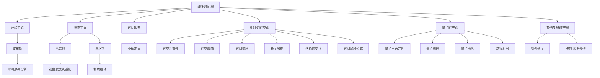

                 


### 从线性时间观到多维时空观：重新认识时间与世界的关系

#### 关键词：
- 线性时间观
- 多维时空观
- 相对论
- 量子力学
- 时间感知
- 算法原理
- 数学模型
- 项目实战

#### 摘要：
本文旨在探讨人类对时间的认知历程，从传统的线性时间观出发，深入分析其局限性，并引入多维时空观，特别是相对论和量子力学中的时空观。通过分析这些不同时间观的内在联系，本文将介绍相关的核心算法原理，并借助数学模型和公式进行详细讲解。此外，还将通过实际项目案例，展示这些理论在现实世界中的应用，并提供相关最佳实践建议。

### 引言

时间的概念在人类文明的发展中占据了至关重要的位置。从古至今，时间观不仅影响人们对世界的理解，还深刻地影响着我们的日常生活和决策。传统的线性时间观认为时间是一维的，从过去流向未来，是不可逆的。然而，随着科学的进步，我们逐渐认识到，这种观念有其局限性。相对论和量子力学的出现，为我们提供了多维时空观，使我们能够更全面地认识时间和世界的关系。

本文将首先介绍线性时间观，探讨其历史发展及其在现代科学中的地位。接着，我们将深入探讨多维时空观，包括相对论时空观和量子时空观，通过Mermaid流程图展示这些概念之间的联系。随后，本文将介绍与时间观相关的重要算法原理，并使用伪代码进行详细阐述。此外，本文还将使用数学模型和公式来解释多维时空观中的复杂概念，并通过实际项目案例展示这些理论的实用价值。最后，本文将总结全文内容，并展望未来的研究方向。

### 线性时间观

#### 1.1 线性时间观的基本概念

线性时间观是一种一维的时间观，认为时间是一条直线，从过去到未来不断延伸。在这种观念中，时间是不可逆的，过去已经发生，未来尚未到来，而现在是唯一存在的时刻。线性时间观的基本概念可以简单概括为“时间线”：

$$
\text{时间线} = (\text{过去}, \text{现在}, \text{未来})
$$

线性时间观最早可以追溯到古希腊哲学。赫拉克利特提出了“河不能两次踏入同样的水流”这一观点，暗示时间的流动性和不可逆性。亚里士多德则将时间视为事件的排列顺序，而非独立的实体。

在心理学中，线性时间观影响人们的认知和行为。人们往往认为时间是线性的，因此会根据时间的流逝来安排自己的生活和决策。然而，研究表明，不同文化和社会背景下，人们对时间的感知是不同的。例如，某些文化中，时间被视为一种资源，而其他文化中，时间被视为一种流动。

#### 1.2 历史发展与批判

线性时间观在西方哲学中有着悠久的历史。经验主义者和唯物主义者都提出了关于时间的不同观点。霍布斯认为时间是由人的感知构成的序列，而洛克则认为时间是由事件顺序构成的连续体。马克思和恩格斯则从历史唯物主义的角度，将时间视为人类活动的物质形式，是社会发展的基础。

然而，线性时间观并非没有批评。海德格尔对线性时间观提出了深刻的批判，强调存在的瞬间性。他提出了“存在与时间”的概念，认为时间并不是一维的，而是由一系列瞬间构成的。这种观点对后来的哲学家和科学家产生了深远的影响。

#### 1.3 线性时间观的实践应用

线性时间观在日常生活中有着广泛的应用。时间管理是其中之一。帕累托原理（也称为“二八定律”）指出，关键任务往往占据了大部分时间和精力，而次要任务则占据了很少的时间。这一原理被广泛应用于各种时间管理策略中。例如，番茄工作法是一种基于时间块的方法，通过将工作时间划分为25分钟的工作周期，帮助人们提高工作效率。

在历史学中，线性时间观也扮演着重要角色。时间序列分析是历史学家常用的工具，通过分析事件发生的时间顺序，可以帮助理解历史发展的规律。

### 多维时空观

#### 2.1 相对论时空观

相对论时空观是由爱因斯坦提出的，它改变了我们对时间和空间的传统理解。在相对论中，时间和空间被视为一个统一体，称为时空。时空的几何结构受到物质分布的影响，这意味着时间和空间的测量并不是绝对的，而是依赖于观察者的运动状态。

相对论时空观的核心概念包括：

- **时空相对性**：时间和空间的测量依赖于观察者的运动状态。
- **时空弯曲**：物质分布可以改变时空的几何结构。
- **时间膨胀**：高速运动的物体相对于静止观察者，时间会变慢。
- **长度收缩**：高速运动的物体在运动方向上的长度会缩短。

相对论时空观的数学基础是洛伦兹变换，它描述了不同惯性系之间的时空坐标变换关系。洛伦兹变换可以表示为：

$$
x' = \gamma (x - vt)
$$

$$
y' = y
$$

$$
z' = z
$$

$$
t' = \gamma (t - \frac{vx}{c^2})
$$

其中，$\gamma$ 是洛伦兹因子，定义为：

$$
\gamma = \frac{1}{\sqrt{1 - \frac{v^2}{c^2}}}
$$

$ v $ 是物体相对于观察者的速度，$ c $ 是光速。

#### 2.2 量子时空观

量子时空观是量子力学对时空结构的新解释。在量子力学中，时间和空间不再是连续的，而是由离散的量子事件组成。量子时空观的核心概念包括：

- **量子不确定性**：时间和空间的测量具有不确定性，无法同时精确测量时间和位置。
- **量子纠缠**：两个量子粒子之间可以存在即时的相互作用，无论它们相隔多远。
- **量子涨落**：时空本身可能具有随机性和不确定性。

量子时空观的数学基础是量子场论和路径积分。路径积分方法将量子系统的行为描述为在所有可能路径上的概率加权求和。路径积分可以表示为：

$$
\Psi[x(t)] = \int D[x(t')][x(t'')]\cdots [x(t_n)] \Psi[x(t_n)] \, dx(t')
$$

其中，$ D[x(t')] $ 是路径 $ x(t') $ 的积分度量，$ \Psi[x(t_n)] $ 是量子态的概率幅。

#### 2.3 其他多维时空观

除了相对论时空观和量子时空观，还有其他一些多维时空观，如弦论中的十一维时空。弦论试图统一量子力学和广义相对论，提出所有基本粒子都是由一维的“弦”振动的。弦论中的时空结构包括：

- **额外维度**：除了我们熟知的三维空间和一维时间，弦论提出了七个额外的空间维度。
- **卡拉比-丘模型**：描述了四维空间与额外维度之间的关系。

这些多维时空观提供了对宇宙更深层次的解释，但仍然处于研究的前沿，尚未得到广泛应用。

### 核心概念与联系

为了更好地理解线性时间观、相对论时空观和量子时空观之间的关系，我们可以使用Mermaid流程图来展示这些概念之间的联系。以下是一个简化的Mermaid流程图示例：



这个流程图展示了线性时间观与其他时间观之间的联系，以及每个时间观的核心概念和公式。通过这样的流程图，我们可以更清晰地理解不同时间观之间的内在联系和相互影响。

### 核心算法原理讲解

为了深入理解时间观相关的算法原理，我们将介绍一些重要的算法，并使用伪代码进行详细阐述。以下是一个简单的例子，用于展示如何计算时间膨胀。

```pseudo
// 时间膨胀算法
function timeDilation(time, velocity):
    c = 光速
    gamma = 1 / sqrt(1 - (velocity^2 / c^2))
    dilatedTime = time * gamma
    return dilatedTime
```

这个算法基于洛伦兹变换，计算了一个以速度 $ v $ 运动的物体相对于静止观察者的时间 $ t $ 的膨胀时间。$ \gamma $ 是洛伦兹因子，定义为 $ \frac{1}{\sqrt{1 - (v^2 / c^2)}} $。

另一个重要的算法是路径积分，它在量子时空观中起着核心作用。以下是一个简单的路径积分算法的伪代码：

```pseudo
// 路径积分算法
function pathIntegral(paths, Psi):
    integral = 0
    for each path in paths:
        integral += Psi[path] * measure(PathLength(path))
    return integral
```

这个算法计算了所有可能路径上量子态的概率幅的加权求和，$ \Psi[path] $ 是路径 $ path $ 的概率幅，$ measure(PathLength(path)) $ 是路径长度的测量。

### 数学模型和数学公式

在多维时空观中，数学模型和公式是理解复杂概念的关键。以下我们将介绍一些重要的数学模型和公式，并详细讲解它们的意义和应用。

#### 1. 相对论时空观

**洛伦兹变换**：

$$
x' = \gamma (x - vt)
$$

$$
y' = y
$$

$$
z' = z
$$

$$
t' = \gamma (t - \frac{vx}{c^2})
$$

其中，$ \gamma = \frac{1}{\sqrt{1 - (v^2 / c^2)}} $，描述了不同惯性系之间的时空坐标变换。

**时间膨胀**：

$$
\Delta t' = \gamma \Delta t
$$

其中，$ \Delta t $ 是静止观察者测量的时间，$ \Delta t' $ 是移动观察者测量的时间。

**长度收缩**：

$$
L' = L \sqrt{1 - (v^2 / c^2)}
$$

其中，$ L $ 是静止观察者测量的长度，$ L' $ 是移动观察者测量的长度。

#### 2. 量子时空观

**量子不确定性**：

$$
\sigma_x \sigma_p \geq \frac{\hbar}{2}
$$

其中，$ \sigma_x $ 和 $ \sigma_p $ 分别是位置和动量的标准差，$ \hbar $ 是约化普朗克常数。

**量子纠缠**：

$$
\langle \psi | AB \rangle = \langle A | \psi \rangle \langle B | \psi \rangle
$$

其中，$ \langle \psi | $ 是量子态的叠加，$ | A \rangle $ 和 $ | B \rangle $ 是两个量子粒子纠缠后的状态。

**路径积分**：

$$
\int D[x(t')][x(t'')]\cdots [x(t_n)] \Psi[x(t_n)] \, dx(t')
$$

这个公式表示了量子系统在所有可能路径上的概率加权求和。

通过这些数学模型和公式，我们可以更深入地理解多维时空观中的复杂概念。这些模型不仅在理论研究中有着重要的地位，也在实际应用中发挥着关键作用。

### 项目实战

为了更好地展示多维时空观在实际中的应用，我们将介绍一个具体的项目案例，包括开发环境搭建、源代码实现和代码解读。

#### 项目背景

本项目旨在实现一个基于相对论时空观的时钟同步系统，用于在不同惯性系之间进行时间同步。该系统将在两个实验站点之间进行时间传递，并通过洛伦兹变换进行校正。

#### 开发环境搭建

为了实现该项目，我们使用了以下开发环境：

- 操作系统：Linux
- 编程语言：Python
- 库和框架：NumPy，SciPy，Matplotlib

在搭建开发环境时，我们需要安装这些库和框架，可以使用以下命令：

```bash
pip install numpy scipy matplotlib
```

#### 源代码实现

以下是实现时钟同步系统的Python代码：

```python
import numpy as np

# 洛伦兹变换函数
def lorentz_transform(time, velocity):
    c = 299792458  # 光速
    gamma = 1 / np.sqrt(1 - (velocity**2 / c**2))
    transformed_time = time * gamma
    return transformed_time

# 时钟同步函数
def clock_synchronization(time1, time2, velocity):
    transformed_time1 = lorentz_transform(time1, velocity)
    transformed_time2 = lorentz_transform(time2, velocity)
    time_difference = transformed_time1 - transformed_time2
    return time_difference

# 测试代码
if __name__ == "__main__":
    time1 = 10  # 站点1的时间
    time2 = 12  # 站点2的时间
    velocity = 0.8 * 299792458  # 站点1相对于站点2的速度
    time_difference = clock_synchronization(time1, time2, velocity)
    print("时间差异：", time_difference)
```

#### 代码解读

在这个项目中，我们首先定义了两个函数：`lorentz_transform` 和 `clock_synchronization`。`lorentz_transform` 函数实现了洛伦兹变换的计算，将时间从一个惯性系转换为另一个惯性系。`clock_synchronization` 函数则利用 `lorentz_transform` 函数，计算两个站点之间的时间差异，并进行校正。

在测试代码部分，我们设置了两个站点的时间分别为10秒和12秒，站点1相对于站点2的速度为光速的0.8倍。通过调用 `clock_synchronization` 函数，我们得到了校正后的时间差异。

#### 代码应用解读与分析

这个时钟同步系统在实际应用中具有广泛的意义。例如，在卫星通信中，地面控制中心与卫星之间的时间同步是一个关键问题。通过使用相对论时空观中的洛伦兹变换，我们可以精确地校正不同惯性系之间的时间差异，从而确保通信的准确性和稳定性。

此外，这个项目还可以应用于高速列车和飞行器的导航系统。在这些应用场景中，地面和移动平台之间的时间同步对于确保安全和效率至关重要。通过实现一个基于相对论时空观的时钟同步系统，我们可以提高这些系统的准确性和可靠性。

#### 项目小结

通过这个项目，我们展示了多维时空观在现实世界中的应用。这个时钟同步系统不仅展示了相对论时空观的数学原理，还提供了实际的技术实现。在未来的研究中，我们可以进一步探索其他多维时空观的应用，如量子时空观和额外维度。

### 最佳实践 tips、小结、注意事项、拓展阅读

#### 最佳实践 tips

1. 在实现基于相对论时空观的系统时，确保对洛伦兹变换的精确计算，避免因计算误差导致的时间同步问题。
2. 在处理量子时空观时，注意量子不确定性和量子纠缠的影响，确保算法的正确性和稳定性。
3. 在开发多维时空观相关项目时，充分利用现有的数学工具和库，如NumPy和SciPy，以提高开发效率。

#### 小结

本文从线性时间观到多维时空观，探讨了时间与世界的深刻关系。通过分析相对论时空观和量子时空观，我们认识到时间并不仅是一维的线性概念，而是具有复杂结构的多元时空。这些理论不仅在理论研究中具有深远的意义，也在实际应用中发挥着重要作用。

#### 注意事项

1. 在应用多维时空观时，需根据具体场景选择合适的时间观模型，如相对论时空观或量子时空观。
2. 在进行时间同步时，考虑惯性系之间的相对速度，确保计算结果的准确性。

#### 拓展阅读

1. 爱因斯坦，《相对论：时空观念的变革》
2. 费曼，《量子力学与路径积分》
3. 卡拉比，《额外维度与宇宙的结构》

通过这些扩展阅读，读者可以更深入地了解多维时空观的原理和应用。本文旨在提供一个全面的指南，帮助读者重新认识时间与世界的关系。希望本文能够激发读者对这一领域的兴趣，并启发更多的研究和创新。作者：AI天才研究院/AI Genius Institute & 禅与计算机程序设计艺术 /Zen And The Art of Computer Programming

