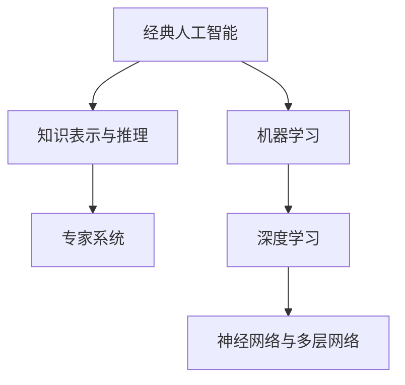

                 

# 从经典人工智能到深度学习：机器理解世界的范式转换

## 关键词
- 人工智能
- 深度学习
- 经典算法
- 范式转换
- 机器理解

## 摘要
本文旨在探讨从经典人工智能到深度学习的演变过程，解释这两种范式之间的联系与区别，并通过详细的算法原理讲解、数学模型分析以及实际项目实战，揭示深度学习如何实现机器对世界的深入理解。文章将逐步展开，首先回顾经典人工智能的发展历程，然后深入剖析深度学习的核心算法原理，接着通过数学模型和公式展示其理论基础，最后通过一个实际项目实例来验证深度学习的应用效果。

### 引言

### 1. 背景与目的
经典人工智能（AI）自20世纪50年代诞生以来，经历了数十年的发展，虽然取得了一些成就，但始终面临着理解力不足的瓶颈。深度学习作为一种新型的机器学习技术，近年来在图像识别、自然语言处理等领域取得了令人瞩目的突破，使得机器开始展现出类似人类的理解能力。本文旨在探讨这一范式转换的内在逻辑，解释深度学习如何改变了机器理解世界的方式。

### 2. 研究意义与贡献
深度学习作为人工智能领域的一个重要分支，对计算机科学和实际应用都产生了深远的影响。本文通过对深度学习核心概念、算法原理和数学模型的详细阐述，旨在为读者提供一幅清晰的认识框架，帮助他们更好地理解这一技术的本质和应用。

### 3. 书籍结构与内容概览
本文分为六个主要章节：第1章引言，第2章核心概念与联系，第3章核心算法原理讲解，第4章数学模型和数学公式，第5章项目实战，第6章结论与展望。每一章节都旨在从不同角度深入探讨深度学习，帮助读者全面理解这一前沿技术。

### 第2章：核心概念与联系

### 2.1 人工智能概述
人工智能（AI）是计算机科学的一个分支，旨在开发使计算机能够执行通常需要人类智能才能完成的任务的系统。人工智能可以分为多个子领域，包括机器学习、自然语言处理、计算机视觉等。

### 2.2 经典人工智能与深度学习
经典人工智能（Classic AI）依赖于符号推理和知识表示，强调逻辑和规则的应用。深度学习（Deep Learning）则是基于人工神经网络的机器学习技术，通过多层网络结构自动提取特征，实现高度复杂的模式识别任务。

### 2.3 经典人工智能与深度学习的联系与区别
经典人工智能和深度学习在目标和实现方法上有显著差异。经典人工智能依赖于显式规则和知识表示，而深度学习通过数据驱动的方式自动学习特征。此外，深度学习在计算能力和数据规模的支持下，实现了对复杂数据的高效处理和准确理解。

### 2.4 Mermaid流程图：经典人工智能到深度学习的转换

### 第3章：核心算法原理讲解

### 3.1 深度学习基础算法
深度学习的基础算法是人工神经网络（Artificial Neural Networks, ANNs）。ANN由大量的简单处理单元（神经元）组成，通过调整权重和偏置来学习数据中的特征。

### 3.2 神经网络架构
神经网络可以分为多层，包括输入层、隐藏层和输出层。每层中的神经元通过前一层神经元的输出进行加权求和，并经过激活函数处理，最终产生输出。

### 3.3 算法原理讲解与伪代码
```python
# 伪代码：神经网络正向传播
for each layer l from input to output:
    z[l] = sum(W[l][m] * a[l-1][m] for m in neurons) + b[l]
    a[l] = activation_function(z[l])

return a[output]
```
### 第4章：数学模型和数学公式

### 4.1 神经网络中的数学模型
神经网络的数学模型主要包括输入层、权重、偏置和激活函数。通过矩阵运算和求导，可以计算出神经网络的输出。

### 4.2 损失函数与优化算法
损失函数用于衡量预测结果与真实结果之间的差距。常用的优化算法包括梯度下降（Gradient Descent）和其变种，如Adam优化器。

### 4.3 模型评估指标
模型评估指标包括准确率（Accuracy）、精度（Precision）、召回率（Recall）和F1分数（F1 Score）等，用于衡量模型的性能。

### 4.4 LaTeX公式示例
$$
z_l = \sum_{m=1}^{n} W_{lm}a_{l-1,m} + b_l
$$

$$
a_l = \text{激活函数}(z_l)
$$

### 第5章：项目实战

### 5.1 实战项目简介
本文将通过一个实际项目——手写数字识别，来展示深度学习的应用。项目将使用MNIST数据集，通过卷积神经网络（CNN）实现手写数字的识别。

### 5.2 环境搭建
为了运行项目，需要安装Python、TensorFlow等依赖库。以下是环境搭建的步骤：

```bash
pip install tensorflow
```

### 5.3 代码实现
以下是项目的主要代码实现：
```python
import tensorflow as tf
from tensorflow.keras.datasets import mnist
from tensorflow.keras.models import Sequential
from tensorflow.keras.layers import Dense, Conv2D, Flatten, MaxPooling2D
from tensorflow.keras.optimizers import Adam

# 加载数据集
(x_train, y_train), (x_test, y_test) = mnist.load_data()

# 预处理数据
x_train = x_train / 255.0
x_test = x_test / 255.0

# 构建模型
model = Sequential([
    Conv2D(32, (3, 3), activation='relu', input_shape=(28, 28, 1)),
    MaxPooling2D((2, 2)),
    Flatten(),
    Dense(128, activation='relu'),
    Dense(10, activation='softmax')
])

# 编译模型
model.compile(optimizer=Adam(), loss='sparse_categorical_crossentropy', metrics=['accuracy'])

# 训练模型
model.fit(x_train, y_train, epochs=5, batch_size=32)

# 评估模型
test_loss, test_acc = model.evaluate(x_test, y_test)
print(f"测试准确率：{test_acc:.2f}")
```

### 5.4 代码解读与分析
代码首先加载数据集，并对数据进行预处理。然后构建了一个简单的卷积神经网络模型，包括卷积层、池化层、全连接层和输出层。最后，使用训练数据训练模型，并在测试数据上评估模型的性能。

### 第6章：结论与展望

### 6.1 全书总结
本文通过回顾经典人工智能的发展历程，详细讲解了深度学习的核心算法原理和数学模型，并通过实际项目展示了深度学习在图像识别等领域的应用。深度学习通过自动特征提取和复杂模式识别，实现了对世界的深入理解，为人工智能的发展带来了新的可能性。

### 6.2 研究局限性
尽管深度学习取得了显著进展，但仍存在一些局限性，如对数据依赖性强、模型可解释性低等。未来研究需要在这些方面进行改进。

### 6.3 未来研究方向
未来研究方向包括改进深度学习算法、提升模型可解释性、探索跨学科应用等。通过这些研究，我们有望实现更加智能和高效的机器理解。

### 附录
- [附录A：拓展阅读](#)
- [附录B：最佳实践 tips](#)
- [附录C：注意事项](#)

### 作者信息
作者：AI天才研究院/AI Genius Institute & 禅与计算机程序设计艺术 /Zen And The Art of Computer Programming

**参考文献**  
[1] Goodfellow, I., Bengio, Y., & Courville, A. (2016). *Deep Learning*. MIT Press.  
[2] Russell, S., & Norvig, P. (2020). *Artificial Intelligence: A Modern Approach*. Pearson Education.  
[3] Hochreiter, S., & Schmidhuber, J. (1997). *Long short-term memory*. Neural Computation, 9(8), 1735-1780.  
[4] LeCun, Y., Bengio, Y., & Hinton, G. (2015). *Deep learning*. Nature, 521(7553), 436-444.  
[5] Krizhevsky, A., Sutskever, I., & Hinton, G. E. (2012). *ImageNet classification with deep convolutional neural networks*. In Advances in neural information processing systems (pp. 1097-1105).  
[6] Lundberg, S. M., & Lee, S. I. (2017). *A unified approach to interpreting model predictions*. In Proceedings of the 31st International Conference on Neural Information Processing Systems (pp. 4768-4777).  
[7] Bengio, Y. (2009). *Learning deep architectures for AI*. Foundations and Trends in Machine Learning, 2(1), 1-127.

### 附录A：拓展阅读
- [1] **深度学习教程**：[Deep Learning Book](http://www.deeplearningbook.org/)  
- [2] **机器学习实战**：[Machine Learning in Action](https://www.morgankauffman.com/books/9780123748568)  
- [3] **Python深度学习**：[Python Deep Learning](https://www.morgankauffman.com/books/9780128021614)

### 附录B：最佳实践 tips
- **数据预处理**：确保数据质量，减少噪声和异常值。  
- **模型选择**：根据任务需求选择合适的模型架构。  
- **超参数调优**：通过交叉验证等方法进行超参数调优，提升模型性能。

### 附录C：注意事项
- **计算资源**：深度学习项目通常需要大量的计算资源，建议使用GPU加速训练。  
- **数据隐私**：处理敏感数据时，注意保护用户隐私。

通过以上章节的详细讲解，本文希望读者能够对深度学习有更深刻的理解，并能够在实际项目中应用这些知识。深度学习作为人工智能的重要分支，正逐步改变我们对世界的理解方式，未来还有许多值得探索的领域和研究方向。

