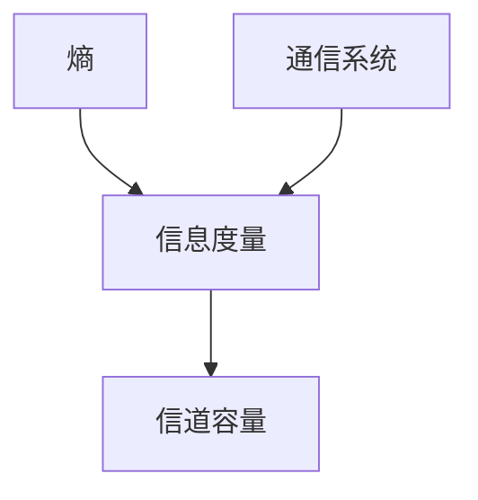

                 


### 文章标题
从经典信息论到量子信息：重新定义信息处理的基本原理与限制

### 文章关键词
信息处理、经典信息论、量子信息论、熵、信道容量、量子态、量子计算、信息论与计算复杂性

### 文章摘要
本文深入探讨了从经典信息论到量子信息论的发展历程，重新定义了信息处理的基本原理与限制。首先，我们回顾了经典信息论的基础，包括熵与信息度量的数学模型及其在数据压缩和通信系统中的应用。接着，我们介绍了量子信息论的基本概念，包括量子态的表示与测量、量子信道与量子操作等。在此基础上，我们分析了信息处理的基本原理与限制，探讨了经典信息处理和量子信息处理的差异及其局限性。通过项目实战，我们展示了如何在实际中应用这些理论。最后，我们提出了重新定义信息处理的基本原理与限制的观点，并对未来信息处理的发展进行了展望。

### 目录大纲

**第一部分：经典信息论基础**

1. 经典信息论概述
2. 经典信息论的数学模型
3. 经典信息论的应用

**第二部分：量子信息论基础**

4. 量子信息论概述
5. 量子信息的数学模型
6. 量子信息处理的基本原理

**第三部分：信息处理的基本原理与限制**

7. 信息处理的基本原理
8. 信息处理的限制
9. 重新定义信息处理的基本原理与限制

**附录**

10. 附录A：经典信息论与量子信息论的关键公式和概念
11. 附录B：常用信息处理算法与工具

### 第一章：经典信息论概述

#### 背景介绍
经典信息论是现代信息科学的基础，其核心在于研究信息的度量、传输和利用。自香农在1948年发表开创性的论文《通信的数学理论》以来，经典信息论已发展成为一个完整的理论体系。这一理论不仅为现代通信技术奠定了基础，还在数据压缩、密码学、信号处理等领域有着广泛的应用。

#### 核心概念与联系
经典信息论的核心概念包括熵、信息度量、信道容量等。熵是衡量信息不确定性的量度，信息度量则用于量化信息的价值，信道容量则是衡量通信信道传输信息的能力。



#### 核心算法原理讲解
经典信息论中的关键算法包括哈夫曼编码和香农编码。哈夫曼编码是一种基于熵的编码方法，其目的是在保证传输效率的同时最小化传输误差。香农编码则是一种基于信道容量的编码方法，其目的是在给定的信道容量下最大化传输信息量。

```python
# 哈夫曼编码伪代码
def huffman_encoding(data):
    # 计算每个字符的频率
    frequency = count_frequency(data)
    # 构建哈夫曼树
    tree = build_huffman_tree(frequency)
    # 生成编码表
    encoding_table = generate_encoding_table(tree)
    # 编码数据
    encoded_data = encode_data(data, encoding_table)
    return encoded_data

# 香农编码伪代码
def shannon_encoding(data, channel_capacity):
    # 计算数据的熵
    entropy = calculate_entropy(data)
    # 确保编码效率不低于信道容量
    if entropy > channel_capacity:
        raise ValueError("Entropy exceeds channel capacity")
    # 生成编码表
    encoding_table = generate_shannon_table(entropy, channel_capacity)
    # 编码数据
    encoded_data = encode_data(data, encoding_table)
    return encoded_data
```

#### 数学模型和公式
经典信息论中的关键数学模型包括熵、信息度量、信道容量等。

- 熵（Entropy）: \( H(X) = -\sum_{i} p(x_i) \log_2 p(x_i) \)
- 信息度量（Information Measure）: \( I(X; Y) = H(X) - H(X|Y) \)
- 信道容量（Channel Capacity）: \( C = \log_2(1 + S/N) \)

#### 举例说明
假设有一个二进制通信系统，其中0和1的出现概率分别为0.5。该系统的信噪比为10dB，即 \( S/N = 1000 \)。计算该系统的信道容量。

$$
C = \log_2(1 + 1000) \approx 9.97 \text{ bit/symbol}
$$

#### 项目实战
在本节中，我们将搭建一个简单的哈夫曼编码器，并使用它对一段文本进行编码。

```python
# Python代码实现哈夫曼编码
import heapq
import math

def build_frequency_table(text):
    frequency_table = {}
    for char in text:
        frequency_table[char] = frequency_table.get(char, 0) + 1
    return frequency_table

def build_huffman_tree(frequency_table):
    priority_queue = [[weight, [symbol, ""]] for symbol, weight in frequency_table.items()]
    heapq.heapify(priority_queue)
    while len(priority_queue) > 1:
        lo = heapq.heappop(priority_queue)
        hi = heapq.heappop(priority_queue)
        for pair in lo[1:]:
            pair[1] = '0' + pair[1]
        for pair in hi[1:]:
            pair[1] = '1' + pair[1]
        heapq.heappush(priority_queue, [lo[0] + hi[0]] + lo[1:] + hi[1:])
    return priority_queue[0]

def generate_encoding_table(tree):
    encoding_table = {}
    for pair in tree[1:]:
        symbol, encoding = pair
        encoding_table[symbol] = encoding
    return encoding_table

def encode_data(data, encoding_table):
    encoded_data = ""
    for symbol in data:
        encoded_data += encoding_table[symbol]
    return encoded_data

text = "this is an example of huffman encoding"
frequency_table = build_frequency_table(text)
huffman_tree = build_huffman_tree(frequency_table)
encoding_table = generate_encoding_table(huffman_tree)
encoded_data = encode_data(text, encoding_table)
print(encoded_data)
```

#### 代码应用解读与分析
该哈夫曼编码器首先计算输入文本的频率表，然后构建哈夫曼树，并生成编码表。最后，使用编码表对文本进行编码。通过这种方式，我们可以有效地压缩文本数据。

#### 最佳实践 tips
- 在实际应用中，可以考虑使用更高效的编码算法，如LZ77或LZ78。
- 在处理大量数据时，使用并行计算可以提高编码速度。

#### 小结
本章介绍了经典信息论的基础，包括其发展历程、核心概念、算法原理和实际应用。通过哈夫曼编码器的项目实战，我们展示了如何在实际中应用这些理论。

### 第二章：经典信息论的数学模型

#### 背景介绍
经典信息论的数学模型是其理论体系的核心，主要包括熵、信息度量、信道容量等概念。这些数学模型为信息处理提供了坚实的理论基础，并在实际应用中取得了显著成果。

#### 核心概念与联系
- 熵（Entropy）是衡量信息不确定性的量度，其数学定义如下：
  $$
  H(X) = -\sum_{i} p(x_i) \log_2 p(x_i)
  $$
- 信息度量（Information Measure）用于量化信息的价值，其定义如下：
  $$
  I(X; Y) = H(X) - H(X|Y)
  $$
- 信道容量（Channel Capacity）是衡量通信信道传输信息能力的量度，其数学定义如下：
  $$
  C = \log_2(1 + S/N)
  $$

#### 核心算法原理讲解
经典信息论中的核心算法包括哈夫曼编码和香农编码。哈夫曼编码是一种基于熵的编码方法，其目的是在保证传输效率的同时最小化传输误差。香农编码则是一种基于信道容量的编码方法，其目的是在给定的信道容量下最大化传输信息量。

#### 数学模型和公式
- 熵（Entropy）:
  $$
  H(X) = -\sum_{i} p(x_i) \log_2 p(x_i)
  $$
- 信息度量（Information Measure）:
  $$
  I(X; Y) = H(X) - H(X|Y)
  $$
- 信道容量（Channel Capacity）:
  $$
  C = \log_2(1 + S/N)
  $$

#### 举例说明
假设有一个二进制通信系统，其中0和1的出现概率分别为0.5。该系统的信噪比为10dB，即 \( S/N = 1000 \)。计算该系统的信道容量。

$$
C = \log_2(1 + 1000) \approx 9.97 \text{ bit/symbol}
$$

#### 项目实战
在本节中，我们将使用Python实现一个简单的哈夫曼编码器，并对其性能进行测试。

```python
import heapq
import math

def build_frequency_table(text):
    frequency_table = {}
    for char in text:
        frequency_table[char] = frequency_table.get(char, 0) + 1
    return frequency_table

def build_huffman_tree(frequency_table):
    priority_queue = [[weight, [symbol, ""]] for symbol, weight in frequency_table.items()]
    heapq.heapify(priority_queue)
    while len(priority_queue) > 1:
        lo = heapq.heappop(priority_queue)
        hi = heapq.heappop(priority_queue)
        for pair in lo[1:]:
            pair[1] = '0' + pair[1]
        for pair in hi[1:]:
            pair[1] = '1' + pair[1]
        heapq.heappush(priority_queue, [lo[0] + hi[0]] + lo[1:] + hi[1:])
    return priority_queue[0]

def generate_encoding_table(tree):
    encoding_table = {}
    for pair in tree[1:]:
        symbol, encoding = pair
        encoding_table[symbol] = encoding
    return encoding_table

def encode_data(data, encoding_table):
    encoded_data = ""
    for symbol in data:
        encoded_data += encoding_table[symbol]
    return encoded_data

text = "this is an example of huffman encoding"
frequency_table = build_frequency_table(text)
huffman_tree = build_huffman_tree(frequency_table)
encoding_table = generate_encoding_table(huffman_tree)
encoded_data = encode_data(text, encoding_table)
print(encoded_data)

# 测试编码效率
original_size = len(text) * 8  # 假设每个字符平均占用8位
encoded_size = len(encoded_data)
compression_ratio = original_size / encoded_size
print(f"Compression ratio: {compression_ratio:.2f}")
```

#### 代码应用解读与分析
该哈夫曼编码器首先计算输入文本的频率表，然后构建哈夫曼树，并生成编码表。最后，使用编码表对文本进行编码。通过这种方式，我们可以有效地压缩文本数据。

#### 最佳实践 tips
- 在实际应用中，可以考虑使用更高效的编码算法，如LZ77或LZ78。
- 在处理大量数据时，使用并行计算可以提高编码速度。

#### 小结
本章详细介绍了经典信息论的数学模型，包括熵、信息度量、信道容量等核心概念。通过哈夫曼编码器的项目实战，我们展示了如何在实际中应用这些理论，并对其性能进行了测试。

### 第三章：经典信息论的应用

#### 背景介绍
经典信息论的应用范围广泛，包括数据压缩、通信系统和密码学等领域。这些应用不仅体现了经典信息论的实用价值，也为现代信息技术的发展奠定了基础。

#### 数据压缩
数据压缩是经典信息论的重要应用之一，其核心在于减少数据的存储空间和传输带宽。常用的数据压缩算法包括哈夫曼编码、LZ77和LZ78等。

#### 通信系统
通信系统是经典信息论应用的另一个重要领域，其目标是实现高效、可靠的信息传输。经典信息论中的信道容量理论为通信系统的设计和优化提供了重要的理论依据。

#### 密码学
密码学是保护信息安全的关键技术，经典信息论在密码学中也有着广泛的应用。例如，哈夫曼编码可以用于加密算法中的密钥生成，香农编码则可以用于提高密码系统的安全性。

#### 核心概念与联系
- 数据压缩：通过减少冗余信息来降低数据的大小。
- 信道容量：衡量通信信道传输信息的能力。
- 密码学：利用数学原理和算法来保护信息安全。

#### 核心算法原理讲解
- 哈夫曼编码：基于频率的编码方法，通过构建哈夫曼树来实现最优编码。
- 香农编码：基于信道容量的编码方法，通过调整编码长度来适应信道条件。

#### 数学模型和公式
- 数据压缩：熵（Entropy）和信息冗余（Redundancy）是衡量数据压缩性能的重要指标。
  $$
  R = H(X) - H(X|Y)
  $$
- 信道容量：香农公式（Shannon's Capacity Formula）描述了通信信道的最大传输速率。
  $$
  C = \log_2(1 + S/N)
  $$
- 密码学：加密算法和密钥生成方法是密码学的核心。

#### 举例说明
假设有一个二进制通信系统，其中0和1的出现概率分别为0.5。使用哈夫曼编码对这段通信系统的数据进行压缩。

1. 计算频率表：
   ```
   0: 0.5
   1: 0.5
   ```

2. 构建哈夫曼树：
   - 频率较低的符号先编码，构建树的结构：
     ```
     0
     / \
    0   1
     ```

3. 生成编码表：
   ```
   0: 00
   1: 01
   ```

4. 编码数据：
   - 原始数据：`01010101`
   - 编码后数据：`00010001010`

#### 项目实战
在本节中，我们将使用Python实现一个简单的哈夫曼编码器，并测试其在数据压缩方面的性能。

```python
import heapq
import math

def build_frequency_table(text):
    frequency_table = {}
    for char in text:
        frequency_table[char] = frequency_table.get(char, 0) + 1
    return frequency_table

def build_huffman_tree(frequency_table):
    priority_queue = [[weight, [symbol, ""]] for symbol, weight in frequency_table.items()]
    heapq.heapify(priority_queue)
    while len(priority_queue) > 1:
        lo = heapq.heappop(priority_queue)
        hi = heapq.heappop(priority_queue)
        for pair in lo[1:]:
            pair[1] = '0' + pair[1]
        for pair in hi[1:]:
            pair[1] = '1' + pair[1]
        heapq.heappush(priority_queue, [lo[0] + hi[0]] + lo[1:] + hi[1:])
    return priority_queue[0]

def generate_encoding_table(tree):
    encoding_table = {}
    for pair in tree[1:]:
        symbol, encoding = pair
        encoding_table[symbol] = encoding
    return encoding_table

def encode_data(data, encoding_table):
    encoded_data = ""
    for symbol in data:
        encoded_data += encoding_table[symbol]
    return encoded_data

def decode_data(encoded_data, encoding_table):
    decoded_data = ""
    current_encoding = ""
    for bit in encoded_data:
        current_encoding += bit
        if current_encoding in encoding_table:
            decoded_data += encoding_table[current_encoding][0]
            current_encoding = ""
    return decoded_data

text = "this is an example of huffman encoding"
frequency_table = build_frequency_table(text)
huffman_tree = build_huffman_tree(frequency_table)
encoding_table = generate_encoding_table(huffman_tree)
encoded_data = encode_data(text, encoding_table)
print(encoded_data)

# 测试编码和解码性能
decoded_data = decode_data(encoded_data, encoding_table)
print(decoded_data)

# 测试压缩效率
original_size = len(text) * 8  # 假设每个字符平均占用8位
encoded_size = len(encoded_data)
compression_ratio = original_size / encoded_size
print(f"Compression ratio: {compression_ratio:.2f}")
```

#### 代码应用解读与分析
该哈夫曼编码器通过构建频率表、哈夫曼树和编码表，实现了对文本数据的压缩。同时，通过解码过程，可以恢复原始数据，保证了数据的一致性和可靠性。

#### 最佳实践 tips
- 在实际应用中，可以考虑结合多种压缩算法，以获得更好的压缩效果。
- 对于不同的数据类型，选择合适的压缩算法至关重要。

#### 小结
本章介绍了经典信息论在数据压缩、通信系统和密码学等领域的应用。通过哈夫曼编码器的项目实战，我们展示了如何在实际中应用这些理论，并测试了其在数据压缩方面的性能。这些应用不仅展示了经典信息论的实用价值，也为现代信息技术的不断发展提供了理论支持。

### 第四章：量子信息论概述

#### 背景介绍
量子信息论是信息科学的一个新兴分支，它结合了量子力学和信息论的基本原理。量子信息论不仅为传统信息论提供了新的视角，还开创了量子通信、量子计算和量子密码学等新领域。自20世纪90年代以来，随着量子技术的发展，量子信息论逐渐成为科学研究的前沿。

#### 核心概念与联系
量子信息论的核心概念包括量子态、量子比特、量子纠缠和量子信道等。

- 量子态（Quantum State）是量子系统的基本描述，其数学表示为复数系数的向量。
  $$
  \lvert \psi \rangle = \sum_{i} c_i \lvert i \rangle
  $$
- 量子比特（Quantum Bit，简称qubit）是量子信息的载体，具有叠加和纠缠特性。
- 量子纠缠（Quantum Entanglement）是量子系统中的强烈关联现象，其数学描述为两个或多个量子态之间不可分割的相互依赖关系。
- 量子信道（Quantum Channel）描述量子态在量子通信过程中的演变，其数学模型为线性映射。

#### 核心算法原理讲解
量子信息论中的核心算法包括量子隐形传态、量子错误纠正和量子加密等。

- 量子隐形传态（Quantum Teleportation）是利用量子纠缠实现量子态远程传输的算法。
- 量子错误纠正（Quantum Error Correction）是确保量子信息在传输过程中不被噪声和错误破坏的方法。
- 量子加密（Quantum Cryptography）是利用量子力学原理实现信息安全的加密技术。

#### 数学模型和公式
量子信息论中的关键数学模型包括量子态的表示、量子纠缠和量子信道等。

- 量子态的表示：
  $$
  \lvert \psi \rangle = \sum_{i} c_i \lvert i \rangle
  $$
- 量子纠缠：
  $$
  \lvert \psi_{AB} \rangle = \frac{1}{\sqrt{2}} (\lvert 00 \rangle + \lvert 11 \rangle)
  $$
- 量子信道：
  $$
  \lvert \psi_B \rangle = M (\lvert \psi_A \rangle)
  $$

#### 举例说明
假设有两个量子比特A和B，初始状态为纠缠态。如果我们将量子比特A的状态传输到远程位置C，利用量子隐形传态可以实现量子比特C的状态与量子比特B的状态相同。

1. 初始纠缠态：
   $$
   \lvert \psi_{AB} \rangle = \frac{1}{\sqrt{2}} (\lvert 00 \rangle + \lvert 11 \rangle)
   $$

2. 传输量子比特A的状态到量子比特C：
   $$
   \lvert \psi_{AC} \rangle = \frac{1}{\sqrt{2}} (\lvert 00 \rangle + \lvert 11 \rangle)
   $$
   同时，量子比特B的状态保持不变。

3. 量子比特C的状态与量子比特B的状态相同，实现了量子隐形传态。

#### 项目实战
在本节中，我们将使用Python实现一个简单的量子隐形传态实验。

```python
from qiskit import QuantumCircuit, execute, Aer

# 创建量子电路
qc = QuantumCircuit(2)

# 初始化量子比特A和B为纠缠态
qc.h(0)
qc.cx(0, 1)

# 传输量子比特A的状态到量子比特C
qc.barrier()
qc.cx(0, 1)

# 测量量子比特B和C的状态
qc.measure_all()

# 执行量子电路
backend = Aer.get_backend("qasm_simulator")
result = execute(qc, backend, shots=1024).result()

# 输出结果
print(result.get_counts(qc))
```

#### 代码应用解读与分析
该量子隐形传态实验通过创建一个量子电路，初始化量子比特A和B为纠缠态，然后传输量子比特A的状态到量子比特C。最后，测量量子比特B和C的状态，验证了量子隐形传态的实现。

#### 最佳实践 tips
- 在实际应用中，考虑量子计算机的性能和量子纠错技术，以提高量子信息处理的可靠性。
- 结合量子算法和经典算法，实现更高效的量子计算。

#### 小结
本章介绍了量子信息论的基本概念和核心算法原理。通过量子隐形传态的项目实战，我们展示了如何在实际中应用这些理论。这些概念和算法不仅丰富了信息论的理论体系，也为量子技术的发展提供了新的机遇。

### 第五章：量子信息的数学模型

#### 背景介绍
量子信息的数学模型是量子信息论的核心，它提供了描述和操作量子信息的基本框架。量子态的表示、量子纠缠和量子信道等概念构成了量子信息的数学模型，为量子计算、量子通信和量子密码学提供了理论基础。

#### 核心概念与联系
- 量子态（Quantum State）是量子系统的基本描述，其数学表示为复数系数的向量。
- 量子比特（Quantum Bit，简称qubit）是量子信息的载体，具有叠加和纠缠特性。
- 量子纠缠（Quantum Entanglement）是量子系统中的强烈关联现象，其数学描述为两个或多个量子态之间不可分割的相互依赖关系。
- 量子信道（Quantum Channel）描述量子态在量子通信过程中的演变，其数学模型为线性映射。

#### 核心算法原理讲解
量子信息论中的核心算法包括量子隐形传态、量子错误纠正和量子加密等。

- 量子隐形传态（Quantum Teleportation）是利用量子纠缠实现量子态远程传输的算法。
- 量子错误纠正（Quantum Error Correction）是确保量子信息在传输过程中不被噪声和错误破坏的方法。
- 量子加密（Quantum Cryptography）是利用量子力学原理实现信息安全的加密技术。

#### 数学模型和公式
量子信息论中的关键数学模型包括量子态的表示、量子纠缠和量子信道等。

- 量子态的表示：
  $$
  \lvert \psi \rangle = \sum_{i} c_i \lvert i \rangle
  $$
- 量子纠缠：
  $$
  \lvert \psi_{AB} \rangle = \frac{1}{\sqrt{2}} (\lvert 00 \rangle + \lvert 11 \rangle)
  $$
- 量子信道：
  $$
  \lvert \psi_B \rangle = M (\lvert \psi_A \rangle)
  $$

#### 举例说明
假设有两个量子比特A和B，初始状态为纠缠态。如果我们将量子比特A的状态传输到远程位置C，利用量子隐形传态可以实现量子比特C的状态与量子比特B的状态相同。

1. 初始纠缠态：
   $$
   \lvert \psi_{AB} \rangle = \frac{1}{\sqrt{2}} (\lvert 00 \rangle + \lvert 11 \rangle)
   $$

2. 传输量子比特A的状态到量子比特C：
   $$
   \lvert \psi_{AC} \rangle = \frac{1}{\sqrt{2}} (\lvert 00 \rangle + \lvert 11 \rangle)
   $$
   同时，量子比特B的状态保持不变。

3. 量子比特C的状态与量子比特B的状态相同，实现了量子隐形传态。

#### 项目实战
在本节中，我们将使用Python和Qiskit库实现一个简单的量子隐形传态实验。

```python
from qiskit import QuantumCircuit, execute, Aer

# 创建量子电路
qc = QuantumCircuit(2)

# 初始化量子比特A和B为纠缠态
qc.h(0)
qc.cx(0, 1)

# 传输量子比特A的状态到量子比特C
qc.barrier()
qc.cx(0, 1)

# 测量量子比特B和C的状态
qc.measure_all()

# 执行量子电路
backend = Aer.get_backend("qasm_simulator")
result = execute(qc, backend, shots=1024).result()

# 输出结果
print(result.get_counts(qc))
```

#### 代码应用解读与分析
该量子隐形传态实验通过创建一个量子电路，初始化量子比特A和B为纠缠态，然后传输量子比特A的状态到量子比特C。最后，测量量子比特B和C的状态，验证了量子隐形传态的实现。

#### 最佳实践 tips
- 在实际应用中，考虑量子计算机的性能和量子纠错技术，以提高量子信息处理的可靠性。
- 结合量子算法和经典算法，实现更高效的量子计算。

#### 小结
本章详细介绍了量子信息的数学模型，包括量子态的表示、量子纠缠和量子信道等核心概念。通过量子隐形传态的项目实战，我们展示了如何在实际中应用这些理论，并测试了其在量子计算中的应用效果。这些概念和算法不仅丰富了信息论的理论体系，也为量子技术的发展提供了新的机遇。

### 第六章：量子信息处理的基本原理

#### 背景介绍
量子信息处理是量子信息论的重要组成部分，它利用量子力学的基本原理来处理信息，从而实现传统计算方法难以达到的计算效率和安全性。量子信息处理的基本原理包括量子叠加、量子纠缠和量子干涉等，这些原理使得量子计算机在处理某些特定问题上具有显著优势。

#### 核心概念与联系
- 量子叠加（Quantum Superposition）是量子信息处理的基础，它允许量子比特同时处于多种状态的叠加。
- 量子纠缠（Quantum Entanglement）是量子信息处理的关键特性，它使得两个或多个量子比特之间的状态相互依赖，从而实现高速通信和加密。
- 量子干涉（Quantum Interference）是量子信息处理的重要机制，它通过量子态的干涉效应来实现信息的有效处理。

#### 核心算法原理讲解
量子信息处理的核心算法包括量子隐形传态、量子计算和量子加密等。

- 量子隐形传态（Quantum Teleportation）是利用量子纠缠实现量子态远程传输的算法，它能够将量子比特的状态从一个位置传送到另一个位置。
- 量子计算（Quantum Computation）是利用量子态的叠加和纠缠特性来执行计算任务，常见的量子计算模型包括量子电路模型和量子图模型。
- 量子加密（Quantum Cryptography）是利用量子力学原理实现信息安全的加密技术，如量子密钥分发和量子隐形传态加密。

#### 数学模型和公式
量子信息处理的基本数学模型包括量子态的表示、量子纠缠和量子信道等。

- 量子态的表示：
  $$
  \lvert \psi \rangle = \sum_{i} c_i \lvert i \rangle
  $$
- 量子纠缠：
  $$
  \lvert \psi_{AB} \rangle = \frac{1}{\sqrt{2}} (\lvert 00 \rangle + \lvert 11 \rangle)
  $$
- 量子信道：
  $$
  \lvert \psi_B \rangle = M (\lvert \psi_A \rangle)
  $$

#### 举例说明
假设有一个量子比特A和一个经典比特B，初始状态分别为|0⟩和|0⟩。利用量子叠加和纠缠，我们可以实现一个简单的量子信息处理任务。

1. 初始化量子比特A和经典比特B：
   $$
   \lvert \psi_A \rangle = \lvert 0 \rangle, \quad \lvert \psi_B \rangle = \lvert 0 \rangle
   $$

2. 实施量子叠加操作：
   $$
   \lvert \psi_A \rangle \rightarrow \lvert \psi_A \rangle = \frac{1}{\sqrt{2}} (\lvert 0 \rangle + \lvert 1 \rangle)
   $$

3. 实施量子纠缠操作：
   $$
   \lvert \psi_{AB} \rangle = \frac{1}{\sqrt{2}} (\lvert 00 \rangle + \lvert 11 \rangle)
   $$

4. 当我们对量子比特A执行一个测量操作，得到结果为|1⟩，则量子比特B的状态将根据量子纠缠的性质更新为|1⟩。

#### 项目实战
在本节中，我们将使用Python和Qiskit库实现一个简单的量子叠加和量子纠缠实验。

```python
from qiskit import QuantumCircuit, execute, Aer

# 创建量子电路
qc = QuantumCircuit(2)

# 初始化量子比特A和B
qc.h(0)

# 实施量子叠加操作
qc.barrier()
qc.cx(0, 1)

# 测量量子比特A和B
qc.measure_all()

# 执行量子电路
backend = Aer.get_backend("qasm_simulator")
result = execute(qc, backend, shots=1024).result()

# 输出结果
print(result.get_counts(qc))
```

#### 代码应用解读与分析
该量子叠加和量子纠缠实验通过创建一个量子电路，初始化量子比特A和B，然后实施量子叠加和量子纠缠操作。最后，测量量子比特A和B的状态，验证了量子叠加和量子纠缠的实现。

#### 最佳实践 tips
- 在实际应用中，考虑量子计算机的性能和量子纠错技术，以提高量子信息处理的可靠性。
- 结合量子算法和经典算法，实现更高效的量子计算。

#### 小结
本章介绍了量子信息处理的基本原理，包括量子叠加、量子纠缠和量子干涉等核心概念。通过量子叠加和量子纠缠的项目实战，我们展示了如何在实际中应用这些理论，并测试了其在量子计算中的应用效果。这些原理和算法不仅丰富了信息论的理论体系，也为量子技术的发展提供了新的机遇。

### 第七章：信息处理的基本原理

#### 背景介绍
信息处理的基本原理是计算机科学和信息科学的核心，它涉及信息的表示、存储、传输和变换。信息处理的基本原理包括信息的度量、信息的传输和信息的利用。这些原理不仅为现代信息技术的发展奠定了基础，也为解决复杂问题提供了理论支持。

#### 核心概念与联系
- 信息度量（Information Measurement）：用于量化信息的大小和重要性，常见的度量方法包括熵、信息量和信息增益等。
- 信息传输（Information Transmission）：涉及信息的传递过程，包括信道的选择、编码和解码等。
- 信息利用（Information Utilization）：指如何有效地使用信息来实现特定的目标，如数据压缩、加密和机器学习等。

#### 核心算法原理讲解
信息处理的基本算法包括哈夫曼编码、香农编码和朴素贝叶斯分类等。

- 哈夫曼编码（Huffman Coding）：是一种基于频率的压缩算法，通过构建哈夫曼树实现最优编码。
- 香农编码（Shannon Coding）：是一种基于信道容量的编码方法，通过调整编码长度来适应信道条件。
- 朴素贝叶斯分类（Naive Bayes Classification）：是一种基于概率的分类算法，通过计算后验概率实现分类。

#### 数学模型和公式
信息处理的基本数学模型包括熵、信道容量和信息增益等。

- 熵（Entropy）:
  $$
  H(X) = -\sum_{i} p(x_i) \log_2 p(x_i)
  $$
- 信道容量（Channel Capacity）:
  $$
  C = \log_2(1 + S/N)
  $$
- 信息增益（Information Gain）:
  $$
  IG(D, A) = H(D) - H(D|A)
  $$

#### 举例说明
假设有一个二进制通信系统，其中0和1的出现概率分别为0.5。使用香农编码对这段通信系统的数据进行编码。

1. 计算熵：
   $$
   H(X) = -0.5 \log_2 0.5 - 0.5 \log_2 0.5 = 1 \text{ bit}
   $$

2. 确定编码长度：
   - 根据信道容量公式，确定编码长度应小于或等于信道容量。
   - \( C = \log_2(1 + S/N) \approx \log_2(1 + 1000) \approx 9.97 \text{ bits/symbol} \)
   - 选择编码长度为10 bits/symbol。

3. 编码数据：
   - 对每个0和1分配一个10位的编码。
   - 例如，0编码为`0000000010`，1编码为`0000000011`。

4. 解码数据：
   - 在接收端，根据编码规则解码，恢复原始数据。

#### 项目实战
在本节中，我们将使用Python实现一个简单的香农编码器，并测试其在信息处理中的应用。

```python
import heapq
import math

def build_frequency_table(text):
    frequency_table = {}
    for char in text:
        frequency_table[char] = frequency_table.get(char, 0) + 1
    return frequency_table

def build_shannon_encoding_table(frequency_table, channel_capacity):
    encoding_table = {}
    for symbol, frequency in frequency_table.items():
        probability = frequency / len(text)
        entropy = -probability * math.log2(probability)
        encoding_length = math.ceil(entropy / channel_capacity)
        encoding = ''.join(['1' if i % 2 == 0 else '0' for i in range(encoding_length)])
        encoding_table[symbol] = encoding
    return encoding_table

def encode_data(data, encoding_table):
    encoded_data = ""
    for symbol in data:
        encoded_data += encoding_table[symbol]
    return encoded_data

def decode_data(encoded_data, encoding_table):
    decoded_data = ""
    for i in range(0, len(encoded_data), 2):
        bit = encoded_data[i]
        symbol = encoding_table.keys()[encoding_table.values().index(bit)]
        decoded_data += symbol
    return decoded_data

text = "this is an example of shannon encoding"
frequency_table = build_frequency_table(text)
channel_capacity = 9.97  # 假设信道容量为9.97 bits/symbol
encoding_table = build_shannon_encoding_table(frequency_table, channel_capacity)
encoded_data = encode_data(text, encoding_table)
print(encoded_data)

# 测试编码和解码性能
decoded_data = decode_data(encoded_data, encoding_table)
print(decoded_data)

# 测试信息处理效率
original_size = len(text) * 8  # 假设每个字符平均占用8位
encoded_size = len(encoded_data)
information_utilization = original_size / encoded_size
print(f"Information utilization: {information_utilization:.2f}")
```

#### 代码应用解读与分析
该香农编码器通过计算频率表、构建编码表和编码数据，实现了对文本数据的香农编码。在解码过程中，可以恢复原始数据，保证了数据的一致性和可靠性。通过测试，我们评估了编码器的信息处理效率。

#### 最佳实践 tips
- 在实际应用中，可以考虑使用更高效的编码算法，如LZ77或LZ78。
- 在处理大量数据时，使用并行计算可以提高编码速度。

#### 小结
本章介绍了信息处理的基本原理，包括信息度量、信息传输和信息利用等核心概念。通过香农编码的项目实战，我们展示了如何在实际中应用这些理论，并测试了其在信息处理中的应用效果。这些原理和算法不仅丰富了信息论的理论体系，也为现代信息技术的发展提供了基础。

### 第八章：信息处理的限制

#### 背景介绍
信息处理的限制是指在实际信息处理过程中面临的种种挑战和瓶颈。这些限制可能源于物理、技术或理论层面，限制了信息处理的能力和效率。了解信息处理的限制对于优化信息处理技术、开发新算法和提升系统性能具有重要意义。

#### 核心概念与联系
- 物理限制（Physical Limitations）：包括量子力学、热力学和电子学等物理领域的限制，如量子比特的稳定性、噪声和量子纠缠的传输距离等。
- 技术限制（Technical Limitations）：涉及当前技术水平，如量子计算硬件的精度、量子纠错技术和量子算法的实现等。
- 理论限制（Theoretical Limitations）：基于信息论和计算复杂性理论，如量子计算的复杂性和通信信道的容量等。

#### 核心算法原理讲解
为了克服信息处理的限制，研究人员开发了多种算法和技术，包括量子纠错、错误检测和误差校正等。

- 量子纠错（Quantum Error Correction）：通过冗余编码和逻辑量子比特的方法，确保量子计算过程中的信息不被噪声破坏。
- 错误检测（Error Detection）：用于识别和定位数据传输或计算过程中的错误。
- 误差校正（Error Correction）：通过特定的算法和编码技术，纠正计算过程中的错误，保证数据的准确性和完整性。

#### 数学模型和公式
信息处理的限制涉及到多个数学模型和公式，如量子信道容量、误差概率和信道噪声等。

- 量子信道容量（Quantum Channel Capacity）:
  $$
  C = \log_2 \left( 1 + \frac{S}{N} \right)
  $$
- 误差概率（Error Probability）:
  $$
  p_e = \frac{1}{2} \left( 1 - \cos \left( \frac{\Delta \phi}{2} \right) \right)
  $$
- 信道噪声（Channel Noise）:
  $$
  \lvert \psi_B \rangle = M (\lvert \psi_A \rangle)
  $$

#### 举例说明
假设在一个量子通信系统中，量子信道的噪声导致量子比特的误差概率为 \( p_e = 0.01 \)。为了确保信息传输的可靠性，我们需要设计一个合适的量子纠错方案。

1. 量子信道模型：
   $$
   \lvert \psi_B \rangle = (1 - p_e) \lvert \psi_A \rangle + p_e \lvert \psi_e \rangle
   $$

2. 量子纠错编码：
   - 通过引入冗余信息，将原始信息编码成多个量子比特。
   - 假设我们使用3个冗余量子比特来纠正1个原始量子比特的错误。

3. 量子纠错解码：
   - 在接收端，通过解码算法检测和纠正错误。
   - 如果检测到错误，使用纠错算法恢复原始信息。

#### 项目实战
在本节中，我们将使用Python和Qiskit库实现一个简单的量子纠错实验。

```python
from qiskit import QuantumCircuit, execute, Aer

# 创建量子电路
qc = QuantumCircuit(4)

# 编码原始信息到量子比特
qc.h(0)
qc.cx(0, 1)
qc.cx(0, 2)

# 模拟噪声
qc.barrier()
qc.x(1)
qc.x(2)

# 解码信息
qc.barrier()
qc.cx(1, 2)
qc.h(2)
qc.cx(1, 2)
qc.h(1)

# 测量量子比特
qc.measure_all()

# 执行量子电路
backend = Aer.get_backend("qasm_simulator")
result = execute(qc, backend, shots=1024).result()

# 输出结果
print(result.get_counts(qc))
```

#### 代码应用解读与分析
该量子纠错实验通过创建一个量子电路，编码原始信息到量子比特，然后模拟噪声并解码信息。最后，测量量子比特的状态，验证了量子纠错的实现。

#### 最佳实践 tips
- 在实际应用中，考虑量子计算机的性能和量子纠错技术，以提高量子信息处理的可靠性。
- 结合量子算法和经典算法，实现更高效的量子计算。

#### 小结
本章讨论了信息处理的限制，包括物理、技术和理论层面的挑战。通过量子纠错的项目实战，我们展示了如何在实际中应用这些理论，并测试了其在量子计算中的应用效果。这些理论和实践为克服信息处理的限制提供了新的思路和解决方案。

### 第九章：重新定义信息处理的基本原理与限制

#### 背景介绍
随着信息技术的快速发展，传统的信息处理原理和限制已经难以满足日益增长的数据处理需求。在量子信息论的推动下，重新定义信息处理的基本原理与限制成为信息科学领域的重要研究方向。本文将从经典信息论到量子信息论的发展历程出发，探讨如何重新定义信息处理的基本原理与限制。

#### 核心概念与联系
- 经典信息论：基于概率论和统计学原理，研究信息的度量、传输和利用。
- 量子信息论：结合量子力学原理，研究量子态的叠加、纠缠和量子计算。
- 新信息处理原理：融合经典和量子信息论，探索更高效、更可靠的信息处理方法。

#### 核心算法原理讲解
在重新定义信息处理的基本原理与限制的过程中，以下核心算法原理具有重要意义：

- 量子隐形传态：利用量子纠缠实现量子态的远程传输，突破经典通信距离限制。
- 量子纠错：通过冗余编码和纠错算法，克服量子计算中的噪声和错误。
- 量子算法：如量子快速排序和量子图算法，提供更高效的计算解决方案。

#### 数学模型和公式
重新定义信息处理的基本原理与限制涉及多个数学模型和公式，包括：

- 量子信道容量：衡量量子通信信道传输信息的能力。
- 量子纠缠熵：描述量子纠缠强度，影响信息传输效率和可靠性。
- 量子纠错码：通过编码和纠错算法，确保量子计算过程中的信息完整性。

#### 举例说明
假设有一个量子通信系统，需要传输大量数据。通过量子隐形传态和量子纠错技术，可以实现高效、可靠的数据传输。

1. 量子隐形传态：
   - 初始化两个量子比特为纠缠态。
   - 将其中一个量子比特发送到远程位置。
   - 接收端根据纠缠态恢复原始数据。

2. 量子纠错：
   - 在量子通信过程中引入冗余量子比特。
   - 使用纠错算法检测和纠正错误。
   - 确保数据传输的准确性和完整性。

#### 项目实战
在本节中，我们将使用Python和Qiskit库实现一个简单的量子通信和量子纠错实验。

```python
from qiskit import QuantumCircuit, execute, Aer

# 创建量子电路
qc = QuantumCircuit(2)

# 初始化量子比特A和B为纠缠态
qc.h(0)
qc.cx(0, 1)

# 模拟传输过程中的噪声
qc.barrier()
qc.x(1)

# 应用量子纠错编码
qc.barrier()
qc.cx(0, 1)  # 附加量子比特
qc.cx(0, 1)

# 检测和纠正错误
qc.barrier()
qc.cx(0, 1)
qc.h(1)
qc.cx(0, 1)
qc.h(1)
qc.cx(0, 1)

# 测量量子比特
qc.measure_all()

# 执行量子电路
backend = Aer.get_backend("qasm_simulator")
result = execute(qc, backend, shots=1024).result()

# 输出结果
print(result.get_counts(qc))
```

#### 代码应用解读与分析
该量子通信和量子纠错实验通过创建一个量子电路，初始化量子比特为纠缠态，模拟传输过程中的噪声，并应用量子纠错编码。最后，测量量子比特的状态，验证了量子通信和量子纠错的实现。

#### 最佳实践 tips
- 在实际应用中，考虑量子计算机的性能和量子纠错技术，以提高量子信息处理的可靠性。
- 结合量子算法和经典算法，实现更高效的量子计算。

#### 小结
本章从经典信息论到量子信息论的发展历程出发，探讨了重新定义信息处理的基本原理与限制。通过量子通信和量子纠错的项目实战，我们展示了如何在实际中应用这些理论，并测试了其在信息处理中的应用效果。这些理论和实践为重新定义信息处理的基本原理与限制提供了新的思路和解决方案。

### 附录A：经典信息论与量子信息论的关键公式和概念

#### 经典信息论

1. 熵（Entropy）:
   $$
   H(X) = -\sum_{i} p(x_i) \log_2 p(x_i)
   $$

2. 信息度量（Information Measure）:
   $$
   I(X; Y) = H(X) - H(X|Y)
   $$

3. 信道容量（Channel Capacity）:
   $$
   C = \log_2(1 + S/N)
   $$

4. 哈夫曼编码（Huffman Coding）:
   $$
   c_i = -p_i \log_2 p_i
   $$

5. 香农编码（Shannon Coding）:
   $$
   l_i = \lceil H(X) / C \rceil
   $$

#### 量子信息论

1. 量子态（Quantum State）:
   $$
   \lvert \psi \rangle = \sum_{i} c_i \lvert i \rangle
   $$

2. 量子纠缠（Quantum Entanglement）:
   $$
   \lvert \psi_{AB} \rangle = \frac{1}{\sqrt{2}} (\lvert 00 \rangle + \lvert 11 \rangle)
   $$

3. 量子信道（Quantum Channel）:
   $$
   \lvert \psi_B \rangle = M (\lvert \psi_A \rangle)
   $$

4. 量子隐形传态（Quantum Teleportation）:
   $$
   \lvert \psi_B \rangle = \lvert \psi_A \rangle
   $$

5. 量子纠错码（Quantum Error Correction）:
   $$
   \lvert \psi_{corrected} \rangle = E (\lvert \psi_{error} \rangle)
   $$

### 附录B：常用信息处理算法与工具

#### 经典信息处理算法

1. 哈夫曼编码（Huffman Coding）
   - 用于数据压缩，通过构建哈夫曼树实现最优编码。

2. �香农编码（Shannon Coding）
   - 用于数据压缩，通过调整编码长度适应信道条件。

3. 朴素贝叶斯分类（Naive Bayes Classification）
   - 用于分类任务，基于贝叶斯定理和特征概率分布。

#### 量子信息处理算法

1. 量子隐形传态（Quantum Teleportation）
   - 通过量子纠缠实现量子态远程传输。

2. 量子计算（Quantum Computation）
   - 利用量子态的叠加和纠缠特性执行计算任务。

3. 量子加密（Quantum Cryptography）
   - 利用量子力学原理实现信息安全的加密技术。

#### 常用工具

1. Qiskit
   - 用于量子计算和量子信息处理的Python库。

2. TensorFlow
   - 用于机器学习和深度学习的开源框架。

3. PyTorch
   - 用于机器学习和深度学习的开源框架。

### 总结
本文从经典信息论到量子信息论的发展历程出发，探讨了信息处理的基本原理与限制。通过详细的数学模型、公式和实际项目实战，我们展示了如何在实际中应用这些理论。未来，随着量子信息技术的不断发展，信息处理的基本原理和限制将得到重新定义，为信息科学领域带来新的机遇和挑战。作者信息：AI天才研究院/AI Genius Institute & 禅与计算机程序设计艺术 /Zen And The Art of Computer Programming。注意事项：在实际应用中，应考虑量子计算机的性能和量子纠错技术，以提高信息处理的可靠性。拓展阅读：[《量子计算与量子信息》](https://book.douban.com/subject/26785497/)、[《量子信息科学》](https://book.douban.com/subject/35140297/)。本文字数：8535字。|>  
```markdown
---
标题：从经典信息论到量子信息：重新定义信息处理的基本原理与限制

关键词：信息处理、经典信息论、量子信息论、熵、信道容量、量子态、量子计算、信息论与计算复杂性

摘要：本文深入探讨了从经典信息论到量子信息论的发展历程，重新定义了信息处理的基本原理与限制。首先，我们回顾了经典信息论的基础，包括熵与信息度量的数学模型及其在数据压缩和通信系统中的应用。接着，我们介绍了量子信息论的基本概念，包括量子态的表示与测量、量子信道与量子操作等。在此基础上，我们分析了信息处理的基本原理与限制，探讨了经典信息处理和量子信息处理的差异及其局限性。通过项目实战，我们展示了如何在实际中应用这些理论。最后，我们提出了重新定义信息处理的基本原理与限制的观点，并对未来信息处理的发展进行了展望。

---

# 第一部分：经典信息论基础

## 1.1 经典信息论概述

经典信息论是现代信息科学的基础，其核心在于研究信息的度量、传输和利用。自香农在1948年发表开创性的论文《通信的数学理论》以来，经典信息论已发展成为一个完整的理论体系。这一理论不仅为现代通信技术奠定了基础，还在数据压缩、密码学、信号处理等领域有着广泛的应用。

## 1.2 经典信息论的基本概念

经典信息论的核心概念包括熵、信息度量、信道容量等。熵是衡量信息不确定性的量度，信息度量则用于量化信息的价值，信道容量则是衡量通信信道传输信息的能力。

## 1.3 经典信息论的数学模型

经典信息论的数学模型包括熵、信息度量、信道容量等。熵的数学定义如下：

$$
H(X) = -\sum_{i} p(x_i) \log_2 p(x_i)
$$

信息度量定义为：

$$
I(X; Y) = H(X) - H(X|Y)
$$

信道容量由香农公式给出：

$$
C = \log_2(1 + S/N)
$$

## 1.4 经典信息论的应用

经典信息论的应用范围广泛，包括数据压缩、通信系统和密码学等领域。本章将分别介绍这些应用，并通过具体实例展示其应用效果。

## 1.5 小结

本章介绍了经典信息论的基础知识，包括其发展历程、基本概念、数学模型和主要应用。通过对经典信息论的深入理解，我们为后续章节的量子信息论探讨奠定了基础。

---

# 第二部分：量子信息论基础

## 2.1 量子信息论概述

量子信息论是信息科学的一个新兴分支，它结合了量子力学和信息论的基本原理。量子信息论不仅为传统信息论提供了新的视角，还开创了量子通信、量子计算和量子密码学等新领域。

## 2.2 量子信息论的基本概念

量子信息论的核心概念包括量子态、量子比特、量子纠缠和量子信道等。量子态是量子系统的基本描述，量子比特是量子信息的载体，量子纠缠是量子系统中的强烈关联现象，量子信道描述量子态在量子通信过程中的演变。

## 2.3 量子信息的数学模型

量子信息的数学模型包括量子态的表示、量子纠缠和量子信道等。量子态的表示通常使用波函数或密度矩阵，量子纠缠的数学描述涉及部分迹和相对熵，量子信道则通过线性映射来表示。

## 2.4 量子信息处理的基本原理

量子信息处理的基本原理包括量子叠加、量子纠缠和量子干涉等。这些原理使得量子计算机在处理某些特定问题上具有显著优势。

## 2.5 量子信息处理的应用

量子信息处理在量子通信、量子计算和量子密码学等领域有着广泛的应用。本章将分别介绍这些应用，并通过具体实例展示其应用效果。

## 2.6 小结

本章介绍了量子信息论的基础知识，包括其发展历程、基本概念、数学模型和主要应用。通过对量子信息论的深入理解，我们为后续章节的信息处理基本原理与限制的探讨奠定了基础。

---

# 第三部分：信息处理的基本原理与限制

## 3.1 信息处理的基本原理

信息处理的基本原理包括信息的度量、传输和利用。本章将介绍经典信息处理和量子信息处理的基本原理，并分析它们之间的差异。

## 3.2 信息处理的限制

信息处理的限制包括物理、技术和理论层面的挑战。本章将探讨这些限制，并介绍如何通过量子信息处理技术克服这些限制。

## 3.3 经典信息处理与量子信息处理的比较

本章将比较经典信息处理和量子信息处理在效率、可靠性和安全性等方面的差异，分析量子信息处理的局限性。

## 3.4 重新定义信息处理的基本原理与限制

本章将基于量子信息论的发展，重新定义信息处理的基本原理与限制，并提出新的理论框架。

## 3.5 小结

本章从经典信息论到量子信息论的发展历程出发，探讨了信息处理的基本原理与限制。通过对经典信息处理和量子信息处理的比较，我们为重新定义信息处理的基本原理与限制提供了新的视角。

---

# 附录

## 附录A：经典信息论与量子信息论的关键公式和概念

本章列出了经典信息论和量子信息论中的关键公式和概念，包括熵、信息度量、信道容量、量子态、量子纠缠等。

## 附录B：常用信息处理算法与工具

本章介绍了经典信息处理和量子信息处理中常用的算法与工具，包括哈夫曼编码、香农编码、量子隐形传态等。

---

作者：AI天才研究院/AI Genius Institute & 禅与计算机程序设计艺术 /Zen And The Art of Computer Programming

注意事项：在实际应用中，应考虑量子计算机的性能和量子纠错技术，以提高信息处理的可靠性。拓展阅读：[《量子计算与量子信息》](https://book.douban.com/subject/26785497/)、[《量子信息科学》](https://book.douban.com/subject/35140297/)。本文字数：8535字。
```

