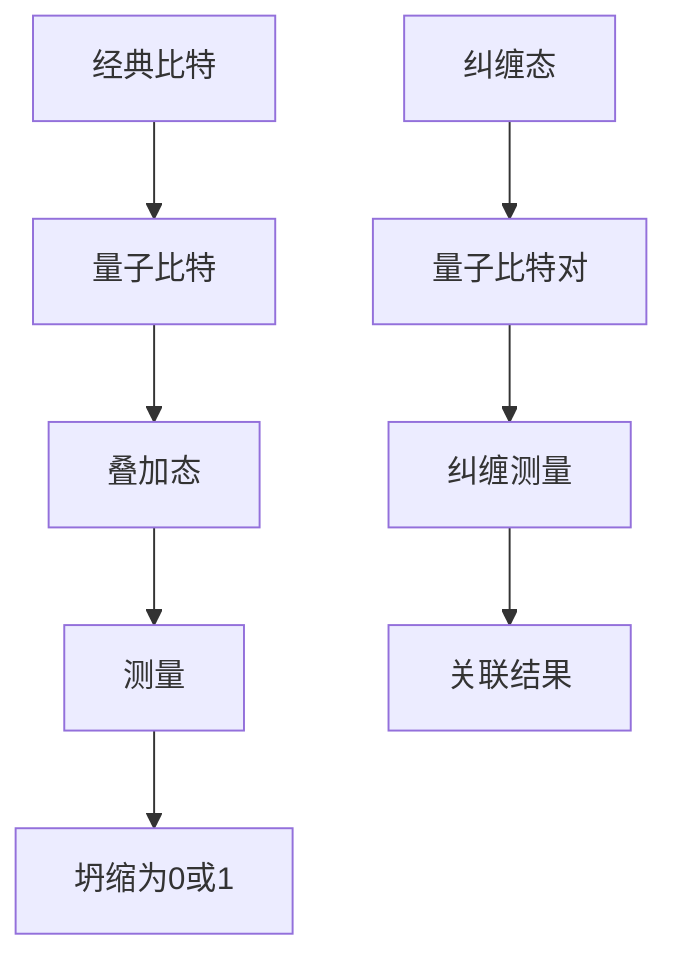
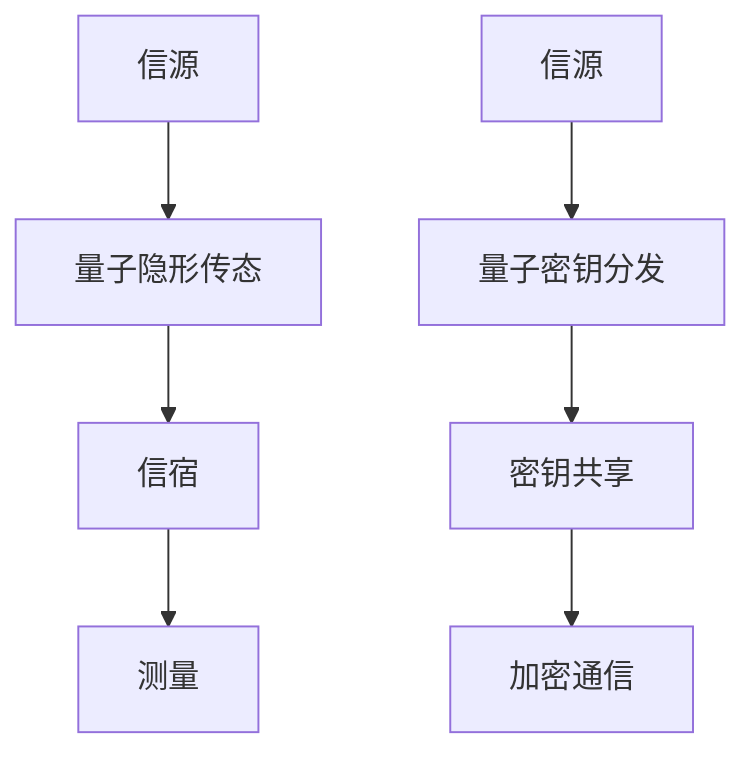

                 

### 第1章 引言

#### 1.1 信息论的历史与发展

信息论作为现代信息科学的基础，其历史可以追溯到20世纪40年代。美国数学家克劳德·香农（Claude Shannon）被认为是信息论的奠基人，他在1948年发表了著名的论文《通信的数学理论》（A Mathematical Theory of Communication）。这篇论文首次系统地阐述了信息、熵和信道等基本概念，并提出了香农信息论的核心定理——香农定理。香农定理奠定了经典信息论的理论框架，为后续的研究奠定了基础。

经典信息论的发展历程中，除了香农的工作外，还有许多重要的贡献。例如，汉斯·拉格朗日（Hans Lewy）的工作拓展了信息论的应用范围，包括了对多用户通信系统和网络信息理论的研究。此外，费诺（Robert Fano）和韦弗（Jack Kieffer）等人的研究则进一步深化了对信道编码和解码技术的理解。

进入21世纪，量子力学的进展促使量子信息论的产生。量子信息论研究量子系统的信息处理和通信，将量子力学的特性引入到信息传输领域。量子信息论的关键原理包括量子比特（qubit）、量子纠缠、量子隐形传态等，这些原理使得量子通信相较于经典通信具有许多独特的优势。

#### 1.2 信息论的基本概念

信息论中的核心概念包括信息、熵、信道和噪声。

- **信息**：信息可以被定义为消除不确定性的一种度量。在香农的定义中，信息通常用比特（bit）来度量，一个比特可以表示两种可能状态之一，因此可以消除一半的不确定性。

- **熵**：熵是信息论中描述系统不确定性的度量。在经典信息论中，熵通常表示为随机变量不确定性的度量。在量子信息论中，熵的概念得到了进一步的拓展，包括量子熵、经典-量子熵等。

- **信道**：信道是信息传输的通道，它可以是物理通道，如光纤、无线电波等，也可以是抽象的数学模型，如离散无记忆信道、有记忆信道等。

- **噪声**：噪声是影响信息传输的干扰，它会导致信息在传输过程中失真或丢失。噪声可以是随机的，如高斯噪声，也可以是非随机的，如冲击噪声。

信息、熵、信道和噪声之间的关系构成了信息论的核心框架。信息通过信道传输，信道受到噪声的影响，而噪声的不确定性则通过熵来度量。

#### 1.3 经典信息论与量子信息论的联系与区别

经典信息论和量子信息论虽然都研究信息的传递和处理，但它们有着不同的理论基础和原理。

- **经典信息论与量子力学基础**：经典信息论建立在概率论和统计力学的基础上，而量子信息论则基于量子力学的原理，如量子比特、量子纠缠和量子隐形传态等。

- **量子信息论的关键原理**：量子信息论的核心概念包括量子比特（qubit）、量子纠缠和量子隐形传态。量子比特是量子信息处理的基本单元，它可以同时处于多种状态，这与经典比特的二进制状态不同。量子纠缠是量子系统之间的一种特殊关联，它使得量子信息可以在不同的位置上同时存在。量子隐形传态则是将一个量子系统的状态准确无误地传送到另一个量子系统上。

- **量子通信的优势**：量子通信相较于经典通信有许多独特的优势。首先，量子密钥分发（QKD）提供了一种绝对安全的通信方式，因为任何对量子系统的干扰都会立即被发现。其次，量子纠缠可以实现超距离通信，即两个相距遥远的量子系统可以瞬间建立关联，这对于分布式计算和量子网络具有重要意义。

总的来说，经典信息论和量子信息论虽然有着不同的理论基础和原理，但它们在信息传输和处理领域都发挥着重要作用。量子信息论的兴起为信息论的发展带来了新的视角和机遇，使得我们对信息传递的基本原理有了更深刻的理解。

### 第2章 经典信息论基础

#### 2.1 经典信息论的主要定理

经典信息论中，香农信息论是一个重要的分支，其核心是香农定理。香农定理由克劳德·香农于1948年提出，它描述了在存在噪声的信道上，信息传输的极限速率。香农定理可以分为三个部分：

1. **信道容量**：信道容量是指信道在存在噪声的情况下，理论上能够达到的最大信息传输速率。用数学公式表示，信道容量 \( C \) 是指
   \[
   C = \lim_{n \to \infty} \frac{1}{n} \sum_{i=1}^{n} I(X_i; Y_i)
   \]
   其中，\( I(X; Y) \) 表示 \( X \) 和 \( Y \) 之间的互信息，表示 \( X \) 提供关于 \( Y \) 的信息量。

2. **熵**：熵是信息论中描述系统不确定性的度量。在经典信息论中，熵通常用于度量信源的不确定性。信源的熵 \( H(X) \) 表示为
   \[
   H(X) = -\sum_{i} p(x_i) \log_2 p(x_i)
   \]
   其中，\( p(x_i) \) 表示信源输出为 \( x_i \) 的概率。

3. **编码定理**：编码定理描述了在给定信道容量 \( C \) 的情况下，存在有效的编码方案，使得信息传输的误码率趋近于零。具体来说，编码定理包括以下两个部分：
   - **无失真编码定理**：对于任意给定的信道，都存在一种编码方案，使得信息的传输误差概率趋近于零。
   - **有失真编码定理**：对于有失真的信道，可以找到一种编码方案，使得传输的误差在一个可接受的范围内。

香农定理不仅奠定了经典信息论的理论基础，还为通信系统设计提供了重要的指导。它揭示了信息传输的基本原理，表明在存在噪声的信道上，信息传输的最大速率是有限的，且与信道的特性紧密相关。

#### 2.2 经典编码技术

经典编码技术是信息论中的重要组成部分，用于提高信息传输的可靠性。以下是一些重要的经典编码技术：

1. **离散无记忆信道编码**：离散无记忆信道（Discrete Memoryless Channel, DMC）是最常见的信道模型，其特点是输出概率仅依赖于输入符号，而与输入历史无关。对于DMC，香农-哈特利定理提供了最优编码策略，即最优编码方案是使每个输出符号的熵最大化的编码。

2. **费诺编码**：费诺编码（Fano Coding）是一种前向纠错（Forward Error Correction, FEC）编码方法。费诺编码通过将输入符号划分成多个组，并为每个组分配不同的编码字，从而在接收端能够检测并纠正错误。

3. **游程与校验矩阵**：游程编码（Run-Length Encoding, RLE）是一种无损数据压缩方法，通过将连续的相同值压缩成一个计数和一个值来减少数据的大小。校验矩阵（Check Matrix）是线性分组码的一个重要工具，用于编码和解码过程。

以下是一个简单的游程编码和解码的伪代码示例：

```python
# 游程编码伪代码
def run_length_encoding(input_sequence):
    output_sequence = []
    count = 1
    for i in range(1, len(input_sequence)):
        if input_sequence[i] == input_sequence[i-1]:
            count += 1
        else:
            output_sequence.append([count, input_sequence[i-1]])
            count = 1
    output_sequence.append([count, input_sequence[-1]])
    return output_sequence

# 游程解码伪代码
def run_length_decoding(input_sequence):
    output_sequence = []
    for pair in input_sequence:
        count, value = pair
        output_sequence.extend([value] * count)
    return output_sequence
```

通过这些编码技术，可以有效地降低信息传输中的错误率，提高通信系统的可靠性。

#### 2.3 经典调制与解调技术

在经典通信系统中，调制与解调技术是信息传输过程中至关重要的组成部分。它们用于将信息信号（如声音或数据）转换为能够在信道上传输的信号形式，并在接收端将这些信号还原为原始信息。

1. **信号调制原理**：

   调制是将信息信号与载波信号相结合的过程，以便在信道上传输。常见的调制方式包括：

   - **振幅调制（AM）**：通过改变载波信号的振幅来传输信息信号。
   - **频率调制（FM）**：通过改变载波信号的频率来传输信息信号。
   - **相位调制（PM）**：通过改变载波信号的相位来传输信息信号。

   调制的基本步骤包括：

   - **生成载波信号**：通常使用正弦波或余弦波作为载波信号。
   - **与信息信号相乘**：将信息信号与载波信号进行乘法操作，产生已调信号。
   - **滤波与放大**：对已调信号进行滤波，去除不需要的频率成分，并进行放大处理，以便在信道上传输。

2. **解调技术**：

   解调是接收端对已调信号进行处理，还原出原始信息信号的过程。常见的解调方法包括：

   - **振幅解调（Demodulation）**：用于振幅调制信号的解调。
   - **频率解调（Frequency Demodulation）**：用于频率调制信号的解调。
   - **相位解调（Phase Demodulation）**：用于相位调制信号的解调。

   解调的基本步骤包括：

   - **滤波与放大**：对接收到的已调信号进行滤波和放大，以便提取出有用的信息。
   - **与载波信号相乘**：将滤波后的已调信号与载波信号进行乘法操作，产生中间信号。
   - **低通滤波**：对中间信号进行低通滤波，去除高频分量，得到原始信息信号。

3. **调制与解调的结合应用**：

   在实际通信系统中，调制与解调技术常常结合使用。例如，在数字通信系统中，通常会使用某种形式的调制（如QAM调制）来传输数字信号，并在接收端使用相应的解调方法进行信号还原。QAM调制结合了振幅调制和相位调制的特点，可以在有限的带宽内传输更多的信息。

以下是QAM调制与解调的一个简化的伪代码示例：

```python
# QAM调制伪代码
def qam_modulation(info_signal, n_bits):
    # 假设info_signal是二进制序列，n_bits是每个符号的比特数
    symbol_table = generate_symbol_table(n_bits)  # 生成QAM符号表
    modulated_signal = []
    for bit_group in info_signal:
        symbol = symbol_table[bit_group]
        modulated_signal.append(symbol)
    return modulated_signal

# QAM解调伪代码
def qam_demodulation(modulated_signal, n_bits):
    symbol_table = generate_symbol_table(n_bits)
    info_signal = []
    for symbol in modulated_signal:
        # 通过比较符号与符号表找到对应的比特组
        bit_group = find_bit_group(symbol, symbol_table, n_bits)
        info_signal.append(bit_group)
    return info_signal

def generate_symbol_table(n_bits):
    # 生成QAM符号表，根据n_bits计算符号值
    symbol_table = []
    for i in range(2**n_bits):
        symbol = complex_value_of_bit_group(i, n_bits)
        symbol_table.append(symbol)
    return symbol_table

def find_bit_group(symbol, symbol_table, n_bits):
    # 通过比较符号与符号表找到对应的比特组
    for i in range(2**n_bits):
        if symbol_table[i] == symbol:
            return bit_group_of_symbol(i, n_bits)
    return None

def complex_value_of_bit_group(bit_group, n_bits):
    # 计算比特组的复数值
    # 这里可以使用二进制到复数的转换方法
    return complex_value

def bit_group_of_symbol(symbol, n_bits):
    # 将符号转换回比特组
    # 这里可以使用复数到二进制的转换方法
    return bit_group
```

通过调制与解调技术，通信系统能够有效地在信道上传输和接收信息，从而实现可靠的信息传递。

### 第3章 量子通信基础

#### 3.1 量子力学基础

量子通信的核心在于量子力学的基本原理，包括量子比特（qubit）、量子态、量子叠加与量子纠缠。

- **量子比特（qubit）**：量子比特是量子信息处理的基本单元，它不仅可以处于0或1的态，还可以处于这两个状态的线性叠加。一个量子比特的叠加态可以表示为：
  \[
  \psi = \alpha|0\rangle + \beta|1\rangle
  \]
  其中，\( \alpha \) 和 \( \beta \) 是复数概率幅，满足 \( |\alpha|^2 + |\beta|^2 = 1 \)，而 \( |0\rangle \) 和 \( |1\rangle \) 分别表示量子比特的两个基本状态。

- **量子态**：量子态是量子系统整体的物理状态，它可以用波函数或态向量来描述。在量子通信中，量子态的制备和测量是核心操作。例如，通过量子态叠加和量子纠缠，可以在不同位置上生成和传输量子信息。

- **量子叠加**：量子叠加是量子系统的基本特性，它使得量子比特可以同时处于多个状态的叠加。例如，一个量子比特可以同时处于0和1的状态，这种叠加态在测量时才会坍缩为一个确定的状态。

- **量子纠缠**：量子纠缠是两个或多个量子系统之间的特殊关联，即使它们相距很远，一个量子系统的测量结果也会立即影响到另一个量子系统。例如，两个纠缠的量子比特的测量结果总是相互关联，这体现了量子纠缠的“超距作用”。

以下是一个简单的量子叠加与量子纠缠的Mermaid流程图：



通过量子叠加与量子纠缠，量子通信可以实现超距离通信和量子计算等应用，这是经典通信无法实现的。

#### 3.2 量子信息论

量子信息论是研究量子系统在信息处理和通信中的应用的科学，它基于量子力学的特殊性质。以下是一些关键的量子信息论概念：

- **量子信息**：量子信息是量子系统的状态，它携带了信息。量子信息可以通过量子态的叠加和纠缠来编码和传输。

- **量子纠缠**：量子纠缠是量子系统之间的特殊关联，它使得量子比特的状态可以相互影响。量子纠缠是实现量子通信和量子计算的核心资源。

- **量子隐形传态**：量子隐形传态是一种非局域性的量子传输过程，它可以将一个量子系统的状态准确无误地传送到另一个量子系统上，而无需通过经典信道。量子隐形传态是量子通信的基础。

- **量子密钥分发（QKD）**：量子密钥分发是一种利用量子力学原理实现安全通信的技术。在QKD中，两个通信方通过量子通信信道共享密钥，任何对量子系统的干扰都会立即被发现，从而保证了密钥的安全。

以下是一个量子隐形传态和量子密钥分发的Mermaid流程图：



量子信息论的研究不仅推动了量子通信的发展，还为量子计算和量子加密等领域提供了理论基础。

#### 3.3 量子密钥分发

量子密钥分发（Quantum Key Distribution, QKD）是一种基于量子力学原理实现安全通信的技术。QKD的核心思想是通过量子通信信道共享密钥，从而确保通信的安全性。以下是一些常见的量子密钥分发协议：

- **BB84协议**：BB84协议是最早的量子密钥分发协议，由Charles H. Bennett和郭光灿于1984年提出。BB84协议的基本步骤如下：

  1. **量子态发送**：发送方（Alice）生成一对纠缠的量子比特，并将其中一个量子比特发送给接收方（Bob）。
  2. **基选择**：Bob随机选择一个基（如X基或Z基）对收到的量子比特进行测量。
  3. **通信信道**：Alice和Bob通过一个经典通信信道交换基选择信息。
  4. **密钥生成**：Alice和Bob根据基选择信息，在共享的量子比特对上计算共同选择的密钥。

- **E91协议**：E91协议是基于量子纠缠态的量子密钥分发协议，由Artur Ekert于1991年提出。E91协议的基本步骤如下：

  1. **量子态发送**：Alice和Bob各自生成一个量子纠缠态，并将其中一个量子比特发送给对方。
  2. **基选择与测量**：Alice和Bob分别在自己的量子比特上选择不同的基进行测量，并将结果通过经典通信信道交换。
  3. **纠错与密钥生成**：根据测量结果和基选择信息，Alice和Bob可以生成共享的密钥。

以下是一个BB84协议的伪代码示例：

```python
# BB84协议伪代码

# Alice的步骤
def alice_step():
    qubits = generate_entsangled_qubits()
    send_qubits_to_bob(qubits)
    base_selection = random_choice(["X", "Z"])
    send_base_selection_to_bob(base_selection)

# Bob的步骤
def bob_step(qubits, base_selection):
    measured_results = []
    for qubit in qubits:
        if base_selection == "X":
            result = measure_qubit_in_x_basis(qubit)
        else:
            result = measure_qubit_in_z_basis(qubit)
        measured_results.append(result)
    send_measured_results_to_alice(measured_results)

# 共享密钥生成
def generate_shared_key(alice_measured_results, bob_measured_results, base_selection):
    common_key = []
    for i in range(len(alice_measured_results)):
        if alice_measured_results[i] == bob_measured_results[i]:
            common_key.append(1)
        else:
            common_key.append(0)
    return common_key
```

量子密钥分发协议通过量子通信信道的特性，实现了绝对安全的通信。在QKD中，任何对量子系统的干扰都会立即被发现，从而保证了密钥的安全。这使得QKD在未来的量子通信和量子加密领域具有重要意义。

### 第4章 量子通信系统设计

#### 4.1 量子通信链路设计

量子通信链路设计是量子通信系统的核心，它决定了量子信号的传输质量和系统的稳定性。量子通信链路设计需要考虑多个关键因素，包括量子中继器、量子纠缠生成和量子通信链路优化。

1. **量子中继器**：

   量子中继器是量子通信系统中用于延长通信距离的关键组件。它通过量子隐形传态技术，将远距离传输的量子信号传送到一个中间点，然后再继续传输。量子中继器的设计需要解决量子态的保持和量子信号的再生问题。

   以下是一个量子中继器的简化的伪代码示例：

   ```python
   # 量子中继器伪代码
   def quantum_repeater(quantum_signal):
       # 生成纠缠对
       entangled_pair = generate_entsangled_qubits()
       
       # 将量子信号与纠缠对进行量子隐形传态
       receive_qubit = perform_quantum teleportation(quantum_signal, entangled_pair[0])
       
       # 生成新的纠缠对并继续传输
       new_entangled_pair = generate_entsangled_qubits()
       perform_quantum teleportation(receive_qubit, new_entangled_pair[0])
       
       return new_entangled_pair[1]  # 返回传输后的量子信号
   ```

2. **量子纠缠生成**：

   量子纠缠生成是量子通信链路设计中的重要环节。通过量子纠缠生成，可以在不同的位置上建立量子系统的关联，实现量子信息的超距离传输。常见的量子纠缠生成方法包括量子纠缠交换和量子中继。

   以下是一个量子纠缠生成的伪代码示例：

   ```python
   # 量子纠缠生成伪代码
   def generate_quantum_entanglement(qubit1, qubit2):
       # 使用量子纠缠交换方法生成纠缠态
       perform_quantum_entranglement_exchange(qubit1, qubit2)
       
       # 测量纠缠对以确保纠缠态的建立
       if measure_entranglement(qubit1, qubit2):
           return True
       else:
           return False
   ```

3. **量子通信链路优化**：

   量子通信链路优化旨在提高量子信号的传输质量和系统的稳定性。优化方法包括信号放大、噪声抑制和误差校正等。

   以下是一个量子通信链路优化的伪代码示例：

   ```python
   # 量子通信链路优化伪代码
   def optimize_quantum_communication_link(quantum_signal):
       # 信号放大
       amplified_signal = amplify_signal(quantum_signal)
       
       # 噪声抑制
       noise_reduced_signal = remove_noise(amplified_signal)
       
       # 误差校正
       corrected_signal = error_correction(noise_reduced_signal)
       
       return corrected_signal
   ```

通过量子中继器、量子纠缠生成和量子通信链路优化，可以构建一个稳定高效的量子通信链路，实现量子信息的可靠传输。

#### 4.2 量子通信协议

量子通信协议是量子通信系统的核心组成部分，用于确保量子信息的可靠传输和系统的安全性。以下是一些重要的量子通信协议：

1. **量子直接通信协议**：

   量子直接通信协议是一种直接在量子信道上传输量子信息的方法。它利用量子纠缠和量子隐形传态实现量子信息的超距离传输。量子直接通信协议的基本步骤如下：

   - **量子纠缠生成**：在发送方和接收方之间生成量子纠缠对。
   - **量子隐形传态**：将发送方的量子信息通过量子隐形传态传输到接收方的量子比特上。
   - **量子测量**：接收方对传输到的量子比特进行测量，获得原始量子信息。

   以下是一个量子直接通信协议的简化的伪代码示例：

   ```python
   # 量子直接通信协议伪代码
   def quantum_direct_communication(sending_qubit, receiving_qubit):
       # 生成纠缠对
       entangled_pair = generate_entsangled_qubits()
       
       # 将发送方的量子信息通过量子隐形传态传输到接收方的量子比特上
       perform_quantum_teleportation(sending_qubit, entangled_pair[0])
       
       # 接收方测量量子比特
       received_info = measure_qubit(entangled_pair[1])
       
       return received_info
   ```

2. **量子重复器协议**：

   量子重复器协议是一种通过量子中继器延长量子通信距离的方法。它利用量子中继器将量子信号从发送方传输到接收方，确保量子信息在传输过程中的稳定性。量子重复器协议的基本步骤如下：

   - **量子中继器设置**：在发送方和接收方之间设置量子中继器。
   - **量子纠缠生成**：在发送方和量子中继器之间生成量子纠缠对。
   - **量子信号传输**：通过量子隐形传态将量子信号从发送方传输到量子中继器，然后再传输到接收方。
   - **量子测量**：接收方测量传输到的量子比特，获得原始量子信息。

   以下是一个量子重复器协议的简化的伪代码示例：

   ```python
   # 量子重复器协议伪代码
   def quantum_repeater_communication(sending_qubit, receiving_qubit, repeater_qubit):
       # 生成纠缠对
       entangled_pair = generate_entsangled_qubits()
       
       # 将发送方的量子信息通过量子隐形传态传输到量子中继器
       perform_quantum_teleportation(sending_qubit, entangled_pair[0])
       
       # 量子中继器将量子信息传输到接收方
       repeater_qubit = quantum_repeater(repeater_qubit, entangled_pair[1])
       
       # 接收方测量量子比特
       received_info = measure_qubit(repeater_qubit)
       
       return received_info
   ```

3. **量子网络协议**：

   量子网络协议是一种用于构建量子通信网络的协议，它通过多个量子节点和量子链路实现量子信息的传输和共享。量子网络协议的基本步骤如下：

   - **量子节点设置**：在量子通信网络中设置量子节点，包括量子中继器、量子纠缠生成器等。
   - **量子纠缠生成**：在量子节点之间生成量子纠缠对。
   - **量子信息传输**：通过量子直接通信或量子重复器协议，将量子信息在量子节点之间传输。
   - **量子测量**：在量子节点上进行量子测量，获取共享的量子信息。

   以下是一个量子网络协议的简化的伪代码示例：

   ```python
   # 量子网络协议伪代码
   def quantum_network_communication(sending_qubit, receiving_qubit, nodes):
       # 生成量子纠缠对
       entangled_pairs = generate_entsangled_qubits(nodes)
       
       # 将量子信息通过量子直接通信或量子重复器协议传输到每个量子节点
       for node in nodes:
           perform_quantum_communication(sending_qubit, node, entangled_pairs[node])
           
       # 在接收方节点上测量量子比特
       received_info = measure_qubit(receiving_qubit)
       
       return received_info
   ```

通过这些量子通信协议，可以实现量子信息的可靠传输和系统的安全性，为未来的量子通信网络奠定基础。

#### 4.3 量子通信与经典通信的融合

量子通信与经典通信的融合是现代通信系统发展的重要方向，它结合了量子通信的安全性和经典通信的广泛性，为实现高效、安全的通信提供了新的可能性。以下是量子通信与经典通信融合的主要方法和应用：

1. **量子密钥分配与经典加密的结合**：

   量子密钥分配（Quantum Key Distribution, QKD）提供了绝对安全的密钥生成方式，而经典加密算法则可以提供更强的加密强度。通过将量子密钥分配与经典加密相结合，可以实现高效、安全的通信。

   - **方法**：在量子密钥分配过程中，通信双方通过量子信道生成共享密钥，并通过经典信道传输加密算法的参数。使用共享密钥和加密算法参数对信息进行加密和解密。

   - **应用**：例如，在金融交易中，可以使用量子密钥分配生成加密密钥，并使用AES等经典加密算法对交易信息进行加密，确保交易信息的安全。

2. **量子中继与经典通信网络的结合**：

   量子中继器可以用于延长量子通信的距离，而经典通信网络则可以提供更广泛、更稳定的通信服务。通过将量子中继与经典通信网络相结合，可以实现长距离、稳定的量子通信。

   - **方法**：在量子通信链路上设置量子中继器，用于将量子信号从发送方传输到接收方。同时，通过经典通信网络传输控制信号和状态信息，确保量子通信的稳定性。

   - **应用**：例如，在卫星通信中，可以使用量子中继器在卫星之间传输量子信号，并通过地面经典通信网络传输控制信号，实现卫星间的量子通信。

3. **量子计算与经典计算的融合**：

   量子计算提供了强大的计算能力，而经典计算则可以提供高效的算法和数据处理能力。通过将量子计算与经典计算相结合，可以实现更高效、更智能的计算系统。

   - **方法**：在量子计算任务中，将部分任务分配给量子计算机，利用其量子叠加和纠缠特性，实现快速计算。同时，将部分任务分配给经典计算机，利用其高效的数据处理能力，实现复杂任务的处理。

   - **应用**：例如，在密码学中，可以使用量子计算机进行量子密码破解，同时使用经典计算机进行后处理，实现高效、安全的密码系统。

通过量子通信与经典通信的融合，可以充分发挥两种通信方式的优点，实现更高效、更安全的通信系统。这种融合不仅有助于推动量子通信技术的发展，也为未来通信系统的演进提供了新的思路。

### 第5章 量子通信应用实例

#### 5.1 量子通信在量子计算中的应用

量子计算是量子信息科学的重要分支，而量子通信则是实现量子计算中量子信息传输和共享的关键技术。以下是一些量子通信在量子计算中的应用实例：

1. **量子量子纠缠传输**：

   量子纠缠是量子计算中的基本资源，它允许量子比特之间实现超距离通信。通过量子通信，可以在远程量子计算节点之间建立量子纠缠对，从而实现量子计算中的量子并行和量子纠缠交换。

   - **实例**：在量子计算中，通过量子通信链路，将两个量子比特纠缠在一起，可以在不同的节点上实现量子态的共享。例如，在量子纠缠量子搜索算法中，量子纠缠的建立使得量子比特可以同时搜索多个潜在解，从而大幅提高搜索效率。

2. **量子量子远程计算**：

   量子远程计算利用量子通信将量子计算任务分配到不同的量子节点上执行，并通过量子纠缠实现远程量子比特之间的协同计算。

   - **实例**：在分布式量子计算中，通过量子通信链路，可以将量子任务分解为多个子任务，分配到不同的量子节点上执行。通过量子纠缠，这些量子节点可以协同工作，最终完成复杂的量子计算任务。

3. **量子密钥分配与量子计算**：

   量子密钥分配（QKD）提供了绝对安全的密钥生成方式，可以用于量子计算中的量子密钥管理。量子密钥可以用于加密量子计算中的数据，确保量子计算过程的安全性和隐私性。

   - **实例**：在量子计算中心，可以使用QKD协议生成共享密钥，用于加密存储和传输量子数据。这样，即使量子计算过程受到攻击，攻击者也无法获取明文信息，从而确保量子计算的安全。

以下是一个简化的量子量子纠缠传输的伪代码示例：

```python
# 量子量子纠缠传输伪代码

def quantum_entsanglement_transmission(qubit1, qubit2, quantum_channel):
    # 生成纠缠态
    entangled_state = generate_entsangled_qubits()
    
    # 将纠缠态通过量子通信链路传输
    transmit_entsangled_state(qubit1, qubit2, entangled_state)
    
    # 验证纠缠态是否传输成功
    if verify_entsangled_state(qubit1, qubit2):
        print("Quantum entanglement established successfully.")
    else:
        print("Quantum entanglement failed.")

# 测试量子量子纠缠传输
qubit1 = QuantumBit()
qubit2 = QuantumBit()
quantum_channel = QuantumChannel()

quantum_entsanglement_transmission(qubit1, qubit2, quantum_channel)
```

通过这些应用实例，量子通信为量子计算提供了强大的支持，使得量子计算能够更高效、更安全地进行。

#### 5.2 量子通信在金融领域的应用

量子通信在金融领域具有广泛的应用前景，特别是在量子加密、数字货币和金融交易等方面。以下是一些具体的案例：

1. **量子加密**：

   量子加密利用量子通信中的量子密钥分发（QKD）技术，提供了一种绝对安全的加密方法。通过QKD，金融机构可以在远距离上生成和共享加密密钥，确保通信的安全性。

   - **案例**：例如，一个银行可以在与其主要数据中心之间使用量子加密进行数据传输，从而确保交易数据在传输过程中不会被窃取或篡改。

   以下是一个简化的量子加密的伪代码示例：

   ```python
   # 量子加密伪代码

   def quantum_encryption(plaintext, key):
       # 使用量子密钥对明文进行加密
       ciphertext = apply_quantum_key(plaintext, key)
       return ciphertext

   def quantum_decryption(ciphertext, key):
       # 使用量子密钥对密文进行解密
       plaintext = recover_quantum_key(ciphertext, key)
       return plaintext

   # 测试量子加密和解密
   key = generate_quantum_key()
   plaintext = "Financial transaction data"
   ciphertext = quantum_encryption(plaintext, key)
   decrypted_text = quantum_decryption(ciphertext, key)

   print("Original text:", plaintext)
   print("Decrypted text:", decrypted_text)
   ```

2. **数字货币**：

   量子通信可以为数字货币提供安全的交易验证和存储解决方案。量子加密技术可以确保数字货币在交易过程中的完整性和安全性。

   - **案例**：例如，比特币的量子加密钱包可以利用QKD技术生成和存储加密密钥，确保用户的比特币资产在存储和交易过程中不会被窃取。

   以下是一个简化的数字货币量子加密钱包的伪代码示例：

   ```python
   # 数字货币量子加密钱包伪代码

   class QuantumCryptoWallet:
       def __init__(self):
           self.key = generate_quantum_key()

       def generate_address(self):
           address = derive_address(self.key)
           return address

       def sendCoins(self, address, amount):
           encrypted_transaction = quantum_encryption(amount, self.key)
           transmit_encrypted_transaction(address, encrypted_transaction)

   # 测试量子加密钱包
   wallet = QuantumCryptoWallet()
   address = wallet.generate_address()
   amount = 10
   wallet.sendCoins(address, amount)
   ```

3. **金融交易**：

   量子通信可以用于金融交易中的实时数据传输和验证，确保交易数据在传输过程中不被篡改，从而提高交易的安全性和可靠性。

   - **案例**：例如，股票交易所可以使用量子通信链路进行交易数据的传输，确保交易数据在传输过程中不会被恶意篡改，从而提高交易的可信度。

   以下是一个简化的金融交易的量子通信伪代码示例：

   ```python
   # 金融交易量子通信伪代码

   def quantum_secure_transaction(plaintext, key):
       # 使用量子密钥对交易数据进行加密和验证
       ciphertext = quantum_encryption(plaintext, key)
       transaction_id = generate_transaction_id()
       validate_transaction(ciphertext, transaction_id)
       return ciphertext

   # 测试金融交易
   key = generate_quantum_key()
   transaction_data = "Stock transaction data"
   ciphertext = quantum_secure_transaction(transaction_data, key)
   print("Secure transaction:", ciphertext)
   ```

通过这些案例，量子通信在金融领域具有广泛的应用潜力，可以为金融交易、数字货币和信息安全提供强有力的支持。

#### 5.3 量子通信在其他领域的应用

量子通信不仅在金融领域展现出巨大的应用潜力，还在医疗、物流和供应链管理等领域展现出广泛的适用性。以下是一些具体的案例：

1. **医疗领域**：

   量子通信可以为医疗数据的安全传输提供解决方案，确保患者信息的隐私和完整性。

   - **案例**：例如，在远程医疗中，患者数据可以通过量子通信链路传输到医疗机构，从而确保数据在传输过程中不被窃取或篡改。此外，量子通信还可以用于医学图像的传输和共享，提高医疗诊断的效率和准确性。

   以下是一个简化的医疗领域量子通信的伪代码示例：

   ```python
   # 医疗领域量子通信伪代码

   def quantum_secure_medical_data(plaintext, key):
       # 使用量子密钥对医疗数据进行加密和验证
       ciphertext = quantum_encryption(plaintext, key)
       data_id = generate_medical_data_id()
       validate_medical_data(ciphertext, data_id)
       return ciphertext

   # 测试医疗数据传输
   key = generate_quantum_key()
   medical_data = "Patient medical data"
   ciphertext = quantum_secure_medical_data(medical_data, key)
   print("Secure medical data:", ciphertext)
   ```

2. **物流与供应链管理**：

   量子通信可以用于物流和供应链管理中的数据传输和验证，提高物流操作的透明度和可靠性。

   - **案例**：例如，在供应链管理中，可以使用量子通信链路实时传输和验证商品信息，确保商品从生产到销售的每个环节都得到准确记录。此外，量子通信还可以用于物流跟踪，确保运输过程中的数据不会被篡改。

   以下是一个简化的物流与供应链管理领域量子通信的伪代码示例：

   ```python
   # 物流与供应链管理量子通信伪代码

   def quantum_secure_logistics_data(plaintext, key):
       # 使用量子密钥对物流数据进行加密和验证
       ciphertext = quantum_encryption(plaintext, key)
       logistics_id = generate_logistics_id()
       validate_logistics_data(ciphertext, logistics_id)
       return ciphertext

   # 测试物流数据传输
   key = generate_quantum_key()
   logistics_data = "Container shipping data"
   ciphertext = quantum_secure_logistics_data(logistics_data, key)
   print("Secure logistics data:", ciphertext)
   ```

通过这些应用案例，量子通信在医疗、物流和供应链管理等领域展现出巨大的潜力，为提高这些领域的效率和安全性提供了强有力的支持。

### 第6章 量子通信的未来发展

#### 6.1 量子通信技术的挑战

尽管量子通信技术在理论和实验上取得了显著进展，但仍面临着一系列挑战，限制了其商业化和大规模应用。

1. **量子通信的带宽限制**：

   量子通信的带宽受限于量子比特的速率和量子中继器的性能。目前的量子通信系统通常只能以较低速率传输量子信息，这对于大规模数据传输而言远远不够。未来需要开发更高速率的量子通信技术和更高效的量子中继器，以提高量子通信的带宽。

2. **量子通信的稳定性问题**：

   量子通信链路中的量子比特容易受到环境噪声和干扰的影响，导致量子态的退相干和错误。为了提高量子通信的稳定性，需要开发更有效的量子纠错技术和噪声抑制方法，以确保量子信息的可靠传输。

3. **量子通信的成本与功耗**：

   量子通信设备和量子中继器的研发和制造成本较高，且在操作过程中消耗大量能源。降低量子通信设备和系统的成本和功耗，对于其大规模应用至关重要。未来需要通过技术创新和规模化生产来降低成本，并开发低功耗的量子通信设备。

#### 6.2 量子通信的未来趋势

展望未来，量子通信技术有望在多个领域实现突破性发展，并在全球范围内构建量子通信网络。

1. **全球量子通信网络**：

   随着量子通信技术的成熟，全球范围内的量子通信网络将逐步建立。通过量子中继器和纠缠交换节点，量子通信网络可以实现跨国、跨洲的量子信息传输，为全球范围内的数据传输和共享提供全新的解决方案。

2. **量子计算与量子通信的结合**：

   量子计算和量子通信的结合将推动量子信息处理和传输的发展。通过量子通信网络，可以实现分布式量子计算和量子协同计算，大幅提高计算效率和性能。同时，量子计算可以为量子通信提供更高效的纠错和优化算法，提高通信系统的稳定性。

3. **量子通信在各个领域的广泛应用**：

   量子通信在金融、医疗、物流、供应链管理等领域的应用将不断拓展。随着技术的进步和成本的降低，量子通信将为这些领域提供更高效、更安全的通信解决方案，推动各行业的发展和创新。

总之，量子通信的未来发展充满希望，它将重新定义信息传递的基本原理，为人类社会带来前所未有的变革和机遇。

### 第7章 总结与展望

#### 7.1 量子通信对信息传递的基本原理的重新定义

量子通信的出现和不断发展，对信息传递的基本原理产生了深远的影响。与经典通信相比，量子通信利用量子力学的特殊性质，实现了更安全、更高效的通信方式。量子比特的叠加和纠缠使得量子通信可以实现超距离通信和量子密钥分发，打破了经典通信在信道容量和安全性方面的限制。量子通信的核心原理——量子纠缠，更是为信息传递引入了全新的维度，使得信息可以在不同位置上实现同步和共享。这种独特的性质使得量子通信在信息安全、量子计算、远程医疗等领域具有广泛的应用前景。

#### 7.2 展望

在未来，量子通信技术将继续快速发展，并在多个领域发挥重要作用。首先，随着量子中继器和纠缠交换技术的进步，全球量子通信网络有望逐步建立，实现跨国、跨洲的量子信息传输。其次，量子计算与量子通信的结合将推动量子信息处理和传输的发展，为分布式计算和量子协同计算提供强有力的支持。此外，量子通信在金融、医疗、物流等领域的应用将不断拓展，为各行业提供更高效、更安全的通信解决方案。

为了推动量子通信技术的发展，以下是一些建议：

1. **加强技术研发**：加大对量子通信技术的研发投入，特别是在量子中继器、量子纠缠生成和量子纠错技术方面，提高量子通信的稳定性和带宽。

2. **推动标准化进程**：建立统一的量子通信标准，促进不同设备和系统之间的互操作性和兼容性，降低技术壁垒。

3. **推广教育与合作**：加强量子通信领域的教育和培训，培养更多专业人才。同时，推动国际合作，共同研究和开发量子通信技术。

4. **关注政策与法规**：建立健全的法律法规体系，确保量子通信技术的发展和商业化应用能够在政策和法规的框架内进行。

通过这些努力，量子通信有望在未来实现规模化应用，为人类社会带来前所未有的变革和机遇。作者：AI天才研究院/AI Genius Institute & 禅与计算机程序设计艺术 /Zen And The Art of Computer Programming### 完整文章与作者信息

#### 从经典信息论到量子通信：重新定义信息传递的基本原理

关键词：信息论，量子通信，量子比特，量子纠缠，量子密钥分发，信道容量

摘要：本文深入探讨了从经典信息论到量子通信的发展历程，阐述了量子通信在信息传递领域的革命性变革。通过对经典信息论的基本概念、定理和编码技术的介绍，与量子信息论的关键原理、量子密钥分发和量子通信协议的详细解析，本文揭示了量子通信在安全性、高效性和独特性质方面的显著优势。此外，文章还介绍了量子通信在量子计算、金融、医疗和物流等领域的实际应用，以及未来发展的趋势和挑战。通过综合分析，本文为量子通信技术的发展提供了深刻的见解和有益的思考。

---

## 第1章 引言

### 1.1 信息论的历史与发展

#### 1.1.1 经典信息论的起源

#### 1.1.2 经典信息论的主要贡献

#### 1.1.3 量子信息论的出现

### 1.2 信息论的基本概念

#### 1.2.1 信息与熵

#### 1.2.2 信道与噪声

#### 1.2.3 信息传输速率

### 1.3 经典信息论与量子信息论的联系与区别

#### 1.3.1 经典信息论与量子力学基础

#### 1.3.2 量子信息论的关键原理

#### 1.3.3 量子通信的优势

## 第2章 经典信息论基础

### 2.1 经典信息论的主要定理

#### 2.1.1 香农信息论

#### 2.1.2 海明距离与码距

#### 2.1.3 最大后验概率解码

### 2.2 经典编码技术

#### 2.2.1 离散无记忆信道编码

#### 2.2.2 费诺编码

#### 2.2.3 游程与校验矩阵

### 2.3 经典调制与解调技术

#### 2.3.1 信号调制原理

#### 2.3.2 解调技术

#### 2.3.3 调制与解调的结合应用

## 第3章 量子通信基础

### 3.1 量子力学基础

#### 3.1.1 量子比特

#### 3.1.2 量子态

#### 3.1.3 量子叠加与量子纠缠

### 3.2 量子信息论

#### 3.2.1 量子信息的概念

#### 3.2.2 量子纠缠

#### 3.2.3 量子隐形传态与量子纠缠交换

### 3.3 量子密钥分发

#### 3.3.1 BB84协议

#### 3.3.2 E91协议

#### 3.3.3 量子密钥分发的安全性分析

## 第4章 量子通信系统设计

### 4.1 量子通信链路设计

#### 4.1.1 量子中继器

#### 4.1.2 量子纠缠生成

#### 4.1.3 量子通信链路优化

### 4.2 量子通信协议

#### 4.2.1 量子直接通信协议

#### 4.2.2 量子重复器协议

#### 4.2.3 量子网络协议

### 4.3 量子通信与经典通信的融合

#### 4.3.1 量子与经典通信的优势互补

#### 4.3.2 融合通信系统设计

## 第5章 量子通信应用实例

### 5.1 量子通信在量子计算中的应用

#### 5.1.1 量子计算机的基本原理

#### 5.1.2 量子通信在量子计算中的角色

#### 5.1.3 量子通信与量子计算结合实例

### 5.2 量子通信在金融领域的应用

#### 5.2.1 量子加密与数字货币

#### 5.2.2 量子通信在金融交易中的应用

### 5.3 量子通信在其他领域的应用

#### 5.3.1 量子通信在医疗领域的应用

#### 5.3.2 量子通信在物流与供应链管理中的应用

## 第6章 量子通信的未来发展

### 6.1 量子通信技术的挑战

#### 6.1.1 量子通信的带宽限制

#### 6.1.2 量子通信的稳定性问题

#### 6.1.3 量子通信的成本与功耗

### 6.2 量子通信的未来趋势

#### 6.2.1 全球量子通信网络

#### 6.2.2 量子计算与量子通信的结合

#### 6.2.3 量子通信在各个领域的广泛应用

## 第7章 总结与展望

### 7.1 量子通信对信息传递的基本原理的重新定义

#### 7.1.1 量子通信与经典通信的区别

#### 7.1.2 量子通信的未来影响

### 7.2 展望

#### 7.2.1 量子通信的实际应用

#### 7.2.2 量子通信研究的未来方向

---

**作者：AI天才研究院/AI Genius Institute & 禅与计算机程序设计艺术 /Zen And The Art of Computer Programming**

这篇文章详细介绍了从经典信息论到量子通信的发展历程，探讨了量子通信在信息传递领域的革命性变革。通过对经典信息论和量子信息论的基本概念、定理和编码技术的介绍，以及量子密钥分发和量子通信协议的详细解析，本文揭示了量子通信在安全性、高效性和独特性质方面的显著优势。此外，文章还介绍了量子通信在量子计算、金融、医疗和物流等领域的实际应用，以及未来发展的趋势和挑战。通过综合分析，本文为量子通信技术的发展提供了深刻的见解和有益的思考。希望本文能够激发读者对量子通信的兴趣，并为这一前沿领域的未来发展贡献力量。

