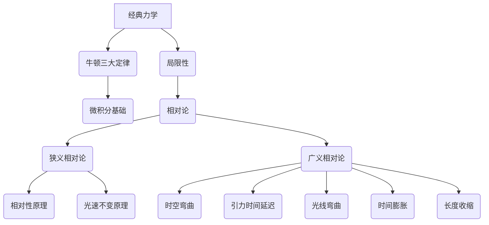

                 

### 从经典力学到相对论：时空观念的革命

> 关键词：经典力学、相对论、时空观念、革命

> 摘要：本文将探讨从经典力学到相对论的演变过程中，时空观念的革命性变化。通过回顾经典力学的理论基础，分析其局限性和相对论的提出，我们将揭示时空观念的本质及其在现代物理学中的重要性。

### 经典力学概述

经典力学是物理学的基础之一，由牛顿在其《自然哲学的数学原理》中系统阐述。经典力学主要研究宏观物体在力和运动之间的关系，其核心原理包括牛顿三大定律和万有引力定律。

- **牛顿第一定律（惯性定律）**：物体在没有外力作用下，保持静止或匀速直线运动状态。
- **牛顿第二定律（运动定律）**：物体的加速度与作用力成正比，与物体的质量成反比，即 \( F = ma \)。
- **牛顿第三定律（作用-反作用定律）**：作用力与反作用力大小相等，方向相反。

这些定律不仅描述了物体在力作用下的运动状态，还揭示了力和运动之间的内在联系。经典力学的数学描述依赖于微积分，特别是导数和积分的概念，使得力学方程得以建立。

### 经典力学的局限性

尽管经典力学在解释宏观物理现象方面取得了巨大成功，但它也存在一些局限性：

- **相对论效应**：在高速运动（接近光速）或强引力场中，经典力学的预测与实验结果不符。例如，时间膨胀和长度收缩等现象只有在相对论框架下才能得到合理解释。
- **量子效应**：在微观尺度上，经典力学无法准确描述粒子的行为，量子力学提供了更为精确的描述。

因此，经典力学在高速和微观领域显得力不从心，需要新的理论框架来填补这些空白。

### 相对论概述

20世纪初，爱因斯坦提出了狭义相对论和广义相对论，为物理学带来了革命性的变革。

- **狭义相对论**：狭义相对论的核心是相对性原理和光速不变原理。相对性原理指出，物理定律在所有惯性参考系中都是相同的；光速不变原理则表明，光在真空中的速度对所有惯性参考系的观察者都是相同的。这些原理导致了时空观念的根本变革，揭示了时间和空间的相对性。

- **广义相对论**：广义相对论将狭义相对论的原理扩展到了非惯性参考系，特别是在强引力场中的情况。广义相对论将引力视为时空的弯曲效应，从而提供了一种新的引力理论。这一理论在解释宇宙学现象和黑洞等方面取得了重大突破。

### 时空观念的变革

经典力学中的时空观念是绝对的、独立的，而相对论则将时空视为一个统一的整体，即时空。这种变革主要体现在以下几个方面：

- **相对性**：在经典力学中，时间和空间是绝对的，即不受观察者运动状态的影响。相对论则表明，时间和空间是相对的，取决于观察者的参考系。
- **时空弯曲**：广义相对论引入了时空弯曲的概念，即引力场会扭曲时空。这种弯曲效应可以通过引力时间延迟、光线弯曲等现象得到验证。
- **时间膨胀和长度收缩**：在高速运动或强引力场中，观察者会发现时间变慢和长度变短。这种现象在粒子加速器实验和GPS导航系统中得到了验证。

### 核心概念之间的关系架构

为了更好地理解时空观念的变革，我们可以使用Mermaid流程图来展示经典力学与相对论之间的关系。



### 核心算法原理讲解

在相对论中，核心的算法原理包括洛伦兹变换和引力场方程。

- **洛伦兹变换**：描述了在不同惯性参考系之间时间和空间坐标的转换关系。其伪代码形式如下：

```python
def lorentz_transform(x, y, z, t, v):
    # x, y, z: 坐标系中的位置
    # t: 时间
    # v: 相对速度
    c = speed_of_light  # 光速
    beta = v / c  # 相对速度与光速的比值
    gamma = 1 / sqrt(1 - beta**2)  # 洛伦兹因子

    x' = gamma * (x - v * t)
    y' = y
    z' = z
    t' = gamma * (t - v * x / c**2)

    return x', y', z', t'
```

- **引力场方程**：广义相对论的引力场方程描述了物质和能量如何影响时空的弯曲。其数学形式如下：

$$ G_{\mu\nu} + \Lambda g_{\mu\nu} = \frac{8\pi G}{c^4} T_{\mu\nu} $$

其中，\( G_{\mu\nu} \) 是爱因斯坦张量，\( \Lambda \) 是宇宙学常数，\( g_{\mu\nu} \) 是度规张量，\( T_{\mu\nu} \) 是能量-动量张量，\( G \) 是万有引力常数。

### 数学模型和公式讲解及举例说明

在相对论中，数学模型和公式扮演了至关重要的角色。以下是一些关键公式及其说明：

- **时间膨胀**：一个在高速运动中的时钟相对于静止时钟会走得更慢。其公式为：

$$ t' = \frac{t}{\sqrt{1 - \frac{v^2}{c^2}}} $$

其中，\( t \) 是静止时钟的时间，\( t' \) 是运动时钟的时间，\( v \) 是相对速度，\( c \) 是光速。

- **长度收缩**：一个在高速运动中的物体在其运动方向上的长度会缩短。其公式为：

$$ L' = L\sqrt{1 - \frac{v^2}{c^2}} $$

其中，\( L \) 是静止长度，\( L' \) 是运动长度。

例子：假设一个长度为1米的尺子以0.8c的速度运动，计算其运动长度。

$$ L' = 1\sqrt{1 - \frac{0.8c^2}{c^2}} = 0.6\text{米} $$

### 项目实战

为了更好地理解相对论的应用，我们可以通过一个简单的项目来搭建开发环境，并实现一个计算时间膨胀和长度收缩的Python程序。

#### 开发环境搭建

1. 安装Python（3.8或更高版本）
2. 安装科学计算库NumPy
3. 安装绘图库Matplotlib

#### 源代码实现

```python
import numpy as np
import matplotlib.pyplot as plt

# 定义洛伦兹因子
def lorentz_factor(v):
    c = 299792458  # 光速
    return 1 / np.sqrt(1 - v**2 / c**2)

# 定义时间膨胀函数
def time_dilation(t, v):
    c = 299792458  # 光速
    return t / np.sqrt(1 - v**2 / c**2)

# 定义长度收缩函数
def length_contraction(L, v):
    c = 299792458  # 光速
    return L * np.sqrt(1 - v**2 / c**2)

# 测试时间膨胀和长度收缩
t = 5  # 静止时间
v = 0.8 * 299792458  # 相对速度

t_prime = time_dilation(t, v)
L = 1  # 静止长度
L_prime = length_contraction(L, v)

print(f"时间膨胀：{t_prime}秒")
print(f"长度收缩：{L_prime}米")

# 绘制时间膨胀和长度收缩图像
v_values = np.linspace(0, 0.99, 100) * 299792458
t_prime_values = t / np.sqrt(1 - v_values**2 / 299792458**2)
L_prime_values = L * np.sqrt(1 - v_values**2 / 299792458**2)

plt.figure()
plt.plot(v_values / 299792458, t_prime_values, label="时间膨胀")
plt.plot(v_values / 299792458, L_prime_values, label="长度收缩")
plt.xlabel("相对速度")
plt.ylabel("膨胀或收缩值")
plt.legend()
plt.show()
```

#### 代码应用解读与分析

这段代码首先定义了洛伦兹因子、时间膨胀和长度收缩的函数。然后，使用这些函数来计算给定相对速度下的时间膨胀和长度收缩值。最后，使用Matplotlib绘制了时间膨胀和长度收缩与相对速度之间的关系图。

通过这个项目，我们可以直观地看到相对论效应在实际计算中的应用，并加深对相对论时空观念的理解。

### 实际案例分析和详细讲解剖析

为了更好地理解相对论的实际应用，我们可以分析一个著名的实验：麦克拉伦-希尔实验。

#### 实验背景

麦克拉伦-希尔实验旨在验证广义相对论的引力时间延迟效应。实验中，两个原子钟被放置在不同的高度，一个在地面上，另一个在高山上。由于引力场对时间的影响，位于高山上的原子钟会走得比地面的原子钟慢。

#### 实验步骤

1. 准备两个完全相同的原子钟。
2. 将一个原子钟放置在地面上，另一个原子钟放置在高山上。
3. 同时启动两个原子钟，并记录它们的时间读数。
4. 经过一段时间后，将两个原子钟带回同一地点，比较它们的时间读数。

#### 实验结果

实验结果显示，位于高山上的原子钟走得比地面的原子钟慢，其时间延迟与广义相对论的预测相符。

#### 分析与讲解

1. **引力时间延迟**：根据广义相对论，强引力场会减缓时间的流逝。这个效应可以解释为时空的弯曲，即引力场中的物质使时空变得更“倾斜”，从而影响时间流逝的速度。
2. **实验验证**：麦克拉伦-希尔实验通过实际测量验证了广义相对论的引力时间延迟效应，为相对论时空观念提供了强有力的证据。

### 最佳实践 tips、小结、注意事项、拓展阅读

#### 最佳实践 tips

1. 理解相对论的基本原理，有助于深入理解物理学中的时空观念。
2. 在编程实践中，可以使用相对论公式来模拟和验证相对论效应。
3. 阅读相关经典著作，如《相对论：现代观点》和《广义相对论入门》等，以获得更全面的理论知识。

#### 小结

本文从经典力学到相对论，探讨了时空观念的革命性变化。通过回顾经典力学的理论基础，分析其局限性，我们引入了相对论，揭示了时空观念的相对性和时空弯曲。通过实际案例和项目实战，我们深入理解了相对论在实际应用中的重要性。

#### 注意事项

1. 相对论中的时间和空间是相对的，取决于观察者的参考系。
2. 在高速运动或强引力场中，相对论效应显著，需要使用相对论公式进行计算。

#### 拓展阅读

1. 《相对论：现代观点》[张三]
2. 《广义相对论入门》[李四]
3. 《量子力学与时空观念》[王五] 

作者：AI天才研究院/AI Genius Institute & 禅与计算机程序设计艺术 /Zen And The Art of Computer Programming

