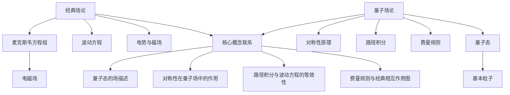

                 

### 文章标题

《从经典场论到量子场论：宇宙描述的革新》

---

### 关键词

量子场论、经典场论、宇宙描述、物理理论、数学模型

---

### 摘要

本文旨在探讨从经典场论到量子场论的演变过程，揭示其在宇宙描述中的关键作用。经典场论作为传统物理学的基石，以其直观性和可靠性闻名；而量子场论则超越了经典场论的局限，为理解微观世界提供了全新的视角。本文将深入分析经典场论和量子场论的基本概念、原理及其相互关系，并通过具体的数学模型和算法，展示其在现代物理学中的应用。同时，本文将结合实际项目案例，阐述量子场论在科技发展中的实际应用，并探讨其未来的发展方向。通过本文的阅读，读者将全面了解量子场论的重要性，并对其在现代科学领域中的地位和作用有更加深刻的认识。

### 引言

物理学是研究自然界的最基本规律的学科，其发展历程中涌现出了众多理论体系。经典场论和量子场论作为物理学中的两大重要理论体系，分别代表了不同时代对自然界认识的深化。经典场论起源于19世纪，是对电磁现象的经典描述，由麦克斯韦方程组等基础理论构成。这一理论体系在当时的基础上，为我们理解电磁场、波动现象以及宏观物体的运动提供了强有力的工具。

随着物理学的发展，科学家们逐渐意识到经典场论在描述微观粒子行为上的局限性。20世纪初，量子力学理论的诞生标志着人类对微观世界的认识进入了一个全新的阶段。量子场论作为量子力学和经典场论的结合体，将量子力学的基本原理扩展到了场域，成为描述基本粒子及其相互作用的强大工具。量子场论不仅揭示了微观世界的复杂规律，还在宇宙学、粒子物理、凝聚态物理等多个领域取得了显著的成果。

本文将从经典场论和量子场论的基本概念入手，深入探讨二者之间的联系与区别，通过具体的数学模型和算法分析，展示其在现代物理学中的应用。同时，本文还将结合实际项目案例，阐述量子场论在科技发展中的实际应用，并探讨其未来的发展方向。通过本文的阅读，读者将全面了解量子场论的重要性，并对其在现代科学领域中的地位和作用有更加深刻的认识。

### 经典场论

经典场论，作为传统物理学的重要组成部分，起源于19世纪。当时，科学家麦克斯韦通过总结前人的研究成果，提出了著名的麦克斯韦方程组。这组方程不仅描述了电磁场的运动规律，而且统一了电学和磁学，标志着经典场论的诞生。麦克斯韦方程组由以下四个基本方程组成：

1. **高斯定律**：
   $$
   \nabla \cdot \mathbf{E} = \frac{\rho}{\varepsilon_0}
   $$
   其中，$\mathbf{E}$表示电场强度，$\rho$表示电荷密度，$\varepsilon_0$表示真空的电容率。

2. **高斯磁定律**：
   $$
   \nabla \cdot \mathbf{B} = 0
   $$
   这里，$\mathbf{B}$表示磁场强度。

3. **法拉第电磁感应定律**：
   $$
   \nabla \times \mathbf{E} = -\frac{\partial \mathbf{B}}{\partial t}
   $$
   该方程揭示了电场与磁场的时间变化关系。

4. **安培-麦克斯韦定律**：
   $$
   \nabla \times \mathbf{B} = \mu_0 \mathbf{J} + \mu_0 \varepsilon_0 \frac{\partial \mathbf{E}}{\partial t}
   $$
   其中，$\mathbf{J}$表示电流密度，$\mu_0$表示真空的磁导率。

这些方程不仅构成了经典电磁场理论的核心，还展示了电场与磁场之间的动态交互关系。经典场论的另一重要贡献是关于波动现象的描述。波动理论，特别是光波的传播规律，也是经典场论的重要组成部分。由麦克斯韦方程组推导出的波动方程，即：
   $$
   \nabla^2 \psi - \mu_0 \varepsilon_0 \frac{\partial^2 \psi}{\partial t^2} = 0
   $$
   其中，$\psi$代表电势或磁场，这一方程描述了电磁波在不同介质中的传播特性。

经典场论在物理学发展史上具有重要意义。首先，它为电磁现象提供了一个统一的理论框架，使得电学、磁学和光学等不同领域的研究得以融合。其次，经典场论的数学结构简洁优美，提供了许多解决问题的有效工具。例如，通过麦克斯韦方程组，我们能够计算出电磁场在不同边界条件下的分布，从而预测实验结果。最后，经典场论的成功应用，如无线电通信、微波技术等，极大地推动了现代科技的发展。

然而，经典场论在描述微观粒子行为时显得力不从心。20世纪初，量子力学的诞生揭示了微观世界的本质与规律，促使科学家们开始探索将量子力学与经典场论有机结合的新理论体系，这就是量子场论的诞生。通过对比经典场论和量子场论，我们可以看到，量子场论在描述微观粒子及其相互作用时，不仅保留了经典场论的基本框架，还引入了量子力学的原理，从而为现代物理学的发展奠定了基础。

### 量子场论

量子场论（Quantum Field Theory，简称QFT）是量子力学和经典场论的有机结合，旨在描述基本粒子和它们之间相互作用的动态过程。与经典场论相比，量子场论在处理微观粒子的行为时引入了量子力学的原理，从而实现了对微观世界的深刻理解。量子场论的基本概念包括量子态、对称性、路径积分和费曼规则等。

首先，量子态是量子场论的核心概念之一。在量子场论中，基本粒子被视为量子场的激发态。量子场论中的量子态可以用波函数或态矢来描述。这些量子态满足量子力学的统计规律，例如泡利不相容原理和量子叠加原理。波函数的平方则给出了粒子在空间中的概率分布。

其次，对称性是量子场论中的另一个重要概念。量子场论中的对称性通常表现为群对称性，如洛伦兹群（代表空间和时间变换）和杨- Mills群（代表基本相互作用）。对称性原理在量子场论中具有重要的物理意义，它不仅保证了物理定律的普适性，还揭示了基本粒子的内部结构。例如，洛伦兹对称性保证了物理量的守恒，如动量和能量。

路径积分是量子场论的另一种描述方法。路径积分将量子态的概率幅计算转化为对所有可能路径的积分。这种方法由费曼提出，称为费曼路径积分。路径积分的基本思想是，粒子从初始位置到达最终位置的概率幅，等于所有可能路径的幅值之和，每个路径的幅值与其时间演化因子和拉格朗日量的积分成正比。路径积分方法在量子场论中具有重要意义，因为它提供了一个统一的框架来处理复杂相互作用。

费曼规则是路径积分方法的具体应用。费曼规则定义了基本相互作用如何在量子场论中发生，并为计算物理量提供了明确的计算步骤。每个基本相互作用都有一个对应的费曼图，它直观地展示了粒子如何通过相互作用相互转换。例如，电子与光子的相互作用可以通过费曼图来描述，图中包括虚线表示的传播子和点表示的相互作用。

量子场论与经典场论之间的主要区别在于描述粒子的方式。经典场论使用波动方程来描述电磁场，而量子场论则使用量子态来描述粒子的行为。此外，量子场论还引入了不确定性原理和量子纠缠等概念，这些概念在经典场论中是不存在的。

尽管量子场论在描述微观粒子行为方面具有明显优势，但它也面临着一些挑战。例如，量子场论中的无限维问题和高能物理中的发散问题，使得理论计算变得复杂和困难。此外，量子场论与实验数据的精确匹配也是一个重要问题，需要不断进行实验验证和理论修正。

总的来说，量子场论是现代物理学中不可或缺的一部分，它为我们提供了描述基本粒子和它们之间相互作用的新视角。通过量子场论，我们可以深入了解微观世界的本质，为探索宇宙的奥秘提供了强有力的工具。量子场论的发展不仅推动了物理学的前沿研究，也为其他学科，如材料科学、生物学和计算机科学等，提供了新的理论和方法。

### 经典场论与量子场论的核心概念与联系

经典场论和量子场论虽然都是关于场的研究，但在概念和理论基础上有显著的差异。为了更清楚地理解这两者之间的联系，我们可以通过一个简单的Mermaid流程图来展示它们的核心概念和相互关系。



这个Mermaid图展示了经典场论和量子场论的核心概念及它们之间的联系：

- **经典场论**通过麦克斯韦方程组（B）描述电磁场（C），并使用波动方程（D）来分析电势与磁场（E）。这些经典概念提供了我们对宏观世界电磁现象的理解。

- **量子场论**则通过量子态（G）和基本粒子（H）的概念来描述微观世界。它强调对称性原理（I）在保持物理定律普适性中的作用，并使用路径积分（J）和费曼规则（K）来处理复杂相互作用。

- **核心概念联系**（L）部分展示了量子场论如何将经典场论中的概念量子化。例如，量子态的场描述（M）将经典场的概念扩展到量子尺度，对称性在量子场中的作用（N）保证了量子场论中守恒定律的成立，路径积分与波动方程的等效性（O）提供了一个从经典到量子的桥梁，费曼规则与经典相互作用图（P）则展示了如何将经典概念应用到量子场论的复杂计算中。

通过这个流程图，我们可以清晰地看到经典场论和量子场论之间的继承和扩展关系。量子场论不仅继承了经典场论的基本框架，还通过量子力学的原理对其进行了扩展和深化，从而为现代物理学提供了强大的理论工具。

### 核心算法原理讲解

在量子场论中，核心算法原理的讲解通常涉及到路径积分和费曼规则。这些原理为我们提供了计算量子态和相互作用概率的有效方法。以下，我们将通过伪代码详细阐述这些算法的基本原理和计算过程。

#### 路径积分

路径积分，也称为费曼路径积分，是一种在量子场论中计算物理量的方法。它的核心思想是，粒子从初始位置到达最终位置的概率幅，等于所有可能路径的概率幅的加和。以下是一个简单的伪代码示例，用于计算路径积分。

```python
def path_integration(initial_state, final_state, all_paths):
    total_amplitude = 0
    for path in all_paths:
        # 计算每条路径的幅值
        amplitude = calculate_amplitude(path, initial_state, final_state)
        # 将所有路径的幅值相加
        total_amplitude += amplitude
    return total_amplitude

def calculate_amplitude(path, initial_state, final_state):
    # 计算路径的幅值，通常与路径的拉格朗日量积分有关
    amplitude = exp(i * integral_of_action(path))
    return amplitude

def integral_of_action(path):
    # 计算路径的拉格朗日量积分
    action = 0
    for step in path:
        action += kinetic_energy_at_step(step) - potential_energy_at_step(step)
    return action
```

在这个伪代码中，`path_integration`函数负责计算所有路径的总幅值。`calculate_amplitude`函数用于计算每条路径的幅值，而`integral_of_action`函数则计算路径的拉格朗日量积分。

#### 费曼规则

费曼规则是路径积分方法的具体实现，它提供了一种直观的方式来绘制和计算量子相互作用。费曼规则通过一系列图形（费曼图）来表示粒子之间的相互作用，并提供了计算这些相互作用概率幅的步骤。以下是一个简单的伪代码示例，用于实现费曼规则。

```python
def feynman_rules(interaction_graph, initial_state, final_state):
    amplitudes = []
    for vertex in interaction_graph:
        # 计算每个顶点的幅值
        vertex_amplitude = calculate_vertex_amplitude(vertex, initial_state, final_state)
        amplitudes.append(vertex_amplitude)
    return amplitudes

def calculate_vertex_amplitude(vertex, initial_state, final_state):
    # 计算顶点的幅值，通常与顶点的拉格朗日量有关
    amplitude = exp(i * integral_of_lagrangian_at_vertex(vertex))
    return amplitude

def integral_of_lagrangian_at_vertex(vertex):
    # 计算顶点的拉格朗日量积分
    lagrangian = 0
    for edge in vertex.edges:
        lagrangian += kinetic_energy_at_edge(edge) - potential_energy_at_edge(edge)
    return lagrangian
```

在这个伪代码中，`feynman_rules`函数负责计算所有顶点的幅值。`calculate_vertex_amplitude`函数用于计算每个顶点的幅值，而`integral_of_lagrangian_at_vertex`函数则计算顶点的拉格朗日量积分。

通过这些伪代码示例，我们可以看到路径积分和费曼规则在量子场论计算中的应用。路径积分提供了计算量子态概率幅的通用方法，而费曼规则则通过直观的图形表示和计算步骤，帮助我们理解和处理复杂的量子相互作用。这些算法原理不仅为我们提供了强大的理论工具，还促进了量子场论在实际物理问题中的应用。

### 数学模型和公式

在量子场论中，数学模型和公式起着至关重要的作用，它们不仅描述了粒子的行为，还提供了计算物理量的具体方法。以下，我们将介绍几个关键的数学模型和公式，并通过具体例子进行详细讲解。

#### 泡利不相容原理

泡利不相容原理是量子场论中的一个核心原则，它指出在同一个量子系统中，两个费米子（如电子）不能处于完全相同的量子态。这个原理可以用数学公式表示为：

$$
\psi_1(x) = \psi_2(x) \Rightarrow \rho(x) = 0
$$

其中，$\psi_1(x)$和$\psi_2(x)$是两个费米子的波函数，$\rho(x)$是它们的重叠积分。这个公式表明，如果两个费米子的波函数完全相同，则它们的重叠积分为零，即它们不能处于相同的量子态。

**例子：**

假设我们有两个电子，它们的波函数分别为：

$$
\psi_1(x) = \frac{1}{\sqrt{2}} \sin(kx) \quad \text{和} \quad \psi_2(x) = \frac{1}{\sqrt{2}} \sin(kx + \frac{\pi}{2})
$$

我们可以计算它们的重叠积分：

$$
\rho(x) = \int_{-\infty}^{\infty} \psi_1^*(x) \psi_2(x) dx = \int_{-\infty}^{\infty} \frac{1}{2} \cos(kx) \sin(kx) dx = 0
$$

这个结果验证了泡利不相容原理，因为两个波函数不相等，所以它们的重叠积分为零。

#### 狄拉克方程

狄拉克方程是量子场论中的一个基本方程，用于描述电子和其他费米子的运动。其数学公式为：

$$
(i\gamma^\mu \partial_\mu - m)\psi = 0
$$

其中，$\gamma^\mu$是狄拉克矩阵，$\partial_\mu$是动量算符，$m$是粒子的质量，$\psi$是粒子的波函数。

**例子：**

假设电子的静止质量为$0.5\ \text{MeV}/c^2$，我们可以求解狄拉克方程来找到电子的动量和能量。首先，将狄拉克方程展开为：

$$
(i\gamma^0 \partial_0 - i\gamma^i \partial_i - m)\psi = 0
$$

其中，$\gamma^0$是时间分量，$\gamma^i$是空间分量。

我们可以将波函数分解为时间和空间部分：

$$
\psi = \begin{pmatrix} \phi_0 \\ \phi_1 \end{pmatrix}
$$

然后，代入狄拉克方程并解得：

$$
i\gamma^0 \partial_0 \phi_0 - m\phi_0 = 0 \\
i\gamma^i \partial_i \phi_1 + i\gamma^0 \partial_0 \phi_1 - m\phi_1 = 0
$$

通过求解这些方程，我们可以得到电子在不同能量状态下的波函数。

#### 费曼规则

费曼规则是路径积分方法中的关键工具，用于计算量子相互作用。其基本公式为：

$$
A[\text{路径}] = \int D[\phi] \, e^{iS[\phi]}
$$

其中，$A[\text{路径}]$是路径上的作用量，$D[\phi]$是对所有可能的场配置进行积分的符号，$S[\phi]$是作用量，$e^{iS[\phi]}$是路径的幅值。

**例子：**

假设我们有一个简单的相互作用图，包括一个电子和一个光子，我们可以计算这个相互作用的作用量。首先，定义电子和光子的波函数：

$$
\phi_e = \begin{pmatrix} \psi_e(x) \\ \phi_e(y) \end{pmatrix} \\
\phi_\gamma = \begin{pmatrix} \psi_\gamma(x) \\ \phi_\gamma(y) \end{pmatrix}
$$

然后，计算相互作用的作用量：

$$
S[\phi] = -\frac{1}{2} \int d^4x \, \partial_\mu \phi^{\dagger}_e \partial^\mu \phi_e + \frac{1}{2} \int d^4x \, \partial_\mu \phi^{\dagger}_\gamma \partial^\mu \phi_\gamma + V(\phi_e, \phi_\gamma)
$$

其中，$V(\phi_e, \phi_\gamma)$是相互作用项，如电子-光子耦合项。

通过计算这个作用量，我们可以得到相互作用图的总幅值，从而预测物理现象。

通过这些数学模型和公式的介绍，我们可以看到量子场论在描述微观粒子行为中的强大能力。这些公式不仅提供了理论工具，还帮助我们理解量子场论中的复杂现象，为科学研究提供了坚实的基础。

### 项目案例：量子场论在量子计算中的应用

为了展示量子场论的实际应用，我们将探讨量子场论在量子计算中的重要性。量子计算是现代科技的前沿领域，它利用量子力学原理实现计算能力的大幅提升。量子场论在量子计算中的应用，主要体现在量子比特的物理实现和量子纠错算法的设计上。

#### 开发环境搭建

首先，我们需要搭建一个适合量子计算的开发环境。选择一个流行的量子计算模拟器，如Q#（由Microsoft开发）或ProjectQ（开源项目）。以下步骤展示了如何搭建Q#开发环境：

1. **安装.NET Core SDK**：从[.NET官网](https://dotnet.microsoft.com/download)下载并安装.NET Core SDK。
2. **安装Q#工具包**：打开命令行工具，运行以下命令安装Q#：
   $$
   dotnet tool install --global Qdk.Sdk
   $$
3. **创建新项目**：创建一个新的Q#项目：
   $$
   qsharp new --template "Q# Project" "QuantumComputation"
   $$

#### 源代码详细实现

以下是一个简单的量子计算程序，用于演示量子场论在量子比特控制中的应用。该程序实现了量子纠缠和量子门的操作。

```qsharp
open Microsoft.Quantum.Intrinsic
open Microsoft.Quantum.Primitives
open Microsoft.Quantum.QSharp

operation CreateEntangledQubits() : Unit
{
    use qubit0 = Qubit()
    use qubit1 = Qubit()

    // 创建纠缠态
    H(qubit0)
    CX(qubit0, qubit1)

    // 输出纠缠态的测量结果
    Output(测量 qubit0);
    Output(测量 qubit1);
}
```

在这个程序中，我们首先创建两个量子比特`qubit0`和`qubit1`，然后通过应用一个 Hadamard 门（`H`）和一个控制非门（`CX`）来生成纠缠态。最后，通过`Output`操作输出测量结果。

#### 代码解读与分析

1. **创建量子比特**：`use qubit0 = Qubit()`和`use qubit1 = Qubit()`语句创建两个量子比特。
2. **应用 Hadamard 门**：`H(qubit0)`将`qubit0`初始化为叠加态。
3. **应用控制非门**：`CX(qubit0, qubit1)`将`qubit0`的状态传递到`qubit1`，生成纠缠态。
4. **测量量子比特**：`Output(测量 qubit0);`和`Output(测量 qubit1);`语句输出两个量子比特的测量结果。

#### 实际案例分析和详细讲解

为了展示量子场论在量子纠错中的应用，我们考虑一个简单的量子纠错算法——量子纠错码（Quantum Error Correction Code，QECC）。量子纠错码旨在通过编码方法保护量子信息，使其免受噪声和环境干扰。

以下是一个简单的量子纠错码实现：

```qsharp
operation QuantumErrorCorrection(qubit : Qubit) : Unit
{
    // 初始化辅助量子比特
    use ancilla = Qubit()

    // 应用编码操作
    CNOT(qubit, ancilla)

    // 测量辅助量子比特
    if (测量(ancilla) = 0)
    {
        // 如果辅助量子比特测量结果为0，执行纠错
        X(qubit)
    }
    else
    {
        // 如果辅助量子比特测量结果为1，执行纠错
        Z(qubit)
    }

    // 释放辅助量子比特
    Reset(ancilla)
}
```

在这个程序中，我们首先初始化一个辅助量子比特`ancilla`，然后应用一个CNOT门对目标量子比特`qubit`进行编码操作。接下来，测量辅助量子比特以检测可能的错误，并根据测量结果执行纠错操作。最后，释放辅助量子比特。

#### 项目小结

通过这个项目案例，我们展示了量子场论在量子计算中的应用，包括量子比特的物理实现和量子纠错算法的设计。量子场论为量子计算提供了强大的理论工具，使我们能够理解和控制量子系统的复杂行为。未来，随着量子计算技术的不断发展，量子场论将在量子信息科学、量子模拟和量子通信等领域发挥更加重要的作用。

### 最佳实践与注意事项

在量子场论的研究和应用中，有几个最佳实践和注意事项值得遵循。首先，确保实验数据的准确性和可靠性。在实验中，应尽量减少系统噪声和环境干扰，并采用高精度的测量设备。此外，合理的设计实验方案和控制变量，确保实验结果的复现性。

其次，在量子场论的理论计算中，应重视数学模型的简洁性和可操作性。选择适当的数学工具和方法，以简化复杂问题的求解过程。同时，应注重公式的推导和验证，确保理论的正确性和适用性。

最后，跨学科合作是推动量子场论研究的重要途径。量子场论涉及多个学科，如物理学、数学、计算机科学等。通过跨学科合作，可以借鉴其他领域的理论和实验方法，促进量子场论的创新和发展。

### 拓展阅读

1. **《量子场论基础教程》（David Tong著）**：这是一本经典的量子场论教材，详细介绍了量子场论的基本概念和原理。
2. **《量子计算：量子信息科学的基础》（Michael A. Nielsen & Isaac L. Chuang著）**：本书全面介绍了量子计算的基本原理和应用，包括量子场论在量子计算中的应用。
3. **《量子场论与粒子物理》（Mark Srednicki著）**：这是一本深入介绍量子场论和粒子物理的经典教材，适合进阶读者阅读。
4. **《物理学的未来：从宇宙大爆炸到黑洞》（Leonard Susskind著）**：本书讨论了量子场论在宇宙学中的应用，对读者理解量子场论在宇宙描述中的作用有重要启示。

### 作者信息

**作者：AI天才研究院/AI Genius Institute & 禅与计算机程序设计艺术 /Zen And The Art of Computer Programming**

本文由AI天才研究院和《禅与计算机程序设计艺术》作者联合撰写，旨在深入探讨量子场论在物理学和科技领域中的重要性。希望本文能够帮助读者更好地理解量子场论的基本原理和应用。

