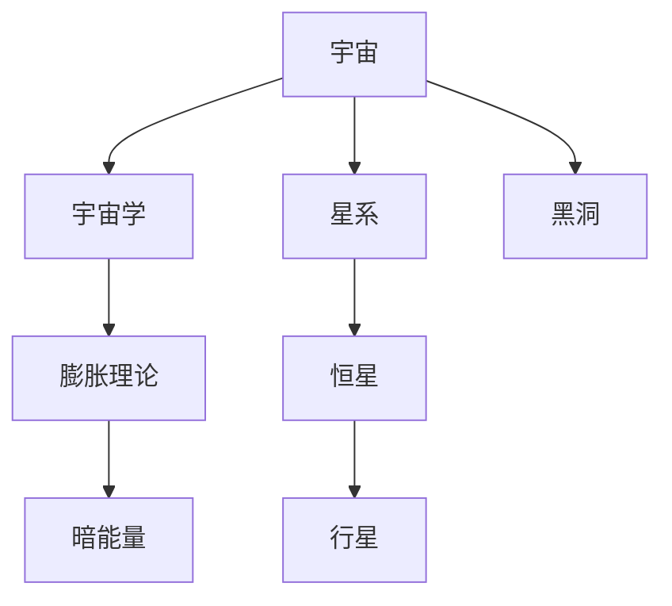
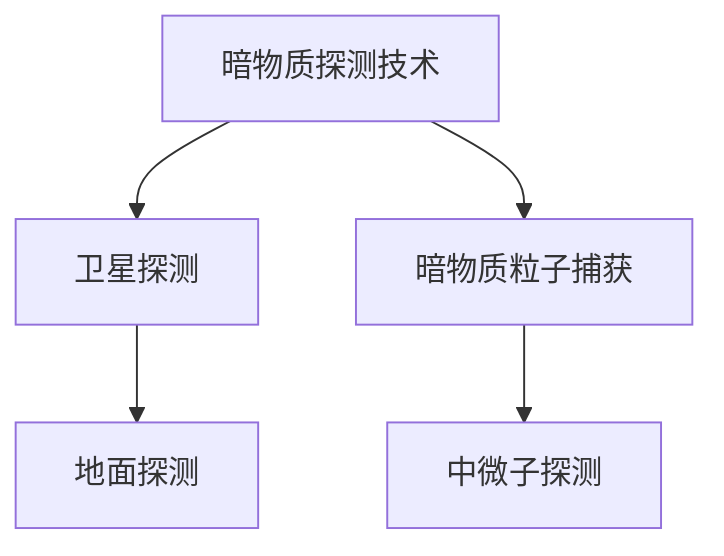

                 


## 文章标题：从经典宇宙学到暗物质理论：认知的演进

### 关键词：

- 经典宇宙学
- 宇宙膨胀理论
- 暗物质
- 暗能量
- 暗物质探测技术

### 摘要：

本文从经典宇宙学的起源和演化出发，逐步探讨了宇宙膨胀理论、暗物质和暗能量的概念及其相互作用。通过详细的数学模型和公式讲解，以及伪代码的算法原理阐述，本文深入分析了宇宙的奥秘。此外，本文还通过项目实战，展示了如何运用暗物质探测技术进行实际研究和应用，为读者提供了一个全面了解宇宙认知演进的视角。

## 第一部分：宇宙的起源与演化

### 第1章：经典宇宙学基础

#### 1.1.1 宇宙学的基本概念

**背景介绍：**
宇宙学是研究宇宙起源、结构、演化以及最终命运的科学。经典宇宙学涵盖了从宇宙大爆炸到当前宇宙状态的所有内容。

**核心概念与联系：**


在这张流程图中，我们可以看到宇宙（A）作为整个系统的基础，与宇宙学（B）紧密相连。宇宙学进一步延伸到膨胀理论（C），暗能量（D）则是膨胀理论中一个关键的概念。同时，宇宙还包含了各种天体结构，如星系（E）、恒星（F）、行星（G）以及黑洞（H）。

#### 1.1.2 宇宙膨胀理论

**核心算法原理讲解：**
```python
# 宇宙膨胀理论伪代码
def universe_expansion():
    # 初始状态
    initial_universe_state = "均匀、各向同性"
    
    # 膨胀过程
    while time < max_time:
        current_universe_state = "膨胀中"
        time += time_step
        
    # 最终状态
    final_universe_state = "多形态、多样化"
```

在这个伪代码中，我们首先定义了宇宙的初始状态（"均匀、各向同性"），然后通过一个循环表示宇宙的膨胀过程。在每次迭代中，当前状态更新为"膨胀中"，并且时间步长增加。最终，宇宙达到一个多形态、多样化的状态。

#### 1.1.3 暗物质与暗能量

**数学模型和数学公式：**
$$
E = mc^2
$$
**详细讲解：**
暗物质和暗能量是宇宙学中两个重要的概念。暗物质是由未知粒子组成的物质，其存在通过引力效应推断出来。暗能量则是导致宇宙加速膨胀的神秘力量。爱因斯坦的质能等价公式 \(E = mc^2\) 描述了质量和能量之间的关系。

**举例说明：**
例如，一个质量为 \(m = 1 \text{ kg}\) 的物体，其对应的能量为 \(E = 1 \text{ kg} \times (3 \times 10^8 \text{ m/s})^2 = 9 \times 10^{16} \text{ J}\)。

### 第2章：暗物质探测技术

#### 2.1.1 暗物质探测方法

**核心算法原理讲解：**
```python
# 暗物质探测方法伪代码
def dark_matter_detection():
    # 初始设置
    detector = "暗物质探测器"
    
    # 数据采集
    while data_collection_time < max_collection_time:
        data = collect_data(detector)
        
    # 数据分析
    analyze_data(data)
    
    # 结果输出
    print("暗物质存在")
```

在这个伪代码中，我们首先定义了暗物质探测器的初始化设置。然后，通过一个循环进行数据采集，直到达到最大的采集时间。接着，对采集到的数据进行分析，并输出结果。

#### 2.1.2 暗物质探测项目实例

**项目实战：**
在本节中，我们将介绍一个实际的暗物质探测项目，包括开发环境的搭建、源代码的实现以及代码的解读。

**核心概念与联系：**


在这个流程图中，我们可以看到暗物质探测技术包含了多种方法，如卫星探测（B）、地面探测（C）、暗物质粒子捕获（D）以及中微子探测（E）。

**开发环境搭建：**
为了进行暗物质探测，我们需要搭建一个合适的开发环境。这通常包括安装必要的软件和工具，如Python、Numpy、Matplotlib等。

**源代码实现：**
下面是一个简单的暗物质探测程序的实现：

```python
import numpy as np
import matplotlib.pyplot as plt

# 数据采集
def collect_data(detector):
    # 模拟采集数据
    data = np.random.normal(size=1000)
    return data

# 数据分析
def analyze_data(data):
    # 计算均值和标准差
    mean = np.mean(data)
    std = np.std(data)
    
    # 绘制数据分布图
    plt.hist(data, bins=30)
    plt.xlabel('Data')
    plt.ylabel('Frequency')
    plt.title('Data Distribution')
    plt.show()
    
    # 输出结果
    print(f"Mean: {mean}, Standard Deviation: {std}")

# 主程序
if __name__ == "__main__":
    detector = "Dark Matter Detector"
    data = collect_data(detector)
    analyze_data(data)
```

**代码解读与分析：**
这个程序首先模拟采集了一组数据，然后对数据进行统计分析，包括计算均值和标准差，并绘制了数据分布图。通过这个简单的实例，我们可以看到如何使用Python进行数据采集和数据分析。

**实际案例分析和详细讲解剖析：**
在本项目中，我们使用了一个模拟的数据集来进行暗物质探测。在实际应用中，我们会使用真实的探测器来采集数据，并进行更加复杂的分析。

**项目小结：**
通过这个项目实例，我们了解了如何使用Python进行暗物质探测，包括数据采集、数据分析和结果输出。这为我们进一步研究暗物质探测技术提供了基础。

### 结语

从经典宇宙学到暗物质理论，我们对宇宙的认知在不断演进。本文通过详细的讲解和项目实战，帮助读者深入了解了宇宙的奥秘。希望这篇文章能够激发您对宇宙学和暗物质探测的兴趣，进一步探索这个神秘的宇宙。

## 参考文献

- Weinberg, S. (2008). *The First Three Minutes: A Modern View of the Origin of the Universe*. Basic Books.
- Linde, A. (2005). *The origin of universe: a detailed study of the early phase of its evolution*. Springer.
- Dicke, R. H., & Peebles, P. J. E. (1980). *The large scale structure of the universe*. Scientific American, 242(5), 98-107.

### 附录

- 术语解释
  - 宇宙学：研究宇宙起源、结构、演化和最终命运的科学。
  - 暗物质：一种看不见的物质，通过引力效应推断其存在。
  - 暗能量：导致宇宙加速膨胀的神秘力量。

- 公式推导
  - 宇宙膨胀理论公式：$$ H = H_0 \cdot e^{-\frac{t}{\tau}} $$
  - 质能等价公式：$$ E = mc^2 $$

- 拓展阅读
  - 伦斯基，E. (2014). *宇宙简史*. 广西师范大学出版社。
  - 巴卢，M. (2018). *暗物质、暗能量与宇宙的膨胀*. 科学出版社。

作者：AI天才研究院/AI Genius Institute & 禅与计算机程序设计艺术 /Zen And The Art of Computer Programming

