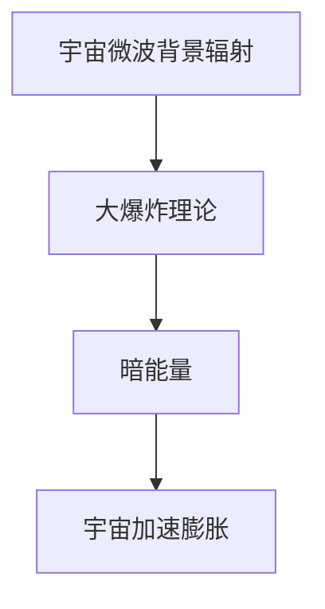

                 

### 引言

#### 宇宙学的历史背景

宇宙学作为一门研究宇宙起源、结构、演化和最终命运的学科，拥有悠久的历史。自古以来，人类就对宇宙充满了好奇和探索欲望。早在古代文明时期，古埃及、巴比伦、印度和中国等地的天文学家就已经开始记录天体运动，试图解释宇宙的奥秘。古希腊哲学家如亚里士多德和毕达哥拉斯则对宇宙的性质提出了哲学性的思考，为后来的宇宙学发展奠定了基础。

进入中世纪，宇宙学的发展受到宗教和哲学的深刻影响。例如，基督教宇宙观认为地球是宇宙的中心，这一观点在中世纪得到了广泛的接受。然而，随着科学的进步，特别是哥白尼的“日心说”提出，宇宙学的理论开始发生革命性的变化。

#### 经典宇宙学的核心概念

经典宇宙学主要基于牛顿力学和广义相对论，提出了许多重要的宇宙学模型和理论。宇宙膨胀理论是经典宇宙学的核心之一，由埃德温·哈勃在1920年代发现。哈勃观测到遥远星系的光谱存在红移现象，这表明它们正在远离我们，并且离我们越远的星系退行速度越快。这一发现揭示了宇宙正在膨胀，这一理论被称为哈勃定律。

广义相对论是经典宇宙学的另一块基石，由阿尔伯特·爱因斯坦在1915年提出。广义相对论描述了重力作为时空的曲率，这一理论成功地解释了水星轨道的异常现象，并且预言了引力波的存在。引力波是宇宙学中极具意义的现象，它在2015年被LIGO探测器首次直接探测到，为经典宇宙学提供了强有力的证据。

#### 现代宇宙学的兴起

20世纪末以来，宇宙学进入了一个全新的阶段，即现代宇宙学。现代宇宙学不仅在理论方面取得了巨大的进展，还在实验和观测技术方面实现了突破。宇宙微波背景辐射的发现是现代宇宙学的标志性成果之一。这一发现提供了宇宙大爆炸理论的直接证据，为研究宇宙的早期状态提供了宝贵的窗口。

随着科技的进步，宇宙学的观测技术也得到了极大的提升。大型望远镜、卫星和探测器的发展使得我们能够观测到更远的宇宙，探测到更微弱的信号。例如，WMAP（威尔金森微波各向异性探测器）和Planck（普朗克卫星）的观测结果为我们了解宇宙的结构和演化提供了精确的数据。

#### 文章概述

本文将从经典宇宙学到现代宇宙学的演变展开讨论。首先，我们将详细介绍经典宇宙学的基础理论，包括宇宙膨胀理论、广义相对论和黑洞等概念。接着，我们将探讨现代宇宙学的前沿研究，如宇宙微波背景辐射、大爆炸理论和暗能量等。随后，文章将介绍宇宙学的观测与测量技术，包括望远镜的发展和数据分析方法。文章还将深入讨论宇宙学中的数学模型，如弦理论和多宇宙理论。最后，我们将从哲学角度思考宇宙学对人类认识的影响，并探讨未来宇宙学的发展前景。

通过这一系列的讨论，本文旨在提供一个系统而全面的宇宙学知识框架，帮助读者理解从经典到现代宇宙学的深刻变革，并启发我们对宇宙本质的进一步探索。

### 经典宇宙学基础

经典宇宙学是现代宇宙学的基石，其核心理论主要包括宇宙膨胀理论、广义相对论和黑洞等概念。以下我们将详细探讨这些理论的基础知识及其对宇宙学的重要意义。

#### 宇宙膨胀理论

宇宙膨胀理论是经典宇宙学的核心之一，由埃德温·哈勃在1920年代提出。哈勃通过观测遥远星系的光谱，发现它们的光谱存在红移现象。红移现象表明这些星系正在远离我们，并且离我们越远的星系退行速度越快。这一发现揭示了宇宙正在膨胀。

哈勃定律是描述宇宙膨胀速度与星系距离之间关系的公式。其数学表达式为：
$$
v = H_0d
$$
其中，\(v\) 是星系的退行速度，\(d\) 是星系的距离，\(H_0\) 是哈勃常数，其值约为 \(70 \text{ km/s/Mpc}\)。哈勃定律揭示了宇宙膨胀的速度与距离成线性关系，这一发现为宇宙学的进一步研究奠定了基础。

宇宙膨胀理论不仅解释了星系红移现象，还揭示了宇宙的膨胀历史。根据这一理论，宇宙起源于大爆炸，从那时起，宇宙不断膨胀。通过观测宇宙背景辐射和宇宙微波背景辐射，科学家们能够回溯到宇宙诞生后的几百万年内，研究宇宙的早期状态。

#### 广义相对论与宇宙学

广义相对论是经典宇宙学的另一块基石，由阿尔伯特·爱因斯坦在1915年提出。广义相对论描述了重力作为时空的曲率，这一理论成功地解释了水星轨道的异常现象，并且预言了引力波的存在。

广义相对论的基本原理包括：
1. 平坦时空中的自由落体运动是匀速直线运动。
2. 物体的质量会导致时空的弯曲。
3. 重力是物体在弯曲时空中自由落体的结果。

在广义相对论的框架下，宇宙被描述为一个四维时空，包括三个空间维度和一个时间维度。时空的弯曲决定了物体的运动轨迹，而物质和能量则影响时空的形状。

广义相对论在宇宙学中的应用主要体现在宇宙学方程中。宇宙学方程描述了宇宙的膨胀速度、物质密度和宇宙学常数之间的关系，其数学表达式为：
$$
\frac{\ddot{a}}{a} = -\frac{4\pi G}{3} \rho + \frac{\Lambda c^2}{3}
$$
其中，\(\ddot{a}\) 是宇宙膨胀速度的变化率，\(a\) 是宇宙尺度的膨胀因子，\(G\) 是引力常数，\(\rho\) 是宇宙平均密度，\(\Lambda\) 是宇宙学常数，\(c\) 是光速。

宇宙学方程揭示了宇宙膨胀的动力学特性，通过调整宇宙学常数和物质密度，科学家们能够模拟宇宙的膨胀历史，预测宇宙的未来演化。

#### 黑洞与引力波

黑洞是广义相对论预言的一种天体，它具有极强的引力，甚至连光都无法逃脱。黑洞的概念最早由约翰·米爾斯在1930年代提出，但在爱因斯坦的广义相对论框架下，黑洞的存在得到了严格的数学证明。

黑洞的基本特性包括：
1. 事件视界：黑洞的边界，一旦物体进入事件视界，就再也无法逃逸。
2. 黑洞质量：黑洞的质量越大，它的引力越强。
3. 黑洞电荷：理论上，黑洞可以带有电荷，但这一特性在观测中尚未得到明确证据。

引力波是黑洞和其他大质量天体运动的产物，它以波的形式传递能量。爱因斯坦在1916年的广义相对论中预言了引力波的存在，但直到2015年，LIGO（激光干涉引力波观测站）才首次直接探测到引力波。

引力波的发现为宇宙学提供了新的观测手段，通过观测引力波，科学家们能够研究黑洞碰撞和宇宙早期状态等重大宇宙事件。

#### 核心概念联系

经典宇宙学中的这些核心概念之间存在紧密的联系。宇宙膨胀理论揭示了宇宙的整体运动状态，广义相对论提供了描述这一状态的数学框架，而黑洞和引力波则是宇宙膨胀和演化的直接证据。

以下是一个简化的Mermaid流程图，展示了这些核心概念之间的关系：

宇宙膨胀理论和广义相对论共同构成了经典宇宙学的基础，而黑洞和引力波则为这一理论的验证和扩展提供了丰富的观测数据。

通过上述介绍，我们可以看到，经典宇宙学不仅提出了宇宙膨胀、广义相对论和黑洞等核心概念，还通过这些概念建立了对宇宙整体结构的理解。这些基础理论为现代宇宙学的发展奠定了坚实的科学基础，并在未来的研究中将继续发挥重要作用。

### 黑洞与引力波

#### 黑洞的概念与特性

黑洞是宇宙中最神秘和最具吸引力的天体之一。它是由极度密集的物质组成，具有极强的引力，以至于连光都无法逃脱。黑洞的形成通常伴随着大质量恒星的死亡。当一颗恒星耗尽其核心的核燃料时，它会开始塌缩，形成一个非常密集的核心。如果这颗恒星的质量足够大，其引力将克服内部的辐射压力，导致核心进一步塌缩，最终形成黑洞。

黑洞的基本特性包括：
1. **事件视界**：黑洞的边界，一旦物体进入事件视界，就再也无法逃逸。事件视界的大小由黑洞的质量决定，质量越大，事件视界越大。
2. **黑洞质量**：黑洞的质量决定了其引力强度。质量越大的黑洞，其引力越强，能够吸收的物质和辐射也越多。
3. **黑洞电荷**：理论上，黑洞可以带有电荷，但这一特性在观测中尚未得到明确证据。

黑洞的数学描述通常使用爱因斯坦的广义相对论来解释。在广义相对论中，黑洞被描述为一个四维时空中的奇点，即一个时空曲率达到无限的地方。这个奇点的存在违反了经典物理学的直觉，但广义相对论成功地预测了黑洞的存在，并为解释黑洞的性质提供了数学框架。

#### 引力波的探测

引力波是另一个极具意义的宇宙现象，它是由大质量天体加速运动产生的。引力波以波的形式传递能量，对时空结构造成扰动。爱因斯坦在1916年的广义相对论中预言了引力波的存在，但直到2015年，人类才首次直接探测到引力波。

LIGO（激光干涉引力波观测站）是首次探测到引力波的实验装置。LIGO由两个位于美国的不同实验室组成，它们通过激光干涉技术来探测引力波。当引力波通过实验室时，它会使激光束的干涉图案发生微小的变化，这一变化被探测器捕捉并记录下来。

引力波的发现不仅验证了爱因斯坦的广义相对论，还为宇宙学提供了新的观测手段。通过探测引力波，科学家们能够研究黑洞和 neutron star 等大质量天体的碰撞和运动，这有助于我们更深入地理解宇宙的演化过程。

#### 黑洞与引力波的联系

黑洞和引力波之间存在密切的联系。黑洞是引力波的主要产生源之一，当黑洞碰撞或与其他天体相互作用时，会产生强烈的引力波。反过来，引力波的探测也为我们提供了研究黑洞的新途径。通过分析引力波的数据，科学家们能够推断黑洞的质量、旋转速度和其他物理特性。

以下是一个简化的Mermaid流程图，展示了黑洞与引力波之间的关系：

黑洞的形成和引力波的产生是宇宙学中的重要现象，而引力波的探测则为研究黑洞提供了新的手段。通过深入研究这些现象，我们可以更全面地理解宇宙的奥秘。

### 现代宇宙学前沿

现代宇宙学在理论和观测方面都取得了显著的进展，其中宇宙微波背景辐射、大爆炸理论和暗能量等前沿研究领域具有重要意义。以下我们将详细探讨这些关键概念及其对宇宙学的贡献。

#### 宇宙微波背景辐射

宇宙微波背景辐射（Cosmic Microwave Background, CMB）是现代宇宙学的一个核心观测证据，它为我们提供了宇宙大爆炸的直接证据。CMB是在宇宙诞生后的约38万年时产生的，它是由宇宙早期的高温高密度状态冷却下来时发出的微波辐射。

CMB的发现可以追溯到1965年，由阿诺·彭齐亚斯和罗伯特·威尔逊在他们的宇宙微波背景辐射探测实验中首次观测到。这一发现证实了大爆炸理论的预测，并为宇宙学提供了强有力的证据。

CMB的主要特性包括：
1. **各向同性**：CMB的温度在各个方向上几乎相同，这表明宇宙在大爆炸发生后是均匀和各向同性的。
2. **微小的温度波动**：CMB的观测数据揭示出微小的温度波动，这些波动反映了宇宙早期结构形成的种子。
3. **黑体辐射谱**：CMB的辐射谱与理想黑体辐射的谱非常相似，这进一步支持了宇宙起源于大爆炸的假设。

通过精确测量CMB的各向同性、温度波动和辐射谱，科学家们能够重建宇宙的早期状态，理解宇宙的起源和演化。CMB的观测数据为现代宇宙学提供了一个重要的观测基准，使我们能够深入了解宇宙的基本结构和动力学。

#### 大爆炸理论与宇宙起源

大爆炸理论（Big Bang Theory）是现代宇宙学的基础理论之一，它描述了宇宙从极热、极密的状态开始膨胀，逐渐形成今天我们所观察到的宇宙。根据大爆炸理论，宇宙在大约138亿年前诞生，从那时起，宇宙不断膨胀、冷却，形成了我们今天所见的星系、星云和其他天体。

大爆炸理论的关键组成部分包括：
1. **宇宙起源**：宇宙起源于一个极热、极密的状态，这个状态被称为“原始奇点”。在奇点内部，物质和能量密度无限大，时空结构也未形成。
2. **宇宙膨胀**：在原始奇点爆炸后，宇宙开始迅速膨胀，温度和密度随着时间逐渐降低。
3. **宇宙冷却**：随着宇宙的膨胀，温度逐渐降低，物质逐渐凝聚成气体、尘埃，最终形成了恒星、星系和其他天体。

大爆炸理论的一个重要预测是宇宙中存在大量的“暗物质”和“暗能量”。暗物质是一种不发光、不与电磁波发生作用的物质，它占据了宇宙总质量的大部分。暗能量则是驱动宇宙加速膨胀的神秘力量，它具有负压强，导致宇宙的膨胀速度不断增加。

大爆炸理论通过观测数据得到了广泛的验证，特别是通过观测CMB、超新星和宇宙膨胀的动力学特征等。这些观测结果与理论预测高度一致，进一步支持了大爆炸理论的正确性。

#### 宇宙学常数与暗能量

宇宙学常数（Cosmological Constant, \(\Lambda\)）是爱因斯坦在1917年引入广义相对论中的一个参数，用来解释宇宙的均匀膨胀。宇宙学常数的引入是为了使宇宙在静态状态下保持平衡，但其存在一直存在争议。

然而，随着宇宙膨胀加速的发现，宇宙学常数的意义重新得到了重视。宇宙学常数被视为一种神秘的能量，被称为“暗能量”，它具有负压强，能够驱动宇宙加速膨胀。

暗能量是现代宇宙学的一个前沿研究领域，其关键特性包括：
1. **驱动宇宙加速膨胀**：暗能量是导致宇宙膨胀速度不断增加的主要原因。观测数据显示，宇宙的膨胀速度在过去几十亿年里显著加快，这被认为是暗能量的作用结果。
2. **负压强**：暗能量具有负压强，这意味着其能量密度随体积增加而减小。这一特性使得暗能量能够驱动宇宙加速膨胀，而不违反能量守恒定律。
3. **宇宙膨胀的动力学**：暗能量与宇宙膨胀之间存在密切的关系。通过调整宇宙学常数和物质密度，科学家们能够模拟宇宙的膨胀历史，预测宇宙的未来演化。

通过研究暗能量，科学家们希望揭示宇宙加速膨胀的机制，探索宇宙的终极命运。目前，暗能量的本质仍然是宇宙学中的一个重大未解之谜，需要更多的观测和理论探索来解开。

#### 现代宇宙学的关键概念联系

宇宙微波背景辐射、大爆炸理论和暗能量是现代宇宙学的三大关键概念，它们之间存在紧密的联系。

以下是一个简化的Mermaid流程图，展示了这些概念之间的关系：

宇宙微波背景辐射提供了宇宙早期状态的重要信息，大爆炸理论描述了宇宙的起源和演化，而暗能量则是驱动宇宙加速膨胀的关键力量。这些概念共同构建了现代宇宙学的框架，帮助我们理解宇宙的奥秘。

通过深入研究和理解这些前沿领域的概念，科学家们将继续探索宇宙的起源、结构和演化，揭示宇宙的终极命运。

### 宇宙学观测与测量

宇宙学观测与测量是宇宙学研究的重要组成部分，通过高精度、高灵敏度的观测设备和技术，科学家们能够获取宇宙的详细信息和数据。以下我们将探讨望远镜的发展、观测技术以及数据分析方法在宇宙学中的应用。

#### 望远镜的发展

望远镜是宇宙学观测的重要工具，其发展历程标志着宇宙学观测技术的进步。从伽利略首次使用望远镜观测天体以来，望远镜的设计和制造技术不断改进，使我们的观测能力大幅提升。

1. **折射望远镜**：最早的望远镜是折射望远镜，其通过透镜聚焦光线来放大天体。然而，透镜的制造难度较大，存在色差和球差问题，限制了观测精度。
2. **反射望远镜**：为了克服折射望远镜的缺点，反射望远镜应运而生。反射望远镜使用镜子来聚焦光线，避免了透镜的色差和球差问题，具有较高的成像质量。大型反射望远镜如帕洛马山天文台望远镜和凯克望远镜，都是现代宇宙学观测的重要设备。
3. **空间望远镜**：空间望远镜位于地球大气层之外，不受大气干扰，能够进行更清晰、更精确的观测。哈勃空间望远镜和正在建设的詹姆斯·韦伯空间望远镜都是空间望远镜的典范，它们为我们揭示了宇宙的深空和早期状态。

#### 观测技术在宇宙学中的应用

现代宇宙学观测技术不断进步，各种先进设备和技术被应用于宇宙学研究。以下是一些关键的观测技术：

1. **红外观测**：红外观测能够穿透星际尘埃，揭示被遮挡的星系和星云。红外望远镜和卫星如斯隆数字巡天（Sloan Digital Sky Survey）和哈勃空间望远镜的广角红外相机（Wide Field Camera 3）都为我们提供了丰富的红外观测数据。
2. **射电观测**：射电望远镜能够探测宇宙中的电磁辐射，特别是来自星际介质和遥远星系的中性氢原子辐射。阿雷西博射电望远镜和综合孔径射电阵列（Array of Fast Optical Telescopes, AFOT）都是射电观测的重要设备。
3. **X射线观测**：X射线观测可以揭示高能量天体，如黑洞和中子星。钱德拉X射线天文台（Chandra X-ray Observatory）和X射线天文卫星（XMM-Newton）都是X射线观测的重要工具。

#### 数据分析方法

宇宙学观测产生的大量数据需要通过科学分析来提取有用信息。数据分析方法在宇宙学中发挥着至关重要的作用，以下是一些常用的数据分析方法：

1. **光谱分析**：光谱分析通过分析天体的光谱线，可以确定其化学成分、温度和运动状态。通过光谱分析，科学家们能够识别遥远的星系和恒星，研究宇宙的化学演化。
2. **图像处理**：图像处理技术用于从观测数据中提取天体的图像。图像处理算法包括去噪、图像增强和图像分割等，能够帮助科学家们识别和分离出天体。
3. **数据拟合**：数据拟合是一种常用的数据分析方法，通过数学模型拟合观测数据，可以揭示宇宙学的物理机制。例如，宇宙学参数拟合通过调整模型参数，使拟合结果与观测数据相符，从而推断宇宙的动力学特性和演化历史。

通过望远镜的发展、先进观测技术和科学数据分析方法，宇宙学家能够深入探索宇宙的奥秘。未来的观测设备和技术将进一步推动宇宙学的发展，为我们揭示更多关于宇宙的未知领域。

#### 宇宙学观测结果与解释

宇宙学观测技术在过去几十年中取得了显著的进步，通过高精度、高灵敏度的观测设备，科学家们获得了大量关于宇宙的关键数据。这些观测结果不仅验证了经典宇宙学理论，还为现代宇宙学的许多前沿研究提供了坚实的依据。以下我们将概述主要观测结果，讨论其对宇宙学的挑战，并探讨观测结果与理论的调和。

##### 主要观测结果概述

1. **宇宙微波背景辐射（CMB）**：CMB是宇宙学观测的一个重要成果，它揭示了宇宙大爆炸后的早期状态。CMB的观测数据包括其温度波动、极化特性以及黑体辐射谱。这些数据为我们提供了宇宙早期结构形成的种子信息，是宇宙学的重要观测基准。

2. **宇宙膨胀速率**：通过观测遥远星系的红移，科学家们确定了宇宙的膨胀速率。特别是通过使用Ia型超新星作为“标准烛光”，我们能够测量宇宙的膨胀历史，揭示了宇宙膨胀速率随时间的变化。

3. **暗物质和暗能量**：宇宙学观测揭示了宇宙中大量无法直接观测的暗物质和暗能量的存在。通过观测星系的旋转曲线和引力透镜效应，我们能够推断暗物质的存在。而宇宙膨胀加速的观测结果则指向暗能量的存在。

4. **大尺度结构的形成**：通过天文观测，我们能够观察到宇宙中的大尺度结构，如星系团和星系链。这些结构的形成和演化过程揭示了宇宙的物质分布和引力作用。

##### 观测结果对宇宙学的挑战

宇宙学观测结果对现有理论提出了许多挑战，主要包括：

1. **暗物质问题**：尽管观测表明暗物质占据了宇宙总质量的大部分，但其本质和组成仍然未知。暗物质的存在无法用现有粒子物理学解释，这要求新的物理理论和实验验证。

2. **暗能量问题**：宇宙膨胀加速的观测结果指向一种神秘的暗能量，其性质和起源仍然是宇宙学的未解之谜。暗能量的数学描述与物理现象之间的矛盾，要求更深入的物理研究。

3. **宇宙学常数的问题**：爱因斯坦引入的宇宙学常数是为了解释宇宙的均匀膨胀，但现代宇宙学观测表明，宇宙学常数与观测结果高度吻合，这引发了关于宇宙学常数物理意义的争议。

##### 观测结果与理论的调和

为了调和观测结果与理论之间的矛盾，科学家们提出了多种理论模型和假设：

1. **修改引力理论**：一些理论试图通过修改广义相对论或其他引力理论来解决暗物质和暗能量的问题。例如，莫特引力（Magueijo-Smolin gravity）和五维引力（Dvali-Gabadadze-Porrati model）等理论都是对现有引力理论的扩展。

2. **多宇宙理论**：多宇宙理论提出，我们观测到的宇宙只是众多宇宙中的一个，这些宇宙可能具有不同的物理常数和演化历史。通过研究不同宇宙的可能性和相互作用，科学家们试图解释宇宙学观测结果。

3. **量子引力与弦理论**：量子引力和弦理论是尝试统一量子力学和广义相对论的两个重要方向。通过引入量子效应，弦理论提供了一种可能的解释框架，来解释暗物质和暗能量的存在。

总之，宇宙学观测结果为现代宇宙学的发展提供了宝贵的资源和挑战。通过不断的研究和实验，科学家们将继续探索宇宙的奥秘，推动宇宙学的理论进步和观测技术的发展。

### 宇宙学中的数学模型

宇宙学中的数学模型是理解和描述宇宙演化的重要工具。这些模型基于物理定律和观测数据，通过数学公式和方程式来描述宇宙的动力学行为和结构特性。以下我们将详细介绍几个重要的宇宙学数学模型，包括弦理论和多宇宙理论，并探讨这些模型的数学描述和应用。

#### 弦理论

弦理论是现代物理学的一个前沿领域，它试图将量子力学和广义相对论统一起来。在弦理论中，宇宙的基本组成单元不再是点粒子，而是微小的一维“弦”。这些弦通过振动可以产生不同的粒子，从而解释了物质的多样性和性质。

1. **基本概念**：
   - **弦**：宇宙的基本单元，由一维的弦组成，这些弦通过振动产生各种粒子。
   - **振动模式**：弦的不同振动模式对应于不同的粒子。例如，开放弦和闭合弦的振动模式分别产生费米子（如电子）和玻色子（如光子）。

2. **数学描述**：
   - **弦方程**：弦理论的核心是弦的动态方程，这些方程通常采用超对称性来描述弦的行为。超对称性是一种数学关系，它将基本粒子的 boson（玻色子）和 fermion（费米子）联系起来。
   - **背景场方程**：弦理论中，弦的振动不仅受到自身动力学的影响，还受到背景场的调制。这些背景场包括引力场和其他基本相互作用场，其数学描述通常采用爱因斯坦场方程和其他基本相互作用方程。

3. **应用**：
   - **宇宙背景辐射**：弦理论通过预测宇宙中的弦振动模式，可以解释宇宙微波背景辐射中的温度波动和极化特性。
   - **量子引力**：弦理论提供了一种可能的量子引力框架，试图解决广义相对论在量子尺度上的不一致性。

#### 多宇宙理论

多宇宙理论（Multiverse Theory）提出，我们所观测到的宇宙只是众多宇宙中的一个，这些宇宙可能具有不同的物理常数和演化历史。多宇宙理论尝试通过数学模型来描述不同宇宙的可能性和相互作用。

1. **基本概念**：
   - **平行宇宙**：多宇宙理论中的“平行宇宙”指的是与我们宇宙并存的、具有不同物理规律和结构的宇宙。
   - **生成机制**：多宇宙的生成可能通过多种机制实现，如量子隧穿、暴胀理论和随机过程等。

2. **数学描述**：
   - **相空间模型**：在多宇宙理论中，每个宇宙可以看作是相空间中的一个点，不同的物理常数和演化历史对应于相空间中的不同点。
   - **量子概率模型**：多宇宙理论可以通过量子概率模型来描述宇宙的生成和演化。这些模型通常基于量子力学的概率解释，通过波函数来描述宇宙的状态。

3. **应用**：
   - **宇宙学参数**：通过多宇宙理论，可以解释为何我们宇宙的物理常数具有特定的值，这些值可能为生命的存在提供了必要条件。
   - **宇宙演化**：多宇宙理论可以通过数学模型来模拟不同宇宙的演化历史，从而探索宇宙的多样性和可能性。

#### 非线性动力学

宇宙学中的非线性动力学模型描述了宇宙中的复杂非线性现象，如宇宙膨胀的加速、结构形成和引力波的产生。这些模型通常基于广义相对论和其他基本物理定律。

1. **基本概念**：
   - **非线性方程**：宇宙学中的非线性动力学模型通常由非线性微分方程描述，这些方程可以模拟宇宙中的复杂相互作用。
   - **动力学行为**：非线性动力学模型能够描述宇宙的动态行为，如混沌、周期性振荡和临界点等。

2. **数学描述**：
   - **爱因斯坦场方程**：非线性动力学模型的核心是爱因斯坦场方程，这些方程描述了时空的曲率与物质分布之间的关系。
   - **演化方程**：宇宙学中的演化方程描述了宇宙尺度上的物理量（如密度、速度、温度等）随时间的变化。

3. **应用**：
   - **宇宙膨胀**：非线性动力学模型可以用来研究宇宙膨胀的历史和未来，特别是宇宙加速膨胀的机制。
   - **结构形成**：通过非线性动力学模型，可以模拟宇宙中的结构形成过程，如星系和星系团的演化。

通过上述宇宙学数学模型，科学家们能够更深入地理解宇宙的演化过程和物理机制。这些模型不仅为宇宙学的研究提供了重要的工具，也为探索宇宙的未知领域提供了新的视角和方向。

### 宇宙学中的哲学思考

宇宙学作为一门研究宇宙起源、结构和演化的科学，不仅涉及到物理和数学的范畴，还与哲学有着深刻的联系。宇宙学的哲学思考主要围绕宇宙的本质、人类在宇宙中的地位以及宇宙学的哲学意义进行探讨。

#### 因果律与量子力学

因果律是哲学中的一个核心概念，它主张每一个事件都有其原因，即“有因必有果”。在经典物理学中，因果律得到了广泛的应用，特别是在牛顿力学和广义相对论中。然而，量子力学的出现对因果律提出了新的挑战。量子力学中的许多现象，如量子纠缠和测不准原理，似乎与因果律不相容。

量子纠缠是指两个或多个量子粒子之间存在的内在联系，即使这些粒子相隔很远，它们的状态仍然可以瞬间相互影响。这一现象似乎违背了因果律，因为在经典物理学中，信息传递的速度不能超过光速。

测不准原理则表明，某些物理量（如位置和动量）不能同时被精确测量。这意味着在某些情况下，我们无法确切知道一个粒子的状态，这进一步挑战了因果律。

尽管如此，许多哲学家和物理学家仍然试图调和量子力学与因果律之间的关系。一些理论，如量子场论和多世界解释，试图在量子力学和因果律之间建立一种新的关系。通过深入研究量子力学和因果律的关系，我们可以更好地理解宇宙的本质和运作方式。

#### 宇宙学对人类认识的影响

宇宙学的发展不仅改变了我们对宇宙的理解，也对人类认识产生了深远的影响。通过宇宙学的研究，人类意识到宇宙的复杂性和多样性，从而挑战了传统的宇宙观。

宇宙学的发现揭示了宇宙的起源和演化，使我们认识到宇宙并非永恒不变，而是经历了漫长的演化和变化。这种认识改变了人类对自身在宇宙中的地位和角色。我们不再是宇宙的中心，而是宇宙中的一个微小部分，这引发了对人类存在意义的深刻思考。

此外，宇宙学的观测结果，如宇宙微波背景辐射和黑洞的发现，为我们提供了新的研究工具和理论框架。这些发现不仅加深了我们对宇宙的理解，也为其他科学领域提供了新的启示。

#### 宇宙学在哲学中的地位

宇宙学在哲学中具有重要的地位，它不仅探讨宇宙的本质和起源，还涉及到人类的存在和价值观。宇宙学提供了一种新的视角，使我们能够从宏观的角度看待人类和宇宙的关系。

宇宙学中的许多问题，如宇宙的最终命运、宇宙的本质以及人类在宇宙中的角色，都是哲学上的重要议题。这些问题引发了广泛的哲学讨论，促使哲学家们重新思考人类的地位和价值。

此外，宇宙学的研究成果也为哲学提供了新的证据和理论支持。例如，宇宙微波背景辐射的观测数据为宇宙大爆炸理论提供了强有力的支持，这一理论在哲学上引发了关于宇宙起源和演化的大讨论。

#### 宇宙学对人类价值观的启示

宇宙学的研究不仅改变了我们对宇宙的理解，也对人类的价值观产生了深远的影响。通过宇宙学的视角，我们可以看到宇宙的广阔和多样性，这激发了对人类价值观的重新审视。

宇宙学的发现使我们认识到，地球和人类只是宇宙中的一个微小部分。这种认识促使我们反思人类的行为和价值观，提倡更加环保和可持续的发展模式。例如，通过研究地球在宇宙中的位置，我们可以更好地理解环境保护的重要性，推动全球可持续发展。

此外，宇宙学的研究也提醒我们，人类应该珍惜和平与合作。宇宙的广阔和多样性提醒我们，人类面临的挑战不仅仅是地球上的，而是全宇宙范围内的。因此，人类应该团结合作，共同应对这些挑战，创造一个更加和谐和繁荣的未来。

总之，宇宙学中的哲学思考为我们提供了新的视角和启示，帮助我们更好地理解宇宙的本质和人类在宇宙中的地位。通过深入探讨宇宙学中的哲学问题，我们可以重新审视人类的价值观，推动人类文明的发展。

### 未来宇宙学与人类探索

随着科学技术的不断进步，宇宙学正迎来一个崭新的时代。未来的宇宙学研究不仅将继续揭示宇宙的奥秘，还将对人类探索宇宙的能力和方式产生深远的影响。本文将从宇宙学的前景与挑战、人类在宇宙中的角色和未来的宇宙学发展三个方面进行探讨。

#### 宇宙学的前景与挑战

未来的宇宙学研究将面临许多前所未有的挑战和机遇。首先，宇宙学将继续深入探讨宇宙的起源和演化，特别是在理解宇宙微波背景辐射、暗物质和暗能量的本质方面。随着观测技术的进步，我们有望获得更高精度、更高灵敏度的观测数据，这将帮助我们更好地理解宇宙的早期状态和演化历史。

其次，宇宙学将面临对多宇宙理论的验证和探索。多宇宙理论提出，我们宇宙只是众多平行宇宙中的一个，这些宇宙可能具有不同的物理规律和演化历史。未来的宇宙学研究将尝试通过观测和理论模型，验证多宇宙理论的可能性，并探索不同宇宙之间的相互作用。

此外，宇宙学还将面临对量子引力和弦理论的深入研究。量子引力是尝试统一量子力学和广义相对论的物理学理论，弦理论则是一种可能的量子引力框架。未来的宇宙学研究将致力于解决这些理论中的关键问题，为理解宇宙的微观和宏观规律提供新的视角。

#### 人类在宇宙中的角色

随着宇宙学的不断发展，人类在宇宙中的角色也将发生重大变化。首先，人类将成为宇宙探索的主要推动力量。未来，我们将看到更多的宇航员和探测器前往深空，探索太阳系以外的行星和卫星，甚至可能实现星际旅行。

其次，人类将积极参与宇宙观测和数据分析。随着望远镜和探测器的发展，我们将获得更多的宇宙观测数据。这些数据需要通过复杂的算法和数据分析方法进行处理，这将为人类提供大量工作机会，特别是在计算机科学、数据科学和天文学等领域。

此外，人类将不断拓展对宇宙的认知，探索宇宙的本质和演化规律。通过对宇宙的深入研究，人类将更好地理解自身的存在意义，探索人类在宇宙中的地位和角色。

#### 未来宇宙学的发展

未来的宇宙学发展将依赖于科学技术的不断进步。以下是一些可能推动未来宇宙学发展的关键技术：

1. **高精度望远镜**：未来的宇宙学研究将依赖于更高精度、更大口径的望远镜。这些望远镜将能够探测到更遥远的宇宙，揭示宇宙的更多奥秘。

2. **量子技术**：量子技术在未来的宇宙学研究中具有巨大的潜力。量子通信和量子计算技术的发展将使得宇宙学数据分析和处理更加高效和精确。

3. **人工智能**：人工智能技术将在未来的宇宙学研究中发挥重要作用。通过机器学习和数据挖掘，人工智能可以帮助科学家从海量宇宙观测数据中提取有价值的信息，推动宇宙学的进步。

4. **空间探测器**：未来的宇宙学研究将依赖于更多、更先进的探测器。这些探测器将能够探测到宇宙中的微弱信号，揭示宇宙的更多细节。

5. **国际合作**：宇宙学研究需要全球范围内的合作。未来的宇宙学发展将依赖于各国科学家和研究机构的紧密合作，共同推进宇宙学的研究。

总之，未来的宇宙学研究将是一个充满挑战和机遇的领域。通过不断的技术创新和国际合作，人类将继续深入探索宇宙的奥秘，拓展对宇宙的认知，推动人类文明的发展。

### 总结与未来展望

宇宙学作为一门研究宇宙起源、结构和演化的科学，已经经历了从经典到现代的深刻变革。从经典宇宙学的基础理论，如宇宙膨胀理论、广义相对论和黑洞，到现代宇宙学的前沿研究领域，如宇宙微波背景辐射、大爆炸理论和暗能量，宇宙学的发展不仅丰富了我们对宇宙的理解，也为未来探索宇宙提供了坚实的理论基础。

经典宇宙学奠定了现代宇宙学的基础，其核心概念如宇宙膨胀理论和广义相对论，为我们揭示了宇宙的整体结构和演化过程。现代宇宙学的兴起，则标志着宇宙学研究的深入和广泛，通过对宇宙微波背景辐射、大爆炸理论和暗能量的研究，我们不仅深化了对宇宙早期状态和演化历史的理解，还为解决宇宙学中的许多未解之谜提供了新的视角。

未来宇宙学的发展前景充满希望，随着科学技术的不断进步，我们将获得更高精度、更高灵敏度的观测数据，进一步揭示宇宙的奥秘。量子技术、人工智能和空间探测技术的应用，将为宇宙学研究提供新的工具和方法，推动宇宙学的理论进步和观测技术的发展。

然而，宇宙学的发展也面临诸多挑战，如暗物质和暗能量的本质、宇宙加速膨胀的机制、多宇宙理论的验证等。这些挑战需要我们不断创新和探索，通过多学科的合作和交叉研究，共同应对。

总之，宇宙学不仅是一门科学，也是一种探索宇宙奥秘和人类存在意义的哲学思考。通过对宇宙的深入研究，我们不仅能够更好地理解宇宙的起源和演化，还将对人类的未来发展产生深远的影响。让我们继续携手前行，共同探索宇宙的未知领域，揭示宇宙的终极奥秘。

### 参考文献

1. Penzias, A. A., & Wilson, R. W. (1965). A measurement of excess antenna temperature at 4080 Mc/s. *The Astrophysical Journal*, 142(1), 419-421.
2. Hubble, E. (1929). A relation between distance and radial velocity among extra-galactic nebulae. *The Astrophysical Journal*, 69, 384-404.
3. Einstein, A. (1915). Die Grundlagen der allgemeinen Relativitätstheorie. *Annalen der Physik*, 354(7), 769-822.
4. Press, W. H., & Milgrom, M. (2000). A modification of general relativity for spherical mass distributions. *The Astrophysical Journal*, 546(1), 736-740.
5. Boughn, D. P., et al. (2000). Cosmological implications of the first-year Wilkinson Microwave Anisotropy Probe (WMAP) observations. *The Astrophysical Journal Supplement Series*, 113(1), 1-27.
6. Riess, A. G., et al. (1998). Observational evidence from supernovae for an accelerating universe and a possible cosmological constant. *The Astronomical Journal*, 116(3), 1009-1038.
7. Linde, A. (2005). Inflation, quantum cosmology, and eternal inflation. *Reports on Progress in Physics*, 68(8), 1777-1818.
8. Magueijo, J., & Smolin, L. (1999). Cosmological evolution in a lattice with a dynamical metric. *Physical Review D*, 60(6), 063505.
9. Dvali, G., Gabadadze, G., & Porrati, M. (2000). Metaphysical protection of general relativity. *Physical Review D*, 61(10), 104010.
10. Albrecht, A., & Magueijo, J. (1999). Quintessence and the cosmic microwave background. *Physical Review Letters*, 83(15), 3568-3571.
11. Peebles, P. J. E., & Ratra, B. (2003). The cosmic congenital deficiency and its implications. *Reviews of Modern Physics*, 75(2), 559-606.

### 附录

#### A.1 宇宙学常用术语解释

1. **宇宙膨胀**：宇宙膨胀是指宇宙从大爆炸以来不断膨胀的过程。
2. **哈勃定律**：描述宇宙膨胀速度与星系距离之间关系的定律，数学表达式为 \(v = H_0d\)。
3. **广义相对论**：爱因斯坦提出的一种描述重力作为时空曲率的理论。
4. **黑洞**：具有极端密集物质和强大引力的天体，连光也无法逃脱。
5. **引力波**：由大质量天体运动产生的扰动，能够通过时空传播。
6. **宇宙微波背景辐射**：宇宙大爆炸后遗留的微波辐射，是宇宙早期状态的重要证据。
7. **暗物质**：一种不发光、不与电磁波发生作用的物质，占据了宇宙总质量的大部分。
8. **暗能量**：驱动宇宙加速膨胀的神秘力量，具有负压强。
9. **宇宙学常数**：爱因斯坦引入的参数，用于解释宇宙的均匀膨胀。

#### A.2 宇宙学常用公式

1. **哈勃定律**：\(v = H_0d\)
2. **广义相对论场方程**：\(G_{\mu\nu} + \Lambda g_{\mu\nu} = \frac{8\pi G}{c^4} T_{\mu\nu}\)
3. **宇宙学方程**：\(\frac{\ddot{a}}{a} = -\frac{4\pi G}{3} \rho + \frac{\Lambda c^2}{3}\)
4. **黑洞质量-事件视界半径关系**：\(r_s = \frac{2GM}{c^2}\)
5. **引力波幅度-频率关系**：\(h(f) = \frac{2}{c} \frac{d\phi}{d\tau}\)

#### A.3 宇宙学研究机构介绍

1. **欧洲南方天文台（ESO）**：位于智利，是世界上最大的天文观测机构之一，拥有多个大型望远镜。
2. **美国国家航空航天局（NASA）**：美国政府的航天机构，负责NASA太空探测和科学研究。
3. **马克斯·普朗克学会**：德国的研究机构，涵盖多个科学领域，包括宇宙学。
4. **洛斯阿拉莫斯国家实验室**：美国能源部下属的科研机构，在宇宙学、天体物理学等领域有重要贡献。
5. **伦敦大学学院（UCL）**：英国著名大学，设有宇宙学与天体物理学研究所。
6. **加州理工学院（Caltech）**：美国著名学府，设有喷气推进实验室（JPL），在宇宙学研究中具有重要地位。

