                 

### 文章标题：从经典控制理论到混沌控制：应对不可预测系统的新方法

#### 关键词：经典控制理论，混沌控制，不可预测系统，智能控制，混合智能控制

> 摘要：本文旨在探讨经典控制理论向混沌控制理论的演进，以及如何运用混沌控制在不可预测系统中实现有效控制。文章首先介绍了经典控制理论的基本概念和组成部分，接着阐述了混沌控制理论的基本原理和应用，最后通过实际案例研究展示了混沌控制在不可预测系统中的应用效果。

## 目录大纲

1. **经典控制理论介绍**
   1.1. 经典控制理论的背景和重要性
   1.2. 控制系统的基本组成部分
   1.3. PID控制器的原理与应用
   1.4. 状态空间分析与模型预测控制

2. **混沌控制理论介绍**
   2.1. 混沌现象的基本概念
   2.2. 混沌控制的理论基础
   2.3. 混沌同步与混沌加密
   2.4. 混沌控制的应用领域

3. **不可预测系统的新方法**
   3.1. 非线性和不确定性的影响
   3.2. 鲁棒控制与自适应控制
   3.3. 模糊控制与神经控制
   3.4. 混合智能控制策略

4. **案例研究与应用**
   4.1. 混沌控制在通信系统中的应用
   4.2. 智能交通系统中的控制方法
   4.3. 不可预测工业过程控制案例
   4.4. 环境监测与污染控制案例

5. **总结与展望**
   5.1. 总结与回顾
   5.2. 未来的研究方向与挑战

## 第一部分：经典控制理论介绍

### 1.1 经典控制理论的背景和重要性

#### 背景介绍

经典控制理论起源于19世纪末和20世纪初，随着工业革命的推进，控制系统在工业自动化和自动化控制中发挥了关键作用。经典控制理论以传递函数、状态空间和根轨迹分析为基础，旨在设计稳定且性能优良的控制策略，以满足工业、科学和日常生活中的各种需求。

#### 核心概念与联系

**Mermaid 流程图：**

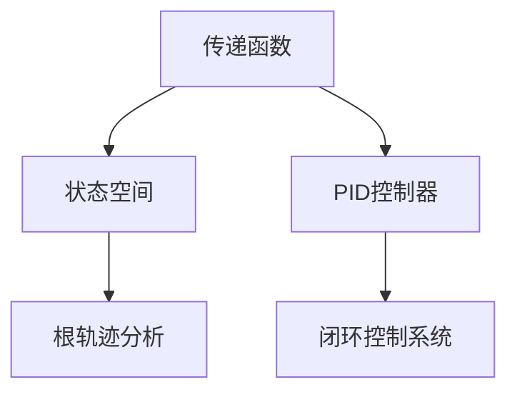

#### PID控制器的原理与应用

PID控制器（比例-积分-微分控制器）是经典控制理论中最常用的控制器之一。其基本原理如下：

- **比例（P）控制**：根据误差大小进行比例调节，使控制输出与误差成正比。
- **积分（I）控制**：根据误差的积分进行调节，消除稳态误差。
- **微分（D）控制**：根据误差的变化率进行调节，提高系统的动态响应速度。

#### 数学模型和公式

PID控制器控制输出 \( u(t) \) 的计算公式如下：

$$ u(t) = K_p e(t) + K_i \int_{0}^{t} e(\tau) d\tau + K_d \frac{de(t)}{dt} $$

其中，\( K_p \)、\( K_i \) 和 \( K_d \) 分别为比例、积分和微分系数，\( e(t) \) 为误差信号。

#### 详细讲解和举例说明

假设我们使用一个温度控制系统，目标温度为 \( T_s = 100^\circ C \)，当前温度为 \( T_c = 90^\circ C \)。我们可以通过以下步骤来整定PID控制器：

1. **确定比例系数 \( K_p \)**：根据系统响应的快慢来调整 \( K_p \)。如果系统响应较慢，可以增大 \( K_p \)。
2. **确定积分系数 \( K_i \)**：根据稳态误差的大小来调整 \( K_i \)。如果稳态误差较大，可以增大 \( K_i \)。
3. **确定微分系数 \( K_d \)**：根据系统的动态响应速度来调整 \( K_d \)。如果系统响应较快，可以增大 \( K_d \)。

假设我们选择 \( K_p = 1 \)，\( K_i = 0.1 \)，\( K_d = 0.05 \)，则PID控制器输出 \( u(t) \) 的计算公式为：

$$ u(t) = e(t) + 0.1 \int_{0}^{t} e(\tau) d\tau + 0.05 \frac{de(t)}{dt} $$

通过不断调整这三个系数，我们可以使温度控制系统达到较好的控制效果。

### 1.2 控制系统的基本组成部分

控制系统通常由以下几个部分组成：

- **受控对象**：需要控制的物理或工程系统。
- **控制器**：根据误差信号进行调节的装置，如PID控制器。
- **传感器**：检测受控对象状态或输出的装置。
- **执行器**：根据控制器输出进行动作的装置。

#### 核心概念与联系

**Mermaid 流流程图：**

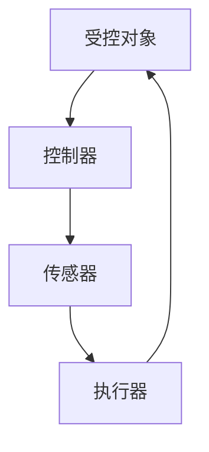

#### 详细讲解和举例说明

以一个简单的加热系统为例，受控对象是一个加热器，目标温度为100°C。传感器是一个温度传感器，可以实时检测加热器的温度。执行器是一个加热元件，可以根据控制器的输出调整加热器的加热功率。控制器通过PID控制器根据目标温度和实际温度之间的误差进行调节。

### 1.3 PID控制器的原理与应用

PID控制器是经典控制理论中最常用的控制器之一。其基本原理如下：

- **比例（P）控制**：根据误差大小进行比例调节，使控制输出与误差成正比。
- **积分（I）控制**：根据误差的积分进行调节，消除稳态误差。
- **微分（D）控制**：根据误差的变化率进行调节，提高系统的动态响应速度。

#### 数学模型和公式

PID控制器控制输出 \( u(t) \) 的计算公式如下：

$$ u(t) = K_p e(t) + K_i \int_{0}^{t} e(\tau) d\tau + K_d \frac{de(t)}{dt} $$

其中，\( K_p \)、\( K_i \) 和 \( K_d \) 分别为比例、积分和微分系数，\( e(t) \) 为误差信号。

#### 详细讲解和举例说明

假设我们使用一个温度控制系统，目标温度为 \( T_s = 100^\circ C \)，当前温度为 \( T_c = 90^\circ C \)。我们可以通过以下步骤来整定PID控制器：

1. **确定比例系数 \( K_p \)**：根据系统响应的快慢来调整 \( K_p \)。如果系统响应较慢，可以增大 \( K_p \)。
2. **确定积分系数 \( K_i \)**：根据稳态误差的大小来调整 \( K_i \)。如果稳态误差较大，可以增大 \( K_i \)。
3. **确定微分系数 \( K_d \)**：根据系统的动态响应速度来调整 \( K_d \)。如果系统响应较快，可以增大 \( K_d \)。

假设我们选择 \( K_p = 1 \)，\( K_i = 0.1 \)，\( K_d = 0.05 \)，则PID控制器输出 \( u(t) \) 的计算公式为：

$$ u(t) = e(t) + 0.1 \int_{0}^{t} e(\tau) d\tau + 0.05 \frac{de(t)}{dt} $$

通过不断调整这三个系数，我们可以使温度控制系统达到较好的控制效果。

### 1.4 状态空间分析与模型预测控制

#### 状态空间分析

状态空间分析是控制理论中的一种数学方法，用于描述系统的动态行为。在状态空间分析中，系统被表示为一组差分方程或微分方程，这些方程描述了系统的状态变量随时间的变化。

#### 数学模型和公式

假设一个线性时不变系统，其状态空间表示为：

$$ \dot{x}(t) = A x(t) + B u(t) $$

$$ y(t) = C x(t) + D u(t) $$

其中，\( x(t) \) 为状态向量，\( u(t) \) 为输入向量，\( y(t) \) 为输出向量。\( A \)、\( B \)、\( C \) 和 \( D \) 为系统的系数矩阵。

#### 详细讲解和举例说明

以一个简单的单输入单输出（SISO）系统为例，状态空间模型如下：

$$ \dot{x}(t) = \begin{bmatrix} -2 & 1 \\ 1 & -1 \end{bmatrix} x(t) + \begin{bmatrix} 1 \\ 0 \end{bmatrix} u(t) $$

$$ y(t) = \begin{bmatrix} 1 & 0 \end{bmatrix} x(t) $$

我们可以通过解状态方程和输出方程来分析系统的动态行为。

#### 模型预测控制

模型预测控制（Model Predictive Control，MPC）是一种基于状态空间模型的控制方法，它通过预测系统的未来行为来优化控制输出。MPC的核心思想是使用一个预测模型来模拟系统的动态行为，并根据预测结果和优化目标计算最优控制输入。

#### 数学模型和公式

MPC的优化问题可以表示为：

$$ \min_{u(t)} J $$
$$ \text{subject to} \quad \dot{x}(t) = A x(t) + B u(t) $$
$$ y(t) = C x(t) + D u(t) $$

其中，\( J \) 为优化目标函数，通常为控制输出和优化变量的二次函数。

#### 详细讲解和举例说明

假设我们有一个简单的线性时不变系统，其状态空间模型为：

$$ \dot{x}(t) = \begin{bmatrix} -1 & 1 \\ 0 & -1 \end{bmatrix} x(t) + \begin{bmatrix} 1 \\ 0 \end{bmatrix} u(t) $$

$$ y(t) = \begin{bmatrix} 1 & 0 \end{bmatrix} x(t) $$

我们希望控制系统的输出 \( y(t) \) 跟随一个参考轨迹 \( y^*(t) \)。我们可以使用MPC来优化控制输入 \( u(t) \)，使 \( y(t) \) 尽可能接近 \( y^*(t) \)。

## 第二部分：混沌控制理论介绍

### 2.1 混沌现象的基本概念

#### 背景介绍

混沌控制理论是20世纪70年代发展起来的一个新兴领域，主要研究混沌现象及其控制方法。混沌现象是一种复杂且不确定的动态行为，广泛存在于自然界和社会系统中。

#### 核心概念与联系

**Mermaid 流流程图：**

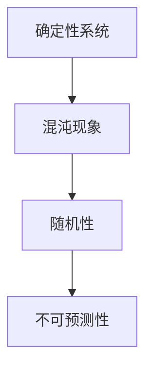

#### 详细讲解和举例说明

以著名的洛伦兹吸引子为例，洛伦兹吸引子是一个典型的混沌系统，由美国气象学家洛伦兹（Edward Lorenz）在1963年发现。洛伦兹吸引子的数学模型为：

$$ \dot{x} = \sigma (y - x) $$

$$ \dot{y} = x (\rho - z) $$

$$ \dot{z} = xy - \beta z $$

其中，\( \sigma \)、\( \rho \) 和 \( \beta \) 是系统参数。通过数值模拟可以观察到洛伦兹吸引子的复杂动态行为。

### 2.2 混沌控制的理论基础

#### 核心概念与联系

**Mermaid 流流程图：**

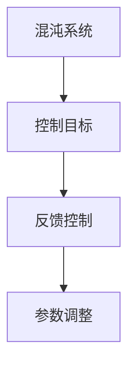

#### 详细讲解和举例说明

混沌控制的目标是改变混沌系统的初始条件或参数，使其进入稳定的周期运动或准周期运动。反馈控制是混沌控制的一种常见方法，通过实时测量系统的状态并调整控制输入，使系统达到期望的运动状态。

以洛伦兹吸引子为例，我们可以通过反馈控制方法来抑制混沌现象，使系统进入稳定的周期运动。具体方法如下：

1. **测量系统的状态**：使用传感器测量系统的状态变量 \( x(t) \)、\( y(t) \) 和 \( z(t) \)。
2. **计算误差**：计算期望状态 \( x^*(t) \)、\( y^*(t) \) 和 \( z^*(t) \) 与实际状态之间的误差 \( e_x(t) \)、\( e_y(t) \) 和 \( e_z(t) \)。
3. **调整控制输入**：根据误差计算控制输入 \( u(t) \)，使系统状态逐渐趋近于期望状态。

### 2.3 混沌同步与混沌加密

#### 核心概念与联系

**Mermaid 流流程图：**

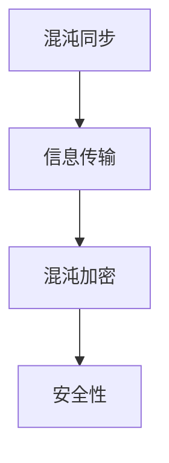

#### 详细讲解和举例说明

混沌同步是指两个或多个混沌系统在相互作用下，实现状态变量同步的现象。混沌同步在信息传输和加密领域具有广泛应用。

以洛伦兹吸引子为例，我们可以实现两个洛伦兹吸引子的混沌同步，从而实现信息的传输。具体步骤如下：

1. **选择两个洛伦兹吸引子模型**：选择两个相同的洛伦兹吸引子模型，分别表示为 \( x(t) \) 和 \( x'(t) \)。
2. **设计控制输入**：根据两个系统的误差，设计控制输入 \( u(t) \)，使两个系统的状态变量 \( x(t) \) 和 \( x'(t) \) 同步。
3. **信息传输**：将信息编码在 \( x(t) \) 和 \( x'(t) \) 的状态变量中，通过同步现象实现信息的传输。

混沌加密是一种利用混沌现象实现信息加密的方法。混沌加密的基本原理是：将明文信息与混沌系统的状态变量相融合，形成混沌密文，从而提高信息的保密性。

以洛伦兹吸引子为例，我们可以实现混沌加密。具体步骤如下：

1. **生成混沌密钥**：通过洛伦兹吸引子的随机初始化，生成混沌密钥 \( K \)。
2. **加密过程**：将明文信息 \( M \) 与混沌密钥 \( K \) 相融合，形成混沌密文 \( C \)。
3. **解密过程**：使用相同的洛伦兹吸引子模型和解密密钥 \( K \)，将混沌密文 \( C \) 解码为明文信息 \( M \)。

### 2.4 混沌控制的应用领域

#### 核心概念与联系

**Mermaid 流流程图：**

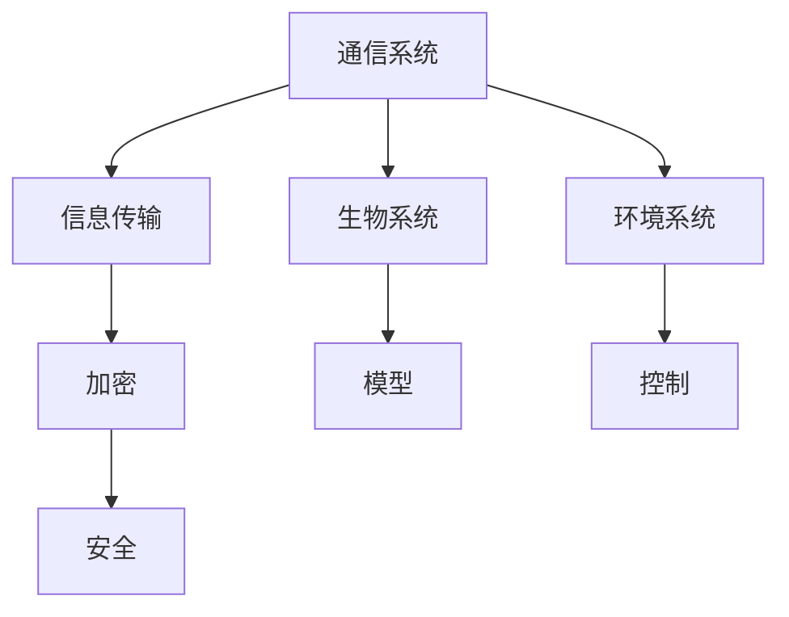

#### 详细讲解和举例说明

混沌控制在通信、生物和环境系统等领域具有广泛的应用。

在通信系统中，混沌控制可以用于信息传输和加密。混沌同步技术可以实现高频率、高速率的信息传输，提高通信系统的稳定性。混沌加密技术可以增强通信系统的安全性，防止信息泄露。

在生物系统中，混沌控制可以用于生物模型的研究。例如，通过混沌控制方法，可以模拟生物体的行为，研究生物体的混沌特性。

在环境系统中，混沌控制可以用于环境监测与污染控制。混沌控制技术可以实现对环境参数的实时监测，从而实现对污染物的有效控制。

## 第三部分：不可预测系统的新方法

### 3.1 非线性和不确定性的影响

#### 核心概念与联系

**Mermaid 流流程图：**

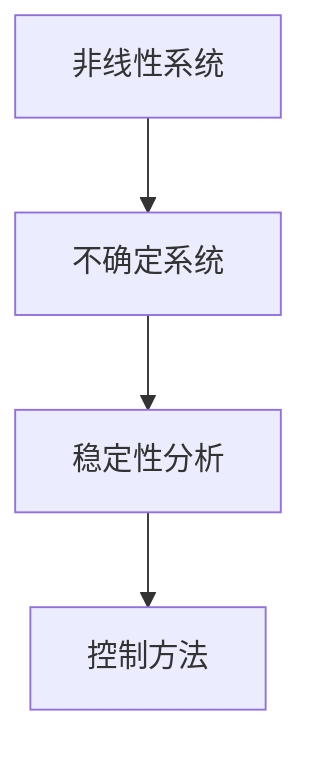

#### 详细讲解和举例说明

非线性系统和不确定性系统是控制系统中常见的两类复杂系统。

非线性系统具有以下特点：

1. 状态变量之间的非线性关系。
2. 动态行为复杂，可能出现混沌现象。
3. 控制策略的设计和实现相对困难。

不确定性系统具有以下特点：

1. 系统参数的不确定性。
2. 外部干扰和噪声的影响。
3. 状态变量的测量误差。

非线性系统和不确定性系统对控制方法的设计和实现提出了挑战。传统的线性控制方法在处理非线性系统和不确定性系统时可能失效，需要开发新的控制策略。

#### 鲁棒控制与自适应控制

鲁棒控制（Robust Control）是一种针对非线性系统和不确定性系统的控制方法，其核心思想是在系统不确定性的范围内，设计出能够保持系统稳定性和性能的控制策略。

自适应控制（Adaptive Control）是一种根据系统动态变化实时调整控制参数的控制方法，其核心思想是利用系统模型或观测器来估计系统参数，并根据参数估计值调整控制策略。

#### 模糊控制与神经控制

模糊控制（Fuzzy Control）是一种基于模糊逻辑的控制方法，其核心思想是利用模糊规则和模糊推理来模拟人类专家的经验和知识。

神经控制（Neural Control）是一种基于神经网络的控制方法，其核心思想是利用神经网络的自适应和学习能力来实现对复杂系统的控制。

#### 混合智能控制策略

混合智能控制（Hybrid Intelligent Control）是一种将不同智能控制方法相结合的控制方法，其核心思想是利用多种智能控制方法的优点，实现复杂系统的有效控制。

## 第四部分：案例研究与应用

### 4.1 混沌控制在通信系统中的应用

#### 背景介绍

混沌控制在通信系统中具有广泛的应用，特别是在信息传输和加密领域。混沌控制可以用于实现高速、稳定和安全的通信系统。

#### 核心概念与联系

**Mermaid 流流程图：**

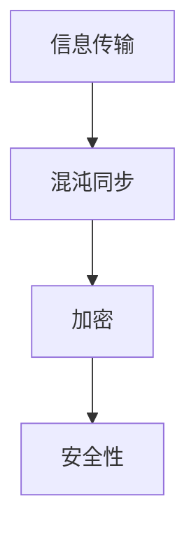

#### 详细讲解和举例说明

混沌同步是实现信息传输的一种有效方法。通过混沌同步，可以实现高速率的信息传输，同时提高通信系统的稳定性。

以洛伦兹吸引子为例，我们可以实现两个洛伦兹吸引子的混沌同步，从而实现信息传输。具体步骤如下：

1. **选择两个洛伦兹吸引子模型**：选择两个相同的洛伦兹吸引子模型，分别表示为 \( x(t) \) 和 \( x'(t) \)。
2. **设计控制输入**：根据两个系统的误差，设计控制输入 \( u(t) \)，使两个系统的状态变量 \( x(t) \) 和 \( x'(t) \) 同步。
3. **信息传输**：将信息编码在 \( x(t) \) 和 \( x'(t) \) 的状态变量中，通过同步现象实现信息的传输。

混沌加密是提高通信系统安全性的一种方法。通过混沌加密，可以实现信息的保密性，防止信息泄露。

以洛伦兹吸引子为例，我们可以实现混沌加密。具体步骤如下：

1. **生成混沌密钥**：通过洛伦兹吸引子的随机初始化，生成混沌密钥 \( K \)。
2. **加密过程**：将明文信息 \( M \) 与混沌密钥 \( K \) 相融合，形成混沌密文 \( C \)。
3. **解密过程**：使用相同的洛伦兹吸引子模型和解密密钥 \( K \)，将混沌密文 \( C \) 解码为明文信息 \( M \)。

#### 案例分析

一个实际案例是利用混沌控制实现卫星通信系统中的信息传输和加密。在该案例中，洛伦兹吸引子被用于实现混沌同步和信息传输。通过混沌同步，可以实现高速率的通信，同时通过混沌加密提高通信系统的安全性。

### 4.2 智能交通系统中的控制方法

#### 背景介绍

智能交通系统（Intelligent Transportation System，ITS）是一种利用信息技术、数据通信传输技术、电子传感技术等来实现交通自动化管理和智能化的系统。在智能交通系统中，控制方法至关重要，可以提高交通效率、减少交通事故和缓解交通拥堵。

#### 核心概念与联系

**Mermaid 流流程图：**

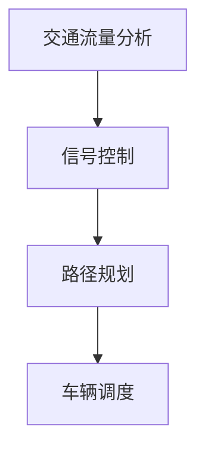

#### 详细讲解和举例说明

智能交通系统中的控制方法主要包括交通流量分析、信号控制和路径规划等。

交通流量分析是智能交通系统的核心功能之一。通过收集和分析道路上的交通流量数据，可以实时监测交通状况，为后续的控制策略提供依据。

信号控制是智能交通系统中最重要的控制方法之一。通过实时调整交通信号灯的相位和时长，可以有效地疏导交通流量，提高交通效率。

路径规划是指为行驶中的车辆提供最优行驶路径。通过实时计算道路状况、车辆位置和目的地等信息，可以为车辆提供最佳行驶路线。

#### 案例分析

一个实际案例是利用混沌控制方法实现智能交通信号控制系统。在该案例中，混沌控制被用于实现交通信号的优化调整，从而提高交通效率。通过混沌控制方法，可以实现交通信号的动态调整，使其适应实时交通状况。

### 4.3 不可预测工业过程控制案例

#### 背景介绍

工业过程控制是自动化控制的重要应用领域之一，涉及石油化工、制药、电力等行业。在工业过程中，由于存在非线性、不确定性和复杂的外部干扰，传统的控制方法往往难以实现良好的控制效果。因此，需要开发新的控制方法来应对不可预测的工业过程。

#### 核心概念与联系

**Mermaid 流流程图：**

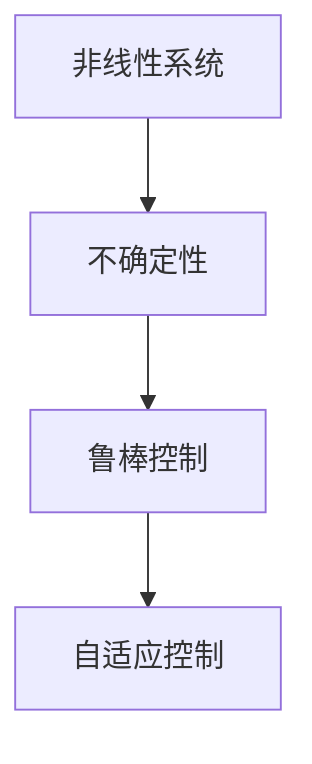

#### 详细讲解和举例说明

鲁棒控制和自适应控制是应对不可预测工业过程控制的有效方法。

鲁棒控制是一种针对系统不确定性的控制方法，通过设计鲁棒控制器，可以在系统不确定性的范围内保持系统的稳定性和性能。

自适应控制是一种根据系统动态变化实时调整控制参数的控制方法，通过在线调整控制参数，可以适应系统变化，实现良好的控制效果。

#### 案例分析

一个实际案例是利用鲁棒控制和自适应控制方法实现石油化工过程中的反应器控制。在该案例中，由于反应器内部化学过程的非线性特性和外部环境干扰，传统的控制方法难以实现良好的控制效果。通过鲁棒控制和自适应控制方法，可以实现反应器的稳定运行，提高生产效率和产品质量。

### 4.4 环境监测与污染控制案例

#### 背景介绍

环境监测与污染控制是环境保护的重要手段。随着工业化和城市化的快速发展，环境污染问题日益严重，对人类健康和生态系统造成严重威胁。因此，开发有效的环境监测与污染控制方法具有重要意义。

#### 核心概念与联系

**Mermaid 流流程图：**

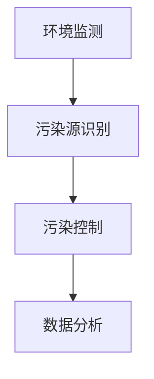

#### 详细讲解和举例说明

环境监测与污染控制的核心概念包括环境监测、污染源识别、污染控制和数据分析。

环境监测是指通过传感器和监测设备对环境中的各种参数进行实时监测，如空气质量、水质、土壤污染等。

污染源识别是指通过监测数据分析和模型计算，识别出环境污染的来源和主要污染物。

污染控制是指根据污染源识别的结果，采取相应的控制措施，如排放限制、污染治理等，以降低环境污染。

数据分析是指对环境监测数据进行处理和分析，提取有用的信息，为污染控制和环境管理提供科学依据。

#### 案例分析

一个实际案例是利用混沌控制在环境监测与污染控制中的应用。在该案例中，混沌控制被用于实现环境监测数据的优化处理和污染源的识别。通过混沌控制方法，可以实现对环境监测数据的实时分析和处理，提高污染源识别的准确性和污染控制的效率。

## 第五部分：总结与展望

### 5.1 总结与回顾

本文从经典控制理论到混沌控制理论，探讨了不可预测系统的新方法。通过对经典控制理论、混沌控制理论和不可预测系统的新方法进行详细讲解和案例分析，我们了解到：

1. 经典控制理论在控制系统中具有重要作用，适用于线性系统。
2. 混沌控制理论是应对非线性系统和不确定性的有效方法。
3. 鲁棒控制、自适应控制、模糊控制和神经控制等新方法在不可预测系统控制中具有广泛应用。

### 5.2 未来的研究方向与挑战

尽管混沌控制在不可预测系统控制中具有广阔的应用前景，但仍面临一些挑战和问题，需要进一步研究：

1. 混沌控制方法的稳定性和鲁棒性：如何设计更稳定、鲁棒的混沌控制系统，以应对复杂环境中的不确定性。
2. 混沌控制的应用领域拓展：探索混沌控制在更多领域的应用，如金融、交通、医疗等。
3. 混沌控制算法优化：如何提高混沌控制算法的计算效率和实时性，以满足实际应用需求。

未来的研究将在这些方面继续深入探索，为不可预测系统控制提供更加有效和实用的方法。

### 附录：相关工具与资源介绍

为方便读者进行实际操作和进一步学习，本文介绍了一些相关的工具与资源：

1. **Matlab**：Matlab是一个功能强大的数学软件，提供了丰富的控制理论工具箱，可以方便地进行控制系统的建模、仿真和分析。
2. **Python**：Python是一种流行的编程语言，拥有多个开源库，如Scipy、NumPy、PyTorch等，可以用于控制系统的建模、仿真和算法实现。
3. **相关论文与书籍**：推荐阅读相关领域的经典论文和书籍，如《混沌控制与同步》、《智能控制理论及其应用》等，以深入了解混沌控制和智能控制的理论和方法。

---

### 作者信息

**作者：** AI天才研究院/AI Genius Institute & 禅与计算机程序设计艺术 /Zen And The Art of Computer Programming

---

本文旨在为广大读者提供关于混沌控制理论的系统介绍，并对不可预测系统控制方法进行深入探讨。希望本文能够为相关领域的研究和应用提供有益的参考和启示。

