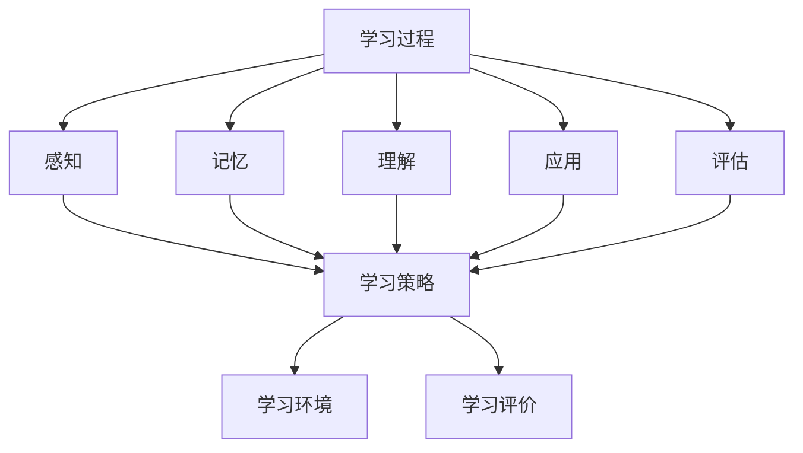

                 

### 文章标题

# 从经典教育理论到学习科学：优化世界理解的学习过程

> 关键词：经典教育理论，学习科学，学习过程，教育实践，认知心理学，学习评价

> 摘要：本文从经典教育理论的起源和发展出发，探讨了行为主义、认知主义和人本主义等主要教育理论的核心概念和现代应用。接着，文章深入分析了学习科学的定义、核心概念和基本原理，特别是在认知心理学和发展心理学方面的应用。随后，文章详细讨论了优化学习过程的方法，包括学习策略、教学设计、学习环境的构建与优化，以及学习评价与反馈。最后，通过成功的学习实践案例分析和未来学习科学的趋势展望，为教育实践提供了有益的启示和指导。

----------------------------------------------------------------

### 引言

在信息化时代，教育体系的变革和发展已成为全球关注的焦点。经典教育理论作为教育实践的基石，经历了长期的演变和发展。然而，随着社会经济的快速发展和科技的不断进步，单纯依赖传统教育理论已难以满足现代教育的需求。为此，学习科学这一新兴领域应运而生，为优化学习过程提供了新的理论框架和实践路径。

本文旨在从经典教育理论到学习科学的视角，探讨优化世界理解的学习过程。文章首先回顾了教育理论的历史与发展，重点介绍了行为主义、认知主义和人本主义等主要教育理论。接着，文章深入探讨了学习科学的定义、核心概念和基本原理，特别是认知心理学和发展心理学在学习教育中的应用。随后，文章详细讨论了优化学习过程的方法，包括学习策略、教学设计、学习环境的构建与优化，以及学习评价与反馈。最后，通过成功的学习实践案例分析和未来学习科学的趋势展望，为教育实践提供了有益的启示和指导。

本文的结构如下：

- **第一部分：经典教育理论**：介绍教育理论的历史与发展，探讨行为主义、认知主义和人本主义等主要教育理论的核心概念和现代应用。
- **第二部分：学习科学的基本原理**：深入分析学习科学的定义、核心概念和基本原理，特别是认知心理学和发展心理学在学习教育中的应用。
- **第三部分：优化学习过程**：详细讨论优化学习过程的方法，包括学习策略、教学设计、学习环境的构建与优化，以及学习评价与反馈。
- **第四部分：案例分析**：通过成功的学习实践案例分析和未来学习科学的趋势展望，为教育实践提供启示和指导。

通过以上结构的安排，本文旨在为教育工作者、学生和家长提供一份全面、系统的学习科学指南，帮助优化学习过程，提高学习效果，进而更好地理解世界。

### 第一部分：经典教育理论

#### 第一章：教育理论的历史与发展

教育理论的历史可以追溯到古希腊时期，当时的教育理念主要集中在培养公民美德和道德修养。然而，随着社会的不断发展和进步，教育理论经历了多个阶段的演变。从古代到现代，教育理论的发展不仅反映了社会需求的变化，也揭示了教育本质的多样性。

**1.1 教育理论的起源与发展**

教育理论的起源可以追溯到古希腊时期，苏格拉底、柏拉图和亚里士多德等哲学家对教育进行了深入的探讨。其中，柏拉图的《理想国》提出了理想教育体系，强调教育应注重培养个人的智慧和品德。亚里士多德则提出了教育应遵循个体自然发展的观点，这一观点对后来的教育理论产生了深远的影响。

中世纪时期，教育理论主要受到宗教和神学的影响。教育被视为上帝赋予的神圣使命，主要目标是培养信徒和传道士。这一时期的教育理论主要集中在宗教教育和道德教育方面。

近代以来，随着工业革命和科技革命的兴起，教育理论发生了重大变革。教育开始从封建社会的等级制度中解放出来，注重普及教育和素质教育。19世纪末，德国教育家赫尔巴特提出了“教育心理学化”的观点，强调教育应基于心理学原理，这一观点为教育理论的发展奠定了基础。

**1.2 教育理论的基本概念**

教育理论的基本概念包括教育、学习、教学、教育者、学习者等。这些概念不仅相互关联，而且在教育实践中起着重要作用。

- **教育**：教育是一种有目的、有计划、有组织的活动，旨在促进个体的全面发展。教育不仅包括知识传授，还涉及品德教育、技能培养和情感发展等方面。

- **学习**：学习是指个体在特定环境和条件下，通过获得知识和技能，改变自身行为和能力的过程。学习可以分为认知学习、情感学习和行为学习三种类型。

- **教学**：教学是教育过程中的一种基本形式，包括教师的教和学生的学。教学旨在通过教师的引导和帮助，使学生有效地掌握知识和技能。

- **教育者**：教育者是指从事教育活动的人，包括教师、教育行政人员、教育研究者等。教育者的职责是传播知识、培养人才和促进社会进步。

- **学习者**：学习者是指参与教育活动的人，包括学生、成人学习者等。学习者的特点包括自主性、能动性和发展性。

**1.3 教育理论的影响**

教育理论对教育实践具有深远的影响。不同的教育理论提出了不同的教育理念和方法，对教育目标、课程设置、教学方法等方面产生了重要影响。

- **教育目标**：教育理论明确了教育的目标和任务，如培养公民素质、提高社会竞争力等。教育目标不仅决定了教育的内容和方法，还影响了教育政策的制定。

- **课程设置**：教育理论为课程设置提供了理论依据，如行为主义教育理论强调课程应注重实用性和操作性，认知主义教育理论则强调课程应注重思维训练和知识构建。

- **教学方法**：教育理论为教学方法的选择提供了指导，如行为主义教育理论强调教师主导，认知主义教育理论则强调学生自主学习和合作学习。

**1.4 教育理论的现代发展**

在现代社会，教育理论继续发展和演变。随着科学技术的进步和教育改革的深入推进，教育理论在以下几个方向进行了探索：

- **个性化教育**：个性化教育注重根据学生的个体差异，提供个性化的教育方案，以提高教育质量和学习效果。

- **教育信息化**：教育信息化是指利用信息技术，促进教育资源的共享和优化，提高教育效率和教育公平。

- **教育国际化**：教育国际化是指通过国际交流与合作，促进教育资源的全球共享，提高教育质量和教育水平。

- **终身教育**：终身教育是指人们在一生中不断学习、不断进步的教育理念，旨在实现个体终身发展和终身学习。

#### 第二章：主要教育理论的介绍

教育理论的发展经历了多个阶段，其中行为主义、认知主义和人本主义等主要教育理论对教育实践产生了深远的影响。每种教育理论都有其独特的核心概念和应用，下面将分别进行介绍。

**2.1 行为主义教育理论**

行为主义教育理论起源于20世纪初，代表人物包括约翰·沃森（John B. Watson）和伯尔赫斯·斯金纳（B.F. Skinner）。行为主义教育理论的核心观点是，学习是通过外部刺激和反应的联结来实现的。行为主义教育理论的基本原则包括：

- **操作性条件作用**：操作性条件作用是指通过奖励和惩罚来塑造和改变个体的行为。奖励可以增强行为，惩罚可以抑制行为。

- **强化**：强化是指通过增加某种行为的概率来改变行为。正强化通过奖励来增强行为，负强化通过消除不愉快的刺激来增强行为。

- **消退**：消退是指通过减少某种行为的概率来减少行为。消退可以用来减少不良行为。

- **惩罚**：惩罚是指通过减少某种行为的概率来抑制行为。惩罚可以减少不良行为，但使用不当可能会导致消极情绪和行为问题。

行为主义教育理论在课堂教学中的应用包括：

- **行为目标**：行为目标是指具体、可测量的教育目标，如学生能够回答某个问题或完成某个任务。

- **程序教学**：程序教学是一种基于操作性条件作用的教学方法，通过逐步呈现问题和答案，帮助学生自主学习和掌握知识。

- **课堂管理**：行为主义教育理论强调课堂管理的规范性和一致性，通过明确的奖惩制度来维持课堂秩序。

**2.2 认知主义教育理论**

认知主义教育理论起源于20世纪50年代，代表人物包括让·皮亚杰（Jean Piaget）和让·皮亚杰（Noam Chomsky）。认知主义教育理论的核心观点是，学习是通过内部认知过程来实现的，包括知觉、记忆、思维和语言等。认知主义教育理论的基本原则包括：

- **认知发展**：认知发展是指个体在认知能力上的成长和变化。认知发展理论强调个体在不同的年龄阶段具有不同的认知特点和发展需求。

- **学习过程**：学习过程是指个体通过内部认知活动来获取、处理和应用知识的过程。认知主义教育理论强调学习者的主动性和自主性。

- **思维训练**：思维训练是指通过训练和发展个体的思维能力和思维技能，提高其解决问题和创造性思维能力。

认知主义教育理论在课堂教学中的应用包括：

- **探究学习**：探究学习是指通过提问、观察、实验和讨论等方式，引导学生主动探索和发现知识。

- **问题解决**：问题解决是指通过提出问题和解决问题，培养学生的逻辑思维和创造性思维能力。

- **思维导图**：思维导图是一种图形化的思维工具，通过视觉化的方式展示个体的思维过程和知识结构。

**2.3 人本主义教育理论**

人本主义教育理论起源于20世纪60年代，代表人物包括卡尔·罗杰斯（Carl Rogers）和亚伯拉罕·马斯洛（Abraham Maslow）。人本主义教育理论的核心观点是，学习是个体自我实现的过程，强调个体在情感、社交和认知方面的全面发展。人本主义教育理论的基本原则包括：

- **自我实现**：自我实现是指个体通过自我发现和自我实现，达到个人潜能的最大化。

- **情感教育**：情感教育是指通过培养个体的情感素质，提高其情感体验和情感表达的能力。

- **人际交往**：人际交往是指通过培养个体的人际交往能力和合作精神，促进其在社会中的适应和发展。

人本主义教育理论在课堂教学中的应用包括：

- **非指导性教学**：非指导性教学是指教师不直接传授知识，而是通过引导和鼓励，帮助学生自我发现和自我实现。

- **学生中心课程**：学生中心课程是指课程设计以学生为中心，注重学生的兴趣、需求和成长。

- **情境教学**：情境教学是指通过创设真实的情境，让学生在真实的问题和情境中学习，培养其实践能力和创新精神。

通过以上介绍，我们可以看到，行为主义、认知主义和人本主义等主要教育理论各有其独特的核心观点和应用。在实际教育实践中，教育工作者可以根据不同教育理论的特点和优势，灵活运用各种教学方法和策略，提高教育质量和学习效果。

#### 第三章：教育理论的现代应用

教育理论的现代应用是教育实践中的核心问题，它不仅关系到教育目标的实现，也影响到教学效果和学习体验。随着社会的发展和教育理念的进步，行为主义、认知主义和人本主义等教育理论在现代教育中得到了广泛的运用和发展。下面将具体介绍这些教育理论在课堂教学、课程设置、教师角色等方面的现代应用。

**3.1 教育理论的现代发展**

在现代社会，教育理论不断发展和演变，以适应不断变化的社会需求和教育情境。以下是一些重要的现代教育理论发展趋势：

- **个性化教育**：个性化教育强调根据学生的个体差异，提供差异化的教育方案，以满足学生的不同需求和潜力。这种教育模式打破了传统的统一教育模式，更加注重学生的自主性和个性化发展。

- **教育信息化**：教育信息化是现代教育发展的一个重要趋势，通过引入信息技术，实现教育资源的数字化、网络化和智能化。教育信息化不仅提高了教育的效率和公平性，也为教学方法和教育模式的创新提供了新的可能性。

- **教育国际化**：教育国际化是指通过国际交流和合作，促进教育资源的共享和教育质量的提高。教育国际化不仅有助于培养具有全球视野的人才，也为教育改革和发展提供了新的视角和动力。

- **终身教育**：终身教育理念强调教育不仅仅局限于学校教育，而是贯穿于人的一生。终身教育理念促进了教育的全面发展和个性化学习，使个体能够根据自身需求和兴趣，持续地获取新知识和技能。

**3.2 教育理论在课堂教学中的应用**

课堂教学是教育实践中的核心环节，各种教育理论在课堂教学中的应用促进了教学方法的多样化和教学效果的提升。

- **行为主义教育理论的现代应用**：在课堂教学过程中，行为主义教育理论注重通过明确的奖励和惩罚机制来管理学生的行为。例如，教师可以设置行为目标，通过表扬和奖励来鼓励学生积极参与课堂活动。此外，程序教学等行为主义教学方法也被广泛应用于课堂教学中，以帮助学生逐步掌握知识和技能。

- **认知主义教育理论的现代应用**：认知主义教育理论强调学生的主动学习和认知发展。在课堂教学中，教师可以采用探究学习、问题解决和思维训练等方法，激发学生的思维活力和创造力。例如，通过设计探究性问题和实验活动，让学生在实践中自主发现和解决问题，从而提高其认知能力和思维能力。

- **人本主义教育理论的现代应用**：人本主义教育理论强调学生的自我实现和情感发展。在课堂教学中，教师可以通过非指导性教学、情境教学和学生中心课程等方法，营造一个充满关爱和支持的学习环境。例如，通过创设真实的学习情境，让学生在情境中学习，培养其情感体验和社交能力。

**3.3 教育理论在课程设置中的应用**

课程设置是教育理论在现代教育中的另一个重要应用领域。不同的教育理论对课程设置有不同的影响和启示。

- **行为主义教育理论的课程设置**：行为主义教育理论强调课程的实用性和操作性，注重培养学生的实际技能。在课程设置中，教师可以设计一系列操作性任务，帮助学生通过实际操作来掌握知识和技能。例如，在科学课程中，教师可以设计实验活动和项目，让学生通过动手操作来理解和应用科学原理。

- **认知主义教育理论的课程设置**：认知主义教育理论强调课程的结构化和思维训练，注重培养学生的认知能力和思维能力。在课程设置中，教师可以设计逻辑严密的知识结构和思维训练活动，帮助学生逐步构建和深化知识体系。例如，在数学课程中，教师可以通过设计逐步递进的问题和任务，引导学生逐步掌握数学概念和解题方法。

- **人本主义教育理论的课程设置**：人本主义教育理论强调课程的个性化和社会化，注重培养学生的自我实现和情感发展。在课程设置中，教师可以设计多样化的课程活动，以满足学生的不同兴趣和需求。例如，在语文课程中，教师可以设计文学创作和阅读分享等活动，培养学生的文学素养和表达能力。

**3.4 教育理论在教师角色中的应用**

教育理论的现代应用不仅体现在教学方法和课程设置上，也深刻影响了教师的角色和职责。

- **行为主义教育理论的教师角色**：在行为主义教育理论的指导下，教师的角色主要是管理者和服务者。教师需要制定明确的教学计划和目标，通过奖励和惩罚来管理学生的行为，确保教学活动的顺利进行。

- **认知主义教育理论的教师角色**：在认知主义教育理论的指导下，教师的角色是引导者和促进者。教师需要创设丰富的学习环境和活动，引导学生主动参与学习过程，培养其认知能力和思维能力。

- **人本主义教育理论的教师角色**：在人本主义教育理论的指导下，教师的角色是关爱者和支持者。教师需要关注学生的情感需求和发展，营造一个充满关爱和支持的学习环境，帮助学生实现自我发现和自我实现。

通过以上分析，我们可以看到，行为主义、认知主义和人本主义等教育理论在现代教育中具有广泛的应用价值。这些教育理论不仅为教育实践提供了丰富的理论基础和实践指导，也促进了教育改革和发展的深入进行。在实际教育工作中，教师应根据具体的教育情境和学生需求，灵活运用各种教育理论和方法，提高教育质量和学习效果。

### 第二部分：学习科学的基本原理

#### 第四章：学习科学的定义与核心概念

学习科学是一门跨学科的研究领域，旨在通过科学方法探究人类学习的本质、过程和机制，从而为教育实践提供理论基础和实践指导。学习科学的定义和核心概念是多维度的，涉及到认知心理学、发展心理学、教育学等多个学科领域。以下是学习科学的基本定义、核心概念及其相互关系。

**4.1 学习科学的定义**

学习科学是一门探索学习现象的学科，它结合了心理学、教育学、神经科学、计算机科学等多个学科的理论和方法，以揭示学习的基本原理、机制和过程。学习科学的研究对象包括人类学习和动物学习，其目标是理解学习是如何发生的，以及如何通过有效的教育实践促进学习。

学习科学强调从多个角度和层面来研究学习，包括：

- **认知层面**：研究个体在获取、处理和应用知识过程中的认知活动，如记忆、注意力、思维和问题解决等。

- **行为层面**：研究个体在具体学习情境中的行为表现，如学习策略的使用、学习动机的影响和社交互动等。

- **神经科学层面**：研究大脑在学习过程中的功能和结构变化，如神经传递物质、神经元连接和学习相关的脑区活动等。

- **社会文化层面**：研究学习在社会和文化背景下的影响，如社会互动、文化传承和教育制度等。

**4.2 学习科学的核心概念**

学习科学的核心概念包括学习过程、学习策略、学习环境、学习评价等。这些概念相互关联，共同构成了学习科学的理论框架。

- **学习过程**：学习过程是指个体从外部环境中获取信息、转化为内在知识，并通过实践应用知识的过程。学习过程可以分为感知、记忆、理解、应用和评估等阶段。

  - **感知**：个体通过感官接收外部信息，如视觉、听觉和触觉等。

  - **记忆**：个体将感知到的信息储存到大脑中，以备后续使用。

  - **理解**：个体对记忆中的信息进行加工和理解，形成概念和知识结构。

  - **应用**：个体将所学的知识应用于实际情境中，解决实际问题。

  - **评估**：个体对学习效果进行自我评估和反思，以调整学习策略和提高学习效率。

- **学习策略**：学习策略是指个体在学习和记忆过程中采用的认知方法和技巧，如复述、记忆术、归纳、演绎等。学习策略的目的是优化学习过程，提高学习效率和记忆效果。

  - **复述策略**：通过重复阅读、朗读和默写等方式，强化记忆。

  - **记忆术**：通过联想、故事法和图像记忆等方式，提高记忆效果。

  - **认知策略**：通过分析、综合、归纳和演绎等方式，促进理解。

  - **元认知策略**：通过计划、监控和调节学习过程，提高学习效果。

- **学习环境**：学习环境是指个体进行学习活动的物理和心理背景，包括学习场所、学习资源和社交互动等。学习环境对学习效果有重要影响。

  - **物理环境**：如教室布局、照明和空气质量等，影响个体的舒适度和注意力。

  - **心理环境**：如学习氛围、教师风格和同伴关系等，影响个体的情感状态和学习动机。

  - **社会文化环境**：如家庭、学校和社会文化背景等，影响个体的价值观和学习态度。

- **学习评价**：学习评价是指对学习过程和学习效果进行系统分析和评估的方法和工具。学习评价的目的是了解学习情况，调整教学策略和提高教学质量。

  - **形成性评价**：通过持续性的反馈和调整，促进学习过程的改进。

  - **总结性评价**：通过期末考试、项目展示和评估报告等方式，对学习效果进行综合评估。

**4.3 核心概念之间的联系架构**

为了更好地理解学习科学的核心概念，我们可以使用Mermaid流程图来展示它们之间的联系。

在该流程图中，学习过程、学习策略、学习环境和学习评价构成了一个相互关联的动态系统。学习过程包括感知、记忆、理解、应用和评估五个阶段，每个阶段都需要相应的学习策略来支持和优化。学习环境为学习过程提供了物理和心理背景，而学习评价则对学习过程和学习效果进行监控和反馈，从而实现学习的持续改进。

通过上述核心概念和联系架构的介绍，我们可以看到学习科学在理解和优化学习过程方面的重要作用。学习科学的定义和核心概念为教育实践提供了理论指导，帮助教育工作者更好地设计教学策略、优化学习环境，并制定有效的学习评价体系，从而提高教育质量和学习效果。

#### 第五章：学习过程的心理基础

学习是一个复杂的过程，其背后的心理基础涉及多个心理学领域，包括认知心理学、发展心理学和社会心理学等。这些领域共同揭示了学习过程中的关键心理机制和影响因素，为我们理解和优化学习提供了深刻的洞见。

**5.1 认知心理学与学习**

认知心理学是研究个体认知过程的科学，它关注思维、记忆、知觉、注意等心理现象。认知心理学在学习教育中具有重要作用，其理论为理解和优化学习过程提供了重要基础。

- **记忆**：记忆是学习的关键组成部分，认知心理学提供了关于记忆的不同类型和机制的深刻理解。艾宾浩斯（Ebbinghaus）的遗忘曲线揭示了记忆遗忘的规律，而奥苏贝尔（Ausubel）的认知结构理论则提出了“先学习基础知识，再学习新知识”的学习原则。认知心理学还研究了记忆的策略，如复述、联想和编码等，这些策略有助于提高记忆效果。

- **注意**：注意是认知过程中的核心要素，它决定了个体对信息的接收和处理。认知心理学研究表明，注意可以分为选择性注意和分配性注意。选择性注意有助于个体在复杂环境中聚焦关键信息，而分配性注意则涉及在同一时间处理多个任务。在学习教育中，教师可以通过设计有趣的教学活动和提高学生的学习动机，来提高他们的注意力和学习效果。

- **思维**：思维是认知过程中另一个重要方面，它涉及解决问题、推理和决策等。认知心理学研究了各种思维过程，如逻辑思维、创造性思维和批判性思维等。通过理解这些思维过程，教育工作者可以设计更有效的教学方法和学习任务，以培养学生的思维能力。

**5.2 发展心理学与学习**

发展心理学是研究个体在不同发展阶段的认知、情感和行为变化的心理学科。发展心理学在学习教育中提供了关于个体如何随着时间变化而学习和发展的深刻见解。

- **认知发展**：认知发展理论，如皮亚杰（Piaget）的认知发展阶段理论和维果茨基（Vygotsky）的社会文化发展理论，揭示了个体在不同年龄阶段如何通过认知过程来理解世界。认知发展阶段理论认为，个体在不同阶段具有不同的认知结构和思维方式，教育应根据不同年龄阶段的特点来设计教学内容和方法。社会文化发展理论强调社会互动和文化背景对学习过程的影响，通过合作学习和支架式教学，可以帮助学生更好地理解和应用知识。

- **情感发展**：情感发展是学习过程中不可忽视的一部分。情感发展理论，如加德纳（Gardner）的情感智力理论，揭示了情感智力对学习过程的重要性。情感智力包括自我认知、自我调节、社会认知和情绪认知等方面。教育工作者应关注学生的情感需求，创造一个支持性和包容性的学习环境，以促进学生的情感发展和学习动力。

- **行为发展**：行为发展理论，如班杜拉（Bandura）的社会学习理论，探讨了个体如何通过观察、模仿和强化来学习行为。社会学习理论强调观察学习在个体行为发展中的作用，教育工作者可以通过示范和提供正面的反馈来促进学生的行为发展。

**5.3 社会心理学与学习**

社会心理学是研究个体在社会环境中的行为和心理过程的学科，它对学习过程有着重要的影响。

- **群体动力**：群体动力是指群体成员之间的相互作用和影响。社会心理学研究表明，群体动力可以影响学习动机、学习态度和团队合作。教育工作者可以通过设计团队项目和合作任务，促进学生之间的互动和协作，提高学习效果。

- **社会认知**：社会认知是指个体如何理解自己和他人。社会认知理论，如菲斯汀格（Festinger）的认知失调理论，揭示了个体如何通过平衡认知不一致来维持心理平衡。在教育中，教师可以通过提供积极的反馈和鼓励，帮助学生建立积极的自我认知和自我效能感。

- **社会学习**：社会学习是指个体通过观察和模仿他人的行为来学习。社会学习理论，如班杜拉（Bandura）的社会学习理论，强调了观察学习和模仿在学习过程中的重要性。教育工作者可以通过示范、提供榜样和设计角色扮演活动，来促进学生通过社会学习来提高学习效果。

**5.4 认知心理学与发展心理学的联系**

认知心理学和发展心理学在研究学习过程中各有侧重，但它们之间也存在密切的联系。

- **互动关系**：认知心理学和发展心理学相互补充，认知心理学关注个体在特定时间点的认知过程，而发展心理学则关注个体在整个生命历程中的认知变化。通过结合这两个领域的理论，教育工作者可以更全面地理解学习过程，设计出适应不同发展阶段的学习策略。

- **个体差异**：认知心理学和发展心理学都关注个体差异，认知心理学研究个体在认知能力上的差异，而发展心理学则研究个体在不同年龄阶段的差异。了解这些差异有助于教育工作者根据学生的特点提供个性化的教育支持。

- **动态发展**：认知心理学和发展心理学都强调学习是一个动态的过程，个体的认知能力和学习方式会随着时间和经验的变化而发展。教育工作者应关注学生的学习过程，及时调整教学策略，以适应学生的发展需求。

通过理解认知心理学、发展心理学和社会心理学在学习过程中的作用，教育工作者可以更深入地理解学习过程的心理基础，从而设计出更有效、更个性化的教育方案，提高学生的学习效果。

#### 第六章：学习科学的教育实践

学习科学的教育实践是应用学习科学理论来指导教育活动的具体实施过程。通过深入理解学习过程的心理学基础，教育工作者可以设计出更有效的教学策略和教学方法，从而提高教育质量和学习效果。以下是学习科学在教育实践中的应用，包括学习策略、教学设计、学习环境的构建与优化，以及学习评价与反馈。

**6.1 学习策略的应用**

学习策略是指学生在学习过程中采用的方法和技巧，旨在提高学习效率和记忆效果。学习策略的应用可以分为以下几个方面：

- **记忆策略**：记忆策略包括复述、联想、图像编码和分散复习等。例如，通过将新信息与已知信息建立联系，或者使用图像来编码信息，可以增强记忆效果。

- **认知策略**：认知策略包括分析、综合、比较和归纳等。这些策略帮助学生理解复杂的信息，构建知识框架，并能够灵活运用所学知识。

- **元认知策略**：元认知策略包括计划、监控和评估等。这些策略帮助学生管理自己的学习过程，如设定学习目标、监控学习进度，并在学习结束后进行自我评估。

在课堂教学中，教师可以通过提供具体的学习策略指导，帮助学生掌握有效的学习方法。例如，教师可以教授学生如何使用记忆术来记忆复杂的信息，或者如何通过提问和讨论来加深对知识的理解。

**6.2 教学设计的方法**

教学设计是学习科学在教育实践中的核心环节，它涉及课程内容的组织、教学活动的安排以及教学方法的运用。以下是几种常见的教学设计方法：

- **模式教学**：模式教学是指按照一定的教学程序和步骤进行教学，这种方法有助于规范教学过程，提高教学效果。例如，教学模式教学包括导入、讲解、练习和总结等步骤，教师可以根据具体的教学内容进行调整。

- **项目导向教学**：项目导向教学是指通过完成具体项目来学习知识，这种方法强调学生的主动参与和实践应用。例如，在科学课程中，学生可以通过实验项目来探索科学原理，从而加深对知识的理解。

- **情境教学**：情境教学是指通过创设真实的情境来学习知识，这种方法有助于提高学生的参与度和学习效果。例如，在语言课程中，教师可以创设对话情境，让学生在真实的语境中练习语言表达。

在教学设计中，教师应根据学习目标和学生的特点，灵活运用不同的教学方法，以激发学生的学习兴趣和积极性。

**6.3 学习环境的构建与优化**

学习环境是学习过程的重要背景，它对学生的学习效果有着重要影响。学习环境的构建与优化包括以下几个方面：

- **物理环境**：物理环境包括教室布局、照明、通风和温度等。一个舒适的学习环境有助于提高学生的注意力和学习效果。教师可以通过调整教室的布局和布置，为学生提供一个舒适、安静的学习环境。

- **心理环境**：心理环境包括学习氛围、师生关系和同伴关系等。一个支持性和包容性的学习氛围有助于学生的情感发展和学习动力。教师可以通过建立良好的师生关系和同伴关系，营造一个积极、和谐的学习氛围。

- **技术环境**：随着信息技术的不断发展，学习环境已经不再局限于传统的教室，网络、多媒体和虚拟现实等技术在教育中的应用，为学习环境提供了新的可能性。教师可以通过利用多媒体资源和在线学习平台，为学生提供丰富的学习资源和互动体验。

**6.4 学习评价与反馈**

学习评价是学习过程中的重要环节，它有助于了解学生的学习进展和效果，并为后续的教学提供反馈和调整。以下是几种常见的学习评价方法：

- **形成性评价**：形成性评价是指在教学过程中进行的持续评价，它有助于教师及时发现学生的学习问题，并提供及时的反馈和指导。例如，教师可以通过课堂提问、作业批改和小组讨论等方式，了解学生的学习情况。

- **总结性评价**：总结性评价是指在教学结束后进行的综合评价，它有助于了解学生的学习成果和整体表现。例如，教师可以通过期末考试、项目展示和评估报告等方式，对学生进行全面评价。

- **自我评价**：自我评价是指学生对自己的学习过程和成果进行反思和评价，这种方法有助于培养学生的自我监控和反思能力。例如，学生可以通过写学习日志、自我总结和反思，来提升自己的学习效果。

在评价过程中，教师应注重评价的全面性和多样性，不仅关注学生的学业成绩，还关注他们的学习态度、情感和合作能力。通过科学、合理的评价方法，教师可以更好地了解学生的学习状况，为后续教学提供有力的支持。

通过以上学习科学的教育实践，教育工作者可以更好地理解学习过程，设计出更有效的教学策略和教学方法，为学生提供优质的教育服务，从而提高教育质量和学习效果。

### 第三部分：优化学习过程

#### 第七章：学习策略与技巧

优化学习过程的关键在于掌握和运用有效的学习策略和技巧。这些策略和技巧不仅有助于提高学习效率，还能增强记忆和理解能力。以下是几种常见的学习策略和技巧，以及其在实际学习中的应用。

**7.1 复述策略**

复述策略是指通过重复阅读、朗读和默写等方式，强化记忆和理解。这种方法适用于学习新知识或复习旧知识。

- **应用示例**：在学习历史事件时，学生可以尝试用自己的语言复述事件的过程和结果，以加深对事件的记忆和理解。

**7.2 联想策略**

联想策略是指通过将新知识与已知信息建立联系，以增强记忆效果。这种方法利用了人类大脑的自然记忆机制，即通过关联来记忆信息。

- **应用示例**：在学习化学元素时，学生可以将每个元素的特性与生活中的实例（如氧气与呼吸、铁与钢铁）联系起来，以便更好地记忆元素的性质。

**7.3 图像编码策略**

图像编码策略是指通过将信息转化为图像来记忆，这种方法尤其适用于记忆复杂的信息或流程。

- **应用示例**：在学习复杂的流程图或程序代码时，学生可以将每个步骤或模块绘制成简单的图像，以便在需要时快速回忆。

**7.4 记忆术**

记忆术是指通过使用特定的方法和技巧，如故事法、图像记忆和关联记忆等，来提高记忆效果。

- **应用示例**：在学习历史事件时，学生可以通过将事件串联成一个有趣的故事，或者使用图像和场景来记忆关键信息。

**7.5 认知策略**

认知策略是指通过分析和综合信息，以提高理解和记忆效果。

- **应用示例**：在学习数学概念时，学生可以通过分析问题的结构和逻辑关系，来理解和解决数学问题。

**7.6 元认知策略**

元认知策略是指通过计划、监控和评估学习过程，以提高学习效率。

- **应用示例**：在备考考试时，学生可以制定详细的学习计划，定期监控自己的学习进度，并在学习结束后进行自我评估，以便调整学习策略。

**7.7 技巧在实践中的应用**

在实际学习中，结合多种学习策略和技巧，可以显著提高学习效果。例如：

- **学习复杂理论时**，可以采用图像编码策略和记忆术，将信息转化为图像和故事，以增强记忆。
- **在准备考试时**，可以采用复述策略和元认知策略，通过反复复习和自我监控，确保学习效果。

通过灵活运用这些学习策略和技巧，学生可以更好地掌握学习内容，提高学习效率，为未来的学习和职业发展打下坚实基础。

#### 第八章：教学设计与方法

有效的教学设计是实现学习目标的关键，它需要综合考虑教学内容、学生特点和学习环境。本文将介绍几种常见的教学设计方法，包括模式教学、项目导向教学和情境教学，并探讨每种方法的优势和适用场景。

**8.1 模式教学**

模式教学是一种基于固定教学程序的教学方法，通常包括导入、讲解、练习和总结等环节。这种方法的特点是结构清晰、步骤明确，适用于传授系统化的知识和技能。

- **优势**：模式教学有助于规范教学过程，确保学生能够系统、全面地掌握知识。同时，它还能提高教学的效率，使教师能够更好地控制课堂节奏。

- **适用场景**：模式教学适用于初学者或需要系统化学习的课程，如数学、物理和化学等。在这些学科中，教师可以按照教学大纲的要求，逐步讲解概念、定理和公式，并通过练习巩固学生的理解。

- **案例**：例如，在初中数学教学中，教师可以按照“问题导入、概念讲解、例题分析、习题练习、总结反思”的步骤进行教学，帮助学生逐步掌握数学知识。

**8.2 项目导向教学**

项目导向教学是一种以项目为核心的教学方法，通过完成具体的任务或项目来学习知识和技能。这种方法强调学生的主动参与和实践应用，有助于提高学生的学习兴趣和实践能力。

- **优势**：项目导向教学能够激发学生的学习兴趣，提高学生的自主学习和解决问题的能力。同时，它还能培养学生的团队合作精神和社会责任感。

- **适用场景**：项目导向教学适用于需要实际操作和实践的学科，如工程、计算机科学和艺术等。在这些学科中，教师可以设计具有挑战性的项目，让学生在实践中应用所学知识。

- **案例**：例如，在计算机编程课程中，教师可以设计一个“网站开发”项目，要求学生从需求分析、系统设计、编码实现到测试和部署，完整地完成一个网站的开发过程。

**8.3 情境教学**

情境教学是一种通过创设真实或模拟情境来学习知识的教学方法。这种方法强调学生在真实情境中的体验和互动，有助于提高学生的学习效果和实际应用能力。

- **优势**：情境教学能够提高学生的学习参与度和体验感，使学习变得更加生动和有趣。同时，它还能培养学生的批判性思维和创新能力。

- **适用场景**：情境教学适用于需要学生动手操作和互动的课程，如实验课程、语言课程和社会实践等。在这些课程中，教师可以创设与教学内容相关的情境，让学生在情境中学习。

- **案例**：例如，在化学实验课程中，教师可以创设一个“实验室安全培训”情境，让学生在模拟的实验室环境中，学习实验室的安全规范和操作流程。

**8.4 教学设计的方法和步骤**

无论采用哪种教学设计方法，一个成功的教学设计通常包括以下步骤：

1. **明确教学目标**：根据课程要求和学生需求，确定教学目标，包括知识目标、能力目标和情感目标等。

2. **分析学生特点**：了解学生的知识背景、学习兴趣和学习风格，为教学设计提供依据。

3. **选择教学方法**：根据教学目标和学生特点，选择适合的教学方法，如模式教学、项目导向教学或情境教学等。

4. **设计教学活动**：围绕教学目标，设计具体的教学活动，包括讲解、讨论、实践和评估等。

5. **准备教学资源**：准备教学所需的各种资源和材料，如教材、PPT、实验器材和多媒体资源等。

6. **实施教学活动**：按照教学设计，实施教学活动，并根据学生的反应和表现进行及时调整。

7. **进行教学评估**：通过形成性评价和总结性评价，了解教学效果，为后续教学提供反馈和改进方向。

通过以上教学设计方法和步骤，教育工作者可以更好地满足学生的学习需求，提高教学质量和学习效果。

#### 第九章：学习环境的构建与优化

学习环境是影响学习效果的重要因素之一。优化学习环境不仅有助于提高学生的注意力和参与度，还能促进其认知发展和情感成熟。以下将从物理环境、心理环境和技术环境三个方面，探讨如何构建和优化学习环境。

**9.1 物理环境**

物理环境是学习环境的基础，它包括教室的布局、照明、通风、温度和噪音等。一个舒适、安静的物理环境有助于学生集中注意力，提高学习效率。

- **教室布局**：教室布局应考虑到学生的视线和互动需求。合理的座位安排可以减少课堂干扰，提高学生的参与度。例如，采用“U”型或“回”型布局，使学生能够面对面交流，促进互动。

- **照明和通风**：良好的照明和通风有助于学生的身心健康。适当的自然光线可以提升学生的情绪和注意力，而良好的通风可以减少空气中的污染物，提高空气质量。

- **噪音控制**：噪音是影响学生学习的重要因素。学校应采取措施，如使用隔音材料、设置安静的休息区域等，来减少噪音干扰。

**9.2 心理环境**

心理环境是指学习氛围、师生关系和同伴关系等方面的软环境。一个积极、支持性的心理环境有助于学生的情感发展和学习动力。

- **学习氛围**：教师应营造一个民主、平等、合作的学习氛围。鼓励学生积极参与课堂讨论，表达自己的观点，培养其批判性思维和创新能力。

- **师生关系**：建立良好的师生关系是优化心理环境的关键。教师应关注学生的情感需求，倾听学生的意见，给予他们充分的尊重和支持。同时，教师应保持专业素养，以权威性和亲和力相结合的方式引导学生。

- **同伴关系**：同伴关系对学生的学习动机和情感发展有重要影响。教师应鼓励学生之间的合作与互助，培养他们的团队精神和社交能力。可以通过小组讨论、项目合作等方式，促进同伴间的互动和交流。

**9.3 技术环境**

随着信息技术的不断发展，技术环境在优化学习过程中发挥着越来越重要的作用。良好的技术环境可以提供丰富的学习资源和多样化的学习体验，提高学生的学习效果。

- **多媒体资源**：学校应提供丰富的多媒体资源，如电子书籍、视频教程和网络课程等，以满足学生的多样化学习需求。这些资源可以帮助学生更好地理解和掌握知识。

- **在线学习平台**：在线学习平台为学生提供了一个便捷的学习环境。通过在线学习平台，学生可以随时随地访问学习资源，进行自主学习。教师可以利用在线平台进行教学管理、作业布置和成绩评价等。

- **虚拟现实和增强现实**：虚拟现实（VR）和增强现实（AR）技术可以为学习提供沉浸式的体验。例如，在历史课程中，学生可以通过VR技术“亲历”历史事件，增强对历史知识的理解和记忆。

**9.4 学习环境的优化策略**

为了优化学习环境，教育工作者可以采取以下策略：

- **个性化学习环境**：根据学生的个体差异，为学生提供个性化的学习环境。例如，对于注意力不集中或容易分心的学生，可以提供安静的独立学习空间。

- **灵活运用技术**：灵活运用信息技术，提高学习资源的利用效率。例如，通过在线平台实现学习资源的共享和互动，提高学生的学习体验。

- **定期评估与反馈**：定期评估学习环境的效果，收集学生的反馈，及时调整和优化学习环境。

- **合作与交流**：鼓励学生之间的合作与交流，促进学习环境的积极互动。例如，通过小组讨论、项目合作等方式，增强学生的团队合作能力和社交技能。

通过构建和优化物理环境、心理环境和技术环境，教育工作者可以为学生提供一个更加舒适、支持和多样化的学习环境，从而提高学习效果和满意度。

#### 第十章：学习评价与反馈

学习评价与反馈是教育过程中不可或缺的环节，它不仅有助于了解学生的学习进展和效果，还为后续的教学调整提供了重要的依据。有效的学习评价与反馈机制能够激励学生、促进学习、提高教学质量和学习效果。以下是学习评价与反馈的基本概念、方法和具体实践。

**10.1 学习评价的基本概念**

学习评价是指通过系统化的方法，对学生的学习过程和学习成果进行评估和判断的过程。学习评价包括以下几个方面：

- **形成性评价**：形成性评价是指在教学过程中进行的一种持续评价，旨在通过及时反馈，帮助学生改进学习方法和提高学习效果。形成性评价通常包括课堂提问、作业批改、学习报告和小测验等。

- **总结性评价**：总结性评价是指在教学结束后进行的一种综合评价，旨在评估学生在整个学习阶段的知识掌握程度和应用能力。总结性评价通常包括期末考试、项目展示、论文答辩和成绩评估等。

- **自我评价**：自我评价是指学生对自己的学习过程和学习成果进行自我反思和评价。这种方法有助于培养学生的自我监控能力和自我改进能力，通过自我评价，学生可以更清晰地认识到自己的优势和不足。

**10.2 学习评价的方法**

学习评价的方法多种多样，根据评价内容和目的的不同，可以采用以下几种方法：

- **观察法**：观察法是通过直接观察学生在课堂和日常学习中的行为和表现来评估其学习状况。这种方法适用于评估学生的参与度、注意力、合作能力和动手能力等。

- **测验法**：测验法是通过设计各种形式的测试题来评估学生对知识的掌握程度和应用能力。测验可以包括选择题、填空题、简答题和案例分析等。

- **项目评估法**：项目评估法是通过评估学生完成的具体项目或任务来评估其学习成果和能力。这种方法适用于需要实际操作和实践的课程，如工程、计算机科学和艺术等。

- **口头评估法**：口头评估法是通过教师与学生之间的口头交流来评估学生的学习情况。这种方法适用于需要即时反馈和讨论的课程，如讨论课、辩论课和语言课程等。

- **自我评估法**：自我评估法是通过学生自我反思和自我评价来评估其学习过程和成果。这种方法有助于培养学生的自我监控能力和自我改进能力。

**10.3 学习评价的具体实践**

为了实现有效的学习评价，教育工作者可以采取以下具体实践：

- **制定明确的学习目标**：在评价前，教师应明确学习目标，确保评价内容与教学目标一致。明确的目标有助于学生更好地理解评价的要求和标准。

- **设计多样化的评价工具**：根据不同的评价目标和内容，设计多样化的评价工具，如测试题、项目报告、观察记录和自我评估表等。多样化的评价工具可以更全面地反映学生的学习和能力。

- **提供及时的反馈**：在评价过程中，教师应及时向学生提供反馈，帮助学生了解自己的学习状况和改进方向。及时的反馈有助于学生及时调整学习策略，提高学习效果。

- **鼓励学生参与评价**：鼓励学生参与评价过程，如自我评估、同伴评价和项目评审等。这种参与不仅有助于提高学生的自我监控和反思能力，还能增强其学习动力和责任感。

- **结合形成性和总结性评价**：在实际教学中，应结合形成性和总结性评价，形成完整的评价体系。形成性评价可以及时发现问题并进行调整，总结性评价则可以评估整个学习阶段的学习成果。

通过有效的学习评价与反馈，教育工作者可以更好地了解学生的学习状况，制定针对性的教学策略，提高教学质量和学习效果，从而实现教育的最终目标。

### 第十一章：成功的学习实践案例分析

在实际教育实践中，成功的学习实践案例为教育工作者提供了宝贵的经验和启示。以下将通过两个具体的案例，详细分析其背景、方法和结果，并探讨其成功的关键因素。

**案例一：基于项目的学习实践**

**背景**：某中学在科学课程中实施了一个基于项目的学习实践。学校的目标是通过项目导向的教学方法，提高学生对科学概念的理解和应用能力。

**方法**：教师设计了一个“环境保护”项目，要求学生以小组为单位，选择一个具体的环保问题进行研究，并提出解决方案。项目过程包括以下步骤：

1. **选题与分组**：学生根据自己的兴趣和学校提供的选题列表，选择一个环保问题，并组成小组。
2. **文献调研**：小组成员通过查阅文献、采访专家和实地考察等方式，收集与选题相关的信息。
3. **方案设计**：学生根据收集的信息，设计一个详细的环保方案，包括问题的成因、解决方案和预期效果。
4. **方案展示**：小组成员制作PPT，并在班级内进行项目展示，解释方案的细节和实施步骤。
5. **教师反馈与调整**：教师根据学生的展示，提供反馈和建议，学生根据反馈进行方案调整。

**结果**：通过该项目，学生不仅对环保问题有了深入的理解，还提高了团队合作能力和解决问题的能力。教师和学生普遍反映，这种项目导向的教学方法大大增强了学生的学习兴趣和主动性。

**成功因素**：

1. **项目选题贴近学生生活**：选题与学生的生活实际密切相关，提高了学生的参与度和兴趣。
2. **团队合作与互动**：项目过程中的团队合作和互动，培养了学生的沟通能力和团队合作精神。
3. **教师及时反馈与指导**：教师的及时反馈和指导，帮助学生不断完善项目方案，提高项目质量。

**案例二：认知学徒制实践**

**背景**：某技术学院在计算机编程课程中实施了一种认知学徒制实践，旨在通过将理论知识与实际编程实践相结合，提高学生的编程能力和职业素养。

**方法**：教师采用以下步骤实施认知学徒制：

1. **引入真实项目**：教师引入一个真实的编程项目，如开发一个在线购物系统。
2. **项目分解**：教师将项目分解为多个子任务，并安排学生按照子任务进行学习和实践。
3. **理论讲解与编程实践**：教师通过理论讲解和示范，指导学生理解编程概念和工具的使用。学生随后进行编程实践，完成子任务。
4. **问题解决与反馈**：学生在编程过程中遇到问题时，教师提供帮助和指导，帮助学生解决问题。
5. **项目整合与展示**：学生在完成所有子任务后，将各部分整合为一个完整的系统，并进行项目展示。

**结果**：通过认知学徒制实践，学生的编程能力显著提高，他们对编程工具和技术的掌握更加熟练，同时也培养了问题解决能力和团队合作精神。

**成功因素**：

1. **真实项目的引入**：真实项目的引入，使学生在实际环境中学习和应用编程知识，提高了学习的实用性和趣味性。
2. **理论与实践相结合**：通过理论讲解与编程实践的结合，学生能够更好地理解编程概念，并在实践中巩固和应用。
3. **教师指导与反馈**：教师的指导与反馈，帮助学生及时解决编程问题，提高了学习效果。

通过以上案例分析，我们可以看到，成功的学习实践案例具有以下共同特点：选题贴近学生实际、教学方法灵活、教师指导及时、学生参与度高。这些特点不仅提高了学生的学习效果，也为教育实践提供了宝贵的经验和启示。

### 第十二章：学习科学的未来趋势

随着科技的不断进步和社会的发展，学习科学领域正在经历深刻变革，未来学习将呈现以下几个显著趋势。

**1. 个性化学习**

个性化学习是未来教育的发展方向，通过大数据、人工智能等技术，实现学习内容、方法和评价的个性化。个性化学习不仅考虑学生的兴趣和需求，还根据其认知水平和学习风格，提供定制化的学习路径和资源。未来的学习平台将更加智能，能够实时监测学生的学习状态，自动调整教学策略，为学生提供最合适的学习体验。

**2. 混合式学习**

混合式学习（Blended Learning）是线上学习与线下学习的有机结合。随着在线教育资源的丰富和技术的成熟，混合式学习将在未来得到更广泛的应用。学生可以在线上进行自主学习和互动，同时通过线下课堂进行深度讨论和实践。这种学习模式既能充分利用在线资源，又能保持师生互动和课堂氛围，提高学习效果。

**3. 社交学习**

社交学习强调学习过程中的社交互动和合作。未来学习将更加注重学生的合作学习和团队项目，通过社交网络和在线协作工具，学生可以跨地域、跨文化地进行交流和合作，共同完成任务。社交学习不仅培养了学生的沟通能力和团队合作精神，还能促进跨学科和跨领域的知识融合。

**4. 环境学习**

环境学习是指通过创设真实或模拟的情境，让学生在具体情境中进行学习和实践。虚拟现实（VR）和增强现实（AR）技术的发展，为环境学习提供了新的可能性。未来教育将更加注重利用VR和AR技术，为学生提供沉浸式的学习体验，提高学习兴趣和实际应用能力。

**5. 游戏化学习**

游戏化学习是将游戏元素融入教育过程中，通过游戏化的任务、奖励和竞争机制，激发学生的学习兴趣和动机。未来教育将更加注重游戏化学习的设计和应用，通过游戏化的学习活动，提高学生的学习积极性和参与度，培养其解决问题的能力和创新思维。

**6. 终身学习**

终身学习理念强调学习不仅仅局限于学校教育，而是贯穿于人的一生。未来教育将更加注重培养个体的终身学习能力和学习习惯。在线学习平台、移动学习应用等新兴技术，将为终身学习提供便捷的支持，使学习更加灵活和自主。

**7. 个性化评价**

个性化评价是未来学习评价的发展方向，通过大数据和人工智能技术，对学生的学习过程和学习成果进行个性化评估。未来的评价系统将更加全面和细致，不仅关注学生的学业成绩，还关注其学习态度、情感和社会能力等多方面的发展。

通过以上未来趋势的分析，我们可以看到，学习科学的发展将更加注重个性化、多样化、灵活性和互动性。未来的教育将更加注重培养学生的全面素质和创新能力，为他们的终身发展奠定坚实基础。

### 结论

本文从经典教育理论到学习科学的视角，探讨了优化世界理解的学习过程。通过回顾教育理论的历史与发展，我们了解了行为主义、认知主义和人本主义等主要教育理论的核心概念和现代应用。接着，我们深入分析了学习科学的定义、核心概念和基本原理，特别是在认知心理学和发展心理学方面的应用。随后，我们详细讨论了优化学习过程的方法，包括学习策略、教学设计、学习环境的构建与优化，以及学习评价与反馈。通过成功的学习实践案例分析和未来学习科学的趋势展望，我们为教育实践提供了有益的启示和指导。

优化学习过程不仅关系到个体的全面发展，也影响着社会的进步和人类的未来。未来的学习科学将继续融合多学科的理论和方法，不断创新和实践，为教育实践提供更加科学和有效的支持。我们期待通过不断探索和努力，构建一个更加公平、高效和充满活力的学习环境，为每一个个体实现自我价值和社会发展贡献力量。

### 参考文献

1. Piaget, J. (1952). The construction of reality in the child. New York: Basic Books.
2. Vygotsky, L. S. (1978). Mind in society: The development of higher psychological processes. Cambridge, MA: Harvard University Press.
3. Skinner, B. F. (1968). The technology of teaching. New York: Appleton-Century-Crofts.
4. Ausubel, P. H. (1963). The psychology of learning and motivation. New York: Appelton-Century-Crofts.
5. Rogers, C. R. (1961). On becoming a person: A therapist's view of psychotherapy. Boston: Houghton Mifflin.
6. Bandura, A. (1977). Social learning theory. Englewood Cliffs, NJ: Prentice Hall.
7. Ebbinghaus, H. (1885/1913). Memory: A contribution to experimental psychology. New York: Teachers College, Columbia University.
8. Hattie, J. (2009). Visible learning: A synthesis of over 800 meta-analyses relating to achievement. London: Routledge.
9. Dillenbourg, P. (1999). What do you mean, “ Learner-Centered”? Educational Psychologist, 34(4), 173–179.
10. Alexander, K. L. (2003). The case against education: Why the education elite keeps failing democracy. New York: The Atlantic Monthly Press.

### 作者信息

作者：AI天才研究院/AI Genius Institute & 禅与计算机程序设计艺术 /Zen And The Art of Computer Programming

AI天才研究院专注于人工智能、机器学习、深度学习和自然语言处理等领域的创新研究和应用。研究院的团队成员包括世界顶级的人工智能专家、计算机科学家和研究人员，致力于推动人工智能技术的进步和普及。同时，研究院还致力于通过禅与计算机程序设计艺术的融合，为程序员提供独特的思维训练和创造力提升的方法。

禅与计算机程序设计艺术则是一部经典的技术哲学著作，由计算机编程大师Donald E. Knuth撰写。书中探讨了编程与禅修的共通之处，强调通过冥想和专注来提升编程技能和创造力。作者通过深入浅出的论述和丰富的案例，向程序员展示了如何在编程实践中实现心灵与技术的和谐统一。

