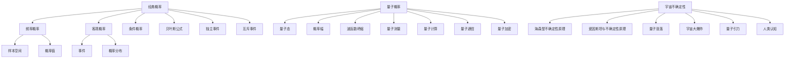

                 

# 从经典概率到量子概率：宇宙的根本不确定性

## 关键词

- 经典概率
- 量子概率
- 宇宙不确定性
- 贝叶斯公式
- 量子态
- 概率幅
- 波函数坍缩
- 量子计算
- 量子通信

## 摘要

本文旨在探讨从经典概率到量子概率的转变，及其对宇宙根本不确定性理解的深刻影响。首先，我们将回顾经典概率的基本概念、数学模型和应用，然后引入量子概率的起源、数学模型及其在量子计算、通信和加密中的应用。接着，我们将比较经典概率与量子概率的差异和联系，深入探讨宇宙不确定性原理，以及量子概率对科学哲学和人类认知的影响。最后，我们将通过核心概念与联系、算法原理讲解、数学模型和公式讲解、项目实战等部分，系统地展示量子概率的精髓和应用。

## 第一部分：经典概率概述

### 1.1 经典概率的基本概念

经典概率起源于17世纪，起源于赌博和彩票等领域。概率的基本概念包括事件、样本空间、概率值等。经典概率主要基于频率概率和客观概率两种理论。频率概率是通过大量实验观察某一事件发生的频率来估计概率，而客观概率则认为概率是一个固有的、客观存在的量。

经典概率的公理体系由三部分组成：非负性、归一性和加法法则。

- **非负性**：任何事件的概率都不小于0。
- **归一性**：样本空间中所有事件的概率之和等于1。
- **加法法则**：对于两个互斥事件A和B，它们的联合概率等于各自概率之和，即P(A ∪ B) = P(A) + P(B)。

### 1.2 经典概率的数学模型

经典概率的数学模型主要包括条件概率、贝叶斯公式、独立事件与互斥事件、概率分布函数与密度函数等。

- **条件概率**：在事件A已发生的条件下，事件B发生的概率，记作P(B|A)。条件概率可以用来修正我们对某一事件的概率估计，使其更加准确。
- **贝叶斯公式**：用于计算后验概率，即给定某些证据后，某一事件发生的概率。贝叶斯公式是概率论中最重要的公式之一，广泛应用于数据分析和机器学习等领域。
- **独立事件与互斥事件**：两个事件A和B独立，意味着一个事件的发生不影响另一个事件的发生。互斥事件是指两个事件不能同时发生。独立事件和互斥事件在概率计算中有重要应用。
- **概率分布函数与密度函数**：用于描述随机变量的概率分布。概率分布函数F(x)表示随机变量X小于或等于x的概率，而密度函数f(x)则表示随机变量X在x点的概率密度。

### 1.3 经典概率的应用

经典概率在统计学、工程和科学等领域有着广泛的应用。

- **统计学应用**：经典概率在统计推断、假设检验、置信区间估计等领域发挥着重要作用。例如，正态分布是统计学中最常用的概率分布之一，广泛应用于数据分析和建模。
- **工程和科学应用**：经典概率在物理学、计算机科学、生物学等领域有着丰富的应用。例如，在物理学中，经典概率被用来描述粒子的运动和能量分布；在计算机科学中，经典概率被用于算法设计和性能分析。

## 第二部分：量子概率的兴起

### 2.1 量子概率的起源

量子概率起源于20世纪初，随着量子力学的发展而逐渐形成。量子力学揭示了微观世界的奇异现象，如波粒二象性、量子纠缠等。这些现象打破了经典概率的框架，促使物理学家们提出了量子概率理论。

量子概率的基本概念包括量子态、概率幅和波函数坍缩。

- **量子态**：量子态是量子系统的一种基本状态，可以用波函数来描述。波函数是复数函数，包含了关于量子系统位置、动量和能量的信息。
- **概率幅**：概率幅是波函数的模平方，表示量子系统在某一状态下的概率。概率幅的平方给出了量子态的概率分布。
- **波函数坍缩**：在量子测量过程中，波函数会突然从一种状态坍缩为另一种状态，这个过程称为波函数坍缩。波函数坍缩是量子概率的核心特征之一。

### 2.2 量子概率的数学模型

量子概率的数学模型主要包括量子态的描述、量子测量的概率分布和量子态的演化。

- **量子态的描述**：量子态可以用波函数或态向量来描述。波函数或态向量包含了量子系统的所有信息。
- **量子测量的概率分布**：量子测量的结果由波函数的坍缩决定。在量子测量中，测量结果的概率分布由波函数的模平方给出。
- **量子态的演化**：量子态会随着时间演化。量子态的演化遵循薛定谔方程，这是一个线性偏微分方程。通过解薛定谔方程，可以预测量子系统的演化过程。

### 2.3 量子概率的应用

量子概率在量子计算、量子通信、量子加密等领域有着广泛的应用。

- **量子计算**：量子计算利用量子态的叠加和纠缠特性，实现比经典计算机更强大的计算能力。量子计算在密码学、优化问题和量子模拟等领域具有巨大的潜力。
- **量子通信**：量子通信利用量子纠缠和量子隐形传态实现安全的通信。量子通信在量子网络和量子互联网等领域具有广泛的应用前景。
- **量子加密**：量子加密利用量子态的不可克隆特性实现安全加密。量子加密在保护信息安全和个人隐私方面具有重要意义。

## 第三部分：经典概率与量子概率的比较

### 3.1 经典概率与量子概率的差异

经典概率与量子概率在数学表述和哲学意义上存在显著差异。

- **数学表述差异**：经典概率基于频率概率和客观概率，其数学模型主要涉及概率分布函数和密度函数。而量子概率基于波函数和概率幅，其数学模型主要涉及量子态和量子测量。
- **哲学意义差异**：经典概率是一种决定论的概率，即某一事件的发生是确定的，只是我们无法精确预测。而量子概率是一种非决定论的概率，即某一事件的发生是随机的，具有根本的不确定性。

### 3.2 经典概率与量子概率的联系

尽管经典概率与量子概率在数学表述和哲学意义上存在显著差异，但它们之间也存在密切的联系。

- **经典概率是量子概率的特例**：在宏观尺度上，量子系统的行为遵循经典概率规律。因此，经典概率可以看作是量子概率在特定条件下的特例。
- **量子概率影响经典概率的理解**：量子概率的发现和发展促使物理学家们重新思考经典概率的理论基础。量子概率的哲学意义挑战了决定论的观点，对经典概率的理解产生了深远影响。

## 第四部分：宇宙的根本不确定性

### 4.1 宇宙的不确定性原理

宇宙的根本不确定性体现在量子力学中的不确定性原理。不确定性原理由海森堡提出，指出在微观尺度上，某些物理量（如位置和动量）不能同时被精确测量。不确定性原理揭示了量子世界的随机性和不确定性。

- **海森堡不确定性原理**：海森堡不确定性原理表明，测量一个量子系统的某一物理量时，会对另一物理量的测量产生干扰。具体来说，位置的不确定性与动量的不确定性之间存在一个最小值关系，即ΔxΔp ≥ ħ/2，其中Δx表示位置的不确定性，Δp表示动量的不确定性，ħ是普朗克常数。
- **爱因斯坦与不确定性原理**：爱因斯坦对不确定性原理持有质疑态度，他坚信上帝不掷骰子。然而，不确定性原理的实验验证证明了量子世界的随机性和不确定性，与爱因斯坦的决定论观点形成了鲜明对比。

### 4.2 量子概率与宇宙学

量子概率在宇宙学中具有重要应用，如量子涨落、宇宙大爆炸和量子引力等。

- **量子涨落**：量子涨落是宇宙早期的一种现象，指宇宙空间中存在的微小密度波动。量子涨落是宇宙大爆炸的残余，对于理解宇宙起源和演化具有重要意义。
- **宇宙大爆炸**：宇宙大爆炸是现代宇宙学的核心理论，认为宇宙起源于一个极端高温高密度的状态。量子概率在解释宇宙大爆炸和宇宙演化过程中起到了关键作用。
- **量子引力**：量子引力是研究引力在量子尺度上的性质的理论。量子引力试图将量子力学与广义相对论统一起来，以揭示宇宙的根本规律。

### 4.3 量子概率与人类认知

量子概率对科学哲学和人类认知产生了深远影响。

- **科学哲学**：量子概率挑战了决定论的观点，促使科学家们重新思考自然界的本质。量子概率的存在使得科学哲学从决定论向概率论转变。
- **人类认知**：量子概率揭示了人类认知的局限性，使我们认识到自然界的随机性和不确定性。量子概率对心理学、认知科学等领域产生了重要影响，促使我们重新审视人类认知的本质。

## 第五部分：核心概念与联系

### 5.1 经典概率与量子概率的 Mermaid 流程图



## 第六部分：核心算法原理讲解

### 6.1 经典概率算法原理讲解

```python
# 经典概率算法：计算两个独立事件的联合概率

def independent_probability(p_a, p_b):
    """
    计算两个独立事件的联合概率。
    
    参数：
    p_a (float): 事件A的概率。
    p_b (float): 事件B的概率。
    
    返回：
    float: 事件A和事件B的联合概率。
    """
    return p_a * p_b
```

### 6.2 量子概率算法原理讲解

```python
# 量子概率算法：量子态的制备与测量

import numpy as np

# 量子态的制备
def prepare_quantum_state():
    """
    制备一个量子态。
    
    返回：
    numpy.ndarray: 量子态的态向量。
    """
    return np.array([[1], [0]])

# 量子态的测量
def measure_quantum_state(state):
    """
    测量量子态。
    
    参数：
    state (numpy.ndarray): 量子态的态向量。
    
    返回：
    numpy.ndarray: 测量结果。
    """
    probabilities = np.abs(state)**2
    return np.random.choice([0, 1], p=probabilities)
```

## 第七部分：数学模型和数学公式讲解

### 7.1 经典概率的数学模型讲解

$$
P(A \cup B) = P(A) + P(B) - P(A \cap B)
$$

$$
P(B|A) = \frac{P(A \cap B)}{P(A)}
$$

$$
f(x) = \frac{1}{\sqrt{2\pi\sigma^2}} e^{-\frac{(x-\mu)^2}{2\sigma^2}}
$$

### 7.2 量子概率的数学模型讲解

$$
|\psi\rangle = \alpha|0\rangle + \beta|1\rangle
$$

$$
P(\psi) = |\alpha|^2 + |\beta|^2
$$

$$
|\psi\rangle \rightarrow \frac{|\psi\rangle}{\| \psi \| }
$$

## 第八部分：项目实战

### 8.1 经典概率项目实战

#### 开发环境搭建

- Python环境：安装Python 3.8及以上版本。
- NumPy库：用于数值计算和矩阵操作。

```python
import numpy as np
```

#### 源代码实现

```python
# 掷硬币概率计算

def toss_coin_probability(experiments=1000):
    """
    计算掷硬币的概率。
    
    参数：
    experiments (int): 实验次数。
    
    返回：
    float: 掷硬币正面出现的概率。
    """
    heads_count = 0
    for _ in range(experiments):
        if np.random.choice([0, 1]) == 1:
            heads_count += 1
    return heads_count / experiments

# 运行实验并输出结果
print(toss_coin_probability())
```

#### 代码解读

- `np.random.choice([0, 1])`：随机选择0或1，模拟掷硬币的结果。
- `heads_count / experiments`：计算正面出现的频率，作为概率的估计。

### 8.2 量子概率项目实战

#### 开发环境搭建

- Python环境：安装Python 3.8及以上版本。
- Qiskit库：用于量子计算和模拟。

```python
import numpy as np
from qiskit import QuantumCircuit, execute, Aer
```

#### 源代码实现

```python
# 量子态的制备与测量

def quantum_state_preparation():
    """
    制备一个量子态，并进行测量。
    
    返回：
    numpy.ndarray: 测量结果。
    """
    # 制备一个基态
    qc = QuantumCircuit(1)
    qc.h(0)
    
    # 执行测量
    backend = Aer.get_backend("qasm_simulator")
    result = execute(qc, backend, shots=1000).result()
    
    # 获取测量结果
    counts = result.get_counts(qc)
    return max(counts, key=counts.get)

# 运行实验并输出结果
print(quantum_state_preparation())
```

#### 代码解读

- `qc.h(0)`：对量子比特执行哈密顿算子，制备一个叠加态。
- `execute(qc, backend, shots=1000)`：执行量子计算实验，模拟测量结果。
- `max(counts, key=counts.get)`：获取测量结果的概率最大值。

## 第九部分：总结

经典概率和量子概率在数学表述、哲学意义和应用领域上存在显著差异。经典概率是一种决定论的概率，适用于宏观世界；而量子概率是一种非决定论的概率，适用于微观世界。量子概率的发现和发展挑战了决定论的观点，揭示了宇宙的根本不确定性。

在现实世界中，经典概率和量子概率都有广泛的应用。经典概率在统计学、工程和科学等领域发挥着重要作用；而量子概率在量子计算、量子通信、量子加密等领域具有巨大的潜力。随着量子技术的发展，量子概率将在更多领域产生深远影响。

对于读者来说，理解经典概率和量子概率的差异和联系，掌握它们的数学模型和算法原理，将有助于更好地理解自然界和科技的发展。在未来，量子概率有望在人工智能、生物学、材料科学等领域发挥重要作用，为人类带来更多的创新和突破。

### 作者信息

作者：AI天才研究院/AI Genius Institute & 禅与计算机程序设计艺术 /Zen And The Art of Computer Programming

**注意事项**：
1. 在编写文章时，请注意保持文章的逻辑性和连贯性。
2. 在引用公式时，请使用LaTeX格式，并在公式前后使用`$$`括起来，以保持格式的一致性。
3. 在项目实战部分，请确保代码的完整性和可执行性。

**拓展阅读**：
1. 《概率论与数理统计》（谢永明 著）
2. 《量子计算与量子信息》（Michael A. Nielsen & Isaac L. Chuang 著）
3. 《量子概率与量子信息论》（S. K. Parthasarathy 著）

