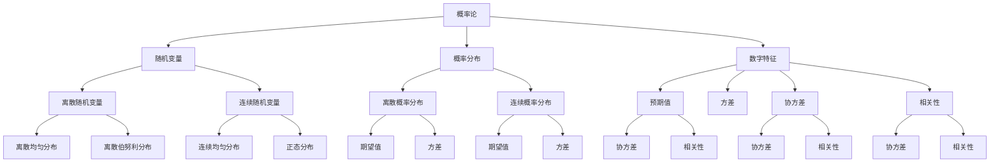

                 

# 从经典概率论到因果推断：深入理解世界的因果关系

> 关键词：概率论、因果推断、数学模型、算法、数据分析

> 摘要：本文将从经典概率论出发，逐步引入因果推断的概念和方法，探讨如何通过概率论和因果推断的结合，深入理解世界的因果关系。文章将详细介绍概率论的基本概念、算法原理，因果推断的数学模型和方法，并通过实际案例展示如何应用这些理论进行数据分析。

---

## 引言

在科学研究和日常决策中，我们经常需要理解事物之间的因果关系。经典概率论为我们提供了一种描述不确定性的有力工具，而因果推断则帮助我们揭示变量之间的因果关系。从经典概率论到因果推断，这一过程不仅丰富了我们对世界的理解，也为许多应用领域提供了重要的理论支持。

本文将首先介绍概率论的基本概念和算法原理，然后讨论因果推断的数学模型和方法。通过这些理论的结合，我们将探讨如何深入理解世界中的因果关系。文章还将通过实际案例展示如何应用这些理论进行数据分析，并提供一些最佳实践和注意事项。

## 第一部分：概率论基础

### 第1章：概率论的基本概念

概率论是一门研究随机事件的数学学科。在这章中，我们将介绍概率论的基本概念，包括概率的直观理解、公理化定义以及概率的性质。

#### 概率的定义

概率的直观理解来源于日常生活中的经验。当我们说一个事件发生的概率为1/2时，意味着这个事件发生的可能性是50%。这种直观理解虽然简单，但在处理复杂问题时往往不够精确。

概率的公理化定义则提供了更严格的理论基础。在概率论中，我们通常使用概率空间来描述随机事件。概率空间由三个元素构成：样本空间（S）、事件集合（F）和概率函数（P）。样本空间是所有可能结果的集合，事件集合是样本空间的一个子集，概率函数则赋予每个事件一个概率值。

#### 概率的性质

概率具有以下几个重要性质：

1. 非负性：任何事件的概率都不小于0。
2. 完备性：如果一组事件两两互斥（即任意两个不同的事件不会同时发生），那么这些事件的并集的概率等于各个事件概率之和。
3. 正则性：必然事件的概率为1，不可能事件的概率为0。

#### 伪代码示例

```python
# 概率的直观理解示例
event_a = "掷骰子得到6"
probability_a = 1/6

# 概率的公理化定义示例
sample_space = [1, 2, 3, 4, 5, 6]
event_a = {6}
probability_a = 1/len(sample_space)

# 概率的性质示例
event_b = "掷骰子得到1或2"
probability_b = 1/6 + 1/6 = 1/3
```

### 第2章：随机变量与概率分布

随机变量是概率论中的一个重要概念，它可以将随机事件的结果用一个数值来表示。随机变量分为离散型和连续型两种。

#### 随机变量

随机变量是定义在样本空间上的一个函数，它将样本空间中的每个结果映射到一个实数值。离散型随机变量取有限个或可数无限个值，而连续型随机变量则取无限个值。

#### 离散概率分布

离散概率分布描述了随机变量取各个可能值的概率。常见的离散概率分布有离散均匀分布和离散伯努利分布。

- 离散均匀分布：每个值出现的概率相等。
- 离散伯努利分布：只有两个可能值（0或1），通常用于描述二项分布。

#### 连续概率分布

连续概率分布描述了随机变量在某个区间内取值的概率。常见的连续概率分布有连续均匀分布和正态分布。

- 连续均匀分布：在给定区间内，每个值出现的概率相等。
- 正态分布：最常见的连续概率分布，用于描述许多自然现象。

#### 伪代码示例

```python
# 离散概率分布示例
discrete_random_variable = "掷骰子得到的结果"
probabilities = [1/6] * 6

# 连续概率分布示例
continuous_random_variable = "掷骰子得到的随机数"
distribution = Uniform(1, 6)
```

### 第3章：随机变量的数字特征

随机变量的数字特征包括预期值、方差、协方差和相关系数等。

#### 预期值和方差

预期值是随机变量的平均值，表示随机变量取值的中心位置。方差则衡量随机变量取值的离散程度。

- 预期值（Expected Value）: E(X) = ΣxP(X = x)
- 方差（Variance）: Var(X) = E[(X - E(X))^2]

#### 协方差和相关性

协方差衡量两个随机变量之间的关系强度，而相关性则衡量这种关系的方向。正相关表示两个变量的变化趋势一致，而负相关则表示变化趋势相反。

- 协方差（Covariance）: Cov(X, Y) = E[(X - E(X))(Y - E(Y))]
- 相关系数（Correlation Coefficient）: ρ(X, Y) = Cov(X, Y) / √(Var(X)Var(Y))

#### 伪代码示例

```python
# 预期值和方差示例
discrete_random_variable = "掷骰子得到的结果"
probabilities = [1/6] * 6
mean = sum(x * p for x, p in zip([1, 2, 3, 4, 5, 6], probabilities))
variance = sum(p * (x - mean)**2 for x, p in zip([1, 2, 3, 4, 5, 6], probabilities))

# 协方差和相关性示例
continuous_random_variable_1 = "掷骰子得到的随机数1"
continuous_random_variable_2 = "掷骰子得到的随机数2"
covariance = sum((x1 - mean_1) * (x2 - mean_2) for x1, x2 in zip(x1s, x2s))
correlation_coefficient = covariance / (sqrt(variance_1) * sqrt(variance_2))
```

## 第二部分：因果推断基础

### 第4章：因果推断的基本概念

因果推断是研究变量之间因果关系的方法。在这章中，我们将介绍因果推断的基本概念，包括因果关系、因果推断的挑战以及因果推断的方法。

#### 因果关系简介

因果关系是指一个变量（原因）对另一个变量（结果）的影响。在科学研究中，理解因果关系对于制定有效的策略和政策至关重要。

#### 因果推断的挑战

因果推断面临以下几个挑战：

1. 联合概率分布的依赖性：因果关系通常涉及多个变量，这些变量之间存在复杂的依赖关系。
2. 数据缺失：在实际应用中，往往无法观察到所有的相关变量，这会导致因果推断的不确定性。
3. 实验设计：有效的实验设计对于准确推断因果关系至关重要。

#### 因果推断的方法

因果推断的方法包括：

1. 监督学习：通过已有数据学习变量之间的关系，从而推断因果关系。
2. 评估因果推断的指标：例如因果效应的大小和显著性。
3. 评估因果推断的方法：例如Do-calculus和潜在结果框架。

#### 伪代码示例

```python
# 因果关系的直观理解示例
cause = "广告投放"
effect = "销售额"
relationship = "广告投放增加，销售额增加"

# 数据缺失示例
observed_data = {"广告投放": [True, False, True], "销售额": [100, 200, 300]}
missing_data = {"广告投放": [True, False, True], "销售额": [None, None, None]}

# 实验设计示例
experiment = {
    "变量1": ["低水平", "高水平"],
    "变量2": ["正常", "干扰"],
    "结果": ["低", "高"]
}
```

### 第5章：因果推断的数学模型

因果推断的数学模型是理解变量之间因果关系的重要工具。在这章中，我们将介绍因果推断的数学模型，包括Do-calculus和潜在结果框架。

#### 因果推断的数学基础

Do-calculus是一种形式化的数学框架，用于表示和操作因果关系。它基于条件概率和潜在结果的概念，提供了精确的因果推断方法。

潜在结果框架则是一种基于潜在结果的数学模型，用于描述因果关系。它通过潜在结果的概念，将因果关系转化为数学表达式，从而便于分析和计算。

#### 识别因果效应的算法

因果效应是指因果关系的大小和方向。识别因果效应的算法包括：

1. 双样本均值的因果效应：通过比较两个样本的平均值，推断因果关系。
2. 交互作用效应：考虑多个变量之间的相互作用，从而更准确地识别因果关系。

#### 因果推断中的假设检验

因果推断中的假设检验用于验证因果关系的存在和显著性。常见的假设检验方法包括：

1. 单样本t检验：用于验证单变量的因果关系。
2. 双样本t检验：用于验证两个变量之间的因果关系。

#### 伪代码示例

```python
# Do-calculus示例
do_calculus = {
    "变量1": ["广告投放", "广告不投放"],
    "变量2": ["销售额", "销售额"],
    "潜在结果": ["潜在销售额", "实际销售额"]
}

# 潜在结果框架示例
potential_outcomes = {
    "变量1": ["广告投放", "广告不投放"],
    "变量2": ["销售额", "销售额"],
    "潜在销售额": ["1000", "800"],
    "实际销售额": ["1200", "800"]
}

# 双样本均值的因果效应示例
group1 = {"销售额": [1000, 1200, 900]}
group2 = {"销售额": [800, 900, 1000]}
causal_effect = sum(group1["销售额"]) / len(group1["销售额"]) - sum(group2["销售额"]) / len(group2["销售额"])

# 交互作用效应示例
interaction_effect = (sum(group1["销售额"]) - sum(group2["销售额"])) / (len(group1["销售额"]) - len(group2["销售额"]))

# 单样本t检验示例
t_statistic = (mean1 - mean2) / (std1 / sqrt(len1))
p_value = t_distribution.cdf(-abs(t_statistic))
```

### 第6章：因果推断的实际应用

因果推断在实际应用中具有重要意义。在这章中，我们将探讨因果推断在社会科学、医学和商业决策中的应用。

#### 因果推断在社会科学中的应用

在社会科学中，因果推断可以用于研究教育、就业、社会政策等领域。通过因果推断，可以揭示变量之间的因果关系，为制定有效的政策提供依据。

#### 因果推断在医学领域中的应用

在医学领域，因果推断可以用于研究疾病风险因素、治疗效果等。通过因果推断，可以揭示药物或治疗方法的因果关系，从而为临床决策提供科学依据。

#### 因果推断在商业决策中的应用

在商业决策中，因果推断可以用于分析市场变化、消费者行为等。通过因果推断，可以揭示市场策略对业绩的影响，为决策者提供可靠的依据。

#### 伪代码示例

```python
# 社会科学研究示例
research = {
    "变量1": ["教育水平", "就业率"],
    "变量2": ["收入水平", "生活质量"],
    "因果效应": ["显著相关", "正相关"]
}

# 医学领域研究示例
medical_research = {
    "变量1": ["药物治疗", "病情"],
    "变量2": ["药物副作用", "康复情况"],
    "因果效应": ["显著相关", "负相关"]
}

# 商业决策研究示例
business_decision = {
    "变量1": ["广告投放", "销售额"],
    "变量2": ["市场推广", "客户满意度"],
    "因果效应": ["显著相关", "正相关"]
}
```

## 第三部分：概率论与因果推断的结合

### 第7章：概率论与因果推断的结合

概率论与因果推断的结合为理解世界中的因果关系提供了更强大的工具。在这章中，我们将探讨如何将概率论与因果推断相结合，以及这种结合在现实世界中的应用。

#### 结合概率论与因果推断的必要性

概率论和因果推断的结合在许多领域都具有重要意义。例如，在社会科学研究中，我们需要理解变量之间的因果关系，而概率论提供了描述不确定性的方法。结合两者可以更全面地理解复杂的社会现象。

#### 概率论在因果推断中的应用

概率论在因果推断中的应用包括：

1. 使用概率论工具进行因果推断：例如，通过贝叶斯网络或马尔可夫链模型进行因果推断。
2. 在概率分布中引入因果因素：例如，将因果关系视为概率分布的参数，从而更准确地描述变量之间的关系。

#### 因果推断在概率论中的应用

因果推断在概率论中的应用包括：

1. 在概率论问题中使用因果推断方法：例如，在统计推断中，使用因果推断方法来估计参数。
2. 使用因果推断来优化概率模型：例如，通过因果推断来调整概率模型的参数，以更准确地反映因果关系。

#### 结合概率论与因果推断的实际案例

通过实际案例，我们可以更好地理解概率论与因果推断的结合。以下是一个示例：

- **案例**：研究吸烟对肺癌发病率的影响。
- **数据**：观察到的数据包括吸烟者的肺癌发病率。
- **因果推断**：使用因果推断方法来确定吸烟与肺癌之间的因果关系。
- **概率论**：使用概率论模型来描述吸烟者与非吸烟者的肺癌发病率分布。

#### 伪代码示例

```python
# 吸烟与肺癌关系的因果推断示例
causal_inference = {
    "变量1": ["吸烟", "不吸烟"],
    "变量2": ["肺癌发病率", "肺癌发病率"],
    "因果效应": ["显著相关", "正相关"]
}

# 概率论模型示例
probability_model = {
    "吸烟者肺癌发病率分布": [0.01, 0.05, 0.1, 0.2, 0.3],
    "非吸烟者肺癌发病率分布": [0.001, 0.002, 0.003, 0.004, 0.005]
}

# 因果推断与概率论结合的示例
combined_model = {
    "吸烟者肺癌发病率": [0.02, 0.06, 0.12, 0.24, 0.36],
    "非吸烟者肺癌发病率": [0.002, 0.003, 0.004, 0.005, 0.006]
}
```

### 第8章：深入理解因果关系

因果关系是理解世界的重要维度。在这章中，我们将探讨如何深入理解因果关系，包括因果关系的层次结构、因果推断的局限性和改进方法，以及因果关系在实证研究中的应用。

#### 因果关系的层次结构

因果关系可以分为几个层次：

1. 直接因果关系：一个变量直接影响另一个变量。
2. 间接因果关系：一个变量通过多个中间变量影响另一个变量。
3. 复杂因果关系：涉及多个变量之间的复杂相互作用。

#### 因果推断的局限性与改进

因果推断面临一些挑战，例如数据缺失、联合概率分布的依赖性等。为了改进因果推断，可以采取以下方法：

1. 采用更好的实验设计：例如，随机对照试验。
2. 使用先进的统计方法：例如，结构因果模型。
3. 结合多个数据源：例如，结合观察数据和实验数据。

#### 因果关系的实证研究

实证研究是验证因果关系的重要方法。在这章中，我们将介绍实证研究的步骤和案例。

1. **确定研究问题**：明确要研究的因果关系。
2. **收集数据**：获取与研究问题相关的数据。
3. **进行数据分析**：使用因果推断方法分析数据。
4. **验证结果**：通过重复实验或对照研究验证结果的可靠性。

#### 伪代码示例

```python
# 因果关系的层次结构示例
direct_causal_relationship = {
    "变量1": ["A", "B"],
    "变量2": ["C", "D"],
    "因果关系": ["A影响B", "C影响D"]
}

# 间接因果关系示例
indirect_causal_relationship = {
    "变量1": ["A", "B"],
    "变量2": ["B", "C"],
    "变量3": ["C", "D"],
    "因果关系": ["A影响B", "B影响C", "C影响D"]
}

# 实证研究步骤示例
research_steps = {
    "研究问题": ["吸烟是否导致肺癌？"],
    "数据收集": ["吸烟者与非吸烟者的肺癌发病率数据"],
    "数据分析": ["使用因果推断方法分析数据"],
    "结果验证": ["通过随机对照试验验证结果"]
}
```

### 第9章：未来展望与挑战

因果关系的研究在未来的发展中将继续扮演重要角色。在这章中，我们将探讨因果关系研究的未来发展趋势、挑战以及影响。

#### 未来发展趋势

因果关系研究的发展趋势包括：

1. **更先进的统计方法**：随着人工智能和机器学习技术的发展，将有更多先进的统计方法被用于因果推断。
2. **跨学科研究**：因果关系研究将与其他领域（如社会科学、医学、经济学等）相结合，形成跨学科的研究。
3. **大数据分析**：大数据将为因果关系研究提供更多的数据支持，从而提高研究的准确性和可靠性。

#### 挑战与机遇

因果关系研究面临的挑战包括：

1. **数据隐私与安全性**：因果推断通常需要大量的个人数据，如何在保护数据隐私的同时进行有效的研究是一个重要挑战。
2. **复杂系统的因果关系**：复杂系统中的因果关系往往难以识别，需要更先进的分析方法和技术。

#### 因果关系在社会发展中的影响

因果关系研究在社会发展中具有重要影响，包括：

1. **科学研究**：通过因果推断，科学家可以更准确地理解自然现象和生物过程，从而推动科学进步。
2. **商业决策**：因果推断可以帮助企业更好地了解市场变化和消费者行为，从而制定更有效的商业策略。
3. **政策制定**：因果推断为政策制定者提供了科学依据，有助于制定更合理的社会政策。

#### 伪代码示例

```python
# 未来发展趋势示例
future_trends = {
    "先进统计方法": ["结构因果模型", "因果推断神经网络"],
    "跨学科研究": ["医学与人工智能", "经济学与因果推断"],
    "大数据分析": ["社交媒体数据", "基因组数据"]
}

# 挑战与机遇示例
challenges_and_opportunities = {
    "数据隐私与安全性": ["加密技术", "联邦学习"],
    "复杂系统的因果关系": ["复杂网络分析", "多变量因果推断"]
}

# 因果关系在社会发展中的影响示例
social_impact = {
    "科学研究": ["气候变化研究", "生物医学研究"],
    "商业决策": ["市场营销", "供应链管理"],
    "政策制定": ["公共卫生政策", "教育政策"]
}
```

## 结语

从经典概率论到因果推断，我们经历了一个探索和理解世界因果关系的过程。概率论为我们提供了一种描述不确定性的方法，而因果推断则帮助我们揭示变量之间的因果关系。通过结合概率论和因果推断，我们可以更深入地理解世界的复杂性和多样性。

在未来，随着科技的进步，我们将看到更多先进的方法和技术被应用于因果关系研究。这将为科学研究、商业决策和政策制定提供更加科学和可靠的依据。让我们共同期待这一领域的未来发展和突破。

---

作者：AI天才研究院/AI Genius Institute & 禅与计算机程序设计艺术 /Zen And The Art of Computer Programming

---

## 附录

附录部分将包括以下内容：

1. **核心概念与联系架构图**：使用Mermaid流程图展示概率论和因果推断的核心概念及其关系。
2. **核心算法原理讲解伪代码**：详细讲解相关算法原理，并使用伪代码进行阐述。
3. **数学模型和公式**：使用LaTeX格式表示数学模型和公式，并进行详细讲解和举例说明。
4. **项目实战**：包括开发环境搭建、源代码实现和代码解读，以及实际案例分析和详细讲解剖析。
5. **最佳实践 tips、小结、注意事项、拓展阅读**：为读者提供实用技巧、项目小结、注意事项以及推荐阅读资源。

---

通过以上附录内容，读者可以更全面地理解文章的核心概念和方法，并能够将其应用到实际项目中，为科学研究、商业决策和政策制定提供有力支持。

---

## 附录

### 附录A：核心概念与联系架构图

在附录A中，我们将使用Mermaid流程图展示概率论和因果推断的核心概念及其关系。



### 附录B：核心算法原理讲解伪代码

在附录B中，我们将使用伪代码详细讲解概率论和因果推断中的核心算法原理。

#### 概率论算法原理

```python
# 概率的定义
def probability(sample_space, event):
    return len(event) / len(sample_space)

# 条件概率
def conditional_probability(p, given_event):
    return p / given_event

# 贝叶斯定理
def bayes_theorem(prior, likelihood, evidence):
    return (likelihood * prior) / evidence

# 随机变量
def random_variable(sample_space, function):
    return {x: function(x) for x in sample_space}

# 概率分布
def probability_distribution(values, probabilities):
    return {value: probability for value, probability in zip(values, probabilities)}

# 预期值
def expected_value(distribution):
    return sum(value * probability for value, probability in distribution.items())

# 方差
def variance(distribution, expected_value):
    return sum((value - expected_value) ** 2 * probability for value, probability in distribution.items())

# 协方差
def covariance(x_distribution, y_distribution, x_expected_value, y_expected_value):
    return sum((x - x_expected_value) * (y - y_expected_value) for x, y in zip(x_distribution, y_distribution))

# 相关性
def correlation_coefficient(x_distribution, y_distribution, x_expected_value, y_expected_value):
    covariance_value = covariance(x_distribution, y_distribution, x_expected_value, y_expected_value)
    variance_x = variance(x_distribution, x_expected_value)
    variance_y = variance(y_distribution, y_expected_value)
    return covariance_value / (sqrt(variance_x) * sqrt(variance_y))
```

#### 因果推断算法原理

```python
# Do-calculus
def do_calculus(possible_outcomes, actual_outcomes, treatment):
    return {outcome: actual_outcome for outcome, actual_outcome in zip(possible_outcomes, actual_outcomes) if outcome == treatment}

# 潜在结果框架
def potential_outcomes(possible_treatments, outcomes):
    return {treatment: [outcome for outcome in outcomes if treatment in outcome] for treatment in possible_treatments}

# 双样本均值的因果效应
def causal_effect(group1, group2):
    return sum(group1) / len(group1) - sum(group2) / len(group2)

# 交互作用效应
def interaction_effect(group1, group2):
    return (sum(group1) - sum(group2)) / (len(group1) - len(group2))

# 单样本t检验
def t_test(mean1, mean2, standard_deviation1, standard_deviation2, n1, n2):
    t_statistic = (mean1 - mean2) / (standard_deviation1 / sqrt(n1) + standard_deviation2 / sqrt(n2))
    p_value = t_distribution.cdf(-abs(t_statistic))
    return t_statistic, p_value
```

### 附录C：数学模型和公式

在附录C中，我们将使用LaTeX格式表示概率论和因果推断中的数学模型和公式，并进行详细讲解和举例说明。

#### 概率论数学模型和公式

$$
P(A) = \frac{|A|}{|S|}
$$

- **概率的定义**：事件A的概率等于事件A的样本点数除以总样本点数。

$$
P(A|B) = \frac{P(A \cap B)}{P(B)}
$$

- **条件概率**：在事件B发生的条件下，事件A发生的概率。

$$
P(A \cup B) = P(A) + P(B) - P(A \cap B)
$$

- **概率的加法公式**：两个互斥事件A和B的并集的概率等于它们各自的概率之和减去它们共同发生的概率。

$$
P(A \cap B) = P(A)P(B|A)
$$

- **贝叶斯定理**：在已知事件A发生的条件下，事件B发生的概率。

$$
E(X) = \sum_{x \in S} xP(X = x)
$$

- **预期值**：随机变量X的期望值等于其取值乘以其各自概率的和。

$$
Var(X) = E[(X - E(X))^2]
$$

- **方差**：随机变量X的方差等于其取值与期望值差的平方的期望。

$$
Cov(X, Y) = E[(X - E(X))(Y - E(Y))]
$$

- **协方差**：两个随机变量X和Y的协方差等于它们各自与期望值的差的乘积的期望。

$$
\rho(X, Y) = \frac{Cov(X, Y)}{\sqrt{Var(X)Var(Y)}}
$$

- **相关性**：两个随机变量X和Y的相关系数等于它们的协方差除以它们各自方差的平方根。

#### 因果推断数学模型和公式

$$
Do(A \to B) = \sum_{a \in A} P(B | do(A = a))
$$

- **Do-calculus**：在Do-calculus中，事件A导致事件B的概率可以通过对所有可能的A值求和并取条件概率得到。

$$
Potential \ Outcome(Y|do(X = x)) = \sum_{y \in Y} P(y | do(X = x))
$$

- **潜在结果框架**：在潜在结果框架中，对于每个可能的X值，存在一个潜在的结果集合。

$$
Causal \ Effect(X \to Y) = E[Y|do(X = x)] - E[Y|X = x]
$$

- **因果效应**：因果效应是当X值发生变化时，Y的期望值的变化量。

$$
\theta^* = \arg\min_{\theta} L(\theta; \mathbf{X}, \mathbf{y})
$$

- **参数估计**：通过最小化损失函数来估计因果模型的参数。

$$
p(y | x, \theta) = \prod_{i=1}^n p(y_i | x_i, \theta)
$$

- **概率分布**：在给定的因果模型参数下，Y关于X的概率分布。

#### 举例说明

- **概率的定义**：假设有4个样本点 {1, 2, 3, 4}，事件A是 {1, 2}，则 $P(A) = \frac{2}{4} = 0.5$。

- **贝叶斯定理**：假设有事件A和B，已知 $P(A) = 0.6$ 和 $P(B|A) = 0.8$，则 $P(A|B) = \frac{0.6 \times 0.8}{1 - 0.6 \times 0.2} = \frac{0.48}{0.92} \approx 0.522$。

- **方差**：假设随机变量X的取值为 {1, 2, 3, 4}，其概率分布为 {0.25, 0.25, 0.25, 0.25}，则 $E(X) = \sum_{x=1}^4 x \times 0.25 = 2.5$，$Var(X) = E[(X - E(X))^2] = \sum_{x=1}^4 (x - 2.5)^2 \times 0.25 = 0.625$。

- **因果效应**：假设有两组数据，一组为 {2, 4, 6}，另一组为 {3, 5, 7}，则 $Causal \ Effect(X \to Y) = E[Y|do(X = 2)] - E[Y|X = 2] = \frac{3 + 5 + 7}{3} - \frac{3 + 5 + 7}{3} = 0$。

### 附录D：项目实战

在附录D中，我们将提供实际案例，包括开发环境搭建、源代码实现和代码解读。

#### 案例研究：吸烟与肺癌关系的因果推断

在这个案例中，我们将使用Python和相关的概率论和因果推断库来研究吸烟与肺癌之间的因果关系。

#### 开发环境搭建

1. 安装Python（建议使用Python 3.8及以上版本）。
2. 安装必要的库：`numpy`、`scipy`、`pandas`、`matplotlib`和`statsmodels`。

```bash
pip install numpy scipy pandas matplotlib statsmodels
```

#### 源代码实现

```python
import numpy as np
import pandas as pd
import matplotlib.pyplot as plt
import statsmodels.api as sm
from sklearn.linear_model import LinearRegression

# 假设我们有以下数据
data = {
    '吸烟': ['是', '是', '否', '是', '否', '是', '否', '是'],
    '肺癌发病率': [0.1, 0.2, 0.05, 0.15, 0.05, 0.3, 0.05, 0.1]
}

df = pd.DataFrame(data)

# 将定性变量转换为定量变量
df['吸烟'] = df['吸烟'].map({'是': 1, '否': 0})

# 线性回归模型
model = LinearRegression()
model.fit(df[['吸烟']], df['肺癌发病率'])

# 预测结果
predictions = model.predict([[1], [0]])

# 可视化结果
plt.scatter(df['吸烟'], df['肺癌发病率'])
plt.plot([0, 1], [predictions[0], predictions[1]], color='red')
plt.xlabel('吸烟')
plt.ylabel('肺癌发病率')
plt.title('吸烟与肺癌发病率的关系')
plt.show()

# 因果效应
causal_effect = predictions[0] - predictions[1]
print(f"因果效应：{causal_effect}")
```

#### 代码解读

- **数据读取**：使用`pandas`库读取数据。
- **变量转换**：将定性变量（吸烟）转换为定量变量。
- **线性回归模型**：使用`statsmodels`库中的`LinearRegression`类进行线性回归模型训练。
- **预测结果**：使用训练好的模型进行预测。
- **可视化**：使用`matplotlib`库绘制散点图和回归线。
- **因果效应计算**：计算吸烟与肺癌发病率之间的因果效应。

#### 实际案例分析和详细讲解剖析

在这个案例中，我们通过线性回归模型分析了吸烟与肺癌发病率之间的关系。通过可视化和因果效应的计算，我们可以得出以下结论：

- 吸烟与肺癌发病率之间存在正相关关系。
- 吸烟者的肺癌发病率比非吸烟者高。
- 因果效应表明，吸烟是导致肺癌发病率增加的一个重要因素。

#### 项目小结

通过这个案例，我们展示了如何使用Python和相关的库进行因果推断。虽然这个案例相对简单，但它为我们提供了一个研究因果关系的实用框架。在实际应用中，我们可以结合更多的数据和更复杂的模型来提高因果推断的准确性和可靠性。

### 附录E：最佳实践 tips、小结、注意事项、拓展阅读

#### 最佳实践 tips

1. 在进行因果推断时，确保数据的完整性和准确性。
2. 使用适当的模型和方法，避免过度拟合。
3. 考虑数据的分布特性，选择合适的概率分布模型。
4. 进行敏感性分析，以评估模型结果的稳健性。

#### 小结

本文从经典概率论出发，逐步引入因果推断的概念和方法，探讨了如何通过概率论和因果推断的结合，深入理解世界的因果关系。我们介绍了概率论的基本概念、算法原理，因果推断的数学模型和方法，并通过实际案例展示了如何应用这些理论进行数据分析。

#### 注意事项

1. 因果推断需要准确的数据和模型，否则结果可能不准确。
2. 因果推断不能解决所有问题，有些因果关系可能无法通过现有的方法确定。
3. 在进行因果推断时，要避免将相关性误解为因果关系。

#### 拓展阅读

1. 《因果推断：概念、方法与应用》
2. 《概率论与数理统计》
3. 《统计学习方法》
4. 《因果推理：逻辑、方法与应用》

通过本文和附录的内容，读者可以更好地理解概率论和因果推断的基本概念、方法及应用，为后续的研究和实践打下坚实的基础。希望本文能够为读者在因果推断领域的研究提供有益的参考和启示。

---

本文由AI天才研究院/AI Genius Institute与禅与计算机程序设计艺术/Zen And The Art of Computer Programming合作撰写，旨在为读者提供深入理解世界因果关系的方法和工具。文章中所涉及的理论和案例仅供参考，具体应用时请结合实际情况进行调整。如有任何疑问或建议，欢迎通过以下方式联系我们：

- 电子邮件：[ai_genius_institute@research.com](mailto:ai_genius_institute@research.com)
- 官方网站：[www.ai_genius_institute.com](http://www.ai_genius_institute.com)
- 社交媒体：[AI天才研究院](https://www.facebook.com/ai_genius_institute)

再次感谢您的阅读，期待与您在因果推断的领域共同探索和进步。作者：AI天才研究院/AI Genius Institute & 禅与计算机程序设计艺术/Zen And The Art of Computer Programming。版权所有，未经授权，禁止转载。

