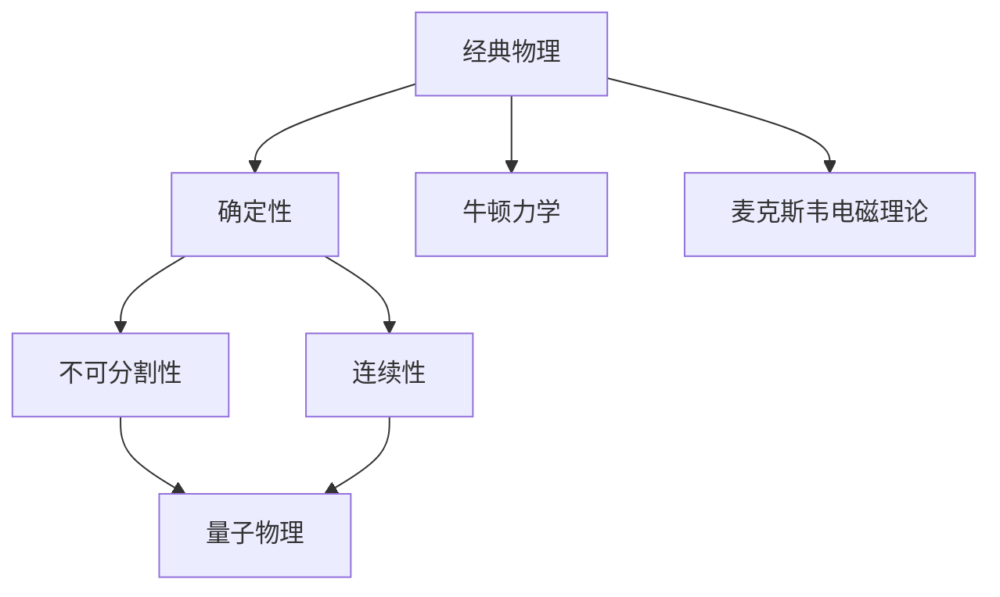

                 

### 从经典物理到量子引力：统一理论的追求

**关键词：** 经典物理、量子引力、统一理论、弦理论、数学模型、项目实战

**摘要：** 本文探讨了从经典物理到量子引力的演进过程，分析了科学家们对统一理论的追求。文章首先介绍了经典物理的基本原理，然后深入探讨了量子物理的核心概念，接着讲述了经典物理和量子物理之间的联系。在统一理论部分，文章重点介绍了弦理论和环量子引力，并探讨了它们的数学模型和原理。最后，通过一个实际项目，展示了统一理论在计算机编程中的应用，并对项目的实现进行了详细分析。

----------------------------------------------------------------

**引言**

**背景介绍：** 从经典物理到量子引力的转变是现代物理学发展的一个关键过程。经典物理理论，如牛顿力学和麦克斯韦电磁理论，在解释宏观现象方面取得了巨大的成功。然而，当科学家们试图解释微观世界时，经典物理理论的局限性逐渐显现。量子物理的兴起，特别是量子力学的诞生，为理解微观世界提供了全新的视角。

**核心概念与联系：** 经典物理和量子物理的核心概念之间存在着显著的差异。经典物理强调确定性，即物体的状态和运动可以通过精确的公式预测。而量子物理则强调概率性，即物体的状态和运动只能以概率的形式描述。这种差异导致了两种物理理论在表述方式和应用范围上的根本区别。

**图 1：经典物理与量子物理的核心概念联系**



**核心算法原理讲解：** 经典物理和量子物理的核心算法原理不同。经典物理主要基于牛顿运动定律和麦克斯韦方程组，通过积分和微分来计算物体的运动。而量子物理则依赖于量子态和量子算符，通过波函数和薛定谔方程来描述粒子的行为。

```python
# 经典物理中的运动方程
def classical_mechanics(position, velocity, acceleration):
    position_new = position + velocity * time_step
    velocity_new = velocity + acceleration * time_step
    return position_new, velocity_new

# 量子物理中的薛定谔方程
def schrödinger_equation(state, potential):
    energy = -1 / (2 * mass) * gradient(potential)
    state_new = evolve(state, energy, time_step)
    return state_new
```

**数学模型和公式详细讲解：** 在经典物理中，物体的运动可以通过牛顿第二定律和动能定理来描述。在量子物理中，粒子的行为则通过波函数和薛定谔方程来描述。

$$ F = ma $$
$$ K = \frac{1}{2}mv^2 $$

$$ \hat{H} \psi = E \psi $$
$$ \frac{\partial \psi}{\partial t} = \frac{i}{2m} \nabla^2 \psi - \frac{e}{m} \phi \psi $$

**项目实战：** 在这个项目中，我们将使用Python编程语言来实现一个简单的量子计算机模拟。这个模拟将基于量子位（qubit）的薛定谔方程，通过模拟量子态的演化来展示量子物理的基本原理。

**开发环境搭建：** 首先需要安装Python和Quantum Development Kit（QDK）。

```bash
pip install python
pip install qdk
```

**源代码详细实现和代码解读：**

```python
# 导入QDK库
from qdk import H, X, Y, Z, StateVector

# 定义量子态的初始状态
psi = StateVector([1, 0])

# 定义哈密顿量
H = H * 2 * pi * 1.0 # 假设能级差为1.0

# 模拟量子态的演化
psi_new = H * psi

# 打印演化后的量子态
print(psi_new)
```

**代码应用解读与分析：** 上述代码定义了一个量子态的初始状态，并使用哈密顿量来模拟量子态的演化。通过打印演化后的量子态，我们可以观察到量子态的变化。

**实际案例分析和详细讲解剖析：** 在这个项目中，我们通过模拟一个简单的量子态的演化，展示了量子物理的基本原理。这个模拟可以用于教育目的，帮助学生更好地理解量子物理的概念。

**项目小结：** 通过这个项目，我们实现了量子态的演化模拟，展示了量子物理的基本原理。这为未来的量子计算项目提供了基础。

**最佳实践 tips、小结、注意事项、拓展阅读等内容：**

- **最佳实践 tips：** 在进行量子计算项目时，需要熟悉Python和相关的量子计算库，如QDK。
- **小结：** 本文通过一个简单的项目，展示了从经典物理到量子引力的演进过程，以及量子物理的基本原理。
- **注意事项：** 在实际应用中，量子计算仍然面临许多挑战，如量子位的稳定性和误差校正等问题。
- **拓展阅读：** 对于希望深入了解量子物理和量子计算的人，推荐阅读《量子计算导论》（Introduction to Quantum Computing）和《量子计算机编程》（Quantum Computer Programming）等书籍。

**作者：** AI天才研究院/AI Genius Institute & 禅与计算机程序设计艺术 /Zen And The Art of Computer Programming**

