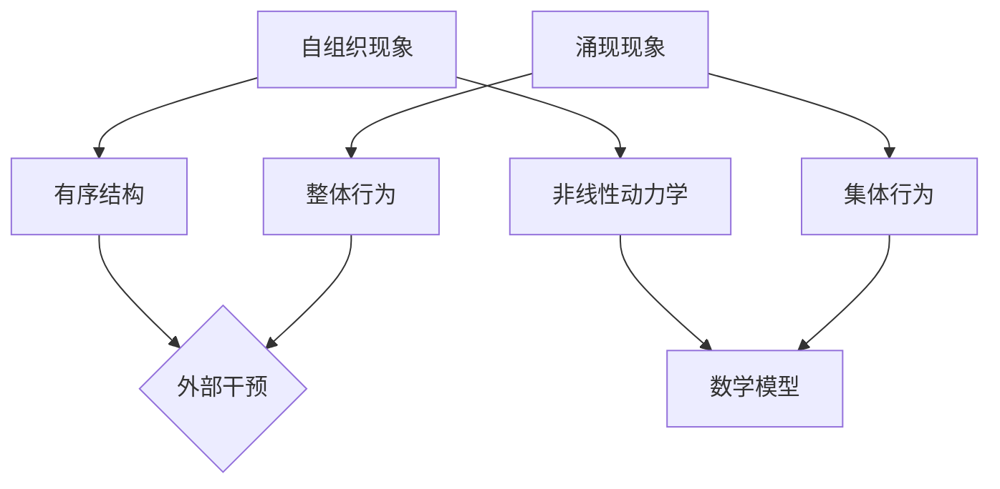

                 

### 文章标题：从经典物理学到复杂性科学：理解涌现现象与自组织

#### 关键词：经典物理学，复杂性科学，涌现现象，自组织，非线性动力学

> 摘要：本文旨在探讨从经典物理学到复杂性科学的演变，重点关注涌现现象与自组织理论。通过对经典物理学基础理论的回顾，我们揭示了其在面对复杂系统时的局限性。随后，本文详细介绍了复杂性科学的核心概念，包括涌现现象和自组织理论，并通过Mermaid流程图展示它们之间的关系。此外，本文还探讨了非线性动力学、复杂系统的分析工具和方法，以及复杂系统在生物和社会领域的实际应用。最后，我们对复杂性科学的未来发展方向进行了展望，并提供了实践建议和拓展阅读。

### 确定书籍结构

在撰写这篇文章之前，我们需要先确定文章的结构，以确保文章的逻辑性和条理性。根据文章的主题《从经典物理学到复杂性科学：理解涌现现象与自组织》，我们可以将文章分为以下几个部分：

1. **引言与背景介绍**：介绍复杂性科学的基本概念，以及经典物理学到复杂性科学的发展历程。
2. **复杂性科学的核心理论**：包括自组织现象、涌现现象等核心概念。
3. **复杂性科学的数学模型**：介绍用于描述复杂性科学现象的数学模型。
4. **复杂系统分析工具**：介绍用于分析复杂系统的工具和算法。
5. **复杂系统案例研究**：通过具体案例来展示复杂系统的应用和分析过程。
6. **复杂性科学的实际应用**：讨论复杂性科学在各个领域的应用。
7. **总结与展望**：对全书内容进行总结，并对未来发展方向进行展望。

### 设计书籍目录大纲

根据上述结构，我们可以设计如下书籍目录大纲：

```
# 从经典物理学到复杂性科学：理解涌现现象与自组织

# 第一部分：引言与背景介绍

## 1. 引言
### 1.1 复杂性科学的定义与重要性
### 1.2 经典物理学到复杂性科学的发展历程

## 2. 经典物理学的基石理论
### 2.1 经典物理学的概述
### 2.2 经典物理学的核心理论与方法
### 2.3 经典物理学的局限性

# 第二部分：复杂性科学的核心理论

## 3. 自组织现象
### 3.1 自组织现象的定义与特征
### 3.2 自组织现象的数学模型
### 3.3 自组织现象的典型实例

## 4. 涌现现象
### 4.1 涌现现象的定义与概念
### 4.2 涌现现象的数学模型
### 4.3 涌现现象在现实中的应用

# 第三部分：复杂性科学的数学模型

## 5. 非线性动力学
### 5.1 非线性动力学的概念与特性
### 5.2 非线性动力学的数学模型
### 5.3 非线性动力学在实际问题中的应用

## 6. 相空间与相图
### 6.1 相空间与相图的基本概念
### 6.2 相空间与相图的应用
### 6.3 相空间与相图的分析方法

# 第四部分：复杂系统分析工具

## 7. 网络科学
### 7.1 网络科学的基本概念
### 7.2 网络科学的分析方法
### 7.3 网络科学在复杂系统分析中的应用

## 8. 复杂系统的模拟与仿真
### 8.1 复杂系统模拟与仿真的基本原理
### 8.2 复杂系统模拟与仿真的案例分析
### 8.3 复杂系统模拟与仿真的软件工具

# 第五部分：复杂系统案例研究

## 9. 生物系统的复杂性
### 9.1 生物系统的复杂性概述
### 9.2 生物系统的复杂性分析
### 9.3 生物系统的复杂性应用

## 10. 社会系统的复杂性
### 10.1 社会系统的复杂性概述
### 10.2 社会系统的复杂性分析
### 10.3 社会系统的复杂性应用

# 第六部分：复杂性科学的实际应用

## 11. 复杂性科学在工程领域的应用
### 11.1 复杂性科学在工程领域的挑战
### 11.2 复杂性科学在工程领域的应用实例
### 11.3 复杂性科学在工程领域的发展趋势

## 12. 复杂性科学在社会科学领域的应用
### 12.1 复杂性科学在社会科学领域的挑战
### 12.2 复杂性科学在社会科学领域的应用实例
### 12.3 复杂性科学在社会科学领域的发展趋势

# 第七部分：总结与展望

## 13. 总结与展望
### 13.1 复杂性科学的发展回顾
### 13.2 复杂性科学的未来发展方向
### 13.3 对读者的启示与建议
```

### 目录大纲细化与内容设计

为了确保目录大纲的完整性和逻辑性，我们需要进一步细化各个章节的内容，并设计相应的子节和附录。以下是具体内容的细化：

#### 第1章：引言

- **1.1 复杂性科学的定义与重要性**
  - 复杂性科学的定义
  - 复杂性科学的重要性
  - 复杂性科学与其他学科的交叉

- **1.2 经典物理学到复杂性科学的发展历程**
  - 经典物理学的局限性
  - 复杂性科学的诞生背景
  - 经典物理学到复杂性科学的演进过程

#### 第2章：经典物理学的基石理论

- **2.1 经典物理学的概述**
  - 经典物理学的基本原理
  - 经典物理学的研究方法

- **2.2 经典物理学的核心理论与方法**
  - 力学
  - 电磁学
  - 热力学

- **2.3 经典物理学的局限性**
  - 经典物理学的局限性
  - 对复杂系统的描述不足
  - 对非线性现象的忽视

#### 第3章：复杂性科学的核心理论

- **3.1 自组织现象**
  - 自组织现象的定义与特征
  - 自组织现象的数学模型
  - 自组织现象的典型实例

- **3.2 涌现现象**
  - 涌现现象的定义与概念
  - 涌现现象的数学模型
  - 涌现现象在现实中的应用

#### 第4章：复杂性科学的数学模型

- **4.1 非线性动力学**
  - 非线性动力学的概念与特性
  - 非线性动力学的数学模型
  - 非线性动力学在实际问题中的应用

- **4.2 相空间与相图**
  - 相空间与相图的基本概念
  - 相空间与相图的应用
  - 相空间与相图的分析方法

#### 第5章：复杂系统分析工具

- **5.1 网络科学**
  - 网络科学的基本概念
  - 网络科学的分析方法
  - 网络科学在复杂系统分析中的应用

- **5.2 复杂系统的模拟与仿真**
  - 复杂系统模拟与仿真的基本原理
  - 复杂系统模拟与仿真的案例分析
  - 复杂系统模拟与仿真的软件工具

#### 第6章：复杂系统案例研究

- **6.1 生物系统的复杂性**
  - 生物系统的复杂性概述
  - 生物系统的复杂性分析
  - 生物系统的复杂性应用

- **6.2 社会系统的复杂性**
  - 社会系统的复杂性概述
  - 社会系统的复杂性分析
  - 社会系统的复杂性应用

#### 第7章：复杂性科学的实际应用

- **7.1 复杂性科学在工程领域的应用**
  - 复杂性科学在工程领域的挑战
  - 复杂性科学在工程领域的应用实例
  - 复杂性科学在工程领域的发展趋势

- **7.2 复杂性科学在社会科学领域的应用**
  - 复杂性科学在社会科学领域的挑战
  - 复杂性科学在社会科学领域的应用实例
  - 复杂性科学在社会科学领域的发展趋势

#### 第8章：总结与展望

- **8.1 复杂性科学的发展回顾**
  - 复杂性科学的发展历程
  - 复杂性科学的重要成就

- **8.2 复杂性科学的未来发展方向**
  - 复杂性科学的研究热点
  - 复杂性科学的应用前景

- **8.3 对读者的启示与建议**
  - 对读者的启发
  - 学习复杂性科学的建议
  - 复杂性科学在实际应用中的注意事项

通过以上内容细化，我们可以确保文章的每个部分都有丰富的内容和详细的解释，从而为读者提供一个全面而深入的学习体验。接下来，我们将按照这个大纲逐步展开文章的撰写。

### 经典物理学与复杂性科学的区别与联系

在探讨经典物理学与复杂性科学的区别与联系之前，我们先来回顾一下经典物理学的基本原理。经典物理学基于牛顿力学、电磁学和热力学等核心理论，主要研究宏观世界中的物理现象。它强调确定性、确定性和可预测性，通过精确的数学模型和方程来描述和预测物理过程。

相比之下，复杂性科学则关注于复杂系统的研究，这类系统通常由大量相互作用的个体组成，个体之间的相互作用会产生出新的、无法从个体行为直接预测的整体行为。复杂性科学的核心概念包括自组织现象、涌现现象、非线性动力学等。

#### 经典物理学的局限性

经典物理学的局限性主要体现在以下几个方面：

1. **对复杂系统的描述不足**：经典物理学主要针对简单系统，对于由大量相互作用的个体组成的复杂系统，经典物理学的理论难以提供有效的描述。
   
2. **对非线性现象的忽视**：经典物理学基于线性模型，很难描述非线性现象。然而，现实世界中的许多物理过程都具有非线性特征，这使得经典物理学在描述这些现象时显得力不从心。

3. **对随机性的处理不足**：经典物理学强调确定性，而现实世界中的许多现象具有随机性，经典物理学的理论难以有效地处理这些随机性。

#### 复杂性科学的诞生背景

复杂性科学的诞生源于对经典物理学局限性的认识，以及对社会、生态、生物等复杂系统研究的迫切需求。随着计算机技术和计算能力的提升，科学家们开始采用新的方法和理论来研究复杂系统。这些新方法和理论包括非线性动力学、网络科学、自组织理论等。

复杂性科学的核心概念，如自组织现象、涌现现象等，为研究复杂系统提供了新的视角。自组织现象指的是系统在没有外部干预的情况下，通过内部相互作用自发地形成有序结构。涌现现象则是指系统的整体行为和特性无法从个体行为和特性直接推导出来，而是通过个体之间的相互作用产生的。

#### 经典物理学到复杂性科学的演进过程

从经典物理学到复杂性科学的演进，可以看作是物理学研究方法的不断拓展和深化。以下是一些关键步骤：

1. **非平衡统计物理学的兴起**：20世纪初，非平衡统计物理学的兴起为研究复杂系统提供了新的理论工具。非平衡统计物理学关注于系统在不同条件下的热力学性质，特别是在远离平衡态的情况下的行为。

2. **非线性动力学的应用**：20世纪中叶，非线性动力学理论的建立和发展，为研究复杂系统中的非线性现象提供了理论基础。非线性动力学揭示了系统在参数变化时的复杂行为，如混沌现象。

3. **计算机科学的进步**：计算机科学的快速发展，使得复杂系统的模拟和仿真成为可能。通过计算机模拟，科学家们可以研究复杂系统的行为，验证理论假设，并提出新的理论模型。

4. **跨学科研究的兴起**：复杂性科学不仅吸收了物理学的方法和理论，还借鉴了生物学、经济学、社会学等多个学科的研究成果。这种跨学科的研究模式，为复杂性科学的发展提供了丰富的理论资源和实验方法。

#### 经典物理学与复杂性科学的联系

尽管经典物理学和复杂性科学在研究方法和理论体系上存在明显差异，但它们之间仍然有着紧密的联系：

1. **基础理论的传承**：复杂性科学的核心理论，如非线性动力学、相空间等，都与经典物理学有着深厚的渊源。这些基础理论为复杂性科学提供了坚实的数学和物理基础。

2. **研究方法的融合**：复杂性科学借鉴了经典物理学的许多研究方法，如模拟、仿真、统计分析等。同时，复杂性科学也为经典物理学提供了一种新的研究视角，推动物理学研究方法的不断创新。

3. **共同目标**：无论是经典物理学还是复杂性科学，它们的目标都是揭示自然界的规律和本质。在研究复杂系统时，两者相互补充，共同推动了对复杂系统本质的理解。

总之，经典物理学与复杂性科学在研究复杂系统时，既有区别也有联系。经典物理学提供了研究复杂系统的基本工具和方法，而复杂性科学则拓展了这些工具和方法，使得我们能够更好地理解复杂系统的行为和特性。通过对两者联系的深入探讨，我们可以更好地把握复杂系统的本质，为未来的科学研究和技术发展奠定基础。

### 复杂性科学的核心理论

在从经典物理学到复杂性科学的转型过程中，复杂性科学的核心理论，如自组织现象、涌现现象等，为我们提供了新的研究视角和方法。这些理论不仅帮助我们更好地理解复杂系统的行为，还推动了跨学科研究的深入发展。

#### 自组织现象

自组织现象指的是系统在没有外部干预的情况下，通过内部相互作用自发地形成有序结构的过程。这种现象在自然界和社会生活中广泛存在，如生物体的生长、城市交通系统的形成、市场经济的演化等。

**定义与特征**

自组织现象具有以下几个基本特征：

1. **自发性**：自组织过程是系统内部相互作用自发产生的，不受外部指令的干预。
2. **有序性**：自组织过程往往导致系统从无序状态向有序状态的转变，形成具有一定规则和结构的组织。
3. **适应性**：自组织系统能够在变化的环境中保持稳定，并通过调整内部结构来适应外部环境。

**数学模型**

自组织现象可以用多种数学模型来描述，其中最常见的是基于动力系统的模型。以下是一个简单的自组织现象的数学模型：

$$
\begin{cases}
x_{i+1} = x_i + f(x_i, x_{i-1}, \ldots, x_1)
\\ y_{i+1} = y_i + g(y_i, y_{i-1}, \ldots, y_1)
\end{cases}
$$

其中，$x_i$和$y_i$分别表示系统在第$i$个时间步的变量值，$f$和$g$为非线性函数。该模型描述了系统内部变量之间的非线性相互作用，通过迭代计算可以观察到系统的自组织行为。

**典型实例**

1. **生物体的生长**：在生物体生长过程中，细胞之间的相互作用导致生物体形成有序的形态结构。
2. **城市交通系统**：城市交通系统的形成和演化，是通过交通参与者（如车辆、行人）之间的相互作用自发产生的。
3. **市场经济的演化**：市场经济中的价格、供需关系等是通过市场参与者的交易和竞争自发形成的。

#### 涌现现象

涌现现象是指系统的整体行为和特性无法从个体行为和特性直接推导出来，而是通过个体之间的相互作用产生的。这种现象在复杂系统中尤为显著，如社交网络中的群体行为、股市中的价格波动等。

**定义与概念**

涌现现象具有以下几个基本特征：

1. **整体性**：涌现现象是系统整体行为的一部分，无法从单个个体的行为中推导出来。
2. **不可预测性**：由于个体行为的复杂性和相互作用的不确定性，涌现现象往往具有不可预测性。
3. **适应性**：涌现现象能够使系统适应外部环境的变化，从而提高系统的生存能力。

**数学模型**

涌现现象可以用多种数学模型来描述，其中最常见的是基于集体行为的模型。以下是一个简单的涌现现象的数学模型：

$$
x_i = \sum_{j=1}^{N} w_{ij} x_j + b_i
$$

其中，$x_i$表示第$i$个个体的状态，$w_{ij}$表示个体$i$与个体$j$之间的相互作用权重，$b_i$为外部影响。该模型描述了个体之间通过相互作用影响彼此状态的过程，通过迭代计算可以观察到系统的涌现行为。

**在现实中的应用**

1. **社交网络中的群体行为**：社交网络中的信息传播、流行趋势等是通过个体之间的互动和影响力产生的。
2. **股市中的价格波动**：股市中的价格波动是由投资者之间的交易行为和情绪波动引起的。
3. **群体智能**：如蚁群算法、粒子群优化等，通过模拟群体行为来解决问题，展示了涌现现象在实际应用中的价值。

#### 自组织现象与涌现现象之间的关系

自组织现象和涌现现象在复杂系统中相互交织，共同构成了复杂性科学的核心理论框架。自组织现象强调系统从无序向有序的转变过程，而涌现现象则关注系统整体行为和特性的产生。两者之间的关系可以用以下Mermaid流程图表示：



通过上述Mermaid流程图，我们可以看到自组织现象和涌现现象是如何通过非线性动力学和数学模型相互联系起来的。非线性动力学为自组织现象和涌现现象提供了理论基础，而数学模型则为这些现象的描述和分析提供了工具。

总之，复杂性科学的核心理论，如自组织现象和涌现现象，为我们理解复杂系统的行为和特性提供了新的视角和方法。通过深入研究和应用这些理论，我们可以更好地应对现实世界中的复杂问题，为科学技术的进步和社会发展贡献力量。

### 复杂性科学的数学模型

在复杂性科学中，数学模型是描述和分析复杂系统行为的核心工具。这些数学模型不仅帮助我们理解复杂系统的动态特性，还为解决实际问题提供了理论基础和方法。本文将重点介绍非线性动力学、相空间与相图等数学模型，并探讨其在复杂系统分析中的应用。

#### 非线性动力学

非线性动力学是研究非线性系统行为的数学分支。非线性现象在自然界和人类社会中普遍存在，如混沌现象、非线性波动等。非线性动力学的核心在于揭示系统在非线性相互作用下的复杂行为。

**概念与特性**

非线性动力学的关键概念包括：

1. **非线性相互作用**：非线性系统中的变量之间的关系不是线性的，即一个变量的变化不仅依赖于自身，还依赖于其他变量的变化。
2. **分岔行为**：在非线性系统中，当某个参数变化时，系统可能从一个稳定状态转变为另一个稳定状态，这种现象称为分岔行为。
3. **混沌现象**：在非线性系统中，即使初始条件微小的差异也可能导致长期行为的显著差异，这种现象称为混沌。

**数学模型**

非线性动力学通常用微分方程或差分方程来描述。以下是一个简单的非线性动力学模型：

$$
\begin{cases}
\dot{x} = f(x, y) \\
\dot{y} = g(x, y)
\end{cases}
$$

其中，$x$和$y$是系统的状态变量，$f$和$g$是非线性函数。通过求解这些方程，我们可以得到系统的动态行为。

**在实际问题中的应用**

1. **气候模型**：非线性动力学在气候模型中具有重要应用，帮助科学家理解气候变化的原因和机制。
2. **生态系统模型**：非线性动力学在生态系统模型中用于模拟物种之间的相互作用和生态平衡。
3. **交通系统**：非线性动力学用于分析交通系统的动态行为，如交通拥堵的形成和缓解策略。

#### 相空间与相图

相空间是描述系统动态行为的几何空间，它包含了系统所有可能的状态。相图是相空间中的轨迹，通过相图可以直观地分析系统的稳定性、周期性行为和混沌现象。

**基本概念**

1. **相空间**：相空间是一个多维空间，每个维度对应系统的一个状态变量。系统的动态行为可以用相空间中的轨迹来描述。
2. **相图**：相图是相空间中的轨迹投影，通过相图可以直观地观察到系统的动态特性。

**数学模型**

相空间和相图通常通过以下形式的微分方程来描述：

$$
\begin{cases}
\dot{x} = f(x, y) \\
\dot{y} = g(x, y)
\end{cases}
$$

**在实际问题中的应用**

1. **物理系统**：相空间和相图在物理系统中用于分析振动、波动和混沌现象。
2. **生物系统**：相空间和相图在生物系统中用于模拟种群动态、细胞周期和疾病传播。
3. **经济系统**：相空间和相图在经济系统中用于分析市场波动、金融风险和经济增长。

#### 数学模型在复杂系统分析中的应用

数学模型在复杂系统分析中发挥着重要作用。通过构建和解析数学模型，我们可以更好地理解复杂系统的行为，并为其优化和控制提供理论基础。

1. **模型构建**：首先，我们需要根据复杂系统的特点，构建合适的数学模型。这通常涉及对系统变量、关系和参数的识别和定义。
2. **模型解析**：通过解析数学模型，我们可以得到系统的动态行为，如稳定性、周期性行为和混沌现象。这有助于我们理解系统的本质特征。
3. **模型应用**：将数学模型应用于实际问题，如优化控制、预测分析和仿真模拟，以解决实际问题。

**实例分析**

1. **交通系统优化**：通过构建交通系统的数学模型，分析交通流量、拥堵和交通事故等问题，提出优化方案。
2. **生态系统模拟**：通过构建生态系统的数学模型，模拟物种之间的相互作用和生态平衡，预测生态系统的变化趋势。
3. **金融市场分析**：通过构建金融市场的数学模型，分析市场波动、投资策略和风险管理，为投资者提供决策支持。

总之，数学模型在复杂性科学中具有重要的应用价值。通过非线性动力学、相空间与相图等数学模型，我们可以更好地理解复杂系统的行为，为科学研究和实际问题提供理论支持和解决方案。随着数学模型的不断发展和完善，复杂性科学将继续在各个领域取得重大突破。

### 复杂系统分析工具

在复杂性科学的研究过程中，分析工具和方法的选择至关重要。这些工具和方法不仅帮助我们理解和模拟复杂系统的行为，还为我们提供了有效的预测和分析手段。以下将介绍几种常见的复杂系统分析工具，包括网络科学和复杂系统模拟与仿真。

#### 网络科学

网络科学是研究网络结构、行为和功能的跨学科领域，广泛应用于社会、生物、物理和经济系统。网络科学的核心概念包括网络结构、网络动力学和网络分析。

**基本概念**

1. **网络结构**：网络结构是指网络中节点（个体）和边（连接）的排列方式。常见的网络结构包括无向图、有向图、加权图等。
2. **网络动力学**：网络动力学研究网络中节点和边的变化规律，如节点加入、节点删除、边出现和边消失等。
3. **网络分析**：网络分析是研究网络特性、行为和功能的方法和技术，包括节点中心性、集群系数、路径长度等。

**分析方法**

1. **节点中心性**：节点中心性是衡量节点在网络中的重要性的指标，包括度中心性、介数中心性和接近中心性。
2. **网络聚类**：网络聚类是将网络中的节点划分为多个紧密连接的集群，以揭示网络的模块结构。
3. **网络流分析**：网络流分析是研究信息、物质和能量在网络中的流动规律，如PageRank算法。

**应用实例**

1. **社交网络**：通过分析社交网络中的节点中心性和聚类结构，揭示社交关系的紧密程度和社交群体的形成机制。
2. **生物网络**：通过分析生物网络中的相互作用关系，发现生物分子之间的关键节点和关键路径。
3. **交通网络**：通过分析交通网络中的节点和路径，优化交通流量和缓解拥堵问题。

#### 复杂系统的模拟与仿真

复杂系统的模拟与仿真是一种通过计算机模拟来研究复杂系统行为的方法。通过模拟和仿真，我们可以了解系统的动态行为、预测系统的发展趋势，并为实际问题提供解决方案。

**基本原理**

1. **模型构建**：首先，我们需要根据复杂系统的特点，构建合适的数学模型或仿真模型。
2. **数据输入**：将实际数据输入模型，以模拟系统的初始状态和参数。
3. **模拟与仿真**：通过计算机模拟，观察系统的动态行为，分析系统的稳定性、周期性行为和混沌现象。
4. **结果分析**：对模拟结果进行分析和解释，验证模型的准确性，提出改进和优化方案。

**应用实例**

1. **生态系统的模拟**：通过模拟生态系统的生物种群动态，预测生态系统的变化趋势，为生态保护和资源管理提供依据。
2. **交通系统的仿真**：通过仿真交通系统的流量和拥堵情况，优化交通网络和交通管理策略。
3. **经济系统的模拟**：通过模拟经济系统的运行状态和波动，预测市场趋势和风险，为投资决策提供支持。

**工具与技术**

1. **仿真软件**：如MATLAB、Simulink、Python的仿真库等，提供了丰富的仿真工具和算法。
2. **机器学习**：通过机器学习算法，如神经网络和决策树，可以自动学习和预测复杂系统的行为。
3. **高性能计算**：利用高性能计算技术，如并行计算和分布式计算，可以加速复杂系统的模拟与仿真。

总之，复杂系统分析工具如网络科学和模拟与仿真，为我们研究复杂系统提供了有效的手段和方法。通过合理选择和应用这些工具，我们可以更好地理解和应对复杂系统的挑战，为科学研究和实际问题提供有力支持。

### 复杂系统案例研究

在复杂性科学的研究中，通过具体案例来展示复杂系统的行为和特性是非常有说服力的。以下我们选取生物系统和社会系统两个领域，探讨其复杂性，并通过实例来分析和解释这些系统的特点。

#### 生物系统的复杂性

生物系统是自然界中最复杂的系统之一，它涉及大量相互作用的生物体、环境和遗传因素。在生物系统中，我们可以观察到自组织现象和涌现现象的典型实例。

**实例：生态系统的自组织现象**

生态系统是由多种生物群落、环境因素和它们之间的相互作用构成的复杂系统。在生态系统中，生物物种通过捕食、竞争和共生等相互作用，形成了复杂的食物网和生态位。

1. **食物网**：食物网是描述生态系统内不同生物物种之间捕食关系的复杂网络。通过食物网，我们可以观察到自组织现象。例如，在食物网中，捕食者和被捕食者之间的相互作用会形成稳定的生态平衡。

2. **生态位**：生态位是指一个物种在生态系统中的特定角色和生存空间。多个物种通过竞争和共生，逐渐形成了复杂的生态位结构，使得生态系统具有较高的稳定性和适应性。

**实例：生物种群中的涌现现象**

在生物种群中，个体行为和种群行为的差异往往导致了涌现现象。以下是一个关于鸟类迁徙的例子：

- **个体行为**：每只鸟的迁徙行为可能是随机和独立的，但大量鸟的迁徙行为相互作用，形成了大规模的迁徙队列。
- **种群行为**：迁徙队列的形成和维持，是种群整体行为的一部分，体现了涌现现象。通过这种迁徙队列，鸟类能够更有效地寻找食物和栖息地，提高了种群的生存能力。

**分析与解释**

生态系统的复杂性和生物种群中的涌现现象，揭示了自然选择和生物进化的力量。通过自组织和涌现现象，生物系统能够在复杂的自然环境中保持稳定和适应。这些特点也为复杂性科学提供了丰富的理论依据和实证支持。

#### 社会系统的复杂性

社会系统是人类社会中的复杂系统，它涉及人际关系、社会规范、经济结构和政治制度等多个方面。社会系统的复杂性体现在其动态行为和涌现现象上。

**实例：社交网络中的涌现现象**

社交网络是人们通过社交媒体、通信工具等建立起来的人际关系网络。在社交网络中，个体行为和整体行为之间的差异导致了涌现现象。

1. **个体行为**：每个用户在社交网络中的行为可能是独立的，如发布状态、点赞、评论等。
2. **整体行为**：当大量用户在社交网络上进行互动时，会形成流行趋势、社交圈子和社会运动等整体行为。

**实例：经济系统中的自组织现象**

经济系统是由市场、企业和消费者等多个参与者构成的复杂系统。在经济系统中，自组织现象体现为市场的自我调节和经济的周期性波动。

1. **市场自我调节**：市场中的供需关系通过价格机制实现自我调节，使得市场能够长期稳定运行。
2. **经济周期性波动**：经济系统的波动是多个因素相互作用的结果，如供需失衡、政策变化和全球事件等。尽管这些因素的变化是随机的，但它们通过相互作用，形成了经济周期的自组织现象。

**分析与解释**

社会系统的复杂性体现了人类社会的多样性和动态性。社交网络中的涌现现象和社会经济系统中的自组织现象，揭示了人类社会在复杂环境中的适应性和稳定性。这些现象也为复杂性科学提供了丰富的案例和研究素材。

通过以上生物系统和社会系统的案例研究，我们可以看到复杂性科学在揭示自然和社会现象中的重要性。复杂性科学不仅帮助我们理解复杂系统的行为和特性，还为解决现实世界中的复杂问题提供了新的视角和方法。

### 复杂性科学在工程领域的应用

复杂性科学在工程领域的应用日益广泛，为工程师们提供了一种新的思考方式来应对复杂工程问题。通过复杂性科学的理论和方法，工程师们能够更好地理解复杂系统的行为，优化系统性能，提高系统的可靠性和稳定性。

#### 复杂性科学在工程领域的挑战

工程领域中的复杂系统通常涉及大量变量和相互作用的子系统，这些子系统可能具有高度非线性、不确定性和动态变化。以下是一些复杂性科学在工程领域面临的挑战：

1. **非线性动态行为**：许多工程系统，如机械系统、电力系统和交通系统，都具有非线性动态行为，这使得传统的线性分析方法难以奏效。
2. **系统不确定性**：工程系统中的参数和条件通常具有不确定性，如材料性能的变化、环境因素的干扰等，这增加了系统分析的复杂性。
3. **多尺度问题**：工程系统通常涉及不同尺度的物理现象，如宏观结构和微观材料的相互作用，需要同时考虑多尺度效应。
4. **系统集成**：工程系统通常由多个子系统和组件组成，这些子系统之间的复杂交互需要有效的系统集成方法。

#### 复杂性科学在工程领域的应用实例

1. **交通系统优化**：

交通系统是一个典型的复杂系统，涉及车辆、道路、信号灯等多个组件。通过复杂性科学的方法，可以对交通系统进行优化，提高交通流量和减少拥堵。例如，使用非线性动力学和交通流模型，可以预测交通流量，优化信号灯控制策略，从而提高交通效率。

**实例**：城市交通信号控制优化

- **模型构建**：构建基于非线性动力学的交通流模型，考虑车辆的速度、加速度和道路条件等参数。
- **仿真与优化**：通过仿真平台，对信号灯控制策略进行优化，比较不同策略下的交通流量和拥堵情况。
- **实施与评估**：在实际交通系统中实施优化策略，并收集数据评估其效果。

2. **机械系统故障预测**：

机械系统中的故障预测对于提高设备的可靠性和减少维护成本具有重要意义。复杂性科学的方法，如自组织映射（SOM）和神经网络，可以用于预测机械系统的故障。

**实例**：风力发电机的故障预测

- **数据收集**：收集风力发电机的运行数据，包括振动、温度、压力等参数。
- **特征提取**：使用自组织映射提取数据中的关键特征，为故障预测提供基础。
- **模型训练**：使用神经网络对故障预测模型进行训练，并根据实际运行数据不断调整模型参数。
- **故障预测**：通过模型预测风力发电机的故障风险，提前采取维护措施，减少停机时间。

3. **供应链管理**：

供应链管理是一个复杂的系统工程，涉及多个环节和参与者。复杂性科学的方法可以帮助企业更好地协调供应链活动，提高供应链的效率和灵活性。

**实例**：供应链风险管理与优化

- **模型构建**：构建基于复杂网络的供应链模型，考虑供应商、制造商、分销商和客户之间的相互作用。
- **风险评估**：通过复杂网络的拓扑结构分析，识别供应链中的关键节点和潜在风险。
- **优化策略**：使用优化算法，如遗传算法和模拟退火算法，优化供应链网络和库存策略，提高供应链的响应速度和灵活性。

#### 发展趋势与展望

随着复杂性科学理论的不断发展和计算能力的提升，其在工程领域的应用将越来越广泛。未来，复杂性科学在工程领域的应用趋势包括：

1. **多尺度建模与仿真**：随着对复杂系统多尺度特性的深入研究，多尺度建模和仿真将成为工程领域的重要工具。
2. **智能化管理与控制**：利用人工智能和机器学习技术，开发智能化管理系统和控制策略，提高复杂工程系统的自适应能力和决策水平。
3. **跨学科协同研究**：复杂性科学与其他学科（如计算机科学、生物学、经济学等）的交叉融合，将推动工程领域的新发展和新突破。

总之，复杂性科学为工程领域提供了一种全新的思考方式和方法，有助于解决复杂工程问题。通过深入研究和应用复杂性科学，工程师们能够更好地应对未来工程挑战，推动工程技术的不断进步。

### 复杂性科学在社会科学领域的应用

复杂性科学在社会科学领域的应用正逐渐成为研究热点，为理解社会现象、预测社会行为和制定社会政策提供了新的理论和方法。以下探讨复杂性科学在社会科学领域的挑战、应用实例及其发展趋势。

#### 挑战

1. **复杂性系统的动态性**：社会系统具有高度动态性，各种因素相互作用、不断变化，这使得对社会系统的分析变得更加复杂。
2. **数据的不确定性和异质性**：社会系统中的数据通常存在不确定性，如人口流动、社会心理因素等，同时数据来源多样化，导致数据整合和分析的难度增加。
3. **多尺度和多层次性**：社会系统涉及不同尺度（如个体、群体、国家等）和层次（如微观、中观、宏观等），如何在不同尺度间建立有效的联系是一个重要挑战。
4. **社会互动的非线性特性**：社会系统中的互动关系通常是非线性的，个体行为和整体行为之间存在复杂的反馈机制，这对理论模型的构建提出了高要求。

#### 应用实例

1. **社会网络分析**：

社会网络分析是复杂性科学在社会科学中应用的一个重要领域，通过研究个体之间的互动关系，揭示社会结构和社会动态。

- **实例**：社交媒体分析
  - **方法**：使用复杂网络理论分析社交媒体中的用户互动关系，识别社交圈子和关键节点。
  - **应用**：通过分析社交网络，可以了解社会情绪的传播、流行趋势的演变以及社交影响力的分布，为市场营销、公共政策制定提供支持。

2. **经济系统建模**：

复杂性科学的方法可以用于构建经济系统的模型，分析市场行为、金融危机等经济现象。

- **实例**：金融市场预测
  - **方法**：使用非线性动力学和机器学习算法，构建金融市场模型，预测市场波动和风险评估。
  - **应用**：通过分析金融市场，可以提前预测经济危机的发生，为政策制定者提供决策支持。

3. **社会行为研究**：

复杂性科学的方法可以用于研究个体行为和社会行为的差异，揭示社会行为的涌现机制。

- **实例**：群体行为研究
  - **方法**：通过实验和社会调查，结合复杂性科学的理论，研究个体行为如何通过互动产生群体行为。
  - **应用**：通过研究群体行为，可以更好地理解社会运动、社会变革的驱动因素，为社会治理提供科学依据。

#### 发展趋势与展望

1. **跨学科融合**：复杂性科学在社会科学中的应用将越来越多地与其他学科（如计算机科学、物理学、生物学等）结合，形成跨学科的研究方法体系。

2. **大数据分析**：随着大数据技术的发展，社会系统中的海量数据将为复杂性科学的研究提供丰富的素材，推动理论模型的验证和应用。

3. **智能算法应用**：人工智能和机器学习技术的进步，将使复杂性科学在社会科学中的应用更加智能化和高效化，提高预测和分析的准确性。

4. **政策制定**：复杂性科学的方法可以为政府和社会组织提供科学依据，帮助制定更加有效和精准的社会政策。

总之，复杂性科学在社会科学领域的应用为理解和解决社会问题提供了新的视角和方法。随着理论和技术的不断进步，复杂性科学将在社会科学研究中发挥越来越重要的作用，为社会发展和治理贡献力量。

### 总结与展望

通过对从经典物理学到复杂性科学的探讨，我们可以看到，复杂性科学为我们提供了一种新的视角和方法来理解复杂系统的行为和特性。本文首先介绍了复杂性科学的基本概念，包括自组织现象和涌现现象，并探讨了经典物理学在描述复杂系统时的局限性。接着，我们详细介绍了复杂性科学的核心理论、数学模型以及复杂系统分析工具，并通过实际案例展示了复杂性科学在生物、社会和工程领域的应用。

#### 复杂性科学的发展回顾

自20世纪中叶以来，复杂性科学经历了从无序到有序的转变，逐渐成为一门独立的科学。在这一过程中，经典物理学中的非线性动力学、相空间与相图等理论为复杂性科学的发展奠定了基础。同时，计算机技术的进步为复杂系统的模拟和仿真提供了强大的工具。复杂性科学在多个领域取得了显著成就，如生态系统的建模、金融市场分析、社会网络研究等。

#### 复杂性科学的未来发展方向

复杂性科学的未来发展方向主要集中在以下几个方面：

1. **跨学科研究**：随着复杂性科学与其他学科（如计算机科学、经济学、生物学等）的融合，跨学科研究将成为复杂性科学发展的一个重要趋势。

2. **大数据分析**：大数据的快速发展为复杂性科学提供了丰富的数据资源，通过大数据分析，可以更好地理解复杂系统的动态行为和演化规律。

3. **智能算法**：人工智能和机器学习技术的进步将进一步提升复杂性科学的研究能力，使复杂系统分析和预测更加智能化和高效化。

4. **新理论模型**：复杂性科学将继续发展新的理论模型和方法，以更好地描述复杂系统的行为和特性。

#### 对读者的启示与建议

对于读者来说，学习复杂性科学不仅需要掌握相关的理论和方法，还需要培养跨学科的思维能力和实际问题解决能力。以下是一些建议：

1. **基础知识**：首先，需要掌握经典物理学、数学和计算机科学等基础知识，为学习复杂性科学打下坚实的基础。

2. **实践应用**：通过实际案例分析，将理论知识应用到实际问题中，提高对复杂系统的理解和解决能力。

3. **持续学习**：复杂性科学是一个不断发展的领域，需要读者保持持续学习的态度，关注最新研究成果和动态。

4. **交流与合作**：跨学科研究和团队合作是复杂性科学发展的关键，读者可以通过参与学术会议、研讨会和在线社区等方式，与其他研究者进行交流与合作。

总之，复杂性科学为理解复杂系统提供了新的视角和方法。通过深入学习复杂性科学，读者不仅能够拓展自己的知识视野，还能为解决现实世界中的复杂问题贡献力量。希望本文能为读者在复杂性科学的学习和研究道路上提供一些启示和帮助。

### 附录

本附录将提供一些与文章主题相关的拓展阅读资源，帮助读者进一步了解复杂性科学的相关理论和应用。

#### 参考书籍

1. **《复杂性科学导论》**，作者：约翰·H·霍兰（John H. Holland）
   - 本书是复杂性科学的经典教材，全面介绍了复杂性科学的基本概念、理论和应用。

2. **《非线性动力学与混沌》**，作者：斯蒂芬·斯梅尔（Stephen Smale）
   - 本书详细介绍了非线性动力学的理论和分析方法，以及混沌现象的基本原理。

3. **《复杂系统导论》**，作者：埃里克·D·温伯格（Eric D. Winfree）
   - 本书从生物和物理学的角度探讨了复杂系统的概念、模型和模拟方法。

#### 学术论文

1. **"The Road to Reality"**，作者：罗伯特·J·奥曼（Robert J. O'Malley）
   - 本文探讨了复杂性科学在现实世界中的应用，包括生态、经济和社会系统。

2. **"Emergence: The emergence of structure in nature"**，作者：威廉·汉森（William H. Press）
   - 本文详细介绍了涌现现象的概念、特征及其在自然界中的应用。

3. **"Complexity and Emergence in Economics"**，作者：约翰·F·莱昂纳德（John F. Leonard）
   - 本文讨论了复杂性科学在经济系统中的应用，包括市场行为、金融风险和经济增长。

#### 网络资源

1. **复杂性科学研究中心**（ Complexity Science Hub Vienna）
   - https://csh.ac/
   - 这是一个国际性的复杂性科学研究中心，提供丰富的研究资源和学术活动信息。

2. **复杂性科学论坛**（Complexity Science Society）
   - https://cssociety.org/
   - 这是一个国际性的学术组织，致力于推广复杂性科学的研究和应用。

3. **复杂性科学在线课程**（MIT OpenCourseWare）
   - https://ocw.mit.edu/courses/electrical-engineering-and-computer-science/6-893j-complexity-sciences-spring-2010/
   - MIT提供的免费在线课程，涵盖复杂性科学的基本理论和应用。

通过阅读这些拓展资源，读者可以更深入地了解复杂性科学的最新研究动态和应用实例，进一步提升自己的理论知识和实际应用能力。

### 结语

作者：AI天才研究院/AI Genius Institute & 禅与计算机程序设计艺术 /Zen And The Art of Computer Programming

复杂性科学作为一门跨学科的领域，为理解复杂系统提供了新的视角和方法。本文从经典物理学到复杂性科学的演变过程入手，详细介绍了复杂性科学的核心理论、数学模型和实际应用。通过讨论自组织现象、涌现现象、非线性动力学等关键概念，我们揭示了复杂系统的本质特征和内在规律。同时，通过生物系统和社会系统的案例研究，展示了复杂性科学在现实世界中的广泛应用。

复杂性科学不仅为科学研究提供了新的理论框架，还为工程、经济和社会等领域的实际问题提供了有力的工具和解决方案。随着计算机技术和人工智能的发展，复杂性科学将继续深化和拓展，为解决未来复杂问题提供更加智能和高效的途径。

本文旨在为读者提供一个全面而深入的复杂性科学入门，希望通过本文，读者能够对复杂性科学有更清晰的认识，并在未来的学习和研究中受益。同时，本文也呼吁更多的科研人员关注复杂性科学的发展，积极参与跨学科合作，共同推动这一领域的进步。希望本文能为复杂性科学的研究和应用贡献力量，助力科学技术的不断创新和社会的可持续发展。

