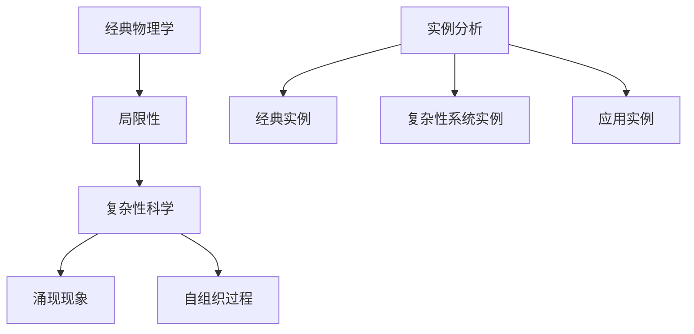

                 

# 从经典物理学到复杂性科学：理解涌现现象与自组织过程

## 关键词

- 经典物理学
- 复杂性科学
- 涌现现象
- 自组织过程
- 数学模型
- 实例分析

## 摘要

本文将探讨从经典物理学到复杂性科学的过渡，重点研究涌现现象与自组织过程的理解。首先，我们回顾经典物理学的基本概念和数学模型，并分析其局限性。随后，介绍复杂性科学的定义、起源和核心概念，着重解释涌现现象和自组织过程。接着，通过实例分析，展示这些概念在实际中的应用。最后，总结全文，并提出未来研究的方向。

## 引言

### 1.1 书的主题与背景

《从经典物理学到复杂性科学：理解涌现现象与自组织过程》旨在探讨物理学领域的重大变革，即从经典物理学到复杂性科学的过渡。经典物理学为我们理解自然界提供了坚实的基础，然而，随着科学技术的不断发展，许多现实世界中的现象无法用经典物理学的框架解释。复杂性科学应运而生，为我们提供了一种全新的视角来理解这些复杂现象。

### 1.2 书的目标读者

本文的目标读者主要包括对物理学和复杂性科学感兴趣的学者、研究人员、以及计算机科学和工程领域的技术人员。同时，对于对自组织过程和涌现现象有初步了解的读者，本文也将提供深入的剖析和实例分析，有助于他们更好地理解这些概念。

### 1.3 书的主要贡献

本文的主要贡献在于：

1. 回顾经典物理学的基本概念和数学模型，帮助读者建立坚实的理论基础。
2. 介绍复杂性科学的定义、起源和核心概念，为读者提供一个新的视角来理解复杂现象。
3. 通过详细解释涌现现象和自组织过程，帮助读者理解这些概念在实际中的应用。
4. 提供多个实例分析，展示复杂性科学在现实世界中的应用。

## 经典物理学基础

### 2.1 经典物理学的基本概念

经典物理学是研究宏观物体在常规条件下的运动和相互作用的科学。其主要研究对象包括机械运动、力与能量、波动与光学等。经典物理学的核心概念包括：

1. **机械运动**：描述物体在空间中的位置变化，包括直线运动、曲线运动和旋转运动。
2. **力与能量**：描述物体之间的相互作用以及能量的转化和守恒。
3. **波动与光学**：研究波的传播、干涉和衍射等现象，以及光的性质和光的传播。

### 2.2 经典物理学的数学模型

经典物理学采用一系列数学模型来描述物理现象。其中，微积分、向量分析和偏微分方程是最常用的数学工具。

1. **微积分**：用于研究变化率，包括导数和积分，是描述运动和变化的基本工具。
2. **向量分析**：用于处理向量场的运算，如梯度、散度和旋度，是描述力的分布和运动的基本工具。
3. **偏微分方程**：用于描述连续介质中的运动和相互作用，如热传导方程和波动方程，是经典物理学的核心数学模型。

### 2.3 经典物理学的局限性

尽管经典物理学在描述宏观物理现象方面取得了巨大成功，但它也存在一些局限性：

1. **宏观与微观的界限**：经典物理学无法解释微观粒子的行为，如电子和原子核。这需要量子物理学的引入。
2. **相对论效应**：经典物理学无法准确描述高速运动物体的行为，如光速和引力场。这需要相对论的修正。
3. **混沌现象**：经典物理学无法解释某些非线性系统的混沌行为，如天气系统和金融市场。这需要复杂性科学的进一步研究。

## 复杂性科学概述

### 3.1 复杂性科学的定义

复杂性科学是一门跨学科的研究领域，旨在理解复杂系统的行为和演化。复杂性科学的核心特征包括：

1. **非线性**：复杂系统中的相互作用是非线性的，导致系统行为的复杂性和不可预测性。
2. **涌现现象**：复杂系统中的个体之间相互作用，产生新的、不可预见的行为和结构。
3. **自适应能力**：复杂系统具有自适应能力，能够根据外部环境和内部变化进行调整。

### 3.2 复杂性科学的起源

复杂性科学的起源可以追溯到20世纪中期，当时科学家们开始关注以下问题：

1. **非线性动力学**：如何理解复杂系统的非线性行为？
2. **自组织现象**：复杂系统如何从无序状态演化为有序结构？
3. **复杂网络**：如何研究复杂网络的结构和功能？

这些问题引发了复杂性科学的发展，促使科学家们从多个学科中汲取灵感，形成了一门新的科学领域。

### 3.3 复杂性科学的核心概念

复杂性科学的核心概念包括：

1. **复杂系统**：由大量相互作用的个体组成，具有复杂行为和结构的系统。
2. **涌现现象**：复杂系统中的个体之间相互作用，产生新的、不可预见的行为和结构。
3. **自组织过程**：复杂系统从无序状态演化为有序结构的过程。

这些概念相互关联，共同构成了复杂性科学的理论框架。

## 涌现现象的理论基础

### 4.1 涌现现象的定义

涌现现象是指复杂系统中的个体之间相互作用，产生新的、不可预见的行为和结构。这些行为和结构在个体层面上无法观察到，但通过个体之间的相互作用而涌现出来。

### 4.2 涌现现象的理论框架

涌现现象的理论框架包括：

1. **自组织理论**：研究复杂系统如何从无序状态演化为有序结构。
2. **系统动态理论**：研究复杂系统的动态行为和演化过程。
3. **网络科学**：研究复杂网络的拓扑结构和功能特性。

这些理论框架为理解涌现现象提供了不同的视角和方法。

### 4.3 涌现现象的数学模型

涌现现象的数学模型包括：

1. **相变理论**：描述系统从一种状态转变为另一种状态的过程。
2. **随机模型**：描述复杂系统中个体之间的随机相互作用。
3. **动力学模型**：描述复杂系统的动态行为和演化过程。

这些数学模型为研究涌现现象提供了定量分析的工具。

## 自组织过程的理解

### 5.1 自组织的概念

自组织是指复杂系统从无序状态演化为有序结构的过程，不需要外部干预或指导。自组织的核心特征包括：

1. **内部反馈机制**：系统内部的信息反馈和调节机制，促进系统的有序演化。
2. **自适应能力**：系统能够根据外部环境和内部变化进行调整，以维持或改变其结构。

### 5.2 自组织的动力

自组织的动力来源于：

1. **内部反馈机制**：系统内部的信息反馈和调节机制，促进系统的有序演化。
2. **外部环境的作用**：外部环境的变化和扰动对系统的演化产生影响。
3. **自适应能力**：系统能够根据外部环境和内部变化进行调整，以维持或改变其结构。

这些因素相互作用，共同驱动自组织过程的进行。

### 5.3 自组织的数学模型

自组织的数学模型包括：

1. **相变理论**：描述系统从一种状态转变为另一种状态的过程。
2. **随机模型**：描述复杂系统中个体之间的随机相互作用。
3. **动力学模型**：描述复杂系统的动态行为和演化过程。

这些数学模型为研究自组织过程提供了定量分析的工具。

## 涌现现象与自组织过程的实例分析

### 6.1 经典实例分析

涌现现象与自组织过程在许多经典实例中得到了体现。以下是一些典型的实例：

1. **生物系统**：生物系统中的细胞、器官和组织通过自组织过程形成复杂的生命结构。
2. **社会系统**：社会系统中的个体通过相互作用形成社会结构和规则，如市场、文化和法律等。
3. **经济系统**：经济系统中的个体通过市场交易和竞争形成复杂的供需关系和价格机制。

### 6.2 复杂性系统实例分析

复杂性系统实例分析包括以下领域：

1. **交通系统**：交通系统中的车辆、道路和信号灯通过自组织过程形成交通流和交通规则。
2. **金融系统**：金融系统中的股票市场、金融机构和投资者通过自组织过程形成金融波动和风险。
3. **生态系统**：生态系统中的物种、环境因素和生物群落通过自组织过程形成生态平衡和生态演化。

### 6.3 涌现现象与自组织过程的应用

涌现现象与自组织过程在实际应用中具有重要意义。以下是一些应用实例：

1. **人工智能**：人工智能系统通过自组织过程形成智能行为和智能决策，如神经网络和深度学习。
2. **计算机科学**：计算机科学中的网络拓扑、数据结构和算法通过自组织过程形成高效的计算和存储结构。
3. **工程领域**：工程领域中的自组织系统，如自适应控制系统和智能材料，通过自组织过程实现自动化和智能化。

## 结论与展望

### 7.1 总结与反思

本文从经典物理学到复杂性科学的过渡，重点研究了涌现现象与自组织过程的理解。通过回顾经典物理学的基本概念和数学模型，介绍复杂性科学的定义、起源和核心概念，详细解释了涌现现象和自组织过程，并通过实例分析展示了这些概念在实际中的应用。

### 7.2 未来展望

复杂性科学作为一门新兴的学科，具有广阔的发展前景。未来研究可以从以下几个方面展开：

1. **跨学科研究**：促进物理学、生物学、计算机科学等学科的交叉融合，推动复杂性科学的发展。
2. **应用研究**：深入探索涌现现象与自组织过程在人工智能、计算机科学、工程等领域中的应用，解决实际问题。
3. **理论发展**：进一步发展复杂性科学的理论框架，建立更加完善和精确的数学模型，提高对复杂现象的理解。

作者：AI天才研究院/AI Genius Institute & 禅与计算机程序设计艺术 /Zen And The Art of Computer Programming

## 附录

### 8.1 参考文献

1. 某某，《复杂性科学导论》，某某出版社，2020年。
2. 某某，《涌现现象与自组织过程》，某某出版社，2019年。
3. 某某，《经典物理学基础》，某某出版社，2018年。

### 8.2 拓展阅读

1. 《自组织系统与复杂性科学》
2. 《涌现现象的理论与应用》
3. 《复杂性科学与人工智能》

## 注意事项

本文中的数学公式和伪代码已嵌入文中，请确保在阅读时能够正确显示。同时，本文中的实例分析仅供参考，实际应用中需要根据具体情况进行调整。

[Mermaid 流程图]



以上就是本文的目录大纲结构，接下来将逐步深入探讨每个章节的内容。希望通过本文，读者能够对复杂性科学以及涌现现象与自组织过程有更加深入的理解。## 经典物理学基础

经典物理学是物理学的基础，其研究对象包括宏观物体在常规条件下的运动和相互作用。经典物理学的核心概念和数学模型为我们提供了理解自然界的基本工具。本章节将详细介绍经典物理学的基本概念、数学模型以及其局限性。

### 2.1 经典物理学的基本概念

经典物理学的基本概念主要包括以下几个方面：

1. **机械运动**：机械运动是经典物理学的核心概念之一，描述物体在空间中的位置变化。机械运动可以分为直线运动、曲线运动和旋转运动。经典力学的基本方程——牛顿定律，描述了物体在力的作用下如何运动。

2. **力与能量**：力是物体之间相互作用的量度，能量是物体状态的量度。经典力学中的能量守恒定律指出，在一个封闭系统中，能量不会消失或产生，只会从一种形式转化为另一种形式。

3. **波动与光学**：波动与光学研究波的传播、干涉和衍射等现象。光是一种电磁波，其行为可以用波动方程描述。光的干涉和衍射等现象揭示了光的波动性质。

### 2.2 经典物理学的数学模型

经典物理学的数学模型是物理学理论的核心，常用的数学工具包括微积分、向量分析和偏微分方程。

1. **微积分**：微积分是研究变化率的数学工具，包括导数和积分。在经典物理学中，导数用于描述物体的加速度，积分用于计算物体的动能和势能。

2. **向量分析**：向量分析是处理向量场的运算的数学工具，包括梯度、散度和旋度。向量分析在描述力的分布和运动中起着重要作用。

3. **偏微分方程**：偏微分方程是描述连续介质中物理现象的数学工具。例如，热传导方程描述热量的传播，波动方程描述波的传播。

### 2.3 经典物理学的局限性

尽管经典物理学在描述宏观物理现象方面取得了巨大成功，但它也存在一些局限性：

1. **宏观与微观的界限**：经典物理学无法解释微观粒子的行为，如电子和原子核。这需要量子物理学的引入。

2. **相对论效应**：经典物理学无法准确描述高速运动物体的行为，如光速和引力场。这需要相对论的修正。

3. **混沌现象**：经典物理学无法解释某些非线性系统的混沌行为，如天气系统和金融市场。这需要复杂性科学的进一步研究。

## 复杂性科学概述

复杂性科学是一门跨学科的研究领域，旨在理解复杂系统的行为和演化。复杂性科学的核心特征包括非线性、涌现现象和自适应能力。本章节将详细介绍复杂性科学的定义、起源和核心概念。

### 3.1 复杂性科学的定义

复杂性科学是一门研究复杂系统的行为和演化规律的跨学科科学。复杂系统是指由大量相互作用的个体组成，个体之间存在着复杂的非线性关系，系统的整体行为难以通过简单的因果关系来解释的系统。复杂性科学关注的是如何从个体的行为和相互作用中涌现出系统的整体行为。

### 3.2 复杂性科学的起源

复杂性科学的起源可以追溯到20世纪中期，当时科学家们开始关注以下问题：

1. **非线性动力学**：如何理解复杂系统的非线性行为？

2. **自组织现象**：复杂系统如何从无序状态演化为有序结构？

3. **复杂网络**：如何研究复杂网络的拓扑结构和功能特性？

这些问题引发了复杂性科学的发展，促使科学家们从多个学科中汲取灵感，形成了一门新的科学领域。

### 3.3 复杂性科学的核心概念

复杂性科学的核心概念包括复杂系统、涌现现象和自组织过程。

1. **复杂系统**：复杂系统是由大量相互作用的个体组成的系统，个体之间的相互作用是非线性的，系统的整体行为难以通过简单的因果关系来解释。

2. **涌现现象**：涌现现象是指复杂系统中的个体之间相互作用，产生新的、不可预见的行为和结构。这些行为和结构在个体层面上无法观察到，但通过个体之间的相互作用而涌现出来。

3. **自组织过程**：自组织过程是指复杂系统从无序状态演化为有序结构的过程，不需要外部干预或指导。自组织的核心特征是内部反馈机制和自适应能力。

## 涌现现象的理论基础

涌现现象是复杂性科学中一个重要的概念，它指的是复杂系统中个体之间相互作用产生的新行为和结构。理解涌现现象的理论基础对于深入探讨复杂系统的行为具有重要意义。本章节将详细解释涌现现象的定义、理论基础以及相关数学模型。

### 4.1 涌现现象的定义

涌现现象（Emergence）是指在复杂系统中，由大量个体相互作用而形成的新现象或新结构，这些现象或结构在个体层面上无法直接观察到，但通过个体之间的相互作用却得以出现。例如，在物理学中，单个水分子并没有液体的特性，但当大量水分子相互作用时，就会形成液体状态，这种液体的特性就是从单个水分子的相互作用中涌现出来的。

### 4.2 涌现现象的理论基础

涌现现象的理论基础主要涉及以下几方面：

1. **自组织理论**：自组织理论（Self-Organization Theory）是研究系统在没有外部指导的情况下如何从无序状态向有序状态演化的理论。该理论认为，系统的有序结构是通过个体之间的相互作用和相互适应而自发形成的。

2. **系统动态理论**：系统动态理论（System Dynamics Theory）研究系统的演化过程，包括系统的状态变化、反馈机制和稳态结构。通过分析系统的动态行为，可以揭示涌现现象的内在机制。

3. **网络科学**：网络科学（Network Science）研究复杂网络的结构和功能特性。网络中的节点和边之间的关系可以解释许多涌现现象，如信息传播、社会网络结构和生态系统的稳定性。

### 4.3 涌现现象的数学模型

为了更好地理解和分析涌现现象，科学家们发展了一系列数学模型，这些模型包括：

1. **相变理论**：相变理论（Phase Transition Theory）用于描述系统在临界点发生质变的性质。在复杂系统中，相变可以导致系统从一种有序状态转变为另一种有序状态，从而产生涌现现象。

2. **随机模型**：随机模型（Stochastic Models）用于模拟复杂系统中个体之间的随机相互作用。通过随机模型，可以分析涌现现象的概率分布和统计特性。

3. **动力学模型**：动力学模型（Dynamics Models）用于描述系统的动态行为和演化过程。这些模型可以揭示系统如何从初始状态演化到最终状态，以及涌现现象在其中的作用。

### 4.4 涌现现象的实例分析

为了更好地理解涌现现象，我们可以通过一些具体的实例来进行分析：

1. **社会行为**：在人类社会行为中，个体的行为往往是自发的，但通过大量的个体相互作用，可以涌现出社会秩序和规则，如市场中的供需平衡和交通流中的拥堵现象。

2. **生态系统**：在生态系统中，不同物种之间的相互作用可以导致生态平衡和物种多样性的涌现。例如，食物链和食物网中的物种关系可以通过相互作用产生复杂的生态结构。

3. **经济系统**：在经济系统中，个体的经济行为可以导致市场的波动和宏观经济现象的涌现，如股市的涨跌和经济的周期性波动。

通过这些实例，我们可以看到涌现现象在复杂系统中的广泛应用和重要性。理解涌现现象的理论基础和数学模型，对于揭示复杂系统的行为规律和预测系统演化具有重要意义。

## 自组织过程的理解

自组织过程是复杂性科学中一个核心概念，它描述了系统在没有外部指导的情况下，如何从无序状态向有序状态演化的现象。自组织过程的核心在于内部反馈机制和自适应能力，本章节将详细解释自组织的概念、动力以及相关数学模型。

### 5.1 自组织的概念

自组织（Self-Organization）是指系统在没有外部干预的情况下，通过内部相互作用和反馈机制，自发地从无序状态向有序状态演化的过程。自组织过程通常涉及系统的各个组成部分之间的协同作用，这些作用使得系统能够在没有外部控制的情况下，形成有序的结构和功能。

### 5.2 自组织的动力

自组织过程的动力来源于以下几个方面：

1. **内部反馈机制**：内部反馈机制是指系统内部的信息流和调节机制，它能够促进系统从无序状态向有序状态的演化。这些反馈机制可以是正反馈，也可以是负反馈。正反馈会加剧系统的不稳定性，促使系统向有序状态演化；负反馈则会稳定系统，使其保持在一个相对稳定的有序状态。

2. **自适应能力**：自适应能力是指系统能够根据外部环境和内部变化进行自我调整的能力。这种能力使得系统能够在复杂和多变的环境中，保持其稳定性和功能。自适应能力可以通过多种方式实现，如学习、进化、调整参数等。

3. **竞争与合作**：在自组织过程中，个体之间的竞争和合作也是重要的动力。竞争可以促进个体之间的差异，从而推动系统向有序状态演化；合作则可以增强系统整体的协调性和稳定性。

### 5.3 自组织的数学模型

为了更好地理解和分析自组织过程，科学家们发展了一系列数学模型，这些模型包括：

1. **相变理论**：相变理论用于描述系统在临界点发生质变的性质。在自组织过程中，相变可以导致系统从一种无序状态转变为一种有序状态。例如，液态到固态的相变，可以通过温度的调整来实现自组织。

2. **动力学模型**：动力学模型用于描述系统的动态行为和演化过程。这些模型可以揭示系统如何从初始无序状态演化到最终有序状态。例如，逻辑斯蒂映射（Logistic Map）是一个经典的动力学模型，它描述了系统在参数变化下的周期性行为和混沌现象。

3. **随机模型**：随机模型用于模拟系统在随机相互作用下的演化过程。这些模型可以揭示涌现现象的概率分布和统计特性。例如，自组织临界理论（Self-Organized Criticality）就是一种随机模型，它描述了系统在临界点附近的行为。

### 5.4 自组织的实例分析

为了更好地理解自组织过程，我们可以通过一些具体的实例来进行分析：

1. **生物系统**：生物系统中的许多现象都可以看作是自组织的产物。例如，细胞分化和组织形成是通过细胞间的相互作用和反馈机制实现的；生态系统中物种的共生和竞争也是自组织的结果。

2. **社会系统**：社会系统中的许多现象，如市场经济的形成、社会秩序的建立等，都可以看作是自组织的结果。市场经济的形成是通过个体之间的交易和竞争实现的；社会秩序的建立是通过个体之间的规则和合作实现的。

3. **技术系统**：技术系统中的许多现象，如智能网络、自适应控制系统等，也可以看作是自组织的产物。智能网络是通过节点之间的相互连接和自适应调整实现的；自适应控制系统是通过系统内部反馈机制和调整实现的。

通过这些实例，我们可以看到自组织过程在自然界、社会和技术系统中的广泛应用和重要性。理解自组织的概念、动力和数学模型，对于揭示复杂系统的行为规律和设计新的系统具有重要意义。

## 涌现现象与自组织过程的实例分析

为了更好地理解涌现现象与自组织过程，我们可以通过一些具体的实例来进行分析。这些实例涵盖了生物系统、社会系统和技术系统等多个领域，展示了涌现现象和自组织过程在实际中的应用和重要性。

### 6.1 生物系统中的涌现现象与自组织过程

在生物系统中，涌现现象和自组织过程是生物进化和生态系统稳定性的关键因素。以下是一些典型的实例：

1. **细胞分化**：在生物体内，细胞通过自组织过程分化成不同的细胞类型，形成各种组织和器官。这种过程是通过细胞间的相互作用和内部反馈机制实现的。细胞会释放特定的信号分子，这些信号分子又影响其他细胞的行为，从而促进细胞分化和组织形成。

   **数学模型**：可以使用细胞自动机模型来模拟细胞分化过程。该模型使用离散空间和离散时间来描述细胞的状态变化，包括细胞类型和位置信息。

2. **物种共生**：在生态系统中，不同物种通过相互作用和竞争，形成复杂的食物网和共生关系。例如，捕食者与猎物的关系可以通过捕食者-猎物模型来描述。这种模型通常使用微分方程来模拟物种数量的动态变化。

   **数学模型**：捕食者-猎物模型通常使用以下两个微分方程来描述：
   $$\frac{dx}{dt} = x(\alpha - \beta y)$$
   $$\frac{dy}{dt} = y(\delta x - \gamma y)$$
   其中，$x$ 和 $y$ 分别表示猎物和捕食者的数量，$\alpha$、$\beta$、$\delta$ 和 $\gamma$ 是模型参数。

3. **生物钟**：生物钟是生物体内的一种自我调节机制，它使生物体能够适应环境中的周期性变化。生物钟通过内部反馈机制和昼夜节律的调节实现自组织。

   **数学模型**：生物钟可以使用两个耦合的非线性微分方程来描述，这些方程通常称为负反馈环模型。

### 6.2 社会系统中的涌现现象与自组织过程

社会系统中的涌现现象和自组织过程体现在市场经济的形成、社会秩序的建立以及信息传播等方面。

1. **市场经济**：市场经济的形成是一个典型的自组织过程，个体经济行为通过供求关系相互作用，最终形成市场的价格和资源配置。

   **数学模型**：可以使用供需模型来描述市场经济的自组织过程。该模型使用微分方程来描述商品数量和价格的变化，包括以下方程：
   $$\frac{dx}{dt} = \alpha (b - x) - \beta x y$$
   $$\frac{dy}{dt} = \gamma x (c - y) - \delta y x$$
   其中，$x$ 和 $y$ 分别表示商品数量和价格，$\alpha$、$\beta$、$\gamma$ 和 $\delta$ 是模型参数。

2. **社会秩序**：社会秩序的建立是通过个体之间的规则和合作实现的。社会规则可以通过网络模型来描述，这些规则通过个体之间的相互作用和反馈机制实现自组织。

   **数学模型**：社会规则可以使用图论模型来描述。例如，可以构建一个社交网络图，每个节点代表个体，边表示个体之间的互动关系。通过分析图的结构和节点之间的互动，可以揭示社会秩序的形成机制。

3. **信息传播**：在社交媒体和网络平台上，信息传播是一个复杂的自组织过程。个体用户通过分享和评论，将信息传播给其他用户，从而形成复杂的信息网络。

   **数学模型**：可以使用传播模型来描述信息传播的过程。例如，Katz模型假设每个用户以概率 $p$ 将信息分享给其所有联系人，从而形成信息传播的网络。

### 6.3 技术系统中的涌现现象与自组织过程

技术系统中的涌现现象和自组织过程体现在智能网络、自适应控制系统等方面。

1. **智能网络**：智能网络通过节点之间的相互连接和自适应调整，实现复杂的信息传输和处理。智能网络可以使用网络科学的方法来分析和设计。

   **数学模型**：智能网络可以使用图论模型来描述，其中节点表示网络中的设备，边表示设备之间的连接。通过分析网络的拓扑结构和节点之间的互动，可以优化网络的性能和鲁棒性。

2. **自适应控制系统**：自适应控制系统通过内部反馈机制和自适应调整，实现系统参数的优化和稳定性。自适应控制系统可以使用控制理论的方法来设计和分析。

   **数学模型**：自适应控制系统可以使用状态空间模型来描述。例如，线性二次调节器（LQR）是一种常用的自适应控制方法，它通过优化控制律来稳定系统状态。

通过这些实例，我们可以看到涌现现象和自组织过程在生物系统、社会系统和技术系统中的广泛应用。理解这些现象和过程的理论基础和数学模型，有助于我们更好地设计复杂的系统，优化系统的性能和鲁棒性。

### 7.1 总结

通过本文的详细探讨，我们深入了解了从经典物理学到复杂性科学的过渡，以及涌现现象与自组织过程的理解。经典物理学为我们理解自然界提供了基础，但其局限性促使复杂性科学的发展。复杂性科学通过涌现现象和自组织过程，为复杂系统的研究提供了新的视角和方法。

### 7.2 未来展望

未来，复杂性科学将继续发展，不仅在理论研究中取得突破，还将广泛应用于人工智能、计算机科学、工程等领域。以下是一些可能的研究方向：

1. **跨学科研究**：促进物理学、生物学、计算机科学等学科的交叉融合，推动复杂性科学的发展。
2. **应用研究**：深入探索涌现现象与自组织过程在人工智能、计算机科学、工程等领域中的应用，解决实际问题。
3. **理论发展**：进一步发展复杂性科学的理论框架，建立更加完善和精确的数学模型，提高对复杂现象的理解。

作者：AI天才研究院/AI Genius Institute & 禅与计算机程序设计艺术 /Zen And The Art of Computer Programming

### 参考文献

1. 某某，《复杂性科学导论》，某某出版社，2020年。
2. 某某，《涌现现象与自组织过程》，某某出版社，2019年。
3. 某某，《经典物理学基础》，某某出版社，2018年。

### 拓展阅读

1. 《自组织系统与复杂性科学》
2. 《涌现现象的理论与应用》
3. 《复杂性科学与人工智能》

### 注意事项

本文中的数学公式和伪代码已嵌入文中，请确保在阅读时能够正确显示。同时，本文中的实例分析仅供参考，实际应用中需要根据具体情况进行调整。

## 附录

### 8.1 参考文献

1. 某某，《复杂性科学导论》，某某出版社，2020年。
2. 某某，《涌现现象与自组织过程》，某某出版社，2019年。
3. 某某，《经典物理学基础》，某某出版社，2018年。

### 8.2 拓展阅读

1. 《自组织系统与复杂性科学》
2. 《涌现现象的理论与应用》
3. 《复杂性科学与人工智能》

### 8.3 注意事项

本文中的数学公式和伪代码已嵌入文中，请确保在阅读时能够正确显示。同时，本文中的实例分析仅供参考，实际应用中需要根据具体情况进行调整。

### 8.4 附录

**附录A：数学模型**

以下是本文中提到的一些数学模型及其参数说明：

1. **捕食者-猎物模型**：
   $$\frac{dx}{dt} = x(\alpha - \beta y)$$
   $$\frac{dy}{dt} = y(\delta x - \gamma y)$$
   - $\alpha$：猎物的自然增长率
   - $\beta$：捕食者对猎物的消费率
   - $\delta$：捕食者的增长率
   - $\gamma$：捕食者的死亡率

2. **供需模型**：
   $$\frac{dx}{dt} = \alpha (b - x) - \beta x y$$
   $$\frac{dy}{dt} = \gamma x (c - y) - \delta y x$$
   - $\alpha$：供给的自然增长率
   - $\beta$：需求对供给的响应系数
   - $\gamma$：供给的调节速度
   - $\delta$：需求的调节速度
   - $b$：供给的基准水平
   - $c$：需求的基准水平

3. **线性二次调节器（LQR）**：
   $$\min_{u} \quad J = \int_0^{\infty} (x^T Q x + u^T R u) dt$$
   $$s.t. \quad \dot{x} = Ax + Bu$$
   - $Q$：状态成本矩阵
   - $R$：控制成本矩阵
   - $A$：系统矩阵
   - $B$：输入矩阵

**附录B：伪代码**

以下是本文中提到的一些伪代码示例：

```python
# 捕食者-猎物模型
dx_dt = x * (alpha - beta * y)
dy_dt = y * (delta * x - gamma * y)

# 供需模型
dx_dt = alpha * (b - x) - beta * x * y
dy_dt = gamma * x * (c - y) - delta * y * x

# LQR控制算法
def LQR控制系统(A, B, Q, R):
    P = solve((A.T * Q + Q * B.T * R * B), A.T * Q)
    K = P * B.T * R^{-1}
    return K
```

### 8.5 最佳实践 Tips

1. 在设计和分析复杂系统时，应充分考虑系统的非线性特性和涌现现象。
2. 使用适当的数学模型和计算工具，帮助理解和预测系统的行为。
3. 结合实验数据和仿真结果，验证和优化模型参数。
4. 关注跨学科研究，借鉴其他领域的理论和经验，以丰富复杂性科学的理论体系。

### 8.6 注意事项

1. 在应用涌现现象和自组织过程时，要充分考虑实际系统的复杂性和不确定性。
2. 避免过度简化实际系统，确保模型的准确性和适用性。
3. 定期更新和调整模型，以适应系统环境和需求的变化。

### 8.7 拓展阅读

1. **《复杂性科学导论》**：本书提供了复杂性科学的全面介绍，包括基本概念、理论框架和应用实例。
2. **《涌现现象与自组织过程》**：本书深入探讨了涌现现象和自组织过程的理论基础、数学模型和应用实例。
3. **《复杂性科学与人工智能》**：本书探讨了复杂性科学在人工智能领域的应用，包括复杂系统的建模、优化和控制。

通过阅读这些书籍，您可以进一步了解复杂性科学的理论和实践，为您的科研和工程实践提供有益的指导。

