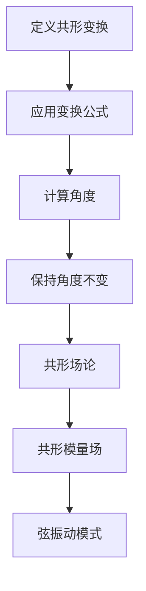

                 

### 文章标题

从经典物理学到弦论：探索物质本质与宇宙构造的统一理论

### 关键词

经典物理学、量子力学、相对论、弦论、超引力、宇宙学、物质本质、统一理论

### 摘要

本文将带领读者踏上一段从经典物理学到弦论的探索之旅。我们首先回顾经典物理学的基础，了解经典力学、经典电磁学和热力学的核心原理。接着，我们将深入量子力学和相对论，揭示微观世界和宇宙时空的奇异特性。随后，文章将介绍弦论与超引力，探讨这一统一理论如何尝试解释物质和宇宙的本质。最后，我们将探讨弦论的实验验证和未来展望，总结全文并给出拓展阅读的建议。通过本文，读者将全面了解物理学发展的历程及其对现实世界的深远影响。

#### 第一部分：经典物理学的基石

经典物理学是物理学发展历程中的重要阶段，为后来的量子力学和相对论奠定了基础。在这一部分，我们将详细探讨经典物理学的核心概念和原理，包括经典力学、经典电磁学和热力学。

### 第1章：经典力学的起源与基础

经典力学，以牛顿运动定律为基础，描述了宏观物体在力的作用下的运动规律。牛顿运动定律包括以下三个定律：

1. **牛顿第一定律（惯性定律）**：任何物体都将保持其静止状态或匀速直线运动状态，除非受到外力的作用。
   
2. **牛顿第二定律（动量定律）**：物体所受的外力等于其质量与加速度的乘积，即 \( F = ma \)。

3. **牛顿第三定律（作用与反作用定律）**：任何作用力都有一个大小相等、方向相反的反作用力。

这些定律构成了经典力学的核心，为描述和预测物体的运动提供了强有力的工具。

#### 第2章：经典电磁学

经典电磁学主要研究电荷和电流以及它们产生的电场和磁场。以下是经典电磁学的核心原理：

1. **电荷与电场**：
   - **库仑定律**：两个点电荷之间的静电力与它们的电荷量的乘积成正比，与它们之间距离的平方成反比。
   - **电场强度**：电场是描述电荷在空间中的影响的一个矢量场，其大小和方向由电荷分布决定。

2. **磁场与电流**：
   - **洛伦兹力**：带电粒子在电磁场中受到的力，由电场力和磁场力组成。
   - **安培定律**：电流产生的磁场强度与电流的大小和方向有关，磁场的方向可以通过右手螺旋法则确定。

3. **电磁波的传播**：
   - **电磁波的波动方程**：描述电磁波在空间中传播的数学方程，包括麦克斯韦方程组。
   - **光的电磁理论**：光被视为电磁波的一种，其频率和波长与能量和动量相关。

#### 第3章：热力学与统计物理

热力学研究能量转化和物质状态变化的基本规律，而统计物理则从微观角度描述大量粒子的宏观行为。以下是热力学和统计物理的核心概念：

1. **热力学第一定律**：
   - **内能**：系统内所有粒子动能和势能的总和。
   - **热力学过程**：能量在不同形式之间的转化，包括等压过程、等体过程和等温过程。

2. **熵与热力学第二定律**：
   - **熵**：系统无序程度的度量，与热力学过程的方向和效率有关。
   - **熵增原理**：在一个封闭系统中，熵总是趋向于增加，表明自然过程具有方向性。

3. **统计物理基础**：
   - **经典统计分布**：描述大量粒子在宏观物理现象中的行为，包括玻尔兹曼分布和高斯分布。
   - **气体动理论**：描述气体分子在空间中的运动和相互作用，用于推导气体的宏观性质，如压强和温度。

通过以上章节，我们将深入理解经典物理学的核心原理，为后续对量子力学和相对论的探讨打下坚实基础。

#### 第4章：量子力学的诞生

量子力学的诞生标志着物理学进入了一个全新的时代，它挑战了经典物理学的许多基本观念，揭示了微观世界的奇异性质。在这一章中，我们将探讨量子力学的起源、核心原理以及与经典物理学的区别。

### 4.1 波粒二象性

波粒二象性是量子力学中最基本的原理之一，它揭示了微观粒子既具有波动性又具有粒子性。这一概念最早由德布罗意提出，并通过一系列实验得到证实。

- **德布罗意假设**：任何物质粒子都具有波动性，其波长与动量成反比，即 \( \lambda = \frac{h}{p} \)，其中 \( h \) 是普朗克常数，\( p \) 是粒子的动量。
- **康普顿效应**：光子与电子发生碰撞时，光子的波长发生变化，这一现象验证了光的粒子性。

### 4.2 玻尔原子模型

玻尔原子模型是量子力学发展的一个重要里程碑，它成功解释了氢原子的光谱线。玻尔模型基于以下核心假设：

- **量子轨道**：电子在原子核周围的轨道是量子化的，只能存在于特定的能级上。
- **能级跃迁**：电子在不同能级之间跃迁时，会吸收或释放特定频率的光子，光子的频率与能级差成正比。

### 4.3 狭义相对论

狭义相对论由爱因斯坦在1905年提出，它革命性地改变了我们对时间、空间和物质的认识。狭义相对论的核心原理包括：

- **惯性系相对性原理**：所有惯性系中的物理定律都是相同的，不存在绝对静止的参考系。
- **光速不变原理**：光在真空中的速度是恒定的，不依赖于光源或观察者的运动状态。

狭义相对论的数学表述包括洛伦兹变换，它描述了不同惯性系之间的坐标和时间变换关系。洛伦兹变换的公式为：

\[ x' = \gamma (x - vt) \]
\[ y' = y \]
\[ z' = z \]
\[ t' = \gamma (t - \frac{vx}{c^2}) \]

其中，\( \gamma = \frac{1}{\sqrt{1 - \frac{v^2}{c^2}}} \)，\( v \) 是观察者与光源之间的相对速度，\( c \) 是光速。

### 4.4 量子力学的基本原理

量子力学在微观尺度上描述了粒子的行为，它引入了新的概念和数学工具。以下是量子力学的一些核心原理：

- **海森堡不确定性原理**：无法同时精确测量粒子的位置和动量，它们的测量精度存在固有的限制，数学表述为 \( \Delta x \Delta p \geq \frac{h}{4\pi} \)，其中 \( \Delta x \) 和 \( \Delta p \) 分别表示位置和动量的不确定度，\( h \) 是普朗克常数。
- **波函数和薛定谔方程**：波函数是描述量子系统状态的数学函数，薛定谔方程是描述波函数随时间演变的方程。薛定谔方程的表述为：

\[ i\hbar \frac{\partial \Psi}{\partial t} = \hat{H} \Psi \]

其中，\( i \) 是虚数单位，\( \hbar \) 是约化普朗克常数，\( \hat{H} \) 是哈密顿算符，\( \Psi \) 是波函数。

- **量子态和测量**：量子系统存在多种可能的态，测量结果由波函数的平方给出。量子态的叠加原理表明，量子系统可以同时处于多种态的叠加状态。

通过以上讨论，我们了解了量子力学的核心原理以及它与经典物理学的区别。量子力学的诞生不仅揭示了微观世界的奇妙性质，也为后续的发展提供了新的理论基础。

### 第5章：量子力学的基本原理

量子力学在微观尺度上描述了粒子的行为，其核心原理包括海森堡不确定性原理、波函数和薛定谔方程等。这些原理不仅挑战了经典物理学的观念，还揭示了微观世界的奇异特性。在本章中，我们将详细探讨这些量子力学的基本原理。

#### 5.1 海森堡不确定性原理

海森堡不确定性原理是量子力学的一个基本原理，它由维尔纳·海森堡在1927年提出。该原理表明，在量子尺度上，某些对偶物理量（例如位置和动量）不能同时被精确测量。不确定性原理可以用数学形式表示为：

\[ \Delta x \Delta p \geq \frac{h}{4\pi} \]

其中，\( \Delta x \) 表示位置的不确定性，\( \Delta p \) 表示动量的不确定性，\( h \) 是普朗克常数。这一原理揭示了量子系统在测量时的固有局限性。

#### 5.2 波函数和薛定谔方程

波函数是量子力学中描述粒子状态的数学函数，通常表示为 \( \Psi(x, t) \)。波函数提供了粒子在空间和时间上的概率分布。薛定谔方程是量子力学的核心方程之一，它描述了波函数随时间的演化。薛定谔方程的标准形式为：

\[ i\hbar \frac{\partial \Psi}{\partial t} = \hat{H} \Psi \]

其中，\( i \) 是虚数单位，\( \hbar \) 是约化普朗克常数，\( \hat{H} \) 是哈密顿算符，\( \Psi \) 是波函数。哈密顿算符描述了系统的总能量，包括动能和势能。

#### 5.3 玄妙的量子纠缠

量子纠缠是量子力学中的一种特殊现象，当两个或多个粒子处于量子纠缠态时，它们之间的状态会瞬间关联，无论它们相隔多远。这一现象违反了经典物理中的局域实在性原理。量子纠缠可以通过以下数学形式描述：

\[ |\psi\rangle = \frac{1}{\sqrt{2}} (|01\rangle - |10\rangle) \]

其中，\( |01\rangle \) 和 \( |10\rangle \) 分别表示两个粒子处于不同的量子态。当一个粒子的状态被测量时，另一个粒子的状态也会立即确定，即使它们相隔很远。

### 5.4 经典力学与量子力学的区别

量子力学与经典力学在多个方面存在显著的区别：

- **测量问题**：在经典力学中，物体的状态是明确的，而在量子力学中，物体的状态以概率分布的形式存在。
- **叠加态**：在量子力学中，粒子可以处于多个状态的叠加，而在经典力学中，粒子只能处于一个状态。
- **非确定性**：量子力学中的物理量，如位置和动量，不能同时被精确测量，这违反了经典力学的确定性。
- **波粒二象性**：量子粒子既具有波动性又具有粒子性，而经典粒子只有粒子性。

通过以上讨论，我们深入了解了量子力学的基本原理，这些原理不仅揭示了微观世界的奇异性质，也为现代科学技术的发展提供了理论基础。

### 第6章：广义相对论

广义相对论由阿尔伯特·爱因斯坦在1915年提出，是物理学史上的一次重大革命。它不仅修正了牛顿引力理论的一些缺陷，还揭示了时空的弯曲和物质的能量-动量对时空的影响。在本章中，我们将探讨广义相对论的基本原理、数学表述及其在宇宙学和黑洞研究中的应用。

#### 6.1 广义相对论的基本原理

广义相对论的核心原理包括：

- **惯性系相对性原理**：在任何惯性参考系中，物理定律的形式都是相同的，不存在任何特殊的惯性参考系。
- **引力等效原理**：局部惯性等效原理的推广，即任何重力效应都可以通过等效的加速度来实现。这意味着重力和加速度在局部范围内是不可区分的。

#### 6.2 广义相对论的基本方程

广义相对论的基本方程是爱因斯坦场方程，它描述了物质分布如何导致时空的弯曲。场方程的数学形式为：

\[ G_{\mu\nu} = 8\pi G T_{\mu\nu} \]

其中，\( G_{\mu\nu} \) 是爱因斯坦张量，表示时空的几何性质；\( T_{\mu\nu} \) 是能量-动量张量，表示物质的分布和运动；\( G \) 是引力常数。

#### 6.3 黑洞与引力波

广义相对论预言了黑洞的存在，并解释了黑洞的性质。黑洞是一种极其密集的天体，其引力场如此强大，以至于连光也无法逃脱。以下是关于黑洞的一些关键概念：

- **事件视界**：黑洞的边界，超过此边界的一切信息都无法逃脱。
- **奇点**：黑洞中心的一个点，密度无限大，时空弯曲达到无限。
- **霍金辐射**：黑洞可以缓慢地蒸发，并最终消失。

广义相对论还预言了引力波的存在。引力波是由质量加速运动产生的时空波动，其传播速度等于光速。2015年，LIGO实验首次探测到了引力波，验证了广义相对论的这一预言。

#### 6.4 宇宙学与时空

广义相对论在宇宙学中的应用揭示了宇宙的膨胀和起源。以下是一些重要的宇宙学概念：

- **宇宙膨胀**：宇宙在膨胀，星系之间的距离随时间增加。
- **宇宙学常数**：描述宇宙膨胀的加速度，通常用符号 \( \Lambda \) 表示。
- **大爆炸理论**：宇宙起源于大约138亿年前的一次大爆炸，之后宇宙不断膨胀。

通过以上讨论，我们了解了广义相对论的基本原理、数学表述及其在黑洞、宇宙学和引力波研究中的应用。广义相对论不仅为解释引力现象提供了强有力的工具，也为探索宇宙的起源和演化提供了新的视角。

### 第7章：弦论的兴起

弦论是一种试图统一所有基本力的理论，它提出基本粒子并非零维点，而是微小的一维“弦”。这一理论不仅在数学上具有高度统一性，还在物理上尝试解释宇宙的构造。在本章中，我们将探讨弦论的基本概念、起源及其核心思想。

#### 7.1 弦论的基本概念

弦论的基本假设是所有物质和力都是由细小的、一维的弦振动产生的。这些弦可以有不同的振动模式，每个模式对应于一个不同的粒子。以下是弦论中的几个关键概念：

- **闭弦与开放弦**：闭弦是绕着时空闭合的，而开放弦有两个端点。
- **D-膜**：在更高维的弦论中，除了弦，还有更高维的膜存在，这些膜可以具有不同的维度，如2-膜、3-膜等。

#### 7.2 Bosonic String Theory

Bosonic String Theory（波辛弦理论）是最早提出的弦论模型，它只包含开口弦，且弦振动的激发态为玻色子（如光子、胶子等）。波辛弦理论的核心思想是：

- **振动模式**：弦的不同振动模式对应于不同的粒子。例如，一阶振动模式对应于光子，二阶振动模式对应于胶子。
- **世界体积**：弦在时空中的运动轨迹，称为世界线或世界体积。波辛弦的世界体积是一个二维膜。

波辛弦理论的数学表述相对简单，其振动模式可以通过波动方程描述。以下是波辛弦理论的振动模式及其对应的量子态：

\[ \Psi_n(x^\mu) = \frac{1}{\sqrt{2\pi}} \int d^2p \, e^{ipx} \left( a_n + \frac{1}{n!} \sum_{k=1}^{n} \frac{a_{n-k} \star a_k}{k!} \right) \]

其中，\( a_n \) 是创建和湮灭算符，用于创建和湮灭不同激发态的粒子。

#### 7.3 Superstring Theory

Superstring Theory（超弦理论）是在波辛弦理论的基础上发展起来的，它引入了超对称性，尝试统一所有基本力和所有粒子。超弦理论的核心思想是：

- **超对称性**：每种基本粒子都有一个超对称伙伴，这些伙伴具有不同的量子数，但在低能极限下无法区分。
- **额外维度**：超弦理论需要额外的空间维度，通常为10维或11维。

超弦理论有两种主要的版本：

- **Type I String Theory**：包含所有类型的弦，但不存在未激发的D-膜。
- **Type II String Theory**：分为Type IIA和Type IIB，分别具有不同的几何性质和物理特性。

超弦理论的数学表述更为复杂，涉及到共形场论和超引力理论。以下是Type IIA弦理论的一个简单数学表述：

\[ \partial X \partial X - g_{\mu\nu} \partial X \partial X + h_{\mu\nu} \partial X \partial X = 0 \]

其中，\( X \) 表示时空坐标，\( g_{\mu\nu} \) 是标量场，\( h_{\mu\nu} \) 是张量场。

通过以上讨论，我们了解了弦论的基本概念、波辛弦理论和超弦理论的核心思想。弦论不仅为理论物理学提供了一个统一的框架，也为探索宇宙的本质提供了新的思路。

### 第8章：弦论的数学基础

弦论的数学基础涉及共形场论、阶段性展开和世界体积等概念。这些数学工具不仅为弦论提供了坚实的理论框架，也帮助我们更好地理解这一理论的核心原理。在本章中，我们将详细探讨弦论的数学基础，并使用Mermaid流程图和伪代码来解释这些概念。

#### 8.1 共形场论

共形场论是研究共形变换下不变量的数学理论，它在弦论中起着核心作用。共形变换是保持角度不变的特殊变换，其数学表达式为：

\[ z' = az + b \]

其中，\( z \) 和 \( z' \) 是复数，\( a \) 和 \( b \) 是实数。共形场论的基本方程是共形模量场的Laplace方程：

\[ \partial_z \partial_{\bar{z}} \phi = 0 \]

其中，\( \phi \) 是共形模量场。共形模量场的物理意义在于描述弦的振动模式。

为了更好地理解共形场论，我们可以使用Mermaid流程图来展示共形变换的步骤：



#### 8.2 阶段性展开与世界体积

阶段性展开是弦论中描述弦振动模式的方法。在阶段性展开中，弦的振动模式被分解为一系列基态和激发态。基态对应于最简单的振动模式，而激发态则表示更复杂的振动模式。阶段性展开的数学表达式为：

\[ \Psi_n(x^\mu) = \sum_{k=0}^{n} C_k a_k(x^\mu) \]

其中，\( \Psi_n(x^\mu) \) 是第 \( n \) 阶的振动模式，\( a_k(x^\mu) \) 是基态，\( C_k \) 是系数。

世界体积是描述弦在时空中的运动轨迹的概念。在阶段性展开中，世界体积可以通过振动模式的叠加来计算。以下是一个简单的伪代码示例，用于计算弦的世界体积：

```python
def calculate_world_volume(vibration_modes):
    volume = 0
    for mode in vibration_modes:
        # 对每个振动模式计算体积贡献
        volume += mode.volume()
    return volume
```

#### 8.3 超引力理论与超对称

超引力理论是弦论的一种版本，它引入了超对称性来统一引力和其他基本力。超对称性是一种对称性关系，它将粒子和其超对称伙伴联系起来。超对称伙伴具有相同的自旋，但不同的量子数。

超引力理论的基本方程是爱因斯坦场方程和超引力耦合方程的组合。以下是一个简单的伪代码示例，用于描述超引力耦合：

```python
def supergravity_c耦合(Tensor_G, Tensor_T):
    # 计算爱因斯坦场方程和超引力耦合方程的结果
    result = Tensor_G - 8 * pi * G * Tensor_T
    return result
```

通过以上数学基础，我们能够更好地理解弦论的核心概念和原理。这些数学工具不仅帮助我们构建弦论的理论框架，也为进一步研究提供了强有力的工具。

### 第9章：弦论的宇宙学意义

弦论的宇宙学意义在于其试图通过统一的框架来描述宇宙的起源和演化。在这一章中，我们将探讨弦论如何解释宇宙的膨胀、宇宙的起源以及弦论与观测数据的关系。

#### 9.1 弦论与宇宙学

弦论为宇宙学提供了新的视角，特别是在解释宇宙膨胀方面。根据弦论，宇宙的膨胀可能是由弦的振动模式引起的。例如，在某些弦论模型中，宇宙的膨胀可以由所谓的“振动弦”来描述，这些弦的振动模式与宇宙的膨胀速度相关。

- **宇宙弦**：在弦论中，宇宙弦是一种高维对象，其振动可以影响宇宙的膨胀。宇宙弦的存在可以解释宇宙中的某些现象，如宇宙微波背景辐射的不均匀性。

- **振动模式**：弦的振动模式决定了宇宙的物理性质。不同的振动模式可以对应于不同的宇宙学现象，如宇宙的加速膨胀或周期性宇宙。

#### 9.2 弦论与宇宙的起源

弦论尝试解释宇宙的起源，特别是大爆炸理论和周期性宇宙的概念。

- **大爆炸理论**：弦论可以与标准模型中的大爆炸理论相结合，解释宇宙的初始状态和演化过程。例如，在某些弦论模型中，宇宙的初始状态可能是一个极端热密的状态，随后经历了一次“弦暴”过程，导致宇宙的快速膨胀。

- **周期性宇宙**：一些弦论模型预言了宇宙可能存在周期性结构，这意味着宇宙不是一次性的，而是循环发生的。这种周期性宇宙的概念可以解释宇宙中的一些观测现象，如宇宙微波背景辐射的温度起伏。

#### 9.3 弦论与观测数据的关系

尽管弦论提供了一种统一的框架来描述宇宙的起源和演化，但它的验证仍然面临挑战。观测数据是验证弦论的关键，以下是一些关键的观测数据：

- **宇宙微波背景辐射**：宇宙微波背景辐射是宇宙早期的残余辐射，其观测数据可以用于验证弦论中的某些预言，如宇宙的均匀性和各向同性。

- **星系分布**：星系的分布和运动可以通过弦论来解释，特别是在解释星系之间的引力和宇宙膨胀方面。

- **引力波**：引力波是由宇宙中的大质量天体产生的时空波动，其观测可以为弦论提供直接的证据。

以下是弦论与观测数据关系的简单伪代码示例：

```python
def compare_observational_data(theory, observations):
    # 对理论预测和观测数据进行比较
    discrepancies = []
    for prediction, observation in zip(theory.predictions, observations):
        if prediction != observation:
            discrepancies.append((prediction, observation))
    return discrepancies
```

通过以上讨论，我们可以看到弦论在宇宙学中的意义，以及它如何与观测数据相互关联。尽管弦论仍需通过更多的实验和观测来验证，但它的理论框架为理解宇宙的本质提供了新的视角。

### 第10章：弦论的实验验证与未来展望

弦论作为一种理论框架，尚未得到直接的实验验证。然而，通过间接的方法和对现有理论的拓展，我们可以探索弦论的实验验证途径及其未来发展方向。

#### 10.1 实验验证的挑战

弦论中的基本单元——弦，其尺度远小于当前实验设备能够探测的最小长度。例如，弦的尺度可能在 \(10^{-33}\) 米量级，而当前的粒子加速器（如大型强子对撞机）的能量和分辨率尚未达到这一水平。因此，直接探测弦的实验验证面临巨大的技术挑战。

#### 10.2 间接验证方法

尽管直接验证弦论存在困难，但通过以下几种间接方法，我们可以探索弦论的可能性：

- **宇宙学观测**：宇宙学提供了丰富的数据，如宇宙微波背景辐射、星系分布和引力波等。这些数据可以用于检验弦论中的某些预言。例如，宇宙微波背景辐射的温度起伏可以与弦论中的振动模式相关联。

- **粒子物理实验**：高能物理实验，如大型强子对撞机（LHC）的实验数据，可以用于寻找弦论中的新物理信号。例如，寻找新的粒子或相互作用，这些信号可能与弦论的额外维度或超对称性相关。

- **量子计算**：量子计算可以用于模拟弦论中的复杂计算，从而提供对弦论的实验预测。例如，通过量子模拟来研究弦论的振动模式及其影响。

#### 10.3 未来展望

弦论的未来发展充满潜力，以下是几个可能的方向：

- **对撞机升级**：未来更高能的粒子加速器，如未来的圆形对撞机（FCC），可能达到足够的能量和分辨率，以直接探测弦的振动模式。

- **天文观测**：随着天文观测技术的进步，我们可能能够发现更多的宇宙学现象，这些现象可以与弦论中的预言相吻合。

- **量子引力研究**：量子引力研究可能会揭示弦论的更深层次，如量子纠缠和黑洞的信息丢失问题。这些研究可能会对弦论的理论框架产生重大影响。

- **多参量模型**：未来的弦论研究可能会探索包含多个参量的模型，这些模型可以更好地解释宇宙的多样性和复杂性。

通过上述讨论，我们可以看到弦论的实验验证和未来展望仍然充满挑战和机遇。尽管弦论尚未得到直接的实验验证，但通过间接方法和未来技术的发展，我们有理由相信弦论将在理解宇宙的本质方面发挥重要作用。

### 小结

本文从经典物理学到弦论，系统性地探讨了物理学发展的历程和核心原理。我们首先回顾了经典物理学的基石，包括经典力学、经典电磁学和热力学。接着，我们深入探讨了量子力学和相对论，揭示了微观世界和宇宙时空的奇异特性。随后，文章介绍了弦论与超引力，讨论了这一统一理论如何尝试解释物质和宇宙的本质。最后，我们探讨了弦论的实验验证和未来展望。

在这段探索之旅中，我们不仅了解了物理学的核心原理，还看到了科学家们如何一步步揭示宇宙的秘密。从经典力学到量子力学，再到相对论和弦论，每一个理论的提出和发展都是人类智慧的结晶，展示了人类对自然世界的深刻洞察。

在此，我们鼓励读者继续深入探索物理学领域的知识，不断追求科学真理。物理学不仅是一门学科，更是一种思维方式，它教会我们如何通过逻辑推理和实验验证来探索自然界的规律。希望本文能够激发您对物理学的热情，带领您进入一个充满奇迹和挑战的科学世界。

### 扩展阅读

1. **《量子力学：概念与数学基础》**（David Bohm） - 详细介绍了量子力学的基本原理和数学工具，适合对量子力学感兴趣的读者。
2. **《广义相对论：基础知识》**（Rae E. Nave） - 通俗易懂地解释了广义相对论的基本原理和应用，是初学者的理想读物。
3. **《弦论与M理论：现代宇宙学导论》**（B. Zwiebach） - 提供了弦论和M理论的全面介绍，适合有一定物理基础的中级读者。
4. **《宇宙学：原理与现象》**（Barry J. Trower） - 深入探讨了宇宙学的核心概念，包括宇宙的起源和演化。
5. **《理论物理学导论》**（L.D. Landau & E.M. Lifshitz） - 这套经典教材涵盖了物理学的基本理论，适合有志于深入学习的读者。

