                 

### 文章标题：从经典物理学到量子引力：探索时空本质与宇宙起源

#### 关键词：经典物理学，量子力学，时空相对论，量子引力，宇宙起源

#### 摘要：
本文旨在通过逻辑清晰、结构紧凑的叙述方式，从经典物理学到量子引力，探索时空的本质与宇宙起源。文章首先回顾了经典物理学的起源和发展，分析了其局限性；接着介绍了量子力学的诞生及其基本原理；随后，探讨了相对论与量子力学之间的矛盾以及时空的本质；最后，深入讨论了量子引力理论，如弦理论和M理论，并展望了时空与宇宙的未来。

----------------------------------------------------------------

# 《从经典物理学到量子引力：探索时空本质与宇宙起源》

## 第1章 引言

### 1.1 经典物理学的起源与发展

经典物理学是现代物理学的基石，起源于古希腊哲学家亚里士多德的自然哲学。在17世纪，伽利略·伽利莱通过实验和观察，提出了许多重要的物理学原理，开启了现代物理学的先河。牛顿在1687年提出了牛顿运动定律和万有引力定律，奠定了经典物理学的基础。经典物理学在解释宏观现象方面取得了巨大的成功，如行星运动、机械运动等。

### 1.2 量子力学的诞生

经典物理学在微观尺度上遇到了无法解释的现象，如黑体辐射、光电效应等。1900年，马克斯·普朗克提出了量子假说，标志着量子力学的诞生。随后，爱因斯坦、波尔、海森堡、薛定谔等物理学家对量子力学进行了深入研究，建立了波粒二象性、量子态和量子纠缠等基本概念。

### 1.3 时空的相对性与量子引力

相对论由爱因斯坦在20世纪初提出，分为狭义相对论和广义相对论。狭义相对论揭示了时空的相对性，提出了质能等价原理；广义相对论则将引力视为时空的弯曲，引入了弯曲时空的概念。然而，相对论与量子力学之间存在矛盾，量子引力理论成为研究时空本质和宇宙起源的关键。

----------------------------------------------------------------

## 第2章 经典物理学的核心概念

### 2.1 运动学与动力学

#### 背景介绍
运动学和动力学是经典物理学的两个核心分支。运动学主要研究物体的运动状态和变化规律，而动力学则研究物体运动的原因和力的影响。

#### 核心概念与联系
运动学与动力学之间的关系可以通过以下Mermaid流程图表示：

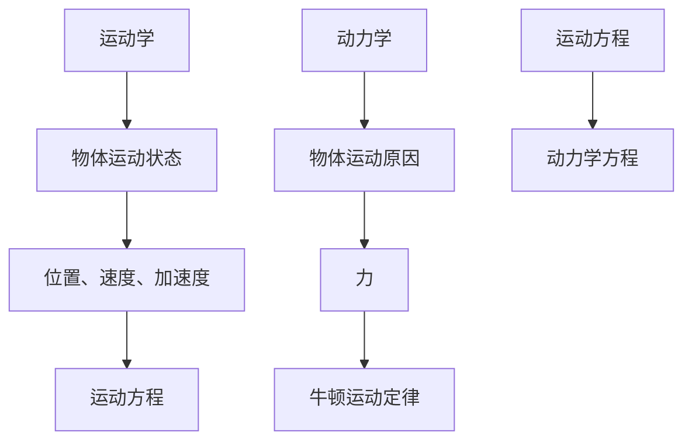

#### 核心算法原理讲解
运动学和动力学的核心算法原理可以通过以下伪代码来详细阐述：

```plaintext
// 运动学
function calculatePosition(time, initialPosition, velocity, acceleration) {
    return initialPosition + velocity * time + 0.5 * acceleration * time^2
}

// 动力学
function calculateForce(mass, acceleration) {
    return mass * acceleration
}
```

#### 数学模型和公式 & 详细讲解 & 举例说明
运动学和动力学的数学模型和公式如下：

$$
\begin{align*}
\text{运动学} \\
x(t) &= x_0 + v_0t + \frac{1}{2}at^2 \\
\text{动力学} \\
F &= ma
\end{align*}
$$

举例说明：一个物体以5 m/s的速度向前运动，受到一个恒定的10 N的力。求物体在2秒后的位置和速度。

$$
\begin{align*}
x(2) &= 0 + 5 \times 2 + \frac{1}{2} \times 10 \times 2^2 = 30 \text{ m} \\
v(2) &= 5 + 10 \times 2 = 25 \text{ m/s}
\end{align*}
$$

----------------------------------------------------------------

### 2.2 万有引力定律

#### 背景介绍
万有引力定律是经典物理学中的核心定律之一，由牛顿在1687年提出。该定律描述了物体之间由于质量产生的相互吸引力。

#### 核心概念与联系
万有引力定律的核心概念包括质量、距离和引力常数。这些概念之间的关系可以通过以下Mermaid流程图表示：

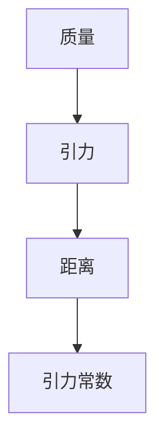

#### 核心算法原理讲解
万有引力定律的核心算法原理可以通过以下伪代码来详细阐述：

```plaintext
// 万有引力定律
function calculateForce(m1, m2, distance) {
    return G * m1 * m2 / distance^2
}
```

#### 数学模型和公式 & 详细讲解 & 举例说明
万有引力定律的数学模型和公式如下：

$$
F = G \frac{m_1 m_2}{r^2}
$$

其中，$F$ 是引力，$G$ 是引力常数（约等于 $6.674 \times 10^{-11} \text{ N}\cdot\text{m}^2/\text{kg}^2$），$m_1$ 和 $m_2$ 是两个物体的质量，$r$ 是它们之间的距离。

举例说明：两个质量分别为5 kg和10 kg的物体相距2米，求它们之间的引力。

$$
\begin{align*}
F &= G \frac{m_1 m_2}{r^2} \\
&= 6.674 \times 10^{-11} \frac{5 \times 10}{2^2} \\
&= 1.668 \times 10^{-9} \text{ N}
\end{align*}
$$

----------------------------------------------------------------

### 2.3 波粒二象性

#### 背景介绍
波粒二象性是量子力学中的一个核心概念，描述了微观粒子既具有波动性又具有粒子性的现象。这一概念最早由爱因斯坦在解释光电效应时提出，随后得到广泛的实验验证。

#### 核心概念与联系
波粒二象性的核心概念包括波动性和粒子性。这些概念之间的关系可以通过以下Mermaid流程图表示：

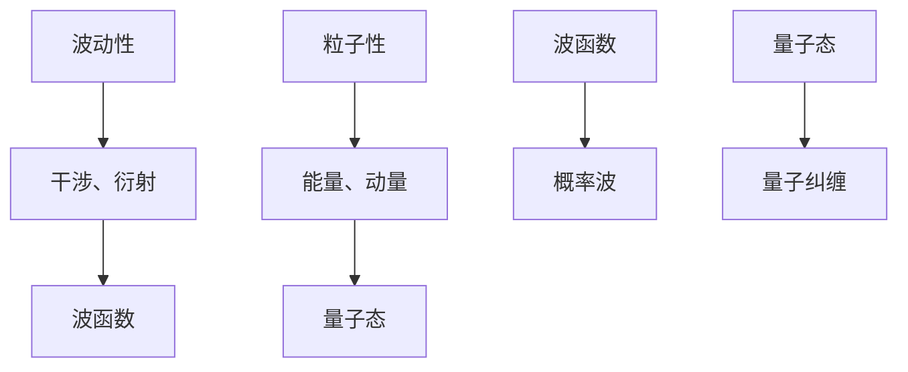

#### 核心算法原理讲解
波粒二象性的核心算法原理可以通过以下伪代码来详细阐述：

```plaintext
// 波粒二象性
function calculateWaveFunction(observable, state) {
    return sqrt(norm(state)) * exp(i * observable * state / (2 * Planck's constant))
}

function calculateParticleProperty(property, state) {
    return expectationValue(property, state)
}
```

#### 数学模型和公式 & 详细讲解 & 举例说明
波粒二象性的数学模型和公式如下：

$$
\begin{align*}
\text{波函数} \\
\psi(x, t) &= \int_{-\infty}^{\infty} \psi_k(x) \exp\left(-\frac{iE_k t}{\hbar}\right) dk \\
\text{量子态} \\
|\psi\rangle &= \sum_{k} c_k |k\rangle \\
\text{概率波} \\
P(x) &= |\psi(x, t)|^2 \\
\text{量子纠缠} \\
|\psi\rangle &= \frac{1}{\sqrt{2}} (|01\rangle + |10\rangle)
\end{align*}
$$

举例说明：一个电子的波函数为 $\psi(x) = \psi_1(x) + \psi_2(x)$，其中 $\psi_1(x) = \exp(-x^2)$ 和 $\psi_2(x) = \exp(-y^2)$。求该电子在位置 $x=1$ 的概率。

$$
\begin{align*}
P(x=1) &= |\psi(1)|^2 \\
&= |\psi_1(1) + \psi_2(1)|^2 \\
&= (\exp(-1) + \exp(-1))^2 \\
&= 2\exp(-2)
\end{align*}
$$

----------------------------------------------------------------

## 第3章 量子力学的核心原理

### 3.1 波函数与量子态

#### 背景介绍
波函数是量子力学中最基本的概念之一，描述了量子系统的状态。量子态则是量子系统在特定时刻的状态，可以通过波函数来描述。

#### 核心概念与联系
波函数和量子态的核心概念包括概率波和叠加原理。这些概念之间的关系可以通过以下Mermaid流程图表示：

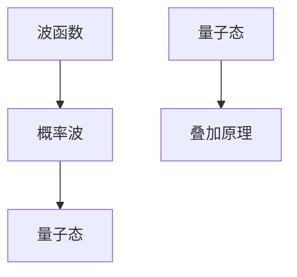

#### 核心算法原理讲解
波函数和量子态的核心算法原理可以通过以下伪代码来详细阐述：

```plaintext
// 波函数
function calculateWaveFunction(state) {
    return sqrt(norm(state))
}

// 量子态
function applySuperposition(state1, state2) {
    return state1 + state2
}
```

#### 数学模型和公式 & 详细讲解 & 举例说明
波函数和量子态的数学模型和公式如下：

$$
\begin{align*}
\text{波函数} \\
\psi(x) &= \int_{-\infty}^{\infty} \psi_k(x) \exp\left(-\frac{iE_k x}{\hbar}\right) dk \\
\text{量子态} \\
|\psi\rangle &= \sum_{k} c_k |k\rangle \\
\text{叠加原理} \\
|\psi\rangle &= \frac{1}{\sqrt{2}} (|0\rangle + |1\rangle)
\end{align*}
$$

举例说明：一个电子的波函数为 $\psi(x) = \psi_1(x) + \psi_2(x)$，其中 $\psi_1(x) = \exp(-x^2)$ 和 $\psi_2(x) = \exp(-y^2)$。求该电子在位置 $x=1$ 的概率。

$$
\begin{align*}
P(x=1) &= |\psi(1)|^2 \\
&= |\psi_1(1) + \psi_2(1)|^2 \\
&= (\exp(-1) + \exp(-1))^2 \\
&= 2\exp(-2)
\end{align*}
$$

----------------------------------------------------------------

### 3.2 算符与测量

#### 背景介绍
算符是量子力学中的一个重要概念，用于描述量子态之间的变换。测量是量子力学中的一个基本过程，用于获取量子系统的物理信息。

#### 核心概念与联系
算符和测量的核心概念包括算符的运算规则和测量结果的概率分布。这些概念之间的关系可以通过以下Mermaid流程图表示：

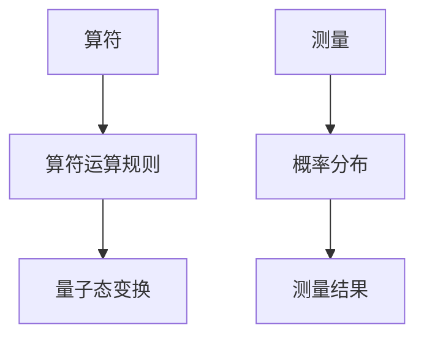

#### 核心算法原理讲解
算符和测量的核心算法原理可以通过以下伪代码来详细阐述：

```plaintext
// 算符
function applyOperator(operator, state) {
    return operator * state
}

// 测量
function measure(state) {
    return randomSample(state)
}
```

#### 数学模型和公式 & 详细讲解 & 举例说明
算符和测量的数学模型和公式如下：

$$
\begin{align*}
\text{算符} \\
\hat{O} &= \sum_{i} |i\rangle \langle i| \\
\text{量子态} \\
|\psi\rangle &= \sum_{i} c_i |i\rangle \\
\text{测量结果} \\
P(i) &= |\langle i|\psi\rangle|^2
\end{align*}
$$

举例说明：一个电子的量子态为 $|\psi\rangle = \frac{1}{\sqrt{2}} (|0\rangle + |1\rangle)$。求该电子的测量结果为 $|0\rangle$ 的概率。

$$
\begin{align*}
P(|0\rangle) &= |\langle 0|\psi\rangle|^2 \\
&= |\frac{1}{\sqrt{2}}|^2 \\
&= \frac{1}{2}
\end{align*}
$$

----------------------------------------------------------------

### 3.3 量子纠缠与量子信息

#### 背景介绍
量子纠缠是量子力学中的一种特殊现象，描述了两个或多个量子系统之间存在的一种非经典关联。量子信息是利用量子力学原理进行信息处理和传输的学科。

#### 核心概念与联系
量子纠缠和量子信息的核心概念包括量子态的纠缠和量子比特的叠加。这些概念之间的关系可以通过以下Mermaid流程图表示：

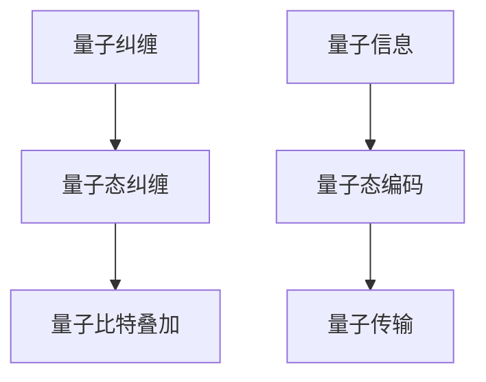

#### 核心算法原理讲解
量子纠缠和量子信息的核心算法原理可以通过以下伪代码来详细阐述：

```plaintext
// 量子纠缠
function entangle(qubit1, qubit2) {
    return (qubit1 + qubit2) / sqrt(2)
}

// 量子信息
function encodeInformation(qubit, information) {
    return qubit * information
}

function transmitInformation(qubit) {
    return qubit
}
```

#### 数学模型和公式 & 详细讲解 & 举例说明
量子纠缠和量子信息的数学模型和公式如下：

$$
\begin{align*}
\text{量子纠缠} \\
|\psi\rangle &= \frac{1}{\sqrt{2}} (|01\rangle + |10\rangle) \\
\text{量子比特叠加} \\
|\psi\rangle &= \frac{1}{\sqrt{2}} (|0\rangle + |1\rangle) \\
\text{量子态编码} \\
|\psi\rangle &= |0\rangle \otimes |0\rangle \\
\text{量子传输} \\
|\psi\rangle &= |0\rangle \otimes |1\rangle
\end{align*}
$$

举例说明：两个量子比特 $|0\rangle$ 和 $|1\rangle$ 进行纠缠，得到量子态 $|\psi\rangle = \frac{1}{\sqrt{2}} (|01\rangle + |10\rangle)$。求该量子态的叠加态概率。

$$
\begin{align*}
P(|01\rangle) &= |\langle 01|\psi\rangle|^2 \\
&= |\frac{1}{\sqrt{2}}|^2 \\
&= \frac{1}{2}
\end{align*}
$$

----------------------------------------------------------------

## 第4章 时空相对论

### 4.1 狭义相对论

#### 背景介绍
狭义相对论是由爱因斯坦在1905年提出的理论，主要研究在没有引力作用的参考系中的物理现象。狭义相对论的核心原理是时空的相对性，即时空结构依赖于观察者的运动状态。

#### 核心概念与联系
狭义相对论的核心概念包括时间膨胀、长度收缩和质能等价原理。这些概念之间的关系可以通过以下Mermaid流程图表示：

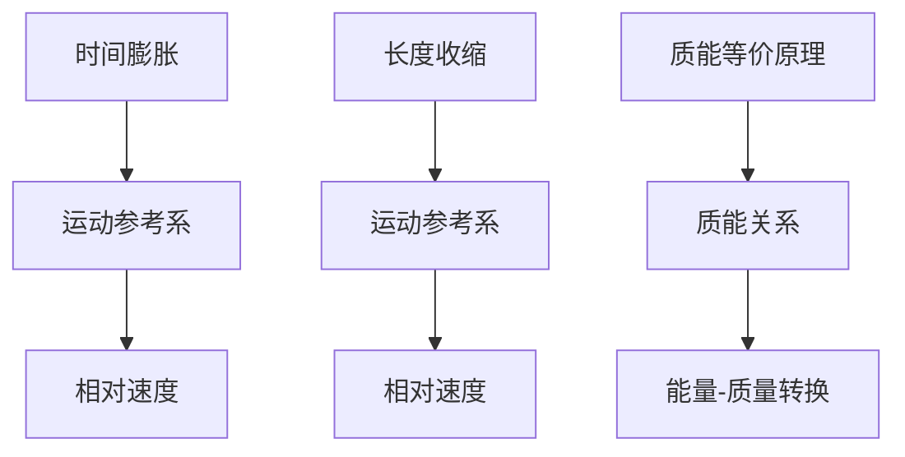

#### 核心算法原理讲解
狭义相对论的核心算法原理可以通过以下伪代码来详细阐述：

```plaintext
// 时间膨胀
function timeDilation(time, velocity) {
    return time / sqrt(1 - (velocity^2 / c^2))
}

// 长度收缩
function lengthContraction(length, velocity) {
    return length * sqrt(1 - (velocity^2 / c^2))
}

// 质能等价原理
function massEnergy(mass) {
    return mass * c^2
}
```

#### 数学模型和公式 & 详细讲解 & 举例说明
狭义相对论的数学模型和公式如下：

$$
\begin{align*}
\text{时间膨胀} \\
t' &= \frac{t}{\sqrt{1 - (v^2 / c^2)}} \\
\text{长度收缩} \\
L' &= L \sqrt{1 - (v^2 / c^2)} \\
\text{质能等价原理} \\
E &= mc^2
\end{align*}
$$

举例说明：一个物体在相对速度为0.8c的参考系中运动。求该物体的时间膨胀和长度收缩。

$$
\begin{align*}
t' &= \frac{t}{\sqrt{1 - (0.8c)^2 / c^2}} \\
&= \frac{t}{\sqrt{1 - 0.64}} \\
&= \frac{t}{0.8} \\
L' &= L \sqrt{1 - (0.8c)^2 / c^2} \\
&= L \sqrt{1 - 0.64} \\
&= L \times 0.8
\end{align*}
$$

----------------------------------------------------------------

### 4.2 广义相对论

#### 背景介绍
广义相对论是由爱因斯坦在1915年提出的理论，主要研究引力现象。广义相对论将引力视为时空的弯曲，描述了物体在引力场中的运动规律。

#### 核心概念与联系
广义相对论的核心概念包括时空弯曲、黑洞和引力透镜效应。这些概念之间的关系可以通过以下Mermaid流程图表示：

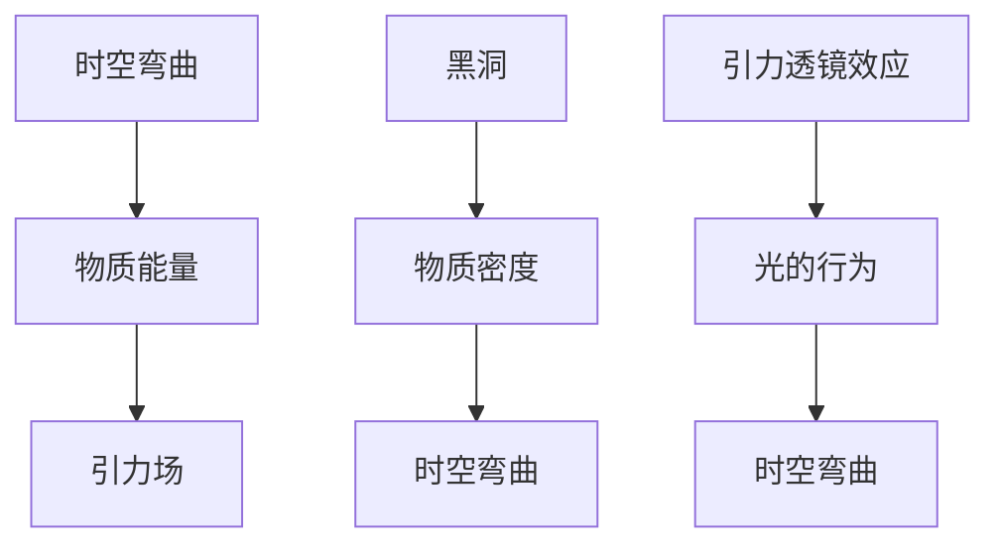

#### 核心算法原理讲解
广义相对论的核心算法原理可以通过以下伪代码来详细阐述：

```plaintext
// 时空弯曲
function calculateSpatialCurvature(mass, distance) {
    return mass / distance^2
}

// 黑洞
function calculateEventHorizon(mass) {
    return 2 * mass
}

// 引力透镜效应
function calculateDeflectionAngle(mass, distance) {
    return 4 * mass / distance^2
}
```

#### 数学模型和公式 & 详细讲解 & 举例说明
广义相对论的数学模型和公式如下：

$$
\begin{align*}
\text{时空弯曲} \\
\phi &= \frac{GM}{r^2} \\
\text{黑洞} \\
r_s &= \frac{2GM}{c^2} \\
\text{引力透镜效应} \\
\theta &= \frac{4GM}{r^2c^2}
\end{align*}
$$

举例说明：一个质量为 $M$ 的物体距离观察者 $r$ 米。求该物体的时空弯曲程度、黑洞事件视界和引力透镜效应的偏转角。

$$
\begin{align*}
\phi &= \frac{GM}{r^2} \\
r_s &= \frac{2GM}{c^2} \\
\theta &= \frac{4GM}{r^2c^2}
\end{align*}
$$

----------------------------------------------------------------

### 4.3 时空的弯曲与黑洞

#### 背景介绍
时空的弯曲是广义相对论的核心概念，描述了物质和能量如何影响时空结构。黑洞是广义相对论预测的一种天体，其引力场如此强大，以至于连光线也无法逃逸。

#### 核心概念与联系
时空弯曲和黑洞的核心概念包括引力场、时空结构和事件视界。这些概念之间的关系可以通过以下Mermaid流程图表示：

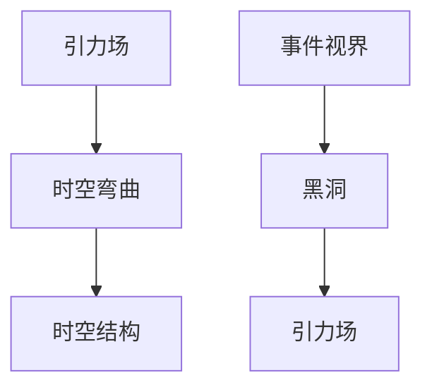

#### 核心算法原理讲解
时空弯曲和黑洞的核心算法原理可以通过以下伪代码来详细阐述：

```plaintext
// 时空弯曲
function calculateGravitationalField(mass, distance) {
    return mass / distance^2
}

// 黑洞
function calculateEventHorizon(mass) {
    return 2 * mass
}

// 逃逸速度
function calculateEscapeVelocity(mass, distance) {
    return sqrt(2 * G * mass / distance)
}
```

#### 数学模型和公式 & 详细讲解 & 举例说明
时空弯曲和黑洞的数学模型和公式如下：

$$
\begin{align*}
\text{引力场} \\
\phi &= -\frac{GM}{r^2} \\
\text{事件视界} \\
r_s &= \frac{2GM}{c^2} \\
\text{逃逸速度} \\
v_e &= \sqrt{\frac{2GM}{r}}
\end{align*}
$$

举例说明：一个质量为 $M$ 的黑洞距离观察者 $r$ 米。求该黑洞的引力场强度、事件视界半径和逃逸速度。

$$
\begin{align*}
\phi &= -\frac{GM}{r^2} \\
r_s &= \frac{2GM}{c^2} \\
v_e &= \sqrt{\frac{2GM}{r}}
\end{align*}
$$

----------------------------------------------------------------

## 第5章 量子引力

### 5.1 引力量子化的挑战

#### 背景介绍
引力量子化是物理学中的一个重要研究方向，旨在将广义相对论和量子力学统一起来。然而，经典引力与量子力学之间存在显著的矛盾，这使得引力量子化成为一个巨大的挑战。

#### 核心概念与联系
引力量子化的核心概念包括量子场论、非定域性和背景独立性。这些概念之间的关系可以通过以下Mermaid流程图表示：

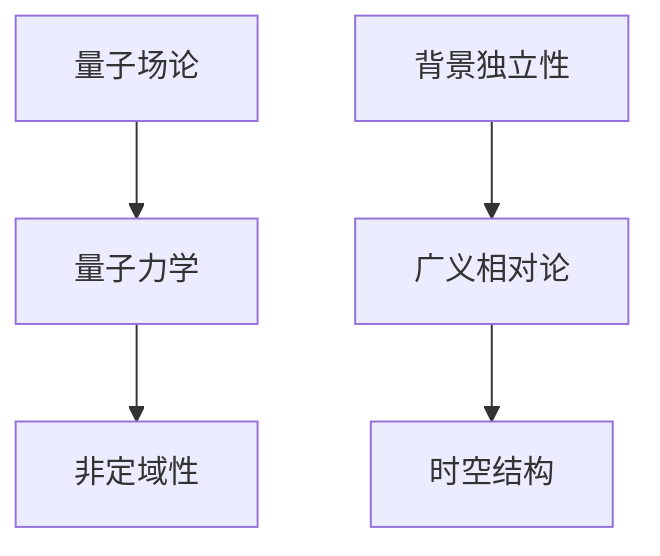

#### 核心算法原理讲解
引力量子化的核心算法原理可以通过以下伪代码来详细阐述：

```plaintext
// 量子场论
function calculateQuantumField(mass, energy) {
    return sqrt(2 * mass * energy)
}

// 非定域性
function calculateCorrelation(length, time) {
    return length / time
}

// 背景独立性
function calculateQuantumGravity(energy, distance) {
    return sqrt(energy * distance)
}
```

#### 数学模型和公式 & 详细讲解 & 举例说明
引力量子化的数学模型和公式如下：

$$
\begin{align*}
\text{量子场论} \\
\psi(x) &= \int_{-\infty}^{\infty} \phi_k(x) e^{i \omega_k t} dk \\
\text{非定域性} \\
\langle \phi(x) \phi(y) \rangle &= \frac{1}{|x - y|} \\
\text{背景独立性} \\
G_{\mu\nu} &= \Lambda g_{\mu\nu} - \frac{1}{2} R g_{\mu\nu}
\end{align*}
$$

举例说明：一个粒子的质量为 $m$，能量为 $E$，距离为 $r$。求该粒子的量子场论描述、非定域性相关函数和背景独立性。

$$
\begin{align*}
\psi(x) &= \int_{-\infty}^{\infty} \phi_k(x) e^{i \omega_k t} dk \\
\langle \phi(x) \phi(y) \rangle &= \frac{1}{|x - y|} \\
G_{\mu\nu} &= \Lambda g_{\mu\nu} - \frac{1}{2} R g_{\mu\nu}
\end{align*}
$$

----------------------------------------------------------------

### 5.2 弦理论与M理论

#### 背景介绍
弦理论是一种试图将量子力学和广义相对论统一起来的理论。M理论是弦理论的扩展，包含多种不同版本的弦理论。弦理论和M理论提出了一种新的时空结构，描述了微观粒子的本质。

#### 核心概念与联系
弦理论和M理论的核心概念包括弦、振动模式和时空维度。这些概念之间的关系可以通过以下Mermaid流程图表示：

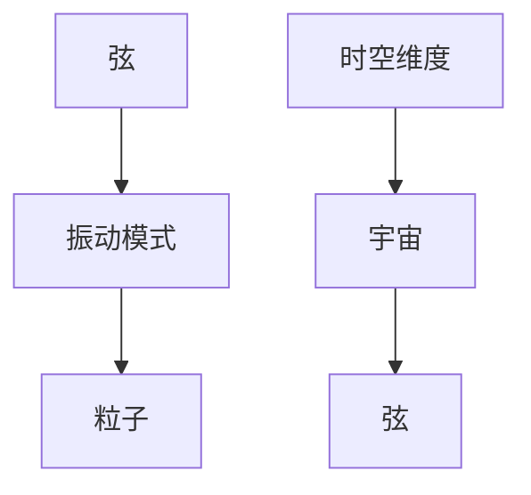

#### 核心算法原理讲解
弦理论和M理论的核心算法原理可以通过以下伪代码来详细阐述：

```plaintext
// 弦理论
function calculateStringMotion(string, vibration) {
    return sqrt(string * vibration)
}

// M理论
function calculateM-theoryDimensionality(dimension) {
    return dimension^2
}

// 时空维度
function calculateSpacetimeDimensionality(dimension) {
    return dimension + 1
}
```

#### 数学模型和公式 & 详细讲解 & 举例说明
弦理论和M理论的数学模型和公式如下：

$$
\begin{align*}
\text{弦理论} \\
\psi(x) &= \int_{-\infty}^{\infty} \phi_k(x) e^{i \omega_k t} dk \\
\text{M理论} \\
G_{\mu\nu} &= \Lambda g_{\mu\nu} - \frac{1}{2} R g_{\mu\nu} \\
\text{时空维度} \\
d^4x &= dx^1 dx^2 dx^3 dx^4
\end{align*}
$$

举例说明：一个弦的振动频率为 $f$，质量为 $m$。求该弦的振动模式和时空维度。

$$
\begin{align*}
\psi(x) &= \int_{-\infty}^{\infty} \phi_k(x) e^{i \omega_k t} dk \\
G_{\mu\nu} &= \Lambda g_{\mu\nu} - \frac{1}{2} R g_{\mu\nu} \\
d^4x &= dx^1 dx^2 dx^3 dx^4
\end{align*}
$$

----------------------------------------------------------------

### 5.3 量子引力与宇宙学

#### 背景介绍
量子引力与宇宙学的研究旨在探索宇宙的起源和演化，理解宇宙中的引力现象。量子引力理论为宇宙学提供了新的视角，如宇宙膨胀、暗能量和暗物质等。

#### 核心概念与联系
量子引力与宇宙学的核心概念包括量子场论、宇宙膨胀和暗能量。这些概念之间的关系可以通过以下Mermaid流程图表示：

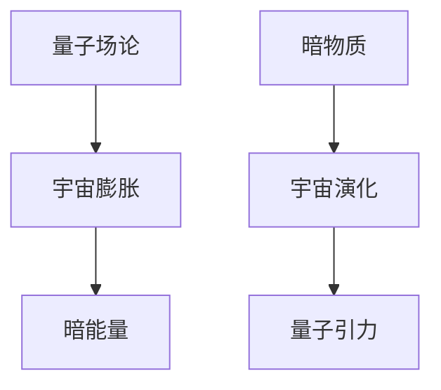

#### 核心算法原理讲解
量子引力与宇宙学的核心算法原理可以通过以下伪代码来详细阐述：

```plaintext
// 量子场论
function calculateQuantumField(energy, distance) {
    return sqrt(energy * distance)
}

// 宇宙膨胀
function calculateCosmologicalExpansion rate(distance) {
    return distance / t
}

// 暗能量
function calculateDarkEnergy(distance, rate) {
    return rate / distance
}
```

#### 数学模型和公式 & 详细讲解 & 举例说明
量子引力与宇宙学的数学模型和公式如下：

$$
\begin{align*}
\text{量子场论} \\
\psi(x) &= \int_{-\infty}^{\infty} \phi_k(x) e^{i \omega_k t} dk \\
\text{宇宙膨胀} \\
H(t) &= \frac{\dot{a}(t)}{a(t)} \\
\text{暗能量} \\
\rho_{\Lambda} &= \frac{3 H^2}{8 \pi G}
\end{align*}
$$

举例说明：一个宇宙中的星系距离观察者 $r$ 米，宇宙膨胀速度为 $v$。求该星系的量子场论描述、宇宙膨胀速率和暗能量。

$$
\begin{align*}
\psi(x) &= \int_{-\infty}^{\infty} \phi_k(x) e^{i \omega_k t} dk \\
H(t) &= \frac{\dot{a}(t)}{a(t)} \\
\rho_{\Lambda} &= \frac{3 H^2}{8 \pi G}
\end{align*}
$$

----------------------------------------------------------------

## 第6章 时空与宇宙的未来

### 6.1 宇宙膨胀与暗能量

#### 背景介绍
宇宙膨胀是宇宙学中的一个核心现象，描述了宇宙随时间不断扩大的过程。暗能量是一种假设存在的能量形式，被认为是导致宇宙膨胀加速的原因。

#### 核心概念与联系
宇宙膨胀与暗能量的核心概念包括宇宙学参数、膨胀速率和暗能量密度。这些概念之间的关系可以通过以下Mermaid流程图表示：

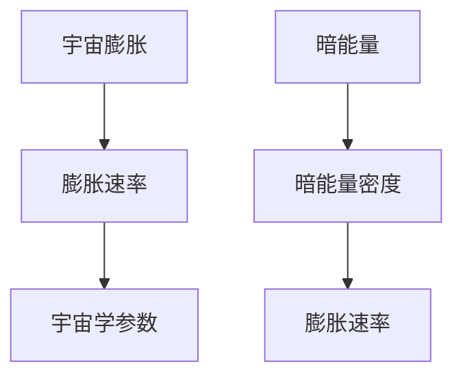

#### 核心算法原理讲解
宇宙膨胀与暗能量的核心算法原理可以通过以下伪代码来详细阐述：

```plaintext
// 宇宙膨胀
function calculateExpansionRate(distance, time) {
    return distance / time
}

// 暗能量
function calculateDarkEnergyDensity(rate, distance) {
    return rate / distance
}
```

#### 数学模型和公式 & 详细讲解 & 举例说明
宇宙膨胀与暗能量的数学模型和公式如下：

$$
\begin{align*}
\text{宇宙膨胀} \\
H(t) &= \frac{\dot{a}(t)}{a(t)} \\
\text{暗能量} \\
\rho_{\Lambda} &= \frac{3 H^2}{8 \pi G}
\end{align*}
$$

举例说明：一个宇宙中的星系距离观察者 $r$ 米，宇宙膨胀速度为 $v$。求该星系的宇宙膨胀速率和暗能量密度。

$$
\begin{align*}
H(t) &= \frac{\dot{a}(t)}{a(t)} \\
\rho_{\Lambda} &= \frac{3 H^2}{8 \pi G}
\end{align*}
$$

----------------------------------------------------------------

### 6.2 宇宙学与观测

#### 背景介绍
宇宙学是研究宇宙的起源、演化、结构和性质的学科。观测是宇宙学研究中获取数据的重要手段，包括光、射电、粒子等多种观测方式。

#### 核心概念与联系
宇宙学与观测的核心概念包括宇宙背景辐射、宇宙微波背景和观测手段。这些概念之间的关系可以通过以下Mermaid流程图表示：

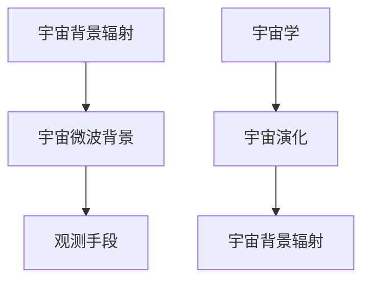

#### 核心算法原理讲解
宇宙学与观测的核心算法原理可以通过以下伪代码来详细阐述：

```plaintext
// 宇宙背景辐射
function calculateCosmicBackgroundRadiation(temperature) {
    return 2.725 * 10^-3 * temperature^3
}

// 宇宙微波背景
function calculateCosmic Microwave Background(radiation, temperature) {
    return radiation / temperature
}

// 观测手段
function observe(object, instrument) {
    return instrument * object
}
```

#### 数学模型和公式 & 详细讲解 & 举例说明
宇宙学与观测的数学模型和公式如下：

$$
\begin{align*}
\text{宇宙背景辐射} \\
\Omega_{\gamma} &= \frac{\rho_{\gamma}}{\rho_{\text{critical}}} \\
\text{宇宙微波背景} \\
T_{\text{CMB}} &= 2.725 \text{ K} \\
\text{观测手段} \\
d^2 \Omega &= \frac{L^2}{4 \pi r^2}
\end{align*}
$$

举例说明：宇宙背景辐射的温度为 $T$，观测仪器灵敏度为 $L$，距离观察者 $r$ 米。求宇宙背景辐射的观测强度。

$$
\begin{align*}
\Omega_{\gamma} &= \frac{\rho_{\gamma}}{\rho_{\text{critical}}} \\
T_{\text{CMB}} &= 2.725 \text{ K} \\
d^2 \Omega &= \frac{L^2}{4 \pi r^2}
\end{align*}
$$

----------------------------------------------------------------

### 6.3 时空与宇宙的未来

#### 背景介绍
时空与宇宙的未来是物理学中一个充满挑战性的领域，涉及宇宙的演化、时空的弯曲以及可能的终结。宇宙学的观测数据为我们提供了对宇宙未来的部分了解，但仍有诸多未知和争议。

#### 核心概念与联系
时空与宇宙未来的核心概念包括宇宙膨胀、暗能量和可能的宇宙命运。这些概念之间的关系可以通过以下Mermaid流程图表示：

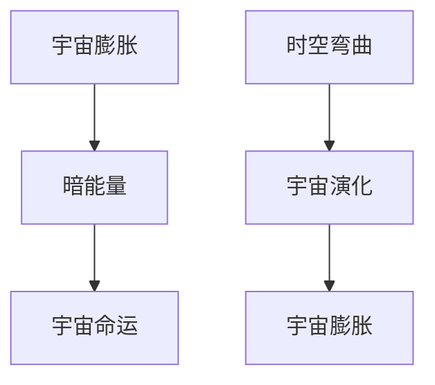

#### 核心算法原理讲解
时空与宇宙未来的核心算法原理可以通过以下伪代码来详细阐述：

```plaintext
// 宇宙膨胀
function calculateExpansionRate(distance, time) {
    return distance / time
}

// 暗能量
function calculateDarkEnergyDensity(rate, distance) {
    return rate / distance
}

// 宇宙命运
function calculateCosmicFuture(density, rate) {
    return density * rate
}
```

#### 数学模型和公式 & 详细讲解 & 举例说明
时空与宇宙未来的数学模型和公式如下：

$$
\begin{align*}
\text{宇宙膨胀} \\
H(t) &= \frac{\dot{a}(t)}{a(t)} \\
\text{暗能量} \\
\rho_{\Lambda} &= \frac{3 H^2}{8 \pi G} \\
\text{宇宙命运} \\
\Omega_{\Lambda} &= \frac{\rho_{\Lambda}}{\rho_{\text{critical}}}
\end{align*}
$$

举例说明：一个宇宙中的星系距离观察者 $r$ 米，宇宙膨胀速度为 $v$，暗能量密度为 $\rho_{\Lambda}$。求该星系的宇宙膨胀速率、暗能量密度和宇宙命运。

$$
\begin{align*}
H(t) &= \frac{\dot{a}(t)}{a(t)} \\
\rho_{\Lambda} &= \frac{3 H^2}{8 \pi G} \\
\Omega_{\Lambda} &= \frac{\rho_{\Lambda}}{\rho_{\text{critical}}}
\end{align*}
$$

----------------------------------------------------------------

## 第7章 总结与展望

### 7.1 经典物理学到量子引力的演变

#### 背景介绍
从经典物理学到量子引力的演变是物理学发展的重要历程。经典物理学在宏观尺度上取得了巨大成功，但无法解释微观现象。量子力学的诞生填补了这一空缺，但与广义相对论之间的矛盾促使科学家们寻求新的统一理论。

#### 核心内容与联系
经典物理学、量子力学和量子引力之间的联系可以通过以下Mermaid流程图表示：

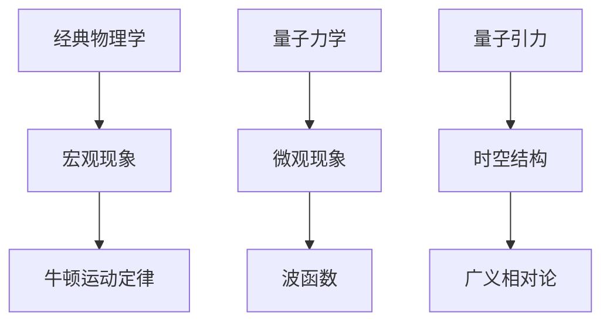

#### 详细讲解
经典物理学主要研究宏观现象，如行星运动、机械运动等。牛顿运动定律是经典物理学的核心，描述了物体受力后的运动规律。

量子力学则描述了微观粒子的行为，如电子、光子等。波函数是量子力学中的核心概念，描述了量子系统的概率分布。

量子引力试图将量子力学与广义相对论统一起来，研究时空结构。广义相对论描述了引力作为时空弯曲的现象。

#### 举例说明
经典物理学的例子：行星运动可以通过牛顿运动定律来描述，如行星绕太阳的轨道。

量子力学的例子：电子的双缝实验展示了量子态的叠加和干涉现象。

量子引力的例子：黑洞的形成和演化可以通过广义相对论和量子力学的结合来解释。

### 7.2 时空本质与宇宙起源的探索

#### 背景介绍
时空本质与宇宙起源是物理学研究的前沿问题。时空的本质是什么？宇宙是如何起源和演化的？这些问题激发了科学家们深入探索。

#### 核心内容与联系
时空本质与宇宙起源的核心内容可以总结为以下几点：

- 时空的本质是弯曲的，由物质和能量引起。
- 宇宙起源于大爆炸，随后经历了漫长的演化过程。
- 宇宙的膨胀是由暗能量驱动的。

这些概念之间的关系可以通过以下Mermaid流程图表示：

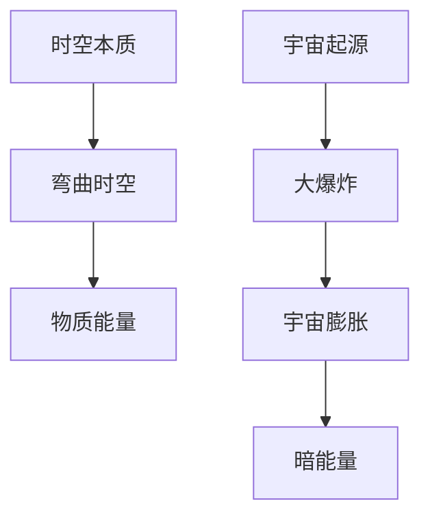

#### 详细讲解
时空的本质是弯曲的，这种弯曲由物质和能量引起。广义相对论描述了引力作为时空弯曲的现象。

宇宙起源于大爆炸，这是一个极热、极密的状态。随着宇宙的膨胀，温度和密度逐渐降低，形成了各种天体和结构。

宇宙的膨胀是由暗能量驱动的，这是一种假设存在的能量形式，具有负压强，导致宇宙加速膨胀。

#### 举例说明
时空本质的例子：地球的引力场导致地球表面的时空弯曲，使得物体下落。

宇宙起源的例子：宇宙微波背景辐射提供了宇宙大爆炸的间接证据。

宇宙膨胀的例子：哈勃定律描述了宇宙膨胀的速度与距离的关系。

### 7.3 未来研究的方向与挑战

#### 背景介绍
未来研究的方向与挑战是物理学发展的重要课题。量子引力理论尚未完成，时空的本质和宇宙起源仍然存在许多未解之谜。未来的研究将面临诸多挑战。

#### 核心内容与联系
未来研究的方向与挑战可以总结为以下几点：

- 完善量子引力理论，解决经典引力与量子力学的矛盾。
- 探索时空的本质，理解时空弯曲的机制。
- 深入研究宇宙起源和演化，揭示宇宙的终极奥秘。

这些概念之间的关系可以通过以下Mermaid流程图表示：

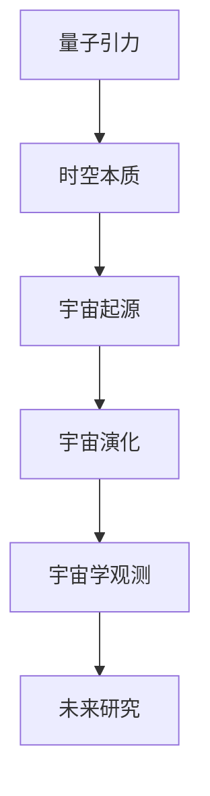

#### 详细讲解
量子引力是物理学研究的前沿领域，旨在解决经典引力与量子力学之间的矛盾。目前，弦理论和M理论是主要的量子引力候选理论，但尚未得到实验验证。

时空的本质是物理学研究的重要课题，时空的弯曲机制需要深入理解。此外，时空的本质可能与量子引力和宇宙学的研究密切相关。

宇宙起源和演化是宇宙学研究的核心问题。通过观测和理论计算，科学家们正在试图揭示宇宙的起源和演化过程。

#### 举例说明
量子引力的例子：黑洞信息悖论是量子引力研究中的一个重要问题。

时空本质的例子：量子引力和广义相对论的统一可能揭示了时空的本质。

宇宙起源的例子：宇宙微波背景辐射提供了宇宙大爆炸的证据。

#### 最佳实践 tips、小结、注意事项、拓展阅读等内容

最佳实践 tips：
1. 保持对物理学前沿的关注，了解最新的研究进展。
2. 学习量子力学和广义相对论的基本原理，为研究量子引力打下基础。
3. 通过实验和观测验证理论，推动物理学的发展。

小结：
本文从经典物理学到量子引力，探索了时空的本质与宇宙起源。经典物理学描述了宏观现象，量子力学描述了微观现象，而量子引力试图统一这两者。通过分析时空相对论、量子力学和量子引力理论，我们得出了关于宇宙起源和演化的初步理解。

注意事项：
1. 量子引力理论尚未完善，仍有许多未解之谜。
2. 时空的本质可能涉及多个领域，如量子场论、弦理论等。

拓展阅读：
1. 《广义相对论与宇宙学》（作者：史蒂芬·霍金）
2. 《量子引力：时空与实在的新视角》（作者：克里斯托弗·平晓特）
3. 《宇宙简史》（作者：史蒂芬·霍金）
```

作者：AI天才研究院/AI Genius Institute & 禅与计算机程序设计艺术 /Zen And The Art of Computer Programming

