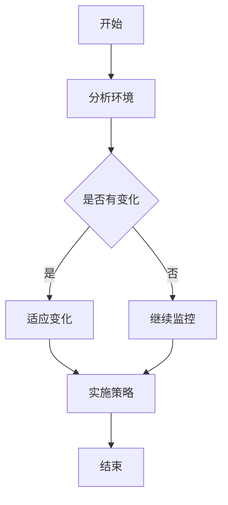

                 


### 引言

#### VUCA世界的概念

VUCA是一个缩写，代表Volatility（易变性）、Uncertainty（不确定性）、Complexity（复杂性）和Ambiguity（模糊性）。这个概念最早由美国海军战争学院在20世纪90年代提出，用来描述当时国际政治和军事环境的特点。随着时间的推移，VUCA逐渐被应用到商业和企业管理中，用以描述当今商业环境的特征。

#### 书籍的目的和结构

《从经典管理学到复杂性领导力：应对VUCA世界的新思维模式》旨在帮助领导者和管理者理解VUCA世界的本质，并掌握应对这一环境的复杂性领导力。本书的结构分为五个主要部分：

1. **第一部分：经典管理学的核心概念**，介绍管理学的基础理论和关键原则。
2. **第二部分：复杂性领导力的崛起**，探讨复杂性领导力的定义、特征和应用场景。
3. **第三部分：VUCA世界的分析**，分析VUCA世界的背景、特征和挑战。
4. **第四部分：新思维模式的应用**，介绍新思维模式的核心思想和应用。
5. **第五部分：应用案例与实战**，通过实际案例和实战指导，帮助读者理解和应用复杂性领导力。

### 第一部分：经典管理学的核心概念

#### 第1章：管理学的起源与发展

**1.1 经典管理学的基础理论**

经典管理学起源于20世纪初，以泰勒的科学管理理论和法约尔的管理过程理论为代表。泰勒通过时间研究和作业研究，提出了科学管理的概念，强调通过科学的方法来提高生产效率。法约尔则提出了管理的五大职能：计划、组织、指挥、协调和控制。

**1.2 经典管理学的关键原则**

经典管理学的关键原则包括：

- **分工原则**：将工作分解成小的、具体的任务，以提高工作效率。
- **管理层次原则**：将组织划分为不同的管理层级，确保指挥和控制的有效性。
- **统一指挥原则**：每个员工应该只接受一个上级的指挥，以避免混乱。
- **统一领导原则**：组织应该有一个明确的领导，负责整体决策和指挥。
- **个人利益服从整体利益原则**：员工应该将个人利益放在整体利益之上，以实现组织的共同目标。

#### 第2章：经典管理学的核心框架

**2.1 经典管理学的四大职能**

经典管理学的四大职能包括：

- **计划**：确定组织的长远目标和具体行动方案。
- **组织**：设计和建立组织结构，确保资源的有效配置。
- **指挥**：指导和监督员工的工作，确保计划的实施。
- **协调**：协调各部门和员工的工作，确保组织目标的实现。

**2.2 经典管理学的组织结构**

经典管理学的组织结构通常分为三种类型：

- **职能型组织结构**：按照职能划分部门，每个部门负责特定的职能。
- **事业部型组织结构**：按照产品或市场划分部门，每个部门独立运营。
- **矩阵型组织结构**：结合职能型和事业部型，同时考虑产品和职能。

#### 第3章：经典管理学的工具与方法

**3.1 经典决策模型**

经典决策模型主要包括：

- **理性决策模型**：通过分析所有可能的结果和成本，选择最优方案。
- **有限理性决策模型**：在有限的时间和资源内，选择一个相对满意的方案。
- **增量决策模型**：在现有方案的基础上，逐步改进，而不是重新开始。

**3.2 经典的项目管理方法**

经典的项目管理方法主要包括：

- **项目计划**：明确项目的目标、范围、时间表和资源需求。
- **项目执行**：按照计划进行项目工作，监控进度和质量。
- **项目监控**：定期审查项目进展，确保项目目标的实现。
- **项目收尾**：完成项目交付，进行项目总结和评估。

### 第二部分：复杂性领导力的崛起

#### 第4章：复杂性领导力的定义与特征

**4.1 复杂性领导力的概念**

复杂性领导力是一种领导模式，它强调领导者需要具备适应复杂环境的能力，包括系统思维、持续学习和创新精神。复杂性领导力不同于传统领导力，它更注重整体的视角，强调领导者需要理解系统中的各种关系和相互作用。

**4.2 复杂性领导力的核心特征**

复杂性领导力的核心特征包括：

- **系统思维**：领导者需要具备全局视角，理解组织内部的复杂关系和相互作用。
- **适应性**：领导者需要具备快速适应环境变化的能力，灵活调整策略和行动。
- **学习性**：领导者需要不断学习新知识，提升自己的认知和能力。
- **创新性**：领导者需要鼓励创新，推动组织持续改进和发展。

#### 第5章：复杂性领导力的核心原则

**5.1 系统思维**

系统思维是一种整体性思考方式，它强调领导者需要理解组织作为一个复杂系统中的各个方面，以及它们之间的相互作用。通过系统思维，领导者可以更好地预测和应对复杂环境的变化。

**5.2 持续学习与适应**

持续学习与适应是复杂性领导力的核心原则之一。领导者需要不断学习新知识、新技能，以适应快速变化的环境。同时，领导者还需要鼓励团队成员也不断学习和适应，以提升整个组织的竞争力。

#### 第6章：复杂性领导力的应用场景

**6.1 在变化环境中的领导**

在变化环境中，领导者需要具备快速决策和灵活调整的能力。通过复杂性领导力，领导者可以更好地应对不确定性和变化，确保组织的稳定和持续发展。

**6.2 在不确定性环境中的决策**

在不确定性环境中，领导者需要具备预测和应对不确定性的能力。复杂性领导力提供了领导者应对不确定性的工具和方法，帮助他们做出更明智的决策。

### 第三部分：VUCA世界的分析

#### 第7章：VUCA世界的背景与影响

**7.1 VUCA世界的起源**

VUCA世界起源于20世纪90年代的全球化、信息技术革命和金融危机等事件。这些事件导致了商业环境的剧烈变化，使得传统的管理方法和领导模式难以应对。

**7.2 VUCA世界对企业的影响**

VUCA世界对企业的影响包括：

- **竞争加剧**：全球化使得市场竞争更加激烈，企业需要具备更强的竞争力。
- **技术变革**：信息技术的发展带来了技术的快速变革，企业需要不断适应新技术。
- **市场不确定性**：经济环境和市场变化的不确定性增加，企业需要具备更强的适应能力。

#### 第8章：VUCA世界的特征与挑战

**8.1 VUCA世界的动态性**

VUCA世界的动态性体现在：

- **变化速度快**：环境变化的速度越来越快，企业需要具备快速响应的能力。
- **不确定性高**：环境中的不确定性增加，企业需要具备预测和应对不确定性的能力。

**8.2 VUCA世界的挑战**

VUCA世界对企业带来的挑战包括：

- **竞争压力**：企业需要不断提升自身的竞争力，以应对激烈的市场竞争。
- **技术挑战**：企业需要不断适应新技术，以保持市场竞争力。
- **管理复杂性**：复杂的管理环境要求企业具备更高的管理能力。

#### 第9章：VUCA世界的应对策略

**9.1 适应性领导**

适应性领导是一种领导模式，它强调领导者需要具备快速适应环境变化的能力。通过适应性领导，企业可以更好地应对VUCA世界的挑战。

**9.2 创新与学习文化**

创新与学习文化是一种组织文化，它强调创新和学习的重要性。通过创新与学习文化，企业可以不断提升自身的竞争力，应对VUCA世界的挑战。

### 第四部分：新思维模式的应用

#### 第10章：新思维模式的核心思想

**10.1 新思维模式的定义**

新思维模式是一种应对VUCA世界的方法，它强调领导者需要具备系统思维、适应性思维和创新思维。

**10.2 新思维模式的优势**

新思维模式的优势包括：

- **应对变化**：通过系统思维和适应性思维，领导者可以更好地应对环境变化。
- **提高决策质量**：通过创新思维，领导者可以做出更明智的决策。
- **提升组织竞争力**：通过新思维模式，企业可以不断提升自身的竞争力。

#### 第11章：新思维模式的具体应用

**11.1 在战略规划中的应用**

在战略规划中，新思维模式可以帮助领导者更好地应对不确定性，制定更灵活的战略计划。

**11.2 在组织变革中的应用**

在组织变革中，新思维模式可以帮助领导者更好地推动变革，确保变革的顺利进行。

#### 第12章：新思维模式与复杂性领导力的结合

**12.1 结合的理论基础**

新思维模式与复杂性领导力的结合基于以下理论基础：

- **系统思维**：新思维模式和复杂性领导力都强调系统思维的重要性。
- **适应性思维**：新思维模式和复杂性领导力都强调领导者需要具备快速适应环境变化的能力。

**12.2 结合的实际案例**

实际案例中，许多企业通过结合新思维模式和复杂性领导力，取得了显著的成功。例如，某科技公司在面对市场变化时，通过新思维模式和复杂性领导力，成功实现了战略转型和业务增长。

### 第五部分：应用案例与实战

#### 第13章：案例分析

**13.1 案例一：某企业的变革实践**

某企业在面对市场变化时，通过引入新思维模式和复杂性领导力，成功实现了组织变革和业务增长。

**13.2 案例二：某企业的创新之路**

某企业在技术创新中，通过新思维模式和复杂性领导力，推动了企业的持续创新和发展。

#### 第14章：实战指导

**14.1 实战步骤**

实战步骤包括：

- **了解环境**：分析当前环境和未来的发展趋势。
- **制定策略**：基于新思维模式和复杂性领导力，制定灵活的战略计划。
- **实施变革**：推动组织变革，确保战略计划的实施。
- **持续优化**：通过反馈和调整，持续优化战略计划和变革过程。

**14.2 实战注意事项**

在实战中，需要注意以下事项：

- **适应性**：保持开放和灵活，以适应环境的变化。
- **创新性**：鼓励创新思维，推动组织持续改进。
- **团队合作**：建立高效的团队合作，确保战略计划的实施。

### 结论

#### 总结与展望

复杂性领导力是应对VUCA世界的关键。通过新思维模式和复杂性领导力的结合，领导者可以更好地应对环境变化，推动组织的持续发展。

#### 对未来领导力的思考

未来的领导力需要具备更高的认知能力、适应性思维和创新精神。领导者需要不断学习和适应，以应对不断变化的商业环境。

### 参考文献

[1] VUCA Framework. (n.d.). Retrieved from [https://www.vucaleadership.com/vuca-framework/](https://www.vucaleadership.com/vuca-framework/)

[2] Senge, P. M. (1990). The Fifth Discipline: The Art & Practice of The Learning Organization. Doubleday.

[3] Heifetz, R. A., Grashow, A., & Linsky, M. (2009). The Practice of Adaptive Leadership: Tools and Tactics for Changing Your Organization and the World. Harvard Business Review Press.

### 附录

**A. Mermaid流程图示例**



**B. 伪代码示例**

```python
def adaptive_leadership(environment):
    if environment.is_change():
        strategy = create_strategy()
        execute_strategy(strategy)
    else:
        monitor_environment()
```

**C. 数学模型与公式说明**

$$
\text{适应性得分} = \frac{\text{适应能力}}{\text{变化频率}}
$$

**D. 项目实战中的代码实现**

```python
class AdaptiveOrganization:
    def __init__(self, environment):
        self.environment = environment

    def adapt(self):
        if self.environment.is_change():
            self.strategy = self.create_strategy()
            self.execute_strategy()
        else:
            self.monitor_environment()

    def create_strategy(self):
        # 根据环境变化创建策略
        pass

    def execute_strategy(self, strategy):
        # 根据策略执行行动
        pass

    def monitor_environment(self):
        # 监控环境变化
        pass
```

### 最佳实践 Tips

- **持续学习**：领导者需要不断学习新知识，提升自己的认知能力。
- **鼓励创新**：领导者需要鼓励团队成员创新，推动组织持续改进。
- **建立反馈机制**：领导者需要建立有效的反馈机制，及时调整策略和行动。

### 小结

复杂性领导力是应对VUCA世界的有效方法。通过新思维模式和复杂性领导力的结合，领导者可以更好地应对环境变化，推动组织的持续发展。

### 注意事项

- **适应性**：领导者需要具备快速适应环境变化的能力。
- **创新性**：领导者需要鼓励创新思维，推动组织持续改进。
- **团队合作**：领导者需要建立高效的团队合作，确保战略计划的实施。

### 拓展阅读

- 《第五项修炼：学习型组织的艺术与实务》作者：彼得·圣吉（Peter M. Senge）
- 《变革之舞：复杂性科学中的组织学习》作者：沃伦·本尼斯（Warren Bennis）

### 作者信息

作者：AI天才研究院/AI Genius Institute & 禅与计算机程序设计艺术 /Zen And The Art of Computer Programming

