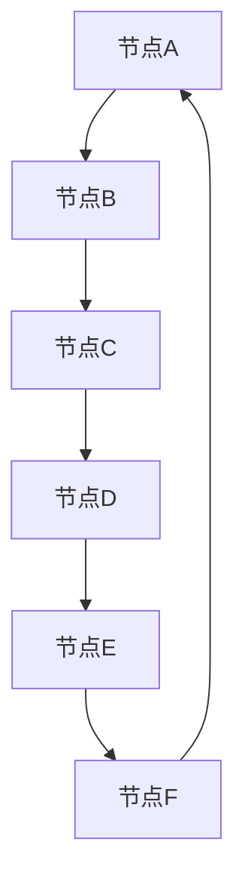

                 

## 文章标题

### 从经典系统论到复杂网络理论：理解高度互联的世界

---

**关键词**：经典系统论、复杂网络理论、高度互联、系统原理、网络结构、算法分析、数学模型、跨学科应用、案例分析

**摘要**：本文旨在探讨从经典系统论到复杂网络理论的演变，通过逐步分析推理，理解高度互联世界的本质。首先，我们回顾经典系统论的基本概念和原理，接着介绍复杂网络理论的核心内容，然后深入讨论这两个理论之间的联系和差异。文章还将分析经典系统论和复杂网络理论在各个领域的实际应用，并通过具体案例进行解读。最后，我们展望这两个理论的发展趋势，以及它们在未来可能带来的创新和挑战。

---

## 引言

随着信息技术和全球化的快速发展，我们的世界正变得日益复杂和高度互联。在这种背景下，理解和分析复杂系统的行为变得尤为重要。经典系统论和复杂网络理论正是在这一背景下发展起来的，它们为我们提供了强大的工具和方法，帮助我们更好地理解和应对高度互联的世界。

### 1.1 经典系统论与复杂网络理论概述

经典系统论起源于20世纪初，是研究系统内部各部分相互作用和整体行为的科学。它关注系统的稳定性、动态行为和演化过程。经典系统论的基本概念包括系统、状态、状态空间、动力学模型等。

复杂网络理论则是在过去几十年中逐渐发展起来的，它研究大规模网络的结构和动态行为。复杂网络通常具有高度非线性、高度互联和高度适应性等特点。复杂网络理论的核心概念包括节点、边、网络结构、网络属性等。

### 1.2 高度互联的世界背景

在现代科技和全球化背景下，我们生活的世界变得越来越复杂和高度互联。互联网、社交媒体、全球供应链、金融市场等都是典型的复杂网络系统。这些系统不仅规模庞大，而且节点和边之间的相互作用复杂，因此传统的分析方法难以胜任。

高度互联的世界给我们带来了前所未有的机遇和挑战。一方面，它促进了信息的快速传播和资源的共享，提高了生产力和创新效率。另一方面，它也带来了系统脆弱性、信息过载、网络攻击等风险。

### 1.3 经典系统论与复杂网络理论的重要性

经典系统论和复杂网络理论为我们理解和应对高度互联的世界提供了重要的理论基础和工具。经典系统论帮助我们理解系统的内在机制和演化规律，复杂网络理论则提供了分析大规模网络结构和动态行为的方法。

经典系统论强调系统内部各部分之间的相互作用和整体行为，而复杂网络理论则关注网络的拓扑结构和节点间的关系。这两个理论相互补充，共同构成了理解复杂系统的完整框架。

## 经典系统论

经典系统论起源于20世纪初，是研究系统内部各部分相互作用和整体行为的科学。它关注系统的稳定性、动态行为和演化过程。经典系统论的基本概念包括系统、状态、状态空间、动力学模型等。在本章节中，我们将详细探讨这些基本概念，并介绍经典系统论的历史发展和应用领域。

### 2.1 经典系统论的基本原理

#### 2.1.1 系统的定义和特性

系统可以被视为一个具有特定功能的整体，由多个相互关联的部分组成。这些部分可以是物理的、抽象的或混合的。系统具有以下基本特性：

- **整体性**：系统的整体行为不能简单地通过其组成部分的行为来解释，而是需要考虑各部分之间的相互作用。
- **动态性**：系统随着时间的推移而变化，其状态在不断演化。
- **环境适应性**：系统需要适应外部环境的变化，以维持其稳定性和功能。

#### 2.1.2 系统的状态和状态空间

系统在某一时刻的状态可以用一组参数来描述，这些参数称为状态变量。状态空间则是所有可能状态的集合。例如，一个机械系统可能的状态空间包括所有可能的位移和速度组合。

状态空间的概念对于理解系统的动态行为至关重要。通过分析状态空间，我们可以预测系统的未来行为，并设计控制策略来调整系统状态。

#### 2.1.3 系统的动力学模型

系统的动力学模型描述了系统状态随时间变化的规律。常见的动力学模型包括：

- **常微分方程模型**：描述系统状态变量随时间的变化。
- **离散模型**：将系统状态离散化，分析状态转移矩阵。
- **马尔可夫模型**：描述系统在各个状态之间转移的概率。

动力学模型为系统分析提供了数学工具，使我们能够定量地描述和预测系统的行为。

### 2.2 经典系统论的历史发展

经典系统论的发展历程可以追溯到20世纪初。以下是一些关键事件和里程碑：

- **20世纪初**：热力学和统计力学的发展为系统论奠定了基础。
- **1930年代**：拉普拉斯和皮卡德的工作推动了经典系统论的发展。
- **1950年代**：控制理论和信息论为系统论提供了新的视角和方法。
- **1980年代**：复杂系统和非线性动力系统的研究进一步拓展了系统论的应用范围。

### 2.3 经典系统论在物理学中的应用

经典系统论在物理学中有着广泛的应用。以下是一些典型的应用领域：

- **分子动力学**：研究分子和原子在热力学和化学过程中的行为。
- **量子力学**：使用相位空间方法研究量子系统的动力学。
- **天体物理学**：模拟星系和行星的演化。

### 2.4 经典系统论在工程学中的应用

经典系统论在工程学中的应用也非常广泛。以下是一些重要的应用领域：

- **控制系统工程**：设计控制策略，使系统能够在特定条件下稳定运行。
- **信号处理**：通过系统建模和分析，优化信号传输和处理。
- **生物医学工程**：研究生物系统的行为，开发医疗设备和治疗方法。

### 2.5 经典系统论在经济学中的应用

经典系统论在经济学中也有重要的应用。以下是一些典型的应用领域：

- **宏观经济模型**：研究经济系统的稳定性和波动。
- **金融市场**：分析市场结构和投资者行为。
- **能源系统**：优化能源生产和分配。

## 复杂网络理论

复杂网络理论是研究大规模网络的结构和动态行为的科学。与传统网络理论相比，复杂网络理论更加关注网络的非线性、高度互联和高度适应性。在本章节中，我们将介绍复杂网络理论的基本概念、网络结构分析、网络动态行为研究以及它在现实世界中的应用。

### 3.1 复杂网络理论的基本概念

#### 3.1.1 网络的基本要素

复杂网络由节点（实体）和边（关系）组成。节点可以是任何实体，如人、物、组织等。边表示节点之间的相互作用或联系。复杂网络的节点和边通常具有多种属性，如度、介数、聚类系数等。

#### 3.1.2 网络的分类

复杂网络可以根据不同的特征进行分类。常见的分类方法包括：

- **无标度网络**：节点度分布遵循幂律分布，具有高度异质性。
- **社会网络**：描述人与人之间的社会关系。
- **技术网络**：描述计算机、通信等技术的连接关系。

#### 3.1.3 网络属性

复杂网络具有多种重要的属性，如：

- **平均路径长度**：描述节点之间的平均距离。
- **度分布**：描述节点度的概率分布。
- **聚类系数**：描述节点的邻居之间的连接情况。

### 3.2 网络结构分析

网络结构分析是复杂网络理论的核心内容之一。以下是一些常用的分析方法：

- **度分布分析**：研究节点度的分布规律，识别无标度网络的特征。
- **介数分析**：研究节点在信息传播中的重要性。
- **聚类系数分析**：研究网络的局部结构特性。

### 3.3 网络动态行为研究

复杂网络的动态行为研究关注网络在时间和空间上的演化过程。以下是一些重要的研究方法：

- **传播模型**：研究网络中信息、病毒等的传播规律。
- **动力系统方法**：研究网络的稳定性、混沌行为等。
- **机器学习方法**：研究网络动态行为的预测和分析。

### 3.4 复杂网络理论在现实世界中的应用

复杂网络理论在现实世界中有着广泛的应用。以下是一些典型的应用领域：

- **社交媒体**：研究用户关系和网络传播。
- **金融市场**：分析市场结构和风险传播。
- **交通网络**：优化交通流量和减少拥堵。
- **生物网络**：研究生物分子之间的相互作用。

## 跨学科应用

经典系统论和复杂网络理论在多个学科领域有着广泛的应用。跨学科应用不仅促进了理论的发展，也为解决实际问题提供了新的思路和方法。以下是一些典型的跨学科应用案例。

### 4.1 经典系统论在生物学中的应用

经典系统论在生物学中有着重要的应用。例如，在生态系统研究中，系统论帮助我们理解生物种群之间的相互作用和生态平衡。通过建立数学模型，我们可以预测生态系统的动态行为，从而提出有效的保护策略。

此外，经典系统论在生物分子研究中也有着广泛应用。例如，在蛋白质折叠研究中，系统论方法帮助科学家理解蛋白质在三维空间中的折叠过程。

### 4.2 经典系统论在生态学中的应用

经典系统论在生态学中的应用主要体现在生态系统的模拟和预测方面。通过建立生态系统模型，我们可以模拟生态系统的演化过程，预测生态变量的变化趋势。这种方法有助于我们更好地理解生态系统的复杂性和稳定性，从而提出有效的生态管理策略。

### 4.3 经典系统论在经济学中的应用

经典系统论在经济学中的应用主要集中在宏观经济模型和金融市场分析方面。通过建立宏观经济学模型，我们可以模拟经济系统的行为，预测经济变量的变化趋势。在金融市场分析中，系统论方法可以帮助我们理解市场结构、风险传播和网络效应。

### 4.4 复杂网络理论在工程学中的应用

复杂网络理论在工程学中的应用非常广泛。在交通网络优化方面，复杂网络理论可以帮助我们分析交通流量、识别交通瓶颈，并提出优化策略。在电力网络稳定性和可靠性分析方面，复杂网络理论提供了有效的工具和方法，帮助我们理解电力网络的拓扑结构和动态行为，从而提高电力网络的运行效率。

### 4.5 复杂网络理论在社会科学中的应用

复杂网络理论在社会科学中的应用主要体现在社会网络分析和网络传播研究方面。在社会网络分析中，我们可以通过分析节点和边之间的关系，理解社会结构和社会行为。在网络传播研究中，我们可以模拟信息、谣言等在网络中的传播过程，预测传播效果，并提出控制策略。

### 4.6 经典系统论和复杂网络理论在其他领域的应用

除了上述领域，经典系统论和复杂网络理论在其他领域也有着广泛的应用。例如，在医学领域，经典系统论可以帮助我们理解生物系统的复杂性和动态行为，从而提出有效的诊断和治疗策略。在材料科学中，复杂网络理论可以帮助我们理解材料结构的演化过程，优化材料性能。

## 案例分析

为了更好地理解经典系统论和复杂网络理论的应用，以下我们通过几个具体案例进行详细分析。

### 5.1 案例一：社交媒体网络的演化

社交媒体网络是一个典型的复杂网络系统。在这个案例中，我们通过分析社交媒体网络的演化过程，了解复杂网络理论的应用。

首先，我们可以使用度分布分析方法，研究社交媒体网络中节点度的分布规律。通过数据采集和统计分析，我们发现社交媒体网络呈现出无标度特性，即大部分节点度较低，而少数节点度非常高。

接下来，我们可以使用介数分析，研究社交媒体网络中节点的重要性。介数高的节点在信息传播过程中起到了关键作用，是网络中的关键节点。通过识别这些关键节点，我们可以优化网络结构，提高信息传播效率。

此外，我们还可以使用传播模型，模拟信息在社交媒体网络中的传播过程。通过设置不同的传播参数，我们可以预测信息传播的速度和范围，从而制定有效的信息传播策略。

### 5.2 案例二：电力网络的稳定性

电力网络是一个高度互联的系统，其稳定性对整个社会的正常运行至关重要。在这个案例中，我们通过分析电力网络的稳定性，了解经典系统论的应用。

首先，我们可以建立电力网络的数学模型，描述电力系统中各个部分之间的相互作用。通过模拟不同的运行条件，我们可以预测电力网络的动态行为，分析系统的稳定性。

接下来，我们可以使用状态空间分析方法，研究电力网络的状态转移。通过分析状态转移矩阵，我们可以识别系统的稳定状态和潜在的不稳定因素。

此外，我们还可以使用控制理论方法，设计控制策略，使电力网络在异常情况下能够保持稳定。例如，通过调节发电机输出功率，控制电压和电流的稳定性。

### 5.3 案例三：生物网络的相互作用

生物网络描述了生物分子之间的相互作用关系，是一个典型的复杂网络系统。在这个案例中，我们通过分析生物网络的相互作用，了解经典系统论和复杂网络理论的跨学科应用。

首先，我们可以使用复杂网络理论中的度分布分析方法，研究生物网络中节点度的分布规律。通过数据采集和统计分析，我们可以识别生物网络中的关键节点，这些节点在生物过程中起到了关键作用。

接下来，我们可以使用介数分析，研究生物网络中节点的重要性。通过识别介数高的节点，我们可以理解生物分子之间的关键相互作用，为生物科学研究提供线索。

此外，我们还可以使用系统动力学方法，研究生物网络的动态行为。通过建立数学模型，我们可以模拟生物分子的相互作用过程，预测生物系统的行为。

## 数学模型与算法

经典系统论和复杂网络理论中，数学模型和算法起到了关键作用。以下我们介绍一些常用的数学模型和算法，并使用伪代码进行详细解释。

### 6.1 经典系统论中的数学模型

#### 6.1.1 常微分方程模型

常微分方程模型用于描述系统状态随时间的变化。以下是一个简单的常微分方程模型的伪代码：

```python
# 假设有一个质量为m的物体，受到恒定力F的作用
# 运动方程为：m * d^2x/dt^2 = F

# 伪代码：
# 初始化状态变量：x(t=0), v(t=0)
# 初始化时间步长：dt
# 迭代时间：t = 0, dt, 2*dt, ..., T
# 对于每个时间步长：
#     计算加速度：a = F/m
#     更新速度：v(t+dt) = v(t) + a * dt
#     更新位置：x(t+dt) = x(t) + v(t) * dt
```

#### 6.1.2 马尔可夫模型

马尔可夫模型用于描述系统在各个状态之间转移的概率。以下是一个简单的马尔可夫模型的伪代码：

```python
# 假设系统有两个状态：状态1和状态2
# 转移概率矩阵为P：

# 伪代码：
# 初始化状态变量：state
# 初始化转移概率矩阵：P
# 迭代时间：t = 0, 1, 2, ..., T
# 对于每个时间步长：
#     计算下一状态的概率分布：next_state_prob = P[state]
#     根据概率分布更新状态：state = 随机选择状态
```

### 6.2 复杂网络理论中的数学模型

#### 6.2.1 度分布模型

度分布模型用于描述网络中节点度的概率分布。以下是一个简单的度分布模型的伪代码：

```python
# 假设网络中有N个节点，每个节点的度分布服从幂律分布
# 度分布概率函数为P(k) = k^-γ

# 伪代码：
# 初始化节点数：N
# 初始化度分布参数：γ
# 对于每个节点：
#     生成节点度：k = rand(k_min, k_max)
#     计算度分布概率：P(k) = k^-γ
```

#### 6.2.2 平均路径长度模型

平均路径长度模型用于描述网络中节点之间的平均距离。以下是一个简单的平均路径长度模型的伪代码：

```python
# 假设网络中有N个节点，每个节点都有一定的度分布
# 计算平均路径长度：

# 伪代码：
# 初始化节点数：N
# 初始化度分布参数：γ
# 计算度分布概率：P(k) = k^-γ
# 对于每个节点k：
#     计算节点k的度：deg(k)
#     计算节点k的平均路径长度：L(k) = sum(P(deg(k)) * L(deg(k)))
# 计算平均路径长度：L_avg = sum(L(k)) / N
```

### 6.3 常用的复杂网络分析算法

以下介绍一些常用的复杂网络分析算法：

#### 6.3.1 社区检测算法

社区检测算法用于识别网络中的社区结构。以下是一个简单的社区检测算法的伪代码：

```python
# 假设网络中有N个节点，每个节点都有一定的邻居关系
# 使用社区检测算法识别社区结构：

# 伪代码：
# 初始化节点状态：状态为未访问
# 对于每个节点：
#     如果节点未访问：
#         执行深度优先搜索（DFS）算法
#         标记已访问节点
#         将访问到的节点划分为一个社区
# 返回所有社区
```

#### 6.3.2 网络传播算法

网络传播算法用于模拟信息、病毒等在网络中的传播过程。以下是一个简单的网络传播算法的伪代码：

```python
# 假设网络中有N个节点，每个节点都有一定的邻居关系
# 初始化传播源节点：source
# 初始化传播时间：t = 0
# 初始化已感染节点：infected_nodes = [source]

# 伪代码：
# 对于每个时间步长：
#     对于每个已感染节点：
#         随机选择邻居节点
#         如果邻居节点未感染：
#             计算感染概率：prob = infection_prob(邻居节点)
#             如果 prob > 随机数：
#                 感染邻居节点
#                 将邻居节点添加到已感染节点列表
# 返回感染节点数量
```

## 未来展望

随着科技的进步和跨学科研究的深入，经典系统论和复杂网络理论在未来的发展具有广阔的前景。以下是我们对未来发展的几点展望。

### 7.1 经典系统论与复杂网络理论的发展趋势

- **跨学科融合**：经典系统论和复杂网络理论将继续与其他学科（如生物学、经济学、社会学等）深度融合，推动跨学科研究的进步。
- **数据驱动方法**：随着大数据和人工智能技术的发展，数据驱动方法将 increasingly 被应用于经典系统论和复杂网络理论的研究。
- **算法优化**：针对具体问题，算法优化将成为经典系统论和复杂网络理论研究的重要方向，提高计算效率和准确性。

### 7.2 潜在应用领域

- **智能交通系统**：利用复杂网络理论优化交通流量，减少拥堵，提高运输效率。
- **智慧城市**：通过系统论和复杂网络理论优化城市资源分配，提高城市运行效率。
- **生物信息学**：利用经典系统论和复杂网络理论分析生物分子网络，推动生命科学研究。
- **金融工程**：利用系统论和复杂网络理论分析金融市场结构，预测市场波动，提高金融风险管理水平。

### 7.3 面临的挑战与机遇

- **数据隐私与安全**：随着数据规模的增大，数据隐私和安全问题将越来越重要，如何保护数据隐私同时实现高效分析将成为挑战。
- **计算能力**：复杂系统分析和大规模网络建模需要强大的计算能力，提高计算效率是未来的重要方向。
- **理论体系**：构建更加完善的理论体系，统一经典系统论和复杂网络理论，为跨学科研究提供坚实的理论基础。

## 结论

经典系统论和复杂网络理论为我们提供了理解和应对高度互联世界的重要工具和方法。通过本文的探讨，我们深入分析了这两个理论的基本概念、应用领域、跨学科应用以及未来发展趋势。我们相信，随着科技的进步和跨学科研究的深入，经典系统论和复杂网络理论将继续发挥重要作用，推动人类社会的发展和进步。

---

**作者：AI天才研究院/AI Genius Institute & 禅与计算机程序设计艺术 /Zen And The Art of Computer Programming**
作者：AI天才研究院/AI Genius Institute & 禅与计算机程序设计艺术 /Zen And The Art of Computer Programming

---

### 经典系统论在生物科学中的应用

经典系统论在生物科学中有着广泛的应用，特别是在理解生物系统的动态行为和复杂性方面。以下我们将探讨经典系统论在生物科学中的应用，包括生态系统的模拟、生物分子网络的建模以及生物医学工程中的系统分析。

#### 8.1 生态系统的模拟

生态系统是一个复杂的系统，包含多个生物种群、环境因素和相互作用。经典系统论提供了一种有效的方法来模拟生态系统的动态行为，帮助我们理解生态平衡和物种间的关系。

例如，Lotka-Volterra方程是一个经典的生态模型，用于描述捕食者和被捕食者之间的相互作用。该模型通过微分方程描述种群数量随时间的变化，帮助我们预测生态系统的稳定性和波动。

```latex
\frac{dx}{dt} = x(a - bx)
\frac{dy}{dt} = cy(dx - dy)
```

其中，\(x\) 和 \(y\) 分别表示捕食者和被捕食者的种群数量，\(a\)、\(b\) 和 \(c\) 是参数。

#### 8.2 生物分子网络的建模

生物分子网络描述了生物分子之间的相互作用关系，如蛋白质-蛋白质相互作用、基因调控网络等。经典系统论提供了一种方法来建模和分析这些网络，帮助我们理解生物系统的复杂性和功能。

例如，利用布尔网络模型，我们可以模拟基因调控网络中的开关行为。布尔网络是一种离散模型，使用布尔逻辑运算来描述基因表达状态的变化。

```latex
G(X) = X \land Y
```

其中，\(X\) 和 \(Y\) 是基因的状态，\(G(X)\) 是基因的下一个状态。

#### 8.3 生物医学工程中的系统分析

在生物医学工程中，经典系统论用于分析和设计医疗设备和系统。例如，在人工器官和生物传感器的研究中，系统论帮助我们理解器官的运作机制和设计更加精确的设备。

例如，在心脏起搏器的设计中，系统论方法用于分析心脏的电生理特性和起搏器的控制策略，以确保起搏器的稳定性和安全性。

```latex
\frac{dx}{dt} = -\frac{dx}{\tau}
```

其中，\(x\) 表示心脏的节律，\(\tau\) 是恢复时间常数。

### 8.4 经典系统论与复杂网络理论的结合

经典系统论和复杂网络理论的结合为生物科学的研究提供了新的视角和方法。通过将复杂网络理论应用于生物分子网络，我们可以更深入地理解生物系统的拓扑结构和动态行为。

例如，使用复杂网络理论中的度分布和介数分析，我们可以识别生物分子网络中的关键节点和关键路径，从而理解生物过程的调控机制。



在这个网络中，节点A和节点F的度较高，是关键节点，而介数较高的节点（如节点B和节点C）在信息传递中起到了重要作用。

### 8.5 总结

经典系统论在生物科学中的应用为我们提供了强大的工具和方法，帮助我们理解生物系统的动态行为和复杂性。结合复杂网络理论，我们可以更深入地分析生物分子网络的拓扑结构和动态行为，为生物医学研究和生物技术的发展提供新的思路和方法。

---

**最佳实践 tips、小结、注意事项、拓展阅读等内容**

在进行经典系统论和复杂网络理论的研究和应用时，以下是一些最佳实践、小结、注意事项以及拓展阅读的建议。

### 最佳实践 tips

- **数据收集与预处理**：在进行研究之前，确保数据的质量和完整性。使用适当的工具和方法进行数据预处理，去除噪声和不完整的数据。
- **模型选择**：根据研究问题和数据特性选择合适的模型。对于非线性系统，可以使用微分方程模型、神经网络等。
- **算法优化**：针对具体问题，对算法进行优化，提高计算效率和准确性。可以考虑使用并行计算、分布式计算等技术。
- **实验验证**：通过实验验证模型的预测和结论。实际数据和模拟结果之间的对比有助于验证模型的有效性。

### 小结

经典系统论和复杂网络理论为我们提供了理解和分析复杂系统的强大工具和方法。通过这些理论，我们可以深入探讨系统的动态行为、网络结构和相互作用，为科学研究和工程应用提供新的思路和方法。

### 注意事项

- **数据隐私与安全**：在进行数据分析和建模时，确保数据隐私和安全。遵守相关的法律法规，采取适当的数据保护措施。
- **模型复杂性**：避免过度复杂化模型，确保模型能够准确描述系统的行为，同时保持计算的可控性。
- **跨学科合作**：经典系统论和复杂网络理论具有跨学科的特点。与其他学科的专家合作，可以更好地理解和解决复杂问题。

### 拓展阅读

- **经典系统论**：
  - 《系统论：控制与通信科学基础》（作者：诺伯特·维纳）
  - 《复杂系统的控制与优化》（作者：约翰·H·霍普菲尔德）

- **复杂网络理论**：
  - 《复杂网络理论及其应用》（作者：阿尔伯特·拉斯洛·巴拉巴西）
  - 《社会网络分析：方法与应用》（作者：罗杰·莫里森）

- **跨学科应用**：
  - 《生物信息学：算法与应用》（作者：查尔斯·E·布洛索）
  - 《智慧城市：设计与规划》（作者：彼得·霍尔）

通过这些拓展阅读，您可以进一步深入了解经典系统论、复杂网络理论和跨学科应用的相关知识和方法。这将为您的科研和工程实践提供宝贵的指导和参考。

