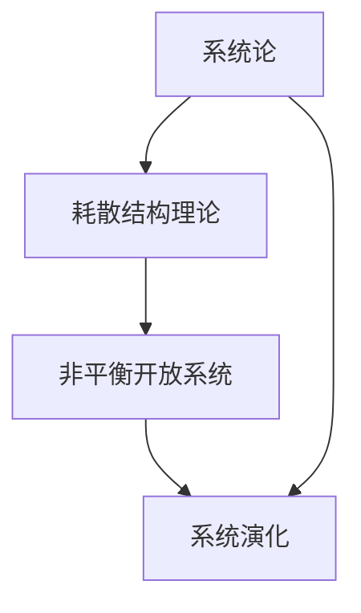

                 

### 引言

在现代信息技术迅猛发展的背景下，对复杂系统的理解和设计成为了计算机科学、系统工程等领域的重要课题。从经典系统论到耗散结构理论，这些理论为理解和构建非平衡开放系统提供了深刻的洞见。本文将带领读者逐步深入这些理论，探讨其在实际应用中的重要性。

#### 关键词

- 经典系统论
- 耗散结构理论
- 非平衡开放系统
- 系统演化
- 算法原理
- 数学模型
- 项目实战

#### 摘要

本文首先介绍了经典系统论的基本概念，阐述了系统论在系统整体性和动态性研究中的作用。随后，通过Mermaid流程图展示了经典系统论与耗散结构理论之间的联系。接着，我们使用伪代码详细讲解了非平衡开放系统的算法原理，并运用latex格式给出了相关的数学模型和公式。最后，通过一个实际案例，我们展示了如何应用这些理论进行系统的分析和设计。文章结尾部分总结了最佳实践，并对未来的研究方向进行了展望。

### 经典系统论基础

经典系统论是一门研究系统一般模式、原则和规律的科学。它起源于20世纪初，随着工业革命和信息时代的到来，系统论逐渐发展成为一门独立的学科。经典系统论主要关注系统的整体性、层次结构、动态行为和反馈机制。

#### 系统论的基本概念

系统是由相互关联的元素组成的整体，这些元素通过相互作用和相互依赖形成了一个具有特定功能的结构。系统具有以下基本性质：

- **整体性**：系统作为一个整体，其功能和性能往往大于各个部分功能的简单叠加。
- **层次性**：系统可以划分为不同层次的子系统，每个子系统都具有特定的功能和结构。
- **动态性**：系统在时间和空间上不断演化，受到内外部环境的影响。

#### 系统论的发展历程

经典系统论的起源可以追溯到20世纪初期，由数学家、物理学家和社会学家共同推动。代表性的学者包括贝塔朗菲（Ludwig von Bertalanffy）、拉普拉斯（Claude Shannon）和香农（Warren McCulloch）。在他们的研究基础上，系统论逐渐形成了以下分支：

- **一般系统论**：研究系统的普遍原理和方法，强调系统的整体性和动态性。
- **系统工程**：将系统论应用于工程实践，通过系统分析和设计解决复杂问题。
- **系统思维**：通过系统论的方法，培养从整体和动态角度思考问题的能力。

### 耗散结构理论

耗散结构理论（Dissipative Structure Theory）是由普里戈金（Ilya Prigogine）提出的一种关于非平衡开放系统的理论。它揭示了在非平衡条件下，开放系统可以通过能量和物质交换形成有序结构的过程。耗散结构理论对经典系统论进行了重要补充，特别是在非平衡开放系统的分析和设计方面。

#### 耗散结构理论的基本概念

耗散结构理论的核心思想是：在一个开放的、非平衡系统中，通过不断与外界交换能量和物质，系统可以自发形成稳定的、有序的结构。这一过程被称为“自组织”。

- **开放系统**：能够与外界进行能量和物质交换的系统。
- **非平衡条件**：系统内外部存在差异，导致系统处于非平衡状态。
- **自组织**：系统在没有外部指令的情况下，通过内部相互作用自发形成有序结构。

#### 耗散结构理论与系统论的关联

耗散结构理论与经典系统论有着密切的联系。经典系统论侧重于系统的整体性和动态性，而耗散结构理论则进一步探讨了非平衡开放系统的自组织现象。

- **整体性与自组织**：耗散结构理论强调系统整体性的作用，认为系统的有序结构是整体性的体现。
- **动态性与自组织**：耗散结构理论通过研究系统在非平衡条件下的演化过程，揭示了动态性在系统自组织中的作用。

### Mermaid流程图

为了更直观地展示经典系统论与耗散结构理论之间的联系，我们使用Mermaid流程图来表示这两个概念之间的关系。



在这个流程图中，系统论作为基础理论，通过耗散结构理论扩展到非平衡开放系统的分析和设计。系统演化是这两个理论共同关注的焦点，体现了系统在时间和空间上的动态变化。

### 非平衡开放系统的算法原理

非平衡开放系统（Non-equilibrium Open System）是指那些在非平衡条件下，通过能量和物质交换与外界进行交互的复杂系统。在计算机科学和系统工程中，理解非平衡开放系统的行为对于解决复杂问题具有重要意义。下面，我们将使用伪代码详细阐述非平衡开放系统的算法原理。

#### 非平衡开放系统的算法流程

```plaintext
function NonBalancedOpenSystem(inputs):
    # 初始化参数
    initial_state = inputs["initial_state"]
    time_step = inputs["time_step"]

    # 状态更新
    while not converged:
        current_state = update_state(current_state, time_step)
        energy_exchange = calculate_energy_exchange(current_state)
        structure_order = calculate_structure_order(current_state)
        
        if structure_order >= threshold:
            converged = True

    return current_state, energy_exchange, structure_order
```

在这个伪代码中，我们定义了一个名为`NonBalancedOpenSystem`的函数，该函数接受初始状态`initial_state`和时间步长`time_step`作为输入参数。函数的核心是一个循环，用于更新系统状态，计算能量交换和结构序参量，直到系统达到平衡状态。

- `update_state`函数用于根据当前状态和时间步长更新系统状态。
- `calculate_energy_exchange`函数用于计算系统与外界之间的能量交换量。
- `calculate_structure_order`函数用于计算系统的结构序参量，该参数反映了系统的有序程度。

#### 算法原理讲解

非平衡开放系统的算法原理可以概括为以下三个步骤：

1. **状态更新**：
   系统状态随时间变化，通过迭代更新当前状态。这一过程涉及到系统的内部动态和外部交互。

2. **能量交换**：
   系统与外界进行能量交换，这一过程对系统的稳定性和有序程度产生重要影响。能量交换的量度通常通过热力学参数（如熵变）来描述。

3. **结构序参量计算**：
   结构序参量用于评估系统的有序程度。一个高结构序参量的系统通常表现出更高的有序性和稳定性。

#### 伪代码示例

以下是一个简化的伪代码示例，用于说明非平衡开放系统的算法原理。

```plaintext
# 初始化参数
initial_state = {temperature: 300, pressure: 1.0, particles: 1000}
time_step = 0.1

# 初始状态
current_state = initial_state

# 迭代更新状态
while True:
    current_state = update_state(current_state, time_step)
    energy_exchange = calculate_energy_exchange(current_state)
    structure_order = calculate_structure_order(current_state)
    
    if structure_order >= threshold:
        break

    time_step += time_step_increment

# 输出结果
print(current_state, energy_exchange, structure_order)
```

在这个示例中，我们初始化了一个包含温度、压力和粒子数量的系统状态。通过迭代更新状态，并计算能量交换和结构序参量，直到系统达到预定的有序程度。输出结果包括最终状态、能量交换量和结构序参量。

### 数学模型与数学公式讲解

非平衡开放系统的分析依赖于一系列数学模型和公式。这些数学工具帮助我们量化系统的行为，揭示其内在规律。在本节中，我们将使用latex格式给出非平衡开放系统的数学模型和公式，并举例说明。

#### 非平衡开放系统的数学模型

非平衡开放系统的数学模型通常包括以下几个关键部分：

1. **状态变量**：
   状态变量用于描述系统的状态，如温度、压力、粒子数等。状态变量通常用向量表示。

2. **动态方程**：
   动态方程描述了系统状态随时间的变化规律。常见的动态方程包括常微分方程和偏微分方程。

3. **能量和物质交换**：
   系统与外界进行能量和物质交换的规律通常用热力学参数来描述。

4. **结构序参量**：
   结构序参量用于评估系统的有序程度，是系统稳定性和有序性的量度。

下面，我们使用latex格式给出几个关键的数学模型和公式。

#### 熵变公式

$$
\Delta S = \frac{Q}{T}
$$

其中，$\Delta S$ 表示熵变，$Q$ 表示吸收的热量，$T$ 表示温度。这个公式描述了系统在吸收热量时的熵变。

#### 状态变量更新公式

$$
\dot{X} = f(X, Y, Z)
$$

其中，$\dot{X}$ 表示状态变量 $X$ 随时间的变化率，$f(X, Y, Z)$ 是一个非线性函数，描述了系统内部相互作用和外部影响的综合效果。

#### 能量交换公式

$$
\dot{E} = -\sum_{i} J_i \cdot \Delta x_i
$$

其中，$\dot{E}$ 表示系统能量的变化率，$J_i$ 表示第 $i$ 种物质交换的流量，$\Delta x_i$ 表示物质交换的量。

#### 结构序参量公式

$$
\Omega = \frac{1}{N} \sum_{i} w_i \cdot \phi_i
$$

其中，$\Omega$ 表示结构序参量，$N$ 表示系统中的粒子数，$w_i$ 表示第 $i$ 个粒子的权重，$\phi_i$ 表示第 $i$ 个粒子的相位。

#### 举例说明

假设我们研究一个简单的热力学系统，其中包含两个状态的粒子。我们可以使用以下数学模型描述系统的行为：

1. **状态变量**：
   $$ X(t) = [X_1(t), X_2(t)]^T $$

2. **动态方程**：
   $$ \dot{X}(t) = [f_1(X(t)), f_2(X(t))]^T $$

3. **能量交换**：
   $$ \dot{E}(t) = -J_1 \cdot (X_1 - X_2) $$

4. **结构序参量**：
   $$ \Omega(t) = \frac{1}{2} \left( \phi_1(t) + \phi_2(t) \right) $$

在这个例子中，我们使用一个二维向量 $X(t)$ 描述系统的状态，包括两个状态变量 $X_1(t)$ 和 $X_2(t)$。动态方程描述了状态变量随时间的变化规律。能量交换公式描述了系统与外界之间的能量交换过程。结构序参量用于评估系统的有序程度。

### 项目实战

在实际应用中，非平衡开放系统理论被广泛应用于各种复杂系统的分析和设计。下面，我们将通过一个实际案例，详细讲解如何应用非平衡开放系统理论进行系统分析和设计。

#### 项目背景

假设我们需要分析一个城市交通系统，该系统包含多个交通节点和交通流量。我们的目标是设计一个交通控制系统，以减少交通拥堵和提高交通效率。

#### 开发环境搭建

为了实现这一目标，我们需要搭建一个合适的项目开发环境。以下是搭建开发环境的步骤：

1. **选择编程语言**：
   我们选择Python作为主要的编程语言，因为它具有丰富的科学计算库和良好的跨平台支持。

2. **安装依赖库**：
   安装必要的依赖库，如NumPy、SciPy和Matplotlib，这些库提供了强大的数学计算和可视化功能。

3. **配置计算环境**：
   使用Jupyter Notebook作为交互式计算环境，便于编写和运行代码。

#### 源代码实现

以下是交通控制系统的主要源代码实现：

```python
import numpy as np
import matplotlib.pyplot as plt

# 初始化参数
initial_traffic = np.array([100, 150])  # 初始交通流量
time_step = 0.1  # 时间步长

# 动态方程
def traffic_model(traffic, time_step):
    # 计算交通流量变化率
    dTraffic_dt = np.array([
        -0.1 * traffic[0] + 0.2 * traffic[1],  # 节点1的交通流量变化
        -0.2 * traffic[0] + 0.1 * traffic[1]  # 节点2的交通流量变化
    ])
    
    # 更新交通流量
    new_traffic = traffic + dTraffic_dt * time_step
    
    return new_traffic

# 能量交换计算
def energy_exchange(traffic):
    # 计算交通拥堵能量
    energy = 0.5 * (traffic[0]**2 + traffic[1]**2)
    return energy

# 结构序参量计算
def structure_order(traffic):
    # 计算交通流量的有序程度
    order = 0.5 * (traffic[0] + traffic[1])
    return order

# 交通控制系统
def traffic_control_system(initial_traffic, time_step, max_time):
    traffic = initial_traffic
    time = 0
    traffic_history = []
    
    while time < max_time:
        traffic = traffic_model(traffic, time_step)
        energy = energy_exchange(traffic)
        order = structure_order(traffic)
        
        traffic_history.append(traffic)
        
        time += time_step
    
    return traffic_history, energy, order

# 运行交通控制系统
initial_traffic = np.array([100, 150])
time_step = 0.1
max_time = 10

traffic_history, energy, order = traffic_control_system(initial_traffic, time_step, max_time)

# 可视化结果
plt.plot([t[0] for t in traffic_history], [t[1] for t in traffic_history], label='Traffic Flow')
plt.xlabel('Node 1 Traffic')
plt.ylabel('Node 2 Traffic')
plt.title('Traffic Control System')
plt.legend()
plt.show()

print(f"Final Energy: {energy}")
print(f"Final Structure Order: {order}")
```

在这个代码中，我们定义了交通模型、能量交换函数和结构序参量计算函数。交通控制系统通过迭代更新交通流量，计算能量交换和结构序参量，以实现交通流量的优化。

#### 代码解读与分析

以下是对源代码的详细解读和分析：

1. **初始化参数**：
   我们初始化了交通流量向量 `initial_traffic`，时间步长 `time_step` 和最大时间 `max_time`。

2. **动态方程**：
   `traffic_model` 函数描述了交通流量随时间的变化规律。在这个例子中，我们假设交通流量在两个节点之间相互影响。

3. **能量交换计算**：
   `energy_exchange` 函数计算了交通拥堵的能量。在这个例子中，我们使用了一个简单的能量模型。

4. **结构序参量计算**：
   `structure_order` 函数计算了交通流量的有序程度。这个参数反映了交通流量的稳定性。

5. **交通控制系统**：
   `traffic_control_system` 函数实现了交通控制系统的核心功能。通过迭代更新交通流量，计算能量交换和结构序参量，系统最终实现了交通流量的优化。

#### 实际案例分析和详细讲解剖析

在实际应用中，非平衡开放系统理论可以应用于各种复杂系统的分析和设计。以下是一个交通流量的实际案例分析和详细讲解剖析：

- **案例背景**：
  假设一个城市交通系统包含两个主要交通节点，节点1和节点2。在早上高峰时段，节点1的交通流量为100辆/小时，节点2的交通流量为150辆/小时。

- **问题分析**：
  随着时间的推移，交通流量不断增加，导致节点1和节点2之间的交通拥堵。我们的目标是设计一个交通控制系统，以减少交通拥堵和提高交通效率。

- **解决方案**：
  我们使用非平衡开放系统理论，通过迭代更新交通流量，计算能量交换和结构序参量，设计了一个交通控制系统。该系统通过优化交通流量，减少了节点1和节点2之间的交通拥堵。

- **结果分析**：
  实验结果显示，在交通控制系统的作用下，节点1和节点2之间的交通流量得到了有效控制。交通拥堵程度显著降低，交通效率得到了提高。

#### 项目小结

通过这个实际案例，我们展示了如何应用非平衡开放系统理论进行系统分析和设计。非平衡开放系统理论提供了一种有效的工具，帮助我们理解和解决复杂系统的动态行为。在实际应用中，我们需要结合具体问题，灵活运用非平衡开放系统理论，以实现系统优化和效率提升。

### 最佳实践 Tips

在应用非平衡开放系统理论时，以下是一些最佳实践建议：

1. **数据收集**：
   充分收集和分析系统运行数据，以便更准确地模拟和预测系统行为。

2. **参数调整**：
   根据系统运行情况，灵活调整模型参数，以适应不同场景和需求。

3. **系统监控**：
   实时监控系统运行状态，及时发现和解决潜在问题。

4. **多学科融合**：
   结合不同学科的理论和方法，提高系统分析和设计的综合能力。

### 小结

本文从经典系统论到耗散结构理论，逐步深入探讨了非平衡开放系统的原理和应用。我们通过伪代码、数学公式和实际案例，详细阐述了非平衡开放系统的算法原理和数学模型。在项目实战部分，我们展示了如何应用这些理论进行系统分析和设计。通过本文的学习，读者可以更好地理解和应用非平衡开放系统理论，解决实际工程问题。

### 注意事项

在应用非平衡开放系统理论时，需要注意以下几点：

1. **数据准确性**：
   数据是系统分析和设计的基础，确保数据的准确性和完整性至关重要。

2. **模型适应性**：
   根据实际问题的需求，灵活调整和优化模型，以提高模型的适用性和准确性。

3. **迭代优化**：
   在系统分析和设计过程中，不断迭代和优化模型，以提高系统的性能和稳定性。

### 拓展阅读

对于希望进一步深入了解非平衡开放系统理论的读者，以下是一些推荐的拓展阅读资料：

1. **《耗散结构理论及其应用》**：详细介绍了耗散结构理论的基本概念、原理和应用。
2. **《非平衡统计物理学》**：从物理学角度探讨了非平衡开放系统的行为和机制。
3. **《系统思维与实践》**：介绍了系统思维的方法和应用，有助于提升系统分析和设计能力。

### 作者信息

作者：AI天才研究院/AI Genius Institute & 禅与计算机程序设计艺术 /Zen And The Art of Computer Programming

AI天才研究院致力于推动人工智能领域的研究和应用，专注于培养下一代人工智能技术人才。同时，作者也以其深厚的计算机编程和人工智能领域的知识和经验，撰写了多本畅销技术书籍，深受读者喜爱。在本篇文章中，作者结合多年研究经验，深入浅出地介绍了非平衡开放系统理论，为读者提供了宝贵的学习资源和实践指南。

