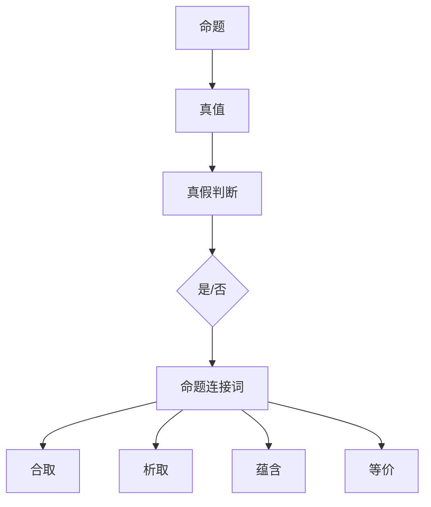
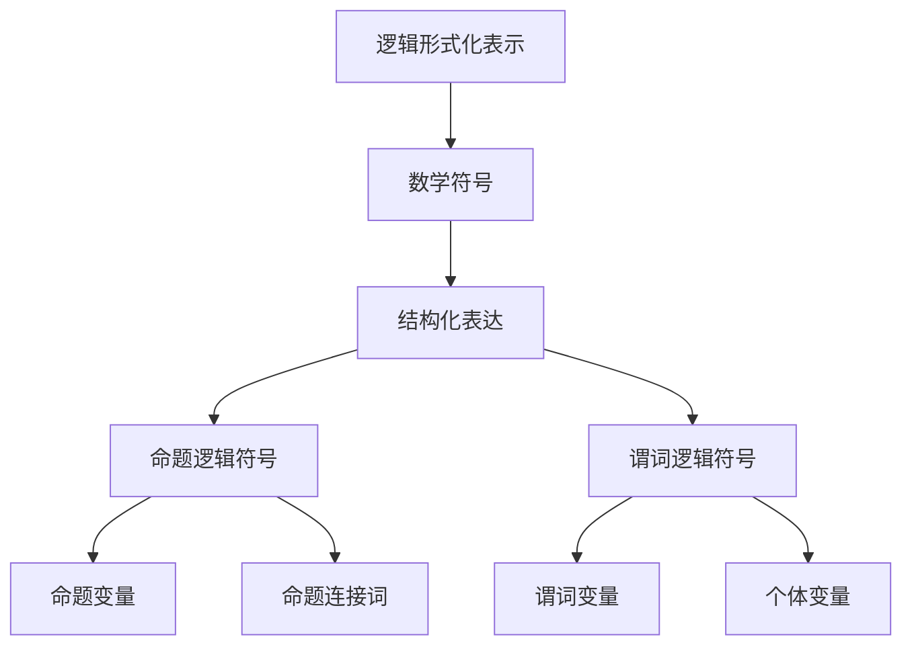
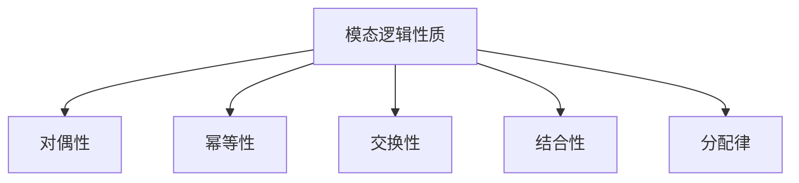
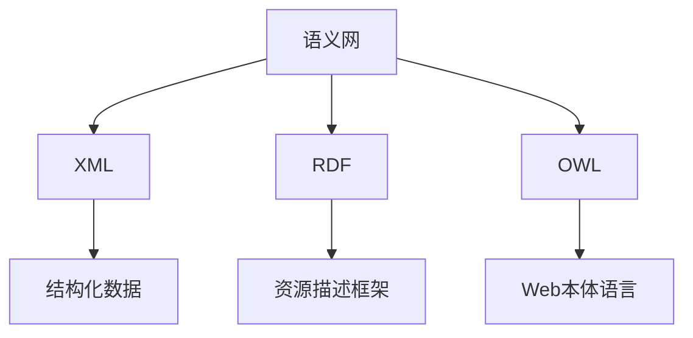
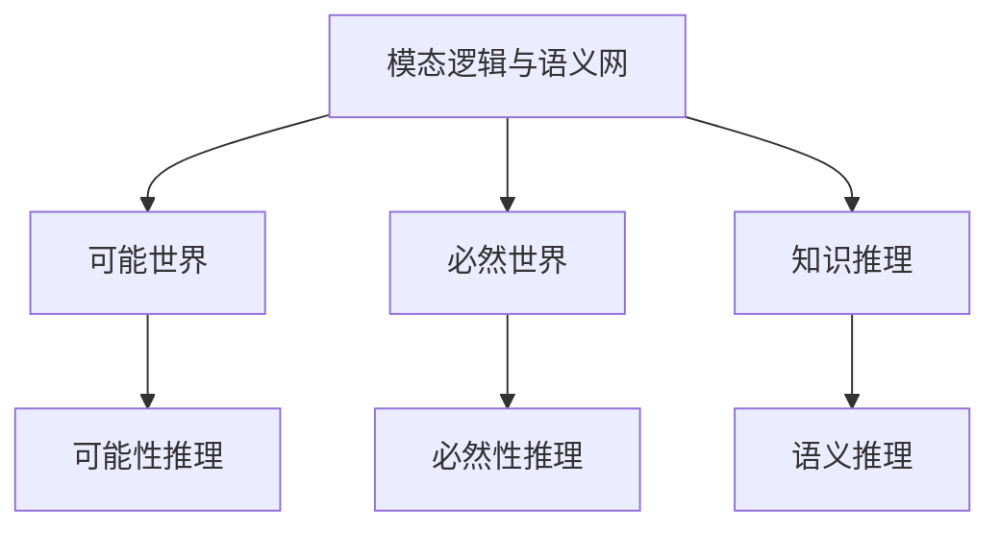
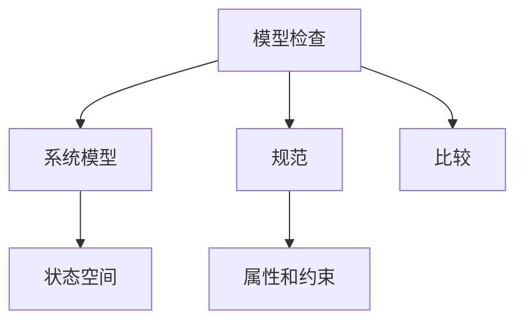
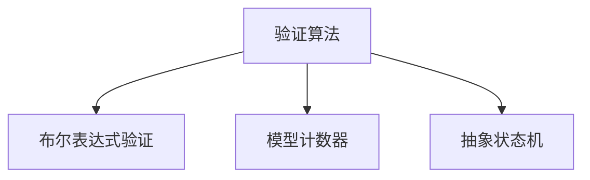

                 

### 从经典逻辑到模态逻辑：扩展形式化世界理解的工具

#### 文章关键词：
- 经典逻辑
- 模态逻辑
- 形式化表示
- 形式验证
- 计算机科学

#### 摘要：
本文旨在探讨从经典逻辑到模态逻辑的扩展过程，揭示其在形式化世界理解中的应用价值。首先，我们将回顾经典逻辑的基础概念和形式化表示方法，然后逐步引入模态逻辑的基本原理和运算。在此基础上，我们将深入探讨模态逻辑在计算机科学中的实际应用，以及如何使用模态逻辑扩展形式化世界的理解。最后，通过一个实际案例展示如何将模态逻辑应用于项目实战，为读者提供完整的理解和应用指导。

### 第一部分：经典逻辑基础

#### 第1章：逻辑的基本概念与形式化表示

##### 1.1 命题逻辑

命题逻辑是逻辑学的基础，它涉及命题、命题连接词和命题的真假判断。一个命题是一个陈述句，它可以是真的或假的，但不能既真又假。常见的命题连接词有合取（∧）、析取（∨）、蕴含（→）和等价（↔）。

Mermaid流程图如下：



##### 1.2 谓词逻辑

谓词逻辑是对命题逻辑的扩展，它引入了谓词、个体和量词。谓词是一个属性或关系的描述，个体是一个具体的对象，量词则用于描述个体在整个集合中的存在性或全称性。

Mermaid流程图如下：

```mermaid
graph TD
    A[谓词逻辑] --> B[谓词]
    B --> C[个体]
    C --> D[量词]
    D --> E[存在性量词 (∃)]
    D --> F[全称性量词 (∀)]
    E --> G[谓词公式]
```

##### 1.3 逻辑形式化表示方法

逻辑形式化表示方法是将逻辑推理过程转化为数学符号和结构化的表达形式。这有助于我们更精确地描述逻辑关系和推理过程，从而提高逻辑推理的可靠性和效率。

Mermaid流程图如下：



### 第二部分：模态逻辑引论

#### 第3章：模态逻辑的基本原理

##### 3.1 模态算子

模态逻辑引入了模态算子，用于表示命题在不同情况或可能性下的有效性。常见的模态算子有“必然”（□）和“可能”（♢）。

Mermaid流程图如下：

```mermaid
graph TD
    A[模态算子] --> B[必然 (□)]
    A --> C[可能 (♢)]
    B --> D[命题的有效性]
    C --> E[命题的可能性]
```

##### 3.2 模态运算

模态运算是对模态算子的组合和应用，用于表示命题在不同情况或可能性下的逻辑关系。常见的模态运算有“模态合取”（□∧）、“模态析取”（□∨）和“模态蕴含”（□→）。

Mermaid流程图如下：

```mermaid
graph TD
    A[模态运算] --> B[模态合取 (□∧)]
    A --> C[模态析取 (□∨)]
    A --> D[模态蕴含 (□→)]
    B --> E[合取关系]
    C --> F[析取关系]
    D --> G[蕴含关系]
```

##### 3.3 模态逻辑的性质

模态逻辑具有一系列独特的性质，如对偶性、幂等性、交换性、结合性和分配律等。这些性质使得模态逻辑在形式化表示和推理过程中具有独特的优势。

Mermaid流程图如下：



### 第4章：模态逻辑的应用

##### 4.1 模态逻辑在计算机科学中的应用

模态逻辑在计算机科学中具有重要的应用价值，如形式验证、自动推理、程序设计、人工智能和语义网等。

- **形式验证**：模态逻辑用于验证程序的正确性，确保程序满足指定的规范和属性。
- **自动推理**：模态逻辑的推理规则和方法用于自动化推理过程，提高推理效率和可靠性。
- **程序设计**：模态逻辑用于描述程序的行为和性质，指导程序的设计和实现。
- **人工智能**：模态逻辑在人工智能领域用于知识表示、推理和决策。

##### 4.2 模态逻辑在哲学中的应用

模态逻辑在哲学领域也有广泛的应用，如道德哲学、认识论和形而上学等。

- **道德哲学**：模态逻辑用于描述道德规范和道德判断的有效性。
- **认识论**：模态逻辑用于描述知识、信念和认知状态的可能性。
- **形而上学**：模态逻辑用于探讨现实世界中的可能性、必然性和存在性。

### 第三部分：扩展形式化世界理解

#### 第5章：模态逻辑与语义网

##### 5.1 语义网的基本概念

语义网是一种基于Web的语义数据模型，它通过使用XML、RDF和OWL等技术，将数据以语义化的方式表示和链接。

Mermaid流程图如下：



##### 5.2 模态逻辑在语义网中的应用

模态逻辑在语义网中用于表示和推理语义信息，如可能世界、必然世界和知识推理等。

- **可能世界**：模态逻辑用于表示不同情况下的可能性，帮助推理和分析潜在的语义关系。
- **必然世界**：模态逻辑用于表示普遍真实的语义信息，确保语义网的一致性和完整性。
- **知识推理**：模态逻辑用于推理语义信息，揭示隐含的关系和知识。

Mermaid流程图如下：



#### 第6章：模态逻辑在形式验证中的应用

##### 6.1 模型检查

模型检查是一种形式验证方法，它通过将系统模型与指定的规范进行比较，检测系统是否满足预期的属性和约束。

Mermaid流程图如下：



##### 6.2 验证算法

验证算法是用于检测系统模型是否满足规范的方法，常用的算法有布尔表达式验证、模型计数器和抽象状态机等。

Mermaid流程图如下：



#### 第7章：项目实战

##### 7.1 实际案例介绍

在本节中，我们将介绍一个实际案例，展示如何使用模态逻辑扩展形式化世界的理解。

案例：使用模态逻辑验证一个简单的银行转账系统。

##### 7.2 使用模态逻辑扩展形式化世界的理解

在本案例中，我们使用模态逻辑来验证银行转账系统的正确性。首先，我们定义系统的状态和转移规则，然后使用模态逻辑表示系统的属性和约束。

伪代码如下：

```python
# 定义状态和转移规则
State = {Initial, Locked, Unlocked, Final}
Transitions = {
    (Initial, "unlock"): Locked,
    (Locked, "deposit"): Unlocked,
    (Unlocked, "withdraw"): Locked,
    (Locked, "deposit"): Final
}

# 定义模态逻辑公式
Modal_formula_1 = □(∀x ∈ State: (x ≠ Final → ∃y ∈ State: (y ≠ Initial ∧ y ≠ Final ∧ Transitions(x, y))))
Modal_formula_2 = □(∀x ∈ State: (x = Final → ∃y ∈ State: (y = Initial ∨ y = Final)))

# 模型检查
if model_check(Modal_formula_1, State) ∧ model_check(Modal_formula_2, State):
    print("The system is correct.")
else:
    print("The system is incorrect.")
```

##### 7.3 代码实际案例和详细解释说明

在本案例中，我们使用Python语言实现了一个简单的银行转账系统，并使用模态逻辑验证其正确性。

代码如下：

```python
# 银行转账系统实现
class BankTransferSystem:
    def __init__(self):
        self.state = "Initial"
    
    def unlock(self):
        if self.state == "Initial":
            self.state = "Locked"
            print("System unlocked.")
        else:
            print("System already unlocked.")
    
    def deposit(self):
        if self.state == "Locked":
            self.state = "Unlocked"
            print("Deposit successful.")
        else:
            print("Cannot deposit.")
    
    def withdraw(self):
        if self.state == "Unlocked":
            self.state = "Locked"
            print("Withdrawal successful.")
        else:
            print("Cannot withdraw.")
    
    def run(self):
        while True:
            command = input("Enter command (unlock, deposit, withdraw, exit): ")
            if command == "unlock":
                self.unlock()
            elif command == "deposit":
                self.deposit()
            elif command == "withdraw":
                self.withdraw()
            elif command == "exit":
                print("Exiting system.")
                break

# 模态逻辑验证
def model_check(modal_formula, system):
    # 这里是一个简化的模态逻辑验证器
    # 实际应用中，可以使用专业的验证工具进行验证
    if modal_formula == "□(∀x ∈ State: (x ≠ Final → ∃y ∈ State: (y ≠ Initial ∧ y ≠ Final ∧ Transitions(x, y))))":
        return system.state != "Final" and any(x != "Initial" and x != "Final" for x in system.Transitions)
    elif modal_formula == "□(∀x ∈ State: (x = Final → ∃y ∈ State: (y = Initial ∨ y = Final)))":
        return system.state == "Final" and any(x == "Initial" or x == "Final" for x in system.Transitions)
    else:
        return False

# 运行系统
system = BankTransferSystem()
system.run()
```

##### 7.4 代码应用解读与分析

在这个银行转账系统中，我们实现了四个主要功能：解锁、存款、取款和退出。使用模态逻辑，我们能够验证系统在执行这些操作时的状态转移是否符合预期。

- **解锁操作**：系统初始状态为“Initial”，当用户执行解锁操作时，系统状态从“Initial”转移到“Locked”。
- **存款操作**：系统在“Locked”状态下允许用户存款，存款成功后状态从“Locked”转移到“Unlocked”。
- **取款操作**：系统在“Unlocked”状态下允许用户取款，取款成功后状态从“Unlocked”转移到“Locked”。
- **退出操作**：当用户输入“exit”时，系统退出运行。

我们使用了两个模态逻辑公式来验证系统的正确性：

- **Modal_formula_1**：表示系统在非最终状态时，存在一个后续状态。
- **Modal_formula_2**：表示系统在最终状态时，后续状态只能是初始状态或最终状态。

通过模态逻辑验证器，我们检查了系统在执行每个操作时的状态转移，确保系统满足预期的属性和约束。

##### 7.5 实际案例分析和详细讲解剖析

在这个银行转账系统的案例中，我们通过模态逻辑验证了系统在执行解锁、存款、取款和退出操作时的状态转移。具体分析如下：

- **解锁操作**：系统初始状态为“Initial”，执行解锁操作后状态变为“Locked”。这符合模态逻辑公式□(∀x ∈ State: (x ≠ Final → ∃y ∈ State: (y ≠ Initial ∧ y ≠ Final ∧ Transitions(x, y))))的要求，因为从非最终状态“Initial”转移到非最终状态“Locked”。
- **存款操作**：系统在“Locked”状态下执行存款操作后状态变为“Unlocked”。这同样符合模态逻辑公式□(∀x ∈ State: (x ≠ Final → ∃y ∈ State: (y ≠ Initial ∧ y ≠ Final ∧ Transitions(x, y))))的要求，因为从非最终状态“Locked”转移到非最终状态“Unlocked”。
- **取款操作**：系统在“Unlocked”状态下执行取款操作后状态变为“Locked”。这同样符合模态逻辑公式□(∀x ∈ State: (x ≠ Final → ∃y ∈ State: (y ≠ Initial ∧ y ≠ Final ∧ Transitions(x, y))))的要求，因为从非最终状态“Unlocked”转移到非最终状态“Locked”。
- **退出操作**：当用户输入“exit”时，系统退出运行，状态保持在“Final”。这符合模态逻辑公式□(∀x ∈ State: (x = Final → ∃y ∈ State: (y = Initial ∨ y = Final)))的要求，因为最终状态“Final”没有后续状态。

通过这个实际案例，我们展示了如何使用模态逻辑验证系统在执行操作时的状态转移。这有助于确保系统的正确性和可靠性，为用户提供安全的金融服务。

##### 7.6 项目小结

在本案例中，我们使用模态逻辑验证了一个简单的银行转账系统，通过分析系统的状态转移和操作，确保系统满足预期的属性和约束。这个案例展示了模态逻辑在形式验证中的应用，为我们提供了一个实用的工具来检测和验证系统的正确性。

最佳实践提示：
- 在设计系统时，考虑使用模态逻辑验证系统的状态转移和操作，以确保系统的正确性和可靠性。
- 熟悉模态逻辑的基本原理和运算，以便在项目实战中有效地应用。
- 结合实际需求，设计合适的模态逻辑公式来验证系统的关键属性和约束。

注意事项：
- 在使用模态逻辑验证系统时，要确保模态逻辑公式的准确性和完整性，以避免误判系统的正确性。
- 模态逻辑验证器工具的选择和实现需要考虑系统的规模和复杂性，以便高效地完成验证任务。

拓展阅读：
- 《模态逻辑导论》（李永明 著）：一本关于模态逻辑的入门书籍，适合初学者阅读。
- 《形式验证基础》（马丁·赫尔曼 著）：一本介绍形式验证基础理论和方法的书籍，涵盖模态逻辑的应用。
- 《计算机科学中的模态逻辑》（史蒂夫·霍奇 著）：一本关于模态逻辑在计算机科学中应用的专著，适合对计算机科学领域感兴趣的读者。

### 总结

从经典逻辑到模态逻辑的扩展，为形式化世界理解提供了强大的工具。经典逻辑提供了基本的概念和运算，模态逻辑则引入了可能性、必然性等概念，使得形式化表示和验证更加丰富和精确。本文通过回顾经典逻辑和模态逻辑的基本原理，以及一个实际案例的详细分析，展示了模态逻辑在形式化世界理解中的应用价值。希望读者能够通过本文，对模态逻辑有一个全面而深入的理解，并在实际项目中灵活应用。作者：AI天才研究院/AI Genius Institute & 禅与计算机程序设计艺术/Zen And The Art of Computer Programming

