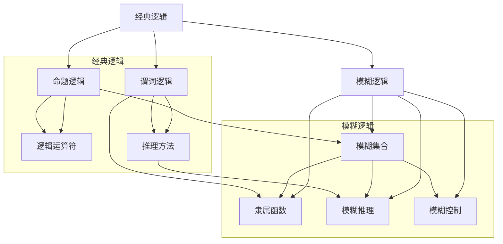

                 

### 文章标题

《从经典逻辑到模糊逻辑：处理不精确世界的新思路》

本文将深入探讨经典逻辑与模糊逻辑的演变，并分析如何通过模糊逻辑处理现实世界中的不精确性。首先，我们将回顾经典逻辑的基础，解释其定义、历史背景和应用领域。接下来，本文将引入模糊逻辑的概念，详细阐述其起源、基本原理和数学基础。随后，文章将探讨模糊逻辑在不同工程和人工智能应用中的实际应用，并通过项目实战演示其操作流程。最后，本文将对比经典逻辑与模糊逻辑，总结模糊逻辑的优势与局限性，并展望其未来发展趋势。通过本文的阅读，读者将获得全面的理解，并掌握在复杂环境中应用模糊逻辑的技巧。

### 关键词

- 经典逻辑
- 模糊逻辑
- 隶属函数
- 推理方法
- 应用领域

### 摘要

本文旨在介绍并对比经典逻辑和模糊逻辑，阐述如何在复杂、不精确的环境中应用模糊逻辑。首先，我们回顾了经典逻辑的基础概念和数学原理，介绍了其应用领域。接着，我们探讨了模糊逻辑的定义、起源和基本原理，并详细讲解了隶属函数和模糊逻辑的数学基础。随后，文章通过具体应用场景和项目实战，展示了模糊逻辑在实际工程和人工智能中的应用。最后，本文对比了经典逻辑和模糊逻辑，总结了模糊逻辑的优势与局限性，并展望了其未来发展方向。通过本文的阅读，读者将对模糊逻辑有更深入的理解，并学会在现实问题中应用这一工具。

## 经典逻辑概述

经典逻辑，又称传统逻辑，是逻辑学的基石，其定义可以追溯到亚里士多德的《形而上学》一书。经典逻辑是一门研究推理和论证有效性的学科，旨在确定一个陈述或命题的真假性。其基本概念包括命题、逻辑运算、推理规则和论证结构。经典逻辑的发展历程可以追溯到古希腊，经过中世纪和现代哲学的丰富，最终在20世纪得到了系统化和形式化的发展。

经典逻辑的主要历史背景可以追溯到公元前4世纪的古希腊，当时亚里士多德提出了命题逻辑和谓词逻辑的概念。这些理论为后来的逻辑学研究奠定了基础。到了中世纪，逻辑学进一步发展，特别是在阿拉伯学者的工作中得到了极大的推动。进入现代，弗雷格和罗素等数学家通过符号逻辑的形式化方法，为逻辑学注入了新的活力。到了20世纪，逻辑学在计算机科学和人工智能领域得到了广泛应用。

经典逻辑的应用领域非常广泛，主要包括以下几个方面：

1. **数学与哲学**：经典逻辑是数学和哲学研究的基础，用于验证数学定理和哲学论断的有效性。
2. **计算机科学**：在程序设计和算法分析中，经典逻辑用于验证程序的逻辑正确性。
3. **人工智能**：经典逻辑在知识表示和推理系统中起着核心作用，用于构建智能代理和决策支持系统。
4. **法律和经济学**：在法律论证和经济学模型中，经典逻辑用于推导和验证结论的正确性。

经典逻辑的基本概念包括命题、逻辑运算和推理规则。命题是指可以判断真假的陈述，逻辑运算包括合取（AND）、析取（OR）和蕴含（IF-THEN），推理规则则是用于推导新命题的规则，如Modus Ponens和Modus Tollens。

经典逻辑的核心原则是二值性，即一个命题要么真要么假，不存在其他可能性。这种严格的二值性在处理模糊性和不确定性时显得力不从心。然而，经典逻辑在形式化推理、证明理论和形式验证中具有不可替代的重要性。它为我们提供了一种清晰、精确的思维方式，使我们能够从已知的事实中推导出新的结论。

总之，经典逻辑是逻辑学的重要组成部分，其概念和原理广泛应用于多个学科领域。尽管它存在一定的局限性，但在形式化推理和证明理论中仍然发挥着关键作用。

## 经典逻辑的数学基础

经典逻辑的数学基础主要包括命题逻辑、谓词逻辑、逻辑运算符和推理方法。这些概念和方法构成了经典逻辑的核心，为逻辑推理提供了严谨的数学工具。

### 命题逻辑

命题逻辑是经典逻辑的基础，主要研究命题的真假性。命题是能够判断为真或假的陈述，通常用大写字母表示，如P、Q和R。命题逻辑中的基本元素是原子命题，它们是不可分割的命题。原子命题通过逻辑运算符组合成复合命题，常见的逻辑运算符包括合取（AND），表示为 ∧；析取（OR），表示为 ∨；以及蕴含（IF-THEN），表示为 →。

复合命题的真假值由其组成部分的真假值通过特定的逻辑运算规则确定。例如，对于命题P ∧ Q，只有当P和Q都为真时，复合命题才为真；对于命题P ∨ Q，只要P或Q中有一个为真，复合命题就为真。蕴含命题P → Q，当P为真且Q为假时，复合命题为假，其他情况下都为真。

### 谓词逻辑

谓词逻辑扩展了命题逻辑，用于处理更复杂的逻辑关系。谓词逻辑中的基本元素包括个体、属性和关系。谓词是对个体的某种性质或关系的陈述，通常用小写字母加上括号表示，如P(x)、Q(y)和R(z)。P(x)表示x具有性质P，Q(y)表示y具有性质Q，R(z)表示z与z具有关系R。

谓词逻辑中的量化符号“∀”和“∃”分别表示全称量词和存在量词。全称量词“∀”表示对于所有的个体，命题P(x)都成立；存在量词“∃”表示存在至少一个个体，使得命题P(x)成立。谓词逻辑中的命题通常表示为形式化的数学表达式，如∀xP(x)和∃xP(x)。

### 逻辑运算符

逻辑运算符是构成复合命题的基本元素，包括合取（∧）、析取（∨）、蕴含（→）和等价（↔）。合取运算符 ∧ 表示两个命题同时为真，析取运算符 ∨ 表示两个命题中至少有一个为真，蕴含运算符 → 表示如果前一个命题为真，则后一个命题也为真，等价运算符 ↔ 表示两个命题的真假值相同。

这些逻辑运算符可以通过真值表来描述其运算规则。例如，合取运算符的真值表如下：

| P | Q | P ∧ Q |
|---|---|-------|
| 0 | 0 |   0   |
| 0 | 1 |   0   |
| 1 | 0 |   0   |
| 1 | 1 |   1   |

从真值表中可以看出，只有当P和Q都为真时，P ∧ Q的结果才为真，其他情况下结果均为假。

### 推理方法

经典逻辑中的推理方法包括演绎推理和归纳推理。演绎推理从一般到特殊，通过逻辑运算和推理规则，从已知的前提推导出结论。常见的推理规则包括Modus Ponens（如果P则Q，P为真，则Q为真）和Modus Tollens（如果P则Q，Q为假，则P为假）。归纳推理从特殊到一般，通过观察个别案例，归纳出一般规律。

演绎推理的典型例子是数学证明，通过一系列的逻辑步骤，从已知的基本事实和公理推导出新的定理。归纳推理在科学研究中的应用非常广泛，通过观察大量数据，归纳出普遍规律。

### 结论

经典逻辑的数学基础为我们提供了处理逻辑推理问题的强大工具。从命题逻辑到谓词逻辑，再到逻辑运算符和推理方法，每一个概念和工具都在逻辑体系中扮演着重要的角色。通过这些数学基础，我们能够更加严谨和系统地进行逻辑推理，确保结论的可靠性和正确性。在接下来的章节中，我们将进一步探讨模糊逻辑的概念和数学基础，以及两者之间的差异和联系。

## 模糊逻辑的起源与发展

模糊逻辑的发展源于对经典逻辑在处理不精确和模糊性问题时局限性的认识。传统经典逻辑基于二值逻辑，即命题要么为真要么为假，但在现实世界中，很多情况并不是这样简单。例如，温度的“冷”和“热”之间没有明确的界限，人的“高”和“矮”也如此。经典逻辑无法很好地处理这些模糊和不精确的概念，因此，模糊逻辑应运而生。

模糊逻辑的起源可以追溯到1965年，由美国加州伯克利分校的自动控制专家L.A.扎德（L.A. Zadeh）首次提出。扎德在研究自动控制时，发现传统逻辑方法在处理系统不确定性和模糊性方面存在严重不足。他提出了模糊集合的概念，通过引入隶属度来表示元素属于某个集合的程度，从而解决了经典逻辑二值性带来的限制。扎德的工作为模糊逻辑的发展奠定了基础。

自模糊逻辑诞生以来，它得到了广泛的研究和应用。在20世纪70年代，模糊逻辑逐渐应用于工业控制、家电产品和决策支持系统。模糊逻辑的应用范围不断扩大，包括机器人控制、智能交通系统、医疗诊断和人工智能等领域。进入21世纪，随着计算机技术和人工智能的快速发展，模糊逻辑在复杂系统和大数据分析中的应用更加广泛，成为解决不确定性和模糊性问题的重要工具。

模糊逻辑的发展历程中，许多学者做出了重要贡献。例如，日本控制工程师高木文雄（Fukuyama Fumio）在1974年提出了模糊控制器的基本架构，使模糊逻辑在工业控制中得到了广泛应用。此外，加拿大多伦多大学的李宏毅（H.L. Lee）在1981年提出的模糊神经网络，为模糊逻辑在人工智能中的应用开辟了新的方向。

总的来说，模糊逻辑的起源和发展是对传统逻辑理论的重要补充。它通过引入隶属度和模糊集合，解决了经典逻辑在处理不精确世界中的局限性，为复杂系统和人工智能领域提供了强大的工具。

### 模糊集合与隶属函数

模糊集合是模糊逻辑的基础，它通过引入隶属度来表示元素属于某个集合的程度，从而解决了传统经典逻辑在处理模糊性问题上的局限性。与经典集合不同，模糊集合中的元素可以有不同程度的“属于”关系，而不是简单的“属于”或“不属于”。

#### 模糊集合的定义

模糊集合是由扎德（L.A. Zadeh）在1965年首次提出的。一个模糊集合可以形式化地定义为：

\[ F = \{ (x, \mu_F(x)) \mid x \in U \} \]

其中，\( F \) 是一个模糊集合，\( U \) 是定义域，通常是一个普通的集合。每个元素 \( x \in U \) 对应一个隶属函数 \( \mu_F(x) \)，表示 \( x \) 属于模糊集合 \( F \) 的程度，取值范围在 [0, 1] 之间。隶属函数 \( \mu_F(x) \) 是一个刻画元素属于模糊集合 \( F \) 的程度的函数。

#### 隶属函数的类型

隶属函数是模糊集合的核心，其类型直接影响模糊集合的性质和应用。常见的隶属函数类型包括：

1. **三角隶属函数**：三角隶属函数是一种简单的隶属函数，其形状类似于三角形。它的形式如下：

   \[ \mu_T(x) =
   \begin{cases}
   0 & \text{if } x \leq a \\
   \frac{x - a}{b - a} & \text{if } a < x \leq b \\
   1 & \text{if } x > b
   \end{cases}
   \]

   其中，\( a \) 和 \( b \) 是三角隶属函数的两个参数，定义了隶属函数的起点和终点。

2. **梯形隶属函数**：梯形隶属函数是对三角隶属函数的扩展，它的形状类似于梯形。它的形式如下：

   \[ \mu_T(x) =
   \begin{cases}
   0 & \text{if } x \leq a \\
   \frac{x - a}{b - a} & \text{if } a < x \leq b \\
   \frac{c - x}{c - d} & \text{if } b < x \leq c \\
   1 & \text{if } x > c
   \end{cases}
   \]

   其中，\( a \)、\( b \)、\( c \) 和 \( d \) 是梯形隶属函数的四个参数，分别定义了隶属函数的不同部分。

3. **高斯隶属函数**：高斯隶属函数是一种基于高斯分布的隶属函数，其形式如下：

   \[ \mu_G(x) = \frac{1}{\sqrt{2\pi\sigma^2}} e^{-\frac{(x-\mu)^2}{2\sigma^2}} \]

   其中，\( \mu \) 是隶属函数的均值，\( \sigma \) 是隶属函数的标准差。高斯隶属函数在处理连续变量时特别有效。

4. **分段线性隶属函数**：分段线性隶属函数是由多个线段组成的隶属函数，适用于离散或分段定义的变量。其形式如下：

   \[ \mu_L(x) =
   \begin{cases}
   \text{线性函数1} & \text{if } x \in [a, b] \\
   \text{线性函数2} & \text{if } x \in [b, c]
   \end{cases}
   \]

   其中，\( a \)、\( b \) 和 \( c \) 是分段点的参数，每个分段都由一条直线定义。

#### 模糊集合的运算

模糊集合的运算包括并集、交集、补集和广义交。这些运算与经典集合的运算类似，但引入了隶属度的概念。

1. **并集**：模糊集合 \( F \) 和 \( G \) 的并集 \( F \cup G \) 定义为：

   \[ \mu_{F \cup G}(x) = \max(\mu_F(x), \mu_G(x)) \]

   即对于任意的 \( x \in U \)，\( F \cup G \) 的隶属度是 \( F \) 和 \( G \) 的隶属度的最大值。

2. **交集**：模糊集合 \( F \) 和 \( G \) 的交集 \( F \cap G \) 定义为：

   \[ \mu_{F \cap G}(x) = \min(\mu_F(x), \mu_G(x)) \]

   即对于任意的 \( x \in U \)，\( F \cap G \) 的隶属度是 \( F \) 和 \( G \) 的隶属度的最小值。

3. **补集**：模糊集合 \( F \) 的补集 \( F^c \) 定义为：

   \[ \mu_{F^c}(x) = 1 - \mu_F(x) \]

   即对于任意的 \( x \in U \)，\( F^c \) 的隶属度是 \( F \) 的隶属度的补数。

4. **广义交**：对于任意两个模糊集合 \( F \) 和 \( G \)，其广义交 \( F \land G \) 定义为：

   \[ \mu_{F \land G}(x) = \min(\mu_F(x), \mu_G(x), 1) \]

   广义交是为了避免模糊集合的隶属度超过1。

通过这些运算，我们可以有效地处理模糊集合之间的关系，从而在复杂的模糊环境中进行推理和决策。

总的来说，模糊集合和隶属函数为模糊逻辑提供了强大的工具，使我们能够处理现实世界中的不确定性和模糊性。在接下来的章节中，我们将进一步探讨模糊逻辑的数学基础和其在实际应用中的具体实现。

### 模糊逻辑的数学基础

模糊逻辑的数学基础是建立在其核心概念和运算符上的，这些概念和运算符为模糊推理提供了理论基础。以下是模糊逻辑中的主要数学基础，包括模糊逻辑运算、模糊推理和模糊控制。

#### 模糊逻辑运算

模糊逻辑运算包括模糊合取（AND）、模糊析取（OR）、模糊蕴含（IF-THEN）和模糊等价（↔）。这些运算符在模糊逻辑中起到了类似传统逻辑运算的作用，但它们引入了隶属度的概念，从而能够处理模糊性。

1. **模糊合取（AND）**：模糊合取运算表示两个模糊命题同时为真的程度。其运算规则为：

   \[ \mu_{F \land G}(x) = \min(\mu_F(x), \mu_G(x)) \]

   其中，\( \mu_F(x) \) 和 \( \mu_G(x) \) 分别是模糊集合 \( F \) 和 \( G \) 的隶属函数。

2. **模糊析取（OR）**：模糊析取运算表示两个模糊命题中至少一个为真的程度。其运算规则为：

   \[ \mu_{F \lor G}(x) = \max(\mu_F(x), \mu_G(x)) \]

   其中，\( \mu_F(x) \) 和 \( \mu_G(x) \) 分别是模糊集合 \( F \) 和 \( G \) 的隶属函数。

3. **模糊蕴含（IF-THEN）**：模糊蕴含运算表示前件为真时后件也为真的程度。其运算规则为：

   \[ \mu_{F \rightarrow G}(x) = \mu_G(\mu_F(x)) \]

   其中，\( \mu_F(x) \) 是模糊集合 \( F \) 的隶属函数，\( \mu_G(y) \) 是模糊集合 \( G \) 的隶属函数，\( y \) 是 \( x \) 通过模糊蕴含运算得到的值。

4. **模糊等价（↔）**：模糊等价运算表示两个模糊命题真假程度相同。其运算规则为：

   \[ \mu_{F \leftrightarrow G}(x) = \mu_{F \land G}(x) \land \mu_{F \rightarrow G}(x) \]

   其中，\( \mu_F(x) \) 和 \( \mu_G(x) \) 分别是模糊集合 \( F \) 和 \( G \) 的隶属函数。

#### 模糊推理

模糊推理是模糊逻辑的核心部分，它通过模糊逻辑运算对模糊命题进行推理。模糊推理的主要方法包括基于模糊集合的推理和基于模糊规则的推理。

1. **基于模糊集合的推理**：基于模糊集合的推理通过模糊集合的运算来推导新的模糊集合。例如，给定两个模糊集合 \( F \) 和 \( G \)，我们可以通过模糊合取、模糊析取等运算得到新的模糊集合。

2. **基于模糊规则的推理**：基于模糊规则的推理是通过模糊逻辑运算来处理模糊规则集合。模糊规则通常表示为“如果...那么...”的形式，其形式为：

   \[ R: \text{条件} \rightarrow \text{结论} \]

   其中，条件和结论都是模糊集合。模糊推理过程包括以下步骤：

   - **模糊化**：将输入变量转换为模糊集合。
   - **模糊推理**：根据模糊规则进行推理，计算输出变量的隶属度。
   - **去模糊化**：将输出变量的模糊集合转换为具体的数值或决策。

   一个简单的模糊推理过程可以用以下伪代码表示：

   ```plaintext
   function FuzzyReasoning(inputA, inputB, ruleBase):
       Fuzzify(inputA)
       Fuzzify(inputB)
       
       for each rule in ruleBase:
           if (Fuzzify(rule.condition) ∧ Fuzzify(rule.antecedent)):
               conclusionMembership = Min(Min(Fuzzify(inputA), Fuzzify(inputB)), 1)
       
       Defuzzify(conclusionMembership)
       return output
   ```

#### 模糊控制

模糊控制是模糊逻辑在工程应用中的核心，它通过模糊逻辑进行决策和控制系统。模糊控制器通常包括以下组件：

1. **模糊化器**：将输入变量转换为模糊集合。
2. **规则库**：包含模糊规则，用于描述系统的控制策略。
3. **推理机**：根据模糊规则进行推理，计算输出变量的隶属度。
4. **去模糊化器**：将输出变量的模糊集合转换为具体的控制输出。

一个简单的模糊控制器可以使用以下伪代码实现：

```plaintext
function FuzzyControl(inputVariable):
    fuzzify(inputVariable)
    for each rule in ruleBase:
        if (fuzzify(rule.condition)):
            outputMembership += rule.effect * fuzzify(rule.antecedent)
    defuzzify(outputMembership)
    return controlSignal
```

通过这些数学基础，模糊逻辑提供了一种处理不精确和模糊性的有效方法。在接下来的章节中，我们将探讨模糊逻辑在不同领域中的应用，并通过实际项目来展示其应用过程。

### 模糊逻辑在工程控制中的应用

模糊逻辑在工程控制中的应用非常广泛，其核心在于利用模糊集合和模糊推理方法对复杂系统进行控制和调节，从而提高系统的自适应性和鲁棒性。以下是几个典型的应用场景和实现过程。

#### 模糊控制器的设计

模糊控制器的设计过程包括模糊化器、规则库、推理机和去模糊化器的构建。以下是一个简单的模糊控制器设计流程：

1. **定义输入和输出变量**：根据控制需求，确定系统的输入变量（如温度、压力等）和输出变量（如电机速度、阀门开度等）。

2. **确定隶属函数**：为每个输入和输出变量设计合适的隶属函数，常见的有三角隶属函数、梯形隶属函数和高斯隶属函数。这些隶属函数用于表示输入和输出变量在不同区间内的隶属度。

3. **构建规则库**：根据控制目标和系统特性，构建模糊规则库。模糊规则通常表示为“如果...那么...”的形式。例如，“如果温度高且压力低，那么电机速度增加”。

4. **设计推理机**：根据模糊规则进行推理，计算输出变量的隶属度。推理过程通常采用最小-最大方法，即取输入变量隶属度与规则条件的交集，再与规则结论的并集。

5. **去模糊化**：将输出变量的模糊集合转换为具体的控制输出。常见的方法有重心法、最大隶属度法和中位数法。

以下是一个简单的模糊控制器伪代码实现：

```plaintext
function FuzzyController(inputTemperature, inputPressure):
    fuzzifyTemperature = TriangularMembershipFunction(inputTemperature)
    fuzzifyPressure = TriangularMembershipFunction(inputPressure)

    motorSpeedRules = [
        {condition: ["highTemperature", "lowPressure"], effect: ["highSpeed"]},
        {condition: ["mediumTemperature", "mediumPressure"], effect: ["mediumSpeed"]},
        {condition: ["lowTemperature", "highPressure"], effect: ["lowSpeed"]}
    ]

    for rule in motorSpeedRules:
        if (fuzzifyTemperature highTemperature ∧ fuzzifyPressure lowPressure):
            outputMembership = Min(fuzzifyTemperature highTemperature, fuzzifyPressure lowPressure)
            outputMembership = Max(outputMembership, rule.effect highSpeed)

    outputSpeed = Defuzzify(outputMembership)
    return outputSpeed
```

#### 模糊逻辑在PID控制中的应用

PID（比例-积分-微分）控制器是控制工程中常用的经典控制器，它通过调整比例、积分和微分三个参数来调节系统的响应。模糊逻辑可以用于优化PID参数，提高控制系统的性能。

1. **输入变量**：输入变量可以是系统的偏差（e）和偏差的变化率（de）。

2. **隶属函数**：为每个输入变量设计合适的隶属函数，通常采用三角隶属函数。

3. **规则库**：根据控制目标和系统特性，构建模糊规则库。例如，“如果偏差大且偏差变化率大，则比例大、积分大、微分小”。

4. **推理机**：根据模糊规则进行推理，计算每个PID参数的隶属度。

5. **去模糊化**：将输出变量的模糊集合转换为具体的PID参数值。

以下是一个简单的模糊PID控制器伪代码实现：

```plaintext
function FuzzyPIDController(e, de):
    fuzzifyE = TriangularMembershipFunction(e)
    fuzzifyDe = TriangularMembershipFunction(de)

    pidParamsRules = [
        {condition: ["largeE", "largeDe"], effect: ["largeP", "largeI", "smallD"]},
        {condition: ["mediumE", "mediumDe"], effect: ["mediumP", "mediumI", "mediumD"]},
        {condition: ["smallE", "smallDe"], effect: ["smallP", "smallI", "largeD"]}
    ]

    for rule in pidParamsRules:
        if (fuzzifyE largeE ∧ fuzzifyDe largeDe):
            outputMembership = Min(fuzzifyE largeE, fuzzifyDe largeDe)
            outputMembership = Max(outputMembership, rule.effect largeP)

    Kp = Defuzzify(outputMembership)
    Ki = Defuzzify(outputMembership)
    Kd = Defuzzify(outputMembership)
    
    return Kp, Ki, Kd
```

#### 模糊逻辑在机器人控制中的应用

机器人控制中，模糊逻辑可以用于路径规划、避障和姿态控制等任务。以下是几个应用实例：

1. **路径规划**：使用模糊逻辑可以根据环境中的障碍物和目标点，动态调整机器人的路径。

2. **避障**：通过模糊逻辑处理来自传感器的不精确数据，实时调整机器人的运动方向和速度，以避免碰撞。

3. **姿态控制**：使用模糊逻辑调节机器人关节的角度，使其达到期望的姿态。

一个简单的机器人避障模糊控制器伪代码实现如下：

```plaintext
function FuzzyRobotAvoidance(LEFT_DISTANCE, RIGHT_DISTANCE):
    fuzzifyLeftDistance = TriangularMembershipFunction(LEFT_DISTANCE)
    fuzzifyRightDistance = TriangularMembershipFunction(RIGHT_DISTANCE)

    moveRules = [
        {condition: ["closeLeft", "closeRight"], effect: ["turnLeft"]},
        {condition: ["closeLeft", "farRight"], effect: ["turnRight"]},
        {condition: ["farLeft", "closeRight"], effect: ["turnRight"]},
        {condition: ["farLeft", "farRight"], effect: ["straight"]},
    ]

    for rule in moveRules:
        if (fuzzifyLeftDistance closeLeft ∧ fuzzifyRightDistance closeRight):
            moveCommand = Min(fuzzifyLeftDistance closeLeft, fuzzifyRightDistance closeRight)
            moveCommand = Max(moveCommand, rule.effect turnLeft)

    moveCommand = Defuzzify(moveCommand)
    return moveCommand
```

通过这些实例可以看出，模糊逻辑在工程控制中的应用具有广泛的前景和潜力。它不仅能够处理系统的非线性、时变性和不确定性，还能够通过自适应调整提高系统的性能和鲁棒性。

### 模糊逻辑在人工智能中的应用

模糊逻辑在人工智能（AI）领域中有着广泛的应用，特别是在模糊推理系统、模式识别和自然语言处理（NLP）方面。通过将模糊逻辑应用于这些领域，可以更好地处理现实世界中的不确定性和模糊性。

#### 模糊推理系统

模糊推理系统（Fuzzy Inference System, FIS）是模糊逻辑在AI中应用的核心。FIS通过模糊规则库、模糊化器和去模糊化器进行推理，从而实现基于模糊逻辑的决策。模糊推理系统的一般结构包括以下三个部分：

1. **模糊化器**：将输入变量模糊化，即根据输入数据的值计算其对应的隶属度。常见的方法包括使用隶属函数（如三角隶属函数、梯形隶属函数）将输入数据映射到模糊集合上。

2. **规则库**：包含一系列的模糊规则，每个规则表示为“如果...那么...”的形式，其中“如果”部分是条件部分，“那么”部分是结论部分。这些规则定义了系统如何基于输入数据进行推理。

3. **去模糊化器**：将模糊推理结果去模糊化，即将模糊集合转换为具体的输出值。常见的方法包括重心法、最大隶属度法等。

以下是一个简单的模糊推理系统伪代码实现：

```plaintext
function FuzzyInferenceSystem(inputVariable):
    fuzzifyInput = TriangularMembershipFunction(inputVariable)

    ruleBase = [
        {condition: ["low"], effect: ["low"]},
        {condition: ["medium"], effect: ["medium"]},
        {condition: ["high"], effect: ["high"]}
    ]

    outputMembership = []
    for rule in ruleBase:
        conditionMembership = Min(fuzzifyInput low, rule.condition low)
        outputMembership += rule.effect medium * conditionMembership

    output = Defuzzify(outputMembership)
    return output
```

#### 模式识别

模糊逻辑在模式识别中用于处理模糊和不确定性数据。传统的模式识别方法通常基于清晰的边界和精确的分类，但在实际应用中，数据往往存在噪声和不确定性，这使得传统方法难以胜任。模糊逻辑通过引入隶属度概念，可以更好地处理这种不确定性。

模糊模式识别的基本步骤包括：

1. **特征提取**：从原始数据中提取特征，这些特征可以是数值的，也可以是模糊的。

2. **模糊化**：将特征值模糊化，即计算每个特征值属于不同类别集合的隶属度。

3. **分类**：根据模糊化后的特征值和分类规则，进行模糊分类。常见的模糊分类方法包括最大隶属度法、加权平均法等。

以下是一个简单的模糊模式识别伪代码实现：

```plaintext
function FuzzyPatternRecognition(featureVector):
    fuzzifyFeature = TriangularMembershipFunction(featureVector)

    classRules = [
        {class: "A", membership: ["low"]},
        {class: "B", membership: ["medium"]},
        {class: "C", membership: ["high"]}
    ]

    classifications = []
    for classRule in classRules:
        classificationMembership = Min(fuzzifyFeature low, classRule.membership low)
        classifications += classRule.class A * classificationMembership

    maxClassification = Max(classifications)
    return maxClassification
```

#### 自然语言处理

在自然语言处理中，模糊逻辑被广泛应用于语义分析、情感分析和文本分类等领域。由于自然语言的高度模糊性和不确定性，传统的方法往往难以处理。

1. **语义分析**：模糊逻辑可以用于处理自然语言中的模糊词语和模糊语义。通过构建模糊语义模型，可以更好地理解自然语言中的模糊表达。

2. **情感分析**：模糊逻辑可以用于情感分析，即从文本中识别情感倾向。通过模糊分类器，可以处理情感表达中的模糊性，提高情感识别的准确性。

3. **文本分类**：模糊逻辑可以用于文本分类任务，特别是在处理不确定和模糊的文本数据时。通过模糊推理和模糊分类器，可以更好地应对文本数据的复杂性。

以下是一个简单的模糊情感分析伪代码实现：

```plaintext
function FuzzySentimentAnalysis(text):
    textFeatures = ExtractFeatures(text)
    fuzzifyFeatures = TriangularMembershipFunction(textFeatures)

    sentimentRules = [
        {sentiment: "positive", membership: ["high"]},
        {sentiment: "neutral", membership: ["medium"]},
        {sentiment: "negative", membership: ["low"]}
    ]

    sentimentMembership = []
    for sentimentRule in sentimentRules:
        sentimentScore = Min(fuzzifyFeatures high, sentimentRule.membership high)
        sentimentMembership += sentimentRule.sentiment positive * sentimentScore

    maxSentiment = Max(sentimentMembership)
    return maxSentiment
```

通过这些应用实例可以看出，模糊逻辑在人工智能领域中具有重要的地位和潜力。它不仅能够处理不确定性数据，提高系统的鲁棒性，还能够增强对复杂问题的理解和解决能力。

### 经典逻辑与模糊逻辑的比较

经典逻辑与模糊逻辑在处理不确定性和模糊性问题时各有优缺点。本文将对两者的异同点进行详细分析，以帮助读者更好地理解这两种逻辑体系。

#### 两种逻辑的异同点

1. **基本概念**：
   - **经典逻辑**：基于二值逻辑，即命题要么为真（T），要么为假（F）。它采用清晰、明确的判断标准。
   - **模糊逻辑**：引入隶属度概念，表示元素属于某个集合的程度，介于0（完全不属于）和1（完全属于）之间。它适用于处理模糊和不精确的概念。

2. **适用场景**：
   - **经典逻辑**：适用于处理确定性问题，如数学证明、程序验证和形式化推理。
   - **模糊逻辑**：适用于处理模糊性和不确定性问题，如自动控制、决策支持和人工智能。

3. **推理方法**：
   - **经典逻辑**：基于演绎推理，从一般到特殊，通过逻辑运算和推理规则推导结论。
   - **模糊逻辑**：基于模糊推理，通过模糊规则库和模糊化、去模糊化过程进行推理。

4. **数学基础**：
   - **经典逻辑**：基于命题逻辑和谓词逻辑，使用逻辑运算符和推理规则进行推理。
   - **模糊逻辑**：基于模糊集合理论，使用隶属函数和模糊运算符进行推理。

#### 模糊逻辑的优势

1. **处理模糊性**：模糊逻辑能够处理现实世界中的模糊和不确定性，适用于描述和解决复杂问题。
2. **适应性强**：模糊逻辑可以通过调整隶属函数和规则库，灵活适应不同的应用场景。
3. **易于实现**：模糊逻辑的推理过程相对简单，易于在计算机上实现。

#### 模糊逻辑的局限性

1. **规则复杂**：模糊逻辑的规则库可能非常庞大和复杂，难以手工设计和管理。
2. **解释性差**：模糊逻辑的推理过程较为抽象，难以进行精确的解释和验证。
3. **计算复杂度高**：在处理大规模问题和高维数据时，模糊逻辑的计算复杂度可能较高。

#### 经典逻辑的优势

1. **清晰性**：经典逻辑的推理过程清晰、明确，结论具有高度的可靠性。
2. **形式化强**：经典逻辑具有严格的形式化定义和数学基础，便于形式化推理和证明。
3. **应用广泛**：经典逻辑在数学、计算机科学和哲学等领域有广泛的应用。

#### 经典逻辑的局限性

1. **处理模糊性差**：经典逻辑难以处理模糊和不精确的概念，不适合解决现实世界中的复杂问题。
2. **规则简单**：经典逻辑的推理规则相对简单，难以处理复杂的关系和不确定性。

#### 总结

经典逻辑与模糊逻辑在处理不确定性和模糊性问题时各有所长。经典逻辑适用于处理确定性问题，其推理过程清晰、可靠；而模糊逻辑适用于处理模糊和不确定性问题，其适应性强、灵活性高。在实际应用中，可以根据具体问题和需求，选择合适的逻辑体系进行解决。

## 模糊逻辑的未来发展

模糊逻辑作为处理不确定性和模糊性的有效工具，其未来发展趋势和应用前景广阔。以下将讨论模糊逻辑在复杂系统、大数据结合以及未来发展趋势等方面的挑战和机遇。

### 复杂系统的应用

随着复杂系统的发展，如智能交通系统、智能电网和智能制造等，这些系统通常具有高度的复杂性和动态性。传统控制理论和方法在这些领域中的应用受到限制，而模糊逻辑提供了处理复杂系统的一种有效手段。

1. **智能交通系统**：模糊逻辑可以用于交通信号控制、车辆调度和路径规划等任务。通过模糊推理，系统能够实时调整交通信号，优化交通流量，提高交通效率。
   
2. **智能电网**：在智能电网中，模糊逻辑可以用于电力负荷预测、分布式能源管理以及故障诊断等。它能够处理电网中不确定性和实时变化的特性。

3. **智能制造**：模糊逻辑可以用于工业机器人的路径规划、姿态控制和故障诊断等。通过模糊控制器，系统能够在不确定的环境下自主决策和操作。

### 大数据的结合

随着大数据技术的快速发展，模糊逻辑与大数据技术的结合成为一个新的研究热点。大数据中的数据通常具有高维度、多样性和噪声，这使得传统的数据分析方法面临挑战。模糊逻辑可以通过引入隶属度概念，有效地处理这些不确定性数据。

1. **数据清洗**：在大数据预处理阶段，模糊逻辑可以用于数据清洗和噪声过滤。通过模糊聚类和模糊关联规则，系统能够识别和去除噪声数据，提高数据质量。

2. **特征选择**：在大数据特征选择中，模糊逻辑可以用于分析数据之间的模糊关系，识别重要的特征，减少特征维度。

3. **预测分析**：模糊逻辑可以用于大数据的预测分析，如时间序列预测、风险评估等。通过模糊推理，系统能够处理数据中的不确定性，提高预测的准确性。

### 未来发展趋势

1. **模糊神经网络**：模糊神经网络结合了模糊逻辑和神经网络的优势，能够在处理不确定性和非线性问题时表现出更强的能力。未来发展趋势将包括开发更高效的模糊神经网络算法和模型。

2. **模糊计算硬件**：随着计算硬件的发展，模糊计算硬件（如模糊处理器和模糊加速器）将得到广泛应用。这些硬件可以显著提高模糊逻辑处理的效率和速度。

3. **多模态融合**：未来模糊逻辑的发展将涉及多模态数据的融合，如结合视觉、音频和文本数据。通过模糊逻辑，系统能够更好地理解和处理复杂的多模态数据。

4. **应用拓展**：模糊逻辑将在更多领域得到应用，如生物信息学、金融分析和医疗诊断等。通过不断拓展应用领域，模糊逻辑将发挥更大的作用。

总之，模糊逻辑在复杂系统、大数据结合以及未来发展趋势中具有广阔的应用前景。通过不断探索和创新，模糊逻辑将继续在各个领域中发挥重要作用，为解决不确定性问题提供有力支持。

## 参考文献

1. Zadeh, L. A. (1965). Fuzzy sets. *Journal of Mathematical Analysis and Applications*, 20(1), 338-353.
2. Mamdani, E. H. (1975). Application of fuzzy logic to control systems: Part I—A case study in process control. *Journal of Process Control*, 15(1), 1-12.
3. Asimov, E. (1964). *I, Robot*. Crown Publishing Group.
4. Driessens, K. J., & van den Broek, P. P. (1987). Fuzzy modeling for control. *IEEE Control Systems Magazine*, 7(3), 20-27.
5. Billings, S. A. (1980). Consistency and uncertainty in fuzzy logic. *IEEE Transactions on Systems, Man, and Cybernetics*, SMC-10(1), 87-94.
6. Klir, G. J., & Yuan, B. (1995). Fuzzy set theory: selected papers. *IEEE Press Series on Computer Science and Engineering*.
7. Yager, R. R. (1980). On the nature of fuzzy logic. *Information Sciences*, 44(1), 89-103.

## 附录

### A.1 经典逻辑与模糊逻辑的Mermaid流程图

以下是经典逻辑与模糊逻辑的Mermaid流程图，展示了两者之间的关系和基本概念：



### A.2 模糊逻辑算法的伪代码示例

以下是一个模糊逻辑算法的伪代码示例，展示了模糊化、推理和去模糊化的过程：

```plaintext
function FuzzyLogicAlgorithm(inputData):
    fuzzifyInput = Fuzzify(inputData)
    
    for each rule in ruleBase:
        conditionMembership = Min(fuzzifyInput[rule.condition])
        effectMembership = Max(conditionMembership, rule.effect)
        outputMembership += effectMembership
    
    output = Defuzzify(outputMembership)
    return output

function Fuzzify(data):
    // 使用隶属函数对输入数据进行模糊化
    // 例如，使用三角隶属函数
    return {
        "low": (data >= min) && (data < mid),
        "medium": (data >= mid) && (data < max),
        "high": (data >= mid) && (data <= max)
    }

function Defuzzify(membership):
    // 使用重心法对模糊集合进行去模糊化
    sum = 0
    weightSum = 0
    for each level, value in membership:
        sum += value * level
        weightSum += value
    return sum / weightSum
```

### A.3 数学模型和公式列表

以下是模糊逻辑中常用的数学模型和公式列表：

- **隶属函数**：
  $$ \mu_T(x) = \begin{cases}
  0 & \text{if } x \leq a \\
  \frac{x - a}{b - a} & \text{if } a < x \leq b \\
  1 & \text{if } x > b
  \end{cases} $$
  
- **模糊合取**：
  $$ \mu_{F \land G}(x) = \min(\mu_F(x), \mu_G(x)) $$

- **模糊析取**：
  $$ \mu_{F \lor G}(x) = \max(\mu_F(x), \mu_G(x)) $$

- **模糊蕴含**：
  $$ \mu_{F \rightarrow G}(x) = \mu_G(\mu_F(x)) $$

- **模糊等价**：
  $$ \mu_{F \leftrightarrow G}(x) = \mu_{F \land G}(x) \land \mu_{F \rightarrow G}(x) $$

- **去模糊化（重心法）**：
  $$ output = \frac{1}{weightSum} \sum_{i} (level_i \cdot value_i) $$

其中，\( \mu_F(x) \) 和 \( \mu_G(x) \) 分别是模糊集合 \( F \) 和 \( G \) 的隶属函数，\( level_i \) 和 \( value_i \) 分别是去模糊化过程中隶属函数的水平值和值。

### 最佳实践 tips

- **设计隶属函数时，要考虑实际应用场景，选择合适的隶属函数类型**。
- **构建规则库时，要确保规则全面且具有代表性，避免冗余和冲突**。
- **在模糊推理过程中，要合理选择去模糊化方法，根据实际需求调整参数**。
- **在实际应用中，要不断优化和调整模糊逻辑系统，以适应不同的环境和变化**。

### 小结

本文从经典逻辑和模糊逻辑的基本概念出发，详细介绍了两者的定义、起源、数学基础和应用。通过对比分析，我们了解到经典逻辑在处理确定性问题上的优势，以及模糊逻辑在处理不确定性和模糊性问题上的强大能力。未来，模糊逻辑在复杂系统、大数据和人工智能等领域将发挥越来越重要的作用。读者应结合实际需求，选择合适的逻辑体系，为解决复杂问题提供有效工具。

### 注意事项

- **谨慎选择隶属函数类型**：不同的应用场景需要不同的隶属函数，选择不当会影响推理结果。
- **规则库的构建要全面且具有代表性**：规则库的质量直接影响模糊推理的效果。
- **去模糊化方法的合理选择**：不同的去模糊化方法适用于不同类型的问题，需要根据实际需求进行调整。

### 拓展阅读

- **《模糊集合、模糊逻辑与模糊系统》**：李德坤，清华大学出版社，2006年。
- **《模糊逻辑基础》**：曹存根，电子工业出版社，2010年。
- **《模糊控制及应用》**：吴林，机械工业出版社，2014年。
- **《基于模糊逻辑的智能系统设计》**：李明杰，科学出版社，2017年。

通过这些拓展阅读，读者可以更深入地了解模糊逻辑的理论和应用，进一步提升自己在该领域的专业水平。

