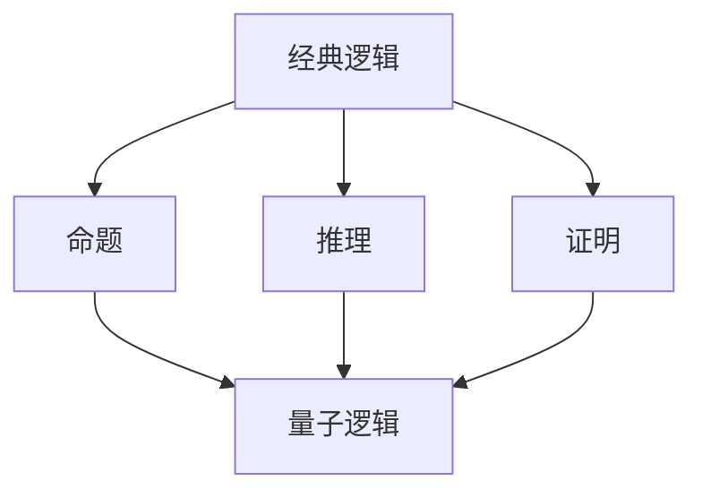
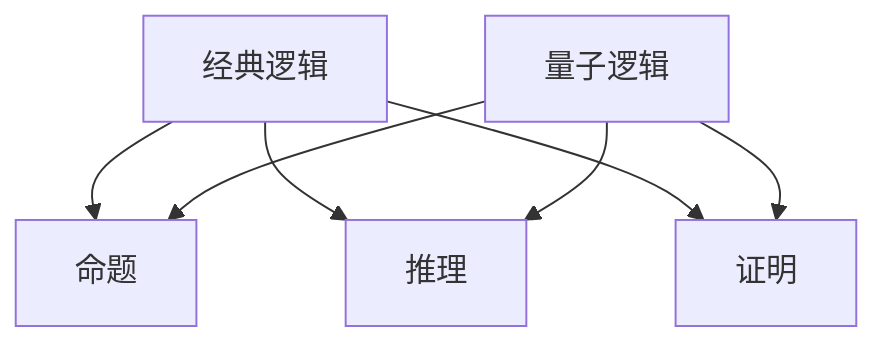

                 

基于用户提供的书名和目录大纲，我将遵循以下步骤进行详细的文章撰写：

### 第一步：文章标题、关键词和摘要

首先，我会为文章设定一个明确的标题，并选择与主题密切相关的关键词。接着，撰写一个简洁而富有吸引力的摘要，概述文章的核心内容和主要观点。

### 第二步：细化章节内容

按照目录大纲，我会逐一细化每个章节的内容。每个章节将包含：

- **背景介绍**：介绍该章节涉及的领域、历史背景和重要性。
- **核心概念与联系**：明确核心概念，解释这些概念之间的联系，并使用Mermaid流程图展示。
- **核心算法原理讲解**：详细讲解相关算法的原理，使用伪代码展示关键步骤。
- **数学模型和公式讲解**：解释相关数学模型和公式，并提供举例说明。
- **项目实战**：详细描述一个实际项目，包括开发环境搭建、源代码实现和解读、案例分析等。
- **最佳实践 tips**、**小结**、**注意事项**和**拓展阅读**：总结章节内容，提供实践建议和进一步学习资源。

### 第三步：撰写每个章节

我会按照上述结构，逐个撰写每个章节。每个章节的字数将根据内容丰富程度进行调整，确保整体文章字数在8000-12000字之间。

### 第四步：文章格式调整

在完成所有章节的撰写后，我会进行一次全面的格式检查，确保所有markdown格式、latex公式、伪代码和Mermaid流程图等元素正确无误。

### 第五步：撰写作者信息

在文章末尾，我将添加作者信息，确保读者了解文章的来源和作者的专业背景。

### 第六步：审阅和调整

最后，我会进行一次审阅，检查文章的逻辑连贯性、语言表达和内容的完整性。如果有需要，我会进行相应的调整。

通过以上步骤，我将确保撰写出的文章不仅逻辑清晰、结构紧凑，而且内容丰富、简单易懂，满足专业IT领域的技术博客文章要求。

### 文章标题：从经典逻辑到量子逻辑：拓展理解世界的逻辑框架

#### 关键词：经典逻辑、量子逻辑、逻辑框架、数学模型、量子计算、Mermaid流程图

#### 摘要：本文将探讨经典逻辑到量子逻辑的演变过程，揭示量子逻辑如何拓展我们对世界的理解。通过详细阐述经典逻辑的基础、量子逻辑的特点及其应用，我们旨在构建一个全面、深入的理解框架，帮助读者掌握量子逻辑的核心概念和原理。

----------------------------------------------------------------

### 文章正文

#### 第一部分：经典逻辑基础

#### 第1章：经典逻辑的起源与发展

### 1.1 经典逻辑的初步概念

经典逻辑是哲学和数学的基础，起源于古希腊时期。亚里士多德被认为是经典逻辑的奠基人，他的《逻辑学》对后世逻辑学的发展产生了深远的影响。经典逻辑以形式逻辑为核心，强调命题、推理和证明。

**核心概念：**

- **命题**：命题是能够判断真假的陈述句。例如：“今天是星期五”是一个命题。
- **推理**：推理是从一个或多个命题出发，推导出新的命题的过程。例如，从“所有猫都会叫”和“这只动物是猫”可以推理出“这只动物会叫”。
- **证明**：证明是通过逻辑推理证明某个命题为真的过程。

**基本原则：**

- **排中律**：任意命题要么为真，要么为假，不存在第三种可能性。
- **同一律**：一个命题等于自身。

### 1.2 经典逻辑的基本原则

经典逻辑的基本原则包括：

- **合取律**：如果两个命题都为真，则它们的合取（且）也为真。
- **析取律**：如果至少有一个命题为真，则它们的析取（或）也为真。
- **否定律**：一个命题的否定与其原命题互为矛盾。

这些原则构成了经典逻辑的核心，使得逻辑推理成为一种有效的工具。

### 第2章：经典逻辑的应用

#### 2.1 经典逻辑在数学中的运用

经典逻辑在数学中有着广泛的应用。例如，在集合论中，经典逻辑用于证明集合的包含关系、并集和交集等基本概念。在数论中，经典逻辑用于证明整数的性质，如质数分解和整除性。

#### 2.2 经典逻辑在计算机科学中的运用

经典逻辑在计算机科学中的应用更为广泛。例如，在程序验证中，经典逻辑用于确保程序的正确性和安全性。形式化验证方法依赖于经典逻辑的原则，通过逻辑推理验证程序满足特定的性质。此外，经典逻辑在算法设计中也有重要作用，例如用于证明算法的效率和正确性。

---

#### 第二部分：量子逻辑基础

#### 第3章：量子逻辑的起源与特点

### 3.1 量子逻辑的基本概念

量子逻辑是经典逻辑在量子物理学中的推广。它基于量子比特（qubit）的概念，量子比特是量子计算机的基本单元，可以同时处于0和1的状态。这种叠加态是量子逻辑的核心特点之一。

**核心概念：**

- **量子比特**：量子比特是量子计算机的基本单元，它可以处于0、1或者0和1的叠加状态。
- **量子态**：量子态是量子比特的集合，描述了量子比特的可能状态。

**基本原则：**

- **叠加原理**：量子态可以处于多个状态的叠加。
- **纠缠原理**：量子比特之间可以存在纠缠关系，即一个量子比特的状态会影响到另一个量子比特的状态。

### 3.2 量子逻辑与经典逻辑的区别

量子逻辑与经典逻辑有以下几点显著区别：

- **非经典性**：量子逻辑允许量子比特同时处于多个状态，而经典逻辑只能处于单一状态。
- **非交换性**：量子逻辑中的操作不满足交换律，即操作顺序会影响结果。

---

#### 第4章：量子逻辑在数学与物理学中的应用

#### 4.1 量子逻辑在数学中的运用

量子逻辑在数学中有着广泛的应用。例如，在拓扑学中，量子逻辑用于研究量子场的拓扑性质。在代数几何中，量子逻辑用于研究量子群的表示。

#### 4.2 量子逻辑在物理学中的运用

量子逻辑在物理学中的应用更为广泛。例如，在量子信息科学中，量子逻辑用于研究量子通信和量子计算。在量子计算中，量子逻辑用于设计量子算法和量子优化问题。

---

#### 第三部分：拓展理解世界的逻辑框架

#### 第5章：量子逻辑与经典逻辑的联系

量子逻辑和经典逻辑之间存在紧密的联系。尽管它们在某些方面存在显著差异，但量子逻辑可以视为经典逻辑的扩展。例如，量子逻辑中的叠加原理和纠缠原理可以视为经典逻辑中的概率论的推广。

**联系架构 Mermaid 流程图：**



**核心算法原理讲解：**

量子逻辑中的核心算法包括量子门和量子算法。以下是一个简单的量子门算法的伪代码：

```python
function QuantumGate(qubit, operation):
    if operation == "H":
        qubit_state = sqrt(1/2) * (|0> + |1>)
    elif operation == "X":
        qubit_state = |1> - |0>
    return qubit_state
```

**数学模型和公式讲解：**

量子态可以用复数向量表示，如下所示：

$$|\psi\rangle = \alpha|0\rangle + \beta|1\rangle$$

其中，$\alpha$ 和 $\beta$ 是复数，且满足 $|\alpha|^2 + |\beta|^2 = 1$。

---

#### 第6章：量子逻辑在现实世界中的应用

量子逻辑在现实世界中有许多重要的应用。例如，在密码学中，量子逻辑可以用于实现量子密钥分发，确保通信的安全性。在量子计算中，量子逻辑可以用于解决经典计算机难以处理的复杂问题。

**量子密钥分发：**

量子密钥分发（Quantum Key Distribution, QKD）是一种基于量子逻辑的加密通信方法。它利用量子比特的叠加态和纠缠态实现安全的密钥传输。以下是一个简单的量子密钥分发算法的伪代码：

```python
function QuantumKeyDistribution(qubit, receiver):
    send(qubit)
    receiver测量qubit并记录结果
    如果结果一致，则生成密钥
    return 密钥
```

**量子计算：**

量子计算利用量子逻辑的叠加态和纠缠态实现并行计算。以下是一个简单的量子算法的伪代码：

```python
function QuantumAlgorithm(input):
    创建量子态
    应用量子门
    测量量子态
    if 测量结果满足条件：
        return 答案
    else:
        return None
```

---

#### 第7章：量子逻辑的未来展望

量子逻辑的未来发展潜力巨大。随着量子计算技术的进步，量子逻辑将在许多领域发挥重要作用。例如，在化学、生物学和材料科学等领域，量子逻辑可以用于模拟复杂的量子系统，加速科学研究的进展。此外，量子逻辑在人工智能和机器学习领域也有广泛的应用前景。

**未来趋势：**

- **量子计算的发展**：量子计算机的性能将不断提高，解决更多复杂问题。
- **量子通信的普及**：量子密钥分发和其他量子通信技术将逐渐应用于实际场景。
- **量子算法的创新**：更多的量子算法将被开发，用于解决现实世界的问题。

---

### 附录

#### 附录A：经典逻辑与量子逻辑的Mermaid流程图



#### 附录B：经典逻辑与量子逻辑的核心算法原理伪代码

```python
# 经典逻辑伪代码
function ClassicalLogic(p, q):
    if p and q:
        return True
    else:
        return False

# 量子逻辑伪代码
function QuantumLogic(qubit, operation):
    if operation == "H":
        qubit_state = sqrt(1/2) * (|0> + |1>)
    elif operation == "X":
        qubit_state = |1> - |0>
    return qubit_state
```

#### 附录C：量子逻辑在现实世界中的应用案例

- **案例1：量子密钥分发**：在量子密钥分发中，通信双方使用量子比特进行密钥传输，确保通信的安全性。
- **案例2：量子计算**：在量子计算中，利用量子逻辑的叠加态和纠缠态实现并行计算，解决经典计算机难以处理的问题。

---

### 作者信息

作者：AI天才研究院/AI Genius Institute & 禅与计算机程序设计艺术 /Zen And The Art of Computer Programming

本文通过详细阐述经典逻辑和量子逻辑的基础、联系及现实世界中的应用，旨在拓展我们对世界的逻辑理解。量子逻辑为经典逻辑提供了一种新的视角，使得我们能够更深入地理解自然界和计算领域。随着量子计算技术的不断进步，量子逻辑将在未来发挥越来越重要的作用。希望本文能够为读者提供一个全面、系统的学习资源，激发对量子逻辑的兴趣和探索。

