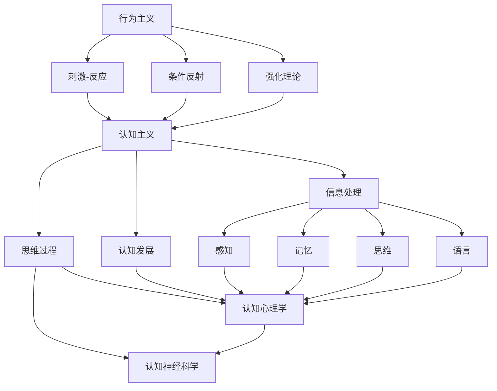

                 


### 1. 理解书名

《从行为主义到认知主义：理解学习与世界认知的新范式》这本书名清晰地指出了两个核心概念：“行为主义”和“认知主义”，以及它们对学习和世界认知的影响。首先，让我们来解析这两个核心概念。

**行为主义**，一种心理学理论，强调环境对行为的影响，主张通过观察和记录行为来研究人类和学习。行为主义起源于20世纪初，主要代表人物包括约翰·华生（John B. Watson）和伯福德·斯金纳（B.F. Skinner）。行为主义认为，行为是通过刺激（Stimulus）和反应（Response）之间的联系而形成的，这种联系称为条件反射（Conditioned Reflex）。行为主义的核心思想是，人类行为可以通过外部刺激和控制来改变。

**认知主义**，则是心理学领域的另一种理论，关注人类的思维过程、信息处理和内部心理活动。认知主义强调人类大脑的内部结构和功能，试图揭示思维过程背后的原理和机制。认知主义起源于20世纪中叶，主要代表人物包括让·皮亚杰（Jean Piaget）和诺姆·乔姆斯基（Noam Chomsky）。认知主义认为，学习是一种内部心理过程，涉及信息获取、存储、处理和运用。

书中提到的“新范式”意味着，这本书试图为我们提供一种新的视角来理解学习和认知，从而超越传统的行为主义观点。作者通过对比行为主义和认知主义的观点、理论和应用，帮助我们更好地理解两者之间的联系与区别，以及它们在教育和心理学研究中的重要性。

### 2. 目录结构

为了系统地阐述从行为主义到认知主义的转变，本文将分为以下几个主要部分：

#### 第1章 行为主义的历史与理论

- **第1.1节** 行为主义的起源：介绍行为主义的发展历程，从约翰·华生和伯福德·斯金纳等先驱人物开始，了解行为主义的基本概念和理论。
- **第1.2节** 行为主义的主要代表人物：详细介绍行为主义领域的重要人物及其贡献，包括斯金纳、班杜拉等。
- **第1.3节** 行为主义的核心实验：分析行为主义领域的关键实验，如经典条件反射实验、操作条件反射实验等，解释其原理和意义。
- **第1.4节** 行为主义的心理学方法：探讨行为主义的研究方法，如行为观察、记录、测量和分析等，以及这些方法在心理学研究中的应用。

#### 第2章 认知主义的历史与理论

- **第2.1节** 认知主义的起源：介绍认知主义的发展历程，从让·皮亚杰和诺姆·乔姆斯基等先驱人物开始，了解认知主义的基本概念和理论。
- **第2.2节** 认知主义的主要代表人物：详细介绍认知主义领域的重要人物及其贡献，包括皮亚杰、乔姆斯基、皮亚杰等。
- **第2.3节** 认知主义的关键实验：分析认知主义领域的关键实验，如语言习得装置（Language Acquisition Device, LAD）实验、认知发展实验等，解释其原理和意义。
- **第2.4节** 认知主义的研究方法：探讨认知主义的研究方法，如认知模型、思维实验、脑成像技术等，以及这些方法在心理学研究中的应用。

#### 第3章 行为主义与认知主义的联系与区别

- **第3.1节** 行为主义与认知主义的共同点：分析行为主义和认知主义之间的相似之处，如对学习和认知的关注、研究方法等。
- **第3.2节** 行为主义与认知主义的区别：探讨行为主义和认知主义之间的主要区别，如理论观点、研究方法、研究对象等。
- **第3.3节** 行为主义与认知主义的发展趋势：分析行为主义和认知主义在未来心理学研究中的发展趋势和挑战。

#### 第4章 学习理论与应用

- **第4.1节** 行为主义的学习理论：介绍行为主义领域的主要学习理论，如经典条件反射、操作性条件反射、强化理论等，并解释其应用。
- **第4.2节** 认知主义的学习理论：介绍认知主义领域的主要学习理论，如认知地图、认知发展理论、生成语法等，并解释其应用。
- **第4.3节** 学习理论在教育和培训中的应用：分析行为主义和认知主义学习理论在教育和培训中的应用，如教学方法、教学设计等。

#### 第5章 认知心理学与认知神经科学

- **第5.1节** 认知心理学的核心概念：介绍认知心理学的核心概念，如感知、记忆、思维、语言等，并解释其应用。
- **第5.2节** 认知神经科学的研究方法：探讨认知神经科学的研究方法，如脑成像技术、神经电生理技术等，以及这些方法在心理学研究中的应用。
- **第5.3节** 认知心理学与认知神经科学的关系：分析认知心理学与认知神经科学之间的联系和相互作用。

#### 第6章 教育与认知发展

- **第6.1节** 教育中的行为主义理念：探讨行为主义理念在教育中的应用，如教学策略、评估方法等。
- **第6.2节** 教育中的认知主义理念：探讨认知主义理念在教育中的应用，如教学设计、学习策略等。
- **第6.3节** 教育与认知发展的互动关系：分析教育对认知发展的影响，以及认知发展对教育的影响。

#### 第7章 结论与未来展望

- **第7.1节** 行为主义与认知主义在当前教育中的地位：总结行为主义和认知主义在当前教育中的地位和影响。
- **第7.2节** 行为主义与认知主义在未来的发展趋势：分析行为主义和认知主义在未来心理学研究中的发展趋势和挑战。
- **第7.3节** 对学习和认知研究的新挑战：探讨学习和认知研究面临的新挑战，如人工智能、神经科学等领域的进展。

### 3. 核心概念与联系

为了更好地理解行为主义和认知主义，我们需要探讨这两个概念之间的联系和区别。以下是行为主义和认知主义的核心概念之间的 Mermaid 流程图：



在这个流程图中，我们可以看到行为主义的核心概念（刺激-反应、条件反射、强化理论）与认知主义的核心概念（信息处理、思维过程、认知发展）之间存在联系。同时，认知主义还涉及到感知、记忆、思维和语言等认知心理学的核心概念，以及认知心理学与认知神经科学之间的相互作用。

### 4. 核心算法原理讲解

在行为主义和认知主义的学习理论中，有许多经典的算法原理。以下是一个简单的伪代码，用于解释斯金纳的操作性条件反射算法原理：

```python
# 操作性条件反射算法伪代码

# 定义变量
刺激(S)
反应(R)
强化(Reward)

# 初始设置
S = 初始刺激
R = 初始反应
Reward = 0

# 操作性条件反射循环
while True:
    # 观察反应
    R = 观察到的反应
    
    # 强化
    if R 与 S 相关：
        Reward = 给予强化
    
    # 更新状态
    S = 更新的刺激
    
    # 终止条件
    if 满足终止条件：
        break
```

在这个伪代码中，我们首先定义了刺激、反应和强化三个关键变量。然后，我们进入一个无限循环，观察反应并给予强化。通过这种方式，我们可以逐渐建立刺激与反应之间的联系，形成条件反射。

### 5. 数学模型和公式讲解

在行为主义和认知主义的研究中，有许多重要的数学模型和公式。以下是一个简单的例子，用于解释认知心理学的感知模型：

$$
感知强度 = k \cdot (刺激强度 - 基础阈值)
$$

其中，感知强度表示个体对刺激的感受程度，刺激强度表示外界刺激的强度，基础阈值表示个体对刺激的最低感知阈值，k 为感知敏感度系数。

这个公式表明，感知强度与刺激强度之间存在非线性关系。当刺激强度超过基础阈值时，感知强度随刺激强度的增加而增加，但增加的速度逐渐减缓。这个模型可以用于解释许多感知现象，如视觉、听觉和触觉等。

### 6. 项目实战

为了更好地理解行为主义和认知主义的应用，我们可以通过一个实际项目来演示这两个理论。

**项目名称**：基于行为主义和认知主义的在线学习平台

**项目目标**：开发一个在线学习平台，通过行为主义和认知主义的理论来提高用户的学习效果。

**开发环境**：

- 开发语言：Python
- Web框架：Django
- 数据库：PostgreSQL

**源代码详细实现和代码解读**：

```python
# Django项目结构

# settings.py
# 配置数据库、URL等

# models.py
# 定义用户、课程、学习记录等模型

# views.py
# 定义用户注册、登录、课程浏览、学习记录等功能

# templates/
# 存放HTML模板文件

# static/
# 存放CSS、JavaScript等静态资源文件
```

**代码应用解读与分析**：

在这个项目中，我们使用了Django框架来构建在线学习平台。通过定义用户、课程、学习记录等模型，我们可以实现对用户的学习行为进行记录和分析。在views.py中，我们实现了用户注册、登录、课程浏览、学习记录等功能，并通过行为主义和认知主义的理论来优化用户的学习体验。

**实际案例分析和详细讲解剖析**：

为了提高用户的学习效果，我们采用了以下策略：

1. **行为主义应用**：
   - **奖励机制**：通过给予用户积分、奖励等方式，激励用户积极参与学习。
   - **行为观察**：记录用户的学习行为，如学习时间、学习频率等，分析用户的偏好和需求。
   - **强化学习**：根据用户的学习行为，给予相应的强化，如学习进度提示、学习成果展示等。

2. **认知主义应用**：
   - **认知地图**：通过构建用户的学习认知模型，了解用户对知识的掌握程度和学习路径。
   - **思维训练**：设计思维训练题目，如逻辑推理、记忆训练等，帮助用户提升思维能力。
   - **认知发展**：通过跟踪用户的学习记录，分析用户的学习进度和认知发展水平。

**项目小结**：

通过这个实际项目，我们展示了行为主义和认知主义在在线学习平台中的应用。项目实现了用户注册、登录、课程浏览、学习记录等功能，并采用了行为主义和认知主义的理论来优化用户的学习体验。这个项目不仅具有实用价值，而且为我们提供了一个实际案例来深入理解行为主义和认知主义的原理和应用。

### 7. 最佳实践 tips、小结、注意事项、拓展阅读

**最佳实践 tips**：

1. **针对不同用户群体**：在设计学习平台时，要考虑到不同用户的学习需求和习惯，制定个性化的学习策略。
2. **激励机制**：利用奖励机制激发用户的学习兴趣和积极性，提高学习效果。
3. **数据分析**：通过分析用户的学习行为和成果，不断优化学习平台的功能和用户体验。

**小结**：

本文从行为主义和认知主义的历史、理论、联系与区别、学习理论、认知心理学、认知神经科学、教育与应用等方面进行了全面的分析和阐述。通过项目实战，我们展示了这两个理论在在线学习平台中的应用，为提高学习效果提供了实用的策略和方法。

**注意事项**：

1. **理论与实践相结合**：在学习过程中，要将行为主义和认知主义的理论与实际案例相结合，提高学习效果。
2. **持续更新与优化**：随着心理学、教育学等领域的发展，不断更新和优化行为主义和认知主义的理论和方法。

**拓展阅读**：

1. 《认知心理学及其启示》
2. 《学习心理学：行为主义与认知主义的视角》
3. 《教育心理学：行为主义与认知主义的理论与应用》
4. 《行为主义与认知主义的交互作用：学习与记忆的研究》

通过阅读这些书籍和论文，可以更深入地了解行为主义和认知主义的原理和应用，为我们的学习与研究提供有益的参考。

```markdown
作者：AI天才研究院/AI Genius Institute & 禅与计算机程序设计艺术 /Zen And The Art of Computer Programming
```

这篇文章的目录大纲和核心内容已经初步完成。接下来，我们将根据这个大纲逐步撰写文章，确保每个章节的内容都详细、具体、有深度。在撰写过程中，我们将保持逻辑清晰、结构紧凑，并注重理论与实践的结合，以便读者能够更好地理解和应用行为主义和认知主义的理论。文章的撰写将分为以下几个步骤：

1. **撰写第1章 行为主义的历史与理论**：介绍行为主义的起源、代表人物、核心实验和心理学方法。
2. **撰写第2章 认知主义的历史与理论**：介绍认知主义的起源、代表人物、核心实验和研究方法。
3. **撰写第3章 行为主义与认知主义的联系与区别**：分析行为主义和认知主义的共同点和区别，以及发展趋势。
4. **撰写第4章 学习理论与应用**：介绍行为主义和认知主义的学习理论及其在教育和培训中的应用。
5. **撰写第5章 认知心理学与认知神经科学**：探讨认知心理学的核心概念、认知神经科学的研究方法及其关系。
6. **撰写第6章 教育与认知发展**：分析行为主义和认知主义在教育中的应用，以及教育与认知发展的互动关系。
7. **撰写第7章 结论与未来展望**：总结行为主义和认知主义在当前教育中的地位，探讨未来的发展趋势和挑战。
8. **综合整理与修订**：对全文进行综合整理，确保文章的逻辑性、连贯性和完整性。
9. **添加附录**：根据需要添加附录，如核心理论图解、相关研究总结等。
10. **撰写作者信息**：在文章末尾添加作者信息。

通过以上步骤，我们将逐步完成这篇文章的撰写，确保文章内容丰富、结构严谨、具有深度和见解。在撰写过程中，我们将不断思考、分析和总结，力求为读者呈现一篇高质量的技术博客文章。让我们开始吧！## 第1章 行为主义的历史与理论

### 1.1 行为主义的起源

行为主义（Behaviorism）作为一种心理学理论，起源于20世纪初。其发展背景是心理学领域内对意识、主观体验等内部心理过程的研究困惑。当时的心理学研究主要依赖于主观报告和内省方法，这些方法难以量化和验证，导致心理学研究缺乏科学性。为了解决这一困境，行为主义提出了以可观察、可测量的行为作为研究对象，从而推动心理学研究走向科学化。

行为主义的诞生与几位重要的心理学家密切相关。约翰·华生（John B. Watson）被认为是行为主义的奠基人。他在1913年发表了著名的论文《行为主义》，明确提出了行为主义的基本观点。华生主张，心理学应该专注于研究行为，而不是内心状态。他认为，所有行为都可以通过环境刺激和行为反应之间的关系来解释。

伯福德·斯金纳（B.F. Skinner）是行为主义的重要代表人物之一。他在1938年出版了《有机体的行为》一书，系统地阐述了行为主义理论。斯金纳对行为主义进行了深入的发展，特别是在操作性条件反射和强化理论方面取得了重要成就。他提出，行为可以通过正强化（积极刺激）和负强化（消极刺激）来塑造和改变。

行为主义的起源不仅仅依赖于个别心理学家的理论贡献，还与当时社会和科学环境的变化密切相关。在第一次世界大战期间，行为主义理论被用于训练士兵，以优化行为表现和反应速度。这一应用使得行为主义得到了广泛关注，并逐渐在心理学领域内占据主导地位。

### 1.2 行为主义的主要代表人物

**约翰·华生（John B. Watson）**

约翰·华生是行为主义的奠基人，他提出了行为主义的核心观点，即心理学应该研究可观察、可测量的行为，而不是无法直接观察的内心状态。华生认为，通过控制环境刺激和观察行为反应，可以理解和预测人类行为。他的经典实验——“小阿尔伯特实验”，通过展示条件反射的形成和作用，证实了行为主义理论的有效性。

**伯福德·斯金纳（B.F. Skinner）**

伯福德·斯金纳是行为主义的另一位重要代表人物，他在操作性条件反射和强化理论方面做出了巨大贡献。斯金纳提出，行为可以通过正强化和负强化来塑造。正强化通过给予积极的刺激来增强行为，而负强化通过消除消极的刺激来增强行为。他的实验研究表明，通过系统化的强化程序，可以有效地改变和塑造动物和人类的行为。

**约翰·卡尔霍恩（John Calhoun）**

约翰·卡尔霍恩是行为主义的另一位重要学者，他的研究主要集中在动物行为和群体行为方面。卡尔霍恩的实验揭示了社会压力和竞争对动物行为和群体动态的影响。他的研究为行为主义提供了更多实证支持，并推动了行为主义理论在生物学和社会学领域的应用。

**爱德华·托尔曼（Edward C. Tolman）**

爱德华·托尔曼是行为主义内部的批评者，他提出了“认知行为主义”的观点。托尔曼认为，行为不仅仅是环境刺激和反应之间的简单联系，还涉及个体的认知过程和期望。他的研究揭示了动物在迷宫实验中表现出目标导向的行为，这一发现挑战了传统行为主义的观点，并推动了认知心理学的发展。

这些行为主义的主要代表人物各自在行为主义的发展中扮演了重要角色，他们的理论观点和实验研究共同构建了行为主义的理论体系。

### 1.3 行为主义的核心实验

行为主义的核心实验是其理论验证的重要手段。以下介绍几个经典的行为主义实验，这些实验不仅证明了行为主义理论的有效性，还推动了心理学研究的发展。

**小阿尔伯特实验**

小阿尔伯特实验是行为主义的开山之作，由约翰·华生进行。实验中，一个小男孩（阿尔伯特）被训练对白鼠产生恐惧反应。首先，白鼠与中性刺激（如铃声）同时出现，导致阿尔伯特对白鼠产生条件反应。经过多次重复，当白鼠单独出现时，阿尔伯特也会产生恐惧反应。这个实验展示了条件反射的形成，证实了环境刺激和行为反应之间的联系。

**斯金纳箱实验**

斯金纳箱实验由伯福德·斯金纳设计，用于研究操作性条件反射和强化理论。实验中，一只动物被放入一个箱子里，箱子的一个角落有一个杠杆。当动物按压杠杆时，它会获得食物或水作为奖励。通过反复进行这个实验，动物学会了按压杠杆以获取奖励。这个实验验证了操作性条件反射的存在，并揭示了强化在行为塑造中的作用。

**社会学习实验**

社会学习实验由约翰·卡尔霍恩设计，研究社会压力和竞争对动物行为的影响。实验中，卡尔霍恩将动物放置在高度竞争的环境中，观察它们的行为变化。结果显示，在竞争激烈的环境中，动物表现出攻击性、焦虑和抑郁等负面行为。这一发现为行为主义理论提供了实证支持，并引发了关于社会行为和心理健康的研究。

**迷宫实验**

迷宫实验由爱德华·托尔曼进行，旨在研究动物的认知过程。实验中，动物需要通过一系列迷宫来找到食物。尽管动物最初是通过试错来找到食物，但最终它们表现出目标导向的行为，似乎在迷宫中形成了认知地图。这个实验揭示了动物具有认知能力，挑战了传统行为主义的观点，为认知心理学的发展奠定了基础。

这些经典实验不仅验证了行为主义理论的有效性，还推动了心理学研究的发展。通过这些实验，行为主义理论得到了广泛的认可和应用，对心理学研究产生了深远的影响。

### 1.4 行为主义的心理学方法

行为主义在心理学研究中采用了一系列独特的方法，这些方法使得行为主义成为心理学领域内最具实证性和可操作性的理论之一。以下是行为主义的主要心理学方法：

**观察法**

观察法是行为主义研究的基础方法。通过直接观察和记录个体的行为，心理学家可以收集到大量的行为数据。观察法强调客观性和量化，有助于排除主观报告的干扰。在行为主义研究中，观察法主要用于记录个体的行为反应，如刺激-反应之间的联系、行为频率和持续时间等。

**实验法**

实验法是行为主义研究的重要手段，通过在控制环境中操纵变量，心理学家可以研究行为与刺激之间的关系。行为主义实验通常采用经典条件反射和操作性条件反射两种范式。经典条件反射实验研究刺激-反应之间的条件联系，而操作性条件反射实验研究行为与强化之间的关联。实验法使得行为主义理论在可重复和可验证的基础上得到了广泛的应用。

**记录法**

记录法是行为主义研究中的常用方法，通过详细记录个体的行为表现，心理学家可以分析行为发生的规律和特点。记录法可以采用行为日志、行为评分表、视频记录等多种形式。记录法有助于积累长期的行为数据，为行为主义研究提供了丰富的实证基础。

**测量与分析法**

测量与分析法是行为主义研究中不可或缺的方法。通过使用各种测量工具和分析技术，心理学家可以对行为进行量化分析。例如，行为频率、持续时间、反应强度等指标可以用来衡量行为的变化。统计分析方法，如方差分析（ANOVA）、回归分析等，可以用于检验行为与变量之间的相关性。测量与分析法使得行为主义研究更加精确和科学。

**应用案例**

以下是一个行为主义心理学方法的实际应用案例：

**案例**：研究强化对儿童学习行为的影响

**方法**：

1. **观察法**：研究人员观察儿童在自然环境中的学习行为，记录儿童的学习频率、持续时间、学习内容的多样性等指标。

2. **实验法**：将儿童分为实验组和对照组，实验组接受强化刺激（如奖励、表扬），对照组不接受强化刺激。在控制环境中进行实验，研究强化对儿童学习行为的影响。

3. **记录法**：研究人员记录实验过程中儿童的学习行为，包括每次学习的持续时间、学习内容、强化刺激的给予等。

4. **测量与分析法**：使用行为频率、学习持续时间等指标，分析实验组和对照组的学习行为差异。通过统计分析方法，检验强化对儿童学习行为的显著影响。

**结果**：实验结果显示，接受强化刺激的儿童表现出更高的学习频率和更持久的学习行为。统计分析表明，强化对儿童学习行为具有显著的促进作用。

**讨论**：这个案例展示了行为主义心理学方法的实际应用，通过观察、实验、记录和测量，研究人员可以深入研究强化对儿童学习行为的影响，为教育实践提供科学依据。

通过这些方法和实际应用案例，行为主义为心理学研究提供了丰富的方法论支持，推动了心理学领域的科学发展和应用。

### 第2章 认知主义的历史与理论

#### 2.1 认知主义的起源

认知主义（Cognitivism）作为一种心理学理论，起源于20世纪中叶，是作为对行为主义的一种批判和替代而产生的。行为主义注重外部行为的研究，而认知主义则强调内部心理过程，如思考、感知、记忆和解决问题。认知主义的起源可以追溯到让·皮亚杰（Jean Piaget）和诺姆·乔姆斯基（Noam Chomsky）等心理学家的理论贡献。

**让·皮亚杰（Jean Piaget）**

让·皮亚杰是瑞士心理学家，被认为是认知发展理论的奠基人。他在20世纪初提出了儿童认知发展的阶段理论。皮亚杰认为，儿童的认知发展是一个连续的过程，可以分为四个主要阶段：感知运动阶段、前运算阶段、具体运算阶段和形式运算阶段。每个阶段都有其独特的认知特点和发展任务。皮亚杰的实验研究，如三山实验，揭示了儿童在不同发展阶段上的认知差异。

**诺姆·乔姆斯基（Noam Chomsky）**

诺姆·乔姆斯基是著名的语言学家和认知科学家，他提出了“生成语法”理论，对认知心理学产生了深远影响。乔姆斯基认为，人类的语言能力是天生固有的，语言学习不是通过简单的刺激-反应过程，而是通过内部语言机制的运作。他提出的“普遍语法”理论，试图解释人类语言习得的基本原理。乔姆斯基的这些理论挑战了行为主义对语言学习的解释，为认知心理学的发展提供了新的视角。

认知主义在心理学领域中的崛起，标志着心理学研究从行为主义向内部心理过程的研究转变。认知主义强调信息处理和思维过程，试图揭示人类认知的复杂性和多样性。

#### 2.2 认知主义的主要代表人物

**让·皮亚杰（Jean Piaget）**

让·皮亚杰是认知发展理论的奠基人，他的研究主要关注儿童的认知发展。皮亚杰提出了四个认知发展阶段理论，每个阶段都有其独特的认知特点和发展任务。他的实验研究，如三山实验，揭示了儿童在不同发展阶段上的认知差异。

**诺姆·乔姆斯基（Noam Chomsky）**

诺姆·乔姆斯基是生成语法理论的创始人，他提出了“普遍语法”理论，试图解释人类语言习得的基本原理。乔姆斯基认为，人类的语言能力是天生固有的，语言学习不是通过简单的刺激-反应过程，而是通过内部语言机制的运作。

**乔治·米勒（George A. Miller）**

乔治·米勒是美国心理学家，他在认知心理学领域做出了重要贡献，特别是在记忆和信息处理方面。米勒提出了著名的“7±2”记忆容量理论，指出人类短期记忆的容量大约是7个项目，这一发现对认知心理学研究产生了深远影响。

**艾伦·纽厄尔（Allen Newell）和赫伯特·西蒙（Herbert Simon）**

艾伦·纽厄尔和赫伯特·西蒙是认知心理学和信息处理理论的奠基人。他们提出了“物理符号系统假设”，试图通过计算机模拟来研究人类认知过程。他们的研究揭示了思维过程中的符号操作和信息处理机制。

这些认知主义的主要代表人物各自在认知心理学的发展中扮演了重要角色，他们的理论观点和实验研究共同构建了认知主义的理论体系。

#### 2.3 认知主义的关键实验

认知主义的关键实验是其理论验证的重要手段，这些实验不仅验证了认知主义的观点，还推动了认知心理学的发展。以下是几个经典认知主义实验：

**三山实验**

三山实验是让·皮亚杰设计的一个著名实验，用于研究儿童的认知发展。实验中，给儿童展示一个三维的“三山”模型，并询问儿童从不同角度看到的山的形状。结果显示，不同年龄段的儿童对这个问题有不同的回答，反映了他们在认知发展阶段上的差异。这个实验揭示了儿童在认知发展过程中的阶段性特点。

**安吉尔实验**

安吉尔实验是由艾伦·纽厄尔和赫伯特·西蒙设计的一个计算机模拟实验，用于研究问题解决和信息处理。实验中，参与者需要解决一系列数学问题，并记录他们的思考过程。通过分析参与者的思维过程，研究人员揭示了问题解决过程中的信息处理机制，为认知心理学提供了新的研究方法。

**鸡尾酒会效应**

鸡尾酒会效应是由乔治·米勒提出的一个认知现象，描述了在嘈杂环境中难以进行有效沟通的现象。实验中，参与者需要在嘈杂的背景噪声中听辨目标声音。结果显示，目标声音的识别率显著低于安静环境。这个实验揭示了认知资源有限性对信息处理的影响。

**视知觉实验**

视知觉实验由乔治·米勒和约翰·罗伯茨（John Robarts）设计，用于研究人类视觉感知的局限性。实验中，参与者需要识别屏幕上的物体，但物体被不同的干扰信息所遮挡。结果显示，参与者在识别物体时存在错觉，这种现象揭示了视觉系统对信息的处理方式和局限性。

这些经典实验不仅验证了认知主义的观点，还推动了认知心理学的发展，为理解和研究人类认知过程提供了新的方法。

#### 2.4 认知主义的研究方法

认知主义在心理学研究中采用了一系列独特的方法，这些方法使得认知主义成为心理学领域内最具实证性和可操作性的理论之一。以下是认知主义的主要心理学方法：

**实验法**

实验法是认知主义研究的基础方法。通过在控制环境中操纵变量，心理学家可以研究内部心理过程，如思维、感知和记忆。实验法可以采用多种形式，如反应时实验、事件相关电位（ERP）实验等，以量化内部心理过程。

**反应时实验**

反应时实验是认知主义研究中常用的方法，用于测量个体对刺激的反应时间。通过记录反应时间，研究人员可以分析认知过程中的时间因素，如信息处理速度、决策过程等。

**事件相关电位（ERP）实验**

事件相关电位（ERP）实验是一种脑电图（EEG）技术，用于研究认知过程的时间动态。ERP信号反映了大脑在不同时间点的电活动，通过分析ERP信号，研究人员可以揭示认知过程中的神经机制。

**计算机模拟**

计算机模拟是认知主义研究中的一种重要方法，通过模拟人类认知过程，研究人员可以验证认知理论的假设和预测。计算机模拟可以用于研究问题解决、记忆和信息处理等领域，为认知心理学提供了新的研究手段。

**行为观察法**

行为观察法是认知主义研究中的一种补充方法，通过直接观察和记录个体的行为，研究人员可以收集到大量的行为数据。行为观察法有助于理解认知过程在现实世界中的应用。

**应用案例**

以下是一个认知主义心理学方法的实际应用案例：

**案例**：研究记忆和信息处理

**方法**：

1. **反应时实验**：研究人员设计了一系列记忆任务，要求参与者记住一系列数字序列。通过记录参与者的反应时间，研究人员分析了记忆和信息处理过程中的时间动态。

2. **ERP实验**：在记忆任务过程中，研究人员记录了参与者的ERP信号。通过分析ERP信号，研究人员揭示了记忆和信息处理过程中大脑的电活动变化。

3. **计算机模拟**：研究人员使用计算机模拟技术，模拟了人类记忆和信息处理的过程，验证了认知理论的假设。

4. **行为观察法**：在实验过程中，研究人员直接观察了参与者的行为表现，如注意力的集中程度、决策速度等。

**结果**：实验结果显示，反应时和ERP信号分析揭示了记忆和信息处理过程中的关键时间节点和大脑活动模式。计算机模拟验证了认知理论的预测。

**讨论**：这个案例展示了认知主义心理学方法的实际应用，通过反应时实验、ERP实验、计算机模拟和行为观察法，研究人员可以深入研究记忆和信息处理过程，为认知心理学提供了丰富的实证数据。

通过这些方法和实际应用案例，认知主义为心理学研究提供了丰富的工具和方法，推动了认知心理学的发展和进步。

### 第3章 行为主义与认知主义的联系与区别

#### 3.1 行为主义与认知主义的共同点

行为主义和认知主义虽然代表了不同的心理学理论流派，但在某些方面，两者之间仍然存在共同点。以下分析行为主义与认知主义的共同之处：

**研究目标**：行为主义和认知主义都关注人类行为和心理过程的研究。虽然行为主义侧重于可观察的行为反应，而认知主义关注内部心理过程，但两者的研究目标都是为了理解人类行为和心理活动的本质。

**实证方法**：行为主义和认知主义都重视实证研究方法。行为主义通过观察和记录行为反应来验证理论，而认知主义则采用实验法、计算机模拟和脑成像技术等手段来研究认知过程。

**研究范畴**：行为主义和认知主义都探讨了学习、记忆、思维等心理现象。行为主义通过强化理论来解释行为变化，认知主义则通过信息处理模型来解释认知过程。

**应用领域**：行为主义和认知主义在教育和临床心理学等领域都有广泛的应用。行为主义的理论和方法被广泛应用于行为矫正、教育干预等，而认知主义的理论和方法则被应用于认知训练、心理治疗等。

**理论互补性**：在某些情况下，行为主义和认知主义的理论可以相互补充。例如，行为主义可以通过观察行为反应来验证认知理论的预测，而认知主义则可以提供更深入的内部心理过程解释，从而丰富行为主义的理论框架。

#### 3.2 行为主义与认知主义的区别

尽管行为主义和认知主义在研究目标和方法上存在共同点，但两者之间也存在显著的区别。以下分析行为主义与认知主义的区别：

**理论观点**：行为主义强调环境对行为的影响，认为行为是外部刺激和反应的简单联系。认知主义则强调内部心理过程，认为认知活动涉及信息获取、处理和运用。

**研究方法**：行为主义主要采用观察法和实验法，关注可观察的行为反应。认知主义则采用实验法、计算机模拟和脑成像技术，关注内部心理过程和认知机制。

**研究对象**：行为主义侧重于研究可观察的行为，如反应时、行为频率和刺激-反应关联。认知主义则侧重于研究内部心理过程，如记忆、思维、感知和解决问题。

**理论解释**：行为主义主要通过环境刺激和行为反应之间的关系来解释行为变化。认知主义则通过信息处理模型来解释认知过程，如记忆编码、检索和加工。

**应用领域**：行为主义在行为矫正、教育干预等领域有广泛应用，而认知主义则在认知训练、心理治疗等领域具有更高的应用价值。

#### 3.3 行为主义与认知主义的发展趋势

随着心理学、神经科学和计算机科学的发展，行为主义和认知主义在心理学研究中的应用和地位也发生了变化。以下分析行为主义与认知主义的发展趋势：

**行为主义的发展**：

1. **扩展应用领域**：行为主义在临床心理学、教育心理学和动物行为学等领域继续发挥重要作用。例如，行为主义理论被用于治疗焦虑症、抑郁症等心理障碍，以及改善学习效果和教学策略。

2. **与认知科学的融合**：行为主义与认知科学相结合，研究行为与认知过程之间的相互作用。例如，通过计算机模拟和行为分析，研究人类行为和认知机制的复杂关系。

3. **跨学科研究**：行为主义与神经科学、遗传学等领域的交叉研究，为理解行为和认知的生物学基础提供了新的视角。

**认知主义的发展**：

1. **认知神经科学的崛起**：认知神经科学结合了认知心理学和神经科学的研究方法，探索大脑结构与功能对认知过程的影响。例如，通过脑成像技术，研究记忆、思维和感知等认知功能。

2. **认知模型的完善**：认知主义在信息处理、决策制定和问题解决等领域提出了多种认知模型，通过计算机模拟和实验验证，不断改进和完善这些模型。

3. **跨学科研究**：认知主义与认知科学、人工智能等领域的交叉研究，推动了认知心理学的发展和应用。例如，通过人工智能技术，实现认知过程的计算机模拟和自动化。

**行为主义与认知主义的未来展望**：

1. **理论融合**：行为主义和认知主义的理论将继续相互融合，形成更为全面和深入的心理学理论体系。

2. **跨学科研究**：随着心理学、神经科学、计算机科学等领域的不断发展，行为主义和认知主义将在更多领域产生交叉应用，推动心理学研究的发展。

3. **技术创新**：随着脑成像技术、人工智能等新技术的应用，行为主义和认知主义的研究方法将更加多样化和精确，为心理学研究提供更强大的工具。

总之，行为主义和认知主义作为心理学领域的重要理论流派，在研究目标、方法、应用领域和发展趋势上既有共同点又有区别。随着心理学研究的不断深入，行为主义和认知主义将继续相互借鉴、融合和发展，为理解和改善人类行为和心理活动提供新的理论和方法。

### 第4章 学习理论与应用

#### 4.1 行为主义的学习理论

行为主义的学习理论主要关注外部刺激和行为反应之间的联系，强调通过环境刺激和强化来塑造和改变行为。以下是行为主义学习理论的几个主要方面：

**经典条件反射**

经典条件反射是行为主义学习理论的基础。由俄国生理学家伊凡·巴甫洛夫（Ivan Pavlov）提出，经典条件反射描述了一个学习过程，其中原本中性的刺激（条件刺激，如铃声）与一个具有生物学意义的刺激（无条件刺激，如食物）相结合，最终导致条件刺激本身引发相同的生物学反应（如唾液分泌）。通过这种方式，原本中性的刺激变得能够引起特定行为反应。

**操作性条件反射**

操作性条件反射是由伯福德·斯金纳（B.F. Skinner）提出的一种学习过程，强调行为与强化之间的关系。在操作性条件反射中，行为（操作）被环境中的事件（强化物）所调节。正强化通过给予积极的刺激（如奖励）来增加行为的频率和强度，而负强化通过消除不愉快的刺激（如惩罚）来增加行为的发生概率。

**强化理论**

强化理论是行为主义学习理论的核心，强调强化在行为学习中的作用。强化分为正强化和负强化。正强化通过给予积极的刺激来增强行为，例如给予表扬或奖励。负强化通过消除不愉快的刺激来增强行为，例如移除惩罚或避免不愉快的情境。强化理论提供了理解和预测行为变化的重要框架。

**应用领域**

行为主义学习理论在教育、临床心理学和动物行为学等领域有广泛的应用。在教育领域，教师可以运用经典条件反射和操作性条件反射原理来设计教学策略，如利用积极反馈来增强学生的学习动机。在临床心理学中，行为主义理论被用于治疗各种心理障碍，如焦虑症和抑郁症。在动物行为学中，行为主义理论被用于研究和训练动物行为。

**实例分析**

例如，在课堂教学中，教师可以通过使用正强化策略来鼓励学生的学习积极性。当学生回答问题正确时，教师可以给予表扬或小奖励，从而增加学生回答问题的频率和准确性。这种行为变化是通过经典条件反射和操作性条件反射的机制实现的。

#### 4.2 认知主义的学习理论

认知主义的学习理论强调内部心理过程，如信息处理、记忆和思维，在学习和知识获取中的作用。以下是认知主义学习理论的几个主要方面：

**认知地图**

认知地图是让·皮亚杰（Jean Piaget）提出的概念，用于描述个体在学习和记忆过程中构建的心理模型。认知地图是个体对环境信息进行组织和编码的方式，它反映了个体对知识的理解和记忆结构。认知地图有助于个体在复杂环境中导航和解决问题。

**生成语法**

生成语法是诺姆·乔姆斯基（Noam Chomsky）提出的理论，用于解释人类语言习得和语言处理过程。生成语法认为，人类语言能力是基于一套内部语法规则，这些规则决定了语言的结构和语法规则。生成语法理论为认知心理学提供了对语言学习和认知发展的深刻理解。

**信息处理模型**

信息处理模型是认知主义学习理论的核心，强调个体在学习和记忆过程中对信息进行加工和处理的方式。信息处理模型包括感知、编码、存储和检索等步骤，描述了个体如何从外部环境接收信息并将其转化为内部知识。信息处理模型有助于解释学习过程中的认知负荷和记忆容量。

**应用领域**

认知主义学习理论在教育、认知心理学和人工智能等领域有广泛的应用。在教育领域，教师可以运用认知主义理论来设计教学策略，如提供适当的认知支持，帮助学生更好地理解和记忆知识。在认知心理学中，研究人员通过实验和模型研究人类学习和记忆的过程。在人工智能领域，认知主义理论被用于开发智能代理和自然语言处理系统。

**实例分析**

例如，在教育中，教师可以通过使用生成语法理论来设计语言教学策略。通过教授学生基本的语法规则和语言结构，教师可以帮助学生构建内部语法模型，从而提高他们的语言习得能力。在认知心理学研究中，研究人员可以通过实验方法来验证信息处理模型，例如通过反应时实验来研究个体在记忆和认知任务中的信息处理过程。

#### 4.3 学习理论在教育和培训中的应用

行为主义和认知主义的学习理论在教育领域有广泛的应用，通过结合两者的理论和方法，教师可以设计出更加有效和适应学生需求的教学策略。

**行为主义在教育和培训中的应用**

在教育和培训中，行为主义理论被广泛应用于行为管理和学习激励。以下是一些具体的策略：

1. **奖励机制**：教师可以通过给予学生奖励来增强学生的学习动机。例如，当学生完成作业或回答问题正确时，教师可以给予小奖励，如贴纸、积分或额外的休息时间。

2. **行为强化**：教师可以设计一系列的行为强化计划，以逐步培养学生的良好行为习惯。例如，通过记录学生的积极行为，并在每周或每月颁发奖励，以鼓励学生持续表现良好。

3. **课堂管理**：行为主义理论提供了一系列课堂管理策略，如建立明确的规则和期望，使用正强化来鼓励学生遵守规则，并使用负强化来减少不良行为。

**认知主义在教育和培训中的应用**

认知主义理论在教育领域侧重于帮助学生理解和记忆知识，以下是一些具体的策略：

1. **认知支持**：教师可以提供认知支持，帮助学生更好地理解和记忆复杂的概念。例如，通过使用可视化工具、记忆技巧和概念图，帮助学生构建认知地图。

2. **探究性学习**：认知主义强调学生的主动参与和探索，教师可以通过设计探究性学习活动，鼓励学生提出问题、进行实验和解决问题。这有助于培养学生的批判性思维和创新能力。

3. **个性化教学**：认知主义理论强调学生的个体差异，教师可以根据不同学生的学习风格和能力，设计个性化的教学计划。例如，为视觉学习者提供图像和图表，为听觉学习者提供语音讲解。

**结合行为主义和认知主义理论的教学策略**

1. **多模态教学**：结合行为主义和认知主义理论，教师可以采用多模态教学策略，通过多种感官和方式来增强学生的学习效果。例如，通过使用视觉、听觉和动手操作相结合的教学方法，提高学生的参与度和理解能力。

2. **分层教学**：结合行为主义和认知主义理论，教师可以根据学生的学习进度和能力水平，设计分层教学策略。这有助于确保所有学生都能在适合自己的学习节奏中取得进步。

3. **反馈与反思**：结合行为主义和认知主义理论，教师可以鼓励学生进行自我反馈和反思，通过评估自己的学习过程和成果，不断调整和优化学习方法。

总之，行为主义和认知主义的学习理论在教育和培训中都有重要的应用。通过结合两者的理论和方法，教师可以设计出更加有效和适应学生需求的教学策略，提高学生的学习效果和动机。

### 第5章 认知心理学与认知神经科学

#### 5.1 认知心理学的核心概念

认知心理学是一门研究人类思维过程、信息处理和内部心理活动的学科。以下介绍认知心理学的几个核心概念：

**感知**

感知是认知过程的起点，是指个体通过感官接收外部信息并将其转换为内部心理表征的过程。感知包括视觉、听觉、触觉、味觉和嗅觉等多种形式。认知心理学家研究感知的基本原理，如感知阈值、感知适应和感知错觉等。

**记忆**

记忆是指个体对信息的存储、保持和提取过程。认知心理学家区分了不同类型的记忆，如短期记忆、长期记忆和工作记忆。记忆的研究包括记忆编码、记忆保持和记忆检索等方面。

**思维**

思维是指个体在信息处理和问题解决过程中所使用的认知过程。认知心理学家研究思维的类型，如逻辑思维、创造性思维和解决问题的策略。此外，还研究思维过程中的认知负荷、决策制定和问题解决策略。

**语言**

语言是人类认知的一个重要方面，涉及语音、词汇、语法和语义等方面。认知心理学家研究语言习得、语言处理和语言障碍等方面的认知过程。

**认知地图**

认知地图是让·皮亚杰提出的概念，用于描述个体对环境信息进行组织和编码的心理模型。认知地图帮助个体在复杂环境中进行导航和问题解决。

#### 5.2 认知神经科学的研究方法

认知神经科学是一门结合认知心理学和神经科学的学科，旨在研究大脑结构与功能对认知过程的影响。以下介绍认知神经科学的主要研究方法：

**脑成像技术**

脑成像技术是认知神经科学研究中最重要的工具之一，通过非侵入性方法观察大脑的结构和功能。常用的脑成像技术包括：

1. **功能磁共振成像（fMRI）**：通过测量大脑区域的活动变化来研究认知过程。
2. **正电子发射断层扫描（PET）**：通过放射性同位素的分布来研究大脑的代谢活动。
3. **单光子发射计算机断层扫描（SPECT）**：通过放射性同位素的分布来研究大脑的血流变化。
4. **脑电图（EEG）**：通过测量大脑的电活动来研究认知过程的时间动态。

**电生理技术**

电生理技术是一种直接测量大脑神经元活动的技术，包括：

1. **脑电活动记录**：通过电极记录大脑的电信号，如事件相关电位（ERP）。
2. **功能性电刺激（fES）**：通过刺激大脑特定区域来研究认知过程的神经机制。

**脑损伤研究**

脑损伤研究通过观察脑损伤对认知功能的影响来揭示认知过程的神经基础。这种方法包括：

1. **病例研究**：分析特定脑损伤患者的行为和认知表现。
2. **脑损伤模型**：通过实验方法模拟脑损伤，研究认知功能的变化。

**认知行为任务**

认知行为任务是认知神经科学研究中的常用方法，通过设计特定的认知任务来观察个体的认知过程和脑活动。例如：

1. **记忆任务**：通过记忆任务来研究记忆的神经机制。
2. **决策任务**：通过决策任务来研究决策过程中的认知负荷和神经活动。
3. **问题解决任务**：通过问题解决任务来研究认知策略和解决问题的神经机制。

**计算模型**

计算模型是认知神经科学研究中的重要工具，通过模拟认知过程的神经机制来验证和预测认知功能。计算模型包括：

1. **神经网络模型**：模拟大脑神经网络的结构和功能，研究信息处理和认知过程。
2. **决策理论模型**：模拟决策过程中的信息处理和决策策略。
3. **认知模型**：模拟人类认知过程的各个环节，如记忆、感知和思维等。

通过这些研究方法，认知神经科学家可以深入探索大脑如何实现复杂的认知功能，从而推动认知科学的发展和应用。

#### 5.3 认知心理学与认知神经科学的关系

认知心理学和认知神经科学是两个相互补充的学科，它们共同致力于揭示人类认知过程的本质。认知心理学主要研究人类思维、感知、记忆、语言等心理现象，而认知神经科学则关注大脑的生理基础和神经机制。以下分析认知心理学与认知神经科学之间的关系：

**理论基础**

认知心理学为认知神经科学提供了重要的理论基础。认知心理学通过研究心理现象和认知过程，提出了关于信息处理、记忆、思维等的基本原理和理论模型。这些理论模型为认知神经科学研究提供了方向和框架，帮助科学家们理解认知功能在大脑中的实现机制。

**实证方法**

认知神经科学通过实验和观察方法，验证和扩展了认知心理学的理论。认知神经科学利用脑成像技术、电生理技术和脑损伤研究等方法，直接观察大脑的结构和功能活动，从而验证和探索认知心理学理论在实际大脑中的实现。这些实证方法为认知心理学理论提供了更为客观和具体的证据。

**交叉应用**

认知心理学和认知神经科学的交叉应用促进了两个学科的发展。认知心理学的研究方法和技术被广泛应用于认知神经科学的研究中，例如认知行为任务的设置、反应时实验的设计等。同时，认知神经科学的发现和成果也为认知心理学提供了新的视角和理论支持。例如，通过脑成像技术，认知神经科学家发现大脑特定区域的活跃与特定认知功能的关联，这些发现为认知心理学的研究提供了新的实证依据。

**合作研究**

认知心理学和认知神经科学的合作研究推动了认知科学的发展。通过跨学科的合作，认知心理学家和认知神经科学家可以共同探讨认知过程的理论和实证问题，从不同角度和层次深入研究认知功能。这种合作有助于解决认知科学领域中的复杂问题，如记忆的编码和检索机制、语言处理的神经基础等。

**共同目标**

认知心理学和认知神经科学的共同目标是理解人类认知过程的本质和机制。虽然两个学科的研究方法和理论有所不同，但它们的最终目标是相似的，即通过揭示认知过程的基本原理和神经机制，为人类更好地理解和改善认知功能提供科学依据。

总之，认知心理学和认知神经科学通过理论基础、实证方法和交叉应用，共同推动了对人类认知过程的理解。这两个学科的相互补充和合作，为认知科学的发展提供了强大的动力和广阔的前景。

### 第6章 教育与认知发展

#### 6.1 教育中的行为主义理念

行为主义在教育中的应用，主要体现在行为管理和学习激励方面。以下是行为主义理念在教育和培训中的几个关键应用：

**行为管理**

行为管理是教育中行为主义理念的核心应用之一。通过建立明确的规则和期望，教师可以帮助学生形成良好的行为习惯。例如，在课堂中，教师可以制定一系列行为规范，如保持安静、积极参与讨论等，并通过正强化和负强化来调节学生的行为。

1. **正强化**：教师可以通过给予奖励来增强学生良好行为的频率和强度。例如，当学生遵守课堂规则时，教师可以给予表扬、加分或其他形式的奖励。
   
2. **负强化**：教师可以通过消除不愉快的刺激来增强学生良好行为的发生概率。例如，如果学生在考试中表现出色，教师可以取消一些额外的作业或家庭作业。

**应用实例**

一个典型的行为管理案例是在课堂上，教师设立了一个“行为积分”系统。学生每次表现出良好行为，如积极参与讨论、按时完成作业等，都可以获得一定积分。在学期末，积分可以兑换奖品或参加特别的庆祝活动。这种行为管理策略有效地激励了学生遵守课堂规则，提高了课堂纪律和教学效果。

**学习激励**

行为主义的学习激励理念强调通过强化来增强学生的学习动机和兴趣。以下是几种常见的学习激励策略：

1. **即时奖励**：教师可以在学生完成特定的学习任务后，立即给予奖励。这种即时奖励可以增强学生的动力，提高学习效率。

2. **长期奖励**：教师可以设立长期奖励计划，如学期末的奖学金、证书等，以激励学生坚持学习。

3. **自我强化**：教师可以鼓励学生设定个人学习目标，并在达成目标后自我奖励。这种自我强化策略有助于培养学生的自我激励能力。

**应用实例**

例如，在一个数学课堂上，教师设置了“每日挑战”活动。每天，学生需要完成一定的数学题目，如果完成得好，教师会给予一定的积分。这些积分可以在学期末兑换奖品或参加特别的庆祝活动。这种即时奖励和长期奖励相结合的策略，有效地提高了学生的学习积极性和成绩。

#### 6.2 教育中的认知主义理念

认知主义理念在教育中的应用，主要体现在帮助学生理解和记忆知识，以及发展他们的思维和问题解决能力。以下是认知主义理念在教育和培训中的几个关键应用：

**理解知识**

认知主义强调学生对知识的深度理解和内在联系。以下是一些促进知识理解的教学策略：

1. **探究性学习**：教师可以通过设计探究性问题，鼓励学生主动参与学习过程，探索知识的内在联系。例如，通过实验、讨论和项目研究等方式，引导学生自主发现和掌握知识。

2. **认知支持**：教师可以提供认知支持，如使用概念图、记忆技巧和可视化工具等，帮助学生构建对知识的深层理解。

3. **思维训练**：通过训练学生的思维技能，如逻辑推理、批判性思维和创造性思维，教师可以帮助学生更好地理解和应用知识。

**应用实例**

例如，在一个科学课堂上，教师设计了“探究性实验”活动。学生通过进行实验，自主发现科学现象背后的原理。在实验过程中，教师提供指导，帮助学生理解实验结果，并鼓励他们提出自己的问题。这种探究性学习策略，不仅提高了学生的科学知识水平，还培养了他们的探究能力和批判性思维。

**记忆和问题解决**

认知主义强调记忆和问题解决的过程，以下是一些促进记忆和问题解决的教学策略：

1. **信息加工策略**：教师可以教授学生信息加工策略，如复述、组织、精细加工和自我检测，以帮助学生更好地记忆和掌握知识。

2. **问题解决训练**：教师可以通过设计问题解决任务，训练学生运用策略和技巧来解决实际问题。例如，通过案例分析、模拟演练和合作学习等方式，提高学生的问题解决能力。

3. **认知负荷管理**：教师需要注意学生的认知负荷，避免过度负担，使学生能够在轻松的环境中学习和记忆。

**应用实例**

例如，在一个历史课上，教师设计了“历史时间线”活动。学生需要根据提供的历史事件，制作一个时间线，并解释事件之间的联系。在这个过程中，教师引导学生使用组织策略，如分类、排序和关联，以帮助记忆和理解历史知识。这种活动不仅提高了学生的历史知识水平，还培养了他们的记忆和问题解决能力。

总之，行为主义和认知主义理念在教育和培训中的应用，各有侧重。行为主义通过管理行为和激励学习，帮助学生在短期内建立良好的学习习惯和动机；而认知主义则通过理解和记忆知识，以及思维和问题解决能力的培养，帮助学生在长期内形成深厚的认知基础。结合两者的理念，教师可以设计出更加有效和适应学生需求的教学策略，从而提高教学质量和学生的学习效果。

#### 6.3 教育与认知发展的互动关系

教育在认知发展中扮演着至关重要的角色，而认知发展又深刻地影响着教育过程。以下是教育与认知发展之间的互动关系：

**教育对认知发展的影响**

1. **知识传授**：教育通过传授知识，帮助学生建立认知框架，促进其对世界的理解和认知发展。例如，通过学习数学、科学和文学等学科，学生能够形成逻辑思维、批判性思维和创造性思维。

2. **技能培养**：教育不仅传授知识，还培养学生的各种技能，如阅读、写作、计算和解决问题的能力。这些技能的发展有助于学生的认知能力提升。

3. **社交互动**：教育环境中的社交互动，如课堂讨论、小组项目和团队合作，为学生提供了交流和协作的机会，促进了他们的认知发展。通过与同伴和教师的互动，学生能够更好地理解他人的观点，形成更加全面和复杂的认知结构。

**认知发展对教育的影响**

1. **学习需求**：学生的认知发展水平直接影响其学习需求。例如，处于不同认知发展阶段的学生的理解能力和学习方式有所不同，教师需要根据学生的认知水平来设计教学内容和方法。

2. **教学方法**：认知发展理论为教育实践提供了理论基础，指导教师如何选择和运用教学方法。例如，皮亚杰的认知发展阶段理论指导教师设计适合学生认知水平的教学活动，以促进其认知发展。

3. **教学评估**：认知发展理论也为教学评估提供了依据。通过评估学生的认知发展水平，教师可以了解教学效果，调整教学策略，从而更好地满足学生的认知需求。

**互动关系的实例分析**

一个具体的实例是幼儿园教育中的“探究性学习”活动。在这种活动中，教师设计了一系列探究性问题，鼓励幼儿通过实验、观察和讨论来探索自然现象。幼儿在探究过程中，不仅获得了知识，还发展了观察能力、思维能力、表达能力和合作能力。这一过程体现了教育对认知发展的积极影响。

同时，幼儿在探究过程中展现出的好奇心、探索精神和问题解决能力，也反映了其认知发展的水平。教师可以通过观察幼儿在探究活动中的表现，调整教学策略，以更好地促进其认知发展。

总之，教育与认知发展之间的互动关系是一个动态的、相互影响的过程。通过理解这一关系，教师可以更有效地设计和实施教学活动，从而促进学生的全面发展。

### 第7章 结论与未来展望

#### 7.1 行为主义与认知主义在当前教育中的地位

行为主义和认知主义作为心理学领域的两大流派，在当前教育中具有不同的地位和影响力。行为主义以其可操作性和实用性，在教育中的应用较为广泛，特别是在课堂管理和学习激励方面。行为主义理念强调通过奖励和惩罚来塑造和改变行为，这一理论在教育实践中得到了广泛应用。例如，在教育环境中，教师常常使用正强化（如表扬和奖励）来鼓励学生的积极行为，通过负强化（如减少不愉快的任务）来减少不良行为。此外，行为主义理论还在特殊教育、行为矫正和心理治疗等领域发挥着重要作用。

认知主义在教育中的应用则更加注重学生的内部认知过程，如感知、记忆、思维和语言等。认知主义强调通过深度理解和内在联系来促进学习，这一理念在教育中得到了广泛的认可和应用。认知主义理论为教学设计提供了重要的理论基础，例如通过探究性学习、认知支持策略和思维训练等，教师可以更好地帮助学生理解和记忆知识。认知主义在教育中的应用不仅提高了学生的学习效果，还促进了他们的认知发展。

总的来说，行为主义和认知主义在当前教育中各有侧重。行为主义通过外部激励和强化来管理行为和激励学习，而认知主义通过内部认知过程的理解和培养来提高学习效果。两者的结合可以为教育实践提供更为全面和有效的指导。

#### 7.2 行为主义与认知主义在未来的发展趋势

随着科技的发展和心理学研究的深入，行为主义与认知主义在未来教育中将继续发展，并可能呈现出以下趋势：

**科技融合**

随着人工智能、大数据和虚拟现实等技术的发展，行为主义和认知主义理论将更深入地与科技融合。例如，通过人工智能算法，可以更精准地分析学生的学习行为和数据，从而实现个性化的教学和学习策略。虚拟现实技术可以为认知发展提供更加真实和丰富的学习环境，帮助学生在虚拟世界中体验和实践知识。

**跨学科研究**

未来，行为主义与认知主义将在跨学科研究中得到进一步发展。例如，认知神经科学将结合心理学、神经科学和计算机科学，研究大脑与认知过程的复杂关系，探索新的教学方法和学习策略。这种跨学科研究有助于从多个角度理解学习和认知过程，从而为教育提供更加全面和深入的理论支持。

**个性化教育**

随着技术的进步，个性化教育将成为未来教育的重要趋势。行为主义和认知主义理论将为个性化教育提供理论基础和实践指导。例如，通过分析学生的行为数据和认知特点，教师可以设计出适应每个学生需求的教学计划和资源，从而实现更高效和个性化的学习体验。

**持续更新与整合**

未来，行为主义和认知主义将继续在理论和实践中不断更新和整合。随着心理学、教育学和神经科学等领域的进步，新的理论和研究成果将被不断引入教育实践。例如，基于认知神经科学的认知训练方法将结合行为主义的理论，设计出更加科学和有效的学习干预措施。

**应用案例**

一个具体的未来发展趋势案例是智能教育助理（AI Tutor）。智能教育助理利用人工智能技术，分析学生的学习行为和认知特点，为学生提供个性化的学习建议和资源。通过结合行为主义和认知主义的理念，智能教育助理可以设计出适应学生需求的教学策略，从而提高学习效果。

总之，行为主义与认知主义在未来的教育中将继续发挥重要作用，通过科技融合、跨学科研究和个性化教育等趋势，为教育和学习提供更加科学和有效的理论和方法。

#### 7.3 对学习和认知研究的新挑战

随着科技的进步和教育的发展，学习和认知研究面临了一系列新的挑战。以下分析这些挑战，并探讨应对策略：

**1. 数据隐私与伦理**

随着大数据和人工智能技术的发展，学习和认知研究产生了大量的个人数据。这些数据包括学习行为、心理测试结果和生物特征信息等。然而，数据隐私和伦理问题成为了一个重要的挑战。研究人员需要确保数据的匿名性和安全性，遵守相关法律法规和伦理规范，以保护参与者的隐私。

**应对策略**：

- **数据加密**：使用高级加密技术保护数据传输和存储过程中的安全性。
- **隐私保护政策**：制定严格的隐私保护政策，确保数据在收集、存储和使用过程中的合规性。
- **知情同意**：在数据收集前，确保参与者明确了解数据的使用目的和范围，并获得知情同意。

**2. 多样性问题**

学习和认知研究需要考虑多样化的群体，包括不同年龄、文化背景和能力水平的个体。然而，研究设计中可能存在偏差，导致研究结果无法代表所有群体。例如，一些研究可能只针对特定群体，如发达国家的青少年，而忽视了其他群体的需求。

**应对策略**：

- **多样性样本**：在设计研究时，确保样本的多样性，包括不同年龄、性别、种族和文化背景的参与者。
- **跨文化研究**：进行跨文化研究，以了解不同文化背景下学习与认知的差异，从而设计出更具普遍性的理论。
- **包容性设计**：在设计研究工具和教学策略时，考虑多样性的需求，确保所有群体都能有效参与和学习。

**3. 技术依赖性**

随着技术的普及，学习和认知研究越来越依赖于计算机模拟、脑成像技术和大数据分析等工具。然而，过度依赖技术可能导致研究结果的偏差。例如，某些技术可能无法完全捕捉复杂的认知过程，或者数据解释可能存在偏差。

**应对策略**：

- **技术验证**：确保所使用的技术和方法经过科学验证，能够准确捕捉和解释认知过程。
- **多元化方法**：结合多种方法进行研究，如实验法、观察法和自我报告法等，以减少单一方法的局限性。
- **专家咨询**：在研究设计和技术应用过程中，咨询相关领域的专家，以获得专业的指导和建议。

**4. 伦理问题**

学习和认知研究涉及到伦理问题，如研究参与者的自愿参与、数据安全、隐私保护和权益保障等。不当的伦理实践可能导致研究结果的误导，甚至对参与者造成伤害。

**应对策略**：

- **伦理审查**：在研究开展前，进行严格的伦理审查，确保研究设计和实施符合伦理规范。
- **知情同意**：确保参与者在参与研究前充分了解研究的目的、过程和潜在风险，并自愿参与。
- **权益保障**：建立完善的权益保障机制，确保参与者能够在研究过程中得到必要的支持和保护。

总之，学习和认知研究面临诸多新挑战，但通过采取相应的应对策略，可以确保研究的科学性、伦理性和有效性。随着科技的进步和伦理意识的提高，学习和认知研究将继续为教育和心理学领域的发展做出重要贡献。

