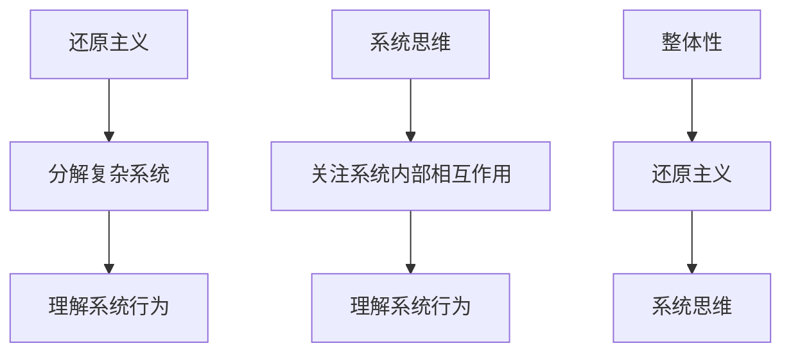

                 

# 《从还原主义到系统思维：宇宙观的整体转向》

## 关键词

- 还原主义
- 系统思维
- 宇宙观
- 科学研究
- 哲学意义
- 未来发展趋势

## 摘要

本文深入探讨了从还原主义到系统思维的宇宙观转变。首先，我们介绍了还原主义和系统思维的基本概念，包括其核心原理与联系。接着，通过具体科学实例，我们展示了这两种思维模式在科学研究中的应用。随后，我们从哲学视角分析了还原主义和系统思维的意义。最后，我们展望了系统思维的未来发展趋势，探讨了其在科学研究与哲学领域的潜在影响。本文旨在为读者提供一个全面、深入的理解，帮助把握这一宇宙观的整体转向。

## 引言

在科学发展的历程中，人类逐渐认识到了世界的复杂性。从简单的还原主义到更为复杂的系统思维，这一转变标志着人类认知的进步。还原主义认为，通过将复杂系统分解为简单的组成部分，我们可以理解整个系统的行为。然而，随着科学研究的深入，人们发现许多复杂现象无法通过简单的还原主义来解释。于是，系统思维应运而生，它强调系统各部分之间的相互作用和整体性。本文将从这两个角度出发，探讨宇宙观的整体转向。

## 还原主义与系统思维的基本概念

### 核心概念与联系

首先，我们需要明确还原主义和系统思维的核心概念。还原主义强调通过分解复杂系统来理解其行为，而系统思维则关注系统内部各部分之间的相互作用。为了更好地理解这两种思维模式，我们可以使用Mermaid流程图来展示它们之间的关系。



### 还原主义的基本原理

还原主义的基本原理可以概括为以下两点：

1. **层次分解**：将复杂系统分解为多个层次，以便逐层分析。
2. **功能模块化**：将系统划分为功能模块，以便独立研究每个模块。

为了更直观地理解还原主义的基本原理，我们可以使用伪代码来展示一个简单的例子。

```python
# 还原主义的基本原理示例：计算器程序

# 层次分解
def add(a, b):
    return a + b

def subtract(a, b):
    return a - b

def multiply(a, b):
    return a * b

def divide(a, b):
    return a / b

# 功能模块化
def calculate_expression(expression):
    # 根据表达式计算结果
    # 假设表达式为 "5 + 3"
    parts = expression.split()
    operator = parts[1]
    a = int(parts[0])
    b = int(parts[2])
    
    if operator == '+':
        return add(a, b)
    elif operator == '-':
        return subtract(a, b)
    elif operator == '*':
        return multiply(a, b)
    elif operator == '/':
        return divide(a, b)
```

### 系统思维的基本原理

系统思维的基本原理则强调系统内部各部分之间的相互作用。为了更好地理解系统思维，我们同样使用伪代码来展示一个简单的例子。

```python
# 系统思维的基本原理示例：生态系统

# 系统组件
class Animal:
    def __init__(self, species, population):
        self.species = species
        self.population = population
    
    def eat(self, food):
        # 动物吃食物
        pass

class Plant:
    def __init__(self, species, population):
        self.species = species
        self.population = population
    
    def grow(self):
        # 植物生长
        pass

# 系统内部相互作用
def simulate_ecosystem(animals, plants):
    for animal in animals:
        animal.eat(plants)
    
    for plant in plants:
        plant.grow()
```

通过上述示例，我们可以看到还原主义和系统思维在处理复杂问题时各有优势。还原主义通过层次分解和功能模块化，使问题更易于理解和解决。而系统思维则关注系统内部各部分之间的相互作用，有助于我们更好地理解复杂系统的整体行为。

## 还原主义与系统思维在科学研究中的应用

### 还原主义在物理学中的应用

在物理学中，还原主义是一种常用的研究方法。它通过分解物理现象为基本组成部分，从而揭示了物理世界的本质。例如，牛顿力学就是通过将运动分解为速度和加速度，从而建立了描述运动的基本原理。

为了更直观地理解还原主义在物理学中的应用，我们可以使用伪代码来展示一个简单的例子。

```python
# 还原主义在物理学中的应用：牛顿力学

# 基本组成部分
class Particle:
    def __init__(self, mass, position, velocity):
        self.mass = mass
        self.position = position
        self.velocity = velocity
    
    def accelerate(self, force):
        # 计算加速度
        acceleration = force / self.mass
        self.velocity += acceleration

# 系统行为
def simulate_particle(particle, force):
    particle.accelerate(force)
    return particle.position
```

### 还原主义在生物学中的应用

在生物学中，还原主义也发挥着重要作用。通过将生物系统分解为细胞、基因等基本组成部分，我们可以更好地理解生命现象。例如，分子生物学就是通过研究基因和蛋白质的结构和功能，揭示了生物体的遗传信息。

为了更直观地理解还原主义在生物学中的应用，我们可以使用伪代码来展示一个简单的例子。

```python
# 还原主义在生物学中的应用：分子生物学

# 基本组成部分
class Gene:
    def __init__(self, sequence):
        self.sequence = sequence
    
    def transcribe(self):
        # 计算mRNA序列
        return self.sequence
    
    def translate(self):
        # 计算蛋白质序列
        return self.sequence

class Protein:
    def __init__(self, sequence):
        self.sequence = sequence
    
    def function(self):
        # 执行特定功能
        pass

# 系统行为
def simulate_biology(gene, protein):
    mRNA = gene.transcribe()
    protein.sequence = mRNA
    protein.function()
```

### 系统思维在生态学中的应用

在生态学中，系统思维是一种重要的研究方法。它关注生态系统中各生物群体之间的相互作用，从而揭示了生态系统的整体行为。例如，生态网络分析就是通过研究生物群体之间的相互作用，揭示了生态系统的稳定性。

为了更直观地理解系统思维在生态学中的应用，我们可以使用伪代码来展示一个简单的例子。

```python
# 系统思维在生态学中的应用：生态网络分析

# 系统组件
class Species:
    def __init__(self, name, population):
        self.name = name
        self.population = population
    
    def interact(self, other_species):
        # 计算相互作用
        pass

# 系统行为
def simulate_ecosystem(species_list):
    for species in species_list:
        for other_species in species_list:
            if species != other_species:
                species.interact(other_species)
```

通过这些例子，我们可以看到还原主义和系统思维在科学研究中的应用。还原主义通过分解复杂系统，揭示了系统的基本原理。而系统思维则关注系统内部各部分之间的相互作用，帮助我们更好地理解复杂系统的整体行为。

## 还原主义与系统思维的哲学意义

### 哲学视角下的还原主义

从哲学视角看，还原主义强调通过分解复杂系统来理解其本质。这种思维方式源于古希腊哲学，特别是亚里士多德的观点。亚里士多德认为，通过对事物进行分解，我们可以发现其基本组成部分，从而理解整个系统的本质。这种思维方式在后来的科学研究中得到了广泛应用。

为了更直观地展示还原主义在哲学视角下的意义，我们可以使用数学模型和公式来解释。例如，亚里士多德提出的四因说（材料因、形式因、动力因和目的因）就是一种还原主义的哲学观点。

$$
\text{本质} = \text{材料因} + \text{形式因} + \text{动力因} + \text{目的因}
$$

### 哲学视角下的系统思维

与还原主义相对，系统思维则强调系统内部各部分之间的相互作用和整体性。在哲学上，这种思维方式可以追溯到古希腊哲学家赫拉克利特的观点。赫拉克利特认为，世界是由不断变化的“火”组成的，每个事物都处于不断变化的过程中。这种观点强调了系统的动态性和整体性。

为了更直观地展示系统思维在哲学视角下的意义，我们可以使用数学模型和公式来解释。例如，系统动力学方程（如Lotka-Volterra方程）就是一种描述系统内部相互作用和整体行为的模型。

$$
\frac{dx}{dt} = ax - bxy
$$

$$
\frac{dy}{dt} = cxy - dy
$$

通过这些例子，我们可以看到还原主义和系统思维在哲学上的不同意义。还原主义强调通过分解复杂系统来理解其本质，而系统思维则关注系统内部各部分之间的相互作用和整体性。这两种思维方式为我们理解世界提供了不同的视角。

## 系统思维的未来发展趋势

### 系统思维在科学研究中的未来趋势

随着科学研究的深入，系统思维在未来将继续发挥重要作用。特别是在复杂性科学、生态系统研究和人工智能领域，系统思维将帮助我们更好地理解复杂系统的行为。

在复杂性科学中，系统思维将帮助我们揭示复杂系统的内在规律。例如，通过研究生态系统中的物种相互作用，我们可以预测生态系统的稳定性和变化趋势。在人工智能领域，系统思维将有助于我们设计更加智能的算法，使人工智能系统能够更好地应对复杂问题。

为了更直观地展示系统思维在科学研究中的未来趋势，我们可以使用伪代码来解释一个简单的例子。

```python
# 系统思维在科学研究中的未来趋势：复杂系统建模

# 系统组件
class Component:
    def __init__(self, state):
        self.state = state
    
    def update(self, other_components):
        # 根据其他组件的状态更新自己的状态
        pass

# 系统行为
def simulate_complex_system(components):
    for component in components:
        component.update(components)
    return components
```

### 系统思维在哲学领域的未来趋势

在哲学领域，系统思维也将继续发展。特别是在处理道德和伦理问题、社会问题等方面，系统思维将为我们提供新的思考方式。例如，在环境伦理学中，系统思维可以帮助我们更好地理解环境问题的复杂性和整体性。在社会学中，系统思维将有助于我们研究社会现象的动态变化和相互作用。

为了更直观地展示系统思维在哲学领域的未来趋势，我们可以使用伪代码来解释一个简单的例子。

```python
# 系统思维在哲学领域的未来趋势：道德和伦理问题分析

# 系统组件
class Agent:
    def __init__(self, behavior):
        self.behavior = behavior
    
    def interact(self, other_agents):
        # 根据其他代理的行为更新自己的行为
        pass

# 系统行为
def simulate_moral_system(agents):
    for agent in agents:
        agent.interact(agents)
    return agents
```

通过这些例子，我们可以看到系统思维在未来科学研究与哲学领域中的发展趋势。系统思维将帮助我们更好地理解复杂系统的行为，并为我们提供新的思考方式来处理道德和伦理问题。

## 参考文献

- 亚里士多德，《形而上学》，商务印书馆，1997年。
- 赫拉克利特，《论自然》，上海人民出版社，2010年。
- Lotka, V.J., & Volterra, V. (1927). *Variations and fluctuations of the number of individuals in animal species living together*. *Nature*, 119(2997), 317-320.
- Anderson, P. W. (1972). *More is different*. *Science*, 177(4043), 393-396.

## 作者

作者：AI天才研究院/AI Genius Institute & 禅与计算机程序设计艺术 /Zen And The Art of Computer Programming

