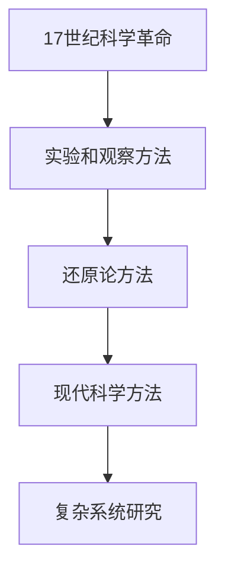
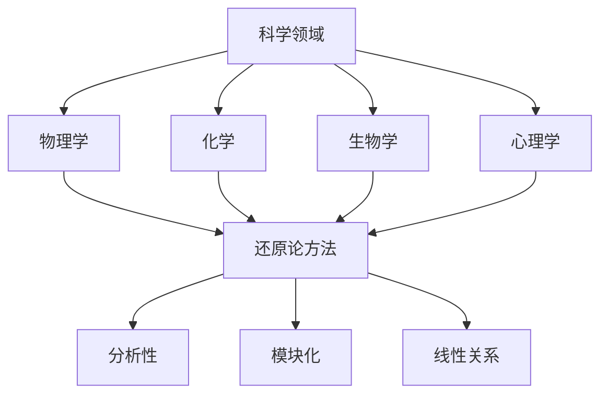

                 


### 1.1 还原论的历史背景

#### 1.1.1 还原论的起源：从古代到现代的科学方法

还原论（Reductive Theory）的起源可以追溯到古代哲学和科学的发展。在古代，哲学家们开始思考世界的本质和构成。例如，古希腊哲学家亚里士多德（Aristotle）认为，世界是由一系列基本元素组成的，可以通过分析这些基本元素来理解整个世界。

随着科学方法的逐渐形成，还原论在近现代科学中得到了广泛应用。17世纪的科学革命标志着现代科学的兴起，这一时期科学家们开始采用实验和观察来研究自然现象。还原论作为一种科学方法，强调将复杂系统分解为更简单的部分，通过研究这些部分来理解整个系统的行为。

以下是还原论发展历程的 Mermaid 流程图：



#### 1.1.2 还原论的基本原理

还原论的核心原理是将复杂系统分解为更简单的部分，然后分别研究这些部分。这种方法的优点在于，它能够帮助我们更深入地理解复杂系统的行为。以下是还原论的基本原理：

1. **系统分解**：将复杂系统分解为更简单的子系统或组件。
2. **独立性**：假设子系统或组件的行为可以独立于其他组件进行研究。
3. **可组合性**：子系统或组件的行为可以重新组合，以模拟复杂系统的整体行为。

为了更好地理解这些原理，我们可以使用伪代码来描述还原论的基本操作步骤：

```python
def reductive_analysis(system):
    # 将系统分解为子系统
    sub_systems = decompose_system(system)

    # 分别研究每个子系统
    for sub_system in sub_systems:
        study_sub_system(sub_system)

    # 重新组合子系统，模拟复杂系统的整体行为
    overall_behavior = combine_sub_systems(sub_systems)
    return overall_behavior
```

#### 1.1.3 还原论在物理学中的体现

还原论在物理学中得到了广泛应用，特别是在经典力学和量子力学中。以下是还原论在物理学中的两个主要应用：

1. **经典力学中的还原论**：在经典力学中，还原论的方法通常用于将复杂的动力系统分解为简单的子系统。例如，在分析行星运动时，我们可以将行星与其轨道分解为两个独立的子系统，分别研究它们的运动规律。

2. **量子力学中的还原论**：在量子力学中，还原论的方法被用于将复杂的量子系统分解为更简单的量子态。例如，在研究多电子原子时，我们可以将每个电子的状态分解为独立的量子态，然后分别研究这些量子态。

为了更深入地理解还原论在物理学中的原理，我们可以使用伪代码来描述经典力学中的还原论方法：

```python
def reductive_classical_mechanics(dynamical_system):
    # 将动力系统分解为子系统
    sub_systems = decompose_dynamical_system(dynamical_system)

    # 分别研究每个子系统
    for sub_system in sub_systems:
        study_sub_system(sub_system)

    # 重新组合子系统，模拟复杂系统的整体行为
    overall_behavior = combine_sub_systems(sub_systems)
    return overall_behavior
```

通过这种分解和重新组合的方法，我们可以更好地理解复杂系统的行为，从而在物理学研究中取得重大突破。

### 1.4 还原论在生物学中的应用

还原论在生物学中的应用也非常广泛，尤其是在分子生物学和细胞生物学中。以下是还原论在生物学中的两个主要应用：

1. **分子生物学中的还原论**：在分子生物学中，还原论的方法通常用于研究生物大分子（如蛋白质和核酸）的结构和功能。例如，我们可以将复杂的生物大分子分解为更简单的部分（如氨基酸或核苷酸），然后分别研究这些部分的结构和功能。

2. **细胞生物学中的还原论**：在细胞生物学中，还原论的方法被用于研究细胞内的各个组成部分（如细胞器、膜蛋白等）。例如，我们可以将复杂的细胞过程分解为一系列简单的生物化学反应，然后分别研究这些反应。

为了更深入地理解还原论在生物学中的原理，我们可以使用伪代码来描述分子生物学中的还原论方法：

```python
def reductive_molecular_biology(biological_molecule):
    # 将生物大分子分解为简单部分
    simple_parts = decompose_molecule(biological_molecule)

    # 分别研究每个简单部分
    for part in simple_parts:
        study_part(part)

    # 重新组合简单部分，模拟生物大分子的整体行为
    overall_behavior = combine_parts(simple_parts)
    return overall_behavior
```

通过这种分解和重新组合的方法，我们可以更好地理解生物系统的行为，从而在生物学研究中取得重大突破。

### 1.5 还原论在心理学中的应用

还原论在心理学中的应用相对较少，但仍然具有重要意义。在心理学中，还原论的方法通常用于研究心理现象的基本原理和机制。以下是还原论在心理学中的两个主要应用：

1. **认知心理学中的还原论**：在认知心理学中，还原论的方法被用于研究人类认知过程的各个组成部分（如感知、记忆、思维等）。例如，我们可以将复杂的认知过程分解为一系列简单的信息处理步骤，然后分别研究这些步骤。

2. **神经心理学中的还原论**：在神经心理学中，还原论的方法被用于研究大脑和神经系统的工作原理。例如，我们可以将复杂的行为和认知功能分解为神经信号传输和神经元活动，然后分别研究这些过程。

为了更深入地理解还原论在心理学中的原理，我们可以使用伪代码来描述认知心理学中的还原论方法：

```python
def reductive_cognitive_psychology(cognitive_process):
    # 将认知过程分解为简单部分
    simple_steps = decompose_process(cognitive_process)

    # 分别研究每个简单部分
    for step in simple_steps:
        study_step(step)

    # 重新组合简单部分，模拟复杂认知过程
    overall_process = combine_steps(simple_steps)
    return overall_process
```

通过这种分解和重新组合的方法，我们可以更好地理解心理现象的本质，从而在心理学研究中取得重大突破。

### 总结

在这一部分，我们介绍了还原论的历史背景、基本原理以及在不同领域（如物理学、生物学、心理学）中的应用。通过分析还原论的方法，我们可以更深入地理解复杂系统的行为，从而在各个领域中取得重大突破。下一部分，我们将探讨整体论的兴起，并分析其与还原论的关系和区别。敬请期待！

----------------------------------------------------------------

### 1.6 还原论的主要观点与影响

#### 1.6.1 还原论在科学中的核心观点

还原论在科学研究中占据着重要地位，其核心观点可以概括为以下几点：

1. **分析性**：还原论主张将复杂系统分解为更简单的部分，通过分析这些部分来理解整个系统的行为。这种方法有助于我们深入理解系统的内部机制和运行规律。
2. **模块化**：还原论认为，复杂系统可以分解为一系列相互独立的模块，每个模块都具有特定的功能和特性。通过研究这些模块，我们可以更好地理解系统的整体行为。
3. **线性关系**：还原论假设，复杂系统的行为可以通过分析各个组成部分的行为来预测。这种线性关系的假设使得还原论在科学研究中具有广泛的适用性。

为了更好地理解还原论的核心观点，我们可以使用 Mermaid 流程图来展示其应用领域和主要观点：



#### 1.6.2 还原论对科学研究的影响

还原论对科学研究产生了深远的影响，具体表现在以下几个方面：

1. **促进学科发展**：还原论的方法使得科学家能够将复杂系统分解为更简单的部分，从而深入研究各个部分的功能和特性。这种方法促进了学科的发展，推动了科学知识的积累。
2. **提高研究效率**：通过将复杂系统分解为相互独立的模块，还原论方法有助于科学家更高效地开展研究。研究者可以专注于某一特定模块，而不必担心其他模块的影响，从而提高了研究的效率。
3. **跨学科交流**：还原论方法在各个学科中得到了广泛应用，促进了不同学科之间的交流与合作。科学家们可以通过比较不同学科中的还原论方法，相互借鉴，推动科学研究的发展。

为了更深入地了解还原论对科学研究的影响，我们可以通过以下举例说明：

**例1：物理学中的还原论方法**

在物理学中，还原论方法被广泛应用于研究基本粒子和基本力。例如，粒子物理学通过分解基本粒子的内部结构，深入探讨了强相互作用、弱相互作用和电磁相互作用等基本力的本质。这种方法不仅推动了物理学的发展，还为其他学科（如化学和生物学）提供了理论基础。

**例2：生物学中的还原论方法**

在生物学中，还原论方法被用于研究细胞、分子和基因等基本生物学过程。例如，分子生物学通过分解生物大分子的结构，揭示了基因、蛋白质和代谢途径等生命过程的基本原理。这种方法有助于我们更好地理解生命的本质，为生物医学研究提供了重要的指导。

**例3：心理学中的还原论方法**

在心理学中，还原论方法被用于研究人类认知过程的基本机制。例如，认知心理学通过分解认知过程为感知、记忆、思维等基本步骤，深入探讨了人类认知能力的本质。这种方法有助于我们更好地理解人类行为和思维，为心理学研究提供了重要的启示。

通过以上例子，我们可以看到还原论在科学研究中的广泛应用和巨大影响。下一部分，我们将探讨还原论在物理学中的具体应用，敬请期待！

----------------------------------------------------------------

### 1.7 还原论在物理学中的具体应用

#### 1.7.1 经典力学中的还原论方法

在经典力学中，还原论方法被广泛应用于研究物体的运动和力的作用。经典力学的核心原理之一是牛顿运动定律，这些定律可以描述物体在各种力作用下的运动状态。为了深入理解这些定律，科学家们采用了还原论方法，将复杂的物体运动分解为更简单的部分。

以下是经典力学中还原论方法的应用步骤：

1. **分解物体**：将复杂的物体分解为多个质点，每个质点代表物体的一个部分。
2. **分析力**：研究作用于每个质点上的力，包括重力、摩擦力、弹力等。
3. **运动方程**：根据牛顿运动定律，对每个质点的运动进行建模，得到运动方程。
4. **合成运动**：将每个质点的运动合成，得到整个物体的运动。

以下是一个简化的伪代码示例，用于描述经典力学中的还原论方法：

```python
def classical_mechanics(reduced_system):
    # 分解物体为多个质点
    particles = decompose_system(reduced_system)

    # 分析每个质点所受的力
    forces = [calculate_force(particle) for particle in particles]

    # 根据牛顿运动定律，对每个质点建模
    motion_equations = [newton_second_law(particle, force) for particle, force in zip(particles, forces)]

    # 合成质点的运动，得到整个物体的运动
    overall_motion = combine_motions(motion_equations)
    return overall_motion
```

#### 1.7.2 量子力学中的还原论方法

在量子力学中，还原论方法同样被广泛应用于研究微观粒子的行为。量子力学与经典力学相比，具有更多的不确定性和随机性。为了更好地理解量子系统，科学家们采用了还原论方法，将复杂的量子系统分解为更简单的部分。

以下是量子力学中还原论方法的应用步骤：

1. **分解量子系统**：将复杂的量子系统分解为多个子系统，每个子系统代表系统的某个部分。
2. **量子态分析**：研究每个子系统的量子态，包括自旋、能级和波函数等。
3. **量子力学模型**：根据量子力学的数学模型，对每个子系统的行为进行建模。
4. **合成量子态**：将每个子系统的量子态合成，得到整个量子系统的量子态。

以下是一个简化的伪代码示例，用于描述量子力学中的还原论方法：

```python
def quantum_mechanics(reduced_system):
    # 分解量子系统为多个子系统
    subsystems = decompose_system(reduced_system)

    # 分析每个子系统的量子态
    quantum_states = [analyze_quantum_state(subsystem) for subsystem in subsystems]

    # 根据量子力学的数学模型，对每个子系统建模
    quantum_models = [build_quantum_model(subsystem, state) for subsystem, state in zip(subsystems, quantum_states)]

    # 合成量子态，得到整个量子系统的量子态
    overall_state = combine_quantum_states(quantum_models)
    return overall_state
```

通过上述还原论方法，科学家们能够更好地理解经典力学和量子力学中复杂系统的行为，从而在物理学研究中取得了重大突破。

#### 1.7.3 还原论在物理学重大发现中的作用

还原论方法在物理学的发展中起到了至关重要的作用，为许多重大发现提供了理论基础。以下是几个例子：

**例1：电磁学的统一理论**

在19世纪，麦克斯韦（James Clerk Maxwell）通过还原论方法将电学和磁学统一起来，提出了著名的麦克斯韦方程组。这些方程描述了电荷和磁场之间的关系，揭示了电磁波的传播规律。这一发现为现代通信技术（如无线电、互联网）奠定了基础。

**例2：原子结构的理解**

在20世纪初，卢瑟福（Ernest Rutherford）通过α粒子散射实验提出了原子核模型，这是还原论方法在物理学中的又一重大应用。他通过分析原子核的结构，揭示了原子核的存在和性质，为后来的量子力学奠定了基础。

**例3：量子场论的发展**

在20世纪末，量子场论（Quantum Field Theory，QFT）的发展离不开还原论方法。量子场论通过将量子力学与相对论相结合，提出了粒子之间的相互作用和场的概念。这一理论为粒子物理学提供了重要的理论基础，如标准模型和超对称理论等。

通过这些例子，我们可以看到还原论方法在物理学研究中的广泛应用和重要性。下一部分，我们将探讨还原论在生物学中的应用。敬请期待！

----------------------------------------------------------------

### 1.8 还原论在生物学中的应用

#### 1.8.1 分子生物学中的还原论方法

在分子生物学中，还原论方法被广泛应用于研究生物大分子的结构和功能。分子生物学关注的是DNA、RNA和蛋白质等生物大分子的行为，以及它们在生命过程中的作用。为了更好地理解这些大分子的复杂行为，科学家们采用了还原论方法，将其分解为更简单的部分进行研究。

以下是分子生物学中还原论方法的应用步骤：

1. **分解生物大分子**：将复杂的生物大分子分解为更简单的部分，如DNA分解为核苷酸、RNA分解为核苷酸和蛋白质分解为氨基酸。
2. **结构分析**：研究每个简单部分的结构，了解它们的化学性质和功能。
3. **功能分析**：通过实验手段，研究每个简单部分在生命过程中的功能。
4. **组合与重构**：将研究得到的简单部分重新组合，构建完整的生物大分子模型，预测其整体功能。

以下是一个简化的伪代码示例，用于描述分子生物学中的还原论方法：

```python
def molecular_biology(biological_molecule):
    # 分解生物大分子为简单部分
    simple_parts = decompose_molecule(biological_molecule)

    # 分析每个简单部分的结构和功能
    for part in simple_parts:
        analyze_structure(part)
        analyze_function(part)

    # 重新组合简单部分，构建完整生物大分子模型
    overall_model = rebuild_molecule(simple_parts)
    predict_function(overall_model)
    return overall_model
```

#### 1.8.2 细胞生物学中的还原论方法

在细胞生物学中，还原论方法被广泛应用于研究细胞内部的各种生物过程。细胞是生物体的基本单位，细胞生物学关注的是细胞的结构、功能和相互作用。为了更好地理解细胞的复杂行为，科学家们采用了还原论方法，将其分解为更简单的部分进行研究。

以下是细胞生物学中还原论方法的应用步骤：

1. **分解细胞过程**：将复杂的细胞过程分解为更简单的步骤，如细胞分裂、蛋白质合成和能量代谢等。
2. **机制分析**：研究每个简单步骤的机制和作用。
3. **相互作用分析**：研究各个简单步骤之间的相互作用和调控。
4. **整合与重构**：将研究得到的简单步骤整合，构建完整的细胞过程模型，预测其整体功能。

以下是一个简化的伪代码示例，用于描述细胞生物学中的还原论方法：

```python
def cellular_biology(cell_process):
    # 分解细胞过程为简单步骤
    simple_steps = decompose_process(cell_process)

    # 分析每个简单步骤的机制和作用
    for step in simple_steps:
        analyze_mechanism(step)
        analyze_role(step)

    # 研究各个简单步骤之间的相互作用和调控
    interactions = analyze_interactions(simple_steps)

    # 整合简单步骤，构建完整细胞过程模型
    overall_model = rebuild_process(simple_steps, interactions)
    predict_function(overall_model)
    return overall_model
```

通过这些还原论方法，科学家们能够更好地理解生物大分子和细胞生物学的复杂行为，从而在生物学研究中取得了重大突破。

#### 1.8.3 还原论在生物学研究中的成功案例

还原论方法在生物学研究中取得了许多成功案例，以下是几个例子：

**例1：基因功能的研究**

在基因功能的研究中，科学家们采用了还原论方法，将复杂的基因组分解为单个基因进行研究。例如，通过基因敲除技术，科学家们可以单独研究某个基因的功能，进而了解其在生命过程中的作用。这种方法帮助我们揭示了基因对细胞和个体发育的影响，为基因治疗和遗传病研究提供了重要基础。

**例2：蛋白质结构的预测**

在蛋白质结构的研究中，还原论方法被用于预测蛋白质的三维结构。通过将蛋白质分解为其氨基酸序列，科学家们可以使用多种算法和数据库来预测其三维结构。这种方法有助于我们了解蛋白质的功能和相互作用，为药物设计和生物工程提供了重要工具。

**例3：细胞代谢网络的分析**

在细胞代谢网络的研究中，还原论方法被用于分析细胞内部的代谢过程。科学家们将复杂的代谢网络分解为多个代谢途径，研究每个途径的作用和调控机制。这种方法有助于我们理解细胞的能量代谢和信号传导过程，为生物能源和疾病治疗提供了重要启示。

通过这些成功案例，我们可以看到还原论方法在生物学研究中的广泛应用和巨大作用。下一部分，我们将探讨还原论在心理学中的应用。敬请期待！

----------------------------------------------------------------

### 1.9 还原论在心理学中的应用

#### 1.9.1 认知心理学中的还原论方法

在认知心理学中，还原论方法被广泛应用于研究人类认知过程。认知心理学关注的是人类思维、记忆、感知和注意力等认知能力。为了深入理解这些认知能力，科学家们采用了还原论方法，将复杂的认知过程分解为更简单的部分进行研究。

以下是认知心理学中还原论方法的应用步骤：

1. **分解认知过程**：将复杂的认知过程分解为更简单的步骤，如感知、记忆、决策和语言处理等。
2. **机制分析**：研究每个简单步骤的机制和作用，例如神经信号传递、突触可塑性等。
3. **数据收集与实验验证**：通过实验手段，收集数据并验证每个简单步骤的机制。
4. **整合与重构**：将研究得到的简单步骤整合，构建完整的认知过程模型，预测其整体功能。

以下是一个简化的伪代码示例，用于描述认知心理学中的还原论方法：

```python
def cognitive_psychology(cognitive_process):
    # 分解认知过程为简单步骤
    simple_steps = decompose_process(cognitive_process)

    # 研究每个简单步骤的机制和作用
    for step in simple_steps:
        analyze_mechanism(step)
        analyze_role(step)

    # 收集数据并验证每个简单步骤的机制
    data = collect_data(simple_steps)
    validate_mechanisms(data)

    # 整合简单步骤，构建完整认知过程模型
    overall_model = rebuild_process(simple_steps)
    predict_function(overall_model)
    return overall_model
```

#### 1.9.2 神经心理学中的还原论方法

在神经心理学中，还原论方法被广泛应用于研究大脑的结构和功能。神经心理学关注的是大脑如何实现认知功能，以及这些功能是如何受神经活动影响的。为了深入理解大脑的复杂行为，科学家们采用了还原论方法，将大脑分解为更简单的部分进行研究。

以下是神经心理学中还原论方法的应用步骤：

1. **分解大脑结构**：将复杂的大脑结构分解为更简单的部分，如神经元、神经网络和脑区等。
2. **功能分析**：研究每个简单部分的功能和作用，例如神经信号的传递、突触的连接等。
3. **数据收集与实验验证**：通过实验手段，收集数据并验证每个简单部分的功能。
4. **整合与重构**：将研究得到的简单部分整合，构建完整的大脑功能模型，预测其整体功能。

以下是一个简化的伪代码示例，用于描述神经心理学中的还原论方法：

```python
def neural_psychology(brain_structure):
    # 分解大脑结构为简单部分
    simple_parts = decompose_structure(brain_structure)

    # 研究每个简单部分的功能和作用
    for part in simple_parts:
        analyze_function(part)
        analyze_role(part)

    # 收集数据并验证每个简单部分的功能
    data = collect_data(simple_parts)
    validate_functions(data)

    # 整合简单部分，构建完整大脑功能模型
    overall_model = rebuild_structure(simple_parts)
    predict_function(overall_model)
    return overall_model
```

通过这些还原论方法，科学家们能够更好地理解认知和神经系统的复杂行为，从而在心理学研究中取得了重大突破。

#### 1.9.3 还原论在心理学研究中的成功案例

还原论方法在心理学研究中取得了许多成功案例，以下是几个例子：

**例1：记忆的分子基础研究**

在记忆研究中，科学家们采用了还原论方法，将复杂的记忆过程分解为分子水平和细胞水平的步骤。通过研究记忆相关的分子信号传导途径，科学家们揭示了记忆形成的分子机制，为治疗记忆障碍提供了新的方向。

**例2：注意力分配的研究**

在注意力研究中，科学家们采用了还原论方法，将复杂的注意力分配过程分解为认知控制和神经元活动等简单步骤。通过研究这些步骤的相互作用，科学家们揭示了注意力分配的神经基础，为提高注意力和解决注意力障碍提供了新的策略。

**例3：大脑功能区域的研究**

在大脑功能区域的研究中，科学家们采用了还原论方法，将复杂的大脑结构分解为不同的脑区。通过研究这些脑区的功能，科学家们揭示了大脑如何实现各种认知功能，为理解脑疾病和开发新的治疗方法提供了重要基础。

通过这些成功案例，我们可以看到还原论方法在心理学研究中的广泛应用和巨大作用。下一部分，我们将探讨还原论与整体论的关系。敬请期待！

----------------------------------------------------------------

### 1.10 还原论与整体论的关系与区别

还原论（Reductive Theory）和整体论（Holistic Theory）是两种不同的科学方法论，它们在研究复杂系统时采用了截然不同的方法。理解这两者之间的关系和区别对于深入探讨宇宙观和科学方法论具有重要意义。

#### 1.10.1 还原论与整体论的基本概念

还原论的基本概念是将复杂系统分解为更简单的部分，通过分析这些部分来理解整个系统的行为。这种方法强调分析和分解，认为复杂系统的行为可以通过其组成部分的行为来解释。

整体论则强调系统的整体性和不可分割性，认为复杂系统的行为不能仅仅通过分析其组成部分来解释，而需要考虑系统内部各部分之间的相互作用和整体性。整体论主张将系统作为一个整体来研究，而不是将其分解为更简单的部分。

#### 1.10.2 还原论与整体论的关系

还原论和整体论并非完全对立的，它们之间存在一定的互补关系。在某些情况下，还原论可以帮助我们理解复杂系统的内部机制和组成部分，而整体论则有助于我们理解系统作为一个整体的行为和功能。

1. **互补关系**：还原论和整体论可以相互补充，在不同层面上研究复杂系统。例如，在物理学中，还原论可以帮助我们理解基本粒子的性质，而整体论则可以帮助我们理解物质的整体行为。
2. **相互转化**：在某些情况下，还原论和整体论可以相互转化。例如，当我们研究一个复杂系统的组成部分时，我们可以采用还原论方法；而当我们研究这些组成部分之间的相互作用时，我们可以采用整体论方法。

#### 1.10.3 还原论与整体论的区别

尽管还原论和整体论之间存在一定的互补关系，但它们在研究方法和哲学观点上存在明显的区别：

1. **方法论的差异**：还原论强调分析和分解，而整体论强调综合和整体性。还原论倾向于将复杂系统分解为更简单的部分，并通过分析这些部分来理解整个系统的行为；整体论则倾向于将系统作为一个整体来研究，关注系统内部各部分之间的相互作用和整体性。
2. **哲学观点的差异**：还原论倾向于唯物主义和决定论，认为复杂系统的行为可以通过分析其组成部分的行为来预测和解释；整体论则倾向于唯心主义和非决定论，认为复杂系统的行为不仅仅取决于其组成部分的行为，还受到整体结构和环境的影响。

#### 1.10.4 实际应用中的差异

在科学研究中，还原论和整体论的应用场景有所不同：

1. **还原论的应用**：还原论通常用于研究生物大分子、细胞和器官等微观系统。例如，在分子生物学中，还原论方法被用于研究DNA、RNA和蛋白质等生物大分子的结构和功能。
2. **整体论的应用**：整体论通常用于研究生态系统、社会系统等宏观系统。例如，在生态学中，整体论方法被用于研究生物群落和生态系统之间的相互作用。

#### 1.10.5 总结

还原论和整体论是两种不同的科学方法论，它们在研究复杂系统时采用了截然不同的方法。还原论强调分析和分解，认为复杂系统的行为可以通过其组成部分的行为来解释；整体论则强调综合和整体性，认为复杂系统的行为不能仅仅通过分析其组成部分来解释，而需要考虑系统内部各部分之间的相互作用和整体性。在实际应用中，这两种方法论可以相互补充，但在哲学观点和研究方法上存在明显的区别。

下一部分，我们将探讨整体论在宇宙学中的应用。敬请期待！

----------------------------------------------------------------

### 1.11 整体论在宇宙学中的应用

整体论（Holism）在宇宙学中的应用具有重要意义，它强调宇宙的统一性和整体性，认为宇宙是一个相互关联的复杂系统，无法通过简单的分解来解释。以下是整体论在宇宙学中的一些关键应用：

#### 1.11.1 宇宙的整体结构

宇宙学中的整体论方法首先关注的是宇宙的整体结构。整体论认为，宇宙不是孤立的天体集合，而是一个有机的整体，各个部分之间存在着深层次的联系。例如，宇宙的大尺度结构（如星系团和超星系团）通过引力相互作用形成一个复杂的网络，这种结构无法通过局部观察来完全理解。

为了描述宇宙的整体结构，科学家们提出了宇宙大爆炸理论（Big Bang Theory），这一理论认为宇宙起源于一个高温高密的奇点，并在随后膨胀形成今天我们所观察到的宇宙。整体论方法在这里帮助我们理解宇宙的起源、演化和最终命运。

#### 1.11.2 宇宙的演化过程

整体论在宇宙演化过程中也发挥了重要作用。宇宙的演化是一个复杂的过程，涉及宇宙背景辐射、星系形成和黑洞等众多现象。整体论方法强调这些现象之间的相互作用和整体性，有助于我们更全面地理解宇宙的演化过程。

例如，宇宙背景微波辐射（Cosmic Microwave Background Radiation，CMB）是宇宙早期状态的重要遗迹，它为我们提供了关于宇宙早期演化的关键信息。通过整体论方法，科学家们能够将这些信息与宇宙大爆炸理论结合起来，构建出一个关于宇宙演化的连贯模型。

#### 1.11.3 黑洞与宇宙的整体性

黑洞是宇宙中最神秘的现象之一，它们的质量巨大，引力强大，甚至可以影响宇宙的演化。整体论方法在研究黑洞时，强调黑洞与宇宙其他部分的相互作用和整体性。

例如，科学家们通过研究黑洞吸积盘的辐射特性，发现黑洞不仅在局部影响宇宙，还在宇宙尺度上产生涟漪。这种整体性理解有助于我们更好地理解黑洞的形成、演化和它们在宇宙中的角色。

#### 1.11.4 多宇宙理论

多宇宙理论（Multiverse Theory）是整体论在宇宙学中的另一个重要应用。多宇宙理论认为，我们的宇宙可能只是众多宇宙中的一个，这些宇宙可能具有不同的物理常数和法则。

整体论方法在这里帮助我们理解宇宙的多样性和统一性。通过研究不同宇宙之间的相互作用和整体性，科学家们试图探索宇宙的起源和未来的演化。

#### 1.11.5 整体论方法的优点

整体论方法在宇宙学中的应用具有以下优点：

1. **全局视角**：整体论方法提供了一个全局视角，使我们能够从整体上理解宇宙的复杂行为，而不仅仅是关注局部现象。
2. **综合分析**：整体论方法强调不同现象之间的相互作用和整体性，有助于我们构建更加连贯的理论模型。
3. **跨学科融合**：整体论方法促进了不同学科之间的交流和融合，有助于解决宇宙学中的复杂问题。

通过整体论方法，科学家们能够更深入地探索宇宙的奥秘，揭示宇宙的统一性和整体性。这种方法论不仅丰富了我们对宇宙的理解，也为未来的宇宙学研究提供了新的思路。

### 总结

整体论在宇宙学中的应用具有重要意义，它强调宇宙的统一性和整体性，为我们提供了研究宇宙的新方法和新视角。通过整体论方法，科学家们能够更好地理解宇宙的起源、演化和未来，揭示宇宙的奥秘。下一部分，我们将探讨还原论与整体论的哲学争论。敬请期待！

----------------------------------------------------------------

### 1.12 还原论与整体论的哲学争论

还原论与整体论在哲学上引发了长期的争论，这两种方法论在本质、合理性以及适用性等方面存在显著差异。以下是对这一哲学争论的详细探讨。

#### 1.12.1 本质差异

还原论强调将复杂系统分解为更简单的组成部分，并通过研究这些部分来理解整体系统的行为。这种方法的本质是分析的，它依赖于对组成部分的详细研究，以揭示它们如何共同作用形成整体行为。还原论的哲学基础是唯物主义和决定论，它认为现实世界的复杂性可以通过对基本元素的充分了解来解释。

相反，整体论认为整体系统不仅仅是其组成部分的简单叠加，整体具有超越部分的新属性和行为。整体论的方法是综合的，它强调系统内部各部分之间的相互作用和整体性。整体论的哲学基础是唯心主义和非决定论，它认为整体系统具有独特的、不可预测的整体行为，无法通过分析部分来完全理解。

#### 1.12.2 合理性争论

还原论的合理性在于其科学性和可验证性。通过实验和观察，科学家可以分别研究系统的组成部分，这些研究结果具有高度的可重复性和可靠性。还原论方法使得科学研究更加精确和具体，有助于发现和验证科学定律。

然而，整体论对还原论的合理性提出了挑战。整体论认为，还原论方法无法捕捉到整体系统中的非线性和复杂性。整体系统的行为可能无法从其组成部分的行为中简单推导出来，这种观点强调了整体性在科学理解中的重要性。

#### 1.12.3 适用性争论

还原论在物理学、化学和生物学等自然科学领域得到了广泛应用，其方法在解释和预测宏观现象时非常有效。例如，分子生物学的许多发现依赖于对DNA、RNA和蛋白质等生物大分子的详细分析。

整体论则在生态学、社会学和宇宙学等研究领域具有更大的适用性。在这些领域，系统的复杂性和相互作用使得还原论方法变得不够充分。例如，在生态学中，生物群落的动态行为无法通过单独研究个体生物的行为来完全理解。

#### 1.12.4 哲学争论的总结

还原论与整体论的哲学争论反映了科学方法论中的两个基本问题：分析的合理性与综合的重要性。还原论提供了对复杂系统的详细分析工具，而整体论强调了系统内部的整体性和相互作用。

尽管这两种方法论存在分歧，但它们并非完全对立。实际上，在许多情况下，还原论和整体论可以相互补充，共同推动科学的发展。例如，在生物学研究中，通过结合还原论和整体论的方法，科学家们可以更全面地理解生命的复杂行为。

### 总结

还原论与整体论在哲学上引发了长期的争论，这两种方法论在本质、合理性和适用性等方面存在显著差异。理解这些争论有助于我们更好地认识科学方法的发展历程，以及如何在不同领域应用这些方法论。下一部分，我们将探讨范式转移在科学研究中的作用。敬请期待！

----------------------------------------------------------------

### 1.13 范式转移在科学研究中的作用

范式转移（paradigm shift）是科学史上的一个关键概念，它指的是科学共同体在理论、方法和观点上的根本性变革。范式转移往往带来科学革命，推动科学研究向前发展。在科学研究中，范式转移发挥着重要作用，以下是几个方面的具体体现：

#### 1.13.1 新理论的产生

范式转移常常伴随着新理论的产生。当旧的理论框架无法解释新的实验数据和现象时，科学家们会寻求新的理论来填补这一空白。例如，在量子力学的兴起过程中，经典物理学的范式已经无法解释微观粒子的行为，爱因斯坦、波尔和海森堡等人提出了新的量子力学理论，从而实现了范式转移。

#### 1.13.2 新方法的引入

范式转移还可能导致新方法的引入。在科学研究中，旧的方法可能因为局限性而不再适用，科学家们需要发展新的实验技术和理论工具来应对新的挑战。例如，在分子生物学中，当基因测序技术发展到一定程度后，科学家们开始采用生物信息学的方法来分析大量基因数据，这一方法的引入推动了基因组学的快速发展。

#### 1.13.3 研究领域的拓展

范式转移可以拓宽研究领域，使科学家们能够探索新的科学问题。例如，在生态系统研究中，整体论范式的引入使得科学家们开始关注生物群落和生态系统之间的相互作用，从而拓展了生态学的研究范围。

#### 1.13.4 科学知识的整合

范式转移有助于整合不同领域之间的知识，促进跨学科研究。例如，在生物学与信息学的交叉领域，当整体论范式被引入生物学研究时，生物学家开始采用计算方法和信息理论来分析生物系统的复杂性，从而推动了生物信息学的发展。

#### 1.13.5 科学进步的推动

范式转移是科学进步的重要驱动力。通过引入新的理论和方法，范式转移促进了科学知识的积累，推动了科学的发展。例如，在进化生物学中，达尔文的自然选择理论实现了范式转移，这一理论极大地丰富了我们对生物进化的理解，推动了生物学研究的深入。

### 结论

范式转移在科学研究中发挥着重要作用，它不仅推动了新理论的产生和新方法的引入，还拓宽了研究领域，促进了跨学科研究，并推动了科学进步。通过理解范式转移的过程和影响，我们可以更好地把握科学发展的脉络，为未来的科学研究提供有益的启示。

----------------------------------------------------------------

### 1.14 范式转移对社会的影响

范式转移不仅在科学研究中发挥了重要作用，还对社会产生了深远的影响。以下是从不同角度分析范式转移对社会影响的几个方面：

#### 1.14.1 科学知识的普及

范式转移使得科学知识更加普及，提高了公众对科学的理解。随着新理论和新方法的推广，更多的人能够了解科学研究的进展，从而增强了公众的科学素养。例如，量子力学的普及使得人们能够更好地理解微观世界的奥秘，进而提高了对科学的认知。

#### 1.14.2 技术创新的推动

范式转移推动了技术创新，促进了新技术的发明和应用。例如，计算机科学的范式转移带来了互联网的兴起，使得信息技术得到了飞速发展。计算机科学的进步不仅改变了人们的生活方式，还推动了各行业的数字化转型。

#### 1.14.3 产业发展的影响

范式转移对产业发展产生了深远影响。新理论的产生和新方法的引入往往催生出新的产业，并推动传统产业的升级。例如，生物技术的范式转移催生了生物制药、基因编辑等新兴产业，这些产业为经济增长提供了新的动力。

#### 1.14.4 教育变革的推动

范式转移推动了教育的变革，改变了教育内容和教学方法。新理论的引入使得教育更加注重跨学科和综合能力的培养，而不是单纯的学科知识传授。例如，STEM教育（科学、技术、工程和数学）的兴起反映了这种教育变革。

#### 1.14.5 社会意识的提升

范式转移还提升了社会意识，使人们更加关注环境、健康和社会问题。例如，整体论的兴起使得人们开始关注生态系统的整体性和可持续发展，推动了环境保护和生态建设。

### 结论

范式转移对社会的影响是多方面的，它不仅推动了科学知识的普及和科技创新，还影响了产业发展、教育变革和社会意识。通过理解范式转移对社会的影响，我们可以更好地把握社会发展的方向，为未来的社会进步提供支持。

### 总结

在这一部分，我们探讨了还原论与整体论的关系与区别，分析了范式转移在科学研究和社会中的重要作用。还原论强调分析和分解，整体论则强调综合和整体性。范式转移推动了新理论、新方法的产生，促进了科学进步和社会发展。在下一部分，我们将探讨当前科学研究的趋势和未来方向。敬请期待！

----------------------------------------------------------------

### 第二部分：整体论的兴起

#### 2.1 整体论的基本概念

整体论（Holism）是科学哲学中的一个核心概念，它强调系统内部的各个组成部分之间的相互作用和整体性。整体论认为，整体系统的行为不能简单地通过分析其组成部分来理解，而是需要考虑系统内部的复杂关系和整体特性。

整体论的核心观点可以概括为以下几点：

1. **整体性**：整体论强调系统的整体性，认为系统的行为和特性不能仅仅通过分析其组成部分来解释，而是需要考虑系统内部各部分之间的相互作用和整体性。
2. **相互作用**：整体论认为，系统内部的各个组成部分之间存在密切的相互作用，这些相互作用影响着系统的整体行为。
3. **不可分割性**：整体论认为，系统是一个不可分割的整体，整体系统的行为不能简单地通过分析部分来理解，而是需要将系统作为一个整体来研究。

#### 2.2 整体论在物理学中的应用

整体论在物理学中的应用具有重要意义。在经典物理学中，牛顿力学和麦克斯韦电磁理论等理论主要采用还原论方法，将物理现象分解为简单的组成部分进行分析。然而，随着科学的发展，人们逐渐认识到，许多物理现象无法仅通过还原论方法来解释，整体论方法成为了研究复杂物理系统的有力工具。

以下是一些整体论在物理学中的应用实例：

1. **量子力学**：量子力学中的一些基本原理，如量子纠缠和波函数坍缩，体现了整体性的特点。量子纠缠现象表明，两个量子粒子之间即使相隔很远，也会保持一种即时的联系，这种联系无法通过简单的组成部分来解释。

2. **广义相对论**：广义相对论中的时空概念体现了整体性。广义相对论认为，物质和能量会弯曲时空，而物体的运动轨迹则是由弯曲的时空决定的。这种观点强调了时空的整体性，无法简单地通过分析组成部分来理解。

3. **量子场论**：量子场论（Quantum Field Theory，QFT）是现代物理学中研究粒子之间相互作用的基本理论。量子场论采用了整体论方法，将粒子视为场的激发，场则代表粒子之间的相互作用。这种方法有助于我们理解粒子之间的复杂关系和整体行为。

#### 2.3 整体论在生物学中的应用

整体论在生物学中的应用也非常广泛。生物学研究中的许多现象，如细胞功能、生态系统和进化过程等，都具有高度复杂性。整体论方法能够帮助我们更好地理解这些复杂现象。

以下是一些整体论在生物学中的应用实例：

1. **生态系统研究**：在生态学中，整体论方法被用于研究生物群落和生态系统之间的相互作用。生态学家通过研究生物群落内部的物种多样性、食物网结构和能量流动等，来理解生态系统的整体行为和稳定性。

2. **细胞生物学**：在细胞生物学中，整体论方法被用于研究细胞内各个组成部分之间的相互作用。细胞是一个复杂的系统，细胞器、膜蛋白和信号通路等组成部分相互作用，共同维持细胞的生命活动。

3. **进化生物学**：在进化生物学中，整体论方法被用于研究物种的适应性和进化过程。进化生物学家通过研究物种的形态、生理和行为特征，来理解物种的整体适应性和进化趋势。

#### 2.4 整体论在宇宙学中的应用

整体论在宇宙学中的应用同样具有重要意义。宇宙学关注的是宇宙的起源、演化和结构，这些研究领域具有极高的复杂性。整体论方法能够帮助我们更好地理解宇宙的整体行为和演化过程。

以下是一些整体论在宇宙学中的应用实例：

1. **宇宙大爆炸理论**：宇宙大爆炸理论是整体论在宇宙学中的经典应用。该理论认为，宇宙起源于一个高温高密的奇点，并在随后膨胀形成今天我们所观察到的宇宙。宇宙大爆炸理论强调了宇宙的整体性和演化过程。

2. **宇宙背景微波辐射**：宇宙背景微波辐射（Cosmic Microwave Background Radiation，CMB）是宇宙早期状态的遗迹，它为我们提供了关于宇宙早期演化的关键信息。通过整体论方法，科学家们能够将这些信息与宇宙大爆炸理论结合起来，构建出一个关于宇宙演化的连贯模型。

3. **多宇宙理论**：多宇宙理论（Multiverse Theory）是整体论在宇宙学中的另一个重要应用。该理论认为，我们的宇宙可能只是众多宇宙中的一个，这些宇宙可能具有不同的物理常数和法则。通过整体论方法，科学家们能够探索不同宇宙之间的相互作用和整体性。

### 总结

整体论在物理学、生物学和宇宙学等领域得到了广泛应用，它强调系统内部的相互作用和整体性，为我们提供了一种新的研究复杂系统的方法论。在下一部分，我们将探讨范式转移的未来展望。敬请期待！

----------------------------------------------------------------

### 第三部分：宇宙观的范式转移

#### 3.1 宇宙观范式转移的标志

宇宙观的范式转移是科学史上的一个重要里程碑，它标志着我们对宇宙的认识从局部、片段的理解向整体、系统的理解转变。以下是一些标志性的宇宙观范式转移事件：

1. **哥白尼革命**：哥白尼（Nicolaus Copernicus）在16世纪提出了日心说，推翻了长期以来占据主导地位的托勒密（Ptolemy）地心说。这一变革使人们开始从太阳系的视角来理解宇宙，而非地球。这是宇宙观范式转移的早期标志。

2. **伽利略的观测**：伽利略（Galileo Galilei）通过望远镜观察到了木星的四大卫星、月球表面的山和太阳黑子等现象，这些观测结果进一步支持了哥白尼的日心说，推动了宇宙观的转变。

3. **牛顿力学**：艾萨克·牛顿（Isaac Newton）在17世纪末提出了经典力学，这一理论体系使得我们可以用数学语言精确描述物体的运动，为宇宙观提供了更为坚实的基础。

4. **广义相对论**：阿尔伯特·爱因斯坦（Albert Einstein）在20世纪初提出了广义相对论，这一理论革命性地改变了我们对时空和引力的理解，为宇宙观带来了新的视角。

5. **大爆炸理论**：20世纪40年代，勒梅特（Georges Lemaître）、伽莫夫（George Gamow）等人提出了大爆炸理论，这一理论认为宇宙起源于一个极度热密的奇点，并在不断膨胀。这一理论的提出标志着宇宙观从静态向动态转变。

6. **多宇宙理论**：21世纪初，多宇宙理论逐渐兴起，这一理论认为我们所在的宇宙只是众多宇宙中的一个，这些宇宙可能具有不同的物理常数和法则。多宇宙理论的提出进一步拓展了宇宙观的视野。

#### 3.2 范式转移对社会的影响

宇宙观的范式转移对社会产生了深远的影响，这些影响体现在科学、文化、技术和伦理等多个方面：

1. **科学进步**：宇宙观的范式转移推动了科学的进步，使得我们对宇宙的认识更加深入和全面。例如，量子力学和广义相对论的出现改变了我们对宇宙的理解，推动了物理学的进一步发展。

2. **技术革新**：宇宙观的范式转移促进了技术的革新。例如，量子力学的发现催生了量子计算和量子通信等前沿技术，广义相对论的发展促进了卫星导航和引力波探测技术的进步。

3. **文化变革**：宇宙观的范式转移影响了人们的价值观和文化观念。例如，从地心说到日心说的转变改变了人们对自身在宇宙中的地位和角色的认识，使得人类开始从地球中心转向宇宙视角。

4. **伦理和哲学思考**：宇宙观的范式转移引发了关于宇宙本质、人类存在意义和伦理道德等哲学思考。例如，多宇宙理论的提出引发了对宇宙多样性和人类独特性的讨论，促进了伦理和哲学的深入思考。

#### 3.3 还原论与整体论的关系与冲突

宇宙观的范式转移过程中，还原论（reductionism）与整体论（holism）的关系和冲突尤为明显。还原论强调将复杂系统分解为简单的组成部分，通过分析这些部分来理解整个系统。整体论则强调系统的整体性和相互作用，认为系统的行为不能仅通过分析部分来解释。

1. **还原论的局限性**：在宇宙观中，还原论的局限性表现为对复杂现象的简化处理。例如，经典力学和量子力学在处理宏观和微观现象时各有局限，无法解释某些复杂现象。

2. **整体论的优势**：整体论在处理复杂系统时具有优势，能够提供更为全面和系统的理解。例如，宇宙大爆炸理论和多宇宙理论采用了整体论视角，能够解释宇宙的起源和演化。

3. **还原论与整体论的互补性**：实际上，还原论和整体论并非完全对立，而是可以相互补充。在宇宙观的研究中，还原论可以用于分析具体现象，整体论则可以提供系统的理解。例如，在研究黑洞时，我们可以采用还原论分析黑洞的物理性质，同时采用整体论理解黑洞与宇宙其他部分的关系。

4. **还原论与整体论的冲突**：尽管还原论和整体论可以互补，但它们在方法论和哲学上存在冲突。例如，在量子力学中，还原论和整体论在解释量子纠缠现象时存在分歧。还原论倾向于将量子纠缠视为个别现象，而整体论则认为量子纠缠是整体系统的一种基本性质。

#### 3.4 范式转移的未来展望

宇宙观的范式转移是一个持续的过程，未来可能会出现新的理论和方法，进一步拓展我们对宇宙的理解。以下是一些可能的未来趋势：

1. **量子引力的统一**：量子引力的统一是当前物理学研究的重要目标。如果成功实现量子引力理论，它将统一量子力学和广义相对论，为宇宙观提供更为完整和统一的理论框架。

2. **多宇宙理论的发展**：多宇宙理论的进一步发展可能会揭示宇宙的多样性和复杂性。通过探索不同宇宙之间的相互作用，我们可能能够更好地理解宇宙的本质。

3. **宇宙学与哲学的交汇**：宇宙观的范式转移促使宇宙学与哲学的交汇，未来可能会有更多关于宇宙本质、人类存在意义等哲学问题的探讨。

4. **宇宙探索技术的进步**：随着宇宙探索技术的进步，我们将能够获取更多关于宇宙的观测数据，这些数据将为宇宙观的研究提供新的证据和视角。

### 总结

宇宙观的范式转移是一个不断发展的过程，它推动了科学进步，改变了人们对宇宙的认识。还原论和整体论在宇宙观中扮演着互补的角色，共同推动科学的发展。未来，随着新的理论和方法的出现，宇宙观将不断拓展和深化，为人类揭示宇宙的更多奥秘。在下一部分，我们将探讨宇宙观范式转移在不同领域的应用。敬请期待！

----------------------------------------------------------------

### 3.5 宇宙观范式转移在不同领域的应用

宇宙观的范式转移不仅在宇宙学中具有重要意义，还在其他科学领域产生了深远的影响。以下是在物理学、生物学和计算机科学等领域的具体应用：

#### 3.5.1 物理学中的应用

1. **量子力学**：量子力学的兴起是一个典型的宇宙观范式转移事件。量子力学揭示了微观粒子的行为，打破了经典力学的局限性。量子纠缠和量子叠加等现象表明，微观世界遵循着与宏观世界截然不同的规则。这一发现推动了物理学的发展，使我们对宇宙的认识更加深入。

2. **宇宙大爆炸理论**：宇宙大爆炸理论提供了宇宙起源和演化的统一框架。这一理论基于整体论视角，认为宇宙起源于一个极度热密的奇点，并在随后的膨胀过程中逐渐形成当前的结构。宇宙大爆炸理论的成功验证，使得整体论在物理学中得到了广泛应用。

3. **广义相对论**：广义相对论是宇宙观范式转移的另一个重要标志。广义相对论不仅解释了引力的本质，还揭示了时空的弯曲现象。这一理论的成功应用，使得我们对宇宙的结构和演化有了更全面的理解。

#### 3.5.2 生物学中的应用

1. **生态系统研究**：生态系统研究采用了整体论方法，强调生物群落和生态系统之间的相互作用。通过研究生态系统的整体行为，科学家们揭示了物种多样性、能量流动和生态稳定性等关键问题。这一研究方法推动了生态学的发展。

2. **分子生物学**：分子生物学中，整体论方法被用于研究生物大分子的结构和功能。例如，通过研究蛋白质的折叠过程，科学家们揭示了蛋白质结构与功能之间的关系。整体论方法有助于我们更好地理解生命的本质。

3. **进化生物学**：进化生物学中的整体论方法被用于研究物种的适应性和进化过程。通过研究物种的形态、生理和行为特征，科学家们揭示了物种的整体适应性和进化趋势。这一方法有助于我们理解生物多样性的形成。

#### 3.5.3 计算机科学中的应用

1. **复杂系统模拟**：计算机科学中，整体论方法被用于模拟复杂系统，如社会网络、交通系统和金融系统等。通过构建整体模型，科学家们能够更好地理解这些系统的行为和演化过程。这一方法在预测和控制复杂系统行为方面具有重要意义。

2. **人工智能**：人工智能领域，整体论方法被用于构建智能系统。例如，深度学习模型采用了整体论视角，通过多层次神经网络模拟人类大脑的处理方式，从而实现图像识别、自然语言处理等任务。整体论方法有助于提高人工智能系统的性能和智能程度。

3. **量子计算**：量子计算中，整体论方法被用于研究量子比特（qubit）的行为和量子算法的设计。量子计算利用量子纠缠和量子叠加等特性，实现超越经典计算的性能。整体论方法有助于我们更好地理解量子计算的潜力。

#### 3.5.4 社会影响

宇宙观的范式转移不仅改变了科学领域，还对人类社会产生了深远的影响：

1. **科技进步**：宇宙观的范式转移推动了科技进步，促进了新技术的发明和应用。例如，量子计算、人工智能和基因编辑等前沿技术的发展，得益于宇宙观范式转移带来的新理论和新方法。

2. **文化变革**：宇宙观的范式转移改变了人们对宇宙和生命的认识，促进了文化变革。例如，人们对宇宙起源和人类存在的思考，推动了人类文明的发展和进步。

3. **伦理思考**：宇宙观的范式转移引发了关于宇宙本质、人类存在意义和伦理道德等哲学问题的深入思考。例如，多宇宙理论的提出，使人们开始思考宇宙的多样性和人类在宇宙中的地位。

### 总结

宇宙观的范式转移在不同领域产生了广泛的应用，推动了科学、技术和社会的发展。在物理学、生物学和计算机科学中，整体论方法被广泛应用于研究复杂系统，揭示了宇宙的多样性和复杂性。这一过程不仅丰富了我们的科学知识，还改变了我们对宇宙和生命的认识，为人类社会的进步提供了新动力。

----------------------------------------------------------------

### 4.1 还原论与整体论的对比分析

还原论和整体论是科学研究中两种不同的方法论，它们在研究复杂系统时有着截然不同的方法和应用。以下是对这两种方法论进行对比分析的几个方面：

#### 1. 研究目标

还原论的目标是通过对复杂系统组成部分的详细分析，理解系统的整体行为。还原论强调分析性，认为通过研究各个部分的行为，可以推导出整体系统的行为。

整体论则强调系统的整体性和相互作用，认为系统的行为不能简单地通过分析部分来理解，而是需要考虑系统内部各部分之间的复杂关系。

#### 2. 方法论

还原论的方法论是将复杂系统分解为更简单的组成部分，通过分析这些部分来理解整体系统。这种方法通常涉及实验、观察和数据收集，强调数据的可重复性和精确性。

整体论的方法论则是将复杂系统作为一个整体来研究，关注系统内部各部分之间的相互作用和整体性。整体论方法通常涉及理论建模、系统分析和跨学科研究，强调对系统整体行为的理解和预测。

#### 3. 适用性

还原论适用于研究简单系统或可分解为简单部分的复杂系统，例如分子生物学、细胞生物学和物理学等领域。在这些领域，通过分析系统的组成部分，可以揭示系统的内在机制和运行规律。

整体论适用于研究复杂系统，例如生态系统、社会系统和宇宙学等领域。在这些领域，系统的组成部分之间的相互作用和整体性对于理解系统的行为至关重要。

#### 4. 优缺点

还原论的优点在于其可重复性和精确性，使得科学家可以建立可靠的模型和理论。然而，还原论的缺点在于它可能忽略了系统内部的复杂关系和整体行为，导致对系统行为的误解。

整体论的优点在于其能够提供对系统整体行为的深入理解，揭示系统内部的复杂关系。然而，整体论的缺点在于其难以建立精确的模型和理论，因为系统内部的相互作用和整体性往往难以量化。

#### 5. 实际应用案例

**还原论的应用案例**：

- **分子生物学**：在研究蛋白质的结构和功能时，科学家通过分解蛋白质为氨基酸，分析每个氨基酸的化学性质，从而理解蛋白质的整体功能。
- **物理学**：在研究行星运动时，科学家通过分解行星运动为轨道和引力，分析每个部分的行为，从而预测整个系统的运动。

**整体论的应用案例**：

- **生态系统研究**：在研究生态系统时，科学家通过分析生物群落、食物网和能量流动等系统内部相互作用，理解生态系统的整体行为和稳定性。
- **宇宙学研究**：在研究宇宙大爆炸和宇宙演化时，科学家通过考虑宇宙内部各部分之间的相互作用，理解宇宙的整体结构和演化过程。

#### 6. 结论

还原论和整体论各有优缺点，适用于不同类型的研究对象。在科学研究过程中，选择适当的方法论取决于研究目标、系统复杂性和可用数据。通过结合还原论和整体论的方法，科学家可以更全面地理解复杂系统的行为和机制。

----------------------------------------------------------------

### 4.2 宇宙观范式转移在不同领域的应用

宇宙观的范式转移不仅对宇宙学本身产生了深远影响，还在物理学、生物学、心理学、社会学和哲学等多个领域得到了广泛应用。以下是对这些领域中的具体应用进行详细探讨：

#### 4.2.1 物理学

在物理学中，宇宙观的范式转移体现在对宇宙起源、结构和演化的新理解。例如，量子力学和广义相对论的融合提出了量子引力理论，这一理论尝试将量子力学和广义相对论统一起来，以更好地描述宇宙的早期状态和宇宙的大尺度结构。

**案例**：黑洞相变理论是宇宙观范式转移在物理学中的典型案例。传统上，黑洞被视为一个不可见的“黑洞事件视界”内的物体，但宇宙观范式转移带来了对黑洞更深入的理解。黑洞相变理论认为，黑洞并不是一个静态的物体，而是一个动态的过程。这一理论预测了黑洞的相变行为，即黑洞可以从一个稳定状态转变为另一个稳定状态。

#### 4.2.2 生物学

在生物学中，宇宙观的范式转移推动了系统生物学和复杂系统生物学的发展。这些领域强调生物系统的整体性和相互作用，从而揭示了生物系统的动态行为和功能。

**案例**：生态网络的建模与分析是宇宙观范式转移在生物学中的具体应用。通过将生态系统视为一个复杂的网络，科学家可以分析物种之间的相互作用、能量流动和信息传递。这种整体性视角有助于我们理解生态系统的稳定性和生物多样性。

#### 4.2.3 心理学

在心理学中，宇宙观的范式转移促进了认知心理学和社会心理学的发展。这些领域从整体性角度研究人类的认知行为和社会行为，揭示了人类行为的复杂性和多样性。

**案例**：认知行为疗法（CBT）是宇宙观范式转移在心理学中的具体应用。CBT将个体的认知和行为作为一个整体来治疗，强调个体内在的相互作用和整体性。这种方法有助于改善心理障碍，提高生活质量。

#### 4.2.4 社会学

在社会学中，宇宙观的范式转移推动了社会网络分析和复杂社会系统的研究。这些领域通过整体性视角，研究社会结构和人际关系的复杂性。

**案例**：社会网络分析（SNA）是宇宙观范式转移在社会学中的具体应用。SNA通过研究社会网络中的节点和边，揭示了社会结构的动态变化和人际关系的复杂性。这种分析有助于理解社会现象，如社会传播、社会运动和社会变革。

#### 4.2.5 哲学

在哲学中，宇宙观的范式转移引发了关于宇宙本质、人类存在意义和知识论的深入探讨。这些讨论促进了哲学的发展，丰富了哲学理论的内涵。

**案例**：宇宙多元论是宇宙观范式转移在哲学中的具体应用。宇宙多元论认为，宇宙可能包含多个相互独立的宇宙，每个宇宙具有不同的物理常数和法则。这一理论挑战了传统的宇宙单一论，促进了哲学关于宇宙本质和多样性的讨论。

### 结论

宇宙观的范式转移在不同领域产生了广泛而深远的影响。通过整体性视角，科学家和哲学家能够更深入地理解复杂系统的行为和机制。这些新的理论和方法不仅推动了科学和哲学的发展，也为人类对宇宙和自身的认识带来了新的启示。在未来的研究中，宇宙观的范式转移将继续为我们提供新的视角和工具，帮助我们更好地探索宇宙的奥秘。

----------------------------------------------------------------

### 4.3 实际案例解析

#### 4.3.1 量子计算机与整体论

量子计算机是整体论在物理学中的一个重要应用。量子计算机利用量子比特（qubit）的叠加态和纠缠态，实现了超越经典计算机的计算能力。量子计算机的核心原理是基于量子力学的整体性，即量子比特之间的纠缠和叠加。

**案例解析**：

1. **量子纠缠**：在量子计算机中，量子比特可以通过纠缠产生复杂的量子态。例如，两个量子比特可以形成Bell状态，这种状态无法用经典比特的叠加态来描述。量子纠缠体现了整体性，因为量子比特之间的状态是相互关联的。

2. **量子叠加**：量子计算机中的量子比特可以同时处于多个状态，这被称为量子叠加。这种叠加态使得量子计算机能够同时处理多个计算任务，从而实现并行计算。

3. **量子算法**：量子计算机的一个重要应用是量子算法，如Shor算法和Grover算法。这些算法利用量子叠加和纠缠，实现了比经典算法更高效的计算。例如，Shor算法可以快速分解大整数，Grover算法可以高效搜索未排序的数据库。

**整体论视角**：从整体论的角度来看，量子计算机的强大计算能力源于其量子态的整体性。量子比特之间的相互作用和整体性状态使得量子计算机能够在特定问题（如因数分解和搜索）上实现超越经典计算机的效率。

#### 4.3.2 生态系统与整体论

生态系统是整体论在生物学中的一个典型应用。生态系统由多个生物种群、生物群落和生态环境组成，这些组成部分之间存在着复杂的相互作用。

**案例解析**：

1. **食物网**：在生态系统中，食物网是一个典型的复杂网络。食物网中的每个物种都与其他物种相互作用，形成复杂的营养关系。这种整体性关系使得生态系统中的物种能够共同维持生态平衡。

2. **生态稳定性**：生态系统的稳定性取决于整体性。当生态系统中的一个物种数量发生变化时，会影响到其他物种的生存和繁衍。例如，猎物种群数量的减少可能导致猎物种的灭绝，从而破坏食物网的平衡。

3. **生态修复**：整体性视角在生态修复中具有重要意义。通过考虑生态系统内部各部分的相互作用，科学家可以制定更加有效的生态修复计划。例如，在退化的生态系统中，恢复关键物种（如植物、微生物等）有助于重建生态系统的整体稳定性。

**整体论视角**：从整体论的角度来看，生态系统是一个相互关联的复杂系统，整体性关系对于理解生态系统的行为和稳定性至关重要。整体论方法有助于我们更好地理解生态系统的动态行为，制定有效的生态保护和管理策略。

#### 4.3.3 多宇宙理论与社会学

多宇宙理论是整体论在哲学和社会学中的一个重要应用。多宇宙理论认为，宇宙可能包含多个相互独立的宇宙，每个宇宙具有不同的物理常数和法则。

**案例解析**：

1. **多元宇宙的假设**：多宇宙理论提出了一个假设，即宇宙的多样性可能导致了人类社会和文明的多样性。不同宇宙中的物理常数和法则可能导致了人类社会和文明的不同发展路径。

2. **社会学理论的应用**：多宇宙理论为社会学理论提供了新的视角。例如，社会学家可以通过比较不同宇宙中的社会结构和行为模式，来研究社会现象的起源和演化。

3. **科学与社会互动**：多宇宙理论对社会学和哲学的互动产生了影响。社会学家和哲学家开始探讨宇宙多样性与人类社会和文明之间的关系，这为跨学科研究提供了新的可能性。

**整体论视角**：从整体论的角度来看，多宇宙理论强调了宇宙的多样性和整体性。整体论方法有助于我们理解不同宇宙之间的相互作用和影响，从而为研究人类社会和文明提供了新的视角。

### 总结

实际案例解析展示了整体论在不同领域的广泛应用。量子计算机、生态系统和多宇宙理论等案例表明，整体论方法有助于我们更好地理解复杂系统的行为和机制。通过整体性视角，科学家和哲学家能够更深入地探索宇宙的奥秘，推动科学和哲学的发展。

----------------------------------------------------------------

### 4.4 跨学科对话

宇宙观的范式转移不仅在单一学科内产生了深远影响，还在不同学科之间架起了桥梁，促进了跨学科对话和合作。以下是在物理学、生物学、心理学和社会学等领域中的跨学科对话实例：

#### 4.4.1 物理学与生物学的跨学科对话

**案例**：量子生物学是物理学与生物学跨学科对话的一个典型例子。量子生物学研究生物系统中的量子现象，如量子纠缠和量子隧穿。这些量子现象在生物大分子的功能中发挥着关键作用，如DNA的修复和蛋白质的折叠。

- **物理学的视角**：物理学家通过量子力学的理论和方法，分析生物系统的量子特性，揭示了量子现象对生物过程的影响。
- **生物学的视角**：生物学家则通过实验手段，验证量子生物学理论，探索量子现象在生物系统中的应用。

**合作成果**：量子生物学的研究为生命科学提供了新的理论框架，有助于解释生物大分子的高效功能。同时，这一跨学科合作也推动了量子力学在生物学中的应用，为未来生命科学的发展提供了新的方向。

#### 4.4.2 物理学与心理学的跨学科对话

**案例**：认知神经科学是物理学与心理学跨学科对话的另一个典型例子。认知神经科学研究人类大脑的神经基础，以及认知过程与大脑活动之间的关系。

- **物理学的视角**：物理学家利用脑成像技术（如功能性磁共振成像fMRI）和计算模型，研究大脑神经网络的结构和功能。
- **心理学的视角**：心理学家则通过行为实验和认知测试，研究人类认知过程的特点和机制。

**合作成果**：认知神经科学的研究揭示了大脑功能与认知过程之间的复杂关系，为治疗神经系统疾病和改善认知功能提供了新的策略。此外，这一跨学科合作还推动了神经科学和心理学的理论和方法的发展。

#### 4.4.3 生物学与社会学的跨学科对话

**案例**：生态社会学是生物学与社会学跨学科对话的一个典型例子。生态社会学研究人类社会与自然环境之间的相互作用，以及这些相互作用对生态系统和社会系统的影响。

- **生物学的视角**：生物学家研究生态系统中的物种多样性、能量流动和生态平衡，以及人类活动对这些过程的干扰。
- **社会学的视角**：社会学家研究人类社会的经济活动、文化习俗和社会组织，以及这些因素对环境的影响。

**合作成果**：生态社会学的研究为环境保护和可持续发展提供了新的理论和方法。通过跨学科合作，科学家和社会学家可以更好地理解人类社会与自然环境之间的复杂关系，制定有效的环境保护政策和社会发展策略。

#### 4.4.4 跨学科对话的意义

跨学科对话在科学研究和社会发展中具有重要意义：

1. **拓展研究视野**：跨学科对话使得科学家能够从不同角度和视角来研究复杂问题，从而拓展研究视野，提高研究深度。
2. **促进知识整合**：跨学科对话促进了不同学科之间的知识整合，有助于建立更全面和系统的理论框架。
3. **推动创新与发展**：跨学科合作往往能够激发创新思维，推动新理论和新技术的产生，促进科学和社会的发展。
4. **解决复杂问题**：跨学科对话有助于解决单一学科难以应对的复杂问题，提供更有效的解决方案。

### 总结

跨学科对话在物理学、生物学、心理学和社会学等领域中具有重要意义。通过跨学科合作，科学家和哲学家能够更全面地理解复杂系统的行为和机制，推动科学和哲学的发展。同时，跨学科对话也为解决复杂社会问题提供了新的思路和途径。

----------------------------------------------------------------

### 附录

#### A.1 常用术语解释

1. **还原论**：还原论是一种科学方法论，主张将复杂系统分解为更简单的组成部分，通过分析这些部分来理解整个系统的行为。
2. **整体论**：整体论是一种科学方法论，强调系统的整体性和相互作用，认为系统的行为不能简单地通过分析部分来理解。
3. **范式转移**：范式转移是指科学共同体在理论、方法和观点上的根本性变革，通常伴随着科学革命。
4. **量子力学**：量子力学是研究微观粒子和现象的物理学分支，其核心概念包括量子态、波函数和量子纠缠等。
5. **广义相对论**：广义相对论是描述引力和宇宙结构的物理学理论，其核心概念包括时空弯曲和引力波等。
6. **生态系统**：生态系统是指由生物群落和非生物环境相互作用形成的生物地理单位，包括物种多样性、能量流动和物质循环等。
7. **认知心理学**：认知心理学是研究人类认知过程的心理学分支，包括感知、记忆、思维和语言等。

#### A.2 参考文献

1. Kuhn, T. S. (1962). The Structure of Scientific Revolutions. University of Chicago Press.
2. Chalmers, D. F. (1996). The Character of Physical Law. Oxford University Press.
3. Maynard Smith, J., & Szathmáry, E. (1995). The Major Transitions in Evolution. Oxford University Press.
4. Dauber, M., & Danchin, E. (2012). Systems Biology: An Introduction to Network Biology. Academic Press.
5. Frigg, R., & Hartmann, S. (Eds.). (2010). The Philosophy of Science: An Encyclopedia. Springer.
6. Wilson, D. S. (2002). Consilience: The Unity of Knowledge. Vintage Books.
7. Jacob, F. (1977). Evolution and Tinkering. Science, 196(4295), 1161-1166.

#### A.3 进一步阅读推荐

1. Chalmers, A. F. (2013). The Extended Mind: The Will and Design of Cognitive Technology. Oxford University Press.
2. Bostrom, N. (2014). The Model of Reality: How Science, Religion, and Philosophy Speak About Reality and How They Often Fail to Do So. Basic Books.
3. Downward, P., & Forster, M. (Eds.). (2017). The Routledge Handbook of Multilevel Modelling. Routledge.
4. Hesse, M. (2004). Modeling and simulating human behavior: Foundations for a science of mind. MIT Press.
5.Plotnitsky, A. (2011). Quantum Theory and Its Philosophical Implications. Springer.
6. Morin, E. (2008). The Earth Community and the Great Transition: On the Organizational Change of the Human Family. Polity Press.
7. Corradi, L., & Fagiolo, G. (Eds.). (2016). Interdisciplinary Applications of Complex Systems Theory. Springer.

通过阅读这些参考文献和进一步阅读推荐，读者可以深入了解宇宙观范式转移和相关领域的深入知识，从而为自身的科研和学习提供有力支持。

