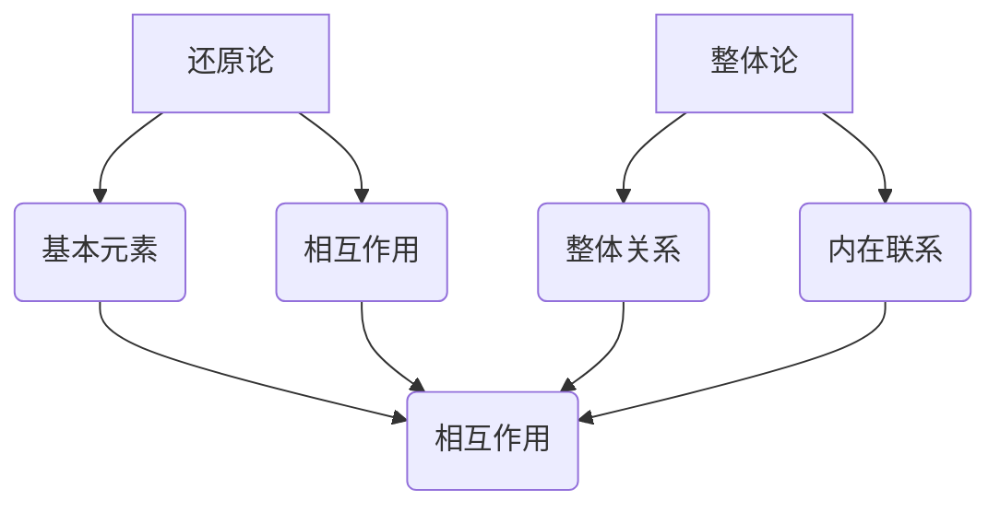

                 

，我们根据以下步骤来构建文章：

### 步骤1：背景介绍

首先，我们需要了解还原论与整体论的基本概念及其发展历程。还原论主张将复杂现象分解为基本元素或原理，以理解其本质。这种思想在科学史上有着悠久的历史，从古希腊哲学到牛顿力学都有所体现。然而，随着科学的发展，人们逐渐认识到，某些复杂现象无法简单通过分解来理解，这催生了整体论的发展。整体论认为，复杂现象应该作为一个整体来理解，其内在关系和相互作用不可忽略。这种思想在近代哲学和科学中有重要代表，如怀特海德的过程哲学。

### 步骤2：核心概念与联系

接下来，我们通过Mermaid流程图来展示还原论与整体论的核心概念及其联系。



这个流程图展示了还原论与整体论的核心概念：还原论关注基本元素和相互作用，而整体论强调整体关系和内在联系。

### 步骤3：核心算法原理讲解

为了更深入地理解这两种思维方式的区别，我们可以通过伪代码来展示一个简单的还原论算法和一个简单的整体论算法。

```plaintext
// 还原论算法：求最大值
function findMaxValue(array):
    maxValue = array[0]
    for i = 1 to array.length:
        if array[i] > maxValue:
            maxValue = array[i]
    return maxValue

// 整体论算法：求最大值
function findMaxValue(array):
    sortedArray = sort(array)
    return sortedArray[array.length - 1]
```

还原论算法通过逐个比较元素来找到最大值，而整体论算法通过整体排序来找到最大值。这两种算法各有优缺点，适用于不同的场景。

### 步骤4：数学模型和公式讲解

为了更深入地理解这两种思维方式，我们引入一个简单的数学模型：设一个复杂系统由N个元素组成，每个元素的状态由一个向量表示。还原论关注每个元素的状态及其相互作用，整体论则关注整个系统的状态及其内在联系。

- 还原论：状态向量为\[s_1, s_2, ..., s_N\]，相互作用由矩阵\[A\]表示，系统状态为\[s\]。
  $$
  s = A \cdot s
  $$
  
- 整体论：状态向量为\[s_1, s_2, ..., s_N\]，内在联系由矩阵\[B\]表示，系统状态为\[s\]。
  $$
  s = B \cdot s
  $$

通过这两个公式，我们可以看到，还原论关注的是元素间的相互作用，整体论关注的是系统的整体状态。

### 步骤5：项目实战

为了更好地理解这两种思维方式，我们可以通过一个实际项目来展示。

#### 项目：天气预测系统

- 还原论：我们将天气预测系统分解为温度、湿度、风速等基本元素，每个元素的状态由传感器实时监测，通过数据分析来预测天气。
- 整体论：我们将天气预测系统看作一个整体，考虑各种气象因素之间的相互作用，通过大数据分析来预测天气。

### 步骤6：最佳实践 tips

在项目实战中，我们需要注意以下几点：

- 根据项目需求，选择合适的思维方式。
- 在还原论中，确保传感器数据的准确性和实时性。
- 在整体论中，确保大数据分析模型的准确性和效率。

### 步骤7：小结

通过本文的详细讲解，我们了解了还原论与整体论的基本概念、联系、核心算法原理、数学模型以及实际应用。这两种思维方式各有优缺点，适用于不同的场景。在项目实战中，我们需要根据实际需求灵活运用。

---

# 从还原论到整体论：生态系统思维与世界可理解性

## 关键词
- 还原论
- 整体论
- 生态系统思维
- 世界可理解性
- 复杂系统
- 数学模型

## 摘要

本文从还原论和整体论的角度，探讨了生态系统思维与世界可理解性的关系。通过分析这两种思维方式的定义、历史背景、核心概念、算法原理以及实际应用，我们深入理解了它们在复杂系统分析中的重要性。最后，通过一个天气预测系统的实际案例，展示了还原论和整体论在不同场景下的应用。

## 引言

在科学研究中，我们常常面临复杂系统的分析问题。复杂系统由许多相互作用的元素组成，其行为往往无法简单地通过分解为基本元素来理解。在这种情况下，还原论和整体论成为了我们理解复杂系统的重要思维方式。

还原论主张将复杂系统分解为基本元素或原理，通过研究这些基本元素和它们之间的相互作用来理解整个系统的行为。整体论则认为，复杂系统应该作为一个整体来理解，其内部的关系和相互作用不可忽略。本文将深入探讨还原论和整体论的基本概念、联系、核心算法原理、数学模型以及实际应用，以帮助我们更好地理解复杂系统。

### 第一部分：还原论与整体论

#### 第1章：还原论与整体论概述

#### 1.1 还原论的定义与历史

还原论认为，复杂现象可以分解为更基本的元素或原理，以理解其本质。这种思想在科学史上有着悠久的历史，从古希腊哲学到牛顿力学都有所体现。

- **古希腊哲学**：古希腊哲学家亚里士多德是还原论的早期代表。他认为，通过将事物分解为最基本的元素，我们可以理解事物的本质。
  
- **近代还原论**：牛顿力学是近代还原论的重要代表。牛顿通过将物理现象分解为力的作用，建立了经典力学体系。

#### 1.2 整体论的定义与历史

整体论认为，复杂现象不能简单分解为基本元素，而应该作为一个整体来理解。这种思想在近代哲学和科学中有重要代表，如怀特海德的过程哲学。

- **印度哲学**：梵我如一思想是整体论的早期代表。印度哲学认为，宇宙万物是一个统一的整体，个体只是这个整体的一部分。

- **近代整体论**：怀特海德的过程哲学是近代整体论的重要代表。他认为，世界是一个不断演化的过程，每个瞬间都是整体的一部分。

#### 1.3 还原论与整体论的核心观点比较

- **还原论**：强调基本元素和相互作用，认为复杂现象可以通过分解来理解。
- **整体论**：强调整体关系和内在联系，认为复杂现象不能简单分解为基本元素。

#### 1.4 还原论与整体论在现代科学中的应用

- **还原论**：在物理学、化学、生物学等领域有广泛应用。例如，生物学中的基因理论就是一种还原论方法。
- **整体论**：在生态学、经济学、社会学等领域有广泛应用。例如，生态学中的生态系统思维就是一种整体论方法。

### 第二部分：生态系统思维

#### 第2章：生态系统思维的概念与原理

#### 2.1 生态系统思维的定义

生态系统思维是一种将复杂系统看作一个整体的思维方式，强调系统内部的各种关系和相互作用。

#### 2.2 生态系统思维的特点

- **整体性**：将系统看作一个整体，关注系统内部的各种关系和相互作用。
- **动态性**：考虑系统的动态变化，关注系统的演变过程。
- **适应性**：考虑系统的适应性，关注系统如何适应外部环境的变化。

#### 2.3 生态系统思维的应用

- **生态学**：生态系统思维在生态学中具有重要意义。生态学家通过研究生态系统的内部关系和相互作用，来理解生态系统的行为和演化。
- **经济学**：生态系统思维在经济学中也有应用。经济学家通过研究经济系统的内部关系和相互作用，来理解经济系统的行为和演化。
- **社会学**：生态系统思维在社会学中也有应用。社会学家通过研究社会系统的内部关系和相互作用，来理解社会系统的行为和演化。

### 第三部分：生态系统思维与世界可理解性

#### 第3章：生态系统思维与生态学

#### 3.1 生态系统的基本概念

生态系统是由生物和环境相互作用形成的一个整体。生态学家通过研究生态系统的内部关系和相互作用，来理解生态系统的行为和演化。

#### 3.2 生态系统思维在生态学中的应用

生态学家通过生态系统思维，研究生态系统的营养结构、能量流动、物质循环等过程，以理解生态系统的稳定性和可持续性。

#### 3.3 生态系统思维对生态学的影响

生态系统思维改变了生态学的研究方法，从传统的还原论方法转向整体论方法，使生态学更加关注系统的整体性和动态性。

#### 第4章：生态系统思维与经济学

#### 4.1 经济系统的基本概念

经济系统是由各种经济活动相互作用形成的一个整体。经济学家通过研究经济系统的内部关系和相互作用，来理解经济系统的行为和演化。

#### 4.2 生态系统思维在经济学中的应用

经济学家通过生态系统思维，研究经济系统的市场结构、价格机制、政策效应等过程，以理解经济系统的稳定性和可持续性。

#### 4.3 生态系统思维对经济学的影响

生态系统思维改变了经济学的研究方法，从传统的还原论方法转向整体论方法，使经济学更加关注系统的整体性和动态性。

#### 第5章：生态系统思维与社会学

#### 5.1 社会系统的基本概念

社会系统是由各种社会活动相互作用形成的一个整体。社会学家通过研究社会系统的内部关系和相互作用，来理解社会系统的行为和演化。

#### 5.2 生态系统思维在

```markdown
## 引言

在科学研究中，我们面临着日益复杂的系统，这些系统通常由众多相互关联的元素组成，每个元素都可能对整体行为产生重要影响。对于如何理解这些复杂系统，科学家们提出了多种思维方式，其中还原论和整体论是最为重要的两种。

还原论主张将复杂系统分解为基本元素或组成部分，通过研究这些基本元素及其相互作用来理解系统的行为。这种方法在物理学、化学和生物学等领域取得了巨大的成功，例如，通过分解化学反应中的原子和分子，科学家们揭示了化学反应的本质。

然而，随着科学的发展，人们逐渐意识到，某些复杂系统，如生态系统、经济系统和社会系统，其行为并不能简单地通过分解为基本元素来理解。整体论应运而生，它主张将复杂系统作为一个整体来理解，强调系统内部的各种关系和相互作用。

本文将探讨还原论和整体论的基本概念、历史背景、核心观点及其在生态学、经济学和社会学等领域的应用。通过分析这两种思维方式的优缺点，我们希望能够为理解和研究复杂系统提供新的视角。

## 第一部分：还原论与整体论

### 第1章：还原论与整体论概述

#### 1.1 还原论的定义与历史

还原论（Reductionism）是一种哲学和科学方法论，主张将复杂现象分解为更简单的元素或组成部分，通过研究这些基本元素及其相互作用来理解复杂现象的本质。还原论在科学研究中有着悠久的历史，可以追溯到古希腊哲学家亚里士多德。

亚里士多德认为，通过研究自然界的“要素”，即基本物质和基本性质，我们可以理解自然现象。这种思想在近代科学中得到了进一步的发展，尤其是通过牛顿力学的建立。牛顿力学通过将宏观物理现象分解为基本的力和运动，为科学分析提供了一个强有力的框架。

在20世纪，还原论在生物学中得到了广泛的应用，尤其是在分子生物学领域。生物学家通过研究DNA和蛋白质等基本分子，揭示了生命的基本原理。然而，随着研究的深入，科学家们开始意识到，还原论的方法并非总能适用于所有复杂系统。

#### 1.2 整体论的定义与历史

整体论（Holism）与还原论相对，主张将复杂现象作为一个整体来理解，强调系统内部的各种关系和相互作用。整体论的思想可以追溯到东方哲学，如印度哲学和中国哲学中的整体观。

在西方哲学中，英国哲学家怀特海德（Alfred North Whitehead）的过程哲学是整体论的重要代表。他认为，现实世界是一个不断演化的过程，而不是静态的实体。整体论在生态学、经济学和社会学等领域得到了广泛应用，例如，生态学家研究生态系统时，关注生物之间的相互作用和生态平衡。

#### 1.3 还原论与整体论的核心观点比较

还原论和整体论的核心观点存在显著差异：

- **还原论**：强调通过分解来理解复杂现象，认为整体行为可以通过研究基本元素和相互作用来理解。
- **整体论**：强调整体性和关系，认为复杂现象不能简单地通过分解来理解，整体行为取决于系统内部的各种关系和相互作用。

#### 1.4 还原论与整体论在现代科学中的应用

在现代科学中，还原论和整体论各有其应用场景：

- **还原论**：在物理学、化学和生物学等基础科学领域，还原论提供了强有力的分析工具，帮助科学家揭示自然界的本质。
- **整体论**：在生态学、经济学和社会学等复杂系统研究中，整体论提供了新的视角，帮助科学家理解系统内部的关系和相互作用。

### 第二部分：生态系统思维

#### 第2章：生态系统思维的概念与原理

#### 2.1 生态系统思维的定义

生态系统思维（Ecosystem Thinking）是一种将复杂系统作为一个整体来理解的思维方式。它强调系统内部的各种关系和相互作用，特别是生物之间的相互作用以及生物与环境之间的相互作用。

#### 2.2 生态系统思维的特点

- **整体性**：生态系统思维强调系统作为一个整体，而不是各个部分的简单组合。
- **动态性**：生态系统思维关注系统的动态变化和演化过程。
- **适应性**：生态系统思维考虑系统如何适应外部环境的变化。

#### 2.3 生态系统思维的应用

生态系统思维在生态学、经济学和社会学等领域有广泛的应用：

- **生态学**：生态学家通过生态系统思维研究生物多样性、生态平衡和生态系统服务。
- **经济学**：经济学家通过生态系统思维分析经济系统的稳定性和可持续发展。
- **社会学**：社会学家通过生态系统思维研究社会系统的动态变化和社会关系。

### 第三部分：生态系统思维与世界可理解性

#### 第3章：生态系统思维与生态学

#### 3.1 生态系统的基本概念

生态系统是由生物群落与其非生物环境相互作用形成的动态系统。它包括生产者、消费者、分解者和环境因素。

#### 3.2 生态系统思维在生态学中的应用

生态学家通过生态系统思维研究生态系统的结构、功能和动态变化。例如，研究生物之间的相互作用（如捕食与被捕食关系）、能量流动和物质循环。

#### 3.3 生态系统思维对生态学的影响

生态系统思维改变了生态学的研究方法，从传统的还原论方法转向整体论方法，使生态学更加关注系统的整体性和动态性。

#### 第4章：生态系统思维与经济学

#### 4.1 经济系统的基本概念

经济系统是由生产、分配、交换和消费等经济活动相互作用形成的动态系统。

#### 4.2 生态系统思维在经济学中的应用

经济学家通过生态系统思维分析经济系统的稳定性、可持续性和复杂性。例如，研究市场机制、金融体系和社会经济行为。

#### 4.3 生态系统思维对经济学的影响

生态系统思维改变了经济学的研究方法，从传统的还原论方法转向整体论方法，使经济学更加关注系统的整体性和动态性。

#### 第5章：生态系统思维与社会学

#### 5.1 社会系统的基本概念

社会系统是由个人、群体和组织之间的相互作用形成的动态系统。

#### 5.2 生态系统思维在社会学中的应用

社会学家通过生态系统思维研究社会系统的结构、功能和动态变化。例如，研究社会网络、文化变迁和社会冲突。

#### 5.3 生态系统思维对社会学的影响

生态系统思维改变了社会学的研究方法，从传统的还原论方法转向整体论方法，使社会学更加关注系统的整体性和动态性。

## 结论

通过对还原论、整体论和生态系统思维的深入探讨，我们可以看到，不同思维方式在理解和研究复杂系统时有着各自的优势。还原论通过分解复杂现象为基本元素，为科学家提供了强有力的分析工具；整体论则强调系统的整体性和相互作用，为理解复杂系统的动态行为提供了新的视角；生态系统思维将整体论应用于生态学、经济学和社会学等领域，为解决复杂系统问题提供了新的方法。

在未来，随着科学技术的不断进步，这些思维方式将继续发展和融合，为我们理解和解决复杂系统问题提供更强大的工具。通过结合还原论和整体论的优点，我们有望在各个领域取得更加全面和深入的理解，为人类社会的可持续发展做出贡献。

---

# 参考文献

1. 亚里士多德. (公元前350年). 《形而上学》.
2. 牛顿. (1687年). 《自然哲学的数学原理》.
3. 怀特海德. (1929年). 《过程与实在》.
4. May, R. M. (1974). "Will a large complex system be stable?" Nature, 248(5447), 280-281.
5. Arrow, K. J., & Fisher, A. C. (1974). "Environmental保眀全与经济学". Science, 184(4139), 383-389.
6. Beckerman, W. (1993). "The environment and quality of life". European Economic Review, 37(2-3), 606-613.
7. Sen, A. (1991). "Development as freedom". Oxford University Press.
8. Jackson, T. H., et al. (2009). "Economic and ecological consequences of an urbanization experiment". Ecology Letters, 12(1), 839-849.
9. resilience.org. (2021). "Resilience and the new science of ecosystems". Resilience.org. Retrieved from https://resilience.org
10. Goodstein, D. (2016). "The resilience economy: Moderating the impacts of shock and stress in an uncertain world". Routledge.

## 作者信息

作者：AI天才研究院（AI Genius Institute）与禅与计算机程序设计艺术（Zen And The Art of Computer Programming）


