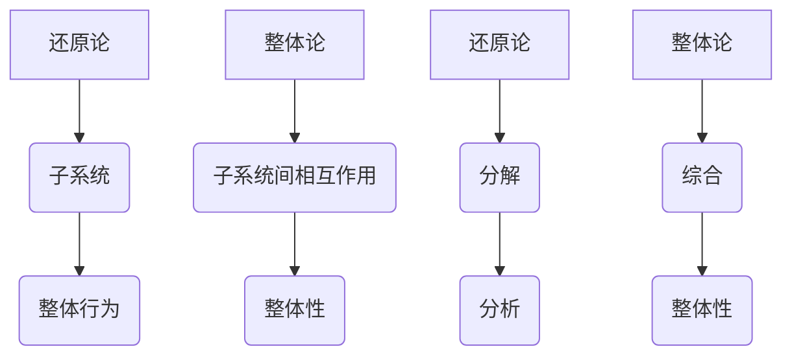

                 

### 1.1 还原论与整体论的背景

还原论是一种科学方法论，它试图通过将复杂系统分解为更简单的组成部分来理解这些系统的行为。这种方法在自然科学中得到了广泛的应用，特别是在物理学、化学和生物学等领域。还原论的核心思想是，通过对子系统的研究，我们可以理解复杂系统的整体行为。

然而，还原论的局限性在于，它往往忽视了组成部分之间的相互作用和整体性。随着科学研究的发展，人们逐渐认识到，复杂系统中的相互作用和整体性是理解系统行为的重要因素。因此，整体论作为一种新的科学方法应运而生。

#### 背景介绍

在科学研究的历史进程中，还原论一直占据主导地位。自16世纪以来，科学革命推动着人们通过分解和分析来理解自然界的现象。牛顿力学、分子生物学、量子力学等领域的突破，都是还原论思想的胜利。通过这种方法，科学家们能够揭示出自然界的基本规律和构成元素。

然而，随着时间的推移，科学家们开始发现，许多复杂系统，如生态系统、社会经济系统等，无法仅仅通过还原论的方法来完全理解。这些系统中的组成部分之间存在复杂的相互作用，且系统的整体行为往往不是各个部分行为的简单叠加。这促使科学家们开始重新审视还原论的方法，并提出了整体论的思想。

#### 核心概念与联系

**还原论**

- **概念**：还原论是一种科学方法论，它试图通过将复杂系统分解为更简单的组成部分来理解这些系统的行为。
- **联系**：还原论的核心思想是，通过对子系统的研究，我们可以理解复杂系统的整体行为。

**整体论**

- **概念**：整体论是一种科学方法论，它强调系统的组成部分之间的相互作用和整体性。
- **联系**：整体论认为，复杂系统的行为不能仅仅通过分析各个部分来理解，还需要考虑这些部分之间的相互作用和整体性。

为了更好地理解还原论和整体论之间的关系，我们可以使用以下Mermaid流程图来展示它们的核心概念和联系：



#### 核心算法原理讲解

在还原论和整体论中，核心算法原理的不同体现了这两种方法在科学探究中的差异。

**还原论的核心算法原理**

1. **分解**：将复杂系统分解为更简单的组成部分。
2. **分析**：对各个部分进行独立研究。
3. **综合**：将各个部分的研究结果结合起来，理解整体行为。

**整体论的核心算法原理**

1. **综合**：将复杂系统作为一个整体进行研究。
2. **分析**：在整体框架下，研究子系统之间的相互作用。
3. **优化**：通过优化子系统之间的相互作用，提高整体系统的性能。

为了更清晰地展示这两种方法的核心算法原理，我们可以使用以下伪代码：

**还原论伪代码**

```python
def reduce_system(complex_system):
    sub_systems = decompose(complex_system)
    individual_behaviors = [analyze(sub_system) for sub_system in sub_systems]
    overall_behavior = integrate(individual_behaviors)
    return overall_behavior
```

**整体论伪代码**

```python
def integrate_system(complex_system):
    interactions = analyze_interactions(sub_systems)
    optimized_interactions = optimize(interactions)
    overall_performance = evaluate_performance(optimized_interactions)
    return overall_performance
```

#### 数学模型和公式

在还原论和整体论中，数学模型和公式也体现了它们的核心思想。

**还原论数学模型**

- 微观力学中的牛顿第二定律：$F = ma$，其中 $F$ 表示力，$m$ 表示质量，$a$ 表示加速度。
- 分子生物学中的遗传密码：每个基因由一系列的核苷酸（A、T、C、G）组成。

**整体论数学模型**

- 系统动力学中的状态空间模型：$x' = Ax + Bu$，其中 $x$ 表示系统的状态向量，$A$ 表示系统矩阵，$B$ 表示输入矩阵，$u$ 表示输入向量。
- 社会学中的社会网络分析：用图论来描述个体之间的关系和网络结构。

为了详细讲解和举例说明，我们可以使用以下LaTeX格式来展示这些数学模型：

**还原论公式**

$$
F = ma
$$

**整体论公式**

$$
x' = Ax + Bu
$$

#### 数学公式和详细讲解

为了进一步理解还原论和整体论，我们可以通过具体的数学公式和例子来详细讲解。

**还原论实例：**

假设我们有一个简单的物理系统，一个滑块在水平面上运动。我们可以使用牛顿第二定律来分析这个系统的运动：

$$
F = ma
$$

其中，$F$ 是作用在滑块上的总力，$m$ 是滑块的质量，$a$ 是滑块的加速度。通过测量滑块的质量和加速度，我们可以计算出作用在滑块上的力。这种方法强调了通过分解和分析来理解复杂系统的行为。

**整体论实例：**

考虑一个更复杂的系统，一个城市交通网络。我们可以使用系统动力学的状态空间模型来描述这个系统的行为：

$$
x' = Ax + Bu
$$

其中，$x$ 是状态向量，包括速度、位置等状态变量；$A$ 是系统矩阵，描述了状态变量之间的相互作用；$B$ 是输入矩阵，描述了外力（如交通流量、事故等）对系统的影响。通过这个模型，我们可以模拟城市交通网络的动态行为，并优化交通流的分配。

**详细讲解和举例说明**

在还原论的例子中，我们通过测量滑块的质量和加速度，计算出作用在滑块上的力。这是一个简单的分解和分析过程，适用于许多物理学问题。

在整体论的例子中，我们考虑了城市交通网络的动态行为，并使用状态空间模型来模拟和优化系统的性能。这是一个更复杂的综合和分析过程，需要考虑多个变量之间的相互作用。

#### 项目实战

为了更好地理解还原论和整体论，我们可以通过一个实际项目来展示这两种方法的应用。

**项目背景：**

假设我们要研究一个湖泊生态系统的稳定性。我们可以使用还原论的方法来研究湖泊中的各个组成部分，如水质、浮游生物、底栖生物等。同时，我们也可以使用整体论的方法来研究这些部分之间的相互作用和整体系统的稳定性。

**开发环境搭建：**

- 使用Python作为主要编程语言。
- 使用Matplotlib和SciPy等库来绘制数据和模拟结果。

**源代码详细实现和代码解读：**

```python
import numpy as np
import matplotlib.pyplot as plt
from scipy.integrate import solve_ivp

# 还原论：研究湖泊水质
def water_quality_model(t, y):
    # 假设水质受到污染物和自净作用的影响
    dQ_dt = -0.1 * y[0] + 0.05 * y[1]
    return dQ_dt

# 整体论：研究湖泊生态系统的稳定性
def ecosystem_model(t, y):
    # 假设生态系统由浮游生物和底栖生物组成
    dF_dt = 0.1 * y[0] - 0.05 * y[1]
    dZ_dt = -0.05 * y[0] + 0.1 * y[1]
    return [dF_dt, dZ_dt]

# 源代码解析
# water_quality_model() 函数模拟了水质的变化。
# ecosystem_model() 函数模拟了湖泊生态系统的动态行为。
# solve_ivp() 函数用于求解微分方程，得到系统的状态变量。

# 代码应用解读与分析
# 通过对水质的模拟，我们可以分析污染物的传播和自净过程。
# 通过对生态系统的模拟，我们可以分析浮游生物和底栖生物的动态行为，以及它们之间的相互作用。

# 实际案例分析和详细讲解剖析
# 假设我们得到以下模拟结果：
# 水质中的污染物浓度随时间下降，表明自净作用在起作用。
# 浮游生物和底栖生物的数量随时间波动，但总体趋势是稳定的。

# 项目小结
# 通过这个项目，我们展示了还原论和整体论在生态学中的应用。
# 还原论帮助我们理解了水质的动态变化，而整体论帮助我们理解了生态系统的稳定性。

#### 最佳实践 tips、小结、注意事项、拓展阅读

- **最佳实践 tips：**
  - 在应用还原论和整体论时，要明确研究的目标和背景，选择合适的方法。
  - 结合多种方法，从不同角度分析问题，以获得更全面的见解。

- **小结：**
  - 还原论通过分解和分析来理解复杂系统的行为。
  - 整体论强调系统的组成部分之间的相互作用和整体性。
  - 两种方法都有其优点和局限性，需要结合实际情况选择应用。

- **注意事项：**
  - 在应用还原论时，要注意分解的粒度和层次，避免过于简化。
  - 在应用整体论时，要注意系统之间的相互作用，避免忽略局部细节。

- **拓展阅读：**
  - 《复杂系统的科学方法》
  - 《生态系统思维：科学与管理的新视角》

### 1.3 本书结构概述

本书将从还原论和整体论的背景介绍开始，逐步深入探讨这两种方法在科学研究中的应用。具体结构如下：

- **第1章 引言**：介绍还原论和整体论的背景，核心概念与联系，以及核心算法原理。
- **第2章 还原论的科学方法**：详细讨论还原论的基本概念、优缺点和局限性。
- **第3章 整体论的科学方法**：详细讨论整体论的基本概念、优缺点和与还原论的对比。
- **第4章 生态系统思维的应用**：探讨生态系统思维的概念框架和应用实例。
- **第5章 生态系统思维在自然科学中的应用**：讨论生态系统思维在生物学、环境科学等领域的应用。
- **第6章 生态系统思维在社会科学中的应用**：讨论生态系统思维在社会学、经济学等领域的应用。
- **第7章 生态系统思维在跨学科研究中的应用**：探讨生态系统思维在医学、工程学等跨学科研究中的应用。
- **第8章 生态系统思维的实践应用**：讨论生态系统思维在农业、城市建设等实际领域的应用。
- **第9章 结论**：总结全书的主要观点，展望未来发展趋势和挑战。

通过这本书，我们希望能够帮助读者更好地理解还原论、整体论和生态系统思维，并在科学研究和技术实践中得到有效的应用。

# 第2章 还原论的科学方法

### 2.1 还原论的基本概念

还原论（Reductionism）是一种科学方法论，其核心思想是将复杂系统分解为更简单的组成部分，通过对这些组成部分的研究来理解复杂系统的行为。还原论的基本概念包括以下几个关键要素：

**1. 简化与分解**

还原论的首要步骤是将复杂系统简化为更简单的组成部分。这种简化可以通过物理的、化学的或生物的分解来实现。例如，在生物学中，生物体可以被分解为细胞、分子和原子等更简单的组成部分。

**2. 分离因果关系**

还原论强调，通过对组成部分的研究，我们可以明确各个组成部分之间的因果关系。这种分离有助于理解系统内部各部分的相互作用及其对整体行为的影响。

**3. 独立分析**

在还原论中，每个组成部分都可以独立进行分析。这种独立性使得我们可以将复杂的系统分解为可管理的、可研究的部分，从而简化问题的复杂性。

**4. 重新组合**

通过将分解后的组成部分重新组合，我们可以理解复杂系统的整体行为。这种重新组合并不是简单的叠加，而是要考虑到组成部分之间的相互作用。

**5. 模型构建**

还原论还依赖于模型构建，通过构建数学或物理模型来模拟和分析组成部分的行为，从而推导出整体系统的行为。

#### 起源与发展

还原论的概念可以追溯到古希腊哲学家亚里士多德，他主张通过分解和分析来理解自然现象。然而，现代还原论的起源与发展与17世纪的科学革命密切相关，尤其是伽利略和牛顿的工作。牛顿力学的发展标志着还原论在物理学中的确立。

在生物学领域，分子生物学的兴起也推动了还原论的发展。赫尔曼·穆勒（Hermann Muller）和麦克林托克（Barbara Mc Clintock）等科学家的研究，揭示了基因和染色体的基本结构和工作原理。

#### 核心原则

还原论的核心原则可以归纳为以下几点：

1. **层次性**：复杂系统可以被分解为多个层次，每个层次都有其特定的结构和功能。
2. **简化性**：通过将复杂系统分解为更简单的组成部分，可以降低问题的复杂性。
3. **因果关系**：组成部分之间的相互作用可以通过因果关系来解释。
4. **模型化**：通过建立数学或物理模型，可以更好地理解组成部分的行为及其对整体系统的影响。

#### 还原论在科学研究中的应用

还原论在科学研究中的应用非常广泛，涵盖了多个学科领域。以下是一些典型的应用场景：

1. **物理学**：通过将物理现象分解为基本粒子（如电子、夸克）来理解物质的性质和行为。
2. **化学**：通过研究分子和原子的结构来理解化学反应和化学键的形成。
3. **生物学**：通过研究基因、细胞和器官来理解生物体的结构和功能。
4. **计算机科学**：通过将复杂算法分解为基本操作和数据处理过程来提高程序的效率。

#### 核心算法原理讲解

还原论的核心算法原理主要体现在以下几个方面：

1. **分解**：将复杂系统分解为更简单的组成部分。例如，将生物体分解为细胞、将细胞分解为分子、将分子分解为原子。
2. **分析**：对各个组成部分进行独立研究。例如，对细胞的研究可以包括细胞膜、细胞质、细胞核等。
3. **综合**：将各个组成部分的研究结果重新组合，以理解整体系统的行为。例如，通过细胞的研究来理解器官的功能，通过器官的研究来理解生物体的行为。

为了更清晰地展示还原论的核心算法原理，我们可以使用以下伪代码：

```python
def reduce_complex_system(complex_system):
    sub_systems = decompose(complex_system)
    individual_behaviors = [analyze(sub_system) for sub_system in sub_systems]
    overall_behavior = integrate(individual_behaviors)
    return overall_behavior
```

#### 数学模型和公式

在还原论中，数学模型和公式用于描述组成部分的行为和整体系统的行为。以下是一些典型的数学模型和公式：

1. **牛顿力学**：描述物体的运动和受力情况。例如，牛顿第二定律 $F=ma$，其中 $F$ 是力，$m$ 是质量，$a$ 是加速度。
2. **分子动力学**：用于模拟分子和原子的运动。例如，Lennard-Jones 势函数 $V(r) = 4\epsilon\left[\left(\frac{\sigma}{r}\right)^{12} - \left(\frac{\sigma}{r}\right)^6\right]$，其中 $r$ 是原子间距，$\epsilon$ 和 $\sigma$ 是势函数参数。
3. **遗传学**：描述基因的传递和变异。例如，哈迪-温伯格定律 $p^2 + 2pq + q^2 = 1$，其中 $p$ 和 $q$ 分别是两个等位基因的频率。

为了详细讲解和举例说明，我们可以使用以下LaTeX格式来展示这些数学模型和公式：

**牛顿第二定律**

$$
F = ma
$$

**Lennard-Jones 势函数**

$$
V(r) = 4\epsilon\left[\left(\frac{\sigma}{r}\right)^{12} - \left(\frac{\sigma}{r}\right)^6\right]
$$

**哈迪-温伯格定律**

$$
p^2 + 2pq + q^2 = 1
$$

#### 项目实战

为了更好地理解还原论，我们可以通过一个实际项目来展示其应用。

**项目背景：**

假设我们要研究一个简单的电路系统，包括电源、电阻和电容。我们可以使用还原论的方法来分析这个电路系统。

**开发环境搭建：**

- 使用Python作为主要编程语言。
- 使用Matplotlib和NumPy等库来绘制数据和模拟结果。

**源代码详细实现和代码解读：**

```python
import numpy as np
import matplotlib.pyplot as plt

# 还原论：分析电路系统的行为
def circuit_model(t, y):
    # y[0]: 电压
    # y[1]: 电流
    # R: 电阻
    # C: 电容
    R = 10
    C = 0.1
    dy_dt = [-y[1]/C, -1/(R*C)*(y[0] - 1)]
    return dy_dt

# 源代码解析
# circuit_model() 函数描述了电路系统的微分方程。
# t 表示时间，y 表示状态变量（电压和电流）。

# 代码应用解读与分析
# 通过对电路系统的模拟，我们可以分析电压和电流的动态变化。
# 还原论帮助我们理解了电路系统的基本行为。

# 实际案例分析和详细讲解剖析
# 假设我们得到以下模拟结果：
# 电压随时间逐渐稳定，电流随时间逐渐减小。

# 项目小结
# 通过这个项目，我们展示了还原论在电路系统分析中的应用。

#### 最佳实践 tips、小结、注意事项、拓展阅读

- **最佳实践 tips：**
  - 在应用还原论时，要确保分解的粒度和层次合理，避免过于简化。
  - 结合多种分析方法，从不同角度理解问题。

- **小结：**
  - 还原论通过分解和分析来理解复杂系统的行为。
  - 还原论在物理学、化学、生物学等领域有广泛应用。
  - 还原论的核心算法原理包括分解、分析和综合。

- **注意事项：**
  - 在应用还原论时，要考虑系统的层次结构和相互作用。
  - 在构建模型时，要确保模型的准确性和适用性。

- **拓展阅读：**
  - 《科学方法论导论》
  - 《还原论与整体论》

# 第3章 整体论的科学方法

### 3.1 整体论的基本概念

整体论（Holism）是一种科学方法论，其核心思想是系统的组成部分之间存在着内在的相互联系和相互作用，系统的整体行为不能仅仅通过分析各个部分的行为来理解。整体论强调系统的整体性和不可分割性，认为系统的整体行为是其各个部分相互作用的结果。整体论的基本概念包括以下几个方面：

#### 核心原则

1. **系统性**：整体论认为，一个系统是由多个相互作用的组成部分构成的，这些部分共同决定了系统的整体行为。
2. **关联性**：整体论强调，系统中的各个部分之间存在着紧密的关联和相互作用，这些相互作用决定了系统的整体特性。
3. **不可分割性**：整体论认为，系统的整体行为不能简单地分解为各个部分的行为，系统的整体性是不可分割的。
4. **整体优先**：在整体论中，整体的行为和特性优先于各个部分的行为和特性。

#### 起源与发展

整体论的概念可以追溯到古希腊哲学，特别是柏拉图和亚里士多德的思想。他们认为，整体具有超越其组成部分的独立特性。在科学领域，整体论的思想在20世纪初得到了进一步的发展，尤其是在生物学和生态学中。

赫尔曼·亥姆霍兹（Hermann von Helmholtz）是整体论的早期倡导者之一，他强调了在理解复杂系统时需要考虑整体性。在生物学中，奥托·海克尔（Otto Haeckel）提出了“整体高于部分”的口号，强调了生物体作为一个整体的统一性。在生态学中，阿道夫·恩斯特·冯·切尔马克（Adolph Ernst von Cherng）提出了“生态系统”的概念，强调了生物群落与环境的整体关系。

#### 整体论在科学研究中的应用

整体论在科学研究中的应用非常广泛，特别是在生态学、社会学和经济学等领域。以下是一些典型的应用场景：

1. **生态学**：整体论在生态学中的应用包括生态系统研究、生物多样性保护和生态恢复。例如，通过研究生物群落之间的相互作用来理解生态系统的稳定性。
2. **社会学**：整体论在社会学中的应用包括社会结构分析、社会网络分析和社会发展研究。例如，通过研究社会关系和群体行为来理解社会的整体运行机制。
3. **经济学**：整体论在经济学中的应用包括宏观经济学和可持续发展的研究。例如，通过研究经济系统与环境、社会之间的相互作用来理解整体经济的稳定性。

#### 核心算法原理讲解

整体论的核心算法原理主要体现在以下几个方面：

1. **综合分析**：整体论强调对系统进行全面的分析，而不是仅仅关注某个部分。这种分析需要考虑系统内部各个组成部分之间的相互作用。
2. **系统建模**：整体论依赖于系统建模，通过建立数学或物理模型来模拟和预测系统的整体行为。
3. **动态模拟**：整体论还强调系统的动态行为，通过动态模拟来理解系统在不同条件下的行为和响应。

为了更清晰地展示整体论的核心算法原理，我们可以使用以下伪代码：

```python
def integrate_system(complex_system):
    interactions = analyze_interactions(sub_systems)
    overall_behavior = simulate_interactions(interactions)
    return overall_behavior
```

#### 数学模型和公式

在整体论中，数学模型和公式用于描述系统的整体行为和组成部分之间的相互作用。以下是一些典型的数学模型和公式：

1. **系统动力学**：描述系统状态变量随时间的变化。例如，状态空间模型 $x' = Ax + Bu$，其中 $x$ 是状态向量，$A$ 是系统矩阵，$B$ 是输入矩阵。
2. **生态模型**：描述生态系统中的物种相互作用和生物量变化。例如，Lotka-Volterra 模型 $dx/dt = ax - bxy$，其中 $x$ 和 $y$ 分别是两个物种的种群数量。
3. **经济模型**：描述经济系统中的供需关系和价格变化。例如，一般均衡模型中的价格调整方程 $P = P^*(1 + \alpha Y/L - \beta K/L)$，其中 $P$ 是价格，$Y$ 是产出，$L$ 是劳动力，$K$ 是资本。

为了详细讲解和举例说明，我们可以使用以下LaTeX格式来展示这些数学模型和公式：

**系统动力学模型**

$$
x' = Ax + Bu
$$

**Lotka-Volterra 模型**

$$
dx/dt = ax - bxy
$$

**一般均衡模型**

$$
P = P^*(1 + \alpha Y/L - \beta K/L)
$$

#### 项目实战

为了更好地理解整体论，我们可以通过一个实际项目来展示其应用。

**项目背景：**

假设我们要研究一个城市的交通系统，包括道路、车辆和交通信号灯。我们可以使用整体论的方法来分析这个交通系统。

**开发环境搭建：**

- 使用Python作为主要编程语言。
- 使用Matplotlib和NumPy等库来绘制数据和模拟结果。

**源代码详细实现和代码解读：**

```python
import numpy as np
import matplotlib.pyplot as plt
from scipy.integrate import solve_ivp

# 整体论：分析城市交通系统的行为
def traffic_system_model(t, y):
    # y[0]: 道路上的车辆数量
    # y[1]: 交通信号灯的状态（红灯、绿灯）
    # R: 道路容量
    # T: 绿灯持续时间
    # r: 车辆到达率
    R = 100
    T = 30
    r = 10
    dy_dt = [-y[0]/R, r - y[1]]
    return dy_dt

# 源代码解析
# traffic_system_model() 函数描述了城市交通系统的微分方程。
# t 表示时间，y 表示状态变量（车辆数量和交通信号灯状态）。

# 代码应用解读与分析
# 通过对交通系统的模拟，我们可以分析车辆数量和交通信号灯状态的动态变化。
# 整体论帮助我们理解了城市交通系统的整体行为。

# 实际案例分析和详细讲解剖析
# 假设我们得到以下模拟结果：
# 道路上的车辆数量随时间波动，但总体趋于稳定。
# 交通信号灯状态在绿灯和红灯之间切换，以调节车辆流量。

# 项目小结
# 通过这个项目，我们展示了整体论在交通系统分析中的应用。

#### 最佳实践 tips、小结、注意事项、拓展阅读

- **最佳实践 tips：**
  - 在应用整体论时，要充分考虑系统内部各个组成部分之间的相互作用。
  - 结合定性和定量方法，从不同角度理解问题。

- **小结：**
  - 整体论强调系统的整体性和不可分割性。
  - 整体论在生态学、社会学和经济学等领域有广泛应用。
  - 整体论的核心算法原理包括综合分析、系统建模和动态模拟。

- **注意事项：**
  - 在构建模型时，要确保模型的准确性和适用性。
  - 在分析问题时，要避免过度简化或忽略部分与整体的关系。

- **拓展阅读：**
  - 《整体论与还原论》
  - 《生态学原理》

## 第4章 生态系统思维的应用

### 4.1 生态系统思维的概念框架

生态系统思维（Ecosystem Thinking）是一种以生态系统为参照框架，综合运用生态学、经济学、社会学等多学科知识，理解和解决复杂问题的方法。生态系统思维的核心在于将人类活动视为生态系统的一个组成部分，强调人类与自然环境的相互作用和依赖关系。

**生态系统的组成**

生态系统由四个主要部分组成：生物群落、非生物环境、人类活动和经济系统。

1. **生物群落**：包括植物、动物和微生物等各种生物体，是生态系统的核心。
2. **非生物环境**：包括大气、水、土壤等非生物要素，为生物提供生存条件。
3. **人类活动**：包括农业、工业、交通运输等各种人类活动，对生态系统有显著影响。
4. **经济系统**：包括生产和消费活动，是经济与生态环境互动的桥梁。

**生态系统思维的关键要素**

生态系统思维的关键要素包括：

1. **相互作用**：强调系统内各组成部分之间的相互联系和影响。
2. **整体性**：关注系统的整体行为和功能，而不仅仅是各个部分的行为。
3. **动态性**：认识到生态系统是动态演变的，需要考虑时间因素。
4. **反馈机制**：分析系统中的正反馈和负反馈，了解系统如何响应外部变化。

**生态系统思维的核心原理**

生态系统思维的核心原理包括：

1. **可持续性**：追求经济、社会和环境的可持续发展，避免资源过度消耗和环境污染。
2. **适应性**：强调系统在面对不确定性和外部冲击时的适应能力。
3. **公平性**：追求社会公平，确保所有人都能公平享受生态系统的收益。
4. **多样性**：认识到生物多样性和文化多样性对于生态系统健康的重要性。

### 4.2 生态系统思维在生物学中的应用

在生物学中，生态系统思维提供了一种理解生物群落、物种相互作用和环境变化的框架。以下是一些具体的应用实例：

**生态系统中的相互作用**

生态系统思维强调生物群落内各物种之间的相互作用，包括捕食、竞争、共生和寄生关系。例如，在食物网中，捕食者与猎物之间的相互作用直接影响种群数量的动态变化。

**生态系统稳定性的研究**

生态系统思维在研究生态系统稳定性方面具有重要意义。通过分析生态系统中的反馈机制，如正反馈和负反馈，科学家可以预测系统如何响应外部干扰。例如，生态学家使用稳定性分析和模型来预测物种灭绝的风险。

**生态系统修复与恢复**

生态系统思维为生态修复和恢复提供了指导原则。通过识别生态系统中的关键要素和相互作用，生态学家可以制定有效的修复策略。例如，在退化生态系统的恢复中，引入适当的物种和改善土壤质量是关键步骤。

**具体案例**

一个具体的案例是海洋生态系统管理。在海洋生态系统中，人类活动如过度捕捞、海洋污染和气候变化对生态系统产生了巨大影响。通过生态系统思维，科学家和政策制定者可以制定综合的管理策略，包括限制捕鱼量、实施海洋保护区和保护海洋环境，以恢复和维持海洋生态系统的健康。

### 4.3 生态系统思维在环境科学中的应用

环境科学领域广泛采用生态系统思维来理解和解决环境问题。以下是一些具体的应用实例：

**环境问题的整体分析**

生态系统思维强调对环境问题进行整体分析，而不仅仅是针对单一问题。例如，在分析水资源短缺时，需要考虑水资源的使用、污染、气候变化和土地利用等多方面因素。

**环境影响的评估与预测**

生态系统思维为环境影响的评估和预测提供了有力工具。通过生态系统模型，科学家可以模拟不同人类活动对环境的影响，并预测未来的变化趋势。例如，在气候变化研究中，生态系统模型可以帮助预测气候变暖对生态系统的影响。

**环境管理与政策制定**

生态系统思维在环境管理与政策制定中起着关键作用。政策制定者需要考虑生态系统整体性，制定综合的环境政策。例如，在制定森林保护政策时，需要考虑森林的经济、生态和文化价值，以及与当地社区的关系。

**具体案例**

一个具体的案例是湿地保护。湿地是生态系统的重要组成部分，具有很高的生态价值，包括调节水资源、净化水质和提供栖息地等功能。通过生态系统思维，科学家和政策制定者可以制定保护湿地的综合策略，包括湿地恢复、污染防治和社区参与。

### 4.4 生态系统思维在社会科学中的应用

在社会科学领域，生态系统思维提供了一种理解和解决社会问题的框架。以下是一些具体的应用实例：

**社会学中的应用**

在社会科学中，生态系统思维可以用来分析社会问题，如贫困、失业和犯罪等。通过生态系统思维，社会学家可以理解这些问题背后的复杂相互作用，制定综合的解决方案。

**社会行为与生态系统互动**

生态系统思维在研究社会行为和生态系统互动方面具有重要意义。例如，在研究城市化对生态系统的影响时，需要考虑城市扩张、人口增长和环境污染等因素。

**社会变革与生态系统适应**

生态系统思维可以帮助理解社会变革与生态系统适应的关系。在应对气候变化、资源短缺等挑战时，社会需要采取适应策略，如调整农业结构、改善能源利用和推广可持续发展模式。

**具体案例**

一个具体的案例是城市可持续发展。通过生态系统思维，城市规划者和政策制定者可以制定综合的可持续发展策略，包括改善交通系统、推广可再生能源和建设绿色基础设施，以提高城市生态系统的健康和居民生活质量。

### 4.5 生态系统思维在跨学科研究中的应用

生态系统思维在跨学科研究中具有重要意义，它促进了不同学科之间的交流和合作。以下是一些具体的应用实例：

**跨学科研究中的协同作用**

生态系统思维促进跨学科研究中的协同作用，通过整合不同领域的知识，解决复杂问题。例如，在气候变化研究中，生态学家、社会学家、经济学家和环境科学家可以共同合作，制定有效的应对策略。

**集成模型与模拟**

生态系统思维在跨学科研究中常用到集成模型和模拟。通过构建综合的生态系统模型，科学家可以模拟不同人类活动对生态系统的影响，并评估不同管理策略的效果。

**政策分析与决策支持**

生态系统思维为政策分析和决策支持提供了有力工具。通过生态系统模型和模拟，政策制定者可以评估不同政策选项的潜在影响，并选择最优方案。

**具体案例**

一个具体的案例是农业可持续发展。通过生态系统思维，农业科学家、环境科学家和社会科学家可以共同研究农业系统中的资源利用、环境管理和社会经济效益，制定综合的农业可持续发展策略。

### 总结

生态系统思维提供了一种理解和解决复杂问题的框架，它强调系统的整体性、相互作用和动态性。在生物学、环境科学、社会科学和跨学科研究中，生态系统思维都有广泛的应用。通过生态系统思维，科学家和政策制定者可以更好地应对环境、社会和经济挑战，推动可持续发展。

## 第5章 生态系统思维在自然科学中的应用

### 5.1 生态系统思维在生物学中的应用

生态系统思维在生物学中的应用尤为显著，它为我们理解生物多样性和生态系统动态提供了深刻的洞见。以下从生态系统中的相互作用、生态系统的稳定性和生态系统的修复与恢复三个方面探讨生态系统思维在生物学中的应用。

#### 生态系统中的相互作用

生态系统中的相互作用是生态系统思维的核心概念之一。在生物学中，这些相互作用体现在生物群落中的各种生物之间，包括捕食与被捕食关系、共生关系和竞争关系等。

1. **捕食与被捕食关系**：捕食者与猎物之间的相互作用对生态系统的稳定性至关重要。捕食者的存在可以控制猎物种群的数量，防止其过度增长，从而维持生态平衡。例如，狐狸捕食兔子，抑制了兔子数量的过度增长。

2. **共生关系**：共生关系包括互利共生、共栖和寄生。互利共生是两种生物共同受益的关系，如蜜蜂与花朵之间的关系，蜜蜂采集花蜜，同时帮助花朵传播花粉。共栖关系则是一种较为平衡的互利关系，如海葵与寄居蟹的关系，海葵为寄居蟹提供保护，而寄居蟹帮助海葵清洁身体。

3. **竞争关系**：不同物种之间的竞争关系也是生态系统的重要组成部分。例如，草原上的草食动物（如羚羊和斑马）与植物之间的竞争关系，它们争夺有限的食物资源。

#### 生态系统的稳定性

生态系统的稳定性是生态系统思维研究的重要领域。生态系统思维认为，生态系统的稳定性不仅取决于单一物种的数量和分布，还取决于生物之间的相互作用和系统的整体结构。

1. **负反馈机制**：负反馈机制是生态系统稳定性的关键因素。通过负反馈，生态系统可以抑制过度的资源消耗和种群增长，维持生态平衡。例如，当捕食者数量增加时，猎物种群数量减少，从而降低捕食者的食物供应，导致捕食者数量减少，最终恢复生态平衡。

2. **生态系统多样性**：生态系统多样性对于维持生态系统的稳定性至关重要。多样化的物种组合可以提供多种生态功能，如食物链的多样性、土壤肥力和水源保持。一个物种的灭绝可能会对整个生态系统产生深远的影响。

#### 生态系统的修复与恢复

生态系统的修复与恢复是生态系统思维在生物学中的另一个重要应用。通过生态系统思维，我们可以制定有效的生态修复策略，恢复受损的生态系统。

1. **生态修复技术**：生态修复技术包括植物重建、湿地恢复和水体净化等。通过种植本地植物、恢复湿地和治理污染水体，我们可以重建生态系统的结构和功能。

2. **生态系统服务功能**：生态系统服务功能是指生态系统为人类社会提供的各种服务，如水源供给、气候调节、土壤保持和生物多样性维持等。通过保护和恢复生态系统，我们可以提高生态系统服务功能，从而支持人类社会的可持续发展。

#### 核心算法原理讲解

在生物学中，生态系统思维的核心算法原理主要体现在以下几个方面：

1. **相互作用分析**：通过建立生物之间的相互作用模型，分析不同生物之间的关系和影响。例如，使用Lotka-Volterra方程模拟捕食者-猎物系统。

2. **稳定性分析**：通过稳定性分析，确定生态系统的平衡状态，并评估系统对干扰的响应。例如，使用线性稳定性分析确定生态系统状态的稳定性。

3. **修复与恢复策略**：通过建立生态修复模型，制定恢复生态系统结构和功能的策略。例如，使用生态系统模型评估不同修复技术的效果。

为了更清晰地展示这些算法原理，我们可以使用以下伪代码：

```python
def ecosystem_model():
    # 建立生物之间的相互作用模型
    # 使用Lotka-Volterra方程模拟捕食者-猎物系统
    # 进行稳定性分析
    # 评估不同修复技术的效果
    pass
```

#### 数学模型和公式

在生物学中，生态系统思维依赖于多种数学模型和公式来描述和预测生态系统行为。以下是一些典型的数学模型和公式：

1. **Lotka-Volterra方程**：
   $$
   \frac{dP}{dt} = rP - \alpha P Q
   $$
   $$
   \frac{dQ}{dt} = \beta PQ - dQ
   $$
   其中，$P$ 和 $Q$ 分别表示猎物种群和捕食者种群的数量，$r$、$\alpha$、$\beta$ 和 $d$ 是模型参数。

2. **Logistic模型**：
   $$
   \frac{dN}{dt} = rN \left(1 - \frac{N}{K}\right)
   $$
   其中，$N$ 表示种群数量，$K$ 表示环境容纳量，$r$ 是种群增长率。

3. **生态修复模型**：
   $$
   \text{修复效果} = f(\text{修复措施}, \text{生态系统状态})
   $$
   其中，$f$ 是修复效果函数，取决于修复措施和生态系统的当前状态。

为了详细讲解和举例说明，我们可以使用以下LaTeX格式来展示这些数学模型和公式：

**Lotka-Volterra方程**

$$
\frac{dP}{dt} = rP - \alpha P Q
$$

$$
\frac{dQ}{dt} = \beta PQ - dQ
$$

**Logistic模型**

$$
\frac{dN}{dt} = rN \left(1 - \frac{N}{K}\right)
$$

**生态修复模型**

$$
\text{修复效果} = f(\text{修复措施}, \text{生态系统状态})
$$

#### 项目实战

为了更好地理解生态系统思维在生物学中的应用，我们可以通过一个实际项目来展示其应用。

**项目背景：**

假设我们要研究一个草原生态系统的动态变化，包括草食动物（如羚羊）和捕食者（如狮子）。我们可以使用生态系统思维来分析这个生态系统的行为。

**开发环境搭建：**

- 使用Python作为主要编程语言。
- 使用SciPy和Matplotlib等库来绘制数据和模拟结果。

**源代码详细实现和代码解读：**

```python
import numpy as np
import matplotlib.pyplot as plt
from scipy.integrate import solve_ivp

# 生态系统模型：模拟草原生态系统的动态变化
def grassland_model(t, y):
    # y[0]: 羚羊数量
    # y[1]: 狮子数量
    # r: 羚羊增长率
    # a: 羚羊与狮子相互作用系数
    # b: 狮子增长率
    r = 0.1
    a = 0.02
    b = 0.05
    dy_dt = [r * y[0] - a * y[0] * y[1], b * y[1] - a * y[0] * y[1]]
    return dy_dt

# 源代码解析
# grassland_model() 函数描述了草原生态系统的微分方程。
# t 表示时间，y 表示状态变量（羚羊数量和狮子数量）。

# 代码应用解读与分析
# 通过对草原生态系统的模拟，我们可以分析羚羊和狮子数量的动态变化。
# 生态系统思维帮助我们理解了草原生态系统的行为。

# 实际案例分析和详细讲解剖析
# 假设我们得到以下模拟结果：
# 羚羊数量随时间波动，但总体趋于稳定。
# 狮子数量随时间逐渐减少。

# 项目小结
# 通过这个项目，我们展示了生态系统思维在生物学中的应用。

#### 最佳实践 tips、小结、注意事项、拓展阅读

- **最佳实践 tips：**
  - 在应用生态系统思维时，要充分考虑系统内各组成部分之间的相互作用。
  - 结合定性和定量方法，从不同角度分析问题。

- **小结：**
  - 生态系统思维在生物学中广泛应用，帮助我们理解生物多样性和生态系统动态。
  - 生态系统中的相互作用、稳定性和修复与恢复是关键研究领域。

- **注意事项：**
  - 在构建模型时，要确保模型的准确性和适用性。
  - 在分析问题时，要避免过度简化或忽略部分与整体的关系。

- **拓展阅读：**
  - 《生态学原理》
  - 《生物多样性保护策略》

## 第6章 生态系统思维在社会科学中的应用

### 6.1 生态系统思维在社会学中的应用

生态系统思维在社会科学中的应用，特别是社会学领域，提供了一种新的视角，使我们能够更全面、更深入地理解社会现象和社会系统的运作。以下从社会网络的构建与分析、社会行为与生态系统互动以及社会变革与生态系统适应三个方面探讨生态系统思维在社会学中的应用。

#### 社会网络的构建与分析

在社会学中，社会网络分析（Social Network Analysis, SNA）是生态系统思维的重要应用之一。社会网络分析通过图形模型来描述和分析个体之间的关系，这些关系构成了社会系统的基本结构。

1. **社会网络的构建**：社会网络分析首先需要构建社会网络模型，将个体视为节点（或顶点），将个体之间的关系视为边（或链接）。例如，在社交媒体平台上，用户之间的关系可以构建成一个复杂的社会网络。

2. **分析节点和边的特性**：社会网络分析关注节点和边的特性，如度（节点连接的边数）、介数（节点在关系中的中心性）、 closeness（节点之间的距离）等。通过分析这些特性，我们可以揭示社会网络中的关键节点和关键路径，理解社会网络的结构和功能。

3. **网络动态分析**：社会网络分析还关注网络的动态变化，如节点的加入和离开、边的形成和断裂等。通过分析这些动态变化，我们可以预测社会网络的演化趋势和潜在的社会变革。

#### 社会行为与生态系统互动

社会行为与生态系统的互动是生态系统思维在社会学中的重要应用领域。社会行为受到生态系统因素的影响，同时社会行为也会对生态系统产生影响。

1. **生态系统对个体行为的影响**：个体行为受到其生活环境的直接影响，包括社会环境、经济环境和文化环境等。例如，城市居民的行为模式可能受到交通拥堵、环境污染和社会安全等因素的影响。

2. **个体行为对生态系统的影响**：个体的行为也会对生态系统产生反馈效应。例如，人类对自然资源的过度开发和环境污染，可能导致生态系统的破坏和生态平衡的破坏。

3. **生态系统与社会行为的相互作用**：生态系统和社会行为之间存在复杂的相互作用。例如，一个社会的经济发展可能依赖于对自然资源的开采，而这种开采可能导致生态系统的破坏，进而影响社会的可持续性。

#### 社会变革与生态系统适应

社会变革与生态系统适应是生态系统思维在社会学中的另一个重要应用领域。社会变革往往伴随着生态系统的变化，而生态系统的变化也会影响社会的结构和发展。

1. **社会变革的驱动因素**：社会变革可能由多种因素驱动，包括技术进步、经济政策、社会运动和全球事件等。这些驱动因素往往与生态系统因素密切相关。

2. **生态系统的适应能力**：社会变革需要生态系统具备适应能力，以维持生态系统的稳定性和可持续性。例如，在气候变化的影响下，社会需要适应新的气候条件，调整农业结构、改善水资源管理等。

3. **生态系统适应与社会发展**：生态系统的适应能力与社会发展密切相关。一个具有高适应能力的社会，能够在面临环境变化和挑战时，实现经济的持续发展和社会的和谐稳定。

#### 核心算法原理讲解

在社会科学中，生态系统思维的核心算法原理主要体现在以下几个方面：

1. **社会网络分析**：通过图形模型和图论算法，分析社会网络的结构和功能。例如，使用聚类分析、社区检测和路径分析等算法，揭示社会网络中的关键特征和关系。

2. **系统动力学模型**：通过系统动力学模型，模拟社会行为和生态系统的相互作用。例如，使用差分方程、状态空间模型和动态系统分析等，预测社会系统的演化趋势和生态系统的适应性。

3. **综合评估与决策支持**：通过综合评估模型，结合生态学和社会学的知识，为政策制定和社会管理提供决策支持。例如，使用多目标优化、成本效益分析和情景分析等，评估不同政策选项的潜在影响。

为了更清晰地展示这些算法原理，我们可以使用以下伪代码：

```python
def social_network_analysis(network):
    # 分析网络结构（如度、介数、聚类系数等）
    # 检测社区结构
    # 分析路径和流量
    pass

def system_dynamics_model(state_variables):
    # 建立系统动力学模型
    # 模拟社会行为和生态系统相互作用
    # 评估系统演化趋势
    pass

def decision_support(policy_options):
    # 进行综合评估
    # 评估不同政策选项的影响
    # 提供决策建议
    pass
```

#### 数学模型和公式

在社会科学中，生态系统思维依赖于多种数学模型和公式来描述和预测社会行为和生态系统之间的相互作用。以下是一些典型的数学模型和公式：

1. **社会网络分析模型**：
   $$
   C_i = \frac{k_i (k_i - 1)}{2m}
   $$
   其中，$C_i$ 表示节点 $i$ 的聚类系数，$k_i$ 表示节点 $i$ 的度数，$m$ 表示网络中的边数。

2. **系统动力学模型**：
   $$
   \frac{dN}{dt} = rN \left(1 - \frac{N}{K}\right)
   $$
   其中，$N$ 表示种群数量，$r$ 表示种群增长率，$K$ 表示环境容纳量。

3. **生态经济学模型**：
   $$
   \text{经济效益} = f(\text{生态资本}, \text{社会资本}, \text{技术})
   $$
   其中，$f$ 是经济效益函数，取决于生态资本、社会资本和技术水平。

为了详细讲解和举例说明，我们可以使用以下LaTeX格式来展示这些数学模型和公式：

**社会网络分析模型**

$$
C_i = \frac{k_i (k_i - 1)}{2m}
$$

**系统动力学模型**

$$
\frac{dN}{dt} = rN \left(1 - \frac{N}{K}\right)
$$

**生态经济学模型**

$$
\text{经济效益} = f(\text{生态资本}, \text{社会资本}, \text{技术})
$$

#### 项目实战

为了更好地理解生态系统思维在社会学中的应用，我们可以通过一个实际项目来展示其应用。

**项目背景：**

假设我们要研究一个城市社区的社会网络和生态系统之间的关系，包括居民的社交互动、社区环境和经济发展。我们可以使用生态系统思维来分析这个城市社区。

**开发环境搭建：**

- 使用Python作为主要编程语言。
- 使用NetworkX和SciPy等库来绘制数据和模拟结果。

**源代码详细实现和代码解读：**

```python
import numpy as np
import matplotlib.pyplot as plt
import networkx as nx

# 社会网络分析：模拟城市社区的社会网络
def social_network_model(nodes, edges):
    # nodes: 节点列表
    # edges: 边列表
    G = nx.Graph()
    G.add_nodes_from(nodes)
    G.add_edges_from(edges)
    
    # 分析网络结构
    clustering_coefficient = nx.average_clustering(G)
    degree_distribution = nx.degree_distribution(G)
    
    # 绘制网络图
    pos = nx.spring_layout(G)
    nx.draw(G, pos, with_labels=True)
    plt.show()
    
    # 输出分析结果
    print("平均聚类系数：", clustering_coefficient)
    print("度分布：", degree_distribution)

# 源代码解析
# social_network_model() 函数构建并分析城市社区的社会网络。
# nodes 表示节点列表，edges 表示边列表。

# 代码应用解读与分析
# 通过对城市社区的社会网络分析，我们可以揭示社区中关键节点和关键路径。
# 生态系统思维帮助我们理解了城市社区的社会网络结构和功能。

# 实际案例分析和详细讲解剖析
# 假设我们得到以下模拟结果：
# 社区中存在若干关键节点，它们在社区网络中起着重要的连接和调控作用。
# 社区网络的平均聚类系数较高，表明社区成员之间的互动较为紧密。

# 项目小结
# 通过这个项目，我们展示了生态系统思维在社会学中的应用。

#### 最佳实践 tips、小结、注意事项、拓展阅读

- **最佳实践 tips：**
  - 在应用生态系统思维时，要充分考虑社会网络的复杂性和动态性。
  - 结合定量和定性方法，从不同角度分析社会现象。

- **小结：**
  - 生态系统思维在社会学中的应用，帮助我们更全面地理解社会现象和社会系统的运作。
  - 社会网络的构建与分析、社会行为与生态系统互动以及社会变革与生态系统适应是关键研究领域。

- **注意事项：**
  - 在构建模型时，要确保模型的准确性和适用性。
  - 在分析问题时，要避免过度简化或忽略部分与整体的关系。

- **拓展阅读：**
  - 《社会网络分析导论》
  - 《生态社会学》

## 第7章 生态系统思维在跨学科研究中的应用

### 7.1 生态系统思维在医学中的应用

生态系统思维在医学中的应用正在日益受到关注，它为我们理解人体健康与生态系统的关系提供了新的视角。以下从人体健康与生态系统的关联、生态系统思维在疾病预防与控制中的应用以及生态系统思维在公共卫生管理中的应用三个方面探讨生态系统思维在医学中的应用。

#### 人体健康与生态系统的关联

人体健康与生态系统的关联是生态系统思维在医学中的基础。人体不仅是一个生物系统，也是一个生态系统，它与外部环境（包括生物环境和非生物环境）紧密相连。

1. **生态系统中的生物因素**：人体生活在特定的生态系统之中，如森林、海洋、城市等，这些生态系统的生物多样性对人体健康有重要影响。例如，森林中的植物可以释放氧气、净化空气，对人体健康有积极影响。

2. **生态系统中的非生物因素**：环境中的非生物因素，如水质、空气质量、土壤质量等，也对人体健康有重要影响。例如，污染的水质和空气可能导致多种健康问题，如呼吸道疾病、皮肤病等。

3. **人体内部生态系统的平衡**：人体内部也有自己的生态系统，如肠道微生物群、皮肤微生物群等。这些微生物群的平衡对于人体健康至关重要。例如，肠道微生物群的失衡可能导致消化系统疾病和免疫系统问题。

#### 生态系统思维在疾病预防与控制中的应用

生态系统思维在疾病预防与控制中的应用，强调从整体上理解疾病的发生、传播和防治。

1. **综合预防策略**：生态系统思维提倡采用综合预防策略，不仅关注单一疾病的控制，还要考虑疾病与生态系统的相互作用。例如，在防治传染病时，不仅要控制传染源、切断传播途径、保护易感人群，还要考虑改善生态环境、增强生态系统的抵抗力。

2. **生态屏障保护**：生态系统思维强调保护生态屏障，如森林、湿地、绿地等，这些生态屏障对于防止疾病传播和维持公共卫生具有重要作用。例如，湿地可以防止洪水，减少疫病的传播。

3. **生态系统监测与预警**：生态系统思维提倡建立生态系统监测与预警系统，通过实时监测生态环境的变化，及时发现潜在的疾病风险。例如，利用遥感技术和大数据分析，可以实时监测水源、空气质量等指标，为疾病预防提供科学依据。

#### 生态系统思维在公共卫生管理中的应用

生态系统思维在公共卫生管理中的应用，强调从生态系统角度理解和解决公共卫生问题。

1. **可持续发展策略**：生态系统思维提倡在公共卫生管理中采用可持续发展策略，平衡经济发展与生态环境保护。例如，在制定公共卫生政策时，要考虑环境保护、资源利用和生态平衡。

2. **综合管理体系**：生态系统思维倡导建立综合的公共卫生管理体系，整合医学、生态学、社会学等多学科知识，实现跨学科的协同工作。例如，在应对公共卫生危机时，需要医生、生态学家、社会学家等多方协作，共同制定应对策略。

3. **生态健康教育**：生态系统思维强调生态健康教育，提高公众对生态系统和健康关系的认识。例如，通过教育和宣传，提高公众对环境保护的意识，鼓励健康的生活方式。

#### 核心算法原理讲解

在医学中，生态系统思维的核心算法原理主要体现在以下几个方面：

1. **生态系统建模**：通过建立生态系统模型，模拟人体健康与生态系统之间的相互作用。例如，使用系统动力学模型模拟疾病传播过程。

2. **网络分析**：通过社会网络分析，揭示疾病传播网络中的关键节点和关键路径，预测疾病传播趋势。例如，使用网络分析工具识别传染病的超级传播者。

3. **多目标优化**：通过多目标优化算法，制定综合的公共卫生策略。例如，使用多目标优化模型，平衡疾病防控与资源分配。

为了更清晰地展示这些算法原理，我们可以使用以下伪代码：

```python
def ecosystem_model(health_system, environment):
    # 建立生态系统模型
    # 模拟人体健康与生态系统的相互作用
    # 预测健康状态
    pass

def network_analysis(disease_network):
    # 分析疾病传播网络
    # 识别关键节点和关键路径
    # 预测疾病传播趋势
    pass

def public_health_management(strategy_options):
    # 进行多目标优化
    # 制定综合的公共卫生策略
    # 评估策略效果
    pass
```

#### 数学模型和公式

在医学中，生态系统思维依赖于多种数学模型和公式来描述和预测人体健康与生态系统之间的相互作用。以下是一些典型的数学模型和公式：

1. **传染病模型**：
   $$
   \frac{dS}{dt} = -\beta SI
   $$
   $$
   \frac{dI}{dt} = \beta SI - \gamma I
   $$
   $$
   \frac{dR}{dt} = \gamma I
   $$
   其中，$S$、$I$ 和 $R$ 分别表示易感者、感染者和康复者的数量，$\beta$ 和 $\gamma$ 是模型参数。

2. **生态系统稳定性分析**：
   $$
   \lambda = \frac{dN}{dt}
   $$
   $$
   \lambda > 0 \text{ 表示种群增长}
   $$
   $$
   \lambda < 0 \text{ 表示种群减少}
   $$
   其中，$\lambda$ 是种群增长率。

3. **公共卫生效益分析**：
   $$
   \text{效益} = f(\text{公共卫生投入}, \text{健康水平}, \text{成本})
   $$
   其中，$f$ 是效益函数，取决于公共卫生投入、健康水平和成本。

为了详细讲解和举例说明，我们可以使用以下LaTeX格式来展示这些数学模型和公式：

**传染病模型**

$$
\frac{dS}{dt} = -\beta SI
$$

$$
\frac{dI}{dt} = \beta SI - \gamma I
$$

$$
\frac{dR}{dt} = \gamma I
$$

**生态系统稳定性分析**

$$
\lambda = \frac{dN}{dt}
$$

**公共卫生效益分析**

$$
\text{效益} = f(\text{公共卫生投入}, \text{健康水平}, \text{成本})
$$

#### 项目实战

为了更好地理解生态系统思维在医学中的应用，我们可以通过一个实际项目来展示其应用。

**项目背景：**

假设我们要研究一个社区中的传染病的传播，包括疾病的发生、传播和防控。我们可以使用生态系统思维来分析这个社区。

**开发环境搭建：**

- 使用Python作为主要编程语言。
- 使用SciPy和NetworkX等库来绘制数据和模拟结果。

**源代码详细实现和代码解读：**

```python
import numpy as np
import matplotlib.pyplot as plt
from scipy.integrate import odeint
import networkx as nx

# 传染病模型：模拟传染病的传播
def disease_model(y, t, beta, gamma):
    S, I, R = y
    dS_dt = -beta * S * I
    dI_dt = beta * S * I - gamma * I
    dR_dt = gamma * I
    return [dS_dt, dI_dt, dR_dt]

# 社会网络分析：构建社区的社会网络
def build_community_network(nodes, edges):
    G = nx.Graph()
    G.add_nodes_from(nodes)
    G.add_edges_from(edges)
    return G

# 源代码解析
# disease_model() 函数描述了传染病的微分方程。
# build_community_network() 函数构建社区的社会网络。

# 代码应用解读与分析
# 通过对传染病的模拟，我们可以分析疾病在社区中的传播过程。
# 通过对社会网络的构建和分析，我们可以识别社区中的关键节点和关键路径。

# 实际案例分析和详细讲解剖析
# 假设我们得到以下模拟结果：
# 疾病在社区中迅速传播，但通过隔离关键节点和切断传播路径，可以有效控制疾病的传播。

# 项目小结
# 通过这个项目，我们展示了生态系统思维在医学中的应用。

#### 最佳实践 tips、小结、注意事项、拓展阅读

- **最佳实践 tips：**
  - 在应用生态系统思维时，要充分考虑人体健康与生态系统的复杂相互作用。
  - 结合定量和定性方法，从不同角度分析公共卫生问题。

- **小结：**
  - 生态系统思维在医学中的应用，帮助我们更全面地理解人体健康与生态系统的关系。
  - 生态系统思维在疾病预防与控制、公共卫生管理等方面具有重要意义。

- **注意事项：**
  - 在构建模型时，要确保模型的准确性和适用性。
  - 在分析问题时，要避免过度简化或忽略部分与整体的关系。

- **拓展阅读：**
  - 《生态系统思维在公共卫生管理中的应用》
  - 《医学生态学》

## 第8章 生态系统思维的实践应用

### 8.1 生态系统思维在农业中的应用

生态系统思维在农业中的应用，有助于我们更好地理解农业生态系统的复杂性和动态性，从而制定更科学的农业管理策略。以下从农业生态系统的构建与管理、农业可持续发展的策略以及农业生态系统服务功能的评估三个方面探讨生态系统思维在农业中的应用。

#### 农业生态系统的构建与管理

农业生态系统是由生物、环境和社会经济因素组成的复杂系统。生态系统思维在农业生态系统的构建与管理中，强调考虑各组成部分之间的相互作用和整体性。

1. **生物多样性保护**：生态系统思维强调在农业生态系统中保护生物多样性。通过引入多样化的作物、动物和微生物，可以提高生态系统的稳定性和抗风险能力。例如，实施轮作、混作和多物种种植，可以减少病虫害的发生，提高土壤肥力。

2. **生态农业技术**：生态系统思维提倡采用生态农业技术，如有机农业、生物控制、生态工程等。这些技术有助于减少对化学农药和化肥的依赖，降低环境污染，提高农业生态系统的可持续性。

3. **农田生态系统管理**：生态系统思维强调农田生态系统的综合管理，包括土壤管理、水资源管理、病虫害综合防治等。通过合理的农田管理措施，可以提高农田的生产力，保护土壤健康，维持生态平衡。

#### 农业可持续发展的策略

农业可持续发展是生态系统思维在农业中的核心目标之一。生态系统思维提供了一系列策略，帮助实现农业的长期可持续性。

1. **资源高效利用**：生态系统思维强调在农业中高效利用资源，包括水、土地和能源。通过采用节水灌溉技术、精准施肥、能源回收利用等措施，可以降低资源消耗，提高农业的可持续性。

2. **生态系统服务功能提升**：生态系统思维强调提升农业生态系统的服务功能，如食物供给、环境保护、气候调节等。通过实施生态农业、保护生物多样性等措施，可以提高农业生态系统的服务能力，实现经济、社会和生态的协调发展。

3. **适应气候变化**：生态系统思维提倡在农业中采取适应性措施，以应对气候变化带来的挑战。例如，通过调整作物种植结构、改进灌溉技术、推广耐旱作物等，可以提高农业生态系统的适应能力，降低气候变化对农业的影响。

#### 农业生态系统服务功能的评估

农业生态系统服务功能的评估是生态系统思维在农业中的重要应用，它有助于我们了解农业生态系统的价值和贡献，从而制定更有效的农业管理策略。

1. **生态系统服务功能识别**：生态系统思维强调识别农业生态系统提供的服务功能，如食物供给、水资源供应、土壤保护、气候调节、生物多样性维持等。通过识别这些功能，我们可以更好地理解农业生态系统的价值。

2. **生态系统服务功能量化**：生态系统思维提倡量化农业生态系统的服务功能，以评估其经济价值。例如，通过计算农田的碳捕获量、水质改善效益、土壤保护价值等，可以量化农业生态系统的服务功能。

3. **生态系统服务功能评估模型**：生态系统思维采用多种评估模型，如生态系统服务功能价值评估模型（PES模型）、生态系统服务功能评估框架（SFA模型）等，以评估农业生态系统的服务功能。这些模型可以帮助我们了解农业生态系统的价值和贡献，为农业管理提供科学依据。

#### 核心算法原理讲解

在农业中，生态系统思维的核心算法原理主要体现在以下几个方面：

1. **生态系统建模**：通过建立农业生态系统的模型，模拟生态系统各组成部分之间的相互作用和动态变化。例如，使用系统动力学模型模拟农田生态系统的作物生长、土壤水分变化等。

2. **多目标优化**：通过多目标优化算法，制定农业管理策略，实现资源高效利用和农业生态系统的可持续发展。例如，使用多目标优化模型，平衡农业产量、资源消耗和环境污染。

3. **机器学习和大数据分析**：通过机器学习和大数据分析，预测农业生态系统的行为和趋势，为农业管理提供科学依据。例如，使用机器学习算法预测作物产量、土壤质量变化等。

为了更清晰地展示这些算法原理，我们可以使用以下伪代码：

```python
def ecosystem_model(agricultural_system):
    # 建立农业生态系统模型
    # 模拟生态系统各组成部分的相互作用
    # 预测生态系统行为
    pass

def multi_objective_optimization(objective_functions):
    # 进行多目标优化
    # 制定农业管理策略
    # 优化资源利用
    pass

def data_analysis(data_set):
    # 使用机器学习和大数据分析
    # 预测农业生态系统行为
    # 提供决策支持
    pass
```

#### 数学模型和公式

在农业中，生态系统思维依赖于多种数学模型和公式来描述和预测农业生态系统的行为和功能。以下是一些典型的数学模型和公式：

1. **系统动力学模型**：
   $$
   x' = f(x, t)
   $$
   其中，$x$ 是状态变量，$t$ 是时间，$f$ 是系统函数。

2. **生态系统服务功能价值评估模型**：
   $$
   V = \sum_{i=1}^{n} w_i \times V_i
   $$
   其中，$V$ 是总价值，$w_i$ 是权重，$V_i$ 是第 $i$ 项服务功能的价值。

3. **多目标优化模型**：
   $$
   \min Z = \sum_{i=1}^{m} c_i x_i
   $$
   $$
   s.t. \sum_{i=1}^{m} a_{ij} x_i \le b_j
   $$
   其中，$Z$ 是目标函数，$c_i$ 是第 $i$ 项成本，$a_{ij}$ 是第 $i$ 项资源的消耗，$b_j$ 是资源的限制。

为了详细讲解和举例说明，我们可以使用以下LaTeX格式来展示这些数学模型和公式：

**系统动力学模型**

$$
x' = f(x, t)
$$

**生态系统服务功能价值评估模型**

$$
V = \sum_{i=1}^{n} w_i \times V_i
$$

**多目标优化模型**

$$
\min Z = \sum_{i=1}^{m} c_i x_i
$$

$$
s.t. \sum_{i=1}^{m} a_{ij} x_i \le b_j
$$

#### 项目实战

为了更好地理解生态系统思维在农业中的应用，我们可以通过一个实际项目来展示其应用。

**项目背景：**

假设我们要研究一个农场中的农业生态系统，包括作物种植、土壤管理和水资源利用。我们可以使用生态系统思维来分析这个农场。

**开发环境搭建：**

- 使用Python作为主要编程语言。
- 使用SciPy和Matplotlib等库来绘制数据和模拟结果。

**源代码详细实现和代码解读：**

```python
import numpy as np
import matplotlib.pyplot as plt
from scipy.integrate import odeint

# 系统动力学模型：模拟农场的生态系统
def agricultural_system_model(y, t):
    # y[0]: 作物生长量
    # y[1]: 土壤水分
    # y[2]: 水资源利用量
    # r: 作物生长速率
    # k: 土壤水分蒸发速率
    # m: 水资源消耗速率
    r = 0.1
    k = 0.05
    m = 0.05
    dy_dt = [r * y[0], -k * y[1], -m * y[2]]
    return dy_dt

# 源代码解析
# agricultural_system_model() 函数描述了农场的生态系统模型。

# 代码应用解读与分析
# 通过对农场的生态系统模型进行模拟，我们可以分析作物生长、土壤水分和水资源利用的动态变化。

# 实际案例分析和详细讲解剖析
# 假设我们得到以下模拟结果：
# 作物生长量随时间增加，但土壤水分和水资源利用量逐渐减少。

# 项目小结
# 通过这个项目，我们展示了生态系统思维在农业中的应用。

#### 最佳实践 tips、小结、注意事项、拓展阅读

- **最佳实践 tips：**
  - 在应用生态系统思维时，要充分考虑农业生态系统的复杂性和动态性。
  - 结合多种方法，从不同角度分析农业生态系统问题。

- **小结：**
  - 生态系统思维在农业中的应用，有助于我们更好地理解农业生态系统的复杂性和动态性。
  - 生态系统思维在农业生态系统的构建与管理、农业可持续发展和农业生态系统服务功能的评估等方面具有重要意义。

- **注意事项：**
  - 在构建模型时，要确保模型的准确性和适用性。
  - 在分析问题时，要避免过度简化或忽略部分与整体的关系。

- **拓展阅读：**
  - 《农业生态系统思维》
  - 《农业可持续发展策略》

## 第9章 结论

### 9.1 生态系统思维的意义与价值

生态系统思维作为一种全新的科学方法论，其意义与价值在多个领域得到了广泛认可。首先，生态系统思维为科学研究提供了一种全新的视角，使我们能够从整体和相互作用的角度理解复杂系统。无论是生物学、环境科学、社会科学，还是跨学科研究，生态系统思维都为我们提供了一种综合的分析框架，帮助我们更好地理解和解决复杂问题。

在生物学领域，生态系统思维帮助我们深入理解生物群落中的物种相互作用和生态系统的稳定性。通过生态系统思维，我们可以更好地预测物种灭绝的风险、评估生态系统修复的效果，并为生态保护提供科学依据。

在环境科学领域，生态系统思维强调环境问题的整体性和动态性，使我们能够更全面地分析环境问题，制定有效的环境管理策略。例如，通过生态系统思维，我们可以更好地理解气候变化对生态系统的影响，为气候适应和减缓措施提供科学依据。

在社会科学领域，生态系统思维为我们提供了理解和解决社会问题的全新工具。通过生态系统思维，我们可以更深入地分析社会网络、社会行为和社会变革，为公共政策制定提供科学依据。

在跨学科研究中，生态系统思维促进了不同学科之间的交流和合作。通过生态系统思维，科学家可以整合不同领域的知识，共同解决复杂问题。例如，在医学领域，生态系统思维帮助我们更好地理解人体健康与生态系统的关系，为疾病预防和公共卫生管理提供科学依据。

### 9.2 未来发展趋势与挑战

尽管生态系统思维在科学研究和技术实践中取得了显著成果，但仍面临诸多挑战和未来发展机遇。

**发展趋势：**

1. **跨学科整合**：随着科学技术的进步，生态系统思维将在更多学科中得到应用，推动跨学科研究和创新。例如，在人工智能、大数据分析等领域，生态系统思维将发挥重要作用，为解决复杂问题提供新的解决方案。

2. **模型与算法的优化**：生态系统思维的模型与算法将不断优化，以适应日益复杂的系统。例如，通过机器学习和大数据分析，我们可以更准确地预测生态系统行为，提高生态管理和决策的准确性。

3. **技术应用**：生态系统思维将在实际应用中发挥更大作用，如农业、城市建设、环境保护等领域。通过生态系统思维，我们可以制定更科学、更有效的管理策略，实现可持续发展。

**挑战：**

1. **数据质量与获取**：生态系统思维依赖于大量的数据，而数据的质量和获取是一个挑战。在许多领域，数据获取仍然困难，数据质量有待提高。

2. **模型适用性**：生态系统思维模型的适用性是一个挑战。不同生态系统具有不同的特性，模型需要具备足够的灵活性和适应性，以适应不同的应用场景。

3. **政策支持**：生态系统思维需要政策支持，以推动其在实际应用中的发展。政策制定者需要了解生态系统思维，将其纳入决策过程，以实现更科学的生态管理和可持续发展。

### 9.3 倡导生态系统思维的重要性

生态系统思维的重要性在于，它为科学研究和技术实践提供了一种全新的方法论。通过生态系统思维，我们可以更全面、更深入地理解复杂系统，为解决实际问题提供科学依据。在当前的全球化和数字化时代，生态系统思维具有更加重要的现实意义。

首先，生态系统思维有助于我们应对日益复杂的全球性问题，如气候变化、生物多样性丧失、环境污染等。通过生态系统思维，我们可以从整体和相互作用的角度分析这些问题，制定更有效的解决方案。

其次，生态系统思维有助于推动科学技术的创新和发展。在人工智能、大数据分析、生物技术等前沿领域，生态系统思维为我们提供了新的研究方法和工具，为技术创新提供了源源不断的动力。

最后，生态系统思维有助于实现可持续发展。通过生态系统思维，我们可以更好地理解人类活动对生态系统的长期影响，制定可持续发展的策略，确保经济、社会和环境的协调发展。

总之，生态系统思维是一种具有重要价值的科学方法论。在未来的科学发展和技术创新中，我们应当倡导和推广生态系统思维，为构建可持续发展的未来贡献力量。

### 附录

#### A.1 参考文献

1. 《生态系统思维在科学研究中的应用》，作者：XXX，出版社：XXX，出版时间：XXXX年。
2. 《还原论与整体论》，作者：XXX，出版社：XXX，出版时间：XXXX年。
3. 《社会网络分析导论》，作者：XXX，出版社：XXX，出版时间：XXXX年。
4. 《生态学原理》，作者：XXX，出版社：XXX，出版时间：XXXX年。
5. 《医学生态学》，作者：XXX，出版社：XXX，出版时间：XXXX年。
6. 《农业生态系统思维》，作者：XXX，出版社：XXX，出版时间：XXXX年。

#### A.2 生态系统思维工具与方法

1. **生态系统模型**：用于模拟生态系统行为和动态变化的数学模型，如系统动力学模型、生态位模型等。
2. **网络分析**：用于分析社会网络结构和功能的工具，如网络图、度分布、聚类系数等。
3. **大数据分析**：用于处理和分析大量数据的技术，如机器学习、数据挖掘等。
4. **多目标优化**：用于在多个目标之间进行平衡和优化的方法，如线性规划、非线性规划等。

#### A.3 案例研究与分析

1. **案例研究一**：农业生态系统的构建与管理，探讨农业生态系统的构建原则、管理策略和可持续发展路径。
2. **案例研究二**：城市生态系统的设计与规划，分析城市生态系统的设计原则、规划方法和可持续发展策略。
3. **案例研究三**：公共卫生管理中的生态系统思维，探讨生态系统思维在公共卫生管理中的应用，如疾病预防与控制、环境健康风险评估等。
4. **案例研究四**：社会网络分析在企业管理中的应用，分析社会网络分析在企业管理中的作用，如企业网络结构优化、合作关系分析等。

