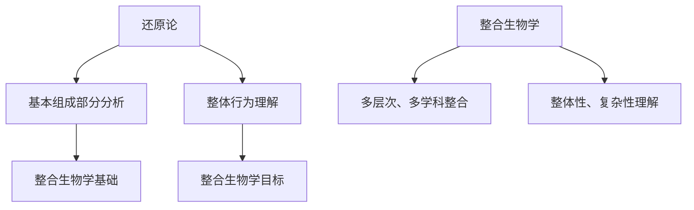
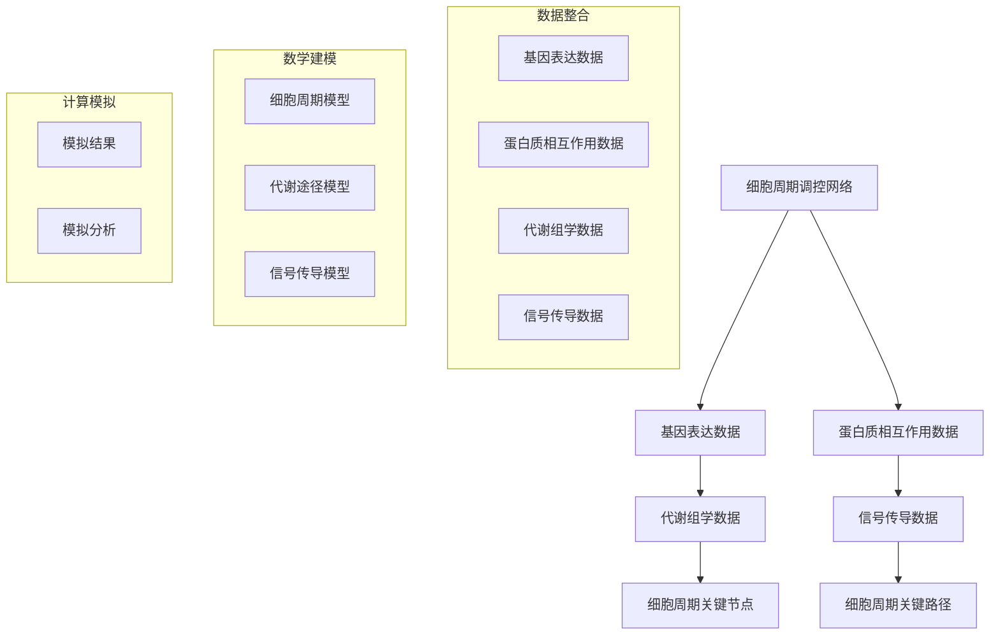
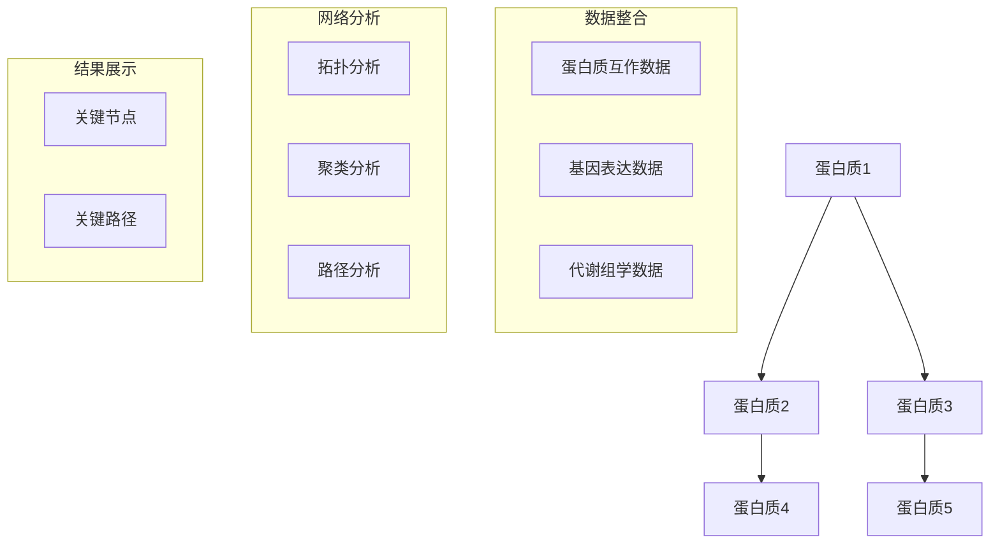
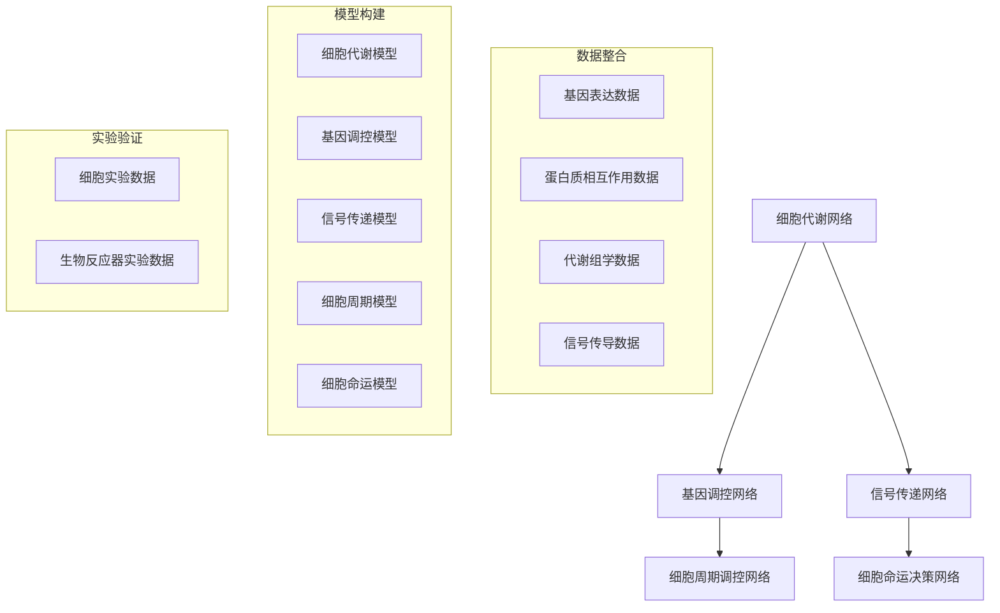

                 

### 文章标题：从还原论到整合生物学：全方位理解生命与生态

#### 关键词：还原论、整合生物学、生命、生态、系统生物学、网络生物学、综合生物学

#### 摘要：
本文将深入探讨从还原论到整合生物学的转变，旨在全面理解生命与生态。通过对还原论与整合生物学的定义、核心概念、实践方法及其在生命科学和生态学中的应用进行详细解析，我们不仅揭示了生命与生态的本质，还展望了整合生物学的未来发展。本文旨在为读者提供一个逻辑清晰、结构紧凑、简单易懂的全方位理解生命与生态的框架，激发进一步探索的兴趣。

### 引言

生命与生态是自然界中最神秘而复杂的课题之一。自古以来，人类一直在努力寻找生命的本质和生态系统的运行规律。传统的生物学研究方法，即还原论，通过对生命现象的分解和分析来揭示其基本原理。然而，随着科技的进步和生物学研究的深入，还原论方法在解释生命与生态现象时逐渐显现出局限性。为了更好地理解复杂的生命系统和生态系统，整合生物学应运而生。

整合生物学是一种跨学科的研究方法，旨在将不同的生物学分支整合在一起，从宏观和微观层面全面解析生命与生态现象。它强调系统、网络和综合的视角，通过多学科交叉和多层次整合，为揭示生命与生态的复杂性提供了新的思路。本文将从还原论到整合生物学的转变出发，系统介绍生命与生态的核心概念、整合生物学的实践方法及其应用，以期提供一个全面理解生命与生态的框架。

### 第1章：还原论与整合生物学概述

#### 1.1 还原论的概念

还原论是一种研究方法，它将复杂现象分解为基本组成部分，通过分析这些组成部分的相互作用来理解复杂现象的整体行为。在生物学中，还原论起源于19世纪，当时的生物学家认为生命现象可以归结为生物分子的特性和功能。这一观点导致了细胞学说的建立，即所有生物都是由一个或多个细胞组成的。

还原论的核心原则是：通过理解生命体的各个组成部分（如细胞、分子、基因等）的特性和功能，可以推导出生命体的整体行为。这种方法在揭示生命现象的基本原理方面取得了巨大成功，例如，分子生物学通过对DNA的研究揭示了遗传信息的传递和表达机制。

然而，随着生物学研究的深入，还原论方法逐渐暴露出其局限性。首先，还原论往往忽略了生命系统中各个组成部分之间的相互作用和反馈，这可能导致对整体行为的误解。其次，生命系统具有高度的复杂性和不可预测性，无法简单地通过分析基本组成部分来完全理解。

#### 1.2 整合生物学的概念

整合生物学（integrative biology）是一种新兴的研究方法，它强调将不同层次和不同领域的生物学知识整合起来，以全面理解生命现象。与还原论不同，整合生物学不仅关注生命体的各个组成部分，还关注它们之间的相互作用和反馈。

整合生物学的核心原则是：通过多层次、多学科的综合研究，揭示生命现象的整体性和复杂性。这种方法强调跨学科合作，包括分子生物学、发育生物学、生态学、进化生物学等多个领域。整合生物学不仅有助于揭示生命现象的机制，还为解决复杂的生物学问题提供了新的思路。

整合生物学的研究方法包括系统生物学、网络生物学和综合生物学。系统生物学（systems biology）通过数学模型和计算机模拟来研究生物系统的动态行为和调控机制。网络生物学（network biology）通过分析生物网络的结构和功能来揭示生命系统的运行规律。综合生物学（integrative systems biology）则将系统生物学和网络生物学的方法结合起来，以全面解析复杂的生物系统。

#### 1.3 还原论与整合生物学的联系与区别

还原论和整合生物学是两种不同的研究方法，但它们之间存在一定的联系。首先，还原论为整合生物学提供了基础，通过揭示生命现象的基本原理，为整合生物学的研究提供了丰富的素材。其次，整合生物学在还原论的基础上，通过多层次、多学科的整合，弥补了还原论的不足，为全面理解生命现象提供了新的思路。

尽管存在联系，还原论和整合生物学在研究方法、研究重点和研究目标方面存在显著差异。还原论强调分解和分析，通过理解基本组成部分来揭示整体行为；而整合生物学则强调整合和综合，通过多层次、多学科的整合来揭示生命现象的整体性和复杂性。

还原论与整合生物学的联系与区别可以用以下Mermaid流程图表示：



#### 1.3.1 还原论与整合生物学的异同点

**相同点：**
1. 都致力于揭示生命现象的原理和机制。
2. 都采用实验和理论分析方法。
3. 都强调跨学科合作，尽管方式不同。

**不同点：**
1. 研究方法：还原论侧重于分解和分析，整合生物学侧重于整合和综合。
2. 研究重点：还原论关注生命体的各个组成部分，整合生物学关注整体性和复杂性。
3. 研究目标：还原论旨在理解基本原理，整合生物学旨在全面理解生命现象。

#### 1.3.2 还原论与整合生物学在生物学研究中的应用

还原论在生物学研究中发挥了重要作用，特别是在分子生物学、遗传学和发育生物学等领域。通过揭示生命现象的基本原理，还原论为整合生物学提供了丰富的素材。例如，分子生物学通过对DNA的研究揭示了遗传信息的传递和表达机制，为整合生物学的研究提供了基础。

整合生物学在生物学研究中也具有重要意义。通过多层次、多学科的整合，整合生物学揭示了生命现象的整体性和复杂性。例如，系统生物学通过数学模型和计算机模拟揭示了生物系统的动态行为和调控机制，为理解复杂的生物系统提供了新方法。

总之，还原论和整合生物学是两种互补的研究方法。还原论为整合生物学提供了基础，整合生物学则在还原论的基础上进一步揭示了生命现象的整体性和复杂性。通过结合这两种方法，生物学研究将取得更加深入和全面的理解。

### 第2章：生命与生态的核心概念

#### 2.1 生物复杂性

生物复杂性是生命系统的一个重要特征，指的是生命现象在结构和功能上的复杂性。生物复杂性体现在多个层面，包括生物体内部的分子和细胞层次、器官和组织层次，以及生物体之间的相互作用和生态系统层次。

生物复杂性的产生源于多个因素，包括基因的多样性、生态位的多样性、环境因素的多样性以及生物体内部复杂的网络结构和调控机制。基因多样性导致了生物体在形态、行为和生理功能上的多样性，从而形成了丰富的生物多样性。生态位的多样性使得不同生物体在生态系统中的角色和功能各不相同，从而形成了复杂的生态网络。环境因素的多样性则影响了生物体的适应和进化。

生物复杂性的研究对于理解生命现象具有重要意义。通过研究生物复杂性，科学家可以揭示生命现象的机制和规律，从而为解决复杂的生物学问题提供新方法和新思路。例如，系统生物学通过研究生物系统的复杂网络和动态行为，揭示了生物体在基因调控、代谢途径和信号传递等方面的复杂机制。

#### 2.2 生物进化

生物进化是生物多样性形成和生命系统演变的关键过程。生物进化指的是生物体在长时间内通过遗传变异、自然选择和基因流等机制逐渐适应环境，形成新的物种和生物多样性的过程。

生物进化的机制主要包括基因突变、基因重组、自然选择和基因流。基因突变是指基因序列发生改变，导致遗传信息的变异。基因重组是指通过有性生殖过程中染色体的交换和重组，形成新的基因组合。自然选择是指适应环境的生物个体在生存和繁殖上具有优势，从而逐渐积累有利的遗传特征。基因流是指不同种群之间的基因迁移，导致基因在种群间的分布和变化。

生物进化的过程可以通过达尔文的自然选择理论和现代生物进化理论来解释。达尔文的自然选择理论认为，生物进化是通过个体之间的竞争和适应环境来实现的。现代生物进化理论则通过遗传学、分子生物学和生态学的理论框架，深入揭示了生物进化的分子机制和生态学基础。

生物进化对于生命系统的复杂性和多样性具有重要影响。通过进化，生物体逐渐适应了不同的环境，形成了多样化的形态和生理功能。这种多样性为生命系统的稳定性和适应性提供了基础。

#### 2.3 生物多样性与生态系统稳定性

生物多样性是生命系统的一个重要特征，指的是生物体在物种、基因和生态系统层次上的多样性。生物多样性包括物种多样性、遗传多样性和生态系统多样性。物种多样性指的是不同物种的丰富程度；遗传多样性指的是同一物种内基因的多样性；生态系统多样性则指的是不同生态系统类型的丰富程度。

生态系统稳定性指的是生态系统在面对干扰和变化时的抵抗能力和恢复能力。生物多样性与生态系统稳定性之间存在密切关系。首先，物种多样性和遗传多样性有助于生态系统提供多种生态功能和生态位，从而增强生态系统的稳定性和适应性。其次，生态系统多样性增加了生态系统在面对环境变化时的缓冲能力，有助于保持生态系统的稳定。

生物多样性的保护和恢复对于维持生态系统稳定性具有重要意义。保护生物多样性可以通过保护自然生态系统和生物栖息地来实现。恢复生物多样性则需要通过生态系统恢复和生态工程等手段，重建受损生态系统的结构和功能。

总之，生物复杂性、生物进化和生物多样性是生命与生态的核心概念，它们共同构成了生命系统的复杂性和多样性。通过深入理解这些核心概念，我们可以更好地理解生命与生态的运行规律，为生物保护和生态恢复提供科学依据。

### 第3章：整合生物学的实践方法

#### 3.1 系统生物学

系统生物学（Systems Biology）是一种跨学科的研究方法，旨在通过数学模型和计算机模拟来揭示生物系统的动态行为和调控机制。系统生物学将生物体视为一个复杂的动态系统，强调系统内部各个组成部分之间的相互作用和反馈关系。

系统生物学的研究方法主要包括以下几个步骤：

1. **数据收集**：通过高通量实验技术（如基因表达谱、蛋白质组学、代谢组学等）收集大量生物数据，这些数据为构建数学模型提供了基础。

2. **模型构建**：基于生物数据，构建描述生物系统动态行为的数学模型。这些模型可以是基于微分方程的定量模型，也可以是基于逻辑门或布尔网络的简化模型。

3. **模拟与分析**：使用计算机模拟和数据分析方法，对构建的数学模型进行模拟和分析，以预测生物系统的行为和调控机制。

4. **实验验证**：通过实验方法验证模型的预测，并根据实验结果对模型进行优化和调整。

系统生物学在揭示生物系统复杂性和动态行为方面发挥了重要作用。例如，通过系统生物学方法，科学家可以揭示细胞周期调控网络的动态行为，理解癌症发生的分子机制。此外，系统生物学还为药物设计和治疗策略提供了新的思路，通过模拟药物在不同生物系统中的行为，优化药物剂量和治疗方案。

以下是一个简单的系统生物学模型构建的伪代码示例：

```python
# 数据预处理
data = preprocess_data(raw_data)

# 构建数学模型
model = build_model(data)

# 模拟和分析
simulations = simulate(model)
analysis_results = analyze(simulations)

# 实验验证
experiments = perform_experiments(analysis_results)
validate(model, experiments)
```

#### 3.2 网络生物学

网络生物学（Network Biology）是一种通过分析生物网络的拓扑结构和功能关系来揭示生命系统运行规律的研究方法。生物网络包括基因调控网络、蛋白质相互作用网络、代谢网络等，它们反映了生物系统内部各个组成部分之间的复杂相互作用。

网络生物学的研究方法主要包括以下几个步骤：

1. **数据收集**：通过高通量实验技术（如基因芯片、蛋白质互作实验等）收集生物网络数据，构建生物网络图。

2. **网络分析**：使用网络分析工具和算法，对生物网络进行拓扑结构分析（如度分布、聚类系数、网络模块等）和功能分析（如模块功能注释、信号通路分析等）。

3. **网络建模**：基于网络数据，构建描述生物网络动态行为的数学模型，并通过计算机模拟研究网络的功能和稳定性。

4. **实验验证**：通过实验方法验证网络模型的预测，并根据实验结果对模型进行优化和调整。

网络生物学在揭示生物系统复杂性和动态行为方面具有重要作用。例如，通过网络生物学方法，科学家可以揭示癌症相关的基因调控网络，理解癌症的发病机制。此外，网络生物学还为药物发现和疾病治疗提供了新的策略，通过分析生物网络中的关键节点和关键路径，筛选潜在的药物靶点。

以下是一个简单的网络生物学分析的伪代码示例：

```python
# 数据预处理
network_data = preprocess_network_data(raw_data)

# 构建生物网络图
network = build_network_graph(network_data)

# 网络分析
topological_properties = analyze_network_topology(network)
functional_annotations = analyze_network_functionality(network)

# 网络建模
model = build_network_model(topological_properties, functional_annotations)

# 实验验证
experiments = perform_experiments(model)
validate(model, experiments)
```

#### 3.3 综合生物学

综合生物学（Integrative Systems Biology）是一种将系统生物学、网络生物学和其他生物学分支的方法整合在一起，以全面解析复杂的生物系统的研究方法。综合生物学强调跨学科合作和多层次整合，通过综合分析不同层次和不同领域的生物数据，揭示生命系统的整体性和复杂性。

综合生物学的研究方法主要包括以下几个步骤：

1. **数据整合**：收集并整合来自不同层次和不同领域的生物数据，如基因表达数据、蛋白质相互作用数据、代谢数据等。

2. **多层次整合**：将不同层次的数据整合到一个统一的框架中，例如，将基因表达数据与蛋白质相互作用数据整合到基因调控网络中。

3. **多学科交叉**：结合不同学科的理论和方法，例如，将系统生物学的方法与生态学的方法结合起来，研究生态系统的动态行为。

4. **模型构建**：基于整合的数据和理论框架，构建描述生物系统整体行为的数学模型。

5. **模拟与分析**：使用计算机模拟和数据分析方法，对构建的数学模型进行模拟和分析，以预测生物系统的行为和调控机制。

6. **实验验证**：通过实验方法验证模型的预测，并根据实验结果对模型进行优化和调整。

综合生物学在揭示生命系统的复杂性和动态行为方面具有重要意义。例如，通过综合生物学方法，科学家可以揭示细胞代谢与信号传递网络的相互作用，理解细胞命运的决定机制。此外，综合生物学还为疾病治疗提供了新的策略，通过整合不同层次的生物数据，筛选和验证潜在的药物靶点。

以下是一个简单的综合生物学分析的伪代码示例：

```python
# 数据整合
integrated_data = integrate_data(gene_expression_data, protein_interaction_data, metabolic_data)

# 多层次整合
integrated_model = integrate_models(gene_expression_model, protein_interaction_model, metabolic_model)

# 多学科交叉
cross_discipline_model = cross_disciplinary_analysis(integrated_model)

# 模型构建
global_model = build_global_model(cross_discipline_model)

# 模拟与分析
simulations = simulate_model(global_model)
analysis_results = analyze_simulations(simulations)

# 实验验证
experiments = perform_experiments(analysis_results)
validate_model(global_model, experiments)
```

通过综合生物学方法，我们可以更全面地理解生命系统的复杂性和动态行为，为生物学研究提供新的思路和工具。

### 第4章：全方位理解生命

#### 4.1 生命起源与演化

生命的起源和演化是生物学中最为神秘和迷人的课题之一。尽管科学家们已经提出了一些假说来解释生命的起源，但这一领域仍然充满了未解之谜。目前广泛接受的解释之一是化学进化假说，即生命起源于非生命的化学反应。

根据化学进化假说，地球早期的大气中富含简单的无机化合物，如水、甲烷、氨和氢等。这些化合物在高温、紫外线和雷电等自然条件下发生化学反应，形成了更为复杂的有机分子，如氨基酸、核苷酸等。这些有机分子逐渐形成了多分子体系，最终演化成原始细胞。

生命的演化是一个漫长的过程，从单细胞生物到多细胞生物，再到复杂生物体的形成，经历了数十亿年的进化。演化过程中，自然选择和遗传变异是驱动生物体适应环境、形态和生理功能发生变化的主要机制。

自然选择是指适应环境的生物个体在生存和繁殖上具有优势，从而逐渐积累有利的遗传特征。遗传变异是指基因序列在复制过程中发生的突变，这些突变可能会导致新的遗传特征的产生。

通过演化的过程，生物体逐渐适应了不同的生态环境，形成了多样化的形态和生理功能。这种多样性为生命系统的复杂性和适应性提供了基础。例如，恐龙在地球历史上统治了长达1.6亿年，但由于无法适应环境变化，最终灭绝。而哺乳动物则通过演化出适应性特征，如温血性、哺乳行为和复杂的社会结构，成功地生存至今。

生命起源与演化的研究不仅有助于我们理解生命的本质，还为现代生物学和医学提供了重要的理论依据。例如，通过研究生物的进化关系，我们可以揭示物种之间的亲缘关系，理解生物多样性。此外，生命起源与演化的研究也为生物技术的发展提供了新思路，如通过模拟生命起源过程，探索新的生物合成途径和材料。

#### 4.2 生物体结构与功能

生物体是生命的基本单位，具有独特的结构和功能。生物体的结构层次可以分为细胞层次、组织层次、器官层次和器官系统层次。

细胞是生物体的基本结构和功能单位。细胞具有细胞膜、细胞质和细胞核等基本结构，能够进行新陈代谢、生长、分裂和遗传信息传递等基本生命活动。不同类型的细胞具有不同的形态和功能，如肌肉细胞、神经细胞和红细胞等。

组织是由一群具有相似形态和功能的细胞组成的细胞群体。根据组织在生物体中的作用，可以分为上皮组织、结缔组织、肌肉组织和神经组织等。上皮组织主要负责保护和分泌，如皮肤和肠道黏膜；结缔组织提供支持和保护，如骨骼和韧带；肌肉组织负责运动，如骨骼肌和心肌；神经组织则负责传递神经信号，如神经元和神经纤维。

器官是由不同类型的组织构成的，具有特定功能的结构。例如，心脏是由心肌组织构成的，负责泵血；肝脏是由多种组织构成的，负责代谢、解毒和分泌胆汁等功能。

器官系统是由多个器官协同工作形成的，具有更复杂的生理功能。例如，循环系统由心脏、血管和血液等器官组成，负责输送氧气和营养物质，清除代谢废物；消化系统由口腔、食管、胃、肠等器官组成，负责消化和吸收食物。

生物体的结构和功能是相互关联的。生物体的结构决定了其功能，而功能的实现又依赖于特定的结构。例如，心脏的收缩和舒张依赖于心肌组织的结构和功能；消化系统的运动和消化酶的分泌依赖于胃肠道的结构。

了解生物体结构与功能的关系对于理解生命现象具有重要意义。通过研究生物体的结构和功能，我们可以揭示生命的基本规律，为医学和生物技术的发展提供理论基础。例如，通过对细胞结构和功能的研究，科学家可以揭示细胞癌变的机制，开发新的抗癌药物。通过对器官系统和器官的研究，我们可以理解人体在疾病和健康状态下的生理变化，为疾病的诊断和治疗提供新的方法。

#### 4.3 生物系统与环境相互作用

生物系统与环境相互作用是生态学研究的核心问题之一。生物系统包括个体、种群、群落和生态系统等不同层次的生物组织形式，它们通过能量流动、物质循环和信息传递与周围环境相互作用。

能量流动是指能量在生物系统中的传递和转化过程。能量最初来自太阳，通过光合作用进入生态系统，随后在食物链和食物网中传递和转化。能量流动的特点是单向流动、逐级递减，每一级生物体只能吸收和利用上一级生物体的一部分能量。

物质循环是指物质在生物系统中的循环和再生过程。物质循环包括碳循环、氮循环、磷循环等，它们通过生物体的吸收、转化和排放实现。物质循环的特点是循环性、连续性和再生性，生物系统通过物质循环实现了对环境的适应和调控。

信息传递是指生物系统通过信号分子、电磁波和物理过程等途径传递信息的过程。信息传递在生物系统中具有重要作用，如生物钟调节、生态位争夺、捕食与被捕食关系等。信息传递的特点是多样性和复杂性，生物系统通过信息传递实现了对环境变化的响应和适应。

生物系统与环境相互作用的影响因素包括气候、地形、土壤、水文和生物多样性等。这些因素共同决定了生物系统的结构和功能，影响着生态系统的稳定性和生产力。

生物系统对环境的适应和影响是一个复杂的过程。例如，生物系统可以通过光合作用吸收二氧化碳，释放氧气，从而影响大气成分；通过固氮作用将大气中的氮气转化为生物可利用的形式，为生态系统提供氮源。此外，生物系统还可以通过调节土壤结构和水分含量，影响土壤肥力和水文循环。

总之，生物系统与环境相互作用是生态系统运行的基础。通过深入研究生物系统与环境相互作用的过程和机制，我们可以更好地理解生态系统的功能、稳定性和可持续性，为生态保护和环境保护提供科学依据。

### 第5章：全方位理解生态

#### 5.1 生态系统功能

生态系统（Ecosystem）是由生物群落（Biological Community）和其非生物环境（Abiotic Environment）相互作用形成的功能单位。生态系统功能主要包括物质循环、能量流动、生物多样性维持和生态系统的生产力等方面。

**物质循环**：生态系统通过生物体和微生物的代谢过程，将物质从一种形式转化为另一种形式。例如，碳循环是通过光合作用和呼吸作用进行的，氮循环通过固氮、硝化、反硝化和氨化过程实现。物质循环的特点是循环性和再生性，通过生态系统的物质循环，营养物质得以持续供应。

**能量流动**：生态系统中的能量最初来源于太阳，通过光合作用转化为化学能，然后通过食物链和食物网在生物体之间传递。能量流动的特点是单向流动和逐级递减，每一级生物体只能利用上一级生物体的一部分能量。能量流动是生态系统功能的基础，驱动着生态系统的物质循环和生物多样性维持。

**生物多样性维持**：生态系统通过生物多样性维持其稳定性和生产力。生物多样性包括遗传多样性、物种多样性和生态系统多样性。遗传多样性为生态系统提供了适应环境变化的基础，物种多样性增加了生态系统的功能多样性和稳定性，生态系统多样性则提高了生态系统的适应性和抗干扰能力。

**生态系统的生产力**：生态系统的生产力是指生物体通过光合作用、化学合成和化能合成等途径将无机物转化为有机物的能力。生态系统的生产力决定了生态系统的生物量积累和营养物质循环。生态系统的生产力受多种因素影响，如光照、温度、水分、土壤肥力和生物多样性等。

#### 5.2 生态系统动态

生态系统动态（Ecosystem Dynamics）是指生态系统在时间和空间上的变化和演化过程。生态系统动态受多种因素影响，包括气候、土壤、地形、生物多样性、人类活动等。以下是一些关键的生态系统动态过程：

**物种竞争**：物种竞争是生态系统动态中的一个重要过程。不同物种之间通过争夺资源（如食物、栖息地、光照等）来竞争生存和繁殖的机会。竞争的结果可能导致物种的存活和灭绝，从而影响生态系统的结构和功能。

**物种相互作用**：生态系统中的物种相互作用包括捕食与被捕食、共生、竞争和互利共生等。这些相互作用影响着物种的数量、分布和生态位。例如，捕食者-被捕食者关系通过调节物种数量维持生态平衡。

**生态系统演替**：生态系统演替（Ecological Succession）是指一个生态系统在时间和空间上的变化过程。生态系统演替可以分为初级演替和次级演替。初级演替发生在从未被植物覆盖的地区，次级演替发生在受到干扰的生态系统中。生态系统演替过程中，物种组成、物种多样性和生态系统功能会发生变化。

**气候和环境变化**：气候和环境变化对生态系统动态具有重要影响。气候变化可能导致温度、降水和风等环境因素的变异，从而影响生态系统的生产力、物种分布和物种相互作用。环境变化，如土地利用变化、污染和气候变化，可能导致生态系统功能的丧失和生物多样性的减少。

**人类活动**：人类活动对生态系统动态的影响显著。农业、工业和城市化等人类活动改变了生态系统的结构和功能，导致生物栖息地的丧失、生物多样性的减少和生态系统的退化。人类活动还可能引发环境污染、物种入侵和气候变化等全球性生态问题。

#### 5.3 生态网络与生态过程

生态网络（EcoNetwork）是描述生态系统内部物种相互作用和能量流动关系的图形表示。生态网络由节点（Species）和边（Interaction）组成，节点表示物种，边表示物种之间的相互作用，如捕食、共生、竞争等。

生态网络在生态过程中具有重要作用，以下是一些关键方面：

**能量流和物质循环**：生态网络通过描述物种之间的相互作用，揭示了能量和物质的流动路径。例如，食物网展示了能量从生产者到消费者再到分解者的传递过程，而物质循环网络则展示了营养物质在不同物种和生物群落之间的循环。

**物种相互作用**：生态网络揭示了生态系统中的物种相互作用关系。通过分析生态网络的结构和功能，可以揭示物种之间的捕食、共生和竞争关系。这些相互作用关系对于生态系统的稳定性和功能具有关键影响。

**生态位重叠和资源利用**：生态网络有助于理解生态位重叠和资源利用。生态位重叠是指不同物种在同一生态位上的竞争，资源利用则是指物种如何利用有限的环境资源。通过分析生态网络，可以揭示物种之间在生态位和资源利用方面的关系，从而了解生态系统的稳定性和生产力。

**生态系统功能**：生态网络对于理解生态系统的功能具有重要意义。例如，通过分析生态网络的关键物种和关键路径，可以揭示生态系统在物质循环、能量流动和生态平衡等方面的关键功能。这些功能对于维持生态系统的稳定性和生产力至关重要。

总之，生态网络与生态过程密切相关。通过分析生态网络的结构和功能，我们可以更好地理解生态系统的运行机制，为生态保护和可持续发展提供科学依据。

### 第6章：整合生物学与生物技术

#### 6.1 系统生物技术与应用

系统生物技术（Systems Biotechnology）是整合生物学与生物技术的交叉领域，它利用系统生物学的方法和技术，对生物系统进行定量分析和建模，以揭示生物系统的动态行为和调控机制。系统生物技术在生物科学和生物技术领域具有重要应用。

**系统生物技术的方法**：
1. **高通量实验技术**：高通量实验技术，如高通量基因表达分析、高通量蛋白质组学和代谢组学，用于大规模收集生物数据，为系统生物学的建模和分析提供数据基础。
2. **数学建模和计算模拟**：基于收集到的生物数据，通过数学建模和计算模拟，构建描述生物系统动态行为的模型。这些模型可以揭示生物系统的调控网络、代谢途径和信号传导路径。
3. **数据整合与分析**：将来自不同层次和不同领域的生物数据整合到一个统一的框架中，通过多尺度、多学科的数据分析，揭示生物系统的整体行为和调控机制。

**系统生物技术的应用**：
1. **药物研发**：系统生物技术可以用于药物研发，通过分析生物系统的调控网络和代谢途径，发现新的药物靶点和药物作用机制。例如，通过系统生物学的分析，科学家发现了一些与癌症相关的关键基因和信号通路，从而为开发抗癌药物提供了新思路。
2. **生物系统调控**：系统生物技术可以用于生物系统的调控，如基因编辑、蛋白质工程和代谢工程。通过系统生物学的分析和建模，可以设计出更高效的生物系统，用于生产生物燃料、生物药物和生物材料。
3. **生物反应器优化**：系统生物技术可以用于优化生物反应器，如微生物发酵罐和植物细胞培养系统。通过构建生物系统的数学模型，可以预测和优化生物反应器中的代谢途径和信号传导，提高生物反应器的产量和效率。

以下是一个简单的系统生物技术应用示例，用于分析细胞周期调控网络：



#### 6.2 网络生物技术与应用

网络生物技术（Network Biotechnology）是整合生物学与生物技术的交叉领域，它利用网络分析方法和技术，对生物网络进行定量分析和建模，以揭示生物网络的拓扑结构和功能关系。网络生物技术在生物科学和生物技术领域具有重要应用。

**网络生物技术的方法**：
1. **网络构建**：通过高通量实验技术和生物信息学方法，构建生物网络的拓扑结构，包括基因调控网络、蛋白质相互作用网络和代谢网络等。
2. **网络分析**：利用网络分析方法，如拓扑分析、聚类分析和路径分析等，揭示生物网络的拓扑特征和功能关系。这些分析方法可以识别关键节点、关键路径和模块化结构。
3. **数据整合**：将来自不同层次和不同领域的生物数据整合到一个统一的框架中，通过多尺度、多学科的数据整合，揭示生物网络的总体行为和调控机制。

**网络生物技术的应用**：
1. **疾病诊断与预测**：网络生物技术可以用于疾病诊断和预测，通过分析生物网络中的异常节点和关键路径，识别疾病的潜在生物标志物。例如，通过分析基因调控网络，科学家发现了一些与癌症相关的关键基因，从而为癌症的早期诊断和预测提供了新方法。
2. **药物靶点筛选**：网络生物技术可以用于药物靶点筛选，通过分析生物网络中的关键节点和关键路径，识别潜在的药物靶点。例如，通过分析蛋白质相互作用网络，科学家发现了一些与癌症相关的关键蛋白质，从而为开发抗癌药物提供了新靶点。
3. **生物系统优化**：网络生物技术可以用于生物系统的优化，如基因编辑、蛋白质工程和代谢工程。通过分析生物网络的拓扑结构和功能关系，可以设计出更高效的生物系统，用于生产生物燃料、生物药物和生物材料。

以下是一个简单的网络生物技术应用示例，用于分析蛋白质相互作用网络：



#### 6.3 综合生物技术与应用

综合生物技术（Integrative Biotechnology）是整合生物学与生物技术的交叉领域，它将系统生物学、网络生物学和其他生物学分支的方法整合在一起，以全面解析复杂的生物系统。综合生物技术在生物科学和生物技术领域具有重要应用。

**综合生物技术的方法**：
1. **数据整合**：将来自不同层次和不同领域的生物数据整合到一个统一的框架中，通过多尺度、多学科的数据整合，揭示生物系统的总体行为和调控机制。
2. **模型构建**：基于整合的数据和理论框架，构建描述生物系统整体行为的数学模型，并通过计算机模拟和实验验证，优化模型和验证模型的预测。
3. **多学科交叉**：结合不同学科的理论和方法，如系统生物学、网络生物学、发育生物学和生态学等，对生物系统进行综合分析和研究。
4. **实验验证**：通过实验方法验证模型的预测，并根据实验结果对模型进行优化和调整。

**综合生物技术的应用**：
1. **生物系统解析**：综合生物技术可以用于生物系统的解析，通过多层次的整合分析和建模，揭示生物系统的复杂结构和功能关系。例如，通过综合分析基因表达、蛋白质相互作用和代谢数据，可以揭示细胞周期的调控机制和细胞命运的决策过程。
2. **疾病机理研究**：综合生物技术可以用于疾病机理研究，通过整合不同层次的生物数据，识别疾病相关的关键基因、蛋白质和代谢途径，从而揭示疾病的发病机制。例如，通过综合分析基因组、蛋白质组和代谢组数据，可以揭示癌症的发生和发展机制。
3. **生物工程和药物研发**：综合生物技术可以用于生物工程和药物研发，通过整合系统生物学和网络生物学的方法，设计和优化生物系统，用于生产生物药物、生物燃料和生物材料。例如，通过综合分析基因调控网络和代谢途径，可以设计出更高效的生物反应器，用于生产高价值的生物产品。

以下是一个简单的综合生物技术应用示例，用于分析细胞代谢与信号传递网络的整合：



### 第7章：整合生物学与生态保护

#### 7.1 生态保护理念

生态保护（Eco-protection）是指通过采取一系列措施，维护和恢复生态系统的功能和稳定性，保护生物多样性和生态平衡。整合生物学为生态保护提供了新的理论和方法，通过多层次的整合分析，揭示生态系统的复杂性和动态变化，为生态保护和恢复提供了科学依据。

**生态保护的核心原则**：
1. **生态完整性**：生态保护强调维护生态系统的完整性，包括生物多样性、生态过程和生态功能的完整。生态完整性是生态系统稳定性和可持续性的基础。
2. **可持续性**：生态保护追求生态系统在时间和空间上的可持续性，确保生态系统能够长期维持其功能和生产力，满足人类和其他生物的需求。
3. **综合性**：生态保护需要综合考虑自然、社会和经济因素，采取综合性措施，实现生态、经济和社会的协调发展。
4. **参与性**：生态保护需要广泛动员社会各界的参与，包括政府、企业、非政府组织和公众，形成全社会共同参与的生态保护格局。

**整合生物学在生态保护中的应用**：
1. **生态系统功能评估**：整合生物学方法可以用于评估生态系统的功能，如碳循环、氮循环和生物多样性等。通过定量分析和建模，可以揭示生态系统功能的动态变化和关键影响因素，为生态保护提供科学依据。
2. **生物多样性保护**：整合生物学可以用于生物多样性的评估和保护。通过整合不同层次的生物数据，如基因组、蛋白质组和生态数据，可以揭示生物多样性的结构和功能关系，为制定生物多样性保护策略提供科学依据。
3. **生态系统恢复**：整合生物学方法可以用于生态系统的恢复和修复。通过分析和模拟生态系统的动态变化，可以制定出科学、有效的恢复方案，加速生态系统的恢复进程。

#### 7.2 生态保护实践

生态保护实践是指通过具体的行动和措施，实现生态系统的保护和恢复。整合生物学为生态保护实践提供了科学依据和指导，以下是一些常见的生态保护实践方法：

1. **生物多样性保护**：
   - **自然保护区**：建立自然保护区，保护天然生态系统和生物多样性。自然保护区可以提供生物栖息地和食物来源，维持生态系统的完整性和稳定性。
   - **物种保护和繁育**：对濒危物种进行保护和繁育，增加物种的数量和遗传多样性。例如，建立野生动物保护区、繁育基地和基因库等。
   - **生态修复**：对受损的生态系统进行修复和恢复，如湿地修复、红树林恢复和珊瑚礁重建等。通过生态修复，可以恢复生态系统的功能和生物多样性。

2. **生态系统管理**：
   - **可持续利用**：合理利用自然资源，确保资源的可持续性。例如，实施可持续林业管理、渔业管理和水资源管理。
   - **生态工程**：通过生态工程技术，修复和恢复受损的生态系统。生态工程包括湿地重建、河流修复、沙漠化治理和生态屏障建设等。

3. **环境监测与评估**：
   - **环境监测**：通过监测环境参数，如水质、空气质量、土壤质量和生物多样性，了解生态系统的健康状况。环境监测可以揭示生态系统的变化趋势和潜在问题，为生态保护提供实时数据。
   - **生态评估**：对生态系统的变化和影响进行评估，制定科学、合理的生态保护政策和管理措施。生态评估包括环境影响评估、生态系统健康评估和生态补偿评估等。

通过生态保护实践，可以维护和恢复生态系统的功能和稳定性，保护生物多样性和生态平衡，实现生态系统的可持续性。整合生物学为生态保护实践提供了科学依据和技术支持，有助于提高生态保护的效果和可持续性。

#### 7.3 整合生物学在生态保护中的应用

整合生物学在生态保护中的应用具有重要意义，通过多层次的整合分析和建模，可以揭示生态系统的复杂性和动态变化，为生态保护和恢复提供科学依据。以下是一些整合生物学在生态保护中的应用案例：

1. **生态系统功能评估**：
   - **碳循环评估**：整合生物学方法可以用于评估生态系统的碳循环功能，如光合作用、呼吸作用和土壤碳储存等。通过定量分析和建模，可以揭示碳循环的动态变化和关键影响因素，为碳减排和碳汇管理提供科学依据。
   - **氮循环评估**：整合生物学方法可以用于评估生态系统的氮循环功能，如氮固定、硝化作用、反硝化作用和氨化作用等。通过定量分析和建模，可以揭示氮循环的动态变化和关键影响因素，为氮污染控制和氮资源管理提供科学依据。

2. **生物多样性保护**：
   - **生物多样性监测**：整合生物学方法可以用于生物多样性的监测和评估，如遗传多样性、物种多样性和生态系统多样性等。通过基因测序、基因组分析和生态数据整合，可以揭示生物多样性的结构和功能关系，为生物多样性保护提供科学依据。
   - **生物入侵防控**：整合生物学方法可以用于生物入侵的监测和防控，如物种识别、遗传分析和生态风险评估等。通过整合不同层次的生物数据，可以揭示生物入侵的机制和影响，为生物入侵防控提供科学依据。

3. **生态系统恢复**：
   - **生态系统修复**：整合生物学方法可以用于生态系统的修复和恢复，如湿地修复、红树林恢复和珊瑚礁重建等。通过定量分析和建模，可以揭示生态系统修复的关键步骤和优化方案，为生态系统的恢复提供科学依据。
   - **生态系统管理**：整合生物学方法可以用于生态系统的管理和优化，如生态工程、生态农业和生态城市等。通过整合不同层次的生物数据，可以揭示生态系统管理的关键因素和优化策略，为生态系统的管理和优化提供科学依据。

总之，整合生物学在生态保护中的应用为生态系统的评估、保护、恢复和管理提供了新的思路和方法。通过多层次的整合分析和建模，可以更全面、准确地理解生态系统的复杂性和动态变化，为生态保护和可持续发展提供科学依据。

### 第8章：整合生物学的未来展望

#### 8.1 整合生物学的发展趋势

整合生物学（Integrative Biology）作为一门新兴的跨学科领域，正日益受到学术界和工业界的广泛关注。其发展历程可以追溯到20世纪末，随着高通量实验技术、计算生物学和系统生物学的迅猛发展，整合生物学逐渐成为生物学研究的重要方向。以下是整合生物学的一些发展趋势：

1. **多尺度整合**：整合生物学的发展趋势之一是跨多个尺度进行整合研究，从基因水平、细胞水平、组织水平到生态系统水平。通过在不同尺度上的数据整合和分析，可以更全面地理解生命现象的复杂性和动态行为。

2. **多学科交叉**：整合生物学强调多学科交叉，将生物学、物理学、化学、计算机科学和工程学等领域的知识和技术融合在一起，以解决复杂的生物学问题。这种跨学科的研究模式有助于突破单一学科的局限性，推动生物学研究的发展。

3. **大数据分析**：随着大数据时代的到来，整合生物学正越来越多地依赖大数据分析技术。通过大规模数据收集、存储和分析，可以揭示生物系统的复杂模式和潜在规律，为生物学研究提供新的视角和方法。

4. **个性化医学**：整合生物学在个性化医学领域的应用前景广阔。通过整合基因组、蛋白质组、代谢组和临床数据，可以更精准地诊断疾病、预测治疗效果和制定个性化的治疗方案，推动医学发展的个性化趋势。

5. **合成生物学**：整合生物学与合成生物学的结合，为合成生物学的应用提供了新的思路。合成生物学利用基因编辑、生物催化和生物合成等方法，设计和构建新的生物系统和生物过程，为生物制造、生物能源和生物医学等领域带来变革。

#### 8.2 整合生物学在生命科学与生态学中的潜力

整合生物学在生命科学与生态学中具有巨大的潜力，为解决这些领域的复杂问题提供了新的工具和方法。以下是其主要潜力：

1. **揭示生命本质**：整合生物学通过多层次、多学科的整合分析，有助于揭示生命的本质和生物系统的运行机制。例如，通过整合基因组、蛋白质组、代谢组和细胞行为数据，可以揭示生物体在健康和疾病状态下的复杂调控网络和代谢途径。

2. **推动医学进步**：整合生物学在医学领域的应用前景广阔。通过整合不同层次的生物数据，可以揭示疾病的发病机制、预测疾病的发展和发现新的生物标志物，为个性化医学和精准医疗提供支持。

3. **保护生物多样性**：整合生物学在生态学中的应用有助于保护生物多样性和维护生态平衡。通过整合生态数据和遗传数据，可以揭示生物多样性的结构和功能关系，为生物多样性保护和管理提供科学依据。

4. **优化生态系统管理**：整合生物学方法可以用于生态系统的评估、监测和恢复。通过定量分析和建模，可以揭示生态系统功能的动态变化和关键影响因素，为生态系统的管理、保护和恢复提供科学指导。

5. **促进生物技术创新**：整合生物学与生物技术的结合，为生物技术创新提供了新的动力。通过整合生物信息学、基因工程和生物催化等技术，可以设计和构建新的生物系统和生物过程，为生物制造、生物能源和生物医学等领域带来变革。

#### 8.3 整合生物学对社会与环境的贡献

整合生物学不仅对生命科学和生态学领域产生了深远影响，还对社会和环境产生了积极贡献：

1. **促进可持续发展**：整合生物学为可持续发展提供了科学依据和技术支持。通过优化生态系统管理和生物资源利用，可以减少环境污染、保护生物多样性和实现资源的可持续利用。

2. **推动经济增长**：整合生物学在生物制药、生物农业和生物能源等领域的应用，为经济增长提供了新的动力。通过开发和利用生物资源，可以创造就业机会、增加产值和促进经济发展。

3. **改善人类健康**：整合生物学在医学领域的应用，有助于改善人类健康和提高生活质量。通过个性化医学和精准医疗，可以更有效地预防和治疗疾病，提高医疗服务的质量和效率。

4. **应对全球挑战**：整合生物学在全球气候变化、环境污染和生物入侵等全球性挑战中发挥了重要作用。通过揭示生态系统的运行规律和生物系统的适应机制，可以制定出更有效的应对策略和解决方案。

总之，整合生物学在生命科学、生态学和社会环境等领域具有广阔的应用前景和巨大的潜力。通过不断探索和创新，整合生物学将为人类社会和自然环境带来更多的积极变化和可持续发展。

### 结论

从还原论到整合生物学的转变，标志着生物学研究方法的一次重大变革。还原论通过分解和分析，揭示了生命现象的基本原理，而整合生物学则通过多层次、多学科的整合，全面揭示了生命系统的复杂性和动态行为。本文从还原论与整合生物学的定义、生命与生态的核心概念、整合生物学的实践方法、全方位理解生命与生态等多个方面，系统阐述了整合生物学的重要性及其应用。通过本文的介绍，我们希望读者能够对整合生物学有一个全面、深刻的理解，认识到其在生物学研究、生态保护和生物技术发展中的重要作用。未来，整合生物学将继续发挥其独特优势，为生命科学和生态学领域带来更多突破性进展，为人类社会和自然环境带来更多的积极变化和可持续发展。

