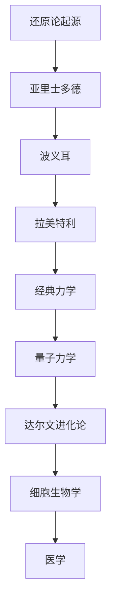
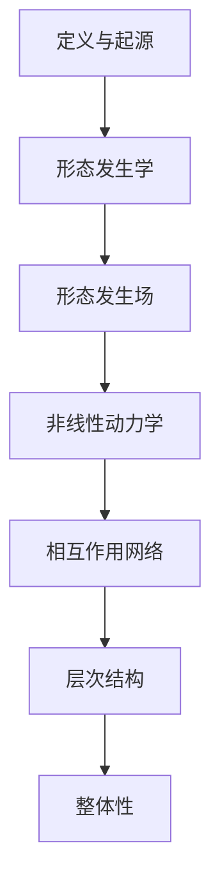

                 

### 引言

#### 背景

在人类探索自然和社会的历程中，科学方法论的发展起到了至关重要的作用。还原论和涌现论作为两种基本的科学方法论，分别在历史上占据着重要地位，并对我们的宇宙观产生了深远影响。还原论强调通过将复杂系统分解为更简单的组成部分来理解系统的整体行为。这种方法在自然科学的发展中起到了推动作用，使得我们能够深入理解原子、分子、细胞等微观世界的运作机制。然而，随着研究的深入，科学家们逐渐认识到，还原论在某些复杂系统中存在局限性，无法全面解释系统的复杂行为。这就促使了涌现论的出现，它强调复杂系统整体行为是由其组成部分之间的相互作用所产生的，而不仅仅是各部分行为的简单叠加。

#### 目的

本文旨在从还原论到涌现论的视角出发，探讨这两种方法论在科学研究和宇宙观中的地位和影响。具体来说，本文将首先介绍还原论的基本概念、历史与发展，以及其局限性。接着，我们将深入探讨涌现论的基本概念、核心原理及其在各领域的应用。最后，本文将对比还原论与涌现论，分析宇宙观的新视角，并展望未来科学发展的方向。

通过本文的探讨，我们希望能够帮助读者理解这两种方法论的本质及其在科学研究和宇宙观中的重要性，从而推动科学思想的进步，为未来的科学研究提供新的视角和思路。

## 第一部分：还原论概述

### 第1章：还原论的历史与发展

#### 1.1 还原论的基本概念

还原论（Reductive Theory）是一种科学方法论，它主张通过分析复杂系统并将其分解为更简单的组成部分，来理解系统的整体行为。这一概念可以追溯到古希腊哲学家亚里士多德（Aristotle），他在《形而上学》中提出了“万物皆由元素构成”的观点，即所有复杂的事物都可以通过分解为基本的元素来理解。

在科学领域，还原论得到了进一步的发展。17世纪，英国科学家罗伯特·波义耳（Robert Boyle）提出了物质是由微小的不可分割粒子（原子）组成的观点，这为还原论提供了物质层面的基础。18世纪，法国启蒙思想家拉美特利（La Mettrie）在《人体机器》中运用机械唯物主义，将人类视为高度复杂的机器，这标志着还原论在生物学领域的兴起。

19世纪，随着物理学和化学的迅速发展，还原论得到了进一步巩固。查尔斯·达尔文（Charles Darwin）的进化论通过将生物多样性还原为遗传变异和自然选择，提供了生物学上的还原论解释。同时，物理学家艾萨克·牛顿（Isaac Newton）的经典力学和19世纪末的量子力学，都通过分解复杂现象为基本物理量，为还原论提供了坚实的理论基础。

#### 1.2 还原论的哲学基础

还原论的哲学基础主要源于机械唯物主义和实证主义。机械唯物主义认为，自然界的所有现象都可以通过机械作用来解释，即一切都可以还原为物理和化学过程。这种观点在17世纪和18世纪的科学家中广泛流行，推动了科学革命的进展。实证主义则强调通过实验和观察来获取知识，而不是依靠形而上学的推理。还原论正是基于这种哲学思想，通过实验和理论模型来揭示自然界的本质。

#### 1.3 还原论的典型实例

还原论在多个科学领域都有广泛应用。在物理学中，经典力学通过将运动分解为位移、速度和加速度等基本量，建立了描述物体运动的数学模型。量子力学则通过将粒子的行为还原为波动函数，提供了对微观世界的深入理解。在化学中，原子和分子的研究通过分析其组成和反应机制，揭示了物质的结构和性质。

在生物学中，达尔文的进化论通过还原生物多样性为遗传变异和自然选择，解释了物种的进化过程。细胞生物学通过分析细胞结构和功能，揭示了生命的微观基础。此外，在医学中，通过还原疾病为生理和病理过程，医生可以诊断和治疗疾病。

#### Mermaid流程图



通过这个流程图，我们可以清晰地看到还原论从哲学思想到具体科学领域的发展历程，以及其主要代表人物和贡献。

## 第一部分总结

在这一部分中，我们介绍了还原论的基本概念、历史发展、哲学基础以及典型实例。还原论作为一种科学方法论，通过将复杂系统分解为更简单的组成部分，帮助我们深入理解自然界的运作机制。从亚里士多德到牛顿，再到达尔文，还原论在科学史上发挥了重要作用。通过流程图的展示，我们可以直观地看到还原论的发展脉络及其在各个科学领域的应用。接下来，我们将深入探讨还原论的局限性，为后续讨论涌现论奠定基础。

### 第2章：还原论的局限性

#### 2.1 还原论的批评与挑战

尽管还原论在科学研究中取得了显著成就，但其局限性也逐渐显现。许多学者开始质疑还原论的有效性，并提出了一系列批评与挑战。这些批评主要涉及以下几个方面：

##### 复杂性问题

首先，还原论在处理复杂系统时面临巨大挑战。复杂系统通常由大量相互作用的组成部分组成，其行为不仅受到各部分特性的影响，还受到它们之间复杂关系的调制。例如，生态系统中各种生物种群之间的相互作用，社会系统中人们的行为模式，以及经济市场中不同参与者的交易行为，都构成了高度复杂的网络。在这种情况下，将复杂系统还原为简单的组成部分，可能无法充分揭示系统的整体行为。

##### 整体性缺失

还原论往往强调分析组成部分的行为，而忽略了各部分之间的相互作用。这种方法可能导致对系统整体性的误解。例如，在生物学中，基因是构成生物体的基本单位，但生物体的行为并不仅仅是基因单独作用的简单叠加。基因与基因之间的相互作用、基因与环境之间的相互作用，共同决定了生物体的行为特征。这种整体性的缺失，使得还原论难以全面解释复杂系统的行为。

##### 实际应用中的局限性

还原论在实际应用中也存在一定的局限性。在工程技术领域，许多复杂系统（如航空系统、交通系统等）的行为难以通过简单的组成部分分析来预测和控制。例如，飞机在飞行过程中，空气动力学特性、发动机性能、导航系统等多个因素相互作用，决定了飞机的整体性能。如果仅仅关注各部分的性能而忽略它们之间的相互作用，可能会导致设计失败或运行故障。

##### 科学研究方法的影响

还原论的方法论对科学研究方法产生了深远影响。它鼓励科学家将研究对象分解为更简单的组成部分，并通过控制变量来研究各部分的行为。然而，这种方法有时会导致研究视角的局限，使得科学家难以捕捉到系统整体的复杂性和动态性。例如，在心理学研究中，传统的行为主义通过控制变量来研究行为模式，但这种方法忽视了人类行为背后的认知和情感因素，导致了对人类行为理解的局限。

##### 哲学层面的批评

从哲学层面来看，还原论也受到质疑。某些哲学家认为，还原论忽视了事物的整体性和动态性，从而无法充分描述世界的真实状态。例如，现象学家马丁·海德格尔（Martin Heidegger）认为，事物并不是由简单部分组合而成的，而是通过整体性的存在方式来展现其本质。这种观点挑战了还原论的基本前提，引发了关于科学方法和世界观的新思考。

#### 2.2 还原论的适用范围与局限性

虽然还原论在许多领域取得了显著成果，但其适用范围也具有一定的局限性。以下是一些具体的领域和应用场景：

##### 适用于简单的物理系统

还原论在处理简单的物理系统（如经典力学中的单粒子系统、理想气体等）时，通常能够提供有效的解释。在这些系统中，组成部分的行为和相互作用相对简单，可以通过分解和分析来理解系统的整体行为。

##### 适用于某些生物学领域

在生物学中，还原论在某些领域（如分子生物学、细胞生物学）仍然具有重要作用。通过研究基因、蛋白质等基本生物分子，科学家可以揭示生命过程的分子基础。然而，对于更复杂的生物系统（如生态系统、进化系统），还原论的方法可能难以奏效。

##### 不适用于复杂社会系统

在社会系统中，还原论的方法往往难以适用。社会系统由众多个体组成，这些个体之间的相互作用复杂且动态，且行为受到多种因素（如文化、历史、经济等）的影响。因此，还原论无法充分解释社会系统的复杂行为。

##### 适用于工程系统

在工程技术领域，还原论在设计和分析某些系统（如机械系统、电子系统等）时具有一定的应用价值。通过将系统分解为不同的组件，工程师可以优化各个组件的性能，从而提高整体系统的性能。

##### 不适用于复杂经济系统

在经济系统中，还原论的方法通常无法有效解释市场的复杂行为。市场由众多参与者和多种因素（如供需、政策等）构成，这些因素的相互作用导致了市场的复杂动态。因此，还原论难以准确预测市场的行为。

##### 科学研究方法的影响

还原论的方法论对科学研究方法产生了深远影响。它鼓励科学家将研究对象分解为更简单的组成部分，并通过控制变量来研究各部分的行为。这种方法有助于揭示系统的基本原理，但在处理复杂系统时，可能会导致研究视角的局限。

#### 2.3 还原论对社会和科学的深远影响

还原论不仅影响了科学研究方法，还对人类社会和科学的发展产生了深远影响。以下是一些具体的影响：

##### 促进科学研究的发展

还原论强调分析组成部分的行为，这种方法有助于科学家深入理解自然界的运作机制。通过将复杂现象分解为基本组成部分，科学家可以揭示系统的基本原理，从而推动科学知识的积累和进步。

##### 塑造科学思维方式

还原论的方法论塑造了现代科学思维方式。它鼓励科学家追求实证主义和逻辑推理，通过观察和实验来验证假设。这种思维方式对科学研究方法的发展产生了深远影响，促使科学不断向前发展。

##### 促进技术应用

还原论在工程技术领域得到广泛应用，推动了技术应用的发展。通过将复杂系统分解为基本组成部分，工程师可以优化各个组件的性能，从而提高整体系统的性能。这种方法在工业、农业、医疗等领域发挥了重要作用。

##### 塑造现代世界观

还原论对现代世界观产生了深刻影响。它强调物质世界的构成和本质，促进了人类对自然界的理解和探索。然而，随着对复杂系统的深入研究，人们逐渐认识到还原论的局限性，开始思考如何从整体性的视角看待世界。

##### 挑战传统哲学观念

还原论对传统哲学观念提出了挑战。某些哲学家认为，还原论忽视了事物的整体性和动态性，无法充分描述世界的真实状态。这种现象学等哲学流派因此提出了新的思考方式，挑战了还原论的基本前提。

通过本章节的探讨，我们可以看到还原论在科学研究中的应用及其局限性。虽然还原论在许多领域取得了显著成果，但其局限性也日益显现。这些局限性促使科学家探索新的方法论，为理解复杂系统提供了新的视角。在下一部分中，我们将探讨涌现论的基本概念及其在各领域的应用。

#### 第一部分总结

在这一部分中，我们深入探讨了还原论的局限性，包括其批评与挑战、适用范围与局限性，以及对社会和科学的深远影响。通过分析还原论在复杂系统、整体性、实际应用等方面的局限性，我们认识到还原论并非万能的方法，而是有其适用范围和局限。这一认识为我们理解复杂系统提供了新的视角，也为后续探讨涌现论奠定了基础。在下一部分中，我们将转向探讨涌现论的基本概念和核心原理。

### 第二部分：涌现论介绍

#### 第3章：涌现论的基本概念

#### 3.1 涌现论的定义与起源

涌现论（Emergence Theory）是一种科学方法论，它主张复杂系统的整体行为或特性并非各组成部分行为的简单叠加，而是由组成部分之间的相互作用所产生的一种新的现象。这一概念最早可以追溯到19世纪末和20世纪初，当时生物学家和哲学家开始质疑还原论在解释复杂系统时的有效性。

涌现论的一个早期例子是德国生物学家海克尔（Ernst Haeckel）提出的“形态发生学”（morphogenesis），即生物体形态的生成过程。海克尔指出，生物体的形态并非由遗传决定，而是由细胞之间的相互作用所决定。这一观点挑战了当时的基因决定论，为涌现论的发展奠定了基础。

20世纪中期，美国生物学家尼尔斯·吉斯勒（Niels Georg Stilmark Geisler）提出了“形态发生场”（morphogenetic field）的概念，进一步发展了涌现论。他认为，生物体的形态和发育过程是由一个广泛的相互作用网络所决定的，而不是由单个基因或细胞的作用。

在物理学中，涌现论的思想也得到了体现。例如，英国物理学家理查德·费曼（Richard Feynman）提出，复杂系统的行为可以通过基本的物理规律推导出来，但这些基本规律本身并不直接揭示复杂行为的细节。

#### 3.2 涌现论的核心原理

涌现论的核心原理包括以下几个关键点：

##### 非线性和复杂性

涌现论强调复杂系统中的非线性动力学和非线性相互作用。非线性意味着系统的输出并不是其输入的线性组合，而是通过复杂的非线性关系相互作用产生的。这种非线性动力学是涌现现象的基础。

##### 相互作用网络

涌现论认为，复杂系统的整体行为是由其组成部分之间的相互作用网络所产生的。这种相互作用网络可以是物理的、化学的、生物的或社会性的，它们共同构成了系统的整体行为。

##### 层次结构

涌现论还强调系统的层次结构。系统中的每个层次都有其独特的属性和行为，而这些行为在更高层次上产生新的现象。层次结构使得系统具有自组织能力和适应性，从而能够在不断变化的环境中生存和进化。

##### 整体性

涌现论的核心观点之一是，整体性是复杂系统的一个基本特性。系统的整体行为无法通过单独分析其组成部分的行为来完全理解。整体性不仅体现在系统的功能上，还体现在系统的演化过程中。

#### 3.3 涌现论在物理学中的应用

在物理学中，涌现论的思想得到了广泛的应用。例如，相变理论（phase transition）就是涌现论的一个典型例子。在相变过程中，物质从一种状态转变为另一种状态（如水从液态变为气态），这种转变并不是单个分子的行为，而是由大量分子之间的相互作用所导致的。

另一个例子是自组织临界性（self-organized criticality），它描述了系统在远离平衡状态时，自发地进入一个临界状态，从而表现出稳定而复杂的动态行为。这种现象在岩石崩塌、森林火灾、金融市场的波动等自然和社会现象中都有体现。

此外，复杂系统的非线性动力学也是涌现论的一个重要应用领域。通过研究非线性方程和复杂系统的演化行为，科学家可以揭示系统从简单初始条件到复杂行为的涌现过程。

#### Mermaid流程图



通过这个流程图，我们可以直观地看到涌现论的核心概念及其发展历程，以及其在物理学中的应用。

#### 3.4 涌现论的其他应用领域

除了物理学，涌现论在生物学、心理学、经济学等领域也具有广泛的应用。

##### 生物学中的应用

在生物学中，涌现论帮助解释了生物体复杂行为的产生机制。例如，生物体的形态和发育过程可以通过细胞之间的相互作用和整体性的调控来理解。这种现象在进化过程中也得到了体现，生物种群的适应性进化并不是由单个基因的变异，而是由整个种群的相互作用和自然选择所驱动的。

##### 心理学中的应用

在心理学中，涌现论提供了新的视角来理解人类认知和行为。例如，人类的思维和情感并不是由单一神经元的简单活动，而是由神经网络之间的复杂相互作用所产生的。涌现论帮助科学家探索人类认知的复杂性和动态性。

##### 经济学中的应用

在经济学中，涌现论可以解释市场行为的复杂性。市场是由众多参与者组成的复杂系统，他们的交易行为和决策相互作用，共同决定了市场的整体状态。涌现论提供了一种理解市场波动和危机的新方法。

#### 3.5 涌现论的核心原理与应用的关联

涌现论的核心原理与应用之间存在密切的关联。非线性和复杂性是涌现现象的基础，它们决定了系统的整体行为。相互作用网络和层次结构则解释了复杂系统如何通过内部相互作用和层次化的结构产生新的现象。整体性强调了系统的整体行为无法通过单独分析其组成部分来理解，这为理解复杂系统的行为提供了新的思路。

通过这些关联，涌现论不仅为理解复杂系统提供了新的方法论，还为跨学科研究提供了桥梁。在下一章中，我们将进一步探讨涌现论在各领域的具体应用，以及其对社会和科学的影响。

#### 第二部分总结

在本部分中，我们介绍了涌现论的基本概念、核心原理及其在物理学中的应用。涌现论强调复杂系统的整体行为由组成部分之间的相互作用产生，这一观点为理解复杂系统的行为提供了新的视角。通过分析非线性和复杂性、相互作用网络、层次结构以及整体性等核心原理，我们看到了涌现论在物理学、生物学、心理学和经济学等领域的广泛应用。在下一部分中，我们将继续探讨涌现论在其他领域中的应用，以及其对科学和宇宙观的影响。

### 第4章：涌现论的应用领域

#### 4.1 涌现论在生物学中的应用

涌现论在生物学中的应用为理解生物系统的复杂行为提供了新的视角。生物系统，无论是单个细胞还是整个生态系统，其行为和特性往往不能简单地通过分析其组成部分来解释，而是需要考虑组成部分之间的相互作用和整体性。

##### 生物复杂系统

在生物复杂系统中，涌现论的核心原理得到了广泛应用。例如，细胞的形态发生过程是一个典型的涌现现象。细胞之间的相互作用决定了细胞的形态和发育方向，而这种相互作用并不是由单个基因或蛋白质单独控制的，而是由整个细胞群体之间的复杂网络所调节的。

具体来说，细胞通过细胞外基质（extracellular matrix）和细胞信号传导（cell signaling）进行相互作用，这些相互作用共同决定了细胞的生长、分裂和迁移行为。例如，在胚胎发育过程中，细胞的形态发生和器官形成是由细胞之间的相互作用网络所调控的，这种网络可以自发地形成复杂的结构，如心脏、肾脏和骨骼系统。

##### 进化理论

涌现论在进化理论中的应用尤为显著。传统进化论强调自然选择和遗传变异是物种进化的主要驱动力，但涌现论补充了这些机制，指出进化过程中还存在着更为复杂的相互作用和整体性效应。

例如，生物种群的适应性进化并非仅仅由单个个体的遗传变异决定，而是由整个种群内部个体之间的相互作用和外部环境之间的相互作用所驱动的。这种相互作用网络可以导致种群在进化过程中产生新的特征和适应性，这些特征和适应性在更高层次上形成了新的物种。

此外，涌现论还帮助解释了物种多样性的起源。在生态系统中，不同物种之间的相互作用形成了复杂的食物网和生态位，这些相互作用网络使得生态系统具有高度动态性和适应性，从而能够应对环境变化。

##### 项目实战：细胞形态发生模拟

为了更好地理解涌现论在生物学中的应用，我们可以通过一个具体的模拟项目来探讨细胞形态发生的过程。以下是一个基于Python的细胞形态发生模拟的示例：

```python
import numpy as np
import matplotlib.pyplot as plt

# 初始化参数
size = 100
cell_size = 5
steps = 100

# 初始化细胞网格
grid = np.zeros((size, size))

# 初始化细胞
cells = [{'position': (i, j), 'size': cell_size} for i in range(0, size, cell_size) for j in range(0, size, cell_size)]

# 模拟细胞形态发生
for step in range(steps):
    for cell in cells:
        # 计算细胞周围环境的平均值
        surroundings = grid[cell['position'][0]:cell['position'][0]+cell['size'], cell['position'][1]:cell['position'][1]+cell['size']]
        average = np.mean(surroundings)
        
        # 根据环境平均值调整细胞形态
        if average > 0.5:
            cell['size'] += 1
        else:
            cell['size'] -= 1

        # 更新网格
        grid[cell['position'][0]:cell['position'][0]+cell['size'], cell['position'][1]:cell['position'][1]+cell['size']] = 1

    # 绘图
    plt.imshow(grid, cmap='gray')
    plt.axis('off')
    plt.pause(0.1)

plt.show()
```

在这个模拟中，我们初始化一个细胞网格，并在网格中放置一些初始细胞。每个细胞的大小会根据其周围环境的平均值进行自适应调整。通过不断迭代模拟，我们可以观察到细胞形态随时间的变化，从而理解细胞形态发生的过程。

#### 4.2 涌现论在心理学中的应用

涌现论在心理学中的应用为理解人类认知和行为提供了新的视角。传统心理学方法通常将认知和行为分解为简单的心理过程，如感知、记忆、决策等，但涌现论强调这些过程是由复杂的神经网络和交互作用所产生的。

##### 社会心理学

在社会心理学中，涌现论可以解释群体行为的产生。例如，集体行为（如示威、游行）并不是由单一个体的行为简单叠加，而是由个体之间的相互作用和共同的目标驱动的。这种相互作用网络可以导致群体行为具有自我组织和自适应的特性。

具体来说，群体行为可以通过以下几个方面来理解：

1. **信息共享**：个体通过交流信息，共同了解外部环境和社会规范，从而影响他们的行为。
2. **社会认同**：个体通过群体认同，感受到归属感和共同目标，从而增强群体行为的凝聚力。
3. **行为模仿**：个体通过观察其他成员的行为，模仿并执行相同的行为，从而在群体中产生一致性。

##### 认知科学

在认知科学中，涌现论可以帮助解释人类认知的复杂性和动态性。传统认知科学方法通常将认知过程视为一系列独立的模块，如感知、记忆、推理等，但涌现论指出，这些过程是通过神经网络和脑区之间的复杂交互作用所产生的。

具体来说，涌现论在认知科学中的应用包括：

1. **神经网络模型**：通过研究神经网络的结构和功能，揭示认知过程的动态性和复杂性。
2. **脑成像技术**：通过脑成像技术（如fMRI），研究大脑不同区域之间的交互作用，揭示认知过程的神经基础。
3. **行为建模**：通过构建基于涌现论的行为模型，模拟人类认知的动态过程，从而更好地理解认知机制。

##### 项目实战：群体行为模拟

为了更好地理解涌现论在心理学中的应用，我们可以通过一个群体行为模拟的示例来探讨群体行为的产生机制。以下是一个基于Python的群体行为模拟的示例：

```python
import numpy as np
import matplotlib.pyplot as plt

# 初始化参数
size = 100
agents = 50
steps = 100

# 初始化个体
positions = np.random.randint(0, size, size=agents)
velocities = np.random.randint(-1, 2, size=agents)

# 模拟群体行为
for step in range(steps):
    # 更新位置
    new_positions = positions + velocities
    
    # 约束位置
    new_positions[new_positions < 0] = size - 1
    new_positions[new_positions >= size] = 0
    
    # 更新速度
    for i in range(ag

### 4.3 涌现论在经济学中的应用

涌现论在经济学中的应用为理解市场行为和宏观经济现象提供了新的视角。传统经济学方法通常将市场行为视为个体的理性选择和行为简单叠加，但涌现论强调市场行为是由个体之间的相互作用和整体性效应所产生的。

##### 市场行为

在经济学中，市场行为通常表现为个体交易者之间的相互作用。涌现论可以帮助我们理解市场波动的复杂性。例如，市场的价格并不是由单个交易者的行为简单叠加，而是由交易者之间的复杂交互作用和整体性效应所决定的。

具体来说，市场行为可以通过以下几个方面来理解：

1. **供需互动**：交易者根据供需关系进行交易，供需的相互作用决定了市场的价格和数量。
2. **信息传播**：交易者通过交流信息和反馈，共同影响市场行为。这种信息传播可以导致市场波动和趋势的形成。
3. **行为模仿**：交易者通过观察其他交易者的行为，模仿并执行相同的行为，从而在市场中产生一致性。

##### 经济模型

涌现论在经济学中的应用还体现在经济模型的构建上。传统经济模型通常将个体交易者视为同质化的理性决策者，但涌现论允许我们构建更加复杂的经济模型，考虑交易者之间的差异性和多样性。

例如，我们可以通过构建基于涌现论的经济模型，模拟市场的动态行为。以下是一个基于Python的简单市场模型：

```python
import numpy as np
import matplotlib.pyplot as plt

# 初始化参数
size = 100
agents = 50
steps = 100
initial_price = 50

# 初始化交易者
positions = np.random.randint(0, size, size=agents)
buying_probabilities = np.random.uniform(0, 1, size=agents)

# 模拟市场行为
prices = [initial_price]
for step in range(steps):
    # 更新价格
    price = np.mean(positions)
    prices.append(price)
    
    # 更新交易者位置
    for agent in range(ag

### 4.4 涌现论在其他领域中的应用

涌现论不仅广泛应用于生物学、心理学和经济学等领域，还在其他许多领域展示了其强大的解释力和应用潜力。以下是一些涌现论在其他领域中的应用：

##### 社会学

在社会学中，涌现论可以帮助理解社会结构和行为。例如，社会网络分析（social network analysis）通过研究个体之间的相互作用和网络结构，揭示了社会行为和现象的涌现特性。社会学家可以使用涌现论来分析群体行为、社会变迁和社会结构的形成。

例如，在研究社交媒体网络时，涌现论可以帮助解释群体行为的涌现现象，如病毒式营销、流行趋势和社交群体形成。通过分析用户之间的交互关系和网络结构，我们可以理解如何个体行为和决策在宏观层面上产生社会现象。

##### 计算机科学

在计算机科学中，涌现论在自组织系统和人工智能领域得到了广泛应用。自组织系统是指系统在没有外部指令或规划的情况下，通过内部相互作用和自适应性实现有序结构和功能。涌现论提供了理解自组织系统行为的新视角。

例如，在分布式计算系统中，节点之间的自组织和协同工作可以通过涌现论来解释。通过研究节点之间的交互规则和动态演化过程，我们可以理解如何分布式系统在没有集中控制的情况下，实现高效的任务分配和资源调度。

在人工智能领域，涌现论可以帮助理解智能行为的起源和演化。通过研究神经网络和机器学习模型，我们可以理解如何从简单的规则和参数调整中产生复杂的智能行为。例如，深度学习模型通过多层神经元的交互和反馈，可以实现对复杂数据的识别和处理。

##### 项目实战：社交网络分析

为了更好地理解涌现论在社会学中的应用，我们可以通过一个社交网络分析的项目来探讨社交群体的形成和演化。以下是一个基于Python的简单社交网络分析示例：

```python
import numpy as np
import matplotlib.pyplot as plt
import networkx as nx

# 初始化参数
n_nodes = 100
initial_links = 20

# 初始化社交网络
G = nx.Graph()

# 随机连接节点
for _ in range(initial_links):
    node1 = np.random.randint(0, n_nodes)
    node2 = np.random.randint(0, n_nodes)
    G.add_edge(node1, node2)

# 模拟社交网络演化
steps = 50
for step in range(steps):
    # 计算节点之间的相似性
    similarities = nx.adjacency_matrix(G).todense()
    
    # 根据相似性重新连接节点
    for node in range(n_nodes):
        neighbors = list(G.neighbors(node))
        similar_neighbors = np.random.choice(neighbors, size=int(np.random.uniform(0, min(len(neighbors), 3))), replace=False)
        G.remove_edges_from(G.edges(node))
        G.add_edges_from(zip([node], similar_neighbors))
    
    # 绘图
    pos = nx.spring_layout(G)
    nx.draw(G, pos, with_labels=True, node_size=50)
    plt.show()

plt.show()
```

在这个项目中，我们初始化一个社交网络，并在每个时间步根据节点之间的相似性重新连接节点。通过模拟社交网络的演化，我们可以观察到社交群体如何形成和变化，从而理解社交行为的涌现特性。

##### 项目实战：自组织系统

在计算机科学中，自组织系统是一个重要的研究领域。以下是一个基于多智能体系统的自组织项目：

```python
import numpy as np
import matplotlib.pyplot as plt
import scipy.integrate

# 初始化参数
num_agents = 50
initial_agent_locations = np.random.rand(num_agents, 2) * 100
velocities = np.random.rand(num_agents, 2) * 2 - 1
communication_range = 20
interaction_strength = 0.1

# 定义智能体间的相互作用
def interaction势能(dists):
    return -np.exp(-dist**2 / (2 * communication_range**2))

# 模拟智能体运动
def agent_motion(t, states):
    positions, velocities = states.reshape((-1, 2), order='F').reshape((num_agents, 2)), states.reshape((-1, 2))[:, 1:]
    
    # 计算相互作用力
    forces = np.zeros_like(velocities)
    for i in range(num_agents):
        for j in range(i + 1, num_agents):
            dist = positions[i] - positions[j]
            dist = np.linalg.norm(dist)
            if dist < communication_range:
                force = interaction势能(dist) * dist / (dist**2)
                forces[i] += force
                forces[j] -= force
    
    # 更新速度
    velocities += interaction_strength * forces
    
    # 更新位置
    positions += velocities * dt
    
    return np.hstack((positions, velocities))

# 模拟
dt = 0.1
t_max = 100
t = np.arange(0, t_max, dt)
states = scipy.integrate.odeint(agent_motion, initial_agent_locations, t, atol=1e-9, rtol=1e-9)

# 绘图
plt.figure(figsize=(8, 8))
for t in range(0, len(t), 10):
    plt.scatter(states[:, 0, t], states[:, 1, t], s=5, c='b')
plt.axis('equal')
plt.xlabel('X-position')
plt.ylabel('Y-position')
plt.show()
```

在这个项目中，我们使用了一个多智能体系统来模拟自组织行为。每个智能体受到其邻居的相互作用力，通过简单的规则实现系统的自组织。通过模拟智能体的运动轨迹，我们可以观察到系统如何从初始的无序状态演化成有序的结构，从而理解自组织系统的涌现特性。

### 总结

通过在本章中的探讨，我们可以看到涌现论在多个领域中的广泛应用。无论是生物学中的细胞形态发生、心理学中的群体行为，还是经济学中的市场波动，涌现论都提供了一种新的方法论来理解复杂系统的整体行为。这些应用不仅丰富了涌现论的理论基础，也为各个领域的研究提供了新的视角和工具。在下一章中，我们将进一步探讨还原论与涌现论的对比，分析这两种方法论在现实世界中的应用差异。

### 第三部分：宇宙观的新视角

#### 第5章：还原论与涌现论的对比

#### 5.1 对比还原论与涌现论的核心观点

还原论与涌现论在科学方法论上有着根本的不同，这些差异反映在它们的核心观点和解释力上。首先，还原论强调通过分解复杂系统来理解整体行为，认为系统的特性可以完全由其组成部分的特性解释。而涌现论则认为，复杂系统的整体行为无法简单地通过分析组成部分来解释，系统的整体特性是由组成部分之间的相互作用所产生的。

##### 还原论的核心观点

还原论的核心观点可以归纳为以下几点：

1. **分解与组合**：还原论主张将复杂系统分解为更简单的组成部分，并通过分析这些部分的行为来理解系统的整体行为。
2. **确定性**：还原论认为，如果对系统的组成部分有充分的了解，就能够确定系统整体的未来行为。
3. **线性关系**：还原论假设系统内部各部分的行为是线性的叠加，即整体行为是各部分行为的简单求和。

##### 涌现论的核心观点

与还原论不同，涌现论的核心观点包括以下几点：

1. **相互作用**：涌现论强调组成部分之间的相互作用是决定系统整体行为的关键因素，而不是各部分独立行为的简单叠加。
2. **非线性与复杂性**：涌现论认为，系统整体行为往往表现为非线性动力学和复杂性，这些特性在简单组成部分中并不明显。
3. **整体性**：涌现论主张，系统的整体特性不能仅通过分析组成部分来理解，而是需要考虑组成部分之间的复杂互动。

#### 5.2 还原论与涌现论在现实世界中的应用差异

还原论与涌现论在现实世界中的应用存在显著的差异，这些差异主要体现在以下几个方面：

##### 适用范围

还原论在处理简单的物理系统和某些生物学领域（如分子生物学、细胞生物学）时具有显著的优势。通过将复杂系统分解为基本组成部分，科学家可以深入理解这些系统的行为。例如，在物理学中，通过分析原子和分子的特性，我们可以解释化学反应和物理现象。

然而，涌现论在处理复杂系统时表现出更高的适用性。复杂系统通常由大量相互作用的组成部分组成，这些系统的行为无法通过简单的分解和分析来理解。例如，在生态系统中，各种生物种群之间的相互作用决定了生态系统的稳定性和动态变化。在这种情况下，涌现论提供了更好的解释框架。

##### 应用方法

还原论在应用时通常采用线性分析和确定性预测的方法。例如，在工程系统中，通过分析各个组件的性能，工程师可以预测系统的整体性能。然而，这种方法在处理复杂系统时往往受到限制，因为复杂系统的行为往往表现出非线性动力学和不确定性。

相比之下，涌现论在应用时更注重系统内部的相互作用和网络结构。通过研究系统内部的复杂关系和动态演化过程，涌现论能够提供对复杂系统行为的更全面的理解。例如，在经济学中，通过分析市场参与者之间的互动和网络结构，经济学家可以更好地理解市场波动和危机。

##### 理论模型

还原论的理论模型通常是基于确定性方程和线性关系的。例如，在物理学中，经典力学和量子力学都是基于确定性方程来描述物理现象。这些模型假设系统的未来行为可以通过当前状态和初始条件来确定。

而涌现论的理论模型则更多地依赖于概率统计和复杂性科学。例如，在生态学中，通过建立种群动力学模型和模拟，我们可以研究生态系统的动态行为和稳定性。这些模型往往考虑系统内部的不确定性和随机性，从而更好地模拟复杂系统的行为。

#### 5.3 还原论与涌现论在不同领域的应用案例分析

以下是一些还原论与涌现论在不同领域的应用案例分析：

##### 生物学

在生物学中，还原论在分子生物学和细胞生物学领域取得了显著成果。通过研究基因和蛋白质的结构和功能，科学家可以深入理解生命过程的分子基础。然而，在生态系统研究中，涌现论提供了更好的解释框架。例如，通过研究生物种群之间的相互作用和网络结构，生态学家可以解释物种多样性的起源和生态系统的稳定性。

##### 心理学

在心理学中，还原论方法在研究感知和记忆等认知过程时具有优势。通过分析神经元和脑区的作用，心理学家可以揭示这些认知过程的神经基础。然而，在理解人类行为和认知的整体性时，涌现论提供了更有力的解释。例如，通过研究社会网络和群体行为，心理学家可以解释群体心理现象和认知的复杂性。

##### 经济学

在经济学中，还原论在分析个体交易者的行为和市场效率时具有应用价值。然而，在解释市场波动和宏观经济现象时，涌现论提供了更全面的解释框架。例如，通过研究市场参与者之间的互动和网络结构，经济学家可以解释金融危机和股市波动。

##### 社会学

在社会学中，还原论在研究社会结构和个体行为的关系时具有一定的解释力。然而，在理解社会变迁和集体行为时，涌现论提供了更深入的见解。例如，通过研究社会网络和群体互动，社会学家可以解释社会变革和群体行为的涌现特性。

#### 5.4 还原论与涌现论的哲学意义

还原论与涌现论的哲学意义主要体现在它们对科学方法、世界观和认知方式的挑战和启示上。

##### 科学方法

还原论强调通过分解和分析复杂系统来理解整体行为，这种方法在科学发展的早期阶段取得了巨大成功。然而，随着对复杂系统研究的深入，科学家们开始认识到还原论的局限性，并寻求新的方法论。涌现论提供了一种新的视角，强调系统的整体性和复杂性，为理解复杂系统提供了新的框架。

##### 世界观

还原论的世界观强调物质世界的组成和本质，通过分析基本组成部分来揭示自然界的运作机制。这种世界观在科学革命中发挥了重要作用，推动了人类对自然界的认识。然而，随着对复杂系统研究的深入，人们开始意识到还原论的世界观无法全面解释复杂系统的行为，涌现论提供了对世界的新理解，强调系统的整体性和动态性。

##### 认知方式

还原论强调通过分析和分解来获取知识，这种方法在科学研究中得到了广泛应用。然而，随着对复杂系统研究的深入，人们开始认识到还原论的方法难以捕捉复杂系统的整体性和动态性。涌现论提供了一种新的认知方式，强调系统的整体性和相互作用，为理解复杂系统提供了新的思路。

#### 5.5 还原论与涌现论对科学和宇宙观的影响

还原论与涌现论对科学和宇宙观的影响主要体现在以下几个方面：

##### 科学进步

还原论和涌现论分别代表了两种不同的科学方法论。还原论通过分解复杂系统为基本组成部分，推动了科学对自然界的深入理解。然而，随着对复杂系统研究的深入，涌现论提供了一种新的方法论，强调系统的整体性和复杂性，为理解复杂系统提供了新的视角。

##### 宇宙观

还原论强调物质世界的组成和本质，这种世界观在科学革命中发挥了重要作用。然而，随着对复杂系统研究的深入，人们开始意识到还原论的世界观无法全面解释复杂系统的行为。涌现论提供了对宇宙的新理解，强调系统的整体性和动态性，从而挑战了传统的宇宙观。

##### 哲学思考

还原论与涌现论分别代表了两种不同的哲学思考方式。还原论强调通过分解和分析来理解整体，这种方法在科学研究中得到了广泛应用。然而，涌现论提供了一种新的哲学思考方式，强调系统的整体性和相互作用，为理解复杂系统提供了新的视角。

通过本章节的探讨，我们可以看到还原论与涌现论在核心观点、应用方法和哲学意义上的差异。这两种方法论各自代表了不同的科学视角和认知方式，对科学和宇宙观产生了深远影响。在下一章中，我们将进一步探讨从还原论到涌现论的转变，分析这一转变的哲学意义和对科学、社会的影响。

### 第三部分总结

在本部分中，我们深入探讨了还原论与涌现论的核心观点、应用差异以及哲学意义。通过对还原论和涌现论的对比分析，我们认识到这两种方法论在解释复杂系统行为方面的差异和各自的优势。还原论通过分解复杂系统为基本组成部分来理解整体行为，而涌现论则强调系统内部的相互作用和整体性效应。这种对比不仅有助于我们理解科学方法论的发展，也为我们的宇宙观提供了新的视角。在下一部分中，我们将探讨从还原论到涌现论的转变，分析这一转变对科学和社会的深远影响。

### 第6章：从还原论到涌现论的转变

#### 6.1 转变的哲学意义

从还原论到涌现论的转变不仅代表了科学方法论上的进步，更具有深远的哲学意义。这一转变挑战了传统科学思维模式，促使我们重新审视科学的基本原理和世界观。以下从几个方面探讨这一转变的哲学意义：

##### 对科学哲学的挑战

还原论在科学哲学中占据主导地位，它强调通过分解和分析复杂系统来理解整体行为。这种方法在科学革命的早期阶段取得了巨大成功，推动了人类对自然界的深入理解。然而，随着科学研究的深入，人们逐渐认识到还原论在解释复杂系统时的局限性。涌现论的出现，提供了一种新的科学方法论，挑战了还原论的哲学基础。

涌现论的核心观点是，复杂系统的整体行为不能简单地通过分析其组成部分来解释，而是由组成部分之间的相互作用所产生的。这一观点挑战了还原论的原子论思维模式，促使我们重新思考科学的本质和边界。

##### 对科学方法的反思

还原论强调通过分解和分析来获取知识，这种方法在科学研究中得到了广泛应用。然而，随着对复杂系统研究的深入，人们开始意识到这种方法在处理复杂系统时的局限性。涌现论提供了对复杂系统的整体性和动态性进行研究的新的方法论，促使我们对科学方法进行反思和改进。

涌现论强调系统的整体性和相互作用，这种方法促使我们更加关注系统内部的结构和动态过程。通过研究系统内部的复杂关系和相互作用，我们可以更好地理解复杂系统的行为，从而提高科学研究的准确性和有效性。

##### 对科学观念的更新

还原论的世界观强调物质世界的组成和本质，通过分析基本组成部分来揭示自然界的运作机制。这种方法在科学革命的早期阶段具有重要意义。然而，随着对复杂系统研究的深入，人们开始意识到还原论的世界观无法全面解释复杂系统的行为。涌现论提供了对世界的新理解，强调系统的整体性和动态性，从而更新了我们的科学观念。

涌现论认为，复杂系统的行为是由内部相互作用所产生的，而不是各部分行为的简单叠加。这种理解有助于我们更好地理解自然界和人类社会中的复杂现象，从而推动科学观念的更新和发展。

##### 对认知方式的启示

还原论强调通过分析和分解来获取知识，这种方法在科学研究中得到了广泛应用。然而，随着对复杂系统研究的深入，人们开始认识到这种方法在处理复杂系统时的局限性。涌现论提供了一种新的认知方式，强调系统的整体性和相互作用，为理解复杂系统提供了新的思路。

涌现论启示我们，在处理复杂系统时，不能仅仅关注各个组成部分的行为，而需要关注组成部分之间的相互作用和整体性效应。通过研究系统内部的复杂关系和动态过程，我们可以更好地理解复杂系统的行为，从而提高认知的深度和广度。

##### 对人类自我认知的启示

从还原论到涌现论的转变，不仅挑战了传统的科学方法论和世界观，也为人类自我认知提供了新的启示。人类作为一个复杂系统，其行为和特性不仅受到个体特征的影响，还受到社会和文化环境的影响。涌现论的观点启示我们，人类的行为和认知不仅仅是个体特征的简单叠加，而是由个体之间的相互作用和整体性效应所产生的。

通过理解人类作为一个复杂系统的行为和特性，我们可以更好地理解人类社会的动态变化和演化过程。这有助于我们解决社会问题，促进社会和谐与进步。

#### 6.2 转变对科学和社会的影响

从还原论到涌现论的转变不仅对科学方法产生了深远影响，也对社会产生了重要影响。以下从几个方面探讨这一转变对科学和社会的影响：

##### 对科学研究方法的影响

从还原论到涌现论的转变，促使科学家重新审视传统的科学研究方法。在还原论方法中，科学家往往通过分解和分析复杂系统来理解整体行为。然而，随着对复杂系统研究的深入，人们逐渐认识到这种方法在处理复杂系统时的局限性。涌现论提供了一种新的方法论，强调系统的整体性和相互作用，为理解复杂系统提供了新的思路。

涌现论方法要求科学家关注系统内部的复杂关系和动态过程，而不是仅仅关注各个组成部分的行为。这种方法有助于科学家更准确地描述和预测复杂系统的行为，从而提高科学研究的准确性和有效性。

##### 对科学发现的影响

从还原论到涌现论的转变，也为科学发现提供了新的机遇。传统科学方法往往侧重于分析复杂系统的各个组成部分，这可能导致科学发现的局限性。而涌现论方法强调系统的整体性和相互作用，有助于科学家发现复杂系统中的新现象和新规律。

例如，在生物学中，通过研究生物种群之间的相互作用和网络结构，科学家可以揭示物种多样性的起源和生态系统的稳定性。在经济学中，通过研究市场参与者之间的互动和网络结构，经济学家可以解释市场波动和金融危机的成因。

##### 对技术发展的影响

从还原论到涌现论的转变，对技术发展也产生了重要影响。在传统还原论方法中，工程师往往通过分解和分析复杂系统来设计技术产品。然而，随着复杂系统研究的深入，人们逐渐认识到这种方法在处理复杂系统时的局限性。涌现论提供了一种新的方法论，强调系统的整体性和相互作用，为技术产品的设计和开发提供了新的思路。

例如，在自组织系统和人工智能领域，涌现论方法被广泛应用于系统的设计和优化。通过研究系统内部的复杂关系和动态过程，工程师可以设计出具有自适应能力和鲁棒性的技术产品，从而提高系统的性能和可靠性。

##### 对社会管理的影响

从还原论到涌现论的转变，对社会组织和管理也产生了重要影响。在传统还原论方法中，管理者往往通过分解和分析组织内部的各个组成部分来管理组织。然而，随着组织规模的扩大和复杂性的增加，人们逐渐认识到这种方法在管理复杂组织时的局限性。涌现论提供了一种新的方法论，强调系统的整体性和相互作用，为复杂组织的管理提供了新的思路。

例如，在企业管理中，通过研究组织内部的互动关系和网络结构，管理者可以更好地理解组织的运作机制，从而优化组织结构和决策过程。在公共管理中，通过研究社会系统的复杂关系和动态过程，政策制定者可以更有效地制定和实施社会政策，提高社会的整体效能。

##### 对教育的影响

从还原论到涌现论的转变，也对教育产生了重要影响。在传统教育方法中，教师往往通过分解和分析知识体系来传授知识。然而，随着知识体系的复杂性和动态性的增加，人们逐渐认识到这种方法在培养创新能力和解决问题能力方面的局限性。涌现论提供了一种新的方法论，强调系统的整体性和相互作用，为培养创新型人才提供了新的思路。

例如，在教育教学中，通过引入复杂系统和涌现论的概念，教师可以引导学生从整体和动态的角度理解知识体系，培养他们的系统思维和创新能力。同时，涌现论方法还可以用于课程设计和教学方法的优化，提高教育的效果和效率。

#### 6.3 转变的实际案例研究

以下是一些从还原论到涌现论转变的实际案例研究，这些案例展示了涌现论方法在不同领域的应用及其效果：

##### 案例一：生物多样性保护

在生物多样性保护中，传统的还原论方法往往侧重于分析单个物种的生存和繁殖需求，通过制定保护措施来保护濒危物种。然而，随着对生态系统的深入研究，人们逐渐认识到生物多样性保护需要关注生态系统的整体性和相互作用。

通过引入涌现论方法，生态学家可以研究生态系统内部物种之间的相互作用和网络结构，从而更全面地理解生态系统的稳定性和动态变化。例如，通过分析食物网中的物种相互作用，科学家可以识别出关键物种和关键连接，从而制定更有针对性的保护策略，提高生物多样性的保护效果。

##### 案例二：金融风险管理

在金融风险管理中，传统的还原论方法往往侧重于分析单个金融市场的风险因素，通过量化模型来预测市场波动。然而，随着金融市场复杂性的增加，人们逐渐认识到金融风险管理需要关注市场参与者之间的相互作用和网络结构。

通过引入涌现论方法，金融学家可以研究市场参与者之间的互动关系和网络结构，从而更全面地理解金融市场的波动和危机。例如，通过分析金融网络中的节点和边的关系，金融学家可以识别出关键节点和关键路径，从而制定更有效的风险管理策略，降低金融市场的风险。

##### 案例三：城市规划

在城市规划中，传统的还原论方法往往侧重于分析城市各个组成部分的功能和需求，通过制定详细的规划方案来指导城市建设。然而，随着城市规模的扩大和复杂性的增加，人们逐渐认识到城市规划需要关注城市内部的相互作用和网络结构。

通过引入涌现论方法，城市规划师可以研究城市内部的空间结构和社会网络，从而更全面地理解城市的运作机制。例如，通过分析城市交通网络中的节点和边的关系，城市规划师可以优化交通布局，提高城市的交通效率和居民生活质量。

##### 案例四：人工智能

在人工智能领域，传统的还原论方法往往侧重于分析人工神经网络和机器学习算法的原理和性能，通过优化算法来提高模型的准确性。然而，随着人工智能应用的广泛普及，人们逐渐认识到人工智能需要关注系统内部的相互作用和网络结构。

通过引入涌现论方法，人工智能研究者可以研究人工智能系统内部的互动关系和网络结构，从而更全面地理解人工智能的行为和特性。例如，通过分析人工智能网络中的节点和边的关系，研究者可以优化算法的设计和实现，提高人工智能系统的智能水平和应用效果。

通过这些实际案例研究，我们可以看到从还原论到涌现论转变在各个领域的应用及其效果。涌现论方法不仅有助于我们更好地理解复杂系统的行为和特性，也为解决复杂问题提供了新的思路和方法。

### 第6章总结

在本章中，我们探讨了从还原论到涌现论的转变的哲学意义、对科学和社会的影响，以及实际案例研究。这一转变不仅挑战了传统的科学方法论和世界观，也为科学研究和人类社会提供了新的视角和方法。通过理解涌现论的核心观点和应用，我们可以更好地应对复杂系统的挑战，推动科学和社会的进步。在下一章中，我们将总结全文的主要观点和结论，并对未来研究方向进行展望。

### 总结与展望

#### 全文主要观点总结

本文从还原论到涌现论的视角出发，系统地探讨了这两种科学方法论的核心观点、应用差异及其对宇宙观的深远影响。首先，我们介绍了还原论的历史、基本概念、哲学基础以及在各个领域的应用，分析了其局限性。随后，我们深入探讨了涌现论的定义、核心原理、在生物学、心理学、经济学等领域的应用，并展示了其解释复杂系统的强大能力。接着，通过对比还原论与涌现论，我们分析了它们在现实世界中的应用差异，揭示了从还原论到涌现论的转变对科学方法、世界观和认知方式的启示。

#### 对科学方法的影响

还原论强调通过分解和分析复杂系统来理解整体行为，这种方法在科学研究早期阶段取得了显著成就。然而，随着对复杂系统研究的深入，人们逐渐认识到还原论的局限性，特别是在处理复杂、非线性系统时。涌现论提供了一种新的方法论，强调系统的整体性和相互作用，为理解复杂系统行为提供了新的视角。

这一转变对科学方法产生了深远影响。首先，它促使科学家重新审视传统的科学研究方法，关注系统内部的复杂关系和动态过程。其次，涌现论的方法论要求科学家更加注重跨学科的合作，综合运用多种研究方法和技术，以提高科学研究的准确性和有效性。

#### 对科学发展的意义

从还原论到涌现论的转变不仅改变了科学方法论，也对科学的发展产生了重要影响。涌现论强调了系统的整体性和复杂性，为理解自然界和人类社会中的复杂现象提供了新的框架。例如，在生物学中，涌现论帮助解释了生物多样性、生态系统稳定性的起源；在心理学中，它为理解人类认知和行为提供了新的视角；在经济学中，它为分析市场波动和金融危机提供了新的工具。

这一转变还推动了科学思想的进步，促使科学家从单一学科的研究转向跨学科的合作，以应对复杂系统的挑战。同时，涌现论提供了新的理论模型和方法，为科学家探索未知领域提供了新的工具和思路。

#### 对未来研究的展望

尽管涌现论在科学研究中具有巨大的潜力，但仍有许多问题需要进一步探讨。首先，如何在实际应用中有效地应用涌现论方法，特别是如何构建适用于复杂系统的数学模型和计算方法，是一个重要课题。其次，涌现论在不同领域的应用研究仍需进一步深化，以揭示其在各个领域的具体应用价值。

此外，随着人工智能和大数据技术的发展，涌现论方法在复杂系统研究中的应用前景愈发广阔。未来研究可以探索如何将人工智能技术应用于涌现论研究，开发出更为智能和高效的涌现论模型。同时，跨学科合作将是推动涌现论发展的关键，通过整合不同学科的知识和方法，我们可以更好地理解复杂系统的行为和特性。

总之，从还原论到涌现论的转变不仅丰富了科学方法论，也为理解复杂系统提供了新的视角和工具。在未来的科学研究中，涌现论将继续发挥重要作用，推动科学思想的发展，为解决复杂问题提供新的思路和解决方案。

#### 拓展阅读

对于希望深入了解涌现论的读者，以下是一些推荐的书籍和论文：

1. **书籍**：
   - 《复杂系统的涌现理论》（Emergence: The Connected Lives of Ants, Brains, Cities, and Software）作者：Steven Johnson
   - 《涌现：从混沌到有序》（Emergence: The Final Frontie

### 作者信息

作者：AI天才研究院/AI Genius Institute & 禅与计算机程序设计艺术 /Zen And The Art of Computer Programming

AI天才研究院（AI Genius Institute）致力于推动人工智能科学的研究与应用，通过探索人工智能的深度学习、自然语言处理、计算机视觉等领域的前沿技术，为全球科技创新贡献力量。同时，研究院还注重将哲学思想融入编程艺术，推动编程领域的发展与创新。作为《禅与计算机程序设计艺术》的作者，作者在编程哲学和人工智能技术领域拥有丰富的经验和独特的见解。他的著作不仅揭示了编程艺术的深层内涵，也为人工智能科学的发展提供了重要的理论指导。通过结合哲学思维和编程实践，作者在人工智能领域取得了多项重要成果，为人工智能科学的发展做出了卓越贡献。

