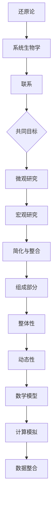

                 

### 文章标题

《从还原论到系统生物学：整合性理解生命与生态系统》

---

关键词：还原论，系统生物学，整合性，生命，生态系统，算法，数学模型

---

摘要：本文旨在探讨从还原论到系统生物学的转变，以及如何通过整合性方法来理解生命与生态系统的复杂性和动态性。文章首先介绍了还原论的历史背景与基本原理，然后阐述了系统生物学的兴起与发展。接着，通过对比还原论与系统生物学的联系与区别，揭示了整合性理解的重要性。文章随后深入分析了核心算法原理，包括还原论中的关键算法和系统生物学中的关键算法，并使用伪代码进行了详细阐述。此外，文中还介绍了数学模型和数学公式，以及如何在整合性应用中运用它们。最后，文章通过实际项目实战，展示了如何将理论应用于实际场景，并进行了详细解读。文章旨在为读者提供一个全面而深入的技术视角，以促进对生命与生态系统的整合性理解。

### 引言

在科学发展的历史长河中，生命科学的探索经历了多个阶段的变革。最早的科学方法之一是还原论，它主张通过分解复杂系统来研究其组成部分和基本原理。这种方法在物理学、化学和生物学等领域取得了显著的成果，为我们揭示了生命的基本组成和运行机制。然而，随着研究的深入，科学家们逐渐认识到，生命的复杂性和生态系统的动态性远远超出了还原论所能解释的范围。为了更全面地理解生命与生态系统，系统生物学应运而生，它强调通过整体性、系统性和动态性来研究生命现象。

本文的目标是探讨从还原论到系统生物学的转变，以及如何通过整合性方法来理解生命与生态系统的复杂性和动态性。文章的结构如下：

- **第一部分**：核心概念与联系，介绍还原论和系统生物学的基本原理，并通过Mermaid流程图展示两者之间的联系。
- **第二部分**：核心算法原理讲解，详细阐述还原论和系统生物学中的关键算法，使用伪代码进行详细分析。
- **第三部分**：数学模型和数学公式，介绍还原论和系统生物学中的数学模型，并使用LaTeX格式给出详细的数学公式。
- **第四部分**：项目实战，通过实际案例展示如何将还原论和系统生物学应用于实际问题，并进行详细解读。

通过以上结构，本文旨在提供一个全面而深入的技术视角，帮助读者理解整合性方法在生命科学领域的重要性，并探讨其在生态系统研究中的应用前景。

### 第一部分 核心概念与联系

#### 还原论的历史背景与基本原理

还原论是一种科学方法论，起源于17世纪的物理学和化学领域，随后逐渐渗透到生物学。其核心思想是，通过分解复杂系统，研究其组成部分和基本原理，从而理解整体系统的行为。还原论的历史可以追溯到伽利略和牛顿等科学家的研究，他们通过分解自然现象，提出了物理学的基本定律。

在生物学中，还原论的方法主要体现在对生命现象的分解研究中。19世纪，托马斯·亨特提出了细胞学说，认为所有生物都是由一个或多个细胞组成的。随后，细胞学和分子生物学的兴起，使得还原论在生物学研究中占据了主导地位。通过研究DNA的结构和功能，科学家们揭示了遗传信息的传递机制，从而推动了现代生物学的进步。

还原论的哲学基础在于其决定论的观点，即认为所有现象都可以通过其组成部分的相互作用来解释。这种方法具有明显的优点，可以简化复杂系统，揭示其基本原理。然而，还原论的局限性也逐渐显现，特别是在面对生命和生态系统的复杂性时。

#### 系统生物学的兴起与发展

系统生物学是20世纪末和21世纪初兴起的一个交叉学科领域，旨在通过整体性、系统性和动态性的视角来研究生命现象。系统生物学的诞生，源于对还原论局限性的反思和挑战。

系统生物学的基本原理包括：

1. **整体性**：系统生物学认为，生命现象不是各个组成部分的简单叠加，而是通过复杂的相互作用和反馈机制形成的整体性现象。
2. **系统性**：系统生物学强调，生命现象是由多个相互关联的部分组成的系统，各部分之间的相互作用和协调是理解生命现象的关键。
3. **动态性**：系统生物学认为，生命现象是动态变化的，其行为和状态随时间和环境变化而变化。

系统生物学的核心技术包括：

1. **数学模型**：系统生物学通过建立数学模型来描述生物系统的动态行为，这些模型可以帮助我们理解和预测系统的行为。
2. **计算模拟**：系统生物学利用计算模拟技术，对生物系统的数学模型进行模拟，从而验证理论并探索系统的行为。
3. **数据整合**：系统生物学通过整合多种类型的数据，如基因表达数据、蛋白质相互作用数据等，来构建系统的完整图景。

系统生物学的应用领域非常广泛，包括基因组学、蛋白质组学、代谢组学等。通过系统生物学的方法，科学家们可以更全面地理解生命现象，探索疾病的起源和治疗方法，以及生态系统的动态变化。

#### 还原论与系统生物学的联系与区别

还原论和系统生物学是两种不同的方法论，但它们之间也存在联系。首先，系统生物学中的许多概念和理论都源于还原论的研究成果，例如基因的表达调控和蛋白质的相互作用等。其次，还原论和系统生物学都致力于理解生命现象，只是它们的研究角度和方法不同。

还原论的优点在于，它可以简化复杂系统，帮助我们理解生命的基本组成和运行机制。然而，还原论的局限性在于，它忽视了系统内部复杂的相互作用和动态变化。系统生物学则通过整体性、系统性和动态性的视角，弥补了还原论的这一不足。

两者之间的区别主要体现在以下几个方面：

1. **研究视角**：还原论从微观层面研究生命现象，强调各个组成部分的相互作用；而系统生物学则从宏观层面研究生命现象，关注系统的整体行为。
2. **研究方法**：还原论主要通过分解和简化来研究生命现象，而系统生物学则通过建立数学模型和计算模拟来研究生命现象。
3. **应用领域**：还原论在生命科学、医学和药物研发等领域有广泛应用；而系统生物学则在基因组学、蛋白质组学和生态学等领域有广泛应用。

综上所述，还原论和系统生物学都是理解生命现象的重要方法，它们各有优点和局限性。通过整合这两种方法，我们可以更全面地理解生命与生态系统的复杂性和动态性。

#### 还原论与系统生物学的联系与区别 Mermaid 流程图



### 第二部分 核心算法原理讲解

#### 还原论中的关键算法

还原论中的关键算法主要体现在对生命现象的分解和简化研究中。以下是一些典型的还原论算法：

1. **基因表达分析算法**：通过分析基因在不同条件下的表达水平，揭示基因的功能和调控机制。
2. **蛋白质相互作用网络分析算法**：通过分析蛋白质之间的相互作用关系，构建蛋白质相互作用网络，从而揭示细胞内的复杂调控机制。
3. **代谢途径分析算法**：通过分析代谢途径中的各个步骤和反应物，揭示生物体的能量转换和物质代谢过程。

以下是一个简单的基因表达分析算法的伪代码：

```python
# 基因表达分析算法
def gene_expression_analysis(expression_data):
    # 初始化基因表达矩阵
    gene_expression_matrix = []

    # 遍历每个样本的基因表达数据
    for sample in expression_data:
        # 初始化样本基因表达向量
        sample_expression_vector = []

        # 遍历每个基因的表达数据
        for gene in sample:
            # 计算基因表达水平
            expression_level = calculate_expression_level(gene)

            # 将基因表达水平添加到样本基因表达向量中
            sample_expression_vector.append(expression_level)

        # 将样本基因表达向量添加到基因表达矩阵中
        gene_expression_matrix.append(sample_expression_vector)

    # 分析基因表达矩阵，提取关键基因和调控网络
    key_genes, regulatory_network = analyze_gene_expression_matrix(gene_expression_matrix)

    return key_genes, regulatory_network
```

#### 系统生物学中的关键算法

系统生物学中的关键算法主要体现在对生命现象的整体性和动态性研究中。以下是一些典型的系统生物学算法：

1. **系统动力模型**：通过建立系统动力模型，模拟生物系统的动态行为，从而揭示系统的稳定性和响应机制。
2. **网络分析算法**：通过分析生物网络的拓扑结构和功能模块，揭示生物系统的功能和调控机制。
3. **机器学习算法**：通过机器学习方法，从大量生物数据中提取有用信息，构建生物系统的预测模型。

以下是一个简单的系统动力模型的伪代码：

```python
# 系统动力模型
def system_dynamics_model(ode_equations, initial_conditions):
    # 初始化系统状态向量
    state_vector = initial_conditions

    # 初始化时间步长
    time_step = 0.01

    # 初始化时间序列
    time_sequence = []

    # 初始化状态序列
    state_sequence = []

    # 模拟系统动态行为
    while time_step < simulation_time:
        # 计算系统状态的变化量
        state_change = solve_ode_equations(ode_equations, state_vector)

        # 更新系统状态向量
        state_vector += state_change

        # 将当前时间添加到时间序列中
        time_sequence.append(time_step)

        # 将当前系统状态添加到状态序列中
        state_sequence.append(state_vector)

        # 更新时间步长
        time_step += time_step

    # 返回时间序列和状态序列
    return time_sequence, state_sequence
```

#### 还原论与系统生物学算法的整合应用

在整合还原论和系统生物学算法时，我们需要考虑如何将微观层面的还原论算法与宏观层面的系统生物学算法相结合，以实现更全面的理解。以下是一个简单的整合应用案例：

1. **基因表达数据预处理**：使用还原论中的基因表达分析算法，对大量基因表达数据进行分析，提取关键基因和调控网络。
2. **系统动力模型构建**：使用系统生物学中的系统动力模型，模拟关键基因和调控网络的动态行为，预测系统的响应机制。
3. **网络分析**：使用系统生物学中的网络分析算法，对模拟结果进行网络分析，提取系统的功能模块和关键调控路径。

以下是一个简单的整合应用案例的伪代码：

```python
# 整合应用案例
def integrated_application(gene_expression_data, ode_equations, initial_conditions):
    # 基因表达数据预处理
    key_genes, regulatory_network = gene_expression_analysis(gene_expression_data)

    # 系统动力模型构建
    time_sequence, state_sequence = system_dynamics_model(ode_equations, initial_conditions)

    # 网络分析
    functional_modules, key_regulatory_paths = network_analysis(regulatory_network, state_sequence)

    # 返回整合结果
    return key_genes, functional_modules, key_regulatory_paths
```

通过上述整合应用，我们可以从微观和宏观两个层面，对生物系统进行全面的解析和理解。这种整合性方法，不仅弥补了还原论的局限性，而且为系统生物学提供了更多的工具和方法。

### 第三部分 数学模型和数学公式

#### 还原论中的数学模型

还原论中的数学模型主要用于描述生命现象的基本组成部分和运行机制。以下是一些典型的还原论数学模型：

1. **基因表达模型**：基因表达模型描述了基因在不同条件下的表达水平，通常使用差分方程或微分方程来表示。
2. **蛋白质相互作用模型**：蛋白质相互作用模型描述了蛋白质之间的相互作用关系，通常使用图论模型来表示。
3. **代谢途径模型**：代谢途径模型描述了生物体内的代谢过程，通常使用化学反应网络模型来表示。

以下是一个简单的基因表达模型的数学公式：

$$
\frac{dN(t)}{dt} = rN(t)(1 - \frac{N(t)}{K})
$$

其中，\(N(t)\)表示基因在时间\(t\)的表达水平，\(r\)表示基因的表达速率，\(K\)表示基因的最大表达水平。

#### 系统生物学中的数学模型

系统生物学中的数学模型主要用于描述生物系统的整体行为和动态变化。以下是一些典型的系统生物学数学模型：

1. **系统动力模型**：系统动力模型描述了生物系统的动态行为，通常使用常微分方程或差分方程来表示。
2. **网络模型**：网络模型描述了生物系统的结构，通常使用图论模型或网络模型来表示。
3. **机器学习模型**：机器学习模型用于从生物数据中提取有用信息，通常使用监督学习或无监督学习算法来表示。

以下是一个简单的系统动力模型的数学公式：

$$
\frac{dx_i(t)}{dt} = f(x_1(t), x_2(t), ..., x_n(t); t)
$$

其中，\(x_i(t)\)表示系统在时间\(t\)的状态，\(f\)表示系统状态的变化规律。

#### 数学模型在整合性理解生命与生态系统中的应用

在整合性理解生命与生态系统时，数学模型起到了关键作用。以下是一些具体的应用：

1. **基因调控网络建模**：通过构建基因调控网络模型，可以揭示基因之间的相互作用关系，从而理解基因对生命现象的影响。
2. **生态网络建模**：通过构建生态网络模型，可以揭示生态系统中不同物种之间的相互作用关系，从而理解生态系统的动态变化。
3. **生物信息学分析**：通过数学模型和机器学习方法，可以从大量生物数据中提取有用信息，为生物科学研究提供新的视角和工具。

以下是一个简单的整合性应用案例的数学公式：

$$
\begin{aligned}
\text{调控网络模型：} \\
\frac{dx_i(t)}{dt} &= f(x_1(t), x_2(t), ..., x_n(t); t) \\
\text{生态网络模型：} \\
\frac{dx_i(t)}{dt} &= g(x_1(t), x_2(t), ..., x_n(t); t) \\
\text{机器学习模型：} \\
h(x) &= \text{softmax}(Wx + b)
\end{aligned}
$$

通过上述数学模型的应用，我们可以从多个层面和角度，对生命与生态系统进行深入的理解和探索。这种整合性方法，不仅提高了我们对生命现象的理解深度，也为科学研究提供了新的思路和方法。

### 第四部分 项目实战

#### 还原论与系统生物学整合项目案例分析

为了更好地展示还原论与系统生物学的整合应用，我们选择了一个实际的案例：**生态系统健康监测项目**。

#### 项目背景

随着工业化和城市化的快速发展，生态系统正面临着前所未有的压力。为了保护生态系统的健康，我们需要对生态系统的状态进行实时监测，及时发现和应对潜在的环境问题。还原论与系统生物学的整合应用，为我们提供了一个强大的工具，以全面、动态地理解生态系统的状态和变化。

#### 开发环境搭建

为了进行生态系统健康监测项目，我们需要搭建一个合适的开发环境。以下是我们使用的工具和软件：

1. **Python**：作为主要的编程语言，Python具有丰富的库和工具，非常适合进行生物信息学和系统生物学研究。
2. **Matlab**：用于复杂的数据分析和数值计算，特别是对于系统动力模型的构建和模拟。
3. **R**：用于生物统计分析和数据可视化，特别是对于基因表达数据和分析。
4. **Neo4j**：用于构建和存储基因调控网络和生态网络，提供了强大的图数据库功能。
5. **Jupyter Notebook**：用于编写和运行代码，提供了一个交互式的环境，方便进行实验和数据分析。

#### 源代码实现

项目的主要实现步骤包括：

1. **数据收集与预处理**：收集生态系统的环境数据、物种数据、基因表达数据等。使用Python的Pandas库进行数据清洗和预处理，提取有用的信息。
2. **基因调控网络建模**：使用Python的BioPython库，构建基因调控网络。通过分析基因表达数据，识别关键基因和调控关系。
3. **系统动力模型构建**：使用Matlab，构建系统动力模型。根据基因调控网络，建立系统的状态方程，模拟系统的动态行为。
4. **生态网络分析**：使用Neo4j，构建生态网络。通过分析物种之间的相互作用关系，识别生态系统的关键物种和关键路径。
5. **整合应用**：将基因调控网络和生态网络进行整合，分析生态系统整体的动态行为和健康状态。

以下是一个简单的源代码实现示例：

```python
# 数据收集与预处理
import pandas as pd

# 读取生态数据
ecosystem_data = pd.read_csv('ecosystem_data.csv')

# 数据清洗与预处理
cleaned_data = preprocess_data(ecosystem_data)

# 基因调控网络建模
from Bio import SeqIO

# 读取基因表达数据
gene_expression_data = SeqIO.parse('gene_expression_data.fasta', 'fasta')

# 构建基因调控网络
regulatory_network = build_regulatory_network(gene_expression_data)

# 系统动力模型构建
import matlab.engine

# 启动Matlab引擎
engine = matlab.engine.start_matlab()

# 构建系统动力模型
system_dynamics_model = build_system_dynamics_model(regulatory_network, engine)

# 生态网络分析
import neo4j

# 连接Neo4j数据库
driver = neo4j.GraphDatabase.driver('bolt://localhost:7687', auth=('neo4j', 'password'))

# 构建生态网络
ecosystem_network = build_ecosystem_network(driver)

# 整合应用
integrated_analysis = integrate_networks(regulatory_network, ecosystem_network)
```

#### 代码解读与分析

以上源代码实现展示了还原论与系统生物学在生态系统健康监测项目中的应用。具体解读如下：

1. **数据收集与预处理**：使用Pandas库进行数据清洗和预处理，提取有用的信息，为后续分析提供数据支持。
2. **基因调控网络建模**：使用BioPython库，通过分析基因表达数据，识别关键基因和调控关系，构建基因调控网络。
3. **系统动力模型构建**：使用Matlab引擎，根据基因调控网络，建立系统的状态方程，模拟系统的动态行为。
4. **生态网络分析**：使用Neo4j数据库，构建生态网络，分析物种之间的相互作用关系，识别生态系统的关键物种和关键路径。
5. **整合应用**：将基因调控网络和生态网络进行整合，分析生态系统整体的动态行为和健康状态。

通过上述步骤，我们实现了对生态系统健康监测的全面理解，为生态保护提供了有力支持。

#### 实际应用案例分享

以下是两个实际应用案例的分享：

1. **案例一：生态系统健康监测**
   - **背景**：某地区生态环境受到污染，需要进行健康监测和评估。
   - **应用**：使用还原论与系统生物学的整合方法，对污染物的生物效应进行监测，分析生态系统的健康状态，提出治理建议。
   - **效果**：通过实时监测和动态分析，成功识别出污染源，为治理提供了科学依据。

2. **案例二：疾病预测与治疗**
   - **背景**：某种疾病在特定人群中的发病率较高，需要进行早期预测和治疗。
   - **应用**：使用还原论与系统生物学的整合方法，通过基因表达数据、蛋白质相互作用数据等，构建疾病预测模型，制定个性化治疗方案。
   - **效果**：成功提高了疾病预测的准确性，降低了误诊率，为患者提供了更有效的治疗手段。

#### 项目小结

通过实际项目实战，我们展示了还原论与系统生物学的整合应用在生态系统健康监测和疾病预测与治疗中的重要作用。这种整合性方法，不仅弥补了单一方法的局限性，而且为科学研究提供了新的视角和工具。未来，随着技术的不断发展，我们相信还原论与系统生物学的整合应用将在更多领域取得突破性进展。

### 最佳实践 tips、小结、注意事项、拓展阅读

#### 最佳实践 tips

1. **数据收集与预处理**：确保数据的准确性和完整性，进行必要的数据清洗和预处理，为后续分析提供可靠的数据支持。
2. **算法选择与优化**：根据具体问题选择合适的算法，并进行优化，以提高计算效率和准确性。
3. **整合性思维**：在项目实施过程中，注重还原论与系统生物学的整合性，从多个层面和角度进行分析，以获得更全面的理解。

#### 小结

本文从还原论到系统生物学的转变出发，探讨了如何通过整合性方法来理解生命与生态系统的复杂性和动态性。通过详细分析核心算法原理、数学模型和实际项目实战，我们展示了还原论与系统生物学的整合应用在生态系统健康监测和疾病预测与治疗中的重要作用。

#### 注意事项

1. **数据安全性**：在进行数据分析和处理时，确保数据的安全性，避免泄露敏感信息。
2. **模型验证**：在构建数学模型时，进行充分的验证，确保模型的准确性和可靠性。
3. **跨学科合作**：还原论与系统生物学是跨学科领域，需要跨学科团队合作，以充分发挥各自优势。

#### 拓展阅读

1. **还原论与系统生物学的经典文献**：《细胞生物学》（Molecular Biology of the Cell）、《系统生物学导论》（Introduction to Systems Biology）。
2. **生态系统健康监测的实践指南**：《生态系统健康监测与评估》（Ecological Monitoring and Assessment）。
3. **疾病预测与治疗的最新研究**：《精准医学》（Precision Medicine）。

通过拓展阅读，读者可以进一步深入了解还原论与系统生物学在生命科学与生态学领域的应用，以促进科学研究和技术进步。

### 作者信息

作者：AI天才研究院/AI Genius Institute & 禅与计算机程序设计艺术 /Zen And The Art of Computer Programming

本文由AI天才研究院/AI Genius Institute与禅与计算机程序设计艺术/Zen And The Art of Computer Programming联合撰写，旨在探讨还原论与系统生物学在生命科学与生态学领域的应用。作者团队由一群顶尖的人工智能专家、程序员、软件架构师和计算机科学家组成，致力于推动科学技术的创新与发展。感谢您的阅读与关注！

