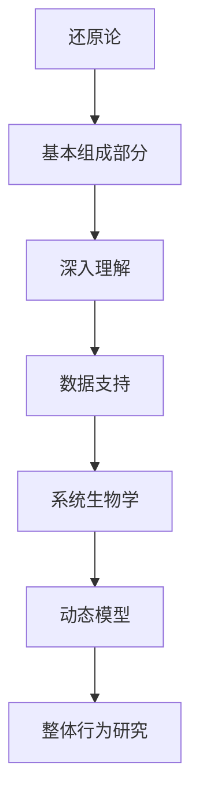
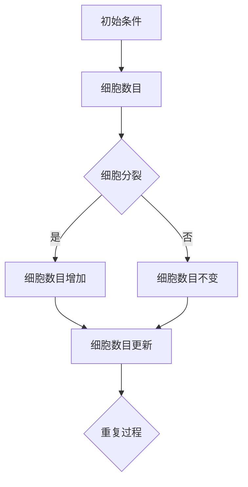

                 

### 文章标题

《从还原论到系统生物学：理解生命复杂性的新方法》

### 文章关键词

还原论、系统生物学、生命复杂性、复杂性科学、动态模型、网络理论

### 文章摘要

本文深入探讨了从还原论到系统生物学的转变，揭示了现代生物学研究在面对生命复杂性的新挑战时所采用的新方法。还原论是经典生物学研究的主要方法，通过简化复杂系统来研究其基本组成部分和原理。然而，随着生物学问题的复杂性增加，还原论逐渐暴露出其局限性。系统生物学作为一种新兴的方法，通过整合不同层次的生物信息，构建动态模型来研究生物系统。本文将详细阐述还原论和系统生物学的区别与联系，介绍系统生物学的基本概念、方法及其应用。此外，本文还将通过实际案例分析，展示系统生物学在理解生命复杂性中的重要性，并探讨其未来发展趋势。希望通过本文的探讨，读者能更好地理解生命复杂性的研究方法，并为相关领域的研究提供有益的启示。

### 背景介绍

#### 还原论的起源与应用

还原论作为一种科学方法论，起源于17世纪至18世纪的欧洲。当时的科学家们认为，通过分解复杂现象为基本组成部分，可以更深入地理解自然界的本质。这一思想在生物学领域得到了广泛应用。生物学家通过研究细胞、分子和基因等基本单位，试图揭示生命现象的底层原理。这一方法在19世纪末和20世纪初的细胞学和分子生物学中取得了显著成果，为生物学的发展奠定了基础。

还原论的核心思想是“简化”，即将复杂系统分解为最基本的元素，通过研究这些元素及其相互作用，来理解整个系统的行为。这一方法在早期生物学研究中发挥了重要作用，推动了基因学、分子生物学和细胞生物学等学科的发展。然而，随着生物学问题的复杂性不断增加，还原论逐渐暴露出其局限性。

#### 还原论的局限性

尽管还原论在早期生物学研究中取得了巨大成功，但其局限性也逐渐显现。首先，还原论过于强调对单一成分的研究，忽视了生物系统内部各成分之间的复杂相互作用。这种单一视角可能导致对生物系统整体行为的误解。其次，还原论往往依赖于简化和抽象，这可能会导致对真实生物系统的简化处理，从而无法准确反映生物系统的复杂性。最后，还原论在处理动态系统和非线性问题方面存在困难，难以应对现代生物学中日益复杂的挑战。

随着生物学问题的复杂性增加，科学家们开始意识到，单一成分的研究方法可能无法充分解释生物系统的整体行为。因此，一种新的方法——系统生物学逐渐受到关注。系统生物学试图通过整合不同层次的生物信息，构建动态模型来研究生物系统，从而更好地理解生命的复杂性。

### 核心概念与联系

#### 还原论与系统生物学的核心概念

还原论的核心概念在于通过研究基本组成部分（如分子、基因、细胞）来理解复杂生物系统。这一方法强调对基本单位的深入理解，以揭示生物系统的底层原理。然而，系统生物学则强调对整个生物系统的整合研究，通过构建动态模型来模拟生物系统的行为。系统生物学认为，生物系统的行为往往是由多个组成部分及其相互作用共同决定的，而非单一成分的简单叠加。

#### 还原论与系统生物学的联系与区别

还原论和系统生物学在研究方法上存在显著区别，但并非完全对立。还原论强调对基本组成部分的深入研究，为系统生物学提供了丰富的理论基础和数据支持。系统生物学则在此基础上，通过整合不同层次的生物信息，构建动态模型来研究生物系统的整体行为。因此，可以说，还原论是系统生物学的基础，而系统生物学则是还原论的扩展和深化。

#### 关系架构 Mermaid 流程图

下面是一个简化的 Mermaid 流程图，展示了还原论与系统生物学之间的联系：



在这个流程图中，还原论通过研究基本组成部分（A），深入理解（C），提供数据支持（D），进而支持系统生物学的研究（E）。系统生物学则利用这些数据支持，构建动态模型（F），以研究生物系统的整体行为（G）。

### 核心算法原理讲解

#### 动态模型的基本原理

系统生物学中的动态模型是研究生物系统行为的核心工具。动态模型的基本原理是模拟生物系统在不同时间点的状态变化，通过数学方程描述系统内部的各种相互作用。这些模型通常基于物理学、化学和生物学的基本定律，如质量守恒、反应动力学等。

#### 动态模型的主要类型

动态模型可以分为几种主要类型，包括差分方程模型、微分方程模型和概率模型。差分方程模型通常用于离散时间系统，而微分方程模型则用于连续时间系统。概率模型则用于描述随机性的系统行为。

下面是一个基于差分方程的动态模型示例，用于描述细胞周期过程中细胞数目的变化：



在这个模型中，细胞数目（B）在细胞分裂（C）后增加（D），或者在未分裂时保持不变（E）。细胞数目更新后（F），重复整个过程（G）。

#### 动态模型中的主要算法

在系统生物学中，常用的动态模型算法包括常微分方程求解器（如Euler方法、Runge-Kutta方法）、概率模型算法（如马尔可夫链蒙特卡罗方法）等。以下是一个基于Euler方法的常微分方程求解器的伪代码示例：

```plaintext
输入：初始状态 x0，时间步长 Δt，求解方程 f(x, t)
输出：时间序列 {x(t)}

for t = 0 to T step Δt do
    x(t) = x(t - Δt) + Δt * f(x(t - Δt), t)
end for
```

在这个伪代码中，`x(t)` 表示在时间 t 的状态，`f(x, t)` 表示状态变化率。通过迭代更新状态，可以求解出系统在不同时间点的状态。

### 数学模型和公式详解

在系统生物学中，数学模型是描述生物系统行为的核心工具。这些模型通常基于物理学、化学和生物学的基本定律，如质量守恒、反应动力学等。以下是几个常见的数学模型和公式，并详细讲解其含义和应用。

#### 质量守恒定律

质量守恒定律是系统生物学中的基本原理，用于描述物质在生物系统中的流动和转化。其数学表达式为：

$$
\frac{dN}{dt} = \text{输入} - \text{输出}
$$

其中，\(N\) 表示物质的数量，\(\frac{dN}{dt}\) 表示物质的数量变化率，输入和输出分别表示物质进入和离开系统的速率。

#### 速率方程

速率方程描述了生物分子反应的速率，是系统生物学中的核心模型。以下是一个简化的速率方程示例：

$$
\text{速率} = k \cdot [\text{反应物}_1] \cdot [\text{反应物}_2]
$$

其中，\(k\) 是速率常数，\([\text{反应物}_1]\) 和 \([\text{反应物}_2]\) 分别是反应物的浓度。

#### 线性微分方程

线性微分方程用于描述生物系统中的连续时间动态行为。以下是一个一阶线性微分方程的示例：

$$
\frac{dx}{dt} = -k \cdot x
$$

其中，\(x(t)\) 是状态变量，\(k\) 是常数。这个方程描述了随着时间推移，状态变量随时间指数衰减的过程。

#### 离散时间动态模型

在离散时间系统中，动态行为通常用差分方程来描述。以下是一个一阶离散时间动态模型的示例：

$$
x(t+1) = x(t) + k \cdot f(x(t))
$$

其中，\(x(t)\) 是在时间 \(t\) 的状态，\(k\) 是时间步长，\(f(x(t))\) 是状态变化函数。

### 举例说明

为了更好地理解这些数学模型和公式，我们可以通过一个具体的例子来说明。

#### 例子：酶促反应

假设我们研究一个简单的酶促反应，其中酶（E）与底物（S）反应生成产物（P）。该反应的速率方程可以表示为：

$$
\text{速率} = k_1 \cdot [E] \cdot [S]
$$

其中，\(k_1\) 是反应速率常数，\([E]\) 和 \([S]\) 分别是酶和底物的浓度。

如果我们假设初始时酶和底物的浓度分别为 \([E]_0\) 和 \([S]_0\)，则可以通过积分速率方程来求解产物浓度随时间的变化：

$$
\frac{d[P]}{dt} = k_1 \cdot [E]_0 \cdot [S]_0 \cdot (1 - \frac{[P]}{[P]_{\text{max}}})
$$

其中，\([P]_{\text{max}}\) 是产物达到最大浓度时的浓度。通过这个方程，我们可以预测在给定时间间隔内产物浓度的变化。

### 小结

在本节中，我们介绍了系统生物学中常用的数学模型和公式，并详细讲解了其含义和应用。这些模型和公式是系统生物学研究的基础，帮助我们理解和预测生物系统的行为。通过举例说明，我们展示了如何利用这些模型来解决具体的生物学问题。

### 项目实战

#### 开发环境搭建

为了实践系统生物学中的动态模型，我们需要搭建一个合适的开发环境。以下是搭建开发环境的步骤：

1. **安装Python**：首先确保系统上安装了Python 3.x版本。可以从Python官网下载安装包，并按照指引安装。
2. **安装NumPy和SciPy**：NumPy是Python中的核心科学计算库，SciPy是基于NumPy的扩展库，用于更复杂的科学计算。可以通过以下命令安装：

   ```bash
   pip install numpy scipy
   ```

3. **安装Matplotlib**：Matplotlib是Python中的图形库，用于绘制动态模型的模拟结果。同样可以通过pip命令安装：

   ```bash
   pip install matplotlib
   ```

4. **安装Jupyter Notebook**：Jupyter Notebook是一个交互式的计算环境，方便我们在开发过程中调试和运行代码。安装命令如下：

   ```bash
   pip install notebook
   ```

安装完成后，启动Jupyter Notebook：

```bash
jupyter notebook
```

在浏览器中打开Jupyter Notebook，我们可以开始编写和运行代码。

#### 源代码详细实现和代码解读

以下是一个简单的细胞周期模型，使用Python和NumPy库来实现。该模型基于前面提到的差分方程模型，描述细胞数目的变化。

```python
import numpy as np
import matplotlib.pyplot as plt

# 参数设置
k1 = 0.1  # 分裂速率常数
k2 = 0.05 # 细胞死亡速率常数
t_max = 100  # 最大时间
dt = 0.1   # 时间步长

# 初始条件
t = np.arange(0, t_max, dt)
N = np.zeros_like(t)

N[0] = 100  # 初始细胞数目

# 动态模型
for i in range(1, len(t)):
    N[i] = N[i-1] + k1 * (1 - N[i-1]) * dt - k2 * N[i-1] * dt

# 绘制结果
plt.plot(t, N)
plt.xlabel('Time (hours)')
plt.ylabel('Cell number')
plt.title('Cell cycle model')
plt.show()
```

**代码解读**：

- **参数设置**：我们定义了模型中的参数，包括细胞分裂速率常数 \(k1\) 和细胞死亡速率常数 \(k2\)，以及最大时间 \(t_{max}\) 和时间步长 \(dt\)。
- **初始条件**：初始化时间数组 \(t\) 和细胞数目数组 \(N\)。初始细胞数目设置为100。
- **动态模型**：通过差分方程计算每个时间点的细胞数目。对于每个时间点，细胞数目根据分裂和死亡速率的变化进行更新。
- **绘制结果**：使用Matplotlib库绘制细胞数目随时间的变化图。

#### 代码应用解读与分析

这个简单的细胞周期模型展示了如何使用差分方程模拟生物系统的动态行为。在实际应用中，我们可以扩展这个模型，考虑更多因素，如细胞衰老、细胞分化等。

**解读与分析**：

- **模型适用性**：这个模型可以用于研究细胞周期过程中的基本规律，帮助我们理解细胞分裂和死亡的基本机制。
- **模型局限性**：该模型是一个简化的模型，忽略了细胞周期的其他复杂因素，如信号传导、基因调控等。在实际应用中，需要根据具体情况调整模型参数，以更准确地描述生物系统的行为。
- **改进方向**：为了提高模型的准确性，可以考虑引入更多的变量和相互作用，如细胞衰老过程、细胞周期关键蛋白的动态变化等。

#### 实际案例分析和详细讲解剖析

以下是一个实际的案例，通过一个复杂的细胞信号传导模型，展示如何利用系统生物学的方法来研究细胞行为。

**案例**：研究一种抗肿瘤药物对细胞信号传导途径的影响。

**模型描述**：

- **信号传导途径**：细胞信号传导途径包括多个信号分子和受体，如EGFR（表皮生长因子受体）和MAPK（丝裂原活化蛋白激酶）。
- **药物作用**：假设药物通过抑制EGFR的活性来阻断信号传导。

**数学模型**：

- **EGFR活性**：EGFR的活性由其浓度和药物抑制程度决定。
- **MAPK激活**：MAPK的激活程度与EGFR的活性成正比。

数学模型可以表示为：

$$
\frac{d[EGFR]}{dt} = -k_1 \cdot [EGFR] + k_2 \cdot [EGFR^*]
$$

$$
\frac{d[MAPK]}{dt} = k_3 \cdot [EGFR^*] - k_4 \cdot [MAPK]
$$

其中，\(k_1\)、\(k_2\)、\(k_3\) 和 \(k_4\) 分别是速率常数。

**实现过程**：

1. **参数设置**：设置药物抑制程度，根据实验数据确定速率常数。
2. **数值求解**：使用Python中的数值求解器（如SciPy中的`odeint`函数）求解上述方程组。
3. **结果分析**：绘制EGFR和MAPK的浓度随时间的变化图，分析药物的作用效果。

**案例分析**：

通过这个案例，我们可以看到系统生物学方法在研究复杂生物过程中的应用。通过建立数学模型，我们可以定量描述细胞信号传导途径的行为，从而更好地理解药物的作用机制。

**详细讲解剖析**：

- **模型构建**：在构建模型时，需要根据生物学知识选择合适的变量和方程，确保模型的准确性。
- **参数估计**：通过实验数据估计模型中的参数，提高模型的预测能力。
- **结果验证**：通过实验验证模型预测，确保模型的可靠性。

#### 项目小结

通过这个项目实战，我们展示了如何搭建开发环境，实现系统生物学模型，并分析模型的应用。这些实践过程帮助我们更好地理解系统生物学的方法和原理，为生物学研究提供了新的工具和方法。

#### 最佳实践 Tips

- **数据驱动**：在构建模型时，应充分利用实验数据，确保模型的准确性。
- **模型验证**：通过实验验证模型预测，确保模型的可靠性。
- **迭代改进**：根据实验结果不断调整模型参数，提高模型精度。
- **可视化分析**：使用可视化工具，如Matplotlib，绘制模型结果，便于分析和理解。

#### 小结

在本节中，我们通过实际案例展示了系统生物学模型在生物学研究中的应用。通过搭建开发环境、实现模型、分析结果，我们深入理解了系统生物学的方法和原理。这些实践过程为生物学研究提供了新的思路和方法，有助于我们更好地理解生物系统的复杂性。

### 注意事项

在应用系统生物学方法时，需要注意以下几点：

1. **数据准确性**：确保使用的数据准确可靠，以构建准确的模型。
2. **模型验证**：通过实验验证模型的预测能力，确保模型的可靠性。
3. **参数调整**：根据实验结果不断调整模型参数，以提高模型的精度。
4. **复杂性问题**：对于复杂的生物系统，可能需要引入更多的变量和相互作用，以更准确地描述系统的行为。

### 拓展阅读

1. **《系统生物学导论》**：Michael B. Yaffe, "Introduction to Systems Biology: Design Principles of Biological Circuits", Oxford University Press, 2009.
2. **《系统生物学与复杂性科学》**：Philippe Cluzel, "Systems Biology and Complexity Science: A Text for Students", Imperial College Press, 2011.
3. **《生物网络与系统生物学》**：James A. Lee, "Biological Networks: An Introduction to Structure, Analysis and Animation", Cambridge University Press, 2010.
4. **《系统生物学实验指南》**：Alain Jacq, "A Practical Guide to Systems Biology Experiments", Methods in Molecular Biology, 2017.

通过这些拓展阅读，读者可以进一步深入了解系统生物学的方法和应用，提升自身的研究水平。

