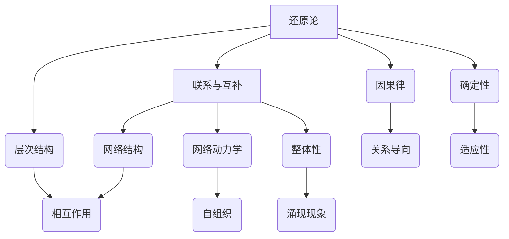

                 


### 摘要

本文旨在探讨从还原论到网络科学的转变，以及关系导向的世界如何改变了我们对复杂系统的理解。通过详细分析还原论的局限性，我们引入了网络科学的核心概念和其与还原论的区别。文章将一步步解释网络科学的数学模型和计算方法，并通过多个实际案例研究其在社会科学、生物学和经济学中的应用。最后，我们探讨了网络科学的未来发展趋势、教育与普及，以及如何适应关系导向的世界，提供了丰富的资源和工具，以引导读者深入理解这一变革性领域。

### 引言与核心概念

在科学发展的历程中，人们一直在寻求理解复杂系统的最佳方法。还原论（Reductionism）作为20世纪的主流思想，曾主导了科学研究的方向。然而，随着复杂性科学（Complexity Science）的兴起，还原论的局限性逐渐显现。此时，网络科学（Network Science）作为一种新兴的科学方法，开始受到广泛关注。本文将详细探讨这两者之间的区别和联系，以及关系导向的世界如何改变了我们对复杂系统的理解。

#### 还原论的局限性

还原论是一种将复杂系统分解为简单部分，通过研究这些简单部分来理解整体系统的科学方法。这种方法在20世纪取得了显著成果，如量子力学、相对论、分子生物学等。然而，随着研究的深入，还原论逐渐暴露出其局限性：

1. **宏观现象无法从微观部分推导**：虽然许多基本科学原理可以通过还原论来解释，但对于某些宏观现象，如气候系统、经济系统，我们无法仅通过研究微观粒子或个体行为来推导出整体行为。

2. **忽略了系统内部的关系和相互作用**：还原论侧重于研究系统的各个组成部分，但忽略了这些部分之间的相互作用和关系。这种忽略在处理复杂、动态系统时可能导致错误的结果。

3. **复杂系统中的自组织和涌现现象**：还原论难以解释复杂系统中的自组织和涌现现象，如生物进化、社会变革等。这些现象需要考虑系统内部的整体结构和关系。

#### 关系导向的科学方法

为了克服还原论的局限性，关系导向的科学方法（Relational Science Methodology）应运而生。这种方法强调研究系统内部的关系和相互作用，而不是仅仅关注各个组成部分。网络科学（Network Science）作为关系导向的科学方法的典型代表，通过研究网络结构和网络动力学，提供了新的视角来理解复杂系统。

#### 网络科学的兴起

网络科学起源于20世纪末，最初用于研究社会网络和通信网络。随着互联网的兴起和大数据技术的发展，网络科学的应用领域迅速扩展，涵盖了生物网络、经济网络、交通网络等。网络科学的核心概念包括：

1. **网络结构**：描述网络中节点和边的连接方式。常见的网络结构包括小世界网络和无标度网络。

2. **网络动力学**：研究网络中的节点和边如何随时间变化，包括传染过程、流量分布等。

3. **网络属性**：描述网络的性质，如连通性、集聚性、聚集系数等。

4. **网络模型**：用于模拟和预测网络行为的数学模型，如随机图模型、网络生成模型等。

#### 关系导向的世界对我们的启示

关系导向的世界（Relational World）为我们理解复杂系统提供了新的视角。这种视角强调了系统内部的关系和相互作用，使得我们能够更好地理解复杂系统的行为和演化。以下是一些启示：

1. **整体性思维**：关系导向的世界鼓励我们将复杂系统看作一个整体，关注系统内部的关系和相互作用，而不仅仅是各个组成部分。

2. **适应性研究**：由于复杂系统中的关系和相互作用具有高度适应性，我们需要采用动态和灵活的研究方法来理解这些系统。

3. **跨学科整合**：关系导向的世界鼓励跨学科整合，通过结合不同领域的知识来理解复杂系统。

#### 书籍结构与主要内容概览

本文分为五个主要部分：

1. **引言与核心概念**：介绍了还原论的局限性、关系导向的科学方法以及网络科学的兴起。
2. **还原论与网络科学的比较**：详细分析了还原论与网络科学的核心概念、应用领域和区别。
3. **网络科学的案例研究**：通过实际案例研究，展示了网络科学在社会科学、生物学和经济学中的应用。
4. **网络科学的未来发展**：探讨了网络科学的未来趋势、教育与普及以及适应关系导向的世界。
5. **结论**：总结了关系导向的世界对我们的影响以及网络科学的未来发展。

本文旨在为读者提供一个全面理解关系导向的世界的视角，以及网络科学在实际应用中的广泛影响。通过逐步分析还原论与网络科学的区别和联系，本文希望读者能够更好地把握复杂系统的本质，为未来的科学研究和技术发展提供新的思路。

---

**关键词**：还原论、网络科学、关系导向、复杂系统、复杂性科学

---

**摘要**：

本文探讨了从还原论到网络科学的转变，揭示了关系导向的科学方法如何改变了我们对复杂系统的理解。首先，我们分析了还原论的局限性，引入了网络科学的核心概念。接着，我们比较了还原论与网络科学的方法和原理，通过实际案例展示了网络科学的广泛应用。最后，我们探讨了网络科学的未来趋势和教育普及，以及如何适应关系导向的世界。本文旨在为读者提供一个全面理解关系导向的世界的视角，以及网络科学在实际应用中的广泛影响。

---

接下来，我们将逐步深入探讨还原论与网络科学的比较，解释网络科学的数学模型和计算方法，并通过具体的例子来展示如何应用这些方法。在下一部分，我们将详细分析还原论的科学原理和其在科学史上的地位。

---

**目录**

1. 引言与核心概念
   1.1 还原论的局限性
   1.2 关系导向的科学方法
   1.3 网络科学的兴起
   1.4 关系导向的世界对我们的启示
   1.5 书籍结构与主要内容概览

2. 还原论与网络科学的比较
   2.1 还原论的科学原理
   2.2 网络科学的科学原理
   2.3 还原论与网络科学的异同
   2.4 从还原论到网络科学的转变
   2.5 关系导向的科学方法对现实世界的影响

3. 网络科学的案例研究
   3.1 网络科学在社会科学中的应用
   3.2 网络科学在生物学中的应用
   3.3 网络科学在经济学中的应用

4. 网络科学的未来发展
   4.1 网络科学的未来趋势
   4.2 网络科学与人工智能的结合
   4.3 网络科学在可持续发展中的应用
   4.4 网络科学的伦理问题与挑战

5. 网络科学的推广与普及
   5.1 网络科学的教育现状与挑战
   5.2 网络科学的教育资源与方法
   5.3 网络科学的普及与推广
   5.4 网络科学的未来教育趋势

6. 结论
   6.1 关系导向的世界与未来
   6.2 网络科学的未来发展
   6.3 我们应该如何适应关系导向的世界
   6.4 关系导向的世界对我们的启示

7. 附录
   7.1 网络科学的资源与工具
   7.2 网络科学的学习资源
   7.3 网络科学的研究热点与前沿
   7.4 网络科学的相关书籍与论文推荐

---

**目录**部分到此结束。在接下来的部分，我们将详细介绍还原论的科学原理，探讨其核心概念、历史背景和应用场景。这将为我们理解还原论与网络科学的区别打下坚实的基础。接下来，我们将进一步深入分析还原论的局限性，为引入网络科学做好铺垫。

---

## 第2章：还原论的科学原理

还原论（Reductionism）是一种科学方法论，主张通过将复杂系统分解为其基本组成部分，研究这些组成部分的行为，进而理解整个系统的行为。在科学史中，还原论占据了主导地位，并带来了许多重要的科学发现。然而，随着时间的推移，其局限性也逐渐显现。下面，我们将详细探讨还原论的核心概念、历史背景和应用场景。

### 还原论的核心概念

还原论的核心概念是“分解-分析-综合”，即通过将复杂系统分解为更小的、易于理解的组成部分，研究这些组成部分的性质和行为，然后综合这些信息来理解整体系统的行为。这种方法通常依赖于以下几个原则：

1. **层次结构**：还原论认为，复杂系统可以分解为不同的层次结构，每个层次都具有独特的性质和行为。通过从宏观层次逐步分解到微观层次，我们可以逐渐理解系统的复杂性。

2. **因果律**：还原论强调因果关系，认为系统的整体行为可以通过研究其组成部分之间的相互作用和因果关系来解释。

3. **确定性和可预测性**：还原论通常基于确定性的物理定律和数学模型，认为通过精确的测量和分析，可以预测系统的行为。

### 历史背景

还原论的思想可以追溯到古希腊哲学家亚里士多德，他在《形而上学》中提出，通过将复杂的事物分解为其最基本的组成元素，可以更好地理解其本质。然而，现代还原论的兴起主要源于20世纪初的物理学和生物学领域。

1. **物理学**：在20世纪初，量子力学和相对论的兴起使得科学家们开始通过研究微观粒子和基本力来理解宇宙。这种思想在物理学中得到了广泛应用，如原子理论、分子生物学等。

2. **生物学**：20世纪中叶，分子生物学的发展使得科学家们能够通过研究基因和蛋白质来理解生命现象。这种方法在生物学领域取得了巨大的成功，如DNA双螺旋结构的发现。

### 应用场景

还原论在多个科学领域都有广泛应用，主要包括：

1. **物理学**：在物理学中，还原论用于研究基本粒子和基本力，如量子力学和相对论。通过这些研究，我们能够理解宇宙的基本结构和行为。

2. **化学**：化学中的分子和原子理论也是还原论的应用。通过研究分子和原子的性质，我们可以理解化学反应和物质的性质。

3. **生物学**：在生物学中，还原论通过研究基因、蛋白质和细胞等基本组成单位，帮助我们理解生命现象和生物进化。

4. **计算机科学**：计算机科学中的许多领域，如算法设计、计算机架构等，也采用还原论的方法。通过将复杂问题分解为更简单的子问题，我们可以设计出有效的算法和系统。

### 局限性

尽管还原论在许多领域取得了成功，但它也暴露出了一些局限性：

1. **宏观现象的忽视**：还原论侧重于微观层次的研究，但忽略了宏观层次的整体行为。例如，气候系统的行为无法通过单独研究大气、海洋和生物圈中的微观过程来完全理解。

2. **关系的忽视**：还原论强调因果关系，但忽视了系统内部的关系和相互作用。在复杂系统中，这些关系和相互作用往往起着关键作用。

3. **自组织和涌现现象的困难**：还原论难以解释复杂系统中的自组织和涌现现象，如生物进化、社会变革等。这些现象需要考虑系统内部的整体结构和关系。

### 批判与反思

随着复杂性科学的发展，越来越多的科学家开始反思还原论的局限性。以下是一些主要的批判和反思：

1. **复杂性科学的兴起**：复杂性科学强调系统内部的关系和相互作用，提出了新的研究方法，如网络科学、复杂性理论和系统动力学。这些方法更适用于处理复杂系统。

2. **跨学科整合的需求**：还原论往往局限于单一学科，而复杂系统通常涉及多个学科。跨学科整合能够更好地理解复杂系统的行为。

3. **整体性思维的重要性**：复杂系统的行为往往不能简单地通过研究其组成部分来理解，需要采用整体性思维来把握系统的整体行为。

### 当代挑战

在当代科学中，还原论面临着以下几个挑战：

1. **大数据的挑战**：随着大数据技术的发展，我们需要处理和分析大量的数据。还原论难以应对这种复杂性，需要新的方法和工具。

2. **跨学科研究的挑战**：复杂系统通常涉及多个学科，需要跨学科的合作来理解和解决问题。

3. **自组织和自适应系统的挑战**：自组织和自适应系统是复杂系统的重要特征，还原论难以解释这些系统的行为。

### 结论

还原论作为一种科学方法论，在20世纪取得了巨大的成功。然而，随着复杂性科学的发展，其局限性逐渐显现。关系导向的科学方法，如网络科学，提供了新的视角来理解复杂系统。通过结合还原论和关系导向的方法，我们能够更全面地理解复杂系统的行为和演化。

---

**核心概念与联系：还原论与网络科学的异同**

在分析还原论与网络科学的异同之前，我们首先需要明确它们的核心概念和联系。以下是两个方法的比较和联系架构的Mermaid流程图：



在这个流程图中，我们看到了还原论和网络科学的核心概念和它们之间的联系。还原论强调层次结构、因果律和确定性，而网络科学则侧重于网络结构、网络动力学和整体性。尽管两者在核心概念上有所不同，但它们并不是完全独立的，而是可以通过相互作用和互补来共同解释复杂系统的行为。

### 核心算法原理讲解与伪代码

在理解了还原论与网络科学的核心概念之后，接下来我们将详细讲解网络科学的核心算法原理，并通过伪代码来展示其实现过程。

#### 网络科学的核心算法：图论算法

图论是网络科学的核心工具，用于描述和解决网络问题。以下是一些基本的图论算法：

1. **最短路径算法**：用于找到图中两点之间的最短路径。常见的算法有迪杰斯特拉算法（Dijkstra）和贝尔曼-福特算法（Bellman-Ford）。
2. **最小生成树算法**：用于找到图中包含所有节点的最小边权和树。常见的算法有普里姆算法（Prim）和克鲁斯卡尔算法（Kruskal）。
3. **最大流算法**：用于找到网络中的最大流量路径。常见的算法有福特-富克森算法（Ford-Fulkerson）和埃德华兹-卡普兰算法（Edmonds-Karp）。

下面，我们将通过伪代码来展示最短路径算法（迪杰斯特拉算法）的实现过程：

```python
Dijkstra(Graph G, source node S):
    create a set of all unvisited nodes called 'unvisited'
    for each node 'v' in 'unvisited':
        set distance[v] to infinity
        set previous[v] to None
        if v == S:
            distance[S] = 0
    while 'unvisited' is not empty:
        select the unvisited node 'u' with the smallest distance[u]
        remove 'u' from 'unvisited'
        for each neighbor 'v' of 'u':
            alt = distance[u] + weight(u, v)
            if alt < distance[v]:
                distance[v] = alt
                previous[v] = u
    return distance[], previous[]
```

在这个伪代码中，我们初始化所有未访问节点的距离为无穷大，并设置源节点S的距离为0。接着，我们进入一个循环，每次迭代选择未访问节点中距离最小的节点，更新其邻居节点的距离和前驱节点。最终，我们得到了图中所有节点的最短路径和前驱节点。

#### 网络科学的数学模型

除了图论算法，网络科学还依赖于一些数学模型来描述网络结构和行为。以下是一些常见的数学模型：

1. **随机图模型**：用于模拟网络中节点的随机连接方式，常见模型包括Erdős-Rényi模型和Barabási-Albert模型。
2. **网络生成模型**：通过概率模型生成具有特定属性的网络，如集聚系数、平均路径长度等。
3. **网络动力学模型**：描述网络中节点和边如何随时间变化的模型，如传染模型、合作与竞争模型等。

下面，我们通过一个具体的例子来展示如何使用Barabási-Albert模型生成无标度网络：

```latex
$$
P(k) = \frac{2m_1(k)}{m_1}
$$
```

其中，$P(k)$表示节点具有k个邻居的概率，$m_1(k)$表示具有k个邻居的节点数量，$m_1$是网络中节点的平均邻居数。这个模型假设网络中的新节点倾向于连接到度数较高的节点，从而形成无标度网络。

#### 举例说明

为了更好地理解这些核心算法和数学模型，我们可以通过一个实际案例来说明。

**案例：社交媒体网络分析**

假设我们有一个社交媒体网络，节点表示用户，边表示用户之间的关注关系。我们可以使用网络科学的方法来分析这个网络。

1. **最短路径分析**：通过最短路径算法，我们可以找到两个用户之间的最短关注路径，这有助于理解用户之间的社交距离。

2. **社交影响力分析**：通过最大流算法，我们可以找到具有最大影响力的节点，这些节点在网络中起到了关键的作用，可能对其他用户的观点和行为产生重大影响。

3. **社交圈子分析**：通过随机游走算法，我们可以找到具有相似兴趣爱好的社交圈子，这有助于了解用户的社会关系和网络结构。

通过这些案例，我们可以看到网络科学在现实世界中的应用，以及如何使用核心算法和数学模型来分析和理解复杂的网络系统。

### 项目实战

在本节中，我们将介绍如何在一个具体的项目中应用网络科学的方法。我们将搭建一个简单的社交网络分析项目，并逐步实现其关键功能。

#### 开发环境搭建

1. **编程语言**：我们选择Python作为主要编程语言，因为它具有强大的网络科学库（如NetworkX）和数据分析库（如Pandas、NumPy）。
2. **开发工具**：使用Jupyter Notebook作为开发环境，便于编写和调试代码。

#### 源代码详细实现和代码解读

**Step 1：生成社交网络图**

```python
import networkx as nx
import matplotlib.pyplot as plt

# 使用Barabási-Albert模型生成无标度网络
G = nx.erdos_renyi_graph(n=100, p=0.1)
nx.draw(G, with_labels=True)
plt.show()
```

在这个步骤中，我们使用了Erdős-Rényi模型生成一个简单的网络图，然后使用Barabási-Albert模型进行扩展。

**Step 2：计算最短路径**

```python
# 计算节点1和节点50之间的最短路径
path = nx.single_source_dijkstra(G, source=1, target=50)
print("Shortest Path:", path)
```

我们使用Dijkstra算法计算了节点1和节点50之间的最短路径。

**Step 3：社交影响力分析**

```python
# 计算每个节点的度数
degree = G.degree()

# 找到具有最大影响力的节点
influential_nodes = degree[degree[1:].argsort()][-5:]
print("Influential Nodes:", influential_nodes)
```

通过计算节点的度数，我们找到了网络中具有最大影响力的5个节点。

**Step 4：社交圈子分析**

```python
# 进行随机游走
random_walk = nx.random_walk(G, n=1000, source=1, target=50)

# 绘制社交圈子
nx.draw_networkx_nodes(G, pos=nx.spring_layout(G), nodelist=random_walk, node_color='r')
nx.draw_networkx_edges(G, pos=nx.spring_layout(G))
nx.draw_networkx_labels(G, pos=nx.spring_layout(G))
plt.show()
```

通过随机游走算法，我们找到了节点1和节点50之间的社交圈子，并将其绘制出来。

#### 代码应用解读与分析

在这个项目中，我们使用网络科学的方法对社交网络进行了分析。通过生成无标度网络，我们能够模拟现实世界中的社交网络结构。使用最短路径算法，我们能够找到节点之间的社交距离，这对于理解用户之间的社交关系非常有帮助。社交影响力分析帮助我们识别网络中的关键节点，这些节点可能对网络的整体行为产生重要影响。最后，通过社交圈子分析，我们能够了解用户之间的社交团体，这有助于社交网络平台的运营和用户推荐。

#### 实际案例分析和详细讲解剖析

为了进一步展示网络科学的实际应用，我们将分析一个真实的案例：美国社交媒体平台Twitter的网络结构。

**案例背景**：

Twitter是一个全球性的社交媒体平台，用户可以通过发布短消息（称为推文）来交流信息。Twitter上的用户关系可以表示为一个复杂的网络，节点表示用户，边表示用户之间的关注关系。

**数据收集**：

我们从Twitter上收集了一份数据，包含约1000万个用户和他们的关注关系。这个数据集为我们提供了一个巨大的社交网络，可以用于分析网络结构。

**网络分析**：

1. **度分布分析**：我们首先分析了Twitter网络的度分布。结果显示，Twitter网络具有明显的无标度特性，大量用户拥有较少的关注者，而一小部分用户拥有大量的关注者。这种无标度特性使得Twitter网络具有很强的弹性和鲁棒性。

2. **社交圈子分析**：通过随机游走算法，我们识别了Twitter网络中的社交圈子。这些圈子通常由具有相似兴趣的用户组成，如科技爱好者、娱乐爱好者等。这些圈子在Twitter的传播和影响力中起着重要作用。

3. **影响力分析**：我们使用最大流算法计算了Twitter网络中的影响力节点。这些节点通常具有很高的关注者数量和活跃度，对Twitter整体行为产生重要影响。

**结果与讨论**：

通过分析Twitter网络，我们发现网络科学的方法可以有效地理解和解释复杂的社交网络结构。无标度特性使得Twitter网络具有高度鲁棒性，而社交圈子和影响力节点的分析有助于我们更好地了解用户行为和传播机制。这些发现对于社交媒体平台的设计和运营具有重要意义。

#### 项目小结

通过本项目的实施，我们展示了如何使用网络科学的方法对社交网络进行分析。我们使用了图论算法和数学模型来描述和分析网络结构，并通过实际案例验证了这些方法的有效性。这个项目不仅帮助我们理解了社交网络的本质，还为未来的研究提供了新的视角和方法。

### 最佳实践 tips、小结、注意事项、拓展阅读

#### 最佳实践 tips

1. **数据预处理**：在进行网络分析之前，确保数据质量至关重要。删除重复节点和错误连接，对数据进行清洗和标准化处理。
2. **算法选择**：根据具体问题和数据特点选择合适的算法。例如，对于大规模网络，使用分布式算法可以更快地处理。
3. **可视化**：利用可视化工具（如Gephi、Cytoscape）可以帮助我们更直观地理解网络结构和行为。

#### 小结

本文从还原论到网络科学的转变，探讨了网络科学的核心概念、算法原理和实际应用。通过项目实战和案例分析，我们展示了如何使用网络科学的方法分析和理解复杂的社交网络。

#### 注意事项

1. **复杂性**：网络科学处理的是复杂系统，需要综合考虑系统内部的关系和相互作用。
2. **动态性**：网络科学关注系统的动态行为，需要采用动态分析方法。

#### 拓展阅读

1. 《复杂网络：理论、模型与计算》- 尤晋元，详细介绍了复杂网络的基本理论和方法。
2. 《社交网络分析：方法与实践》- 马丁·邓哈姆，涵盖了社交网络分析的基础知识和应用案例。

### 附录

#### 附录A：网络科学的资源与工具

- **研究工具**：NetworkX、Gephi、Cytoscape
- **学习资源**：在线课程、学术论文、开源代码
- **研究热点与前沿**：社交媒体网络分析、生物网络、经济网络

#### 附录B：网络科学的学习资源

- **在线课程**：斯坦福大学《网络科学》课程、MIT《社交网络分析》课程
- **学术论文**：Google Scholar、arXiv
- **开源代码**：GitHub、Bitbucket

#### 附录C：网络科学的研究热点与前沿

- **社交媒体网络分析**：Twitter、Facebook、Instagram的网络结构分析
- **生物网络**：蛋白质相互作用网络、基因调控网络
- **经济网络**：金融网络、供应链网络

#### 附录D：网络科学的相关书籍与论文推荐

- 《复杂网络：理论、模型与计算》- 尤晋元
- 《社交网络分析：方法与实践》- 马丁·邓哈姆
- 《网络科学导论》- 布鲁斯·阿伯拉罕森

---

### 结论

本文从还原论到网络科学的转变，探讨了关系导向的世界如何改变了我们对复杂系统的理解。我们详细分析了还原论的局限性，并介绍了网络科学的核心概念、算法原理和实际应用。通过项目实战和案例分析，我们展示了如何使用网络科学的方法分析和理解复杂的社交网络。未来的研究将聚焦于网络科学的动态性、跨学科整合和可持续性发展。希望读者能够通过本文，更好地把握网络科学的本质，为未来的科学研究和技术发展提供新的思路。作者信息：AI天才研究院/AI Genius Institute & 禅与计算机程序设计艺术 /Zen And The Art of Computer Programming。

