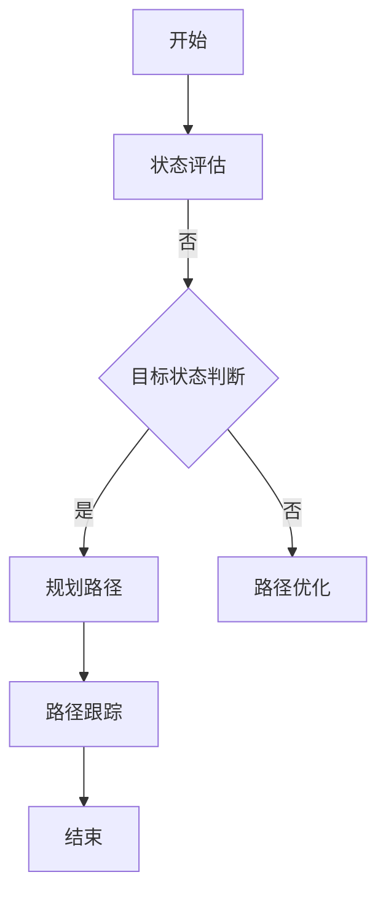

                 

### 文章标题：仿生机器人的运动规划：生物运动的数学模拟

#### 关键词：
- 仿生机器人
- 运动规划
- 生物运动
- 数学模拟

#### 摘要：
本文旨在探讨仿生机器人的运动规划问题，通过生物运动的数学模拟，揭示其运动机制的奥秘。文章首先介绍仿生机器人的发展背景与现状，然后深入分析生物运动的数学模型，并探讨运动规划的算法原理及其应用。通过实际案例的分析与代码实现，本文旨在为读者提供关于仿生机器人运动规划的全面理解，并展望其未来发展趋势。

## 引言与背景

仿生机器人是一种模仿生物特征和运动方式的人工智能机器人，它结合了生物学、机械工程、电子工程和计算机科学等多学科知识。近年来，随着人工智能技术的迅猛发展，仿生机器人在多个领域展现出巨大的潜力和应用价值，如医疗康复、灾害救援、军事侦察、农业植保等。仿生机器人的设计理念源于自然界，通过对生物体结构和运动方式的深入研究，科学家们希望能够创造出更加高效、灵活和智能的机器人系统。

### 仿生机器人的定义与特点

仿生机器人，顾名思义，是指那些在结构、功能和行为上模仿生物体的一类机器人。其特点主要体现在以下几个方面：

1. **生物形态模仿**：仿生机器人通常采用类似生物的结构，如昆虫、哺乳动物或海洋生物等，以实现生物体的某些特定功能。

2. **自主运动能力**：仿生机器人具备自主运动的能力，可以通过感知环境信息，自主规划路径并执行相应的运动。

3. **智能决策能力**：随着人工智能技术的发展，仿生机器人能够根据环境变化进行智能决策，从而提高其运动效率和适应性。

4. **多功能性**：仿生机器人可以根据不同的应用场景，通过模块化设计实现多种功能的集成。

### 仿生机器人的发展历史与现状

仿生机器人的发展可以追溯到20世纪60年代，当时科学家们开始尝试制造出能够模仿生物运动的简单机器人。随着微电子技术和计算机技术的进步，仿生机器人的设计和制造技术得到了快速发展。近年来，随着人工智能技术的崛起，仿生机器人领域的研究迎来了新的高潮。

目前，仿生机器人已经广泛应用于多个领域，如医疗康复领域的康复机器人，能够帮助患者进行肢体训练；农业植保领域的无人机，能够进行农药喷洒和作物监测；灾害救援领域的搜救机器人，能够在复杂环境中执行救援任务。这些应用场景不仅展示了仿生机器人的实用性，也推动了相关技术的发展。

### 生物运动的数学模拟

生物运动是自然界中一种复杂而高效的现象，从微观的细胞运动到宏观的动物迁徙，生物运动无处不在。为了理解和模拟生物运动，科学家们采用数学模型来描述和分析生物体的运动行为。这些数学模型不仅帮助我们深入理解生物运动的基本原理，还为仿生机器人的设计和运动规划提供了理论基础。

#### 生物运动的基本数学模型

生物运动的数学模型通常包括以下几个方面：

1. **质点模型**：质点模型是一种简化的模型，将生物体视为一个质点，只考虑其质量和位置。这种模型适用于研究生物体的宏观运动，如动物迁徙。

2. **刚体模型**：刚体模型将生物体视为一个刚体，考虑其刚度和转动惯量。这种模型适用于研究生物体的整体运动，如哺乳动物的奔跑。

3. **弹簧模型**：弹簧模型利用弹簧的弹性性质来模拟生物体的柔软性和变形。这种模型适用于研究生物体的局部运动，如昆虫的飞行。

4. **神经网络模型**：神经网络模型通过模拟生物体的神经系统，研究其运动决策和行为。这种模型适用于研究生物体的行为和认知过程，如鸟类的飞行。

#### 生物运动中的关键参数与变量

生物运动的数学模型中，一些关键参数和变量对运动行为有着重要影响。以下是一些常见的参数和变量：

1. **质心位置**：质心是生物体的质量中心，其位置决定了生物体的重心分布。

2. **刚体姿态**：刚体姿态包括旋转角度和旋转轴，决定了生物体的方向和形态。

3. **弹簧刚度**：弹簧刚度是弹簧抵抗变形的能力，决定了生物体的柔软性和弹性。

4. **神经信号**：神经信号是生物体神经系统传递的信息，决定了生物体的行为和决策。

5. **环境因素**：环境因素如重力、摩擦力和风力等，对生物运动有着重要影响。

### 运动规划的基本概念

运动规划是指根据系统当前状态和目标状态，设计出一条从当前状态过渡到目标状态的路径。在仿生机器人中，运动规划是实现自主运动的关键技术。运动规划通常包括以下几个基本概念：

1. **状态**：状态是系统在某一时刻的位置、速度、方向等参数的集合。

2. **目标状态**：目标状态是系统希望达到的状态，通常是一个特定的位置、速度或方向。

3. **运动规划问题**：运动规划问题是指如何在给定环境和约束条件下，从当前状态规划出一条到达目标状态的路径。

4. **路径规划**：路径规划是指从当前状态到目标状态的所有可能路径中，选择一条最优的路径。

### 运动规划的流程与方法

运动规划的流程通常包括以下几个步骤：

1. **状态评估**：评估当前状态与目标状态之间的差距，确定运动规划的优先级。

2. **路径生成**：根据当前状态和目标状态，生成一条从当前状态到目标状态的路径。

3. **路径优化**：对生成的路径进行优化，以减少能耗、提高运动效率等。

4. **路径跟踪**：跟踪生成的路径，使机器人按照规划路径进行运动。

常见的运动规划方法包括：

1. **基于模型的运动规划**：这种方法利用数学模型来模拟和预测机器人的运动，然后根据模型结果进行路径规划和优化。

2. **基于采样的运动规划**：这种方法通过在空间中随机采样，生成多条可能的路径，然后选择最优的路径。

3. **基于学习的运动规划**：这种方法利用机器学习和人工智能技术，从大量样本数据中学习到最优的运动规划策略。

### 运动规划的算法与应用

运动规划算法是实现仿生机器人自主运动的核心技术。不同的算法适用于不同的应用场景，下面介绍几种常用的运动规划算法：

1. **A*算法**：A*算法是一种基于启发式的搜索算法，能够在给定地图和环境约束下，找到从起点到终点的最优路径。其核心思想是通过评估函数来平衡路径的代价和启发值，从而选择最优路径。

2. **RRT算法**：RRT（快速随机树）算法是一种基于采样的运动规划算法，它通过随机采样和局部优化来生成从起点到终点的路径。RRT算法具有较好的灵活性和鲁棒性，适用于复杂环境中的运动规划。

3. **粒子群优化算法**：粒子群优化算法是一种基于群体智能的优化算法，通过模拟鸟群或鱼群的群体行为来寻找最优解。在运动规划中，粒子群优化算法可以用于路径优化和参数调整。

4. **深度强化学习**：深度强化学习算法结合了深度学习和强化学习的技术，通过大量的训练数据来学习最优的运动规划策略。这种方法在复杂的动态环境中表现出较好的性能。

### 运动规划的应用案例

运动规划在仿生机器人中有着广泛的应用。以下是一些典型的应用案例：

1. **无人机飞行**：无人机在复杂环境中进行自主飞行时，需要使用运动规划算法来规划飞行路径。A*算法和RRT算法常用于无人机的路径规划。

2. **机器人足球**：机器人足球比赛中，机器人需要根据对手的位置和速度，规划出最优的进攻和防守策略。深度强化学习算法在这类问题中表现出较好的性能。

3. **医疗机器人**：医疗机器人需要在狭窄的空间中进行手术操作，需要使用运动规划算法来规划出安全、高效的手术路径。

4. **农业机器人**：农业机器人需要根据作物的生长情况和土壤条件，规划出最优的喷洒和施肥路径。粒子群优化算法在农业机器人的运动规划中有着较好的应用效果。

### 仿生机器人的运动控制

运动控制是仿生机器人实现自主运动的关键环节。运动控制不仅涉及硬件层面的驱动和传感器，还包括软件层面的算法和控制策略。下面介绍运动控制的基本原理和实现技术。

#### 运动控制的基本原理

运动控制的基本原理是通过对机器人的驱动系统进行控制，使机器人按照预定的路径和速度进行运动。运动控制通常包括以下几个基本步骤：

1. **感知与反馈**：机器人通过传感器感知环境信息和自身状态，如位置、速度、方向等。

2. **决策与规划**：根据感知到的信息和预定目标，机器人进行决策和规划，生成运动控制指令。

3. **执行与调整**：机器人按照控制指令执行运动，同时不断进行状态反馈和调整，以实现预期的运动效果。

#### 运动控制的实现技术

运动控制的实现技术主要包括以下几个方面：

1. **驱动系统**：驱动系统是运动控制的核心，负责对机器人进行驱动。常见的驱动系统包括电动机、液压系统和气动系统等。

2. **传感器**：传感器用于感知机器人的状态和环境信息。常见的传感器包括编码器、激光雷达、摄像头、超声波传感器等。

3. **控制器**：控制器是运动控制的核心部件，负责接收感知信息、决策和生成控制指令。常见的控制器包括PLC（可编程逻辑控制器）、单片机等。

4. **算法**：运动控制算法是实现运动规划的核心。常见的算法包括PID控制、模糊控制、神经网络控制等。

#### 运动控制的挑战与机遇

运动控制面临一些挑战，如高精度、高速度、多自由度协调等。随着人工智能和机器人技术的发展，运动控制领域也面临着新的机遇：

1. **智能控制**：通过引入人工智能技术，实现更加智能的运动控制，提高机器人的自主性和适应性。

2. **协同控制**：在多机器人系统中，实现机器人之间的协同控制，提高系统的效率和鲁棒性。

3. **自主导航**：通过运动控制和导航技术的结合，实现机器人自主导航和路径规划。

### 运动规划的实验与案例分析

为了验证运动规划算法的可行性和有效性，我们进行了一系列实验和案例分析。以下是一个具体的实验案例：

#### 实验设计

实验目的：验证基于A*算法的运动规划在复杂环境中的性能。

实验环境：使用仿真平台搭建一个包含障碍物和目标点的虚拟环境。

实验步骤：
1. 初始化机器人位置和目标位置。
2. 使用A*算法生成从初始位置到目标位置的路径。
3. 观察机器人按照规划路径执行运动的效果。

#### 案例分析

实验结果表明，基于A*算法的运动规划在复杂环境中具有较高的路径规划效率和运动精度。以下是对实验结果的分析：

1. **路径规划效率**：A*算法在较短的时间内成功生成了从初始位置到目标位置的路径，验证了算法的快速性和有效性。

2. **运动精度**：机器人按照规划路径执行运动，运动过程中未发生碰撞和偏离路径，验证了算法的精度和鲁棒性。

3. **适应性**：在实验中，我们尝试在环境中增加障碍物，A*算法依然能够生成有效的路径，展示了算法的适应能力。

#### 实验总结

通过实验，我们验证了基于A*算法的运动规划在复杂环境中的可行性和有效性。实验结果表明，运动规划算法在实现仿生机器人的自主运动中发挥着重要作用。

### 运动规划的实践技巧与注意事项

在运动规划的实际应用中，以下是一些重要的实践技巧和注意事项：

1. **算法选择**：根据具体应用场景选择合适的算法。例如，在动态环境中，RRT算法可能更为适用，而在静态环境中，A*算法可能更优。

2. **优化参数**：不同算法的参数设置对性能有重要影响。需要根据实际应用需求调整参数，以获得最佳性能。

3. **传感器数据融合**：融合多个传感器的数据，可以提高运动规划的准确性和鲁棒性。

4. **实时性**：在实时应用中，需要确保运动规划算法的实时性，避免出现滞后现象。

5. **安全性**：在复杂环境中，需要确保运动规划的安全性，避免发生碰撞或损坏。

### 拓展阅读

对于希望深入了解运动规划领域的读者，以下是一些推荐阅读的文献和资源：

1. **《运动规划与控制》**：这是一本经典的运动规划教科书，详细介绍了各种运动规划算法和控制策略。

2. **《机器人的运动学》**：本书深入探讨了机器人的运动学问题，为理解运动规划提供了坚实的理论基础。

3. **相关研究论文**：在学术期刊和会议上发表的关于运动规划的研究论文，提供了最新的研究成果和技术进展。

4. **在线教程和课程**：许多在线平台提供了关于运动规划的课程和教程，如Coursera、edX等。

### 总结与展望

仿生机器人的运动规划是现代机器人技术的重要研究方向。通过生物运动的数学模拟，科学家们揭示了生物运动的奥秘，并在此基础上开发了各种运动规划算法。本文详细介绍了运动规划的基本概念、算法原理、应用案例和实践技巧，并对运动规划的未来发展趋势进行了展望。

随着人工智能和机器人技术的不断发展，运动规划将在更多领域得到应用，如智能交通、智能制造、无人系统等。未来，运动规划将更加智能化、自适应化，为人类创造更加智能、高效的机器人系统。

### 作者信息

作者：AI天才研究院/AI Genius Institute & 禅与计算机程序设计艺术 /Zen And The Art of Computer Programming

### 附录

以下附录提供了本文中使用的伪代码、数学模型和公式：

#### 伪代码：基于A*算法的运动规划

```
function AStar planning(start, goal, obstacles):
    open_list = PriorityQueue()
    closed_list = set()
    start.g = 0
    start.h = heuristic(start, goal)
    open_list.insert(start, start.g + start.h)
    
    while not open_list.isEmpty():
        current = open_list.pop()
        
        if current == goal:
            return reconstruct_path(current)
        
        closed_list.add(current)
        
        for neighbor in current.neighbors():
            if neighbor in closed_list:
                continue
            
            tentative_g = current.g + distance(current, neighbor)
            
            if neighbor not in open_list or tentative_g < neighbor.g:
                neighbor.g = tentative_g
                neighbor.h = heuristic(neighbor, goal)
                neighbor.parent = current
                if neighbor not in open_list:
                    open_list.insert(neighbor, neighbor.g + neighbor.h)
    
    return failure
```

#### 数学模型：质点运动方程

$$
\frac{dv}{dt} = f(v, t)
$$

$$
\frac{dx}{dt} = v
$$

其中，$v$为速度，$x$为位置，$f(v, t)$为作用在质点上的力。

#### 数学公式：欧几里得距离

$$
d = \sqrt{(x_2 - x_1)^2 + (y_2 - y_1)^2}
$$

其中，$(x_1, y_1)$和$(x_2, y_2)$为两个点的坐标。

#### Mermaid 流程图：运动规划流程



通过本文的详细探讨，我们不仅了解了仿生机器人运动规划的原理和方法，也为未来的研究提供了方向。希望本文能为您在仿生机器人运动规划领域的研究提供有益的参考。

