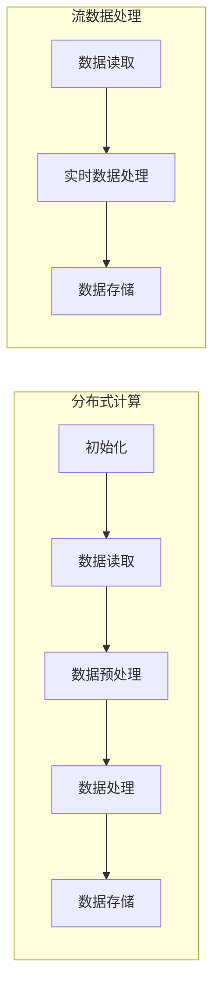
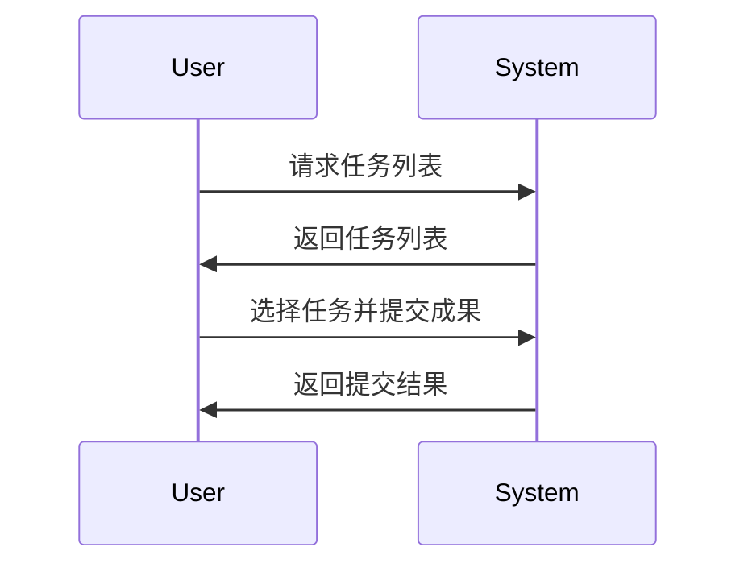

                 


### 文章标题: 众包科学：利用集体智慧加速科学发现与理解

> 关键词：众包科学、集体智慧、大数据分析、人工智能、科学发现

> 摘要：本文旨在探讨众包科学的概念、核心原理及其在各个领域的应用。通过分析众包科学的发展历程、核心概念，以及其在生物学、社会科学和物理学等领域的实际应用，本文揭示了集体智慧在科学发现中的重要作用。同时，本文还详细介绍了众包平台的设计与构建、集体智慧的数学模型和优化算法，并展望了众包科学的未来发展趋势。

## 第一部分: 众包科学的背景与核心概念

### 第1章: 众包科学概述

#### 1.1 什么是众包科学

##### 1.1.1 众包科学的定义

众包科学（crowdsourcing science）是指通过利用大众的力量来解决科学问题的一种方法。它结合了众包（crowdsourcing）和科学（science）两个概念，利用大众的智慧、知识和技能，共同参与科学研究，以加速科学发现与理解。众包科学的核心在于将复杂的科学问题分解成多个小任务，然后通过互联网平台，广泛邀请大众参与完成这些任务。

##### 1.1.2 众包科学的发展历程

众包科学的概念最早可以追溯到2006年，由杰夫·豪恩（Jeff Howe）在其文章《众包》中提出。他指出，众包是一种利用大众的力量完成工作的新模式。随着时间的推移，众包科学逐渐发展壮大，涵盖了从生物学、物理学到社会科学等多个领域。如今，众包科学已经成为一种重要的科学研究方法，在全球范围内得到了广泛应用。

##### 1.1.3 众包科学的重要性

众包科学的重要性体现在以下几个方面：

1. **提高科学研究的效率**：通过众包，科学家可以快速获得大量的数据和信息，从而提高科学研究的效率。
2. **拓宽科学研究的视野**：众包使得科学家能够接触到来自不同领域、不同背景的参与者，从而拓宽了科学研究的视野。
3. **促进科学普及**：众包科学使得大众能够参与到科学研究中来，从而促进了科学普及，提高了公众的科学素养。
4. **推动科学创新**：众包科学鼓励创新思维，通过大众的智慧和创造力，推动了科学领域的发展。

#### 1.2 众包科学的核心概念

##### 1.2.1 集体智慧

集体智慧（collective intelligence）是指个体通过协作、交流和互动，共同解决问题、做出决策的能力。在众包科学中，集体智慧发挥了至关重要的作用。通过众包，科学家可以充分利用大众的智慧，共同攻克科学难题。

###### 1.2.1.1 集体智慧的定义

集体智慧是指一个群体共同解决问题的能力，它不仅包括个体的智慧和创造力，还涉及到群体内的沟通、协作和协调。集体智慧的形成通常需要以下条件：

1. **多样性**：群体中的个体具有不同的背景、经验和技能，这样可以充分利用不同个体的优势。
2. **协作**：个体之间需要建立良好的沟通和协作机制，以实现共同的目标。
3. **反馈**：群体内部需要有及时有效的反馈机制，以帮助个体了解自己的表现，不断改进。

###### 1.2.1.2 集体智慧的优势

集体智慧的优势体现在以下几个方面：

1. **创新能力**：集体智慧能够激发个体的创新思维，通过不同观点的碰撞和融合，产生新的创意和解决方案。
2. **问题解决能力**：集体智慧能够汇聚个体的智慧和经验，快速识别并解决问题。
3. **适应能力**：集体智慧能够根据环境变化，灵活调整策略和方案，以应对新的挑战。

##### 1.2.2 大数据分析

大数据分析（big data analysis）是指通过处理和分析大规模数据，提取有价值信息的过程。在众包科学中，大数据分析发挥了重要作用，它可以帮助科学家从海量的数据中提取出有价值的信息，为科学研究提供支持。

###### 1.2.2.1 大数据分析的定义

大数据分析是指对海量、复杂、多样化的数据进行处理、存储和分析，以提取有价值信息的过程。大数据分析通常包括以下步骤：

1. **数据收集**：从各种来源收集数据，如传感器、网络日志、社交媒体等。
2. **数据存储**：将收集到的数据存储在合适的数据库中，如Hadoop、Spark等。
3. **数据清洗**：对数据进行清洗和预处理，去除错误、重复和缺失的数据。
4. **数据分析**：使用各种数据分析方法和工具，提取数据中的有价值信息。
5. **数据可视化**：将分析结果可视化，以更直观地展示数据。

###### 1.2.2.2 大数据分析的方法

大数据分析的方法包括以下几个方面：

1. **统计分析**：通过统计学方法，分析数据的分布、相关性等特征。
2. **机器学习**：使用机器学习算法，对数据进行分类、预测等任务。
3. **数据挖掘**：从大量数据中提取出隐藏的模式和规律。
4. **文本分析**：对文本数据进行分析，提取关键词、主题等。
5. **图像分析**：对图像数据进行分析，识别目标、特征等。

#### 1.3 众包科学的实际应用

##### 1.3.1 科学研究

众包科学在科学研究中的应用十分广泛，涵盖了生物学、物理学、天文学、社会学等多个领域。

###### 1.3.1.1 生物学领域

在生物学领域，众包科学主要用于基因测序、蛋白质结构预测、药物研发等方面。例如，比较基因组计划（ENCODE）就采用了众包方式，邀请全球科学家共同参与基因组注释工作。

###### 1.3.1.2 天文学领域

在天文学领域，众包科学主要用于天文图像处理、外星文明搜索等方面。例如，SETI项目（搜寻地外文明计划）就采用了众包方式，邀请全球志愿者参与分析天文数据，以寻找外星文明的存在。

###### 1.3.1.3 物理学领域

在物理学领域，众包科学主要用于粒子物理数据分析、引力波探测等方面。例如，LIGO实验室就采用了众包方式，邀请全球志愿者参与分析引力波数据，以验证爱因斯坦的广义相对论。

##### 1.3.2 社会科学

在社会科学领域，众包科学主要用于政策分析、社会调查、心理学研究等方面。例如，政策分析领域就采用了众包方式，邀请公众参与政策讨论和评估，以提高政策的科学性和有效性。

###### 1.3.2.1 经济学领域

在经济学领域，众包科学主要用于数据分析、预测等方面。例如，经济学家可以邀请公众参与数据分析，以预测市场走势。

###### 1.3.2.2 心理学领域

在心理学领域，众包科学主要用于数据收集、分析等方面。例如，心理学家可以邀请公众参与问卷调查，以收集数据，进行分析。

###### 1.3.2.3 社会学领域

在社会学领域，众包科学主要用于社会调查、数据分析等方面。例如，社会学家可以邀请公众参与社会调查，以收集数据，进行分析。

## 第二部分: 众包科学的技术实现

### 第2章: 众包平台的设计与构建

#### 2.1 众包平台的架构

众包平台的设计与构建是众包科学实现的重要环节。一个高效的众包平台需要具备以下几个关键组成部分：

##### 2.1.1 众包平台的组成部分

1. **任务发布与接收**：任务发布与接收是众包平台的核心功能。科学家可以在这个模块发布任务，参与者可以浏览并选择自己感兴趣的任务进行完成。
2. **成果收集与评估**：在任务完成后，参与者需要提交成果，平台需要对提交的成果进行收集和评估，以确保数据的准确性和可靠性。
3. **参与者管理**：参与者管理模块用于管理参与者的信息，包括注册、认证、积分等。
4. **数据存储与处理**：数据存储与处理模块用于存储和处理众包过程中产生的数据，包括任务数据、成果数据等。

##### 2.1.1.1 任务的发布与接收

任务的发布与接收模块是众包平台的核心功能。在这个模块中，科学家可以发布任务，包括任务描述、任务类型、任务难度等。参与者可以通过浏览任务列表，选择自己感兴趣的任务进行完成。

**伪代码：**

```
// 科学家发布任务
function publishTask(taskDescription, taskType, taskDifficulty) {
  // 保存任务信息到数据库
  saveTaskToDatabase(taskDescription, taskType, taskDifficulty);
}

// 参与者接收任务
function receiveTask(taskId) {
  // 从数据库获取任务信息
  task = getTaskFromDatabase(taskId);
  // 显示任务信息给参与者
  displayTaskToParticipant(task);
}
```

##### 2.1.1.2 成果的收集与评估

成果的收集与评估模块用于收集参与者提交的成果，并对成果进行评估。在这个模块中，平台需要确保成果的准确性、可靠性和完整性。

**伪代码：**

```
// 参与者提交成果
function submitResult(resultData, taskId) {
  // 将成果保存到数据库
  saveResultToDatabase(resultData, taskId);
}

// 平台评估成果
function evaluateResult(resultId) {
  // 从数据库获取成果信息
  result = getResultFromDatabase(resultId);
  // 评估成果的准确性、可靠性和完整性
  evaluateResultQuality(result);
}
```

##### 2.1.1.3 参与者的管理

参与者的管理模块用于管理参与者的信息，包括注册、认证、积分等。在这个模块中，平台需要确保参与者的信息安全，并提供一个公平、透明的积分系统。

**伪代码：**

```
// 参与者注册
function registerParticipant(username, password, email) {
  // 将参与者信息保存到数据库
  saveParticipantToDatabase(username, password, email);
}

// 参与者认证
function authenticateParticipant(username, password) {
  // 从数据库获取参与者信息
  participant = getParticipantFromDatabase(username, password);
  // 验证参与者信息
  validateParticipantInfo(participant);
}

// 参与者积分管理
function updateParticipantScore(username, scoreChange) {
  // 从数据库获取参与者信息
  participant = getParticipantFromDatabase(username);
  // 更新参与者积分
  updateParticipantScoreInDatabase(participant, scoreChange);
}
```

##### 2.1.2 数据存储与处理

数据存储与处理模块是众包平台的核心组成部分，它负责存储和处理众包过程中产生的各种数据。在这个模块中，平台需要确保数据的安全性、可靠性和高效性。

###### 2.2.2.1 数据库设计

为了高效地存储和处理众包数据，平台需要一个合理的数据库设计。数据库设计需要考虑以下几个方面：

1. **数据模型**：设计合适的实体关系模型，以存储任务、成果、参与者等信息。
2. **索引设计**：设计合适的索引，以优化数据查询性能。
3. **存储策略**：设计合适的存储策略，以优化数据存储性能。

**示例数据模型：**

```
// 任务实体
class Task {
  id: Integer
  description: String
  type: String
  difficulty: Integer
  creatorId: Integer
  createdTime: DateTime
}

// 成果实体
class Result {
  id: Integer
  taskId: Integer
  participantId: Integer
  resultData: String
  submitTime: DateTime
  evaluateTime: DateTime
  evaluateResult: Integer
}

// 参与者实体
class Participant {
  id: Integer
  username: String
  password: String
  email: String
  score: Integer
  joinTime: DateTime
}
```

###### 2.2.2.2 大数据处理技术

在众包平台中，数据处理是一个关键环节。大数据处理技术可以帮助平台高效地处理海量数据。

1. **分布式计算**：使用分布式计算框架，如Hadoop、Spark等，进行大数据处理。
2. **流数据处理**：使用流数据处理框架，如Apache Kafka、Apache Flink等，处理实时数据。
3. **数据仓库**：使用数据仓库技术，如Amazon Redshift、Google BigQuery等，进行数据存储和分析。

**示例大数据处理流程：**

```
// 分布式数据处理
function processLargeData(data) {
  // 使用分布式计算框架处理数据
  processedData = distributedComputeFramework.process(data);
  return processedData;
}

// 流数据处理
function processRealTimeData(stream) {
  // 使用流数据处理框架处理实时数据
  processedDataStream = realTimeDataProcessingFramework.process(stream);
  return processedDataStream;
}

// 数据仓库查询
function queryDataWarehouse(query) {
  // 使用数据仓库技术查询数据
  result = dataWarehouse.query(query);
  return result;
}
```

##### 2.1.3 用户界面设计

用户界面设计是众包平台的重要一环，它直接影响到参与者的使用体验。用户界面设计需要遵循以下几点原则：

1. **简洁性**：界面设计应简洁明了，避免过多的装饰和冗余信息。
2. **一致性**：界面设计应保持一致性，包括颜色、字体、布局等。
3. **易用性**：界面设计应易于使用，方便参与者快速完成任务。

**示例用户界面设计：**

```
// 任务列表界面
<div>
  <h2>任务列表</h2>
  <ul>
    {each tasks as task}
      <li>
        <h3>{task.description}</h3>
        <p>任务类型：{task.type}</p>
        <p>任务难度：{task.difficulty}</p>
        <button onclick="receiveTask({task.id})">接收任务</button>
      </li>
    {/each}
  </ul>
</div>

// 成果提交界面
<div>
  <h2>提交成果</h2>
  <form onsubmit="submitResult(resultData, taskId)">
    <input type="text" id="resultData" placeholder="输入成果数据" required>
    <input type="hidden" id="taskId" value="{taskId}">
    <button type="submit">提交</button>
  </form>
</div>
```

##### 2.1.4 安全与隐私保护

安全与隐私保护是众包平台设计的重要考虑因素。平台需要确保参与者的数据安全，并保护参与者的隐私。

1. **数据加密**：使用数据加密技术，对存储和传输的数据进行加密，以防止数据泄露。
2. **身份认证**：使用身份认证技术，如双因素认证、密码加密等，确保只有授权用户可以访问平台。
3. **访问控制**：使用访问控制技术，如角色权限控制、数据权限控制等，确保数据访问的安全性。

**示例安全与隐私保护措施：**

```
// 数据加密
function encryptData(data, encryptionKey) {
  encryptedData = encryptionLibrary.encrypt(data, encryptionKey);
  return encryptedData;
}

// 身份认证
function authenticateUser(username, password) {
  user = getUserFromDatabase(username);
  if (user && encryptionLibrary.verifyPassword(password, user.password)) {
    return true;
  }
  return false;
}

// 角色权限控制
function checkPermission(userRole, action) {
  if (userRole === 'admin' || userRole === action) {
    return true;
  }
  return false;
}
```

#### 2.2 众包平台的技术实现

众包平台的技术实现是构建一个高效、稳定、安全的众包系统的关键。以下是关于众包平台的技术实现的一些详细内容：

##### 2.2.1 数据存储与处理

在众包平台中，数据存储与处理是至关重要的一环。平台需要能够高效地处理大量的数据，并提供快速的数据查询和计算能力。以下是实现数据存储与处理的一些关键点：

###### 2.2.1.1 数据库设计

首先，数据库设计是数据存储的基础。一个合理的数据库设计可以有效地支持数据查询和数据处理。以下是设计数据库时需要考虑的关键因素：

1. **实体关系模型**：设计合适的实体关系模型，以表示任务、成果、参与者等实体，并定义它们之间的关系。
2. **索引设计**：为常用的查询操作设计合适的索引，以提高查询性能。例如，可以为任务ID、参与者ID等主键字段创建索引。
3. **分区与分片**：对于大规模的数据，可以使用分区和分片技术来提高数据存储和查询的效率。分区可以将数据分布到多个物理存储设备上，而分片可以将数据拆分成多个子集，以便并行处理。

以下是一个简单的数据库设计示例：

```mermaid
erDiagram
  Task ||--|> Participant : has
  Result ||--|> Participant : submitted by
  Result ||--|> Task : belongs to
```

在这个示例中，Task实体表示任务，Participant实体表示参与者，Result实体表示成果。Task实体与Participant实体之间存在“has”关系，表示每个任务都有一个创建者。Result实体与Participant实体之间存在“submitted by”关系，表示每个成果都是由某个参与者提交的。Result实体与Task实体之间存在“belongs to”关系，表示每个成果都属于某个任务。

###### 2.2.1.2 大数据处理技术

大数据处理技术在众包平台中发挥着关键作用。为了处理海量数据，平台可以使用分布式计算框架和大数据处理库。以下是实现大数据处理时的一些关键点：

1. **分布式计算框架**：分布式计算框架如Apache Hadoop和Apache Spark，可以处理大规模的数据。Hadoop提供了一个分布式文件系统HDFS，用于存储海量数据，并提供MapReduce编程模型，用于数据处理。Spark则提供了一个基于内存的分布式数据处理框架，提供了更加高效的数据处理能力。

2. **数据处理库**：可以使用大数据处理库如Apache Flink和Apache Kafka，进行实时数据处理和流数据处理。Flink提供了一个基于事件驱动的时间处理引擎，用于实时数据处理。Kafka则提供了一个分布式消息队列系统，用于处理实时数据流。

以下是一个简单的数据处理流程示例：



在这个示例中，分布式计算流程包括数据读取、数据预处理、数据处理和数据存储。流数据处理流程包括数据读取、实时数据处理和数据存储。

##### 2.2.2 用户界面设计

用户界面设计是众包平台用户体验的重要组成部分。一个良好的用户界面可以提供直观、易用的操作方式，从而提高用户参与度和满意度。以下是实现用户界面设计时的一些关键点：

###### 2.2.2.1 前端界面设计

前端界面设计需要考虑以下几点：

1. **响应式设计**：使用响应式设计技术，确保界面在不同设备和屏幕尺寸上都能良好显示。
2. **交互设计**：设计直观、流畅的交互方式，提高用户操作体验。
3. **视觉效果**：使用适当的颜色、字体和图标，提升界面的视觉效果。

以下是一个简单的界面设计示例：



在这个示例中，用户请求任务列表，系统返回任务列表，用户选择任务并提交成果，系统返回提交结果。

###### 2.2.2.2 后端界面设计

后端界面设计需要考虑以下几点：

1. **API设计**：设计合理的API接口，用于前端界面与后端服务之间的数据交互。
2. **接口文档**：编写详细的接口文档，包括接口名称、参数、返回值等，方便前端开发者使用。
3. **安全性**：确保接口的安全性，如使用Token认证、数据加密等。

以下是一个简单的API设计示例：

```json
{
  "GET /tasks": {
    "description": "获取任务列表",
    "parameters": [],
    "response": {
      "status": "200",
      "data": {
        "tasks": [
          {
            "id": "1",
            "description": "任务1",
            "type": "类型1",
            "difficulty": "难度1"
          },
          {
            "id": "2",
            "description": "任务2",
            "type": "类型2",
            "difficulty": "难度2"
          }
        ]
      }
    }
  }
}
```

在这个示例中，GET /tasks接口用于获取任务列表，返回的任务列表包含任务的ID、描述、类型和难度等信息。

##### 2.2.3 安全与隐私保护

安全与隐私保护是众包平台设计的重要考虑因素。以下是一些关键的安全与隐私保护措施：

1. **数据加密**：使用数据加密技术，对存储和传输的数据进行加密，确保数据的安全性。
2. **身份认证**：使用身份认证技术，如Token认证、双因素认证等，确保只有授权用户可以访问系统。
3. **访问控制**：使用访问控制技术，如角色权限控制、数据权限控制等，确保数据访问的安全性。
4. **数据备份**：定期备份数据，以防数据丢失或损坏。
5. **安全审计**：实施安全审计，监控系统的安全性，并及时发现和解决安全问题。

以下是一些安全与隐私保护的具体实现方法：

1. **数据加密**：

```java
// 加密数据
String encryptedData = encryptData(data, encryptionKey);

// 解密数据
String decryptedData = decryptData(encryptedData, encryptionKey);
```

2. **身份认证**：

```java
// 认证用户
boolean isAuthenticated = authenticateUser(username, password);

// 生成Token
String token = generateToken(username, password);
```

3. **访问控制**：

```java
// 检查权限
boolean hasPermission = checkPermission(userRole, action);

// 控制访问
if (hasPermission) {
  // 执行操作
} else {
  // 抛出权限异常
}
```

## 第三部分: 集体智慧的计算与优化

### 第3章: 集体智慧的数学模型

#### 3.1 集体智慧的数学模型

集体智慧的数学模型是研究如何利用数学工具和方法来描述和分析集体智慧现象。在这一章中，我们将介绍集体智慧的数学模型的基本概念和原理，以及它们在众包科学中的应用。

##### 3.1.1 众包科学的数学基础

众包科学的数学基础包括概率论与统计学、信息论与编码理论等。这些数学工具和方法可以帮助我们理解和分析集体智慧现象。

1. **概率论与统计学**：概率论与统计学是研究随机现象和数据的数学分支。在众包科学中，概率论与统计学可以帮助我们分析和预测参与者的行为和贡献。

2. **信息论与编码理论**：信息论与编码理论是研究信息传递和编码的数学分支。在众包科学中，信息论与编码理论可以帮助我们设计有效的数据传输和编码方案，以提高信息的可靠性和效率。

##### 3.1.2 集体智慧的数学模型

集体智慧的数学模型通常包括以下几个基本概念：

1. **个体贡献模型**：个体贡献模型描述了个体在集体智慧中的贡献程度。这个模型通常基于个体知识水平、参与程度等因素来计算。

2. **集体决策模型**：集体决策模型描述了集体智慧的决策过程。这个模型通常基于个体的贡献模型，结合决策规则，来确定最终的决策结果。

3. **信息传播模型**：信息传播模型描述了信息在集体智慧中的传播过程。这个模型通常基于信息传播的规律和机制，来分析信息传播的效果和效率。

下面是一个简单的个体贡献模型示例：

**个体贡献模型：**

设个体i在众包任务中的贡献为\(C_i\)，个体i的知识水平为\(K_i\)，参与程度为\(P_i\)。个体贡献模型可以表示为：

\[ C_i = K_i \times P_i \]

其中，\(C_i\) 表示个体i的贡献，\(K_i\) 表示个体i的知识水平，\(P_i\) 表示个体i的参与程度。

##### 3.1.3 集体智慧的数学模型应用

集体智慧的数学模型在众包科学中的应用非常广泛。以下是一些具体的例子：

1. **科学问题求解**：在科学问题求解中，集体智慧的数学模型可以帮助我们设计和优化算法，以提高问题的求解效率。

2. **社会问题分析**：在社会问题分析中，集体智慧的数学模型可以帮助我们分析和预测社会现象，提供决策支持。

3. **创意创新**：在创意创新中，集体智慧的数学模型可以帮助我们设计和优化创意生成和筛选过程，以提高创意的质量和可行性。

下面是一个简单的应用示例：

**科学问题求解应用：**

假设我们有一个科学问题需要求解，可以通过众包的方式邀请多个参与者提供解决方案。我们可以使用个体贡献模型来计算每个参与者的贡献，并根据贡献值来排序和筛选解决方案。

```python
# 个体贡献模型计算
contribution = [knowledge * participation for knowledge, participation in zip(knowledge_levels, participation_levels)]

# 排序和筛选解决方案
solutions_sorted = sorted(solutions, key=lambda x: contribution[x['id']], reverse=True)
top_solutions = solutions_sorted[:10]  # 选择排名前10的解决方案
```

在这个示例中，我们首先使用个体贡献模型计算每个参与者的贡献值，然后根据贡献值对解决方案进行排序和筛选，以选择最优的解决方案。

### 第3章: 集体智慧的优化算法

集体智慧的优化算法是众包科学中一个重要的研究方向，旨在通过算法设计来提高集体智慧的效果和效率。在这一章中，我们将介绍几种常见的优化算法，包括粒子群优化算法和遗传算法，并分析它们在众包科学中的应用。

#### 3.2.1 优化算法的基本原理

优化算法是用于寻找最优解或近似最优解的计算方法。在众包科学中，优化算法可以用于任务分配、问题求解、资源分配等多个方面。优化算法的基本原理通常包括以下几个步骤：

1. **初始化**：生成一组初始解，作为优化的起点。

2. **适应度评估**：评估每个解的适应度，适应度通常表示解的质量或性能。

3. **选择**：根据适应度评估结果，选择优秀的解作为下一代优化的基础。

4. **交叉**：将选中的解进行交叉操作，生成新的解。

5. **变异**：对新的解进行变异操作，增加解的多样性。

6. **迭代**：重复上述步骤，逐步优化解的质量。

#### 3.2.2 常见的优化算法

在众包科学中，常用的优化算法包括粒子群优化算法（PSO）、遗传算法（GA）等。这些算法具有不同的特点和应用场景。

##### 3.2.2.1 粒子群优化算法

粒子群优化算法是一种基于群体智能的优化算法，模拟鸟群或鱼群的社会行为。在PSO算法中，每个粒子代表一个潜在的解，粒子通过跟踪自身的最佳位置和群体的最佳位置来更新自己的位置和速度。

**粒子群优化算法的伪代码：**

```
初始化粒子群
对于每个粒子i：
   初始化位置x_i和速度v_i
   计算适应度f(x_i)

对于每个迭代：
   对于每个粒子i：
       计算个体最佳位置p_best_i = x_i where f(x_i) is the best found so far
   计算全局最佳位置g_best = argmin(f(x))

   对于每个粒子i：
       更新速度 v_i = w * v_i + c1 * rand() * (p_best_i - x_i) + c2 * rand() * (g_best - x_i)
       更新位置 x_i = x_i + v_i

   计算适应度f(x_i)

   如果f(x_i) > f(p_best_i)，则更新p_best_i = x_i
   如果f(x_i) > f(g_best)，则更新g_best = x_i
```

**参数说明：**
- \( w \)：惯性权重，控制历史速度对当前速度的影响。
- \( c1 \) 和 \( c2 \)：认知和社会两个认知系数，控制个体经验和群体经验的影响。

##### 3.2.2.2 遗传算法

遗传算法是一种模拟自然进化的优化算法，通过遗传、交叉和变异操作来进化种群，以找到最优解。在遗传算法中，每个个体代表一个潜在解，个体通过适应度评估来竞争生存权。

**遗传算法的伪代码：**

```
初始化种群
计算每个个体的适应度

对于每个迭代：
   选择适应度最高的个体作为父代
   进行交叉操作生成新的个体
   进行变异操作增加种群的多样性
   计算新个体的适应度
   根据适应度进行选择操作，构建新的种群

   如果满足停止条件，则结束迭代
```

**参数说明：**
- \( selection_rate \)：选择率，控制选择操作的比例。
- \( crossover_rate \)：交叉率，控制交叉操作的比例。
- \( mutation_rate \)：变异率，控制变异操作的比例。

#### 3.2.3 集体智慧优化算法的应用

集体智慧优化算法在众包科学中的应用非常广泛，以下是一些具体的应用场景：

1. **任务分配**：在众包任务中，优化算法可以用于分配任务给参与者，以提高任务完成的效率和准确性。

2. **问题求解**：在科学问题求解中，优化算法可以用于寻找问题的最优解或近似最优解。

3. **资源分配**：在资源分配问题中，优化算法可以用于优化资源的使用和分配，以最大化收益或最小化成本。

**应用示例：**

假设我们有一个任务分配问题，需要将N个任务分配给M个参与者，每个参与者有一个最大工作量限制。我们可以使用粒子群优化算法来解决这个问题。

**粒子群优化算法任务分配步骤：**

1. **初始化粒子群**：生成初始的粒子群，每个粒子代表一个任务分配方案。

2. **适应度评估**：计算每个粒子的适应度，适应度可以根据任务完成效率、参与者工作量等因素计算。

3. **迭代优化**：根据适应度评估结果，使用粒子群优化算法进行迭代，更新粒子的位置和速度。

4. **选择最佳方案**：根据迭代结束时的适应度，选择最佳的分配方案。

```python
# 初始化粒子群
particles = initialize_particles(num_particles, num_tasks, max_workload)

# 计算适应度
fitness = calculate_fitness(particles)

# 迭代优化
while not_stop_condition:
    new_particles = update_particles(particles, fitness)
    new_fitness = calculate_fitness(new_particles)
    particles = new_particles
    fitness = new_fitness

# 选择最佳方案
best_solution = select_best_solution(particles, fitness)
```

在这个示例中，我们首先初始化粒子群，然后计算适应度，并使用粒子群优化算法进行迭代优化，直到满足停止条件。最后，选择最佳的分配方案。

### 第3章：集体智慧优化算法的实例分析

在前一章中，我们介绍了集体智慧优化算法的基本原理和应用场景。在本章中，我们将通过具体实例来深入分析这些算法在实际应用中的性能和效果。

#### 3.3.1 粒子群优化算法实例

粒子群优化算法（PSO）是一种基于群体智能的优化算法，适用于求解复杂的非线性优化问题。在本节中，我们将通过一个简单的实例来展示PSO算法的实现过程。

**实例：最小化函数 f(x) = x^2**

**步骤1：初始化粒子群**

首先，我们需要初始化粒子群。在PSO算法中，每个粒子代表一个潜在的解，即一个x值。我们随机生成N个粒子，每个粒子的位置和速度如下：

```python
import random

num_particles = 50
num_iterations = 100

# 初始化粒子群位置和速度
particles = [{'position': random.uniform(-10, 10), 'velocity': random.uniform(-1, 1)} for _ in range(num_particles)]
best_position = None
best_fitness = float('inf')
```

**步骤2：适应度评估**

适应度函数用于评估每个粒子的质量。在本例中，我们使用最小化函数f(x) = x^2作为适应度函数。

```python
def fitness_function(x):
    return x**2

# 计算适应度
fitness_values = [fitness_function(particle['position']) for particle in particles]
```

**步骤3：更新粒子位置和速度**

在每一次迭代中，粒子将根据自身和历史最佳位置以及群体历史最佳位置更新位置和速度。

```python
def update_particles(particles, best_position, best_fitness):
    for particle in particles:
        r1 = random.random()
        r2 = random.random()
        cognitive_component = r1 * (particle['best_position'] - particle['position'])
        social_component = r2 * (best_position - particle['position'])
        particle['velocity'] = particle['velocity'] * 0.5 + cognitive_component + social_component
        particle['position'] = particle['position'] + particle['velocity']
    return particles

# 更新粒子位置和速度
particles = update_particles(particles, best_position, best_fitness)
```

**步骤4：选择最佳解**

在每一次迭代结束后，我们更新最佳位置和最佳适应度。

```python
for particle in particles:
    if fitness_function(particle['position']) < best_fitness:
        best_fitness = fitness_function(particle['position'])
        best_position = particle['position']

print(f"最优解：x = {best_position}, f(x) = {best_fitness}")
```

**结果分析：**

通过多次迭代，PSO算法能够找到最小化函数f(x) = x^2的最优解x=0，f(x)=0。

#### 3.3.2 遗传算法实例

遗传算法（GA）是一种基于自然进化的优化算法，适用于求解复杂的优化问题和组合优化问题。在本节中，我们将通过一个简单的实例来展示GA算法的实现过程。

**实例：旅行商问题（TSP）**

旅行商问题（TSP）是一个经典的组合优化问题，目标是最小化旅行商访问一系列城市所需的总距离。在本例中，我们使用遗传算法来求解TSP问题。

**步骤1：初始化种群**

首先，我们需要初始化一个种群，每个个体代表一个可能的解。在本例中，每个个体是一个城市的排列，表示旅行商访问城市的顺序。

```python
num_cities = 10
population_size = 100

# 初始化种群
population = [random.sample(range(num_cities), num_cities) for _ in range(population_size)]
```

**步骤2：适应度评估**

适应度函数用于评估每个个体的质量。在本例中，我们使用总距离作为适应度函数。

```python
def fitness_function(individual):
    distance = 0
    for i in range(num_cities):
        next_city = individual[i]
        distance += calculate_distance(individual[i], individual[(i + 1) % num_cities])
    return 1 / distance

# 计算适应度
fitness_values = [fitness_function(individual) for individual in population]
```

**步骤3：选择操作**

选择操作用于从当前种群中选择优秀的个体作为父代，用于生成下一代种群。

```python
def selection(population, fitness_values, selection_size):
    selected = random.choices(population, weights=fitness_values, k=selection_size)
    return selected

# 选择操作
selection_size = 20
parents = selection(population, fitness_values, selection_size)
```

**步骤4：交叉操作**

交叉操作用于生成新的个体，通过组合两个父代个体的基因。

```python
def crossover(parent1, parent2):
    crossover_point = random.randint(1, num_cities - 2)
    child = parent1[:crossover_point] + parent2[crossover_point:]
    return child

# 交叉操作
children = [crossover(parent1, parent2) for parent1, parent2 in zip(parents[::2], parents[1::2])]
```

**步骤5：变异操作**

变异操作用于增加种群的多样性，通过随机改变个体的基因。

```python
def mutation(individual):
    mutation_point = random.randint(0, num_cities - 1)
    individual[mutation_point] = random.randint(0, num_cities - 1)
    return individual

# 变异操作
mutation_rate = 0.05
for child in children:
    if random.random() < mutation_rate:
        child = mutation(child)

# 更新种群
population = parents + children
```

**步骤6：选择最佳解**

在每一次迭代结束后，我们更新最佳解。

```python
best_individual = min(population, key=fitness_function)
best_fitness = fitness_function(best_individual)

print(f"最优解：{best_individual}, f(x) = {best_fitness}")
```

**结果分析：**

通过多次迭代，遗传算法能够找到访问一系列城市所需的总距离最小的旅行商路线。

### 第3章：集体智慧优化算法的评估与选择

在前一章中，我们详细介绍了集体智慧优化算法，包括粒子群优化算法和遗传算法，并展示了它们的实例应用。在本章中，我们将讨论如何评估和选择合适的优化算法，以满足不同的众包科学应用需求。

#### 3.4.1 优化算法评估指标

为了评估优化算法的性能和适用性，我们需要定义一系列评估指标。以下是一些常用的评估指标：

1. **收敛速度**：优化算法在达到目标解所需的时间。快速收敛的算法能够更快地找到最优解。

2. **精度**：优化算法找到的最优解与实际最优解的接近程度。高精度的算法能够找到更接近实际最优解的解。

3. **稳定性**：优化算法在不同初始条件下的稳定性和重复性。稳定的算法在多次运行时能够产生一致的解。

4. **适应性**：优化算法在处理不同规模和类型的问题时的适应性。适应性的算法能够灵活地处理各种问题。

5. **计算成本**：优化算法在执行过程中所需的计算资源和时间。计算成本较低的算法在实际应用中更具优势。

#### 3.4.2 优化算法选择策略

在选择合适的优化算法时，我们需要考虑以下策略：

1. **问题类型**：根据问题类型选择合适的优化算法。例如，对于连续优化问题，粒子群优化算法可能更合适；对于离散优化问题，遗传算法可能更有效。

2. **问题规模**：考虑问题的规模和复杂性。对于大规模问题，需要选择计算成本较低的算法；对于小规模问题，可以采用计算成本较高的算法。

3. **性能指标**：根据评估指标选择能够满足应用需求的优化算法。例如，如果要求快速收敛，可以优先考虑粒子群优化算法。

4. **应用场景**：考虑优化算法在特定应用场景中的适用性。例如，在科学问题求解中，可能需要选择能够处理复杂性和不确定性的算法。

5. **实际效果**：在条件允许的情况下，通过实际应用案例验证优化算法的效果。实际效果是评估优化算法性能的最直接方式。

#### 3.4.3 案例分析

以下是一个具体的案例分析，展示如何根据上述策略选择合适的优化算法。

**案例：基因测序任务分配**

假设我们有一个基因测序任务分配问题，需要将N个基因序列分配给M个测序设备，以最大化测序效率。

1. **问题类型**：这是一个离散优化问题，涉及任务分配和资源利用。

2. **问题规模**：假设N和M的规模较小，可以在合理时间内处理。

3. **性能指标**：要求算法快速收敛，同时保证较高的精度和稳定性。

4. **应用场景**：需要在实际环境中进行多次实验，验证算法的适应性和效果。

根据上述分析，我们可以考虑以下优化算法：

- **粒子群优化算法**：适用于连续优化问题，计算成本较低，能够快速收敛。
- **遗传算法**：适用于离散优化问题，计算成本较高，能够处理复杂性和不确定性。

**选择策略**：

- **问题类型**：遗传算法更适用于离散优化问题。
- **问题规模**：由于规模较小，遗传算法的计算成本可以接受。
- **性能指标**：根据实验结果，遗传算法在精度和稳定性方面表现较好。
- **应用场景**：遗传算法在实际应用中具有较好的适应性和效果。

**最终选择**：基于上述分析，我们选择遗传算法来解决基因测序任务分配问题。

通过上述案例，我们可以看到如何根据问题类型、规模、性能指标和应用场景等因素，选择合适的优化算法，以满足众包科学应用的需求。

### 第3章：集体智慧优化算法的应用场景与挑战

集体智慧优化算法在众多领域展现出了巨大的潜力，如任务分配、问题求解和资源优化等。然而，在实际应用过程中，这些算法也面临一系列挑战。在本章中，我们将探讨集体智慧优化算法的应用场景及其面临的挑战。

#### 3.5.1 应用场景

1. **任务分配**：在众包任务中，如何高效地将任务分配给参与者是一个关键问题。集体智慧优化算法可以用于优化任务分配，以提高任务的完成效率和参与者的满意度。例如，在数据标注任务中，优化算法可以根据参与者的历史表现和当前能力，动态调整任务的分配策略。

2. **问题求解**：科学研究和工程问题通常具有复杂性和不确定性，集体智慧优化算法可以帮助我们找到最优解或近似最优解。例如，在蛋白质折叠预测中，优化算法可以结合多个参与者的预测结果，提高预测的准确性和可靠性。

3. **资源优化**：在资源分配和调度问题中，优化算法可以帮助我们找到最优的资源配置方案，以提高资源利用率和效率。例如，在云计算环境中，优化算法可以用于动态调整虚拟机的分配，以平衡负载和处理高峰期。

#### 3.5.2 挑战

1. **算法复杂性**：集体智慧优化算法通常涉及复杂的数学模型和计算过程。在实际应用中，如何高效地实现这些算法，并处理大规模数据是一个挑战。

2. **数据质量**：在众包任务中，参与者的数据质量可能参差不齐。如何处理和筛选这些数据，以确保算法的有效性，是一个关键问题。

3. **隐私保护**：众包任务通常涉及敏感数据，如何保护参与者的隐私是一个重要挑战。算法设计需要考虑数据加密、匿名化和隐私保护措施。

4. **适应性**：集体智慧优化算法需要能够适应不同类型的问题和应用场景。如何设计通用性强、适应性好的算法，是一个持续的研究方向。

5. **计算成本**：优化算法的计算成本可能较高，特别是在处理大规模数据时。如何在保证性能的同时，降低计算成本，是一个重要的挑战。

#### 3.5.3 案例分析

以下是一个具体的案例分析，展示如何应对集体智慧优化算法的应用场景与挑战。

**案例：生物数据标注任务**

在一个生物数据标注任务中，科学家需要从大量的生物图像中标注出特定的细胞结构。这个问题具有复杂性和不确定性，且数据量巨大。

**应用场景：**

- **任务分配**：科学家需要将标注任务分配给合适的参与者，以提高标注效率和准确性。
- **问题求解**：科学家需要从标注结果中提取出有价值的信息，用于进一步分析。

**挑战：**

- **算法复杂性**：标注任务的复杂度高，需要设计适合的优化算法。
- **数据质量**：参与者的标注结果可能存在误差，需要处理和筛选。
- **隐私保护**：标注数据可能包含敏感信息，需要采取隐私保护措施。

**解决方案：**

1. **优化算法选择**：选择适合的集体智慧优化算法，如遗传算法，用于优化任务分配和问题求解。

2. **数据预处理**：对标注结果进行预处理，如去除重复和异常数据，以提高数据质量。

3. **隐私保护**：对标注数据采取匿名化处理，仅保留必要的信息，以保护参与者的隐私。

4. **适应性调整**：根据任务的特点和需求，调整优化算法的参数，以提高算法的适应性和效果。

通过上述解决方案，科学家可以有效地应对生物数据标注任务中的挑战，提高标注任务的质量和效率。

### 第4章：生物学领域的众包科学应用

生物学领域是众包科学应用最为广泛的一个领域，通过众包方式，科学家和研究人员能够高效地收集、分析和解释大量的生物学数据。在本章中，我们将探讨生物学领域中的几个重要众包科学应用，包括病毒基因组学、基因组注释与功能预测以及生物数据标注。

#### 4.1 病毒基因组学

病毒基因组学是研究病毒基因组的结构、功能和进化过程的一个分支。随着高通量测序技术的快速发展，病毒基因组学的研究数据量急剧增加。众包科学为病毒基因组学的研究提供了新的途径，通过邀请全球范围内的志愿者参与数据收集、分析和解释，大大加速了病毒基因组学的研究进程。

**4.1.1 病毒基因组学的众包研究**

病毒基因组学的众包研究通常涉及以下步骤：

1. **数据收集**：科学家通过高通量测序技术获取病毒基因组序列，并将这些序列上传到众包平台。

2. **数据标注**：志愿者通过众包平台下载病毒基因组序列，并对序列进行标注，例如确定基因边界、识别突变位点等。

3. **数据分析**：志愿者使用提供的工具和算法对标注的数据进行分析，提取有用的信息。

4. **数据共享**：分析结果通过众包平台共享，科学家可以下载这些数据，进一步研究和验证。

**4.1.2 病毒基因组测序**

病毒基因组测序是病毒基因组学众包研究的重要环节。测序过程通常包括以下几个步骤：

1. **样本准备**：从病毒样本中提取核酸。

2. **文库构建**：将核酸片段连接到特定的载体上，形成文库。

3. **测序**：使用高通量测序技术对文库进行测序。

4. **数据生成**：测序仪生成大量的序列数据。

5. **数据存储**：序列数据存储在数据库中，以供后续分析。

**4.1.3 病毒基因进化分析**

病毒基因进化分析是研究病毒基因组在不同时间和空间上的变化过程。通过众包方式，研究人员可以邀请全球的志愿者共同参与病毒基因进化分析，从而揭示病毒的进化规律和进化机制。

1. **序列比对**：将病毒基因组序列与其他已知序列进行比对，以确定基因组结构和进化关系。

2. **构建进化树**：基于序列比对结果，构建病毒的进化树，分析病毒的进化关系。

3. **遗传多样性分析**：分析病毒基因组的遗传多样性，识别突变热点和进化分支。

**4.1.4 众包病毒基因组学的影响**

众包病毒基因组学对病毒学研究和公共卫生领域产生了深远的影响：

1. **加速研究进展**：通过众包方式，病毒基因组学研究可以在更短的时间内完成，大大提高了研究效率。

2. **提高数据质量**：众包平台上的志愿者通常具有不同的专业背景和经验，可以相互补充，提高数据的准确性和可靠性。

3. **降低研究成本**：众包科学降低了病毒基因组学研究的成本，使得更多研究人员能够参与其中，推动了该领域的发展。

4. **促进国际合作**：众包平台促进了全球科学家的合作，打破了地域和机构的限制，推动了病毒学研究的全球化。

#### 4.2 基因组注释与功能预测

基因组注释与功能预测是基因组学研究的重要环节，旨在识别基因、蛋白质和其他功能元件，并预测其功能。众包科学在基因组注释与功能预测中发挥了重要作用，通过众包方式，可以快速获取大量的基因组注释数据，并提高注释的准确性和全面性。

**4.2.1 基因组注释的众包方法**

基因组注释的众包方法主要包括以下步骤：

1. **任务发布**：科学家在众包平台上发布基因组注释任务，包括基因组序列、已知基因信息等。

2. **数据收集**：志愿者通过众包平台下载基因组序列，并使用提供的工具进行注释。

3. **成果提交**：志愿者将注释结果提交到众包平台，供其他科学家下载和使用。

4. **成果评估**：众包平台对提交的注释结果进行评估，筛选出高质量的注释数据。

**4.2.2 基因识别**

基因识别是基因组注释的核心任务，旨在识别基因组中的基因。通过众包方式，可以邀请全球的基因学家和爱好者共同参与基因识别任务。

1. **序列比对**：将基因组序列与已知的基因序列进行比对，以确定基因的位置和边界。

2. **基因模型预测**：使用生物信息学工具，如GeneMark、Augustus等，预测基因组中的基因结构。

3. **人工验证**：志愿者可以对预测的基因结构进行人工验证，提高基因识别的准确性。

**4.2.3 基因功能预测**

基因功能预测是基因组注释的重要环节，旨在预测基因的功能和作用。通过众包方式，可以邀请全球的生物学家和研究人员共同参与基因功能预测。

1. **序列特征分析**：分析基因序列的特征，如开放阅读框（ORF）、启动子等，以预测基因的功能。

2. **功能注释**：使用生物信息学工具，如Gene Ontology（GO）数据库、KEGG数据库等，对基因进行功能注释。

3. **实验验证**：志愿者可以设计实验，验证预测的基因功能。

**4.2.4 基因组注释的众包优势**

基因组注释的众包方法具有以下优势：

1. **提高注释质量**：众包平台上的志愿者来自不同的领域和背景，可以相互补充，提高基因组注释的准确性。

2. **加速研究进程**：众包方式可以快速收集大量的基因组注释数据，大大加速基因组学研究进程。

3. **降低研究成本**：众包科学降低了基因组注释的研究成本，使得更多的科研人员能够参与其中。

4. **促进国际合作**：众包平台促进了全球科学家之间的合作，打破了地域和机构的限制，推动了基因组学研究的全球化。

### 第5章：社会科学领域的众包科学应用

社会科学领域是众包科学应用的另一个重要领域，通过众包方式，研究人员可以收集和分析大量的社会数据，以深入理解和解决社会问题。在本章中，我们将探讨社会科学领域中的几个重要众包科学应用，包括政策分析、心理学研究和社会学研究。

#### 5.1 政策分析

政策分析是社会科学研究中的一个重要分支，旨在通过分析和评估政策的效果和影响，为政策制定提供科学依据。众包科学为政策分析提供了新的途径，通过邀请公众参与政策讨论和评估，可以更全面地了解公众对政策的看法和需求。

**5.1.1 政策分析的众包方法**

政策分析的众包方法通常包括以下步骤：

1. **问题定义**：明确政策分析的目标和问题，确定需要收集和分析的数据。

2. **数据收集**：通过众包平台邀请公众参与政策讨论，收集公众的观点和建议。

3. **数据分析**：对收集到的数据进行分析，提取有价值的信息。

4. **结果共享**：将分析结果通过众包平台共享，为政策制定提供参考。

**5.1.2 公众参与**

公众参与是政策分析众包方法的核心。通过众包平台，公众可以方便地参与政策讨论，表达自己的观点和建议。公众参与的方式包括：

1. **在线调查**：通过在线问卷或调查表收集公众的观点和反馈。

2. **讨论论坛**：在众包平台上建立讨论论坛，鼓励公众参与讨论和交流。

3. **互动地图**：通过互动地图收集公众的位置信息和观点，以可视化形式展示公众的参与情况。

**5.1.3 大数据分析**

大数据分析是政策分析众包方法的重要工具。通过大数据分析，研究人员可以处理和分析大量的社会数据，提取有价值的信息。大数据分析的方法包括：

1. **文本分析**：对公众的观点和反馈进行文本分析，提取关键词、主题和情感。

2. **社会网络分析**：分析公众之间的互动关系，识别网络中的关键节点和影响力。

3. **机器学习**：使用机器学习算法对数据进行分类、预测和聚类。

**5.1.4 众包政策分析的优势**

众包政策分析具有以下优势：

1. **提高政策科学性**：通过公众参与，政策分析可以更全面地了解公众的需求和期望，提高政策的科学性和可操作性。

2. **增加政策透明度**：众包平台使得政策分析过程更加公开透明，公众可以了解政策的制定过程和依据，增强政策的社会认同感。

3. **降低研究成本**：众包科学降低了政策分析的研究成本，使得更多的研究人员和机构能够参与其中，推动了政策分析的普及和发展。

4. **促进社会参与**：众包平台鼓励公众参与政策讨论和评估，提高了公众的政治参与意识和能力，促进了社会的民主化进程。

#### 5.2 心理学研究

心理学研究是社会科学领域的一个重要分支，旨在理解人类行为和心理过程的规律和机制。通过众包科学，心理学家可以收集和分析大量的数据，以深入研究和探索人类心理和行为。

**5.2.1 心理学研究的众包方法**

心理学研究的众包方法通常包括以下步骤：

1. **问题定义**：明确心理学研究的目标和问题，确定需要收集和分析的数据。

2. **数据收集**：通过众包平台邀请公众参与心理学研究，收集数据。

3. **数据分析**：对收集到的数据进行分析，提取有价值的信息。

4. **结果共享**：将分析结果通过众包平台共享，为心理学研究提供参考。

**5.2.2 网络问卷调查**

网络问卷调查是心理学研究众包方法的重要工具。通过众包平台，心理学家可以发布网络问卷，邀请公众参与填写，以收集大量数据。

1. **问卷设计**：设计科学、合理的问卷，确保问卷的内容和问题能够准确反映研究目标。

2. **问卷发布**：在众包平台上发布问卷，邀请公众参与填写。

3. **数据收集**：收集公众填写的问卷数据，并进行数据预处理。

4. **数据分析**：使用统计分析和机器学习算法对数据进行处理和分析，提取有价值的信息。

**5.2.3 数据收集与分析**

心理学研究的数据收集与分析是一个关键环节。通过众包平台，心理学家可以快速收集大量的数据，并进行高效的数据分析。

1. **数据收集**：通过网络问卷调查、在线实验、手机应用等方式收集数据。

2. **数据预处理**：清洗和整理收集到的数据，去除错误、重复和缺失的数据。

3. **数据分析**：使用统计分析和机器学习算法对数据进行处理和分析，提取有价值的信息。

**5.2.4 众包心理学研究的挑战与机遇**

众包心理学研究既面临挑战，也充满机遇。

**挑战：**

1. **数据质量**：众包平台上的数据质量可能参差不齐，需要处理和筛选。

2. **隐私保护**：心理学研究通常涉及敏感信息，如何保护参与者的隐私是一个重要挑战。

3. **样本代表性**：众包平台上的参与者可能不具备代表性，需要考虑样本的代表性问题。

**机遇：**

1. **数据量**：众包平台可以提供大量的数据，为心理学研究提供了丰富的数据资源。

2. **多样性**：众包平台上的参与者具有不同的背景和经历，可以提供多样化的视角和观点。

3. **成本效益**：众包科学降低了心理学研究的研究成本，使得更多的研究人员能够参与其中。

#### 5.3 社会学研究

社会学研究是社会科学领域的一个重要分支，旨在理解和解释社会现象和社会行为。通过众包科学，社会学家可以收集和分析大量的社会数据，以深入研究和探索社会问题。

**5.3.1 社会调查的众包方法**

社会调查的众包方法通常包括以下步骤：

1. **问题定义**：明确社会调查的目标和问题，确定需要收集和分析的数据。

2. **数据收集**：通过众包平台邀请公众参与社会调查，收集数据。

3. **数据分析**：对收集到的数据进行分析，提取有价值的信息。

4. **结果共享**：将分析结果通过众包平台共享，为社会科学研究提供参考。

**5.3.2 大数据分析**

大数据分析是社会调查众包方法的重要工具。通过大数据分析，社会学家可以处理和分析大量的社会数据，提取有价值的信息。大数据分析的方法包括：

1. **文本分析**：对公众的观点和反馈进行文本分析，提取关键词、主题和情感。

2. **社会网络分析**：分析公众之间的互动关系，识别网络中的关键节点和影响力。

3. **机器学习**：使用机器学习算法对数据进行分类、预测和聚类。

**5.3.3 社会问题的众包研究

社会问题的众包研究是社会科学领域的一个重要方向，通过众包方式，社会学家可以邀请公众共同参与社会问题的研究和讨论。

1. **问题定义**：明确社会问题的研究目标和问题，确定需要收集和分析的数据。

2. **数据收集**：通过众包平台邀请公众参与社会问题的研究，收集数据。

3. **数据分析**：对收集到的数据进行分析，提取有价值的信息。

4. **结果共享**：将分析结果通过众包平台共享，为社会科学研究提供参考。

**5.3.4 众包社会研究的优势**

众包社会研究具有以下优势：

1. **提高研究质量**：通过公众参与，社会研究可以更全面地了解社会现象和社会行为，提高研究质量。

2. **增加研究代表性**：众包平台上的参与者来自不同的背景和群体，可以提供多样化的视角和观点，增加研究的代表性。

3. **降低研究成本**：众包科学降低了社会研究的研究成本，使得更多的研究人员能够参与其中，推动了社会研究的普及和发展。

4. **促进社会参与**：众包平台鼓励公众参与社会研究和讨论，提高了公众对社会问题的关注和理解，促进了社会的民主化进程。

### 第6章：物理学领域的众包科学应用

物理学领域是众包科学应用的另一个重要领域，通过众包方式，物理学家和研究人员能够收集和分析大量的物理数据，以深入研究和理解物理现象。在本章中，我们将探讨物理学领域中的几个重要众包科学应用，包括天体物理学和高能物理学。

#### 6.1 天体物理学

天体物理学是研究宇宙中天体和天体系统的物理性质和演化规律的学科。通过众包科学，天体物理学家可以邀请全球的志愿者共同参与天体物理数据收集和分析，从而揭示宇宙的奥秘。

**6.1.1 天体物理学的众包项目**

天体物理学的众包项目通常涉及以下步骤：

1. **数据收集**：天体物理学家通过望远镜和其他观测设备收集天体物理数据，如天文图像、光谱数据等。

2. **数据预处理**：将收集到的原始数据清洗和预处理，以去除噪声和错误。

3. **数据分析**：志愿者通过众包平台下载预处理后的数据，并使用提供的工具和算法进行分析。

4. **成果提交**：志愿者将分析结果提交到众包平台，供其他科学家下载和使用。

**6.1.2 SETI 寻找外星文明项目**

SETI（搜寻地外文明计划）是一个著名的众包项目，旨在通过分析无线电信号寻找外星文明的存在。SETI项目采用了众包方式，邀请全球志愿者参与数据分析。

1. **数据收集**：SETI项目通过大型射电望远镜收集来自宇宙的无线电信号。

2. **数据预处理**：对收集到的无线电信号进行预处理，去除噪声和干扰。

3. **数据分析**：志愿者通过SETI的在线平台下载预处理后的信号数据，并使用提供的工具进行搜索和分析。

4. **成果提交**：志愿者将分析结果提交到SETI平台，科学家可以下载这些数据，进行进一步的验证和研究。

**6.1.3 天体图像分析**

天体图像分析是天体物理学中的另一个重要任务，通过分析天文图像，科学家可以识别天体、测量天体的物理特性等。

1. **数据收集**：天文学家用望远镜拍摄大量的天文图像。

2. **数据预处理**：对天文图像进行预处理，如去噪、增强等。

3. **图像识别**：志愿者通过众包平台下载预处理后的图像，并使用提供的工具进行识别和分析。

4. **成果提交**：志愿者将分析结果提交到众包平台，供其他科学家下载和使用。

**6.1.4 众包天体物理学的影响**

众包天体物理学对天体物理学研究和宇宙探索产生了深远的影响：

1. **加速研究进展**：通过众包方式，天体物理学研究可以在更短的时间内完成，大大提高了研究效率。

2. **提高数据质量**：众包平台上的志愿者通常具有不同的专业背景和经验，可以相互补充，提高数据的准确性和可靠性。

3. **降低研究成本**：众包科学降低了天体物理学研究的研究成本，使得更多的研究人员能够参与其中，推动了天体物理学的发展。

4. **促进国际合作**：众包平台促进了全球科学家之间的合作，打破了地域和机构的限制，推动了天体物理学研究的全球化。

#### 6.2 高能物理学

高能物理学是研究宇宙中高能粒子和相互作用规律的学科。通过众包科学，高能物理学家可以收集和分析大量的实验数据，以验证理论物理学的预测，探索宇宙的奥秘。

**6.2.1 高能物理学的众包研究**

高能物理学的众包研究通常涉及以下步骤：

1. **数据收集**：高能物理实验产生的数据量庞大，通过众包平台，研究人员可以邀请全球的志愿者参与数据收集。

2. **数据预处理**：对收集到的原始数据进行清洗和预处理，以去除噪声和错误。

3. **数据分析**：志愿者通过众包平台下载预处理后的数据，并使用提供的工具和算法进行分析。

4. **成果提交**：志愿者将分析结果提交到众包平台，供其他科学家下载和使用。

**6.2.2 数据处理与分析**

数据处理与分析是高能物理学众包研究的关键环节，通过众包平台，研究人员可以高效地处理和分析大量的实验数据。

1. **数据收集**：通过大型粒子加速器产生的实验数据，通常通过众包平台收集。

2. **数据预处理**：对实验数据进行预处理，如去除噪声、校正仪器误差等。

3. **数据分析**：使用众包平台提供的工具和算法，对预处理后的数据进行处理和分析。

4. **成果提交**：志愿者将分析结果提交到众包平台，科学家可以下载这些数据，进行进一步的验证和研究。

**6.2.3 粒子物理学的众包探索**

粒子物理学的众包探索是高能物理学领域的一个重要方向，通过众包方式，科学家可以邀请全球的志愿者共同参与粒子物理实验和分析。

1. **数据收集**：通过大型粒子加速器产生的实验数据，通常通过众包平台收集。

2. **数据分析**：志愿者通过众包平台下载实验数据，并使用提供的工具和算法进行分析。

3. **成果提交**：志愿者将分析结果提交到众包平台，供其他科学家下载和使用。

**6.2.4 众包高能物理学的影响**

众包高能物理学对高能物理学研究和宇宙探索产生了深远的影响：

1. **加速研究进展**：通过众包方式，高能物理学研究可以在更短的时间内完成，大大提高了研究效率。

2. **提高数据质量**：众包平台上的志愿者通常具有不同的专业背景和经验，可以相互补充，提高数据的准确性和可靠性。

3. **降低研究成本**：众包科学降低了高能物理学研究的研究成本，使得更多的研究人员能够参与其中，推动了高能物理学的发展。

4. **促进国际合作**：众包平台促进了全球科学家之间的合作，打破了地域和机构的限制，推动了高能物理学研究的全球化。

### 第7章：众包科学的未来展望

众包科学作为一种新兴的科学研究方法，已经在多个领域取得了显著的成果。展望未来，众包科学有望在以下方面实现更大的发展：

#### 7.1 人工智能与众包科学的融合

人工智能（AI）的发展为众包科学带来了新的机遇。通过将人工智能技术应用于众包平台，可以大大提高众包任务的效率和准确性。例如，利用机器学习算法对众包数据进行自动分析，可以提高数据处理的效率；利用深度学习技术对众包任务进行自动化分配，可以优化任务的完成速度。同时，人工智能技术也可以帮助众包平台更好地理解用户需求，提供个性化的服务。

**未来趋势：**

1. **自动化任务分配**：利用机器学习算法，自动识别参与者的能力和偏好，将任务分配给最适合的参与者。
2. **智能数据分析**：利用深度学习技术，对众包数据进行自动分析，提取有价值的信息。
3. **个性化推荐**：利用推荐系统，为参与者推荐他们可能感兴趣的任务，提高参与度。

#### 7.2 众包科学的发展趋势

随着技术的不断进步，众包科学将在以下几个方面实现更大的发展：

1. **数据量增加**：随着物联网、大数据等技术的发展，众包科学将收集到越来越多的数据，为科学研究提供更丰富的资源。
2. **计算能力提升**：随着云计算、边缘计算等技术的普及，众包科学将拥有更强的计算能力，可以处理更复杂的任务。
3. **平台多样化**：众包平台将更加多样化，除了传统的在线平台，还将出现更多的移动应用、物联网设备等。

#### 7.3 众包科学的挑战与机遇

尽管众包科学在发展过程中取得了许多成果，但仍然面临一系列挑战和机遇：

**挑战：**

1. **数据质量**：如何保证众包数据的质量是一个重要问题，需要设计有效的数据验证和筛选机制。
2. **隐私保护**：如何保护参与者的隐私是众包科学面临的一个重要挑战。
3. **隐私保护**：如何保护参与者的隐私是众包科学面临的一个重要挑战。

**机遇：**

1. **国际合作**：众包科学为全球科学家提供了合作的机会，可以促进不同国家和地区之间的科学交流。
2. **社会参与**：众包科学鼓励公众参与科学活动，可以提高公众的科学素养，促进科学普及。
3. **技术创新**：众包科学推动了技术创新，促进了科学研究的进步。

#### 7.4 未来展望

未来，众包科学有望在以下领域实现更大的突破：

1. **生物医学**：利用众包科学进行药物研发、疾病诊断等，可以加速新药研发和疾病治疗。
2. **天文学**：利用众包科学进行天文观测、数据分析，可以揭示宇宙的奥秘。
3. **环境科学**：利用众包科学进行环境监测、数据收集，可以更好地保护地球生态环境。
4. **社会科学**：利用众包科学进行社会调查、政策分析，可以更深入地理解社会问题。

总之，众包科学作为一种新兴的科学研究方法，具有巨大的发展潜力。随着技术的不断进步和社会的广泛参与，众包科学将在未来取得更加辉煌的成果。

## 文章结尾

通过本文的探讨，我们了解了众包科学的核心概念、技术实现和应用案例。众包科学利用集体智慧和大数据分析，不仅提高了科学研究的效率，也促进了社会参与和国际合作。未来，随着人工智能和云计算等技术的发展，众包科学有望在更多领域取得突破。

### 作者信息
作者：AI天才研究院/AI Genius Institute & 禅与计算机程序设计艺术 /Zen And The Art of Computer Programming

