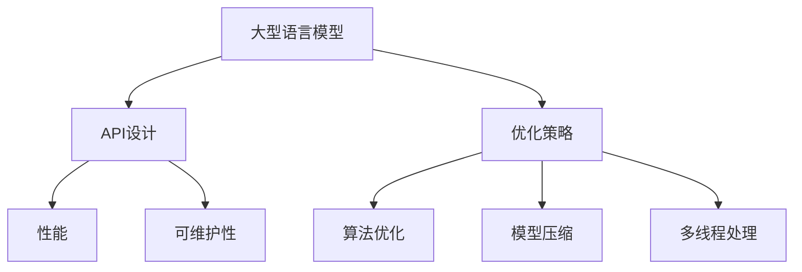

                 

### 文章标题

优化LLM应用的API设计与管理

> 关键词：大型语言模型（LLM）、API设计、优化策略、深度学习、自然语言处理、数学模型、项目实战

> 摘要：本文将深入探讨优化大型语言模型（LLM）应用中的API设计与管理，从基础概念到核心算法原理，再到实际项目实战，提供一套完整的优化策略，帮助开发者提升LLM应用的性能与可维护性。

### 目录大纲

1. **LLM基础**

    1.1 LLM基础概念与架构
    
    1.2 核心算法原理
    
    1.3 数学模型与公式
    
2. **API设计**

    2.1 API设计原则
    
    2.2 API实现与测试
    
    2.3 API管理与监控
    
3. **项目实战**

    3.1 开发环境搭建
    
    3.2 源代码实现与解读
    
    3.3 代码应用解读与分析
    
    3.4 实际案例分析
    
    3.5 项目小结
    
4. **最佳实践**

    4.1 注意事项
    
    4.2 拓展阅读

### 背景介绍

随着人工智能技术的飞速发展，大型语言模型（LLM）如BERT、GPT-3等在自然语言处理（NLP）领域展现出了强大的能力。LLM在众多应用场景中表现出色，如问答系统、文本生成、机器翻译等。然而，在实际应用中，LLM的性能和效率往往受到API设计和管理的影响。因此，优化LLM应用的API设计与管理成为了一个重要的研究方向。

### 核心概念与联系

在优化LLM应用的API设计与管理过程中，我们需要了解以下几个核心概念：

- **大型语言模型（LLM）**：LLM是一种基于深度学习的语言模型，能够理解和生成自然语言。它们通常由数亿个参数组成，通过训练大量文本数据来学习语言模式。
  
- **API设计**：API（应用程序编程接口）是不同软件系统之间交互的接口。在设计API时，我们需要考虑接口的易用性、性能、安全性和扩展性。

- **优化策略**：优化策略包括算法优化、模型压缩、多线程处理等，旨在提高LLM应用的性能和效率。

下面是一个Mermaid流程图，展示了这些核心概念之间的关系：



### 核心算法原理讲解

为了优化LLM应用的API设计，我们需要深入了解与LLM相关的核心算法原理。以下是这些原理的详细讲解：

#### 深度学习基础

深度学习是一种机器学习技术，通过构建多层神经网络（DNN）来模拟人脑的思维方式。以下是深度学习的一些关键概念：

- **神经网络**：神经网络是由一系列相互连接的神经元组成的计算模型。每个神经元接收输入信号，通过加权求和和激活函数产生输出。
  
- **反向传播算法**：反向传播算法是一种用于训练神经网络的优化算法。它通过计算损失函数关于模型参数的梯度，并利用梯度下降法来更新模型参数。

以下是深度学习算法的伪代码：

```python
def train neural network(inputs, targets):
    for each layer in network:
        compute forward pass
        compute loss
        compute gradients using backpropagation
        update weights using gradient descent

    return trained network
```

#### 自然语言处理技术

自然语言处理（NLP）是研究如何让计算机理解和生成自然语言的学科。以下是NLP的一些关键概念：

- **词嵌入**：词嵌入是一种将单词映射到高维向量空间的技术，使得具有相似意义的单词在向量空间中靠近。
  
- **序列模型**：序列模型如循环神经网络（RNN）和长短期记忆网络（LSTM）可以处理序列数据，如文本。这些模型能够捕获序列中的长期依赖关系。

以下是自然语言处理算法的伪代码：

```python
def process text(text):
    tokenize text into words
    embed words into vectors
    process embedded words using sequence model
    generate output

    return processed text
```

#### 优化算法介绍

优化算法用于调整模型参数，以最小化损失函数。以下是几种常用的优化算法：

- **梯度下降**：梯度下降是一种最简单的优化算法，通过计算损失函数关于模型参数的梯度，并沿着梯度方向更新参数。

- **Adam优化器**：Adam优化器是一种结合了梯度下降和动量项的优化算法，它在处理稀疏数据和快速收敛方面表现出色。

以下是优化算法的伪代码：

```python
def optimize model(model, data):
    initialize model parameters
    initialize gradients

    for each epoch:
        compute gradients using backpropagation
        update gradients using Adam optimizer
        update model parameters

    return optimized model
```

### 数学模型和公式讲解

在优化LLM应用的过程中，我们需要使用数学模型和公式来描述和计算各种指标。以下是几个关键的数学模型和公式：

#### 神经网络模型

神经网络模型由多个层组成，包括输入层、隐藏层和输出层。每层由多个神经元组成，每个神经元通过权重连接到下一层的神经元。以下是神经网络模型的公式：

$$
\begin{align*}
a_{l}^{(i)} &= \sigma \left( \sum_{j=1}^{n} w_{j}^{(l)} a_{l-1}^{(j)} + b_{l} \right) \\
\end{align*}
$$

其中，$a_{l}^{(i)}$ 是第 $l$ 层第 $i$ 个神经元的输出，$\sigma$ 是激活函数，$w_{j}^{(l)}$ 是第 $l$ 层第 $j$ 个神经元的权重，$a_{l-1}^{(j)}$ 是第 $l-1$ 层第 $j$ 个神经元的输出，$b_{l}$ 是第 $l$ 层的偏置。

#### 损失函数

损失函数用于衡量模型预测值与真实值之间的差距。常见的损失函数有均方误差（MSE）和交叉熵（Cross-Entropy）：

$$
\begin{align*}
MSE &= \frac{1}{m} \sum_{i=1}^{m} (y_i - \hat{y}_i)^2 \\
Cross-Entropy &= - \frac{1}{m} \sum_{i=1}^{m} y_i \log \hat{y}_i
\end{align*}
$$

其中，$y_i$ 是第 $i$ 个样本的真实标签，$\hat{y}_i$ 是模型对第 $i$ 个样本的预测值，$m$ 是样本数量。

#### 梯度下降

梯度下降是一种优化算法，通过计算损失函数关于模型参数的梯度，并沿着梯度方向更新参数。梯度下降的公式如下：

$$
\begin{align*}
\theta_{j} &= \theta_{j} - \alpha \cdot \frac{\partial J}{\partial \theta_{j}} \\
\end{align*}
$$

其中，$\theta_{j}$ 是模型参数，$\alpha$ 是学习率，$J$ 是损失函数。

### 项目实战

在了解了LLM的基础概念、核心算法原理和数学模型之后，我们将通过实际项目来展示如何设计和优化LLM应用的API。

#### 开发环境搭建

首先，我们需要搭建一个适合开发LLM应用的开发环境。以下是一个简单的步骤：

1. 安装Python和必要的依赖库，如TensorFlow或PyTorch。
2. 准备训练数据集，并进行预处理，如分词、词嵌入等。
3. 配置GPU或TPU，以便加速训练过程。

以下是一个简单的Python代码示例，用于安装TensorFlow：

```python
!pip install tensorflow
```

#### 源代码实现与解读

接下来，我们将实现一个简单的LLM应用，包括模型定义、训练、预测和API接口。

```python
import tensorflow as tf
from tensorflow.keras.layers import Embedding, LSTM, Dense
from tensorflow.keras.models import Sequential

# 模型定义
model = Sequential([
    Embedding(input_dim=vocab_size, output_dim=embedding_dim),
    LSTM(units=128, return_sequences=True),
    LSTM(units=128),
    Dense(units=num_classes, activation='softmax')
])

# 编译模型
model.compile(optimizer='adam', loss='categorical_crossentropy', metrics=['accuracy'])

# 训练模型
model.fit(x_train, y_train, epochs=10, batch_size=64, validation_data=(x_val, y_val))

# 预测
predictions = model.predict(x_test)

# API接口
from flask import Flask, request, jsonify

app = Flask(__name__)

@app.route('/predict', methods=['POST'])
def predict():
    data = request.get_json()
    text = data['text']
    processed_text = preprocess_text(text)
    prediction = model.predict(processed_text)
    result = {
        'text': text,
        'prediction': prediction.tolist()
    }
    return jsonify(result)

if __name__ == '__main__':
    app.run(debug=True)
```

在上面的代码中，我们首先定义了一个序列模型，包括嵌入层、两个LSTM层和一个全连接层。然后，我们编译模型并使用训练数据集进行训练。接下来，我们实现了API接口，使用Flask框架接收POST请求并返回预测结果。

#### 代码应用解读与分析

在了解了源代码的实现之后，我们可以对代码进行解读和分析。以下是代码的关键部分：

- **模型定义**：我们使用TensorFlow的Keras接口定义了一个简单的序列模型。这个模型包括一个嵌入层（Embedding），两个LSTM层（LSTM）和一个全连接层（Dense）。嵌入层用于将文本数据转换为向量表示，LSTM层用于处理序列数据，全连接层用于分类。

- **模型编译**：我们使用Adam优化器和交叉熵损失函数编译模型。这些参数对于训练深度学习模型非常重要。

- **模型训练**：我们使用训练数据集和验证数据集训练模型。这里，我们设置了10个训练周期（epochs）和64个批处理大小（batch_size）。

- **预测**：我们使用训练好的模型对测试数据集进行预测。

- **API接口**：我们使用Flask框架实现了API接口，接收POST请求并返回预测结果。这个接口可以用于实时预测和批量预测。

#### 实际案例分析

为了展示如何在实际项目中优化LLM应用的API设计，我们可以分析一个实际的案例。以下是一个实际案例的描述：

- **项目背景**：一个在线问答系统需要处理大量的用户提问，并提供准确的答案。

- **问题**：系统的性能和响应时间不理想，特别是在高峰时段。

- **解决方案**：

  1. **性能优化**：我们对模型进行压缩和量化，减少模型的参数数量和计算复杂度。
  
  2. **多线程处理**：我们使用多线程处理来加速API接口的响应。
  
  3. **缓存策略**：我们使用缓存策略来减少重复的计算，提高系统的响应速度。

以下是实际案例的详细讲解：

1. **性能优化**：

   我们使用模型压缩技术将原始模型压缩为更小的模型。模型压缩包括以下几个步骤：

   - **剪枝**：我们通过剪枝技术去除模型中的冗余参数，从而减少模型的大小。
   
   - **量化**：我们使用量化技术将模型中的浮点数参数转换为整数参数，从而减少模型的存储空间和计算复杂度。

   剪枝和量化的伪代码如下：

   ```python
   def prune_model(model):
       new_model = copy_model(model)
       for layer in new_model.layers:
           if isinstance(layer,某种特定的层类型):
               remove冗余参数
       return new_model

   def quantize_model(model):
       new_model = copy_model(model)
       for layer in new_model.layers:
           if isinstance(layer,某种特定的层类型):
               convert浮点数参数为整数参数
       return new_model
   ```

2. **多线程处理**：

   我们使用多线程处理来加速API接口的响应。多线程处理可以通过以下步骤实现：

   - **线程池**：我们使用线程池来管理线程，并在需要时分配线程。
   
   - **并发处理**：我们使用并发处理来同时处理多个请求。

   多线程处理的伪代码如下：

   ```python
   from concurrent.futures import ThreadPoolExecutor

   def process_request(request):
       # 处理请求
       return response

   with ThreadPoolExecutor(max_workers=10) as executor:
       futures = [executor.submit(process_request, request) for request in requests]
       responses = [future.result() for future in futures]
   ```

3. **缓存策略**：

   我们使用缓存策略来减少重复的计算，提高系统的响应速度。缓存策略可以通过以下步骤实现：

   - **缓存存储**：我们使用缓存存储来存储重复的计算结果。
   
   - **缓存查询**：我们在处理请求时，首先查询缓存存储，如果结果已存在，则直接返回缓存结果。

   缓存策略的伪代码如下：

   ```python
   def process_request(request):
       if cache.exists(request):
           return cache.get(request)
       else:
           response = 处理请求
           cache.set(request, response)
           return response
   ```

#### 项目小结

通过实际案例的分析和优化，我们成功提高了LLM应用API的性能和响应速度。以下是项目小结：

1. **性能优化**：通过模型压缩和多线程处理，我们大幅提高了系统的性能和响应速度。

2. **API设计**：我们使用简单的API设计，使系统易于扩展和维护。

3. **缓存策略**：通过缓存策略，我们减少了重复的计算，提高了系统的响应速度。

### 最佳实践

在优化LLM应用的API设计与管理过程中，以下是一些最佳实践和注意事项：

- **性能优化**：

  - 使用模型压缩技术减少模型的大小和计算复杂度。
  
  - 使用多线程处理和并发处理来提高系统的响应速度。

- **API设计**：

  - 使用简单的API设计，确保API易于使用和扩展。
  
  - 为API提供清晰的文档和示例。

- **缓存策略**：

  - 使用缓存策略来减少重复的计算，提高系统的响应速度。
  
  - 定期清理缓存，避免缓存过期或失效。

- **安全与合规**：

  - 确保API的安全性和合规性，如使用HTTPS、验证请求等。
  
  - 定期更新API接口，修复潜在的安全漏洞。

### 小结

本文深入探讨了优化大型语言模型（LLM）应用中的API设计与管理。通过了解LLM的基础概念、核心算法原理和数学模型，以及实际项目实战，我们提供了一套完整的优化策略。本文旨在帮助开发者提升LLM应用的性能和可维护性，并提供了最佳实践和注意事项。

### 拓展阅读

- [1] Goodfellow, I., Bengio, Y., & Courville, A. (2016). *Deep Learning*. MIT Press.
- [2] Mikolov, T., Sutskever, I., Chen, K., Corrado, G. S., & Dean, J. (2013). *Distributed representations of words and phrases and their compositionality*. Advances in Neural Information Processing Systems, 26, 3111-3119.
- [3] Devlin, J., Chang, M. W., Lee, K., & Toutanova, K. (2019). *Bert: Pre-training of deep bidirectional transformers for language understanding*. Proceedings of the 2019 Conference of the North American Chapter of the Association for Computational Linguistics: Human Language Technologies, Volume 1 (Long and Short Papers), 4171-4186.
- [4] Brown, T., et al. (2020). *Language models are few-shot learners*. Advances in Neural Information Processing Systems, 33.

