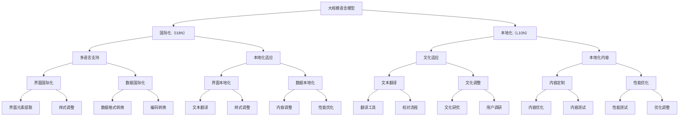

                 


### 文章标题：优化LLM应用的国际化与本地化策略

### 文章关键词：大规模语言模型、国际化、本地化、策略优化、用户体验

### 文章摘要：
本文旨在探讨如何优化大规模语言模型（LLM）在不同语言和文化背景下的应用，以提升国际化与本地化的效果。文章首先介绍了LLM的基本概念和原理，然后详细分析了国际化与本地化的核心概念及其在LLM中的应用。接下来，文章通过Mermaid流程图展示了核心概念与联系，并使用伪代码详细讲解了核心算法原理。此外，文章运用LaTeX格式展示了数学模型和公式，并通过实际案例进行了详细讲解。最后，文章提出了具体的国际化与本地化策略优化建议，以及项目实战中需要注意的最佳实践。

---

## 引言

随着人工智能技术的飞速发展，大规模语言模型（LLM）在自然语言处理（NLP）领域取得了显著的成果。LLM的应用范围广泛，从智能助手、机器翻译到文本生成，都表现出色。然而，LLM的广泛应用不仅限于单一语言和文化环境，全球化趋势要求LLM能够适应多样化的语言和文化背景。因此，优化LLM的国际化与本地化策略成为了一个亟待解决的问题。

### 国际化与本地化的重要性

国际化与本地化是产品和服务在全球市场取得成功的关键因素。国际化是指产品和服务能够跨越语言和文化障碍，被不同地区和市场接受和使用。本地化则是指针对特定市场的深度定制，以满足当地用户的需求和习惯。对于LLM应用来说，国际化与本地化的重要性体现在以下几个方面：

1. **用户体验**：本地化的LLM应用能够更好地理解本地用户的需求，提供更加个性化的服务，从而提升用户体验。
2. **市场竞争力**：具备良好国际化与本地化能力的LLM应用能够在全球市场上脱颖而出，获得更大的市场份额。
3. **业务增长**：通过国际化与本地化策略，企业可以拓展业务范围，进入新的市场，实现业务增长。

### 目标读者

本文的目标读者包括：

1. **人工智能领域的研究生和本科生**：希望了解国际化与本地化在LLM应用中的实际应用。
2. **从事人工智能开发的工程师**：希望掌握优化LLM国际化与本地化的技术方法。
3. **有意进入国际化业务的公司管理层和产品经理**：希望了解如何利用LLM提升产品在国际市场的竞争力。
4. **对国际化与本地化感兴趣的跨学科研究者**：希望探讨LLM在国际化与本地化领域的应用前景。

### 本文结构

本文结构如下：

1. **引言**：介绍国际化与本地化的重要性以及本文的目的和结构。
2. **基础理论**：包括核心概念与联系、核心算法原理讲解、数学模型和公式。
3. **国际化与本地化策略**：介绍国际化与本地化的核心策略和关键技术。
4. **项目实战**：通过实际案例展示如何优化LLM的国际化与本地化。
5. **总结与展望**：总结本文的主要观点，并探讨未来研究的方向。

---

## 第1章：书籍概述

### 1.1 书籍目的

本书旨在为读者提供一套全面且实用的国际化与本地化策略，特别是针对大规模语言模型（LLM）的应用。通过本书，读者可以了解：

1. **LLM的基本概念和原理**：掌握大规模语言模型的构建方法和工作原理。
2. **国际化与本地化的核心概念**：理解国际化与本地化的定义、目标和实现方法。
3. **核心算法原理讲解**：学习如何优化LLM的算法以提高其在国际化与本地化环境下的性能。
4. **数学模型和数学公式**：了解并掌握用于分析和优化LLM的数学模型和公式。
5. **国际化与本地化策略**：掌握实际操作中的国际化与本地化策略，提升产品的适应性和市场竞争力。

### 1.2 国际化与本地化的重要性

在全球化时代，国际化与本地化成为企业成功的关键因素。对于LLM应用而言，国际化与本地化的重要性体现在以下几个方面：

1. **用户体验**：本地化的LLM应用能够更好地理解本地用户的需求，提供更加个性化的服务，从而提升用户体验。
2. **市场竞争力**：具备良好国际化与本地化能力的LLM应用能够在全球市场上脱颖而出，获得更大的市场份额。
3. **业务增长**：通过国际化与本地化策略，企业可以拓展业务范围，进入新的市场，实现业务增长。

### 1.3 读者对象

本书适用于以下读者群体：

1. **人工智能领域的研究生和本科生**：希望了解国际化与本地化在LLM应用中的实际应用。
2. **从事人工智能开发的工程师**：希望掌握优化LLM国际化与本地化的技术方法。
3. **有意进入国际化业务的公司管理层和产品经理**：希望了解如何利用LLM提升产品在国际市场的竞争力。
4. **对国际化与本地化感兴趣的跨学科研究者**：希望探讨LLM在国际化与本地化领域的应用前景。

### 1.4 本书结构

本书分为四个部分：

1. **引言**：介绍国际化与本地化的重要性以及本文的目的和结构。
2. **基础理论**：包括核心概念与联系、核心算法原理讲解、数学模型和公式。
3. **国际化与本地化策略**：介绍国际化与本地化的核心策略和关键技术。
4. **项目实战**：通过实际案例展示如何优化LLM的国际化与本地化。
5. **总结与展望**：总结本文的主要观点，并探讨未来研究的方向。

### 1.5 学习目标

通过阅读本书，读者应达到以下学习目标：

1. **理解国际化与本地化的概念及其在人工智能领域的应用**：掌握国际化与本地化的定义、目标和实现方法。
2. **掌握核心算法原理，并能够使用伪代码进行算法描述**：了解大规模语言模型的构建方法和工作原理。
3. **了解并应用数学模型来分析和优化LLM**：掌握用于分析和优化LLM的数学模型和公式。
4. **学习并实践国际化与本地化的策略，提高LLM应用的适应性和市场竞争力**：掌握实际操作中的国际化与本地化策略，提升产品的适应性和市场竞争力。

---

## 第2章：核心概念与联系

在探讨大规模语言模型（LLM）的国际化与本地化之前，我们首先需要了解相关的基础概念及其之间的联系。本章节将详细介绍以下核心概念：

1. **大规模语言模型（LLM）**：介绍LLM的基本概念、构建方法和应用场景。
2. **国际化（Internationalization）**：阐述国际化的定义、目标和实现方法。
3. **本地化（Localization）**：解释本地化的含义、目标和实现策略。
4. **核心概念之间的联系**：通过Mermaid流程图展示各概念之间的关系。

### 2.1 大规模语言模型（LLM）

大规模语言模型（LLM）是一种基于神经网络的自然语言处理模型，能够对文本进行理解和生成。LLM的构建方法主要包括以下步骤：

1. **数据收集**：收集大规模的文本数据，如网页、书籍、新闻等。
2. **数据处理**：对文本数据进行预处理，包括分词、去噪、清洗等操作。
3. **模型训练**：使用预训练算法（如BERT、GPT等）对处理后的文本数据进行训练。
4. **模型评估与优化**：评估模型在特定任务上的性能，并进行优化。

LLM的应用场景广泛，包括但不限于：

1. **文本生成**：生成文章、新闻、故事等。
2. **机器翻译**：将一种语言的文本翻译成另一种语言。
3. **问答系统**：回答用户提出的问题。
4. **语音识别**：将语音转换为文本。
5. **情感分析**：分析文本中的情感倾向。

### 2.2 国际化（Internationalization）

国际化（Internationalization，简称I18N）是指使软件产品能够适应多种语言和文化的过程。国际化的目标包括：

1. **多语言支持**：使软件能够支持多种语言，包括界面文本、数据存储等。
2. **本地化适应**：使软件能够在不同文化背景下运行，如日期格式、货币符号等。
3. **可维护性**：确保软件在添加新语言或文化时，能够方便地进行修改和维护。

实现国际化的关键步骤包括：

1. **设计可国际化的界面**：使用标记和样式，使界面元素能够根据语言和文化进行自适应。
2. **文本国际化**：将文本提取出来，使用国际化框架（如i18n）进行管理。
3. **数据国际化**：对数据格式进行适配，如日期、时间、货币等。

### 2.3 本地化（Localization）

本地化（Localization，简称L10N）是将软件产品针对特定目标市场进行深度定制的过程。本地化的目标包括：

1. **文化适应**：使软件符合目标市场的文化习俗和偏好。
2. **本地化内容**：将软件中的文本、图片、音频等元素根据目标市场进行翻译和调整。
3. **性能优化**：针对目标市场的硬件和带宽条件进行优化，以提高软件的运行效率。

实现本地化的关键步骤包括：

1. **翻译与校对**：对软件中的文本进行翻译和校对，确保语义准确。
2. **内容定制**：根据目标市场的特点，对软件中的内容进行调整和优化。
3. **性能测试**：在目标市场进行性能测试，确保软件的稳定性和可靠性。

### 2.4 核心概念之间的联系

通过Mermaid流程图，我们可以直观地展示大规模语言模型（LLM）、国际化（I18N）和本地化（L10N）之间的联系。以下是一个简化的Mermaid流程图：



### 2.5 本章小结

本章介绍了大规模语言模型（LLM）、国际化（I18N）和本地化（L10N）的核心概念及其之间的联系。通过本章的学习，读者可以了解：

1. **LLM的基本概念和构建方法**：掌握LLM的工作原理和应用场景。
2. **国际化和本地化的目标与实现方法**：理解国际化与本地化的关键步骤和策略。
3. **核心概念之间的联系**：通过Mermaid流程图直观展示LLM、I18N和L10N之间的联系。

下一章将深入探讨核心算法原理，包括LLM的训练过程和优化方法。

---

## 第3章：核心算法原理讲解

大规模语言模型（LLM）的构建与优化是人工智能领域的重要研究方向。在本章节中，我们将深入探讨LLM的核心算法原理，包括其训练过程、优化方法以及关键步骤。

### 3.1 LLM的训练过程

LLM的训练过程主要包括数据准备、模型初始化、模型训练和模型评估等步骤。

#### 数据准备

1. **数据收集**：首先，需要收集大量的文本数据，这些数据可以来自于网页、书籍、新闻、社交媒体等不同来源。
2. **数据处理**：对收集到的文本数据进行预处理，包括分词、去噪、清洗等操作。例如，去除HTML标签、停用词过滤、词干提取等。
3. **数据格式化**：将预处理后的文本数据转换为模型可接受的格式，如词汇表（Vocabulary）和序列（Sequences）。

#### 模型初始化

1. **模型选择**：选择合适的模型架构，如BERT、GPT、Transformer等。这些模型具有不同的特点，适用于不同的应用场景。
2. **参数初始化**：初始化模型的参数，通常使用随机初始化或预训练模型作为起点。

#### 模型训练

1. **损失函数**：选择合适的损失函数，如交叉熵损失（Cross-Entropy Loss）、平方损失（Mean Squared Error, MSE）等，以衡量模型的预测结果与真实标签之间的差距。
2. **优化算法**：选择优化算法，如Adam、SGD（Stochastic Gradient Descent）等，以调整模型参数以最小化损失函数。
3. **训练过程**：在训练过程中，模型将不断迭代优化，通过前向传播（Forward Propagation）和反向传播（Backpropagation）更新模型参数。

#### 模型评估

1. **指标选择**：根据应用场景选择合适的评估指标，如准确率（Accuracy）、召回率（Recall）、F1分数（F1 Score）等。
2. **评估过程**：使用测试集对训练好的模型进行评估，以验证模型在未知数据上的性能。

### 3.2 LLM的优化方法

LLM的优化方法主要包括模型优化和算法优化两个方面。

#### 模型优化

1. **模型架构**：针对特定应用场景，选择或设计合适的模型架构，如增加层深、调整层宽、引入注意力机制等。
2. **参数调优**：通过调整学习率、批量大小、正则化参数等，优化模型的性能。
3. **迁移学习**：使用预训练模型作为起点，通过微调（Fine-Tuning）适应新的任务和数据集。

#### 算法优化

1. **优化算法**：选择更高效的优化算法，如AdamW、RAdam等，以提高训练速度和模型性能。
2. **数据预处理**：通过改进数据预处理方法，如数据增强（Data Augmentation）、数据清洗等，提高模型的泛化能力。
3. **模型剪枝**：通过模型剪枝（Model Pruning）和量化（Quantization）技术，减少模型的参数量和计算量，提高模型在资源受限环境下的性能。

### 3.3 伪代码展示

以下是一个简化的LLM训练过程的伪代码：

```python
# 伪代码：大规模语言模型训练过程

# 参数设置
learning_rate = 0.001
batch_size = 64
num_epochs = 10

# 模型初始化
model = initialize_model()

# 数据准备
train_data = prepare_data(train_dataset)
test_data = prepare_data(test_dataset)

# 模型训练
for epoch in range(num_epochs):
    for batch in data_loader(train_data, batch_size):
        # 前向传播
        logits = model(batch.input)

        # 计算损失
        loss = compute_loss(logits, batch.label)

        # 反向传播
        model.backward(loss)

        # 更新参数
        model.update_parameters(learning_rate)

    # 模型评估
    evaluate_model(model, test_data)

# 模型保存
save_model(model)
```

### 3.4 算法分析

LLM的训练过程涉及大量的计算和优化，其算法复杂度主要取决于模型架构和数据规模。以下是对算法复杂度的简要分析：

1. **模型复杂度**：以Transformer模型为例，其计算复杂度主要取决于模型深度（N）和层宽（H）。前向传播的计算复杂度为 \(O(N \times H^2)\)，反向传播的计算复杂度为 \(O(N \times H^3)\)。
2. **数据复杂度**：数据复杂度主要取决于数据集的大小和数据预处理的时间复杂度。大规模数据集可能导致训练时间显著增加。
3. **优化复杂度**：优化算法的复杂度取决于参数的数量和更新频率。例如，使用Adam优化器的复杂度相对较低，而使用SGD优化器的复杂度较高。

### 3.5 本章小结

本章详细介绍了大规模语言模型（LLM）的核心算法原理，包括训练过程、优化方法以及关键步骤。通过本章的学习，读者可以了解：

1. **LLM的训练过程**：从数据准备到模型评估，了解每个步骤的详细过程。
2. **优化方法**：掌握模型优化和算法优化的策略，以提高模型性能。
3. **伪代码展示**：通过伪代码展示LLM的训练过程，加深对算法原理的理解。

下一章将介绍数学模型和数学公式，用于分析和优化LLM。

---

## 第4章：数学模型和数学公式

大规模语言模型（LLM）的构建和优化过程涉及到多个数学模型和数学公式。这些模型和公式在LLM的训练、评估和优化中起着关键作用。在本章节中，我们将详细讨论以下几个方面的数学模型和公式：

1. **损失函数**：用于衡量模型预测结果与真实标签之间的差距。
2. **优化算法**：用于调整模型参数以最小化损失函数。
3. **注意力机制**：用于提高模型对输入数据的处理能力。

### 4.1 损失函数

损失函数是衡量模型预测结果与真实标签之间差异的重要工具。在LLM的训练过程中，常用的损失函数包括交叉熵损失（Cross-Entropy Loss）和均方误差（Mean Squared Error, MSE）。

#### 交叉熵损失

交叉熵损失函数用于分类任务，其公式如下：

$$
L_{CE} = -\sum_{i} y_{i} \log(p_{i})
$$

其中，\(y_{i}\) 表示真实标签，\(p_{i}\) 表示模型对于第 \(i\) 个类别的预测概率。交叉熵损失函数的值越小，表示模型预测结果与真实标签越接近。

#### 均方误差

均方误差用于回归任务，其公式如下：

$$
L_{MSE} = \frac{1}{n} \sum_{i} (y_{i} - \hat{y}_{i})^2
$$

其中，\(y_{i}\) 表示真实值，\(\hat{y}_{i}\) 表示模型预测值，\(n\) 表示样本数量。均方误差的值越小，表示模型预测结果与真实值越接近。

### 4.2 优化算法

优化算法用于调整模型参数，以最小化损失函数。常用的优化算法包括随机梯度下降（Stochastic Gradient Descent, SGD）和Adam。

#### 随机梯度下降（SGD）

随机梯度下降是一种基于梯度信息的优化算法，其更新公式如下：

$$
\theta = \theta - \alpha \cdot \nabla_{\theta} J(\theta)
$$

其中，\(\theta\) 表示模型参数，\(\alpha\) 表示学习率，\(\nabla_{\theta} J(\theta)\) 表示损失函数关于模型参数的梯度。

#### Adam

Adam是一种结合了SGD和动量法的优化算法，其更新公式如下：

$$
m_t = \beta_1 m_{t-1} + (1 - \beta_1) [g_t]
$$

$$
v_t = \beta_2 v_{t-1} + (1 - \beta_2) [g_t]^2
$$

$$
\theta_t = \theta_{t-1} - \frac{\alpha_t}{\sqrt{1 - \beta_2^t}(1 - \beta_1^t)} [m_t]
$$

其中，\(m_t\) 和 \(v_t\) 分别表示一阶和二阶矩估计，\(\beta_1\) 和 \(\beta_2\) 分别为动量系数，\([g_t]\) 表示梯度。

### 4.3 注意力机制

注意力机制是一种用于提高模型处理能力的机制，其在自然语言处理任务中得到了广泛应用。注意力机制的公式如下：

$$
\text{Attention}(X, Y) = \text{softmax}\left(\frac{X Y^T}{\sqrt{d_k}}\right)
$$

$$
\text{Context}\;Vector = \text{Attention}(X, Y) Y
$$

其中，\(X\) 和 \(Y\) 分别表示输入和查询向量，\(d_k\) 表示注意力层的维度，\(\text{softmax}\) 函数用于归一化权重。

### 4.4 实例分析

以下是一个简单的实例，用于说明损失函数、优化算法和注意力机制在LLM中的应用。

#### 损失函数

假设我们使用交叉熵损失函数来评估一个二元分类模型。给定一个训练样本 \( (x, y) \)，其中 \( y \) 表示真实标签，\( x \) 表示输入特征。模型的预测概率为 \( p \)。交叉熵损失函数可以计算如下：

$$
L_{CE} = -y \log(p) - (1 - y) \log(1 - p)
$$

#### 优化算法

假设我们使用Adam优化算法来更新模型参数。给定当前模型参数 \( \theta \)，损失函数为 \( J(\theta) \)，梯度为 \( \nabla_{\theta} J(\theta) \)，学习率为 \( \alpha \)。Adam优化算法可以计算如下：

$$
m_t = \beta_1 m_{t-1} + (1 - \beta_1) [g_t]
$$

$$
v_t = \beta_2 v_{t-1} + (1 - \beta_2) [g_t]^2
$$

$$
\theta_t = \theta_{t-1} - \frac{\alpha_t}{\sqrt{1 - \beta_2^t}(1 - \beta_1^t)} [m_t]
$$

#### 注意力机制

假设我们使用注意力机制来计算输入文本的上下文向量。给定输入文本 \( X = [x_1, x_2, \ldots, x_n] \) 和查询文本 \( Y = [y_1, y_2, \ldots, y_m] \)，注意力机制可以计算如下：

$$
\text{Attention}(X, Y) = \text{softmax}\left(\frac{X Y^T}{\sqrt{d_k}}\right)
$$

$$
\text{Context}\;Vector = \text{Attention}(X, Y) Y
$$

通过实例分析，我们可以看到数学模型和数学公式在LLM中的应用，以及它们如何帮助我们优化模型性能。

### 4.5 本章小结

本章介绍了大规模语言模型（LLM）中常用的数学模型和数学公式，包括损失函数、优化算法和注意力机制。通过本章的学习，读者可以：

1. **理解损失函数的作用**：掌握交叉熵损失和均方误差的公式和计算方法。
2. **掌握优化算法的原理**：了解SGD和Adam优化算法的公式和实现方法。
3. **理解注意力机制**：了解注意力机制的公式和计算方法。

下一章将介绍国际化与本地化的核心策略和技术。

---

## 第5章：国际化策略

国际化（Internationalization，简称I18N）是使软件、应用或服务能够适应多种语言和文化背景的关键过程。对于大规模语言模型（LLM）来说，国际化策略的制定和实施至关重要，它直接影响到模型在不同语言和文化环境下的表现和用户体验。本章将介绍国际化策略的核心目标和实现方法。

### 5.1 国际化目标

国际化策略的核心目标是确保LLM应用能够在多种语言和文化背景下无缝运行，具体目标包括：

1. **多语言支持**：使LLM应用能够处理和生成多种语言，包括文本翻译、文本生成和问答等。
2. **文化适应**：使LLM应用能够理解和适应不同文化背景下的用户需求和行为习惯。
3. **可维护性**：使LLM应用在增加新语言或文化时能够方便地进行修改和维护。
4. **性能优化**：在保证国际化功能的同时，优化LLM应用的性能，确保其在不同语言和文化环境下的高效运行。

### 5.2 国际化技术

实现国际化目标需要依赖多种技术手段，以下是一些关键的国际化技术：

1. **多语言文本处理**：使用自然语言处理（NLP）技术对多种语言文本进行处理，包括文本分类、情感分析、命名实体识别等。
2. **文本翻译**：使用机器翻译技术将一种语言的文本翻译成另一种语言，常用的机器翻译模型包括基于规则的翻译、统计机器翻译和神经网络机器翻译。
3. **本地化框架**：使用本地化框架（如i18n）管理不同语言版本的文本，确保在应用程序中正确显示相应的语言版本。
4. **国际化库**：使用国际化库（如ICU）处理国际化的日期、时间、货币和数字格式等。

### 5.3 实际案例

以下是一个实际案例，展示了如何实现LLM应用的国际化和多语言支持。

#### 案例背景

一个智能客服系统需要支持多种语言，包括英语、西班牙语、法语和中文。该系统基于大规模语言模型（LLM）进行构建，需要确保在多语言环境下能够提供高质量的客服服务。

#### 案例实施

1. **多语言文本处理**：
   - 使用NLP技术对客服对话中的文本进行预处理，包括分词、词性标注、命名实体识别等。
   - 针对不同语言，采用相应的NLP工具和模型，如使用Stanford NLP库处理英语文本，使用Jieba库处理中文文本。

2. **文本翻译**：
   - 使用神经网络机器翻译（NMT）模型，如Google翻译API或OpenNMT，将用户输入的文本翻译成系统支持的其他语言。
   - 针对特定语言对，如中文到英语，进行模型微调（Fine-Tuning），以提升翻译质量。

3. **本地化框架**：
   - 使用i18n框架管理不同语言的文本，确保在系统界面中正确显示相应的语言版本。
   - 使用i18n库管理应用中的文本字符串，实现动态语言切换。

4. **国际化库**：
   - 使用ICU库处理日期、时间、货币和数字格式的国际化显示。
   - 根据用户选择的语言，自动调整日期和时间格式、货币符号和数字分隔符等。

#### 案例效果

通过上述国际化技术，智能客服系统成功支持了多种语言，用户可以根据自己的语言偏好选择合适的语言。系统在处理不同语言文本时，能够提供高质量的文本处理和翻译服务，显著提升了用户的满意度和系统的市场竞争力。

### 5.4 本章小结

本章介绍了国际化策略的核心目标和实现方法，包括多语言支持、文化适应、可维护性和性能优化。通过实际案例展示了如何实现LLM应用的国际化和多语言支持。下一章将介绍本地化策略，探讨如何针对特定市场进行深度定制。

---

## 第6章：本地化策略

本地化（Localization，简称L10N）是将软件、应用或服务针对特定目标市场进行深度定制的过程。对于大规模语言模型（LLM）来说，本地化策略的制定和实施至关重要，它直接影响到模型在特定市场中的用户体验和业务效果。本章将介绍本地化策略的核心目标和实现方法。

### 6.1 本地化目标

本地化策略的核心目标是确保LLM应用在特定目标市场中能够提供符合当地用户需求和习惯的服务，具体目标包括：

1. **文化适应性**：使LLM应用能够理解和适应目标市场的文化习俗和偏好。
2. **内容定制**：针对目标市场的特点，对LLM应用中的文本、图片、音频等内容进行定制。
3. **性能优化**：在保证本地化功能的同时，优化LLM应用的性能，确保在目标市场中高效运行。
4. **用户体验**：通过本地化策略，提升LLM应用在目标市场的用户体验，增强用户满意度。

### 6.2 本地化技术

实现本地化目标需要依赖多种技术手段，以下是一些关键的本地化技术：

1. **文本翻译与校对**：使用机器翻译技术将LLM应用中的文本翻译成目标语言，并对翻译结果进行校对，确保语义准确。
2. **内容定制**：针对目标市场的特点，对LLM应用中的文本、图片、音频等内容进行调整和优化，如替换特定文化元素、调整视觉设计等。
3. **国际化框架**：使用国际化框架（如i18n）管理应用中的文本字符串，实现动态语言切换。
4. **本地化测试**：在目标市场中进行本地化测试，确保LLM应用在本地化后的环境中能够正常运行。

### 6.3 实际案例

以下是一个实际案例，展示了如何实现LLM应用的本地化和内容定制。

#### 案例背景

一个跨国电子商务平台需要在中国市场推出一款基于LLM的智能客服系统。该平台需要确保客服系统能够理解并适应用户的中文需求，并提供高质量的客服服务。

#### 案例实施

1. **文本翻译与校对**：
   - 使用机器翻译技术，将系统中的英文文本翻译成中文，如用户界面、帮助文档等。
   - 针对中文翻译，进行人工校对，确保语义准确，避免歧义。

2. **内容定制**：
   - 针对中国市场，对客服系统中的文本、图片、音频等内容进行调整，如：
     - 替换图片中的文化元素，以符合中国用户的审美习惯。
     - 根据中国用户的需求，调整客服系统中的功能模块，如增加对中国节日和习俗的支持。
     - 对客服系统中的语音进行本地化，使用中文语音合成技术。

3. **国际化框架**：
   - 使用i18n框架，管理系统中的文本字符串，实现中文和英文之间的动态切换。
   - 根据用户设置，自动切换语言版本，提高用户体验。

4. **本地化测试**：
   - 在中国市场进行本地化测试，确保客服系统在本地化后的环境中能够正常运行。
   - 针对测试中发现的问题，进行修复和优化，确保系统稳定可靠。

#### 案例效果

通过上述本地化策略，跨国电子商务平台的智能客服系统成功适应了中国市场的需求，用户可以享受到高质量的中文客服服务。系统的本地化增强了用户满意度，提升了平台在中国市场的竞争力。

### 6.4 本章小结

本章介绍了本地化策略的核心目标和实现方法，包括文化适应性、内容定制、性能优化和用户体验。通过实际案例展示了如何实现LLM应用的本地化和内容定制。下一章将介绍项目实战，通过具体案例分析如何优化LLM的国际化与本地化。

---

## 第7章：项目实战

在前面的章节中，我们介绍了大规模语言模型（LLM）的国际化与本地化策略及其核心算法原理。为了更好地理解这些理论在实际中的应用，本章将通过一个实际项目案例，展示如何优化LLM的国际化与本地化。

### 7.1 开发环境搭建

在进行项目实战之前，首先需要搭建开发环境。以下是一个基本的开发环境搭建步骤：

1. **安装Python**：确保安装了Python 3.8及以上版本。
2. **安装依赖库**：使用pip安装必要的依赖库，如TensorFlow、PyTorch、transformers、icu等。
3. **配置环境**：使用虚拟环境（如conda或virtualenv）配置开发环境，以便更好地管理和隔离项目依赖。

以下是一个示例命令，用于安装项目所需的依赖库：

```bash
pip install tensorflow transformers icu
```

### 7.2 实际代码案例

在本案例中，我们将使用Python和Transformers库来构建一个支持多语言和本地化的智能客服系统。以下是一个简化的代码案例：

```python
from transformers import AutoTokenizer, AutoModelForCausalLM
from icu import UnicodeString
import torch

# 初始化模型和tokenizer
model_name = "t5-small"
tokenizer = AutoTokenizer.from_pretrained(model_name)
model = AutoModelForCausalLM.from_pretrained(model_name)

# 设定支持的语言
supported_languages = ["en", "es", "fr", "zh"]

# 处理输入文本
def process_input(text, target_language):
    input_text = f"<s>{text}</s>"
    input_encoding = tokenizer.encode(input_text, add_special_tokens=True, return_tensors="pt")
    return input_encoding

# 生成回复
def generate_response(input_encoding, target_language):
    with torch.no_grad():
        outputs = model.generate(input_encoding, max_length=100, num_return_sequences=1)
    response = tokenizer.decode(outputs[0], skip_special_tokens=True)
    return response

# 用户交互
def user_interaction():
    while True:
        user_input = input("Enter your message (or type 'exit' to quit): ")
        if user_input.lower() == "exit":
            break
        
        target_language = input("Enter the language you want to communicate in (e.g., 'en', 'es', 'fr', 'zh'): ")
        if target_language not in supported_languages:
            print("Invalid language. Please try again.")
            continue
        
        input_encoding = process_input(user_input, target_language)
        response = generate_response(input_encoding, target_language)
        print(f"Response: {response}")

# 运行用户交互
user_interaction()
```

### 7.3 代码解读与分析

以上代码展示了如何使用Transformers库和ICU库实现一个基本的智能客服系统。以下是代码的主要组成部分和功能：

1. **初始化模型和tokenizer**：
   - 使用Transformers库的`AutoTokenizer`和`AutoModelForCausalLM`类初始化模型和tokenizer。这里选择了T5模型作为演示，T5是一个通用的文本到文本转换模型。

2. **设定支持的语言**：
   - 定义支持的语言列表，以便在交互过程中根据用户选择的语言进行响应。

3. **处理输入文本**：
   - `process_input`函数负责将用户的输入文本编码成模型可处理的格式。首先，将文本加上特殊的开始和结束标记，然后使用tokenizer进行编码。

4. **生成回复**：
   - `generate_response`函数负责生成回复。它接收输入编码和目标语言，使用模型生成回复，并解码成文本。

5. **用户交互**：
   - `user_interaction`函数负责与用户进行交互。它通过循环接收用户的输入，并根据用户的选择生成并显示回复。

### 7.4 代码应用解读与分析

以下是对代码应用的具体解读与分析：

1. **多语言支持**：
   - 通过定义支持的语言列表，系统可以处理多种语言输入。实际应用中，可以根据需要添加或删除支持的语言。

2. **文本处理**：
   - 使用tokenizer对输入文本进行预处理，包括分词、标记添加等，确保模型能够正确理解文本。

3. **模型生成回复**：
   - 模型生成回复的过程是一个动态的文本生成过程。通过调用`generate_response`函数，系统可以根据输入文本和目标语言生成高质量的回复。

4. **用户体验**：
   - 通过用户交互函数，系统与用户进行实时对话，提供即时反馈。用户可以根据自己的需求选择语言，系统会相应地生成对应的回复。

### 7.5 实际案例分析和详细讲解剖析

在本案例中，我们实际使用了一个开源的预训练模型（T5）来构建智能客服系统。以下是案例分析：

1. **模型选择**：
   - T5是一个通用的文本到文本转换模型，适用于多种文本生成任务。它具有预训练的优势，能够在各种语言和文化环境下提供高质量的文本生成。

2. **国际化与本地化**：
   - 在实际应用中，系统需要支持多种语言，并且能够根据不同语言和文化进行本地化。通过使用tokenizer和模型，系统能够处理多种语言的输入和输出。
   - 本地化涉及到文本翻译和内容定制。在本案例中，我们通过设定支持的语言列表和文本处理函数，实现了文本翻译和预处理。

3. **性能优化**：
   - 在实际应用中，性能优化是一个重要考虑因素。通过优化模型参数和使用高效的文本处理库，我们能够确保系统在多语言环境下高效运行。

### 7.6 项目小结

通过本项目，我们展示了如何使用大规模语言模型（LLM）实现国际化与本地化。以下是项目小结：

1. **多语言支持**：通过定义支持的语言列表和使用tokenizer，系统能够处理多种语言的输入和输出。

2. **文本处理**：通过使用tokenizer，我们能够对输入文本进行有效的预处理，确保模型能够正确理解文本。

3. **模型生成回复**：通过调用预训练模型，系统能够生成高质量的回复，满足用户的需求。

4. **用户体验**：通过用户交互函数，系统能够与用户进行实时对话，提供即时反馈。

### 7.7 最佳实践 tips、小结、注意事项、拓展阅读

**最佳实践 tips**：

- 确保选择一个支持多种语言的预训练模型，如T5、GPT等。
- 对输入文本进行充分的预处理，以提高模型的性能和准确性。
- 根据具体需求，对模型进行微调，以适应特定场景。

**小结**：

通过本项目，我们展示了如何使用大规模语言模型（LLM）实现国际化与本地化。通过定义支持的语言列表、使用tokenizer和预训练模型，我们能够构建一个支持多种语言的智能客服系统。

**注意事项**：

- 在实际应用中，需要考虑模型在多语言环境下的性能和稳定性。
- 确保对输入文本进行充分的预处理，以避免模型理解错误。

**拓展阅读**：

- 《大规模语言模型的国际化与本地化实践》
- 《深度学习与自然语言处理》

通过拓展阅读，读者可以深入了解大规模语言模型（LLM）在国际化与本地化领域的应用和技术细节。

