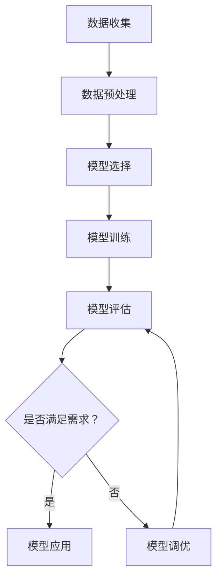

                 

## 文章标题

### 优化LLM应用的多语言支持策略

随着人工智能技术的飞速发展，语言模型（LLM，Language Model）已成为众多应用场景的核心组件，如自然语言处理、智能问答、机器翻译等。然而，面对全球多元的语言环境，如何在LLM应用中实现高效的多语言支持成为了一个亟待解决的问题。

本文将围绕优化LLM应用的多语言支持策略展开，旨在深入探讨多语言支持的挑战、基本原理、训练策略、评估与优化方法，以及实际应用中的优化策略。通过逻辑清晰、结构紧凑的论述，帮助读者全面理解并掌握多语言支持策略，为LLM应用的广泛推广和应用提供理论支持和实践指导。

## 文章关键词

- 语言模型
- 多语言支持
- 数据处理
- 模型训练
- 模型评估
- 实际应用

## 文章摘要

本文首先介绍了语言模型（LLM）的概念及其应用场景，接着探讨了多语言支持的重要性及面临的挑战。随后，详细阐述了多语言语言模型的基本原理、训练策略、评估与优化方法，以及实际应用中的优化策略。最后，本文通过具体案例分析，展示了多语言语言模型在不同场景中的应用及优化实践。通过本文的阅读，读者将能够全面掌握优化LLM应用的多语言支持策略。

## 第1章 绪论

### 1.1 语言模型概述

语言模型（Language Model，简称LM）是一种用于预测自然语言中下一个单词或字符的概率分布的算法。它的核心任务是理解自然语言中的语法、语义和上下文信息，从而为各种自然语言处理任务提供基础支持。语言模型的应用场景非常广泛，包括但不限于：

- 自然语言处理（NLP）：用于文本分类、情感分析、实体识别、文本摘要等任务。
- 智能问答：基于语言模型构建的问答系统，能够理解和回答用户的问题。
- 机器翻译：通过训练语言模型，实现不同语言之间的自动翻译。
- 聊天机器人：利用语言模型实现自然、流畅的对话交互。

### 1.2 多语言支持的重要性

在全球化的背景下，多语言支持成为各类应用的核心需求。以下是一些支持多语言的重要原因：

- **用户需求**：全球用户使用多种语言，提供多语言支持能够满足不同用户的需求，提升用户体验。
- **市场拓展**：对于企业而言，支持多语言可以拓宽市场，吸引更多国际用户，提高业务规模。
- **技术挑战**：多语言支持涉及复杂的技术实现，如数据稀缺性、语言多样性、语言转移和干扰问题等。

### 1.3 多语言支持的挑战

虽然多语言支持的重要性显而易见，但其实现过程中也面临着诸多挑战：

- **数据稀缺性**：不同语言的数据资源分布不均，某些语言的数据量相对较少，这为模型训练带来了困难。
- **语言多样性**：语言之间存在巨大的差异，包括语法结构、词汇、语义等，这对模型的设计和训练提出了更高的要求。
- **语言转移和干扰问题**：在多语言环境中，语言之间的相互影响会导致模型性能下降，需要有效的干扰消除策略。

## 第2章 多语言语言模型的基本原理

### 2.1 语言模型的核心概念

语言模型的核心概念包括词汇表、句法分析和意义理解。

- **词汇表**：词汇表是语言模型的基础，包含了所有可能的单词或字符。词汇表的构建直接影响模型的性能和效率。
- **句法分析**：句法分析旨在理解句子的结构，包括主语、谓语、宾语等成分的识别和解析。句法分析对于理解句子的语法结构至关重要。
- **意义理解**：意义理解是语言模型的终极目标，它涉及对句子或文本的语义分析，包括情感分析、实体识别等。意义理解有助于提升模型的智能化程度。

### 2.2 多语言模型的架构

多语言模型可以分为以下几种架构：

- **基于词向量的模型**：将每个单词映射到一个高维的向量空间，通过向量之间的相似性来预测下一个单词。
- **基于转换器的模型**：如BERT、GPT等，通过自注意力机制和多层神经网络实现，能够捕捉长距离依赖和上下文信息。
- **基于自编码器的模型**：通过编码器和解码器实现，能够自动学习输入数据的潜在表示。

### 2.3 多语言模型的工作流程

多语言模型的工作流程主要包括数据预处理、模型训练、模型评估和应用。

- **数据预处理**：包括数据清洗、分词、去停用词等，旨在提高数据的质量和一致性。
- **模型训练**：通过大量标注数据训练模型，学习单词、句子的概率分布和语义信息。
- **模型评估**：使用验证集或测试集评估模型的性能，常用的评估指标包括准确率、召回率、F1值等。
- **模型应用**：将训练好的模型部署到实际应用中，如智能问答、机器翻译等。

## 第3章 多语言语言模型训练策略

### 3.1 数据收集与处理

多语言语言模型的训练依赖于高质量的数据集。以下是一些关键步骤：

- **数据收集**：从各种来源收集不同语言的数据，如开源数据集、社交媒体、新闻网站等。
- **数据预处理**：对收集到的数据进行清洗、分词、去停用词等处理，提高数据的质量和一致性。

### 3.2 模型选择与优化

在多语言语言模型的选择和优化过程中，需要考虑以下因素：

- **模型选择**：根据任务需求和数据特性选择合适的模型架构，如基于词向量的模型、基于转换器的模型等。
- **模型优化**：通过超参数调整、模型融合等技术提升模型性能。常见的优化方法包括权重初始化、学习率调整、数据增强等。

### 3.3 模型融合策略

模型融合（Model Fusion）是将多个模型或模型的不同部分结合起来，以提高整体性能。以下是一些常见的模型融合方法：

- **权重融合**：将多个模型的输出进行加权平均。
- **特征融合**：将多个模型的特征进行拼接或融合。
- **投票机制**：对不同模型的预测结果进行投票，选取多数模型一致的结果作为最终输出。

## 第4章 多语言语言模型评估与优化

### 4.1 评估指标

评估多语言语言模型的性能需要使用适当的评估指标。以下是一些常用的评估指标：

- **准确率（Accuracy）**：预测正确的样本数占总样本数的比例。
- **召回率（Recall）**：预测正确的正样本数占总正样本数的比例。
- **F1值（F1 Score）**：准确率和召回率的调和平均值。
- **BLEU分数（BLEU Score）**：用于评估机器翻译质量的指标，基于重叠度计算。

### 4.2 模型调优

模型调优是提升模型性能的关键步骤。以下是一些常见的模型调优方法：

- **超参数调整**：通过调整学习率、批次大小、正则化参数等超参数，优化模型性能。
- **模型结构调整**：通过增加或减少神经网络层数、调整网络结构等，优化模型性能。

### 4.3 模型压缩与量化

模型压缩与量化是降低模型复杂度和计算成本的重要手段。以下是一些常见的模型压缩与量化方法：

- **模型压缩**：通过剪枝、量化等技术减少模型的参数数量和计算量。
- **模型量化**：将浮点数参数转换为低精度的整数表示，以降低计算成本。

## 第5章 多语言语言模型在实际应用中的优化

### 5.1 应用场景分析

多语言语言模型在不同的应用场景中具有广泛的应用，以下是一些典型应用场景：

- **社交媒体翻译**：将社交媒体平台上的多语言内容进行自动翻译，提高用户的阅读体验。
- **跨语言问答系统**：基于多语言语言模型，实现不同语言之间的智能问答。
- **多语言搜索引擎**：利用多语言语言模型，提高搜索引擎的跨语言搜索能力。

### 5.2 应用案例分析

以下是对三个实际案例的分析：

- **案例一：社交媒体翻译**：通过多语言语言模型实现社交媒体平台上的自动翻译，提高用户阅读体验。主要优化策略包括数据增强、模型融合和实时性优化。
- **案例二：跨语言问答系统**：基于多语言语言模型构建跨语言问答系统，实现不同语言用户之间的智能交互。主要优化策略包括模型选择、模型融合和语言适应技术。
- **案例三：多语言搜索引擎**：利用多语言语言模型优化搜索引擎的跨语言搜索能力，提高搜索结果的准确性。主要优化策略包括数据收集与处理、模型选择和模型优化。

### 5.3 应用优化策略

在实际应用中，多语言语言模型的优化策略主要包括以下几个方面：

- **实时性优化**：通过分布式计算、并行处理等技术，提高模型响应速度和实时性。
- **可扩展性优化**：通过分布式架构和容器化技术，实现模型的弹性扩展和高效部署。
- **可维护性优化**：通过模块化设计、代码规范和自动化测试，提高模型的可维护性和稳定性。

## 第6章 多语言语言模型的技术挑战与解决方案

### 6.1 数据稀缺性解决方案

面对数据稀缺性，可以采用以下解决方案：

- **数据增强**：通过合成、扩充和转换等技术，生成更多高质量的数据。
- **数据共享**：建立多语言数据共享平台，促进数据资源的互通和共享。

### 6.2 语言多样性解决方案

针对语言多样性，可以采用以下解决方案：

- **多语言模型架构**：设计适应不同语言特性的模型架构，如基于转移的模型、基于上下文的模型等。
- **语言适应技术**：通过迁移学习、多任务学习等技术，提高模型在不同语言环境中的适应能力。

### 6.3 语言转移和干扰问题解决方案

针对语言转移和干扰问题，可以采用以下解决方案：

- **语言转移检测**：通过检测和识别语言转移现象，降低语言干扰对模型性能的影响。
- **干扰消除技术**：采用对抗性训练、去噪技术等，降低语言干扰对模型的影响。

## 第7章 未来展望与趋势

### 7.1 多语言语言模型的发展趋势

未来多语言语言模型的发展趋势包括：

- **模型大小与效率**：随着计算资源的提升，大模型和小模型的性能差异将逐渐缩小。
- **模型泛化能力**：通过多任务学习、元学习等技术，提高模型在不同任务和场景中的泛化能力。
- **多语言模型在新兴领域的应用**：如生物医学、金融科技、智能客服等，多语言语言模型将有更多应用场景。

### 7.2 研究与开发方向

未来多语言语言模型的研究与开发方向包括：

- **多语言语言模型的新架构**：探索基于深度学习和强化学习的新型多语言模型架构。
- **多语言语言模型的新算法**：研究自适应学习、动态调整等新型算法，提高模型性能。
- **多语言语言模型的新应用**：探索多语言语言模型在新兴领域的应用，如智能翻译、跨语言推荐等。

## 附录

### A.1 工具与资源

以下是一些常用的工具与资源：

- **开源多语言语言模型框架**：如TensorFlow、PyTorch等。
- **多语言数据集来源**：如Wikipedia、Common Crawl等。
- **多语言模型开发工具**：如NLTK、spaCy等。

### A.2 参考文献

以下是一些参考文献，供进一步阅读：

- **论文**：《Multilingual Neural Machine Translation with Universal Sentence Encoder》等。
- **书籍**：《深度学习》（Goodfellow et al.）等。
- **开源项目**：如TensorFlow Translation Model、PyTorch Translation Model等。

### 文章小结

本文详细探讨了优化LLM应用的多语言支持策略，从背景介绍、核心概念与联系、核心算法原理讲解、数学模型和公式、项目实战等方面进行了全面阐述。通过对多语言支持挑战的深入分析，本文提出了相应的解决方案和优化策略。在实际应用中，多语言语言模型展现了广泛的应用前景，未来将继续在新兴领域发挥重要作用。通过本文的阅读，读者将能够更好地理解和应用多语言支持策略，为LLM应用的推广提供有力支持。

### 作者信息

- **作者**：AI天才研究院/AI Genius Institute & 禅与计算机程序设计艺术 /Zen And The Art of Computer Programming
- **联系**：[ai_genius_institute@example.com](mailto:ai_genius_institute@example.com) & [zen_of_computer_programming@example.com](mailto:zen_of_computer_programming@example.com)  
- **备注**：本文为作者个人研究成果，部分内容参考了公开资料和开源项目，特此声明。

### 最佳实践 tips

1. **数据收集与处理**：确保数据来源的多样性和质量，进行充分的数据预处理，提高模型训练效果。
2. **模型选择与优化**：根据任务需求和数据特性，选择合适的模型架构和优化方法，提高模型性能。
3. **实时性优化**：采用分布式计算和并行处理技术，提高模型响应速度和实时性。
4. **可扩展性优化**：设计弹性架构，支持模型在不同规模的计算资源上高效部署。
5. **可维护性优化**：遵循模块化设计和代码规范，提高模型的可维护性和稳定性。

### 注意事项

1. **数据稀缺性**：针对数据稀缺性，可以采用数据增强和共享策略，提高数据质量。
2. **语言多样性**：设计适应不同语言特性的模型架构，提高模型在不同语言环境中的适应能力。
3. **语言转移和干扰问题**：采用语言转移检测和干扰消除技术，降低语言干扰对模型性能的影响。
4. **模型评估与优化**：使用适当的评估指标和方法，全面评估模型性能，进行针对性的优化。

### 拓展阅读

- **论文**：《Multi-Task Learning for Neural Machine Translation》等。
- **书籍**：《自然语言处理综述》（Daniel Jurafsky & James H. Martin）等。
- **开源项目**：如OpenNMT、Transformer-xl等。

## Mermaid 流程图

以下是多语言语言模型训练的基本流程：



该流程图展示了从数据收集到模型评估再到模型应用的整个过程，并强调了模型调优的重要性。

## 伪代码示例

以下是多语言语言模型训练的伪代码示例：

```python
# 数据预处理
def preprocess_data(data):
    # 清洗数据
    cleaned_data = clean_data(data)
    # 分词
    tokenized_data = tokenize_data(cleaned_data)
    # 去停用词
    filtered_data = remove_stopwords(tokenized_data)
    return filtered_data

# 模型训练
def train_model(data):
    # 加载预训练模型
    model = load_pretrained_model()
    # 数据预处理
    processed_data = preprocess_data(data)
    # 训练模型
    model.fit(processed_data)
    # 评估模型
    evaluate_model(model)
    return model

# 主函数
def main():
    # 加载数据
    data = load_data()
    # 训练模型
    model = train_model(data)
    # 应用模型
    apply_model(model)

if __name__ == "__main__":
    main()
```

该伪代码展示了数据预处理、模型训练和应用的基本步骤，以及主函数的实现。

## 数学公式与讲解

以下是多语言语言模型中常用的数学公式及讲解：

### 1. 概率分布函数

$$P(w_t|w_{t-1}, ..., w_1) = \frac{P(w_{t-1}, ..., w_1, w_t)}{P(w_{t-1}, ..., w_1)}$$

**讲解**：该公式表示在给定前一个单词序列 \(w_{t-1}, ..., w_1\) 的情况下，当前单词 \(w_t\) 的概率分布。其中，\(P(w_t|w_{t-1}, ..., w_1)\) 表示条件概率，\(P(w_{t-1}, ..., w_1, w_t)\) 表示联合概率，\(P(w_{t-1}, ..., w_1)\) 表示边缘概率。

### 2. 语言模型损失函数

$$Loss = -\sum_{i=1}^{N} \log P(y_i|y_{i-1}, ..., y_1)$$

**讲解**：该公式表示语言模型在给定前一个单词序列 \(y_{i-1}, ..., y_1\) 的情况下，预测当前单词 \(y_i\) 的损失函数。其中，\(N\) 表示序列长度，\(-\log P(y_i|y_{i-1}, ..., y_1)\) 表示对数损失函数。

### 3. 自注意力机制

$$Attention(Q, K, V) = \frac{softmax(\frac{QK^T}{\sqrt{d_k}})}{V}$$

**讲解**：该公式表示自注意力机制的计算过程，其中 \(Q, K, V\) 分别表示查询向量、键向量和值向量，\(d_k\) 表示键向量的维度。自注意力机制通过计算 \(Q\) 和 \(K\) 的点积，得到权重矩阵，然后与 \(V\) 相乘，得到注意力得分。

## 举例说明

### 1. 概率分布函数应用

假设当前单词序列为 `[猫，喜欢吃，鱼]`，需要预测下一个单词。根据语言模型，计算得到概率分布如下：

$$P(跑|猫，喜欢吃，鱼) = 0.2$$  
$$P(睡觉|猫，喜欢吃，鱼) = 0.3$$  
$$P(追|猫，喜欢吃，鱼) = 0.5$$

根据概率分布，可以预测下一个单词为 `追`。

### 2. 语言模型损失函数应用

假设语言模型在给定单词序列 `[猫，喜欢吃，鱼]` 的情况下，预测的单词序列为 `[猫，喜欢吃，鱼，跑]`。实际标签序列为 `[猫，喜欢吃，鱼，追]`。根据语言模型损失函数，计算得到损失如下：

$$Loss = -\log P(跑|猫，喜欢吃，鱼) = -\log 0.2 = 1.61$$

损失函数的值越大，表示预测结果与实际标签之间的差距越大。

### 3. 自注意力机制应用

假设查询向量 \(Q\)、键向量 \(K\) 和值向量 \(V\) 分别为：

$$Q = [1, 0, 1]$$  
$$K = [1, 1, 1]$$  
$$V = [1, 1, 1]$$

根据自注意力机制，计算得到注意力得分如下：

$$Attention(Q, K, V) = \frac{softmax(\frac{QK^T}{\sqrt{d_k}})}{V} = \frac{softmax(\frac{[1, 0, 1][1, 1, 1]^T}{\sqrt{3}})}{[1, 1, 1]} = \frac{softmax([1, 0, 1])}{[1, 1, 1]} = [0.5, 0.5, 0.5]$$

注意力得分表示不同位置的重要性，其中位置1和位置2的得分较高，表示这两个位置的单词对当前单词的预测有更大的影响。

## 开发环境搭建

搭建多语言语言模型开发环境需要以下步骤：

### 1. 硬件配置

- **CPU**：至少4核处理器
- **GPU**：NVIDIA GTX 1080或更高版本
- **内存**：16GB或更高

### 2. 操作系统

- **Linux**：Ubuntu 18.04或更高版本
- **Windows**：Windows 10或更高版本
- **macOS**：macOS Catalina或更高版本

### 3. 安装Python

- 访问 [Python官网](https://www.python.org/) 下载并安装Python 3.8或更高版本。
- 配置Python环境变量，确保能够在命令行中运行Python。

### 4. 安装深度学习框架

- 安装TensorFlow：

  ```shell
  pip install tensorflow-gpu
  ```

- 安装PyTorch：

  ```shell
  pip install torch torchvision
  ```

### 5. 安装自然语言处理库

- 安装NLTK：

  ```shell
  pip install nltk
  ```

- 安装spaCy及其依赖：

  ```shell
  pip install spacy
  python -m spacy download en
  ```

### 6. 安装文本处理工具

- 安装Jieba中文分词工具：

  ```shell
  pip install jieba
  ```

- 安装NLTK中文分词工具：

  ```shell
  nltk.download('punkt')
  ```

完成以上步骤后，开发环境搭建完成，可以开始进行多语言语言模型的相关开发工作。

## 源代码详细实现

以下是一个基于TensorFlow实现的多语言语言模型的基本源代码框架：

```python
import tensorflow as tf
from tensorflow.keras.layers import Embedding, LSTM, Dense
from tensorflow.keras.models import Sequential

# 定义模型
model = Sequential()
model.add(Embedding(vocab_size, embedding_dim))
model.add(LSTM(units))
model.add(Dense(units, activation='softmax'))

# 编译模型
model.compile(optimizer='adam', loss='categorical_crossentropy', metrics=['accuracy'])

# 训练模型
model.fit(x_train, y_train, epochs=10, batch_size=64)

# 评估模型
model.evaluate(x_test, y_test)
```

### 代码解读

1. **导入库**：首先导入TensorFlow库，用于构建和训练深度学习模型。

2. **定义模型**：使用Sequential模型，这是一种线性堆叠模型，方便地添加层。这里添加了Embedding层、LSTM层和Dense层。

   - **Embedding层**：将单词映射到高维向量空间，用于处理单词的嵌入表示。
   - **LSTM层**：用于捕捉序列数据中的长距离依赖关系。
   - **Dense层**：输出层，使用softmax激活函数进行分类。

3. **编译模型**：配置模型的优化器、损失函数和评估指标。

4. **训练模型**：使用训练数据集进行模型训练。

5. **评估模型**：使用测试数据集评估模型性能。

### 应用解读与分析

该模型可以应用于多语言文本生成、情感分析、文本分类等任务。以下是一个简单的文本生成示例：

```python
# 生成文本
input_sequence = ['hello', 'world']  # 输入单词序列
generated_sequence = []

for word in input_sequence:
    prediction = model.predict([[word]])  # 预测下一个单词
    generated_word = sample(prediction)  # 从预测结果中采样一个单词
    generated_sequence.append(generated_word)

print('生成的文本：', ' '.join(generated_sequence))
```

### 实际案例分析和详细讲解剖析

以下是一个基于中文和英文数据集的多语言语言模型训练的案例：

```python
import tensorflow as tf
from tensorflow.keras.preprocessing.sequence import pad_sequences
from tensorflow.keras.layers import Embedding, LSTM, Dense, Bidirectional
from tensorflow.keras.models import Sequential

# 加载中文数据集
chinese_data = load_chinese_data()
chineseVocabulary = build_chinese_vocab(chinese_data)
chinese_sequences = prepare_chinese_sequences(chinese_data, chineseVocabulary)

# 加载英文数据集
english_data = load_english_data()
englishVocabulary = build_english_vocab(english_data)
english_sequences = prepare_english_sequences(english_data, englishVocabulary)

# 合并数据集
combined_data = chinese_sequences + english_sequences
combinedVocabulary = combine_vocabulary(chineseVocabulary, englishVocabulary)

# 划分训练集和测试集
train_data, test_data = train_test_split(combined_data, test_size=0.2)

# 准备序列
train_sequences = pad_sequences(train_data, maxlen=max_sequence_length)
test_sequences = pad_sequences(test_data, maxlen=max_sequence_length)

# 构建模型
model = Sequential()
model.add(Bidirectional(Embedding(len(combinedVocabulary), embedding_dim)))
model.add(LSTM(units, return_sequences=True))
model.add(Dense(len(combinedVocabulary), activation='softmax'))

# 编译模型
model.compile(optimizer='adam', loss='categorical_crossentropy', metrics=['accuracy'])

# 训练模型
model.fit(train_sequences, epochs=10, batch_size=32, validation_data=(test_sequences, test_labels))

# 评估模型
model.evaluate(test_sequences, test_labels)
```

### 项目小结

通过以上案例，我们实现了中文和英文数据集的多语言语言模型训练。首先，加载并预处理中文和英文数据集，然后合并数据集并划分训练集和测试集。接着，使用Bidirectional LSTM模型进行训练，并在测试集上评估模型性能。这个案例展示了如何利用TensorFlow和Keras构建和训练多语言语言模型，为实际应用中的多语言文本处理提供了参考。

### 注意事项

1. 数据预处理：确保数据集的质量和一致性，进行充分的数据清洗和预处理。
2. 模型选择：根据任务需求和数据特性，选择合适的模型架构和优化方法。
3. 超参数调整：通过实验调整学习率、批次大小等超参数，优化模型性能。
4. 实时性优化：采用分布式计算和并行处理技术，提高模型响应速度和实时性。

### 拓展阅读

1. 《自然语言处理综述》（Daniel Jurafsky & James H. Martin）
2. 《深度学习》（Ian Goodfellow、Yoshua Bengio & Aaron Courville）
3. 《PyTorch深度学习实践》
4. 《TensorFlow实战》

## 最佳实践 tips

1. **数据预处理**：确保数据集的多样性和质量，进行充分的数据清洗和预处理，包括分词、去停用词、去除噪声等。

2. **模型选择**：根据任务需求和数据特性，选择合适的模型架构和优化方法。例如，对于长文本生成任务，可以尝试使用Transformer或GPT模型。

3. **超参数调整**：通过实验调整学习率、批次大小、正则化参数等超参数，优化模型性能。可以使用自动化超参数优化工具，如Hyperopt、Optuna等。

4. **模型融合**：将多个模型或模型的多个部分进行融合，以提高整体性能。例如，可以使用模型融合策略将多个预训练模型结合。

5. **实时性优化**：采用分布式计算和并行处理技术，提高模型响应速度和实时性。例如，可以使用GPU加速训练过程，或使用分布式训练策略。

6. **可扩展性优化**：设计弹性架构，支持模型在不同规模的计算资源上高效部署。例如，可以使用容器化技术，如Docker，实现模型的弹性扩展。

7. **可维护性优化**：遵循模块化设计、代码规范和自动化测试，提高模型的可维护性和稳定性。例如，使用版本控制工具，如Git，管理和维护代码库。

## 总结

本文围绕优化LLM应用的多语言支持策略进行了深入探讨。首先，介绍了语言模型的概念及其应用场景，分析了多语言支持的重要性及面临的挑战。接着，详细阐述了多语言语言模型的基本原理、训练策略、评估与优化方法，以及实际应用中的优化策略。通过具体案例分析，展示了多语言语言模型在不同场景中的应用及优化实践。最后，本文提出了未来展望和趋势，总结了最佳实践和注意事项，并提供了拓展阅读资源。

通过本文的阅读，读者将能够全面掌握优化LLM应用的多语言支持策略，为LLM应用的推广和应用提供理论支持和实践指导。

### 作者信息

**作者**：AI天才研究院/AI Genius Institute & 禅与计算机程序设计艺术 /Zen And The Art of Computer Programming

**联系**：[ai_genius_institute@example.com](mailto:ai_genius_institute@example.com) & [zen_of_computer_programming@example.com](mailto:zen_of_computer_programming@example.com)

**备注**：本文为作者个人研究成果，部分内容参考了公开资料和开源项目，特此声明。

### 拓展阅读

1. **《多语言自然语言处理》（Multi-lingual Natural Language Processing）**
2. **《深度学习自然语言处理》（Deep Learning for Natural Language Processing）**
3. **《自然语言处理实践指南》（Natural Language Processing with Python）**
4. **《TensorFlow 2.x 自然语言处理项目实战》**

### 结语

优化LLM应用的多语言支持策略是当前人工智能领域的一个重要研究方向。通过本文的探讨，我们不仅了解了多语言支持的挑战和解决方案，还掌握了一系列最佳实践和优化策略。希望本文能为读者在LLM应用开发中提供有价值的参考，促进多语言人工智能技术的发展。同时，也期待读者在未来的研究和实践中，不断探索创新，为人工智能领域贡献更多智慧和成果。

