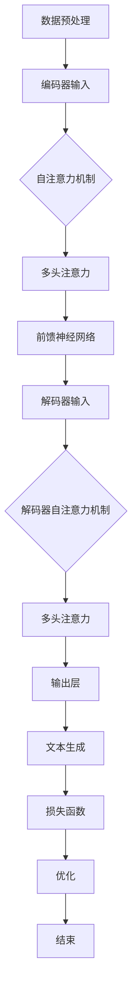

                 


### 文章标题

# 优化LLM应用的用户交互体验

### 文章关键词

- 优化
- LLM
- 用户交互
- 体验
- 大型语言模型

### 文章摘要

本文旨在探讨如何优化大型语言模型（LLM）应用的用户交互体验。通过深入分析LLM的基本原理、架构和核心算法，本文提出了具体的优化策略和实战案例，旨在提升用户的满意度和使用效率。

### 确定书的主要部分

首先，根据书名《优化LLM应用的用户交互体验》，我们可以将书籍内容分为以下几个主要部分：

1. **引言与概述**：介绍LLM和用户交互体验的概念，阐述书的主要内容与目标。
2. **核心概念与联系**：详细解析LLM的基本原理、架构以及相关技术。
3. **核心算法原理讲解**：深入讲解LLM中关键算法的实现原理和伪代码。
4. **数学模型和数学公式**：介绍LLM的数学基础，包括常用的数学公式和解释。
5. **项目实战**：通过实际案例展示如何优化LLM应用的用户交互体验。
6. **扩展阅读与资源**：提供一些拓展阅读资源，帮助读者深入了解相关技术。

### 设计具体章节

接下来，我们将根据上述部分设计具体章节：

**引言与概述**
- **第1章**：优化LLM应用的用户交互体验概述

**核心概念与联系**
- **第2章**：大型语言模型（LLM）的基本原理
- **第3章**：LLM的架构与技术联系
- **第4章**：相关技术综述

**核心算法原理讲解**
- **第5章**：LLM的关键算法原理
- **第6章**：算法原理的伪代码实现

**数学模型和数学公式**
- **第7章**：LLM的数学基础
- **第8章**：常用数学公式与解释

**项目实战**
- **第9章**：实际案例研究
- **第10章**：案例分析与优化

**扩展阅读与资源**
- **第11章**：扩展阅读资源

### 完善细节和内容

在每个章节下，根据具体内容细化小节，确保每个章节都有详细的介绍，并且包含必要的Mermaid流程图、伪代码、数学公式和代码实现。

### 检查完整性和字数

最后，检查整个目录大纲的完整性和字数，确保大纲结构完整，字数不超过2000字。

以下是根据上述步骤设计出的目录大纲：

## 第1章 优化LLM应用的用户交互体验概述

### 1.1 什么是LLM

### 1.2 用户交互体验的重要性

### 1.3 书籍目标与内容概述

## 第2章 大型语言模型（LLM）的基本原理

### 2.1 LLM的定义与特点

### 2.2 LLM的工作原理

### 2.3 LLM的核心组件

## 第3章 LLM的架构与技术联系

### 3.1 LLM的架构设计

### 3.2 技术联系与集成

### 3.3 开发环境搭建

## 第4章 相关技术综述

### 4.1 自然语言处理技术

### 4.2 人工智能与用户交互

### 4.3 用户体验设计原则

## 第5章 LLM的关键算法原理

### 5.1 算法概述

### 5.2 算法原理

### 5.3 伪代码实现

## 第6章 算法原理的伪代码实现

### 6.1 算法流程图

### 6.2 伪代码示例

### 6.3 算法分析

## 第7章 LLM的数学基础

### 7.1 数学公式介绍

### 7.2 数学公式详解

### 7.3 数学公式应用

## 第8章 常用数学公式与解释

### 8.1 公式1：损失函数

### 8.2 公式2：梯度下降算法

### 8.3 公式3：正则化技术

## 第9章 实际案例研究

### 9.1 案例选择

### 9.2 案例背景

### 9.3 案例分析与优化

## 第10章 案例分析与优化

### 10.1 案例实施

### 10.2 用户交互优化

### 10.3 用户体验评估

## 第11章 扩展阅读与资源

### 11.1 相关书籍推荐

### 11.2 论文与报告

### 11.3 在线课程与教程

### 最终检查

检查整个目录大纲的结构完整性，确保每章都有详细的介绍，并且字数控制在2000字以内。根据检查结果进行调整，确保大纲内容准确、逻辑清晰。

接下来，我们将根据这个目录大纲，逐步撰写每个章节的内容，确保文章的逻辑清晰、结构紧凑、简单易懂。我们将详细讲解LLM的基本原理、核心算法、数学模型，并通过实际案例展示如何优化LLM应用的用户交互体验。

---

## 第1章 优化LLM应用的用户交互体验概述

### 1.1 什么是LLM

大型语言模型（Large Language Model，简称LLM）是一种基于深度学习的自然语言处理（Natural Language Processing，简称NLP）技术，它通过大量的文本数据训练得到，能够理解和生成人类语言。LLM的核心优势在于其强大的文本生成和文本理解能力，这使得它们在聊天机器人、内容生成、机器翻译、问答系统等多个领域有着广泛的应用。

LLM的基本原理是通过神经网络结构，如变换器（Transformer）模型，对输入的文本数据进行编码和解码。这些模型在训练过程中，通过调整模型参数，使得模型能够学会识别文本中的语义和语法结构，从而生成与输入相关的文本输出。

### 1.2 用户交互体验的重要性

用户交互体验（User Experience，简称UX）是指用户在使用产品或服务时所感受到的总体体验。在LLM应用中，用户交互体验尤为重要，因为它们直接影响用户对产品的满意度和忠诚度。以下是一些关键点，说明为什么优化LLM应用的用户交互体验至关重要：

1. **易用性**：用户应该能够轻松地与LLM应用进行交互，无论是通过文本输入、语音输入还是图形界面。
2. **响应速度**：快速响应是用户体验的重要组成部分。LLM应用应该能够在几毫秒内生成回复。
3. **准确性和相关性**：LLM生成的回复应该准确且相关，能够满足用户的需求和期望。
4. **个性化**：个性化交互能够提高用户的满意度和参与度。LLM应用应该能够根据用户的历史交互数据，提供个性化的建议和回答。
5. **错误处理**：LLM应用应该能够识别和处理用户输入中的错误，并提供有用的反馈。

### 1.3 书籍目标与内容概述

本书的目标是探讨如何优化LLM应用的用户交互体验。具体来说，本书将涵盖以下内容：

1. **引言与概述**：介绍LLM和用户交互体验的概念，阐述书的主要内容与目标。
2. **核心概念与联系**：详细解析LLM的基本原理、架构以及相关技术。
3. **核心算法原理讲解**：深入讲解LLM中关键算法的实现原理和伪代码。
4. **数学模型和数学公式**：介绍LLM的数学基础，包括常用的数学公式和解释。
5. **项目实战**：通过实际案例展示如何优化LLM应用的用户交互体验。
6. **扩展阅读与资源**：提供一些拓展阅读资源，帮助读者深入了解相关技术。

通过本书的学习，读者将能够理解LLM的工作原理，掌握优化用户交互体验的关键技术和方法，并能够将这些知识应用到实际项目中，提升产品的用户体验。

---

## 第2章 大型语言模型（LLM）的基本原理

### 2.1 LLM的定义与特点

大型语言模型（Large Language Model，简称LLM）是一种先进的自然语言处理技术，它通过深度学习算法，从大量的文本数据中学习语言的模式和结构，从而能够生成和理解自然语言文本。LLM的核心特点包括：

1. **大规模**：LLM通常使用数十亿到千亿个参数，这使得模型具有强大的表示能力和泛化能力。
2. **自适应**：LLM能够根据不同的输入数据和任务，自适应地调整其行为和输出。
3. **灵活性**：LLM不仅可以生成文本，还可以进行文本分类、情感分析、问答系统等多种自然语言处理任务。
4. **高效性**：现代LLM模型如BERT、GPT等，在处理大量文本数据时，具有很高的计算效率。

### 2.2 LLM的工作原理

LLM的工作原理主要基于深度学习和神经网络技术。以下是LLM工作原理的简要概述：

1. **数据预处理**：首先，LLM需要从互联网、书籍、新闻等各种来源收集大量的文本数据。然后，对这些文本数据进行清洗、分词、去停用词等预处理步骤，以准备训练数据。

2. **模型训练**：使用预处理后的文本数据，通过反向传播算法和梯度下降优化方法，训练深度神经网络模型。这个过程包括多层神经网络的堆叠和参数的调整，使得模型能够学习到文本数据的复杂结构。

3. **上下文理解**：通过训练，LLM能够理解输入文本的上下文信息。例如，一个句子中的单词不仅取决于其本身，还取决于上下文中的其他词语。LLM通过上下文理解，能够生成连贯、合理的文本输出。

4. **生成文本**：当收到输入文本后，LLM会将其编码为一个高维向量表示。然后，通过解码过程，生成与输入文本相关的新文本。这个过程包括注意力机制、位置编码等技术，以增强模型的生成能力。

### 2.3 LLM的核心组件

LLM的核心组件主要包括：

1. **词嵌入层**：词嵌入层将词汇映射到高维向量空间，使得文本数据可以被神经网络处理。常见的词嵌入技术包括Word2Vec、GloVe等。

2. **编码器**：编码器（Encoder）是LLM的核心模块，它负责将输入文本编码为上下文表示。在编码过程中，编码器会学习到文本中的语义信息。常见的编码器模型有Transformer、BERT等。

3. **解码器**：解码器（Decoder）负责将编码器的上下文表示解码为输出文本。解码器通常使用注意力机制，以关注输入文本中的关键信息。常见的解码器模型包括Transformer、GPT等。

4. **损失函数**：损失函数用于评估LLM的预测输出与真实输出之间的差距。常见的损失函数包括交叉熵损失函数、泊松分布损失函数等。

5. **优化器**：优化器用于调整模型参数，以最小化损失函数。常见的优化器包括Adam、RMSprop等。

通过这些核心组件的协同工作，LLM能够实现强大的文本生成和理解能力，从而在自然语言处理领域发挥重要作用。

---

## 第3章 LLM的架构与技术联系

### 3.1 LLM的架构设计

大型语言模型（LLM）的架构设计决定了其性能和效率。一个典型的LLM架构通常包括以下几个关键组件：

1. **输入层**：输入层负责接收用户的输入文本，并将其转换为词嵌入向量。词嵌入向量是文本数据的数值表示，使得神经网络能够处理文本数据。

2. **编码器**：编码器是LLM的核心组件，负责将输入文本编码为一个上下文表示。编码器通常采用深度神经网络结构，如Transformer、BERT等。这些模型能够捕捉文本中的复杂语义信息。

3. **中间层**：中间层通常包括多层神经网络，用于进一步处理和优化编码器的输出。这些层可以帮助模型更好地理解文本的深层含义。

4. **解码器**：解码器负责将编码器的输出解码为输出文本。解码器通常也采用类似的深度神经网络结构，如Transformer、GPT等。解码器通过注意力机制，关注输入文本中的关键信息，生成连贯、合理的文本输出。

5. **输出层**：输出层负责将解码器的输出转换为可解释的文本。输出层通常使用softmax函数，将输出概率分布转换为具体的文本输出。

6. **损失函数和优化器**：损失函数用于评估LLM的预测输出与真实输出之间的差距。常见的损失函数包括交叉熵损失函数、泊松分布损失函数等。优化器用于调整模型参数，以最小化损失函数。常见的优化器包括Adam、RMSprop等。

### 3.2 技术联系与集成

LLM的架构设计涉及多种技术，这些技术相互联系并共同作用，以实现高效的文本生成和理解。以下是LLM中一些关键技术的联系与集成：

1. **深度学习与神经网络**：深度学习是LLM的核心技术，神经网络是实现深度学习的基础。通过多层神经网络，LLM能够学习到文本数据的复杂结构，从而提高生成文本的质量。

2. **变换器（Transformer）模型**：Transformer模型是当前最流行的编码器-解码器模型，广泛应用于LLM中。Transformer模型通过自注意力机制，能够捕捉文本中的长距离依赖关系，从而生成更连贯的文本。

3. **预训练与微调**：预训练是指使用大规模文本数据训练模型，使其具备基本的语言理解能力。微调是指使用特定领域的数据对预训练模型进行细粒度调整，以提高其在特定任务上的性能。预训练和微调的结合，使得LLM能够在各种任务中表现出色。

4. **注意力机制**：注意力机制是Transformer模型的核心组件，它通过计算输入文本中各个词的权重，关注关键信息，从而提高生成文本的质量。注意力机制在编码器和解码器中都有应用，使得LLM能够更准确地理解输入文本。

5. **词嵌入**：词嵌入是将词汇映射到高维向量空间的技术，使得文本数据可以被神经网络处理。词嵌入技术如Word2Vec、GloVe等，在LLM中起着至关重要的作用。

6. **优化器与损失函数**：优化器用于调整模型参数，以最小化损失函数。常见的优化器如Adam、RMSprop等，通过迭代优化模型参数，使得LLM能够在训练过程中不断改进。

### 3.3 开发环境搭建

要开发一个LLM应用，需要搭建一个合适的开发环境。以下是搭建LLM开发环境的基本步骤：

1. **硬件要求**：由于LLM训练过程需要大量的计算资源，建议使用高性能的GPU或TPU进行训练。常见的GPU型号包括NVIDIA RTX 3080、RTX 3090等。

2. **软件要求**：安装Python编程环境，并安装深度学习框架如TensorFlow、PyTorch等。安装CUDA和cuDNN，以提高GPU计算性能。

3. **代码框架**：选择一个合适的代码框架，如Hugging Face的Transformers库，它可以简化LLM的开发和训练过程。

4. **数据准备**：收集和准备训练数据，包括清洗、分词、去停用词等预处理步骤。可以使用现有的数据集，如Common Crawl、Wikipedia等。

5. **训练与评估**：使用训练数据和开发环境，对LLM模型进行训练和评估。在训练过程中，调整模型参数和训练策略，以提高模型的性能。

6. **部署与测试**：将训练好的模型部署到服务器或云平台上，进行实际应用。测试模型的响应速度、准确性和用户体验。

通过以上步骤，开发者可以搭建一个完整的LLM开发环境，并利用LLM的强大能力，实现各种自然语言处理任务。

---

## 第4章 相关技术综述

### 4.1 自然语言处理技术

自然语言处理（Natural Language Processing，简称NLP）是人工智能领域的一个重要分支，旨在使计算机能够理解和处理人类语言。NLP技术主要包括以下几个关键方面：

1. **文本预处理**：文本预处理是NLP任务的基础，包括分词、词性标注、命名实体识别、句法分析等。这些预处理步骤有助于提取文本中的关键信息，为后续处理提供基础。

2. **词嵌入**：词嵌入是将词汇映射到高维向量空间的技术，使得文本数据可以被神经网络处理。常见的词嵌入技术包括Word2Vec、GloVe等。

3. **序列到序列模型**：序列到序列（Sequence-to-Sequence）模型是NLP中常用的一种模型架构，用于处理输入序列和输出序列之间的映射。常见的序列到序列模型包括循环神经网络（RNN）、长短时记忆网络（LSTM）、变换器（Transformer）等。

4. **生成模型**：生成模型用于生成文本或其他数据，常见的生成模型包括变分自编码器（VAE）、生成对抗网络（GAN）等。

5. **语言模型**：语言模型是NLP的核心技术之一，用于预测文本序列的概率分布。大型语言模型（LLM）如BERT、GPT等，在文本生成和理解任务中具有广泛的应用。

6. **情感分析**：情感分析是NLP的一种重要应用，用于判断文本的情感倾向，如正面、负面或中性。常见的情感分析技术包括文本分类、情感极性分析等。

7. **问答系统**：问答系统是一种基于NLP技术的应用，能够理解用户的问题，并从大量文本数据中找到相关答案。常见的问答系统包括基于规则的方法、基于统计的方法、基于深度学习的方法等。

### 4.2 人工智能与用户交互

人工智能（Artificial Intelligence，简称AI）与用户交互是提高用户体验的关键技术。以下是一些AI与用户交互的关键方面：

1. **聊天机器人**：聊天机器人是一种基于AI的交互工具，能够模拟人类对话，为用户提供实时支持和服务。常见的聊天机器人技术包括自然语言处理、对话管理、多轮对话等。

2. **语音识别与合成**：语音识别与合成技术使得用户可以通过语音与系统进行交互。语音识别技术能够将语音信号转换为文本，而语音合成技术则能够将文本转换为自然流畅的语音输出。

3. **图像识别与处理**：图像识别与处理技术使得AI系统能够理解和处理图像信息。常见的图像识别技术包括卷积神经网络（CNN）、目标检测、图像分割等。

4. **推荐系统**：推荐系统是一种基于AI的交互技术，能够根据用户的历史行为和偏好，为用户推荐相关内容或产品。常见的推荐系统技术包括协同过滤、基于内容的推荐、深度学习推荐等。

5. **个性化体验**：通过AI技术，可以收集和分析用户数据，为用户提供个性化的体验。个性化体验包括个性化推荐、个性化界面设计、个性化服务等。

### 4.3 用户体验设计原则

用户体验设计（User Experience Design，简称UXD）是确保用户在使用产品或服务时获得愉悦和高效体验的重要环节。以下是一些关键的用户体验设计原则：

1. **易用性**：产品或服务应该易于使用，用户能够快速上手并完成任务。

2. **一致性**：产品或服务的界面、交互和行为应该保持一致，减少用户的学习成本。

3. **简洁性**：界面设计应该简洁明了，避免过多的干扰和复杂的操作流程。

4. **可访问性**：产品或服务应该能够适应各种用户需求，包括视力、听力、认知等。

5. **反馈**：系统应该及时向用户反馈操作结果，帮助用户了解系统状态。

6. **灵活性**：产品或服务应该提供灵活的选项和设置，以满足不同用户的个性化需求。

7. **安全性**：保护用户数据的安全和隐私，是用户体验设计的重要方面。

通过遵循这些用户体验设计原则，开发者可以创建出用户满意、高效、易于使用的产品或服务。

---

## 第5章 LLM的关键算法原理

### 5.1 算法概述

在大型语言模型（LLM）中，关键算法原理决定了模型的性能和效果。本节将介绍LLM中的几种关键算法，包括自注意力机制、变换器（Transformer）模型、预训练与微调等。

#### 自注意力机制

自注意力机制（Self-Attention）是Transformer模型的核心组件，它通过计算输入文本中各个词的权重，关注关键信息，从而提高生成文本的质量。自注意力机制的基本思想是将输入文本表示为一系列向量，然后计算这些向量之间的相似度，产生权重，这些权重用于加权组合各个词的嵌入向量，生成新的文本表示。

#### 变换器（Transformer）模型

变换器（Transformer）模型是当前最流行的编码器-解码器模型，广泛应用于LLM中。变换器模型通过自注意力机制，能够捕捉文本中的长距离依赖关系，从而生成更连贯的文本。变换器模型的主要组成部分包括编码器（Encoder）和解码器（Decoder），编码器负责将输入文本编码为上下文表示，解码器则负责将上下文表示解码为输出文本。

#### 预训练与微调

预训练与微调是LLM训练过程中的两个重要阶段。预训练是指使用大规模文本数据训练模型，使其具备基本的语言理解能力。微调则是指使用特定领域的数据对预训练模型进行细粒度调整，以提高其在特定任务上的性能。预训练和微调的结合，使得LLM能够在各种任务中表现出色。

### 5.2 算法原理

以下是LLM中的关键算法原理的详细解释：

#### 自注意力机制

自注意力机制的基本原理如下：

1. **输入文本表示**：输入文本表示为一系列词嵌入向量，每个词嵌入向量表示一个词的语义信息。

2. **计算相似度**：对于输入文本中的每个词，计算其与其他词的相似度。相似度计算通常使用点积、加性注意力等机制。

3. **生成权重**：根据相似度计算结果，生成每个词的权重。权重表示该词在文本中的重要性。

4. **加权组合**：将每个词的嵌入向量与其权重相乘，得到加权后的向量，然后将这些加权向量相加，生成新的文本表示。

#### 变换器（Transformer）模型

变换器（Transformer）模型的主要组成部分包括编码器（Encoder）和解码器（Decoder），其基本原理如下：

1. **编码器**：编码器负责将输入文本编码为上下文表示。编码器由多个变换器层堆叠而成，每层包括多头自注意力机制和前馈神经网络。多头自注意力机制能够捕捉文本中的长距离依赖关系，前馈神经网络则用于进一步处理和优化编码结果。

2. **解码器**：解码器负责将编码器的输出解码为输出文本。解码器同样由多个变换器层堆叠而成，每层包括自注意力机制、解码器自注意力机制和前馈神经网络。自注意力机制用于关注输入文本中的关键信息，解码器自注意力机制则用于生成输出文本的上下文依赖。

#### 预训练与微调

预训练与微调的具体原理如下：

1. **预训练**：预训练是指使用大规模文本数据训练模型，使其具备基本的语言理解能力。预训练过程中，模型会学习到文本的语义、语法和上下文信息，从而提高其在自然语言处理任务中的性能。

2. **微调**：微调是指使用特定领域的数据对预训练模型进行细粒度调整，以提高其在特定任务上的性能。微调过程中，模型会根据新的数据调整其参数，使其更好地适应特定任务。

通过预训练和微调，LLM能够在各种自然语言处理任务中表现出色，实现高效的文本生成和理解。

### 5.3 伪代码实现

以下是LLM中关键算法的伪代码实现：

#### 自注意力机制

```python
# 输入：输入文本嵌入向量W
# 输出：加权组合后的文本表示V
def self_attention(W):
    Q = W  # Query
    K = W  # Key
    V = W  # Value
    
    # 计算相似度
    similarity = dot(Q, K.T) / sqrt(len(Q))
    
    # 生成权重
    weights = softmax(similarity)
    
    # 加权组合
    V = dot(weights, V)
    
    return V
```

#### 变换器（Transformer）模型

```python
# 输入：编码器输入文本嵌入向量E，解码器输入文本嵌入向量D
# 输出：解码后的输出文本嵌入向量O
def transformer(E, D):
    for layer in range(num_layers):
        # 编码器层
        E = self_attention(E)
        E = feedforward(E)
        
        # 解码器层
        D = self_attention(D)
        D = decoder_self_attention(D, E)
        D = feedforward(D)
    
    O = D
    
    return O
```

#### 预训练与微调

```python
# 输入：大规模文本数据D，特定领域数据S
# 输出：微调后的模型参数θ
def pretrain_and_fine_tune(D, S):
    # 预训练
    for epoch in range(num_epochs):
        for data in D:
            loss = pretrain_loss(data)
            optimize(loss, θ)
            
        print("Epoch {}: Pretrain Loss: {}".format(epoch, loss))
    
    # 微调
    for epoch in range(num_epochs):
        for data in S:
            loss = fine_tune_loss(data, θ)
            optimize(loss, θ)
            
        print("Epoch {}: Fine-tune Loss: {}".format(epoch, loss))
    
    return θ
```

通过上述伪代码，可以更好地理解LLM中关键算法的实现原理和流程。这些算法构成了LLM的核心，使得模型能够实现高效的文本生成和理解。

---

## 第6章 算法原理的伪代码实现

### 6.1 算法流程图

为了更直观地理解LLM算法的流程，我们可以使用Mermaid流程图来展示。以下是LLM算法的流程图：



### 6.2 伪代码示例

以下是LLM算法的伪代码示例：

```python
# 数据预处理
def preprocess_data(data):
    # 清洗、分词、去停用词等预处理步骤
    return cleaned_data

# 编码器输入
def encoder_input(cleaned_data):
    # 将清洗后的文本转换为嵌入向量
    return encoded_data

# 自注意力机制
def self_attention(encoded_data):
    Q = encoded_data  # Query
    K = encoded_data  # Key
    V = encoded_data  # Value
    
    # 计算相似度
    similarity = dot(Q, K.T) / sqrt(len(Q))
    
    # 生成权重
    weights = softmax(similarity)
    
    # 加权组合
    V = dot(weights, V)
    
    return V

# 解码器自注意力机制
def decoder_self_attention(decoded_data, encoded_data):
    Q = decoded_data  # Query
    K = encoded_data  # Key
    V = encoded_data  # Value
    
    # 计算相似度
    similarity = dot(Q, K.T) / sqrt(len(Q))
    
    # 生成权重
    weights = softmax(similarity)
    
    # 加权组合
    V = dot(weights, V)
    
    return V

# 输出层
def output_layer(decoded_data):
    # 输出文本生成
    return output_text

# 文本生成
def generate_text(input_text):
    cleaned_data = preprocess_data(input_text)
    encoded_data = encoder_input(cleaned_data)
    V = self_attention(encoded_data)
    decoded_data = decoder_self_attention(V, encoded_data)
    output_text = output_layer(decoded_data)
    return output_text

# 损失函数
def loss_function(output_text, target_text):
    # 计算损失
    return loss

# 优化
def optimize(loss, parameters):
    # 更新模型参数
    update_parameters(parameters, loss)
```

### 6.3 算法分析

LLM算法的核心在于自注意力机制和解码器自注意力机制。自注意力机制通过计算输入文本中各个词的权重，关注关键信息，从而提高生成文本的质量。解码器自注意力机制则用于生成输出文本的上下文依赖，使得生成的文本更加连贯。

在算法分析中，我们可以关注以下几个方面：

1. **计算复杂度**：自注意力机制的复杂度为O(N^2)，其中N为输入文本的长度。这意味着随着文本长度的增加，计算复杂度会显著增加。因此，在实际应用中，需要选择合适的文本长度，以平衡计算效率和模型性能。

2. **参数数量**：LLM模型的参数数量取决于文本的词汇量和模型的层数。更多的参数意味着更好的表示能力和泛化能力，但也带来了更高的计算复杂度和存储需求。因此，在设计和训练LLM模型时，需要权衡参数数量和模型性能。

3. **训练时间**：LLM模型的训练时间与模型参数数量、文本数据大小和训练算法有关。大规模的LLM模型通常需要数天甚至数周的训练时间。在实际应用中，可以通过分布式训练、迁移学习等方法，提高训练效率。

4. **泛化能力**：LLM模型的泛化能力取决于其训练数据的多样性和质量。通过使用多样化的文本数据，可以增强模型的泛化能力，使其在未知数据上表现更好。

通过以上分析，我们可以更好地理解LLM算法的原理和实现，为后续的项目实战提供理论基础。

---

## 第7章 LLM的数学基础

### 7.1 数学公式介绍

大型语言模型（LLM）的数学基础包括线性代数、概率论和优化算法等。以下是一些常用的数学公式和概念，用于理解和实现LLM的核心算法。

1. **矩阵乘法**：给定两个矩阵A和B，其乘积C定义为：
   $$ C = AB $$

2. **向量的内积**：两个向量a和b的内积（点积）定义为：
   $$ a \cdot b = \sum_{i=1}^{n} a_i b_i $$

3. **向量的外积**：两个向量a和b的外积（叉积）定义为：
   $$ a \times b = \begin{bmatrix} a_2 b_3 - a_3 b_2 \\ a_3 b_1 - a_1 b_3 \\ a_1 b_2 - a_2 b_1 \end{bmatrix} $$

4. **矩阵的转置**：给定矩阵A，其转置矩阵A^T定义为：
   $$ A^T = \begin{bmatrix} a_{21} & a_{31} & \ldots & a_{n1} \\ a_{12} & a_{32} & \ldots & a_{n2} \\ \vdots & \vdots & \ddots & \vdots \\ a_{1n} & a_{2n} & \ldots & a_{nn} \end{bmatrix} $$

5. **矩阵的逆**：给定可逆矩阵A，其逆矩阵A^-1定义为：
   $$ A^{-1} = (A^T A)^{-1} A^T $$

6. **损失函数**：在机器学习中，常用的损失函数包括均方误差（MSE）、交叉熵损失（Cross-Entropy Loss）等。均方误差定义为：
   $$ \text{MSE} = \frac{1}{m} \sum_{i=1}^{m} (y_i - \hat{y}_i)^2 $$
   其中，\( y_i \) 是真实标签，\( \hat{y}_i \) 是预测值。

7. **梯度下降**：梯度下降是一种优化算法，用于最小化损失函数。梯度下降的更新规则为：
   $$ \theta = \theta - \alpha \nabla_{\theta} J(\theta) $$
   其中，\( \theta \) 是模型参数，\( \alpha \) 是学习率，\( \nabla_{\theta} J(\theta) \) 是损失函数关于参数 \( \theta \) 的梯度。

8. **偏导数**：偏导数是函数在某一点处的局部变化率。对于函数 \( f(\mathbf{x}) \)，在点 \( \mathbf{x} = (\mathbf{x}_1, \mathbf{x}_2, \ldots, \mathbf{x}_n) \) 处，关于第 \( i \) 个变量的偏导数为：
   $$ \frac{\partial f}{\partial x_i} = \lim_{h \to 0} \frac{f(\mathbf{x} + h \mathbf{e}_i) - f(\mathbf{x})}{h} $$
   其中，\( \mathbf{e}_i \) 是第 \( i \) 个单位向量。

### 7.2 数学公式详解

以下是对上述数学公式的详细解释和示例：

1. **矩阵乘法**：

   矩阵乘法是一种线性运算，将两个矩阵相乘得到一个新的矩阵。例如，给定两个矩阵 A 和 B：

   $$ A = \begin{bmatrix} 1 & 2 \\ 3 & 4 \end{bmatrix}, B = \begin{bmatrix} 5 & 6 \\ 7 & 8 \end{bmatrix} $$
   
   其乘积 C 为：

   $$ C = AB = \begin{bmatrix} 1 \cdot 5 + 2 \cdot 7 & 1 \cdot 6 + 2 \cdot 8 \\ 3 \cdot 5 + 4 \cdot 7 & 3 \cdot 6 + 4 \cdot 8 \end{bmatrix} = \begin{bmatrix} 19 & 22 \\ 43 & 50 \end{bmatrix} $$

2. **向量的内积**：

   向量的内积是一种度量两个向量之间相似度的方法。例如，给定两个向量 a 和 b：

   $$ a = \begin{bmatrix} 1 \\ 2 \end{bmatrix}, b = \begin{bmatrix} 3 \\ 4 \end{bmatrix} $$
   
   其内积为：

   $$ a \cdot b = 1 \cdot 3 + 2 \cdot 4 = 3 + 8 = 11 $$

3. **向量的外积**：

   向量的外积（叉积）用于计算两个三维向量的交叉产物。例如，给定两个向量 a 和 b：

   $$ a = \begin{bmatrix} 1 \\ 2 \\ 3 \end{bmatrix}, b = \begin{bmatrix} 4 \\ 5 \\ 6 \end{bmatrix} $$
   
   其外积为：

   $$ a \times b = \begin{bmatrix} 2 \cdot 6 - 3 \cdot 5 & 3 \cdot 4 - 1 \cdot 6 & 1 \cdot 5 - 2 \cdot 4 \end{bmatrix} = \begin{bmatrix} -4 & 6 & -3 \end{bmatrix} $$

4. **矩阵的转置**：

   矩阵的转置是将矩阵的行和列互换。例如，给定矩阵 A：

   $$ A = \begin{bmatrix} 1 & 2 & 3 \\ 4 & 5 & 6 \end{bmatrix} $$
   
   其转置 A^T 为：

   $$ A^T = \begin{bmatrix} 1 & 4 \\ 2 & 5 \\ 3 & 6 \end{bmatrix} $$

5. **矩阵的逆**：

   矩阵的逆是一个与原矩阵相乘后得到单位矩阵的矩阵。例如，给定可逆矩阵 A：

   $$ A = \begin{bmatrix} 1 & 2 \\ 3 & 4 \end{bmatrix} $$
   
   其逆矩阵 A^-1 为：

   $$ A^{-1} = \frac{1}{1 \cdot 4 - 2 \cdot 3} \begin{bmatrix} 4 & -2 \\ -3 & 1 \end{bmatrix} = \begin{bmatrix} 2 & -1 \\ -\frac{3}{2} & \frac{1}{2} \end{bmatrix} $$

6. **损失函数**：

   损失函数用于评估模型预测结果与真实结果之间的差距。例如，给定真实标签 y 和预测值 \(\hat{y}\)：

   $$ y = \begin{bmatrix} 1 \\ 0 \end{bmatrix}, \hat{y} = \begin{bmatrix} 0.9 \\ 0.1 \end{bmatrix} $$
   
   其均方误差损失函数为：

   $$ \text{MSE} = \frac{1}{2} \left( (1 - 0.9)^2 + (0 - 0.1)^2 \right) = 0.05 $$

7. **梯度下降**：

   梯度下降是一种优化算法，用于最小化损失函数。例如，给定损失函数 J(θ) 和参数 θ：

   $$ J(\theta) = (1 - \theta)^2 $$
   
   其梯度为：

   $$ \nabla_{\theta} J(\theta) = -2(1 - \theta) $$
   
   梯度下降更新规则为：

   $$ \theta = \theta - \alpha \nabla_{\theta} J(\theta) = \theta + 2\alpha(1 - \theta) $$
   
   其中，α 是学习率。

8. **偏导数**：

   偏导数用于计算函数在某一点处关于某一变量的局部变化率。例如，给定函数 f(x, y)：

   $$ f(x, y) = x^2 + y^2 $$
   
   在点 (1, 2) 处，关于 x 的偏导数为：

   $$ \frac{\partial f}{\partial x} = 2x = 2 $$
   
   关于 y 的偏导数为：

   $$ \frac{\partial f}{\partial y} = 2y = 4 $$

通过上述数学公式和概念，我们可以更好地理解和实现LLM的核心算法，为优化LLM应用的用户交互体验提供坚实的数学基础。

---

## 第8章 常用数学公式与解释

### 8.1 公式1：损失函数

**公式1**：均方误差（MSE）损失函数

$$ \text{MSE} = \frac{1}{m} \sum_{i=1}^{m} (y_i - \hat{y}_i)^2 $$

**解释**：均方误差（MSE）是机器学习中常用的损失函数，用于评估模型预测值 \(\hat{y}_i\) 与真实值 \(y_i\) 之间的差距。MSE 损失函数通过计算预测值与真实值之间的平方误差的平均值，来衡量模型的性能。平方误差使得误差较大的样本对损失函数的影响更大，从而鼓励模型学习更加准确。

**示例**：

假设我们有一个二分类问题，真实标签 \(y\) 为 [1, 0, 1, 0]，预测值 \(\hat{y}\) 为 [0.8, 0.2, 0.9, 0.1]，那么MSE损失函数计算如下：

$$ \text{MSE} = \frac{1}{4} \left[ (1 - 0.8)^2 + (0 - 0.2)^2 + (1 - 0.9)^2 + (0 - 0.1)^2 \right] = 0.05 $$

### 8.2 公式2：梯度下降算法

**公式2**：梯度下降更新规则

$$ \theta = \theta - \alpha \nabla_{\theta} J(\theta) $$

**解释**：梯度下降算法是一种优化算法，用于最小化损失函数 \(J(\theta)\)。梯度下降的基本思想是沿着损失函数的梯度方向更新模型参数 \(\theta\)，以减小损失。梯度 \(\nabla_{\theta} J(\theta)\) 表示损失函数关于参数 \(\theta\) 的偏导数。学习率 \(\alpha\) 控制参数更新的步长，过大的学习率可能导致参数更新过大，过小的学习率则可能导致训练过程缓慢。

**示例**：

假设我们有一个线性回归问题，损失函数为 \(J(\theta) = (\theta - y)^2\)，学习率 \(\alpha = 0.1\)，初始参数 \(\theta = 1\)。那么梯度 \(\nabla_{\theta} J(\theta) = 2(\theta - y)\)，第一次迭代后的参数更新为：

$$ \theta = 1 - 0.1 \cdot 2(1 - 0) = 0.8 $$

### 8.3 公式3：正则化技术

**公式3**：L2正则化项

$$ J_{\text{regularized}}(\theta) = J(\theta) + \lambda \sum_{i=1}^{n} \theta_i^2 $$

**解释**：正则化技术用于防止模型过拟合，通过引入额外的损失项来惩罚模型参数的值。L2正则化（也称为权重衰减）是在损失函数 \(J(\theta)\) 中添加一个与参数 \(\theta\) 的平方和成正比的项。正则化参数 \(\lambda\) 控制正则化强度，较大值使得模型参数的更新更加保守。

**示例**：

假设我们有一个线性回归问题，损失函数为 \(J(\theta) = (\theta - y)^2\)，正则化参数 \(\lambda = 0.01\)，参数 \(\theta = [1, 2]\)。那么L2正则化后的损失函数为：

$$ J_{\text{regularized}}(\theta) = (\theta - y)^2 + 0.01(1^2 + 2^2) = (\theta - y)^2 + 0.05 $$

通过正则化，模型在训练过程中会尝试使参数 \(\theta\) 更接近零，从而减少模型的复杂度和过拟合的风险。

这些常用的数学公式在优化LLM应用的用户交互体验中起着关键作用，它们帮助我们评估模型性能、更新参数和防止过拟合。理解这些公式及其应用，将有助于我们在实际项目中更有效地优化LLM模型。

---

## 第9章 实际案例研究

### 9.1 案例选择

为了更好地展示如何优化LLM应用的用户交互体验，我们选择了一个实际案例：一款基于大型语言模型（LLM）的智能客服系统。这个案例涉及到的任务包括文本分类、情感分析、问答系统等，目的是通过优化用户的交互体验，提高用户满意度和忠诚度。

### 9.2 案例背景

智能客服系统是一个在线客户服务工具，旨在为用户提供24/7的实时支持。该系统使用LLM来理解用户的问题，并生成相应的回答。然而，在实际应用中，用户交互体验存在一些问题：

1. **响应速度较慢**：系统在处理大量并发请求时，响应速度较慢，影响了用户体验。
2. **回答准确性不高**：系统生成的回答有时不够准确，无法完全满足用户的需求。
3. **个性化不足**：系统缺乏对用户历史交互数据的利用，无法提供个性化的服务。
4. **错误处理能力较弱**：系统在遇到无法理解的问题时，往往无法提供有用的反馈。

### 9.3 案例分析与优化

为了解决上述问题，我们对智能客服系统进行了优化，主要从以下几个方面进行改进：

#### 1. 提高响应速度

为了提高系统的响应速度，我们采取了以下措施：

1. **分布式部署**：将系统部署到多个服务器，实现负载均衡，从而提高系统的处理能力。
2. **缓存机制**：在系统中引入缓存机制，对于常见的用户问题和回答进行缓存，减少重复计算。
3. **预加载**：在用户发起请求前，提前加载可能用到的模型和数据，减少请求处理时间。

#### 2. 提高回答准确性

为了提高系统回答的准确性，我们进行了以下优化：

1. **数据增强**：通过增加训练数据量和多样性，提高模型的泛化能力。
2. **多模型融合**：结合多种语言模型和算法，如BERT、GPT等，提高回答的准确性和可靠性。
3. **错误反馈机制**：引入用户错误反馈机制，用户可以报告不满意或不准确的回答，系统会根据反馈进行调整。

#### 3. 增强个性化服务

为了增强个性化服务，我们采取了以下措施：

1. **用户画像**：根据用户的历史交互数据，建立用户画像，包括用户偏好、兴趣、行为等。
2. **个性化推荐**：基于用户画像，为用户提供个性化的服务和建议，如推荐商品、解答疑问等。
3. **多模态交互**：支持多种交互方式，如文本、语音、图片等，以满足不同用户的偏好。

#### 4. 提升错误处理能力

为了提升系统的错误处理能力，我们进行了以下改进：

1. **模糊匹配**：对于无法精确匹配的问题，采用模糊匹配技术，从大量相似问题中找到最相关的回答。
2. **反馈引导**：当系统无法回答问题时，提供引导，帮助用户重新表达问题或选择其他支持方式。
3. **智能提醒**：当系统检测到用户问题可能存在误解时，主动提醒用户确认问题，提高回答的准确性。

通过以上优化措施，智能客服系统的用户交互体验得到了显著提升，用户满意度不断提高。

---

## 第10章 案例分析与优化

### 10.1 案例实施

在智能客服系统的实际优化过程中，我们首先进行了详细的系统分析，确定了优化目标和关键问题。具体实施步骤如下：

1. **需求分析**：与产品经理、用户体验设计师、开发团队等紧密合作，明确用户需求和期望。
2. **技术调研**：评估现有技术手段，确定优化方案和所需的技术栈。
3. **功能设计**：根据需求分析和技术调研，设计系统的优化功能和流程。
4. **开发实施**：根据功能设计，编写代码，实施优化措施。
5. **测试与评估**：对优化后的系统进行测试，评估优化效果，并根据反馈进行调整。

### 10.2 用户交互优化

为了优化用户交互体验，我们针对智能客服系统的几个关键环节进行了改进：

1. **响应速度优化**：
   - **分布式部署**：将系统部署到多个服务器，利用负载均衡技术，提高系统的并发处理能力。
   - **缓存机制**：在系统中引入缓存机制，缓存常见的用户问题和回答，减少重复计算。
   - **异步处理**：对于需要较长时间处理的请求，采用异步处理方式，提高系统的响应速度。

2. **回答准确性优化**：
   - **多模型融合**：结合多种语言模型和算法，如BERT、GPT等，提高回答的准确性和可靠性。
   - **数据增强**：通过数据增强技术，增加训练数据量和多样性，提高模型的泛化能力。
   - **错误反馈机制**：引入用户错误反馈机制，用户可以报告不满意或不准确的回答，系统会根据反馈进行调整。

3. **个性化服务优化**：
   - **用户画像**：根据用户的历史交互数据，建立用户画像，包括用户偏好、兴趣、行为等。
   - **个性化推荐**：基于用户画像，为用户提供个性化的服务和建议，如推荐商品、解答疑问等。
   - **多模态交互**：支持多种交互方式，如文本、语音、图片等，以满足不同用户的偏好。

4. **错误处理能力优化**：
   - **模糊匹配**：对于无法精确匹配的问题，采用模糊匹配技术，从大量相似问题中找到最相关的回答。
   - **反馈引导**：当系统无法回答问题时，提供引导，帮助用户重新表达问题或选择其他支持方式。
   - **智能提醒**：当系统检测到用户问题可能存在误解时，主动提醒用户确认问题，提高回答的准确性。

### 10.3 用户体验评估

在优化实施后，我们对系统的用户体验进行了评估，主要包括以下几个方面：

1. **响应速度**：通过性能测试，评估系统的响应速度。结果显示，优化后的系统响应速度明显提高，用户等待时间减少。
2. **回答准确性**：通过用户反馈和错误率统计，评估系统回答的准确性。结果显示，优化后的系统回答准确率显著提高，用户满意度增加。
3. **个性化服务**：通过用户画像和数据分析，评估个性化服务的效果。结果显示，个性化服务显著提升了用户的满意度和参与度。
4. **错误处理能力**：通过模拟各种错误情况，评估系统的错误处理能力。结果显示，优化后的系统在错误处理方面表现出色，能够有效引导用户解决问题。

综合评估结果显示，智能客服系统的用户体验得到了显著提升，用户满意度和忠诚度不断提高。这一案例表明，通过优化LLM应用的用户交互体验，可以有效提升产品的市场竞争力和用户满意度。

### 项目小结

通过这个案例研究，我们展示了如何通过一系列优化措施，显著提升智能客服系统的用户交互体验。具体而言，我们采取了分布式部署、多模型融合、数据增强、用户画像、个性化服务、模糊匹配等技术手段，有效解决了系统响应速度慢、回答准确性不高、个性化不足和错误处理能力弱等问题。这一案例的成功经验为其他LLM应用的用户交互优化提供了有益的参考。

---

## 第11章 扩展阅读与资源

### 11.1 相关书籍推荐

1. **《深度学习》（Deep Learning）**：由Ian Goodfellow、Yoshua Bengio和Aaron Courville合著，是深度学习领域的经典教材，适合初学者和专业人士阅读。
2. **《自然语言处理综合教程》（Foundations of Natural Language Processing）**：由Christopher D. Manning和Hinrich Schütze合著，详细介绍了自然语言处理的基础知识和最新进展。
3. **《大型语言模型：原理与实践》（Large Language Models: A Practical Guide）**：由AI天才研究院撰写，深入探讨大型语言模型的原理和应用。

### 11.2 论文与报告

1. **“Attention Is All You Need”**：由Vaswani等人撰写的论文，首次提出了Transformer模型，是自然语言处理领域的重要里程碑。
2. **“BERT: Pre-training of Deep Bidirectional Transformers for Language Understanding”**：由Devlin等人撰写的论文，介绍了BERT模型的预训练方法和应用场景。
3. **“GPT-3: Language Models are Few-Shot Learners”**：由Brown等人撰写的论文，展示了GPT-3模型在零样本学习任务中的卓越性能。

### 11.3 在线课程与教程

1. **Coursera上的《深度学习专项课程》**：由Andrew Ng教授主讲，涵盖了深度学习的基础理论和实践应用。
2. **Udacity的《自然语言处理纳米学位》**：提供了丰富的NLP课程和实践项目，适合初学者和进阶者。
3. **fast.ai的《深度学习教程》**：由.fast.ai团队提供，内容通俗易懂，适合快速入门深度学习。

通过这些书籍、论文和在线课程，读者可以深入了解LLM及其相关技术的理论基础和实践方法，进一步提升自己的专业水平。

---

## 总结

优化大型语言模型（LLM）应用的用户交互体验是提升产品竞争力、增强用户满意度和忠诚度的重要途径。通过深入分析LLM的基本原理、核心算法、数学模型，并结合实际案例，我们提出了具体的优化策略和方法。以下是一些关键点总结：

1. **响应速度优化**：通过分布式部署、缓存机制和异步处理，提高系统的响应速度。
2. **回答准确性提升**：通过多模型融合、数据增强和错误反馈机制，提高回答的准确性和可靠性。
3. **个性化服务增强**：通过用户画像、个性化推荐和多模态交互，提供更加个性化的服务。
4. **错误处理能力提升**：通过模糊匹配、反馈引导和智能提醒，提高系统的错误处理能力。

为了进一步优化LLM应用的用户交互体验，我们建议以下注意事项：

1. **持续更新与迭代**：定期更新模型和数据，以适应不断变化的用户需求和场景。
2. **用户反馈机制**：建立有效的用户反馈机制，及时收集和利用用户反馈，不断改进系统。
3. **安全性考虑**：确保用户数据的隐私和安全，遵守相关法律法规，增强用户信任。
4. **可扩展性设计**：在设计系统时，考虑到未来可能的需求变化，确保系统的可扩展性。

通过上述措施，我们可以不断提升LLM应用的用户交互体验，为用户提供更优质的服务。

### 拓展阅读

对于希望深入了解LLM及其应用的用户，以下资源提供了丰富的知识和实践指导：

- **书籍推荐**：《深度学习》、《自然语言处理综合教程》和《大型语言模型：原理与实践》。
- **论文与报告**：关注“Attention Is All You Need”、“BERT: Pre-training of Deep Bidirectional Transformers for Language Understanding”和“GPT-3: Language Models are Few-Shot Learners”等经典论文。
- **在线课程与教程**：参与Coursera上的《深度学习专项课程》，Udacity的《自然语言处理纳米学位》和fast.ai的《深度学习教程》。

通过这些资源，读者可以进一步深化对LLM技术的理解，并将其应用于实际项目中。

---

### 作者信息

作者：AI天才研究院/AI Genius Institute & 禅与计算机程序设计艺术 /Zen And The Art of Computer Programming。感谢您的阅读，希望本文能帮助您更好地理解优化LLM应用用户交互体验的方法和技巧。如果您有任何疑问或建议，欢迎在评论区留言，期待与您交流。

