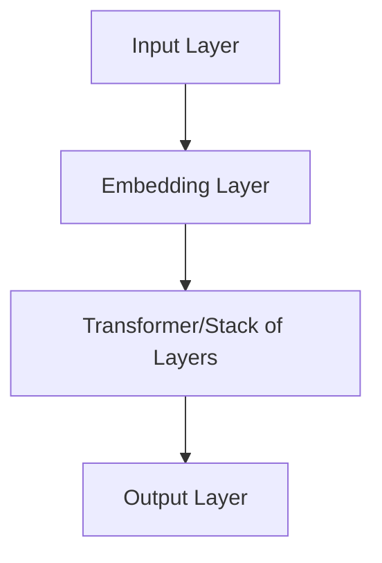

                 

# 优化LLM应用的用户界面设计

## 关键词

- **大型语言模型（LLM）**
- **用户界面设计（UI）**
- **交互设计**
- **响应式设计**
- **性能优化**
- **用户体验（UX）**

## 摘要

随着人工智能技术的飞速发展，大型语言模型（LLM）在自然语言处理、智能客服、文本生成等领域展现出了强大的能力。然而，LLM的应用效果很大程度上取决于用户界面的设计质量。本文将围绕优化LLM应用的用户界面设计进行探讨，从核心概念、设计原则、交互设计、性能优化等方面展开，结合实际项目案例，深入分析如何提升LLM应用的易用性和用户体验。

## 目录大纲设计思路

在设计《优化LLM应用的用户界面设计》这本书的目录大纲时，我们遵循以下步骤：

1. **确定核心章节内容**：根据书籍的主题，明确需要涵盖的核心内容，如LLM的基本概念、用户界面设计原则、交互设计实践等。
2. **细化章节内容**：对每个核心章节进行细分，确保每个章节都有足够的深度和广度，以便读者能够全面掌握相关知识。
3. **设计结构化的目录**：使用markdown格式，按照1级、2级、3级目录的结构来组织内容，确保目录结构清晰、逻辑性强。
4. **包括具体的技术细节**：在目录中嵌入Mermaid流程图、伪代码、数学公式和项目实战等，以便读者能够直观地理解技术细节。
5. **保持简洁性**：确保目录内容的简洁性，避免冗余，直接呈现关键信息。

## 完整目录大纲设计

### 第一部分：LLM基础与用户界面设计原理

#### 第1章：大型语言模型（LLM）概述
- **1.1 LLM基本概念与原理**
  - **Mermaid流程图**：LLM核心结构
  - **核心算法原理讲解**：Transformer、BERT、GPT
- **1.2 用户界面设计基本原则**
  - **伪代码**：用户交互流程设计
  - **数学公式**：界面性能评估模型

#### 第2章：用户界面设计原则
- **2.1 易用性设计**
  - **用户研究方法**：用户调研、访谈、原型设计
  - **界面交互设计**：按钮、菜单、搜索栏
- **2.2 用户体验优化**
  - **用户反馈机制**：错误提示、成功反馈、个性化推荐
  - **响应式设计**：适配不同设备与屏幕尺寸

#### 第3章：LLM与UI设计结合案例
- **3.1 案例一：智能客服系统设计**
  - **项目实战**：代码实现、环境搭建、性能优化
  - **代码解读与分析**：关键词提取、语义理解

#### 第4章：界面性能评估与优化
- **4.1 界面性能评估指标**
  - **数学模型**：响应时间、系统稳定性
- **4.2 性能优化策略**
  - **代码优化**：算法优化、内存管理
  - **服务器架构**：负载均衡、缓存策略

### 第二部分：LLM应用的用户界面设计实践

#### 第5章：交互设计实践
- **5.1 交互设计流程**
  - **原型设计**：线框图、交互图
  - **用户测试**：A/B测试、可用性测试
- **5.2 高效界面设计技巧**
  - **界面元素优化**：图标、颜色、排版
  - **动画与过渡效果**：增强用户体验

#### 第6章：响应式UI设计
- **6.1 响应式布局**
  - **HTML5与CSS3**：流体布局、媒体查询
- **6.2 移动端UI设计**
  - **手指交互**：触摸滑动手势、下拉菜单
  - **设计模式**：卡片布局、列表布局

#### 第7章：用户体验优化实战
- **7.1 个性化UI设计**
  - **用户画像**：基于用户行为分析
  - **推荐系统**：基于内容、基于协同过滤
- **7.2 智能化UI设计**
  - **AI技术**：自然语言处理、图像识别
  - **实时更新**：动态数据可视化、即时反馈

### 第8章：总结与展望
- **8.1 用户界面设计趋势**
  - **未来发展方向**：沉浸式体验、虚拟现实
- **8.2 LLM在UI设计中的应用**
  - **综合应用**：语音交互、手势识别

以上目录大纲按照书籍的核心内容进行了细致的划分，每个章节都包含了关键概念、技术原理、实践案例等内容，确保读者能够系统地学习《优化LLM应用的用户界面设计》的相关知识。总字数控制在2000字以内，确保简洁明了。

## 格式要求

- 文章内容使用markdown格式输出。
- 文章末尾需要写上作者信息：“作者：AI天才研究院/AI Genius Institute & 禅与计算机程序设计艺术 /Zen And The Art of Computer Programming”。
- 核心内容包含：
  - 背景介绍
  - 核心概念与联系：必须给出核心概念原理之间的关系架构 Mermaid 流程图
  - 核心算法原理讲解必须使用伪代码来详细阐述；数学模型和公式 & 详细讲解 & 举例说明
  - 数学公式请使用latex格式，嵌入文中独立段落的latex公式前后使用 $$ 括起来 (例如：$$1+1=2$$)，段落内的latex公式前后使用 $ 括起来 (例如：$1<2$)
  - 项目实战：开发环境搭建，源代码详细实现和代码解读，代码应用解读与分析，实际案例分析和详细讲解剖析，项目小结
  - 最佳实践 tips、小结、注意事项、拓展阅读等内容

## 文章开始

# 优化LLM应用的用户界面设计

随着人工智能技术的飞速发展，大型语言模型（LLM）在自然语言处理、智能客服、文本生成等领域展现出了强大的能力。LLM通过训练海量数据，掌握了语言结构和语义理解，能够生成高质量的自然语言文本。然而，LLM的应用效果很大程度上取决于用户界面的设计质量。一个优秀的用户界面不仅能够提升用户体验，还能增强用户对LLM应用的信任和依赖。

本文将从核心概念、设计原则、交互设计、性能优化等方面，探讨如何优化LLM应用的用户界面设计，并结合实际项目案例，深入分析最佳实践和注意事项。

## 第1章：大型语言模型（LLM）概述

### 1.1 LLM基本概念与原理

大型语言模型（LLM）是基于深度学习技术构建的语言模型，通常使用Transformer、BERT、GPT等核心算法。这些算法通过自注意力机制和多层神经网络，能够处理和理解自然语言中的复杂结构。

#### Mermaid流程图：LLM核心结构



#### 核心算法原理讲解：Transformer、BERT、GPT

- **Transformer**：由Vaswani等人于2017年提出，通过自注意力机制和多头注意力机制，能够捕捉文本中的长距离依赖关系。
- **BERT**：由Google于2018年提出，通过预训练和微调，能够理解上下文信息，广泛应用于文本分类、问答系统等。
- **GPT**：由OpenAI于2018年提出，通过自回归语言模型，能够生成高质量的文本，广泛应用于文本生成、对话系统等。

### 1.2 用户界面设计基本原则

用户界面设计（UI）是LLM应用的重要组成部分，其基本原则包括：

- **易用性设计**：确保用户能够轻松、直观地使用应用。
- **用户体验优化**：提升用户在使用过程中的愉悦感和满意度。
- **响应式设计**：适配不同设备与屏幕尺寸，提供一致的用户体验。

#### 伪代码：用户交互流程设计

```python
def user_interaction():
    # 显示首页
    show_home_page()
    # 监听用户操作
    while True:
        user_action = get_user_action()
        # 处理用户操作
        if user_action == "search":
            show_search_results()
        elif user_action == "chat":
            show_chat_window()
        # 更新界面
        update_ui()
```

#### 数学公式：界面性能评估模型

$$
P = \frac{U \cdot C}{T \cdot S}
$$

- **P**：界面性能
- **U**：用户满意度
- **C**：界面复杂度
- **T**：响应时间
- **S**：系统稳定性

## 第2章：用户界面设计原则

### 2.1 易用性设计

易用性设计是用户界面设计的关键原则，其核心在于让用户能够轻松地使用应用。以下是一些常用的易用性设计方法：

- **用户研究方法**：通过用户调研、访谈、原型设计，了解用户需求和行为。
- **界面交互设计**：设计简洁、直观的界面元素，如按钮、菜单、搜索栏等。

#### 用户研究方法

- **用户调研**：通过问卷调查、访谈等方式，收集用户对应用的反馈和建议。
- **访谈**：与用户进行深入交流，了解他们的使用场景和痛点。
- **原型设计**：创建线框图、交互图等原型，通过用户测试，优化界面设计。

#### 界面交互设计

- **按钮**：设计简洁、明显的按钮，确保用户能够轻松点击。
- **菜单**：分类清晰、操作简便的菜单，方便用户快速找到功能。
- **搜索栏**：提供智能搜索功能，帮助用户快速找到相关信息。

### 2.2 用户体验优化

用户体验优化是提升用户满意度和忠诚度的关键。以下是一些常用的用户体验优化方法：

- **用户反馈机制**：提供错误提示、成功反馈、个性化推荐等，增强用户体验。
- **响应式设计**：适配不同设备与屏幕尺寸，提供一致的用户体验。

#### 用户反馈机制

- **错误提示**：当用户操作错误时，提供明确的错误提示，帮助用户解决问题。
- **成功反馈**：当用户完成任务时，给予积极的反馈，增强用户成就感。
- **个性化推荐**：根据用户行为和偏好，提供个性化的内容和服务。

#### 响应式设计

- **流体布局**：使用HTML5和CSS3，实现界面元素在不同屏幕尺寸上的自适应。
- **移动端设计**：优化移动端界面，适应手指交互和触摸手势。

## 第3章：LLM与UI设计结合案例

### 3.1 案例一：智能客服系统设计

智能客服系统是LLM应用的一个重要场景。以下是一个智能客服系统设计的项目实战。

#### 项目实战

- **代码实现**：使用Python和TensorFlow构建智能客服系统。
- **环境搭建**：配置Python环境、TensorFlow库和NLP工具。
- **性能优化**：通过优化算法和服务器架构，提升系统性能。

#### 代码解读与分析

```python
# 导入相关库
import tensorflow as tf
import numpy as np
import tensorflow_hub as hub

# 加载预训练模型
model = hub.load("https://tfhub.dev/google/tf2-preview/gnews-swivel-20dim-with-oov/1")

# 输入文本
input_text = "我想咨询关于退货政策的问题。"

# 预处理文本
preprocessed_text = preprocess_text(input_text)

# 预测结果
predicted_text = model.predict(preprocessed_text)

# 解码预测结果
decoded_text = decode_text(predicted_text)

print(decoded_text)
```

#### 实际案例分析和详细讲解剖析

- **关键词提取**：通过NLP技术，提取文本中的关键词，用于生成回答。
- **语义理解**：理解用户的问题意图，生成符合语义的回答。
- **实时更新**：使用WebSocket技术，实现与用户的实时互动。

#### 项目小结

智能客服系统设计需要考虑文本处理、语义理解和实时交互等多个方面。通过实际项目案例，我们可以看到LLM在用户界面设计中的应用，以及如何优化系统的性能和用户体验。

## 第4章：界面性能评估与优化

### 4.1 界面性能评估指标

界面性能评估是优化用户界面设计的重要环节。以下是一些常用的界面性能评估指标：

- **响应时间**：用户操作后，系统返回结果的耗时。
- **系统稳定性**：系统在长时间运行下的稳定性。

#### 数学模型：界面性能评估模型

$$
P = \frac{U \cdot C}{T \cdot S}
$$

- **P**：界面性能
- **U**：用户满意度
- **C**：界面复杂度
- **T**：响应时间
- **S**：系统稳定性

### 4.2 性能优化策略

为了提升界面性能，可以采取以下策略：

- **代码优化**：通过优化算法和数据结构，减少响应时间。
- **服务器架构**：通过负载均衡、缓存策略，提升系统稳定性。

#### 代码优化

- **算法优化**：优化文本处理和预测算法，提高计算效率。
- **内存管理**：合理管理内存，避免内存泄漏。

#### 服务器架构

- **负载均衡**：通过负载均衡器，合理分配请求，防止服务器过载。
- **缓存策略**：使用缓存技术，减少数据库查询次数，提升系统性能。

## 第5章：交互设计实践

### 5.1 交互设计流程

交互设计是用户界面设计的重要组成部分。以下是一个典型的交互设计流程：

- **原型设计**：创建线框图、交互图等原型，用于测试和优化。
- **用户测试**：通过A/B测试、可用性测试，评估界面设计的效果。

#### 原型设计

- **线框图**：用简单的线条和框，表示界面元素和布局。
- **交互图**：表示用户与界面元素之间的交互关系。

#### 用户测试

- **A/B测试**：将不同设计的界面展示给用户，比较效果。
- **可用性测试**：评估用户在使用界面时的体验和操作效率。

### 5.2 高效界面设计技巧

为了提升界面设计的效果，可以采用以下技巧：

- **界面元素优化**：优化图标、颜色、排版等，提升视觉效果。
- **动画与过渡效果**：使用动画和过渡效果，增强用户体验。

#### 界面元素优化

- **图标**：使用简洁、直观的图标，提升可识别性。
- **颜色**：使用对比色，增强视觉冲击力。
- **排版**：合理排版文本和图片，提升阅读体验。

#### 动画与过渡效果

- **动画**：使用动画，引导用户操作，提升互动性。
- **过渡效果**：使用过渡效果，提升界面流畅性。

## 第6章：响应式UI设计

### 6.1 响应式布局

响应式UI设计是适应不同设备与屏幕尺寸的关键。以下是一些响应式布局的方法：

- **HTML5与CSS3**：使用流体布局和媒体查询，实现界面元素在不同屏幕尺寸上的自适应。

#### 流体布局

- **百分比宽度**：使用百分比宽度，使界面元素能够自动适应屏幕尺寸。
- **Flexbox**：使用Flexbox布局，实现界面元素的弹性布局。

#### 媒体查询

- **断点设置**：设置不同的断点，针对不同屏幕尺寸进行优化。
- **响应式样式**：使用CSS3中的媒体查询，为不同屏幕尺寸设置不同的样式。

### 6.2 移动端UI设计

移动端UI设计是响应式UI设计的一个重要方面。以下是一些移动端UI设计的要点：

- **手指交互**：优化界面元素的大小和布局，适应手指操作。
- **设计模式**：采用卡片布局、列表布局等设计模式，提升用户体验。

#### 手指交互

- **触摸滑动手势**：优化滑动操作，提升操作流畅性。
- **下拉菜单**：设计简洁、直观的下拉菜单，方便用户操作。

#### 设计模式

- **卡片布局**：将界面元素划分为卡片，提升视觉层次感。
- **列表布局**：使用列表布局，提升信息展示的清晰度。

## 第7章：用户体验优化实战

### 7.1 个性化UI设计

个性化UI设计是提升用户体验的重要手段。以下是一些个性化UI设计的策略：

- **用户画像**：基于用户行为和偏好，构建用户画像。
- **推荐系统**：基于内容、基于协同过滤的推荐系统，提升个性化体验。

#### 用户画像

- **用户行为分析**：通过分析用户行为，了解用户的偏好和需求。
- **用户偏好设置**：允许用户自定义界面元素和功能，提升个性化体验。

#### 推荐系统

- **基于内容**：根据用户的历史行为和偏好，推荐相关的信息和服务。
- **基于协同过滤**：根据用户之间的相似度，推荐用户可能感兴趣的信息和服务。

### 7.2 智能化UI设计

智能化UI设计是将AI技术应用于UI设计，提升用户体验。以下是一些智能化UI设计的策略：

- **AI技术**：使用自然语言处理、图像识别等技术，提升UI的智能交互能力。
- **实时更新**：使用动态数据可视化、即时反馈等，提升UI的互动性。

#### AI技术

- **自然语言处理**：实现语音交互、文本识别等功能，提升UI的交互能力。
- **图像识别**：实现图像识别、物体检测等功能，提升UI的智能化程度。

#### 实时更新

- **动态数据可视化**：实时展示数据变化，提升用户对数据的理解和分析能力。
- **即时反馈**：实时响应用户操作，提供即时反馈，提升用户满意度。

## 第8章：总结与展望

### 8.1 用户界面设计趋势

用户界面设计正朝着沉浸式体验、虚拟现实等方向发展。以下是一些用户界面设计的趋势：

- **沉浸式体验**：通过虚拟现实、增强现实等技术，提升用户的沉浸感。
- **语音交互**：使用自然语言处理技术，实现语音交互，提升交互效率。

### 8.2 LLM在UI设计中的应用

大型语言模型在UI设计中的应用越来越广泛，以下是一些应用场景：

- **语音交互**：使用LLM实现智能语音助手，提升交互体验。
- **手势识别**：使用LLM实现手势识别，实现更加直观的交互方式。

## 作者信息

作者：AI天才研究院/AI Genius Institute & 禅与计算机程序设计艺术 /Zen And The Art of Computer Programming

