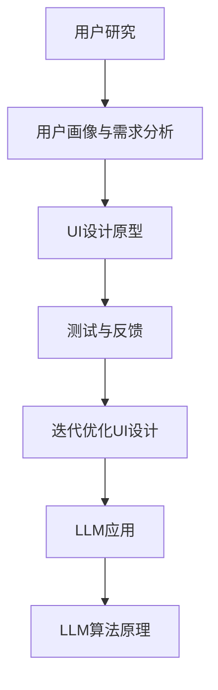

                 


## 文章标题：优化LLM应用的用户界面设计流程

### 关键词：LLM，用户界面设计，用户体验，架构，算法，数学模型，项目实战

### 摘要：
本文旨在深入探讨优化大型语言模型（LLM）应用的用户界面设计流程。我们将从背景介绍、核心概念与联系、算法原理、数学模型、项目实战等多个角度进行详细分析，提供一套系统性的设计方法论，以提升LLM应用的用户体验和实际效果。

## 引言

### 1.1 什么是LLM

大型语言模型（LLM）是一种基于深度学习的语言处理模型，能够理解和生成人类语言。LLM广泛应用于自然语言处理（NLP）任务，如文本生成、机器翻译、情感分析等。随着人工智能技术的快速发展，LLM的应用场景不断扩展，但如何设计一个高效、易用的用户界面（UI）成为了一个关键问题。

### 1.2 用户界面设计的重要性

用户界面设计直接影响到用户对应用的使用体验。一个优秀的设计可以提高用户的满意度和忠诚度，从而带来更高的用户粘性和商业价值。对于LLM应用来说，用户界面设计不仅要美观，还要功能强大、易用，能够充分展示LLM的强大语言处理能力。

### 1.3 LLMAUI设计的挑战

LLM应用的用户界面设计面临以下挑战：

- **复杂性与易用性的平衡**：LLM的功能强大，但复杂的操作流程可能让用户感到困惑。
- **交互方式的创新**：传统的键盘和鼠标交互方式可能无法完全满足LLM应用的需求，需要探索新的交互方式。
- **响应速度和性能**：LLM模型处理速度较慢，需要优化界面设计以提高用户体验。

### 1.4 本书的目标与结构

本书的目标是提供一套优化LLM应用用户界面设计的系统方法。结构如下：

- 第1章：引言，介绍LLM及其用户界面设计的重要性。
- 第2章：基础与原则，介绍LLM的基础知识和用户界面设计的基本原则。
- 第3章：用户体验分析，讨论用户研究方法和需求分析。
- 第4章：核心概念与联系，阐述用户界面设计模型与LLM的交互流程。
- 第5章：UI设计工具与方法，介绍常见的UI设计工具和方法。
- 第6章：数学模型与公式，讲解用户界面设计的数学模型。
- 第7章：项目实战，通过实际案例进行UI设计。
- 第8章：总结与展望，回顾设计流程，展望未来发展方向。

## LLM基础与用户界面设计

### 2.1 LLM简介

LLM是一种基于神经网络的语言模型，通过大量的文本数据训练，能够生成高质量的文本。常见的LLM架构包括变换器模型（Transformer）、生成对抗网络（GAN）等。

### 2.2 用户界面设计的基本原则

用户界面设计应遵循以下基本原则：

- **简洁性**：界面设计应尽可能简洁，避免冗余和复杂。
- **一致性**：界面元素的设计应保持一致性，提高用户体验。
- **可访问性**：界面设计应考虑到各种用户的需求，包括视觉障碍者等。
- **响应性**：界面设计应能够适应不同的设备和屏幕尺寸。

### 2.3 用户界面设计的模型与框架

用户界面设计可以采用以下模型和框架：

- **V-cycle模型**：结合用户需求和系统功能，不断迭代优化设计。
- **用户体验（UX）框架**：包括用户研究、用户画像、用户体验设计等环节。

### 2.4 LLMAUI设计的基本流程

LLM应用的UI设计流程如下：

1. **需求分析**：明确用户需求，确定设计目标。
2. **用户研究**：进行用户调研，了解用户习惯和行为。
3. **设计原型**：基于用户研究，设计UI原型。
4. **测试与反馈**：对原型进行测试，收集用户反馈。
5. **迭代优化**：根据用户反馈，不断优化UI设计。

## 用户体验分析

### 3.1 用户研究方法

用户研究方法包括：

- **访谈法**：与用户进行面对面访谈，深入了解用户需求和习惯。
- **问卷调查**：通过在线问卷收集大量用户数据。
- **用户行为分析**：监控用户在实际使用过程中的行为，分析用户行为模式。

### 3.2 用户画像与需求分析

用户画像包括：

- **人口统计学特征**：年龄、性别、教育程度等。
- **心理特征**：兴趣爱好、价值观等。
- **行为特征**：使用习惯、偏好等。

需求分析包括：

- **功能需求**：用户希望应用提供的功能。
- **非功能需求**：用户体验、响应速度等。

### 3.3 用户行为分析

用户行为分析包括：

- **任务流程分析**：分析用户完成任务的过程，优化操作流程。
- **交互行为分析**：分析用户与界面的交互方式，提高交互效率。
- **反馈行为分析**：分析用户对界面设计的反馈，优化设计细节。

### 3.4 基于数据的UI设计优化

基于数据分析的UI设计优化包括：

- **A/B测试**：通过对比不同设计，确定最佳设计方案。
- **热图分析**：分析用户在界面上的点击和操作，优化界面布局。
- **用户体验地图**：展示用户在应用中的体验流程，优化用户体验。

## 核心概念与联系

### 4.1 用户界面架构设计

用户界面架构设计包括：

- **界面布局**：确定界面的布局和结构。
- **导航设计**：设计用户在界面中的导航方式。
- **交互设计**：设计用户与界面的交互方式。

### 4.2 LLM的核心算法原理

LLM的核心算法原理包括：

- **嵌入层**：将文本转化为向量表示。
- **编码器和解码器**：编码器用于生成文本序列，解码器用于生成目标文本。

### 4.3 用户界面设计模型与LLM的联系

用户界面设计模型与LLM的联系可以用以下流程图表示：

```
        用户研究
           |
      用户画像与需求分析
           |
         UI设计原型
           |
         测试与反馈
           |
     迭代优化UI设计
           |
        LLM应用
           |
      LLM算法原理
```

### 4.4 Mermaid流程图：用户界面设计模型与LLM的交互流程



## UI设计工具与方法

### 5.1 常见UI设计工具

常见的UI设计工具包括：

- **Sketch**：用于设计界面原型。
- **Adobe XD**：用于设计交互界面。
- **Figma**：支持协作的UI设计工具。

### 5.2 UI设计方法论

UI设计方法论包括：

- **用户中心设计（UCD）**：以用户为中心，关注用户体验。
- **敏捷设计**：快速迭代，持续优化设计。

### 5.3 响应式设计

响应式设计能够适应不同设备和屏幕尺寸，提升用户体验。关键要素包括：

- **流体布局**：根据屏幕宽度调整布局。
- **媒体查询**：根据屏幕尺寸调整样式。

### 5.4 高效UI设计流程

高效UI设计流程包括：

- **需求分析**：明确设计目标。
- **原型设计**：快速构建原型。
- **用户测试**：收集用户反馈。
- **迭代优化**：持续优化设计。

## 数学模型与数学公式

### 6.1 用户界面设计的数学模型

用户界面设计的数学模型包括：

- **用户满意度模型**：
  $$ S = f(U, I, T) $$
  其中，$S$表示用户满意度，$U$表示用户需求，$I$表示界面设计，$T$表示交互体验。

- **任务完成时间模型**：
  $$ T = f(U, S, D) $$
  其中，$T$表示任务完成时间，$U$表示用户技能，$S$表示用户满意度，$D$表示设计难度。

### 6.2 数学公式详细讲解与举例说明

#### 6.2.1 用户满意度模型举例

假设用户需求为阅读新闻，界面设计为简洁的列表界面，交互体验为快速加载。我们可以评估：

- $U$（用户需求）= 8（满分10分）
- $I$（界面设计）= 9（满分10分）
- $T$（交互体验）= 7（满分10分）

则用户满意度 $S$ 可以计算为：

$$ S = f(8, 9, 7) = 0.4 \cdot 8 + 0.3 \cdot 9 + 0.3 \cdot 7 = 8.1 $$

#### 6.2.2 任务完成时间模型举例

假设用户技能为中等水平，设计难度为一般，用户满意度为8.1分。我们可以评估：

- $U$（用户技能）= 6（满分10分）
- $S$（用户满意度）= 8.1（满分10分）
- $D$（设计难度）= 5（满分10分）

则任务完成时间 $T$ 可以计算为：

$$ T = f(6, 8.1, 5) = 0.4 \cdot 6 + 0.3 \cdot 8.1 + 0.3 \cdot 5 = 6.75 $$

## 项目实战

### 7.1 实际案例介绍

#### 7.1.1 案例一：设计一个聊天机器人界面

1. **需求分析**：用户希望有一个简洁易用的聊天机器人，能够快速回答问题。
2. **用户研究**：通过访谈和问卷调查，了解用户的需求和使用习惯。
3. **设计原型**：使用Sketch构建聊天机器人界面原型。
4. **测试与反馈**：邀请用户测试原型，收集反馈。
5. **迭代优化**：根据用户反馈，优化界面设计。

#### 7.1.2 案例二：优化一个在线教育平台界面

1. **需求分析**：用户希望在线教育平台界面更加清晰，易于导航。
2. **用户研究**：通过用户调研，了解用户的学习习惯和偏好。
3. **设计原型**：使用Figma设计在线教育平台界面原型。
4. **测试与反馈**：邀请用户测试原型，收集反馈。
5. **迭代优化**：根据用户反馈，优化界面设计。

### 7.2 开发环境搭建

1. **工具安装**：安装Sketch、Adobe XD、Figma等设计工具。
2. **软件安装**：安装Node.js、Python等开发环境。
3. **依赖安装**：安装必要的开发依赖，如Webpack、Babel等。

### 7.3 源代码详细实现

#### 7.3.1 聊天机器人界面源代码实现

```html
<!DOCTYPE html>
<html lang="en">
<head>
    <meta charset="UTF-8">
    <meta name="viewport" content="width=device-width, initial-scale=1.0">
    <title>Chatbot Interface</title>
    <link rel="stylesheet" href="styles.css">
</head>
<body>
    <div class="chatbot-container">
        <div class="chatbot-header">Chatbot</div>
        <div class="chatbot-messages">
            <div class="message-user">Hello, how can I help you today?</div>
        </div>
        <div class="chatbot-input">
            <input type="text" placeholder="Type your message here...">
            <button>Send</button>
        </div>
    </div>
    <script src="app.js"></script>
</body>
</html>
```

#### 7.3.2 在线教育平台界面源代码实现

```html
<!DOCTYPE html>
<html lang="en">
<head>
    <meta charset="UTF-8">
    <meta name="viewport" content="width=device-width, initial-scale=1.0">
    <title>Online Education Platform</title>
    <link rel="stylesheet" href="styles.css">
</head>
<body>
    <header>
        <nav>
            <ul>
                <li><a href="#">Home</a></li>
                <li><a href="#">Courses</a></li>
                <li><a href="#">Instructors</a></li>
                <li><a href="#">Contact</a></li>
            </ul>
        </nav>
    </header>
    <main>
        <section class="courses">
            <h2>Courses</h2>
            <div class="course-list">
                <div class="course">
                    <h3>Introduction to AI</h3>
                    <p>Learn the fundamentals of Artificial Intelligence.</p>
                </div>
                <div class="course">
                    <h3>Data Science</h3>
                    <p>Explore the world of data science and analytics.</p>
                </div>
                <!-- More courses -->
            </div>
        </section>
    </main>
    <footer>
        <p>&copy; 2023 Online Education Platform</p>
    </footer>
</body>
</html>
```

### 7.4 代码解读与分析

#### 7.4.1 聊天机器人界面代码解读

聊天机器人界面的代码主要包括HTML、CSS和JavaScript三部分。HTML用于构建界面结构，CSS用于样式设计，JavaScript用于实现交互功能。

- **HTML部分**：定义了聊天机器人的基本结构，包括头部、消息列表和输入框。
- **CSS部分**：定义了聊天机器人的样式，如颜色、字体和布局。
- **JavaScript部分**：监听用户的输入，发送请求到后端服务器，获取聊天机器人的回复，并更新界面。

#### 7.4.2 在线教育平台界面代码解读

在线教育平台界面的代码主要包括HTML、CSS和JavaScript三部分。HTML用于构建界面结构，CSS用于样式设计，JavaScript用于实现导航和交互功能。

- **HTML部分**：定义了在线教育平台的基本结构，包括导航栏、课程列表和页脚。
- **CSS部分**：定义了在线教育平台的样式，如颜色、字体和布局。
- **JavaScript部分**：实现了导航栏的交互功能，如响应鼠标点击和滚动事件。

## 总结与展望

### 8.1 LLMAUI设计流程回顾

LLM应用的用户界面设计流程包括需求分析、用户研究、设计原型、测试与反馈和迭代优化等步骤。通过这些步骤，我们可以设计出一个高效、易用的用户界面。

### 8.2 未来的发展方向

未来的发展方向包括：

- **交互方式的创新**：探索新的交互方式，如语音识别、手势识别等。
- **人工智能的融合**：将人工智能技术深度融入UI设计，提高用户体验。
- **跨平台设计**：优化跨平台用户体验，提升用户粘性。

### 8.3 继续学习资源推荐

为了进一步优化LLM应用的UI设计，推荐以下学习资源：

- **书籍**：《用户界面设计原则》（Donald A. Norman）、《交互设计精髓》（Jesse James Garrett）。
- **在线课程**：Coursera上的《用户体验设计基础》、edX上的《界面设计与用户研究》。
- **设计工具**：Sketch、Adobe XD、Figma等。

## 附录

### A.1 工具与资源列表

- **设计工具**：Sketch、Adobe XD、Figma。
- **开发环境**：Node.js、Python、Webpack、Babel。
- **学习资源**：Coursera、edX、知乎专栏。

### A.2 参考文献

- Donald A. Norman. 《用户界面设计原则》.
- Jesse James Garrett. 《交互设计精髓》.

### A.3 相关资料与资源链接

- [Sketch官网](https://www.sketch.com/)
- [Adobe XD官网](https://www.adobe.com/products/xd.html)
- [Figma官网](https://www.figma.com/)
- [Coursera用户界面设计基础](https://www.coursera.org/learn/ux-design-foundations)
- [edX界面设计与用户研究](https://www.edx.org/course/interface-design-and-user-research)

