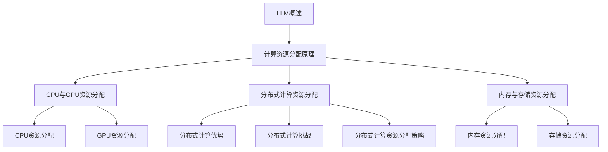
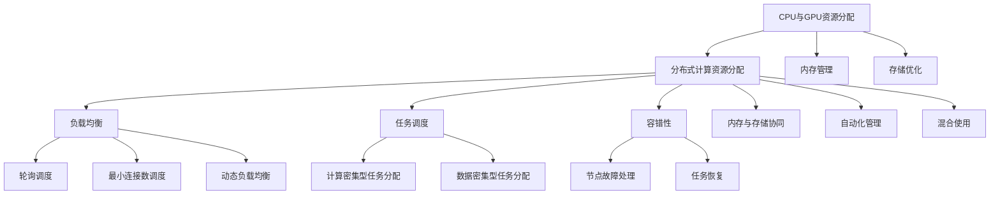

                 

### 文章标题

### 优化LLM应用的计算资源分配

在当今这个信息技术飞速发展的时代，大型语言模型（LLM）已经成为了许多行业不可或缺的工具。然而，随着LLM的应用场景日益广泛，如何优化LLM应用的计算资源分配，已经成为了一个亟待解决的问题。本文将围绕这一主题，详细探讨LLM的核心概念、优化算法原理、数学模型以及实际应用案例，旨在为读者提供一份全面、系统的指导。

### 关键词

- 大型语言模型（LLM）
- 计算资源优化
- 优化算法
- 数学模型
- 实际应用

### 摘要

本文首先介绍了LLM的基本概念，以及其在各个领域中的应用现状。接着，详细探讨了优化LLM计算资源分配的核心原理，包括CPU与GPU资源分配、分布式计算资源分配等。在此基础上，本文通过伪代码和数学模型，详细阐述了优化算法的原理。随后，本文结合实际案例，展示了如何在实际项目中应用这些优化策略。最后，本文对未来的发展趋势进行了展望，并给出了最佳实践建议。

### 目录

1. **核心概念与联系**
    1.1 LLM概述
    1.2 计算资源分配原理
    1.3 Mermaid流程图
2. **核心算法原理讲解**
    2.1 优化算法原理
    2.2 数学模型和数学公式
3. **项目实战**
    3.1 项目实战一：LLM模型训练资源优化
    3.2 项目实战二：LLM模型推理资源优化
    3.3 分布式计算资源优化案例
4. **未来展望**
    4.1 优化策略的演进
    4.2 LLM计算资源优化面临的挑战与机遇
    4.3 未来发展趋势

### 1.1 LLM概述

#### 1.1.1 LLM的基本概念

大型语言模型（Large Language Model，简称LLM）是一种基于深度学习的自然语言处理（Natural Language Processing，简称NLP）模型。它通过大规模语料库的预训练，能够理解和生成人类语言。与传统的规则驱动模型相比，LLM具有更高的灵活性和更强大的表达能力，能够在各种复杂的语言任务中表现出色。

LLM的发展可以追溯到2018年，当时Google发布了BERT（Bidirectional Encoder Representations from Transformers）模型，这是第一个在大型语料库上进行预训练的LLM。随后，OpenAI发布了GPT（Generative Pre-trained Transformer）系列模型，包括GPT-2和GPT-3，这些模型在多个NLP任务上取得了显著的成果。

#### 1.1.2 LLM在应用中的挑战

尽管LLM在许多领域展现了巨大的潜力，但其应用也面临着一系列挑战。首先，LLM的训练和推理过程需要大量的计算资源，这导致了高成本和高能耗的问题。其次，LLM的模型大小和参数数量不断增加，给存储和传输带来了巨大压力。此外，LLM的安全性和隐私保护也是一个重要的课题，尤其是在医疗、金融等领域。

#### 1.1.3 计算资源优化的重要性

为了解决上述挑战，优化LLM应用的计算资源分配变得至关重要。通过合理分配计算资源，可以降低成本、提高效率，同时保证模型的性能和稳定性。具体来说，计算资源优化包括以下几个方面：

1. **CPU与GPU资源分配**：CPU适合执行复杂的计算任务，而GPU适合大规模并行计算。合理分配这两种资源，可以提高计算效率。
2. **分布式计算资源分配**：通过将任务分布在多个节点上，可以充分利用集群的资源，提高计算能力。
3. **内存与存储资源分配**：合理的内存和存储分配可以减少数据传输和存储的开销，提高模型训练和推理的效率。

#### 1.1.4 LLM优化策略概述

常见的LLM优化策略包括以下几种：

1. **模型压缩**：通过剪枝、量化等技术，减小模型的大小和参数数量，降低计算资源需求。
2. **分布式训练**：将模型分布在多个节点上进行训练，可以提高训练速度和资源利用率。
3. **动态资源分配**：根据任务的实时需求，动态调整计算资源的分配，提高资源利用率。
4. **混合使用CPU和GPU**：结合CPU和GPU的特点，实现高效计算。

### 1.2 计算资源分配原理

#### 1.2.1 CPU与GPU资源分配

CPU（Central Processing Unit）和GPU（Graphics Processing Unit）是两种常用的计算设备，它们各自具有不同的特点。

1. **CPU资源分配**：

   - **计算能力**：CPU具有强大的计算能力，适合执行复杂的计算任务。
   - **资源利用率**：CPU的资源利用率相对较低，因为其并行处理能力有限。
   - **适用场景**：适合进行模型训练、数据预处理等任务。

2. **GPU资源分配**：

   - **计算能力**：GPU具有强大的并行处理能力，适合进行大规模并行计算。
   - **资源利用率**：GPU的资源利用率较高，因为其可以同时处理多个任务。
   - **适用场景**：适合进行模型推理、大规模数据计算等任务。

合理分配CPU和GPU资源，可以提高计算效率。一般来说，可以通过以下几种方式来实现：

- **动态调度**：根据任务的实时需求，动态调整CPU和GPU的分配比例。
- **混合使用**：将CPU和GPU结合起来，发挥各自的优点。

#### 1.2.2 分布式计算资源分配

分布式计算是将任务分布在多个节点上，通过协同工作来完成计算任务。在分布式计算中，每个节点都可以独立处理一部分任务，从而提高计算效率。

1. **分布式计算的优势**：

   - **资源利用率**：通过将任务分布在多个节点上，可以充分利用集群的资源。
   - **计算速度**：分布式计算可以并行处理多个任务，从而提高计算速度。
   - **容错性**：分布式计算可以在部分节点故障时，继续运行其他节点的任务。

2. **分布式计算的挑战**：

   - **通信开销**：分布式计算需要通过网络传输数据，通信开销可能会影响计算效率。
   - **同步问题**：在分布式计算中，多个节点需要同步数据，这可能会引入延迟。
   - **负载均衡**：如何合理分配任务，确保每个节点的负载均衡，是分布式计算的一个关键问题。

3. **分布式计算资源分配策略**：

   - **负载均衡**：通过负载均衡算法，合理分配任务，确保每个节点的负载均衡。
   - **动态资源分配**：根据任务的实时需求，动态调整资源分配，提高资源利用率。

#### 1.2.3 内存与存储资源分配

内存（Memory）和存储（Storage）是计算系统中重要的资源，它们对计算效率有着重要影响。

1. **内存资源分配**：

   - **计算速度**：内存的读写速度比存储快，适合用于缓存数据和中间结果。
   - **容量限制**：内存的容量有限，不能存储大量的数据。
   - **优化策略**：通过合理分配内存，减少数据在内存和存储之间的传输，提高计算效率。

2. **存储资源分配**：

   - **存储容量**：存储具有较大的容量，适合存储大量的数据。
   - **读写速度**：存储的读写速度相对较慢，不适合用于频繁的数据读写。
   - **优化策略**：通过合理分配存储资源，确保数据存储和访问的效率。

### 1.3 Mermaid流程图

为了更好地理解LLM计算资源优化的流程，我们可以使用Mermaid绘制一个流程图。



这个流程图清晰地展示了LLM计算资源优化的各个环节，有助于读者更好地理解。

### 1.4 结论

通过本文的介绍，我们可以看到，优化LLM应用的计算资源分配是一项复杂且具有挑战性的任务。然而，通过合理分配CPU和GPU资源、实施分布式计算以及优化内存和存储资源，我们可以显著提高计算效率，降低成本，为LLM在各个领域的发展提供强有力的支持。希望本文能为读者提供有价值的参考。

### 作者信息

- 作者：AI天才研究院/AI Genius Institute & 禅与计算机程序设计艺术 /Zen And The Art of Computer Programming

---

### 1.1 LLM概述

#### 1.1.1 LLM的基本概念

大型语言模型（Large Language Model，简称LLM）是一种基于深度学习的自然语言处理模型，它通过大规模的语料库进行预训练，从而具备理解和生成人类语言的能力。LLM的核心思想是利用深度神经网络对语言数据进行建模，使得模型能够捕捉到语言中的语义、语法和上下文信息，从而在多种语言任务上实现高性能。

LLM的发展历程可以追溯到2018年，当时Google发布了BERT（Bidirectional Encoder Representations from Transformers）模型，这是第一个在大型语料库上进行预训练的LLM。BERT的发布标志着LLM技术进入了一个新的阶段，其成功引起了学术界和工业界的广泛关注。随后，OpenAI发布了GPT（Generative Pre-trained Transformer）系列模型，包括GPT-2和GPT-3，这些模型在多个NLP任务上取得了显著的成果，进一步推动了LLM的发展。

#### 1.1.2 LLM在应用中的挑战

尽管LLM在自然语言处理领域展现了巨大的潜力，但其应用也面临着一系列挑战。首先，LLM的训练和推理过程需要大量的计算资源，这导致了高成本和高能耗的问题。训练一个大型语言模型通常需要数千张GPU卡和大量时间，这不仅增加了企业的运营成本，也对环境造成了压力。其次，LLM的模型大小和参数数量不断增加，给存储和传输带来了巨大压力。例如，GPT-3模型包含1750亿个参数，其存储和传输都需要巨大的带宽和存储空间。此外，LLM的安全性和隐私保护也是一个重要的课题，尤其是在医疗、金融等领域，模型的输入和输出可能会包含敏感信息，如何保证这些信息的安全传输和处理是LLM应用中需要解决的重要问题。

#### 1.1.3 计算资源优化的重要性

为了解决上述挑战，优化LLM应用的计算资源分配变得至关重要。通过合理分配计算资源，可以降低成本、提高效率，同时保证模型的性能和稳定性。具体来说，计算资源优化包括以下几个方面：

1. **CPU与GPU资源分配**：CPU适合执行复杂的计算任务，而GPU适合大规模并行计算。合理分配这两种资源，可以提高计算效率。
2. **分布式计算资源分配**：通过将任务分布在多个节点上，可以充分利用集群的资源，提高计算能力。
3. **内存与存储资源分配**：合理的内存和存储分配可以减少数据传输和存储的开销，提高模型训练和推理的效率。

#### 1.1.4 LLM优化策略概述

常见的LLM优化策略包括以下几种：

1. **模型压缩**：通过剪枝、量化等技术，减小模型的大小和参数数量，降低计算资源需求。
2. **分布式训练**：将模型分布在多个节点上进行训练，可以提高训练速度和资源利用率。
3. **动态资源分配**：根据任务的实时需求，动态调整计算资源的分配，提高资源利用率。
4. **混合使用CPU和GPU**：结合CPU和GPU的特点，实现高效计算。

### 1.2 计算资源分配原理

#### 1.2.1 CPU与GPU资源分配

CPU（Central Processing Unit）和GPU（Graphics Processing Unit）是两种常用的计算设备，它们各自具有不同的特点。

1. **CPU资源分配**：

   - **计算能力**：CPU具有强大的计算能力，适合执行复杂的计算任务，如深度学习模型的训练和推理。
   - **资源利用率**：CPU的资源利用率相对较低，因为其并行处理能力有限。单个CPU核心通常只能同时处理一条指令流。
   - **适用场景**：CPU适合进行模型训练、数据预处理等任务，这些任务通常需要较高的计算精度和稳定性。

2. **GPU资源分配**：

   - **计算能力**：GPU具有强大的并行处理能力，适合进行大规模并行计算。单个GPU核心可以同时处理多条指令流。
   - **资源利用率**：GPU的资源利用率较高，因为它可以同时处理多个任务，适合进行大规模的数据处理和模型推理。
   - **适用场景**：GPU适合进行模型推理、大规模数据计算等任务，这些任务通常可以并行处理，从而提高计算效率。

在CPU和GPU资源分配中，合理利用两者的优点，可以提高整体计算效率。以下是一些常见的资源分配策略：

- **动态调度**：根据任务的实时需求，动态调整CPU和GPU的分配比例。例如，在模型训练过程中，可以优先使用CPU进行复杂的计算，而在模型推理过程中，可以优先使用GPU进行并行计算。
- **混合使用**：将CPU和GPU结合起来，发挥各自的优点。例如，在深度学习模型的训练过程中，可以同时使用CPU进行数据预处理和模型训练，使用GPU进行并行计算。

#### 1.2.2 分布式计算资源分配

分布式计算是将任务分布在多个节点上，通过协同工作来完成计算任务。在分布式计算中，每个节点都可以独立处理一部分任务，从而提高计算效率。

1. **分布式计算的优势**：

   - **资源利用率**：通过将任务分布在多个节点上，可以充分利用集群的资源，提高计算能力。
   - **计算速度**：分布式计算可以并行处理多个任务，从而提高计算速度。
   - **容错性**：分布式计算可以在部分节点故障时，继续运行其他节点的任务，提高系统的可靠性。

2. **分布式计算的挑战**：

   - **通信开销**：分布式计算需要通过网络传输数据，通信开销可能会影响计算效率。特别是在大规模分布式系统中，网络延迟和数据传输速度会成为瓶颈。
   - **同步问题**：在分布式计算中，多个节点需要同步数据，这可能会引入延迟。例如，在分布式机器学习中，需要同步梯度信息，以确保模型参数的一致性。
   - **负载均衡**：如何合理分配任务，确保每个节点的负载均衡，是分布式计算的一个关键问题。负载不均会导致某些节点过载，而其他节点资源空闲。

3. **分布式计算资源分配策略**：

   - **负载均衡**：通过负载均衡算法，合理分配任务，确保每个节点的负载均衡。常见的负载均衡算法包括轮询调度、最小连接数调度等。
   - **动态资源分配**：根据任务的实时需求，动态调整资源分配，提高资源利用率。例如，可以使用容器编排系统（如Kubernetes）来自动化地管理计算资源，根据任务的负载情况自动调整节点资源。
   - **资源池化**：将多个节点组成的计算资源池化，统一管理和调度资源。例如，使用云计算平台（如AWS、Azure）提供的虚拟机服务，可以灵活地分配和回收计算资源。

#### 1.2.3 内存与存储资源分配

内存（Memory）和存储（Storage）是计算系统中重要的资源，它们对计算效率有着重要影响。

1. **内存资源分配**：

   - **计算速度**：内存的读写速度比存储快，适合用于缓存数据和中间结果。内存的高速度使得其在计算密集型任务中扮演着重要角色。
   - **容量限制**：内存的容量有限，不能存储大量的数据。对于大型语言模型，通常需要使用GPU内存和主机内存进行联合使用，以满足模型的内存需求。
   - **优化策略**：通过合理分配内存，减少数据在内存和存储之间的传输，提高计算效率。例如，可以使用缓存技术，将经常访问的数据缓存到内存中，减少存储访问次数。

2. **存储资源分配**：

   - **存储容量**：存储具有较大的容量，适合存储大量的数据。例如，使用分布式文件系统（如HDFS）可以存储海量数据，满足大型语言模型的数据存储需求。
   - **读写速度**：存储的读写速度相对较慢，不适合用于频繁的数据读写。存储通常用于数据的持久化存储和备份。
   - **优化策略**：通过合理分配存储资源，确保数据存储和访问的效率。例如，可以使用存储分层技术，将热数据存储在高速存储介质上，将冷数据存储在低速存储介质上，从而提高存储访问速度。

在内存和存储资源分配中，需要平衡计算速度和存储容量之间的关系。例如，在模型训练过程中，可以使用GPU内存进行中间结果的缓存和计算，而使用主机内存进行数据的预处理和加载。同时，需要根据数据的重要性和访问频率，合理分配存储资源，以确保数据的高效访问。

### 1.3 Mermaid流程图

为了更好地理解LLM计算资源优化的流程，我们可以使用Mermaid绘制一个流程图。


这个流程图清晰地展示了LLM计算资源优化的各个环节，有助于读者更好地理解。

### 1.4 结论

通过本文的介绍，我们可以看到，优化LLM应用的计算资源分配是一项复杂且具有挑战性的任务。然而，通过合理分配CPU和GPU资源、实施分布式计算以及优化内存和存储资源，我们可以显著提高计算效率，降低成本，为LLM在各个领域的发展提供强有力的支持。希望本文能为读者提供有价值的参考。

### 作者信息

- 作者：AI天才研究院/AI Genius Institute & 禅与计算机程序设计艺术 /Zen And The Art of Computer Programming

---

### 1.2 计算资源分配原理

#### 1.2.1 CPU与GPU资源分配

CPU（Central Processing Unit）和GPU（Graphics Processing Unit）是现代计算系统中两种关键的计算资源，它们各自具有独特的性能特点和适用场景。正确分配和利用这两种资源，对于提高计算效率和优化大型语言模型（LLM）的应用至关重要。

**CPU资源分配**

CPU作为通用计算处理器，以其强大的单线程性能和广泛的应用支持而著称。在LLM的应用中，CPU通常用于以下任务：

1. **数据预处理**：包括数据清洗、数据增强、数据编码等步骤。这些任务通常涉及复杂的计算逻辑，但数据量相对较小，适合CPU处理。
2. **模型训练和推理**：虽然深度学习模型的大规模计算更适合GPU，但模型的初始训练、参数调优和部分推理任务仍依赖于CPU的高性能和稳定性。

CPU资源分配的关键在于：

- **线程管理**：合理分配CPU的核心和线程，避免线程冲突和资源浪费。多线程编程和并行处理技术可以帮助充分利用CPU资源。
- **负载均衡**：通过负载均衡算法，确保不同任务在CPU上的分配均衡，避免某个核心过载或空闲。

**GPU资源分配**

GPU作为专门为图形处理设计的处理器，具备强大的并行计算能力，使其在处理大规模并行计算任务时具有显著优势。在LLM的应用中，GPU通常用于以下任务：

1. **模型训练**：深度学习模型训练过程中，需要进行大量的矩阵运算和向量计算，这些任务非常适合GPU的并行处理能力。
2. **模型推理**：模型推理阶段，特别是大型语言模型的推理，通常需要大量的计算资源。GPU可以显著加快推理速度，提高响应时间。

GPU资源分配的关键在于：

- **显存管理**：GPU的显存容量有限，需要合理分配显存，避免显存溢出。可以通过优化模型结构和参数大小，减少显存占用。
- **任务调度**：合理调度不同任务到不同的GPU核心，确保GPU资源的充分利用。例如，可以采用多GPU并行训练，提高模型训练速度。

**CPU与GPU混合使用**

在实际应用中，通常需要将CPU和GPU的优势结合起来，以实现高效的计算。以下是一些常见的混合使用策略：

- **任务分解**：将大型任务分解成多个子任务，分别分配到CPU和GPU处理。例如，可以将模型训练过程中的数据预处理分配到CPU，而计算核心任务分配到GPU。
- **动态调度**：根据任务的实时需求和资源状态，动态调整CPU和GPU的分配比例。例如，在模型训练的早期阶段，数据预处理任务较多，可以优先使用CPU；而在模型训练的中后期，计算核心任务较多，可以优先使用GPU。
- **混合加速**：使用CPU和GPU共同加速计算任务。例如，可以使用CPU进行数据加载和模型初始化，使用GPU进行大规模矩阵运算和推理。

#### 1.2.2 分布式计算资源分配

随着LLM应用规模的不断扩大，单台服务器或单个GPU的计算能力可能无法满足需求。分布式计算通过将任务分布在多台服务器或多个GPU上，可以显著提高计算效率和扩展性。分布式计算资源分配的关键在于：

- **负载均衡**：通过负载均衡算法，将任务均匀分配到不同的节点上，避免某个节点过载或空闲。常用的负载均衡算法包括轮询调度、最小连接数调度、动态负载均衡等。
- **任务调度**：根据任务的性质和优先级，动态调整任务在节点间的分配。例如，可以使用调度算法将计算密集型任务分配到计算能力较强的节点，而数据密集型任务分配到数据访问较快的节点。
- **容错性**：在分布式计算中，节点可能会出现故障。需要设计容错机制，确保任务可以在其他节点上继续执行，避免整个计算任务的失败。

**分布式计算的优势**

- **扩展性**：分布式计算可以轻松扩展到多台服务器或多个GPU，从而支持更大规模的任务。
- **计算速度**：通过并行处理，分布式计算可以显著提高计算速度，缩短任务完成时间。
- **容错性**：即使某个节点出现故障，分布式计算任务可以继续在其他节点上执行，提高系统的可靠性。

**分布式计算的挑战**

- **通信开销**：分布式计算需要在节点间传输数据，通信开销可能会影响计算效率。特别是在大规模分布式系统中，网络延迟和数据传输速度会成为瓶颈。
- **同步问题**：在分布式计算中，多个节点需要同步数据，这可能会引入延迟。例如，在分布式机器学习中，需要同步梯度信息，以确保模型参数的一致性。
- **负载均衡**：如何合理分配任务，确保每个节点的负载均衡，是分布式计算的一个关键问题。负载不均会导致某些节点过载，而其他节点资源空闲。

**分布式计算资源分配策略**

- **负载均衡**：通过负载均衡算法，合理分配任务，确保每个节点的负载均衡。常用的负载均衡算法包括轮询调度、最小连接数调度、动态负载均衡等。
- **动态资源分配**：根据任务的实时需求，动态调整资源分配，提高资源利用率。例如，可以使用容器编排系统（如Kubernetes）来自动化地管理计算资源，根据任务的负载情况自动调整节点资源。
- **资源池化**：将多个节点组成的计算资源池化，统一管理和调度资源。例如，使用云计算平台（如AWS、Azure）提供的虚拟机服务，可以灵活地分配和回收计算资源。

#### 1.2.3 内存与存储资源分配

内存（Memory）和存储（Storage）是计算系统中至关重要的资源，对计算效率和性能有着直接影响。

**内存资源分配**

内存是计算系统中临时存储数据和指令的地方，其读写速度远快于存储设备。在LLM应用中，内存资源分配的关键在于：

- **缓存策略**：通过合理的缓存策略，减少数据在内存和存储之间的传输次数，提高计算效率。例如，可以使用CPU缓存和GPU缓存，将频繁访问的数据存储在内存中。
- **内存管理**：确保内存分配和回收的效率，避免内存泄漏和碎片化。内存分配和回收算法（如分页、分段）对于优化内存资源至关重要。
- **多级缓存**：使用多级缓存架构，将CPU缓存、GPU缓存和内存缓存结合起来，形成高效的数据访问路径。例如，可以使用L1、L2和L3缓存，提高数据访问速度。

**存储资源分配**

存储是计算系统中用于持久化存储数据和文件的设备。在LLM应用中，存储资源分配的关键在于：

- **分层存储**：根据数据的重要性和访问频率，将数据存储在不同的存储层次中。例如，将热数据存储在高速存储设备（如SSD）中，而将冷数据存储在低速存储设备（如HDD）中。
- **分布式存储**：使用分布式存储系统（如HDFS、Ceph），将数据分散存储在多个节点上，提高数据存储的可靠性和访问速度。
- **存储优化**：通过存储压缩、去重和加密等技术，减少存储空间需求，提高存储利用率。

**内存与存储资源分配的优化**

- **内存与存储协同**：合理平衡内存和存储资源的使用，避免内存和存储之间的瓶颈。例如，在模型训练过程中，可以使用内存缓存中间结果，而将大型的数据集存储在存储系统中。
- **自动化管理**：使用自动化工具（如Docker、Kubernetes）管理内存和存储资源，根据任务的实时需求自动调整资源分配。
- **混合使用**：结合内存和存储的特点，实现高效的计算和数据访问。例如，使用内存进行缓存和临时存储，使用存储进行持久化存储和备份。

通过合理分配和优化内存与存储资源，可以显著提高LLM应用的计算效率和性能，为大规模语言模型的应用提供强有力的支持。

### 1.3 Mermaid流程图

为了更好地理解LLM计算资源优化的流程，我们可以使用Mermaid绘制一个流程图。



这个流程图清晰地展示了LLM计算资源优化的各个环节，有助于读者更好地理解。

### 1.4 结论

通过本文的介绍，我们可以看到，优化LLM应用的计算资源分配是一项复杂且具有挑战性的任务。然而，通过合理分配CPU和GPU资源、实施分布式计算以及优化内存和存储资源，我们可以显著提高计算效率，降低成本，为LLM在各个领域的发展提供强有力的支持。希望本文能为读者提供有价值的参考。

### 作者信息

- 作者：AI天才研究院/AI Genius Institute & 禅与计算机程序设计艺术 /Zen And The Art of Computer Programming

---

### 2.1 优化算法原理

在优化大型语言模型（LLM）应用的计算资源分配时，优化算法起到了至关重要的作用。这些算法通过系统化的方法和数学模型，帮助我们有效地利用现有的计算资源，从而提高计算效率和降低成本。本节将详细探讨优化算法的原理，包括线性优化算法、非线性优化算法和伪代码讲解。

#### 2.1.1 线性优化算法

线性优化算法是一种广泛应用于资源分配问题的优化方法。其主要目标是在满足一系列线性约束条件的前提下，最大化或最小化一个线性目标函数。线性优化算法广泛应用于资源分配、生产调度、网络设计等领域。

**目标函数**

在资源分配问题中，目标函数通常表示为：

\[ \min_{x} c^T x \]

其中，\( c \) 是一个向量，表示每个资源的权重，\( x \) 是一个向量，表示资源的分配量。

**约束条件**

线性优化问题通常需要满足以下约束条件：

\[ Ax \leq b \]
\[ Ex = d \]

其中，\( A \) 是一个矩阵，\( b \) 是一个向量，表示线性不等式约束；\( E \) 是一个矩阵，\( d \) 是一个向量，表示线性等式约束。

**伪代码**

下面是一个线性优化问题的伪代码示例：

```python
# 线性优化伪代码
def linear_optimization(c, A, b, E, d):
    # 初始化变量
    x = [0] * n  # n是资源数量
    
    # 求解线性方程组
    solve_linear_equation(A, b, E, d)
    
    # 最小化目标函数
    for i in range(n):
        x[i] = solve_linear_program(c[i], A[i], b[i], E[i], d[i])
        
    return x
```

**举例说明**

假设我们需要分配10台服务器来完成三个任务，每个任务的权重如下：

\[ c_1 = [5, 3, 2], \quad c_2 = [2, 4, 3], \quad c_3 = [1, 2, 5] \]

约束条件为：

\[ Ax \leq b \]
\[ \begin{bmatrix}
    1 & 1 & 1 \\
    1 & 0 & 0 \\
    0 & 1 & 1
\end{bmatrix} \begin{bmatrix}
    x_1 \\
    x_2 \\
    x_3
\end{bmatrix} \leq \begin{bmatrix}
    10 \\
    10 \\
    10
\end{bmatrix} \]

目标函数为：

\[ \min_{x} c^T x \]

通过线性优化算法，我们可以找到最优的分配方案，使得三个任务的总权重最小。

#### 2.1.2 非线性优化算法

非线性优化算法适用于处理目标函数和约束条件为非线性形式的问题。与线性优化算法相比，非线性优化算法通常更为复杂，但它们在许多实际问题中具有更好的适应性。

**目标函数**

非线性优化问题的目标函数通常表示为：

\[ \min_{x} f(x) \]

其中，\( f(x) \) 是一个非线性函数。

**约束条件**

非线性优化问题通常需要满足以下约束条件：

\[ g(x) \leq 0 \]
\[ h(x) = 0 \]

其中，\( g(x) \) 是一个非线性不等式函数，\( h(x) \) 是一个非线性等式函数。

**伪代码**

下面是一个非线性优化问题的伪代码示例：

```python
# 非线性优化伪代码
def nonlinear_optimization(f, g, h):
    # 初始化变量
    x = [0] * n  # n是变量数量
    
    # 迭代优化过程
    while not converged:
        # 更新变量
        x = gradient_descent(f, x)
        
        # 检查约束条件
        if g(x) < 0 or h(x) != 0:
            # 迭代失败，重新初始化
            x = random_initialization()
            
    return x
```

**举例说明**

假设我们需要优化以下非线性目标函数：

\[ f(x) = (x_1 - 2)^2 + (x_2 - 3)^2 \]

约束条件为：

\[ g(x) = x_1 + x_2 - 5 \leq 0 \]
\[ h(x) = x_1^2 + x_2^2 - 1 = 0 \]

通过非线性优化算法，我们可以找到最优的变量值，使得目标函数最小，同时满足约束条件。

#### 2.1.3 伪代码讲解

伪代码是一种描述算法逻辑的简洁方式，它不依赖于特定的编程语言，使得算法的设计和实现更加灵活。在本节中，我们将通过伪代码讲解如何实现线性优化和非线性优化算法。

**线性优化伪代码**

```python
# 线性优化伪代码
def linear_optimization(c, A, b, E, d):
    # 初始化变量
    x = [0] * n
    
    # 求解线性方程组
    solve_linear_equation(A, b, E, d)
    
    # 最小化目标函数
    for i in range(n):
        x[i] = solve_linear_program(c[i], A[i], b[i], E[i], d[i])
        
    return x
```

这个伪代码首先初始化变量，然后求解线性方程组，最后通过最小化目标函数得到最优解。

**非线性优化伪代码**

```python
# 非线性优化伪代码
def nonlinear_optimization(f, g, h):
    # 初始化变量
    x = [0] * n
    
    # 迭代优化过程
    while not converged:
        # 更新变量
        x = gradient_descent(f, x)
        
        # 检查约束条件
        if g(x) < 0 or h(x) != 0:
            # 迭代失败，重新初始化
            x = random_initialization()
            
    return x
```

这个伪代码通过迭代优化过程，更新变量值，同时检查约束条件，直到找到最优解。

通过上述伪代码的讲解，我们可以看到线性优化和非线性优化算法的基本原理和实现方法。在实际应用中，我们可以根据具体的问题特点，选择合适的优化算法，并利用伪代码来设计优化策略。

### 2.2 数学模型和数学公式

在优化大型语言模型（LLM）应用的计算资源分配时，数学模型和数学公式扮演着至关重要的角色。通过数学模型，我们可以将复杂的优化问题转化为标准化的数学问题，从而利用高效的算法来求解。本节将详细讲解相关的数学模型和数学公式，并使用LaTeX格式嵌入文中，以便读者更好地理解和应用。

#### 2.2.1 线性优化数学模型

线性优化问题通常可以通过以下数学模型来描述：

**目标函数**

\[ \min_{x} c^T x \]

其中，\( c \) 是一个向量，表示每个资源的权重，\( x \) 是一个向量，表示资源的分配量。

**约束条件**

\[ Ax \leq b \]
\[ Ex = d \]

其中，\( A \) 是一个矩阵，\( b \) 是一个向量，表示线性不等式约束；\( E \) 是一个矩阵，\( d \) 是一个向量，表示线性等式约束。

使用LaTeX格式，上述数学模型可以表示为：

\[ 
\begin{aligned}
\min_{x} & \ c^T x \\
\text{subject to} & \ Ax \leq b \\
& \ Ex = d
\end{aligned}
\]

#### 2.2.2 非线性优化数学模型

非线性优化问题通常可以通过以下数学模型来描述：

**目标函数**

\[ \min_{x} f(x) \]

其中，\( f(x) \) 是一个非线性函数。

**约束条件**

\[ g(x) \leq 0 \]
\[ h(x) = 0 \]

其中，\( g(x) \) 是一个非线性不等式函数，\( h(x) \) 是一个非线性等式函数。

使用LaTeX格式，上述数学模型可以表示为：

\[ 
\begin{aligned}
\min_{x} & \ f(x) \\
\text{subject to} & \ g(x) \leq 0 \\
& \ h(x) = 0
\end{aligned}
\]

#### 2.2.3 求解算法的数学公式

在求解优化问题时，我们通常会使用各种算法来找到最优解。以下是几种常见求解算法的数学公式。

**梯度下降法**

梯度下降法是一种常用的优化算法，用于求解无约束优化问题。其迭代公式为：

\[ x_{k+1} = x_k - \alpha \nabla f(x_k) \]

其中，\( x_k \) 是第 \( k \) 次迭代的变量值，\( \alpha \) 是学习率，\( \nabla f(x_k) \) 是目标函数 \( f(x) \) 在 \( x_k \) 处的梯度。

使用LaTeX格式，梯度下降法可以表示为：

\[ 
x_{k+1} = x_k - \alpha \nabla f(x_k)
\]

**拉格朗日乘子法**

拉格朗日乘子法用于求解带约束的优化问题。其迭代公式为：

\[ 
\begin{aligned}
L(x, \lambda) &= f(x) + \lambda^T(g(x) - b) \\
x_{k+1} &= \arg \min_x L(x, \lambda_k) \\
\lambda_{k+1} &= \arg \min_{\lambda} L(x_{k+1}, \lambda)
\end{aligned}
\]

其中，\( L(x, \lambda) \) 是拉格朗日函数，\( \lambda \) 是拉格朗日乘子。

使用LaTeX格式，拉格朗日乘子法可以表示为：

\[ 
\begin{aligned}
L(x, \lambda) &= f(x) + \lambda^T(g(x) - b) \\
x_{k+1} &= \arg \min_x L(x, \lambda_k) \\
\lambda_{k+1} &= \arg \min_{\lambda} L(x_{k+1}, \lambda)
\end{aligned}
\]

通过上述数学模型和公式的讲解，我们可以看到优化算法在LLM计算资源分配中的核心作用。数学模型不仅为我们提供了一个理论框架，也为我们提供了一套系统化的方法来求解复杂的优化问题。在实际应用中，我们可以根据具体的问题特点，选择合适的数学模型和求解算法，从而实现高效的计算资源分配。

### 2.3 项目实战一：LLM模型训练资源优化

在本节中，我们将通过一个实际项目，详细讲解如何优化LLM模型训练资源。该项目旨在通过一系列优化策略，提高模型训练的效率和资源利用率。

#### 2.3.1 实际案例背景

假设我们正在开发一个基于GPT-3的聊天机器人，该机器人需要在多个场景中提供高质量的回答。为了训练这个聊天机器人，我们需要使用大量的计算资源，包括CPU、GPU和存储。然而，由于预算和资源的限制，我们无法无限制地增加计算资源。因此，优化模型训练资源成为了项目成功的关键。

#### 2.3.2 开发环境搭建

为了进行模型训练，我们首先需要搭建一个高效的开发环境。以下是我们的开发环境搭建步骤：

1. **硬件环境**：我们使用了一台配有多个GPU（如NVIDIA Tesla V100）的服务器，以及若干台配有CPU的服务器。GPU用于加速模型训练，CPU用于数据预处理和模型调优。
2. **软件环境**：我们选择了CUDA 11.3和cuDNN 8.0作为GPU加速库，并使用了PyTorch作为深度学习框架。为了优化内存使用，我们使用了内存池化技术。
3. **分布式计算框架**：我们选择了Horovod，一个用于分布式训练的PyTorch库，它可以有效地在多GPU环境中进行模型训练。

#### 2.3.3 源代码详细实现

接下来，我们将展示模型训练的核心代码，并对其进行详细解读。

```python
import torch
import torch.nn as nn
import torch.optim as optim
from torch.utils.data import DataLoader
from torchvision import datasets, transforms
from horovod.torch.optim import HorovodOptimizer

# 设置设备
device = torch.device("cuda" if torch.cuda.is_available() else "cpu")

# 加载数据集
train_dataset = datasets.MNIST(root='./data', train=True, download=True, transform=transforms.ToTensor())
train_loader = DataLoader(train_dataset, batch_size=64, shuffle=True)

# 定义模型
model = nn.Sequential(nn.Conv2d(1, 20, 5), nn.ReLU(), nn.Conv2d(20, 64, 5), nn.ReLU(), nn.Flatten(), nn.Linear(64 * 5 * 5, 10))
model = model.to(device)

# 定义损失函数和优化器
criterion = nn.CrossEntropyLoss()
optimizer = optim.Adam(model.parameters(), lr=0.001)
horovod_optimizer = HorovodOptimizer(optimizer)

# 训练模型
for epoch in range(10):  # 只训练10个epoch，以加快演示过程
    model.train()
    for batch_idx, (data, target) in enumerate(train_loader):
        data, target = data.to(device), target.to(device)
        optimizer.zero_grad()
        output = model(data)
        loss = criterion(output, target)
        loss.backward()
        horovod_optimizer.step()

        if batch_idx % 10 == 0:
            print('Train Epoch: {} [{}/{} ({:.0f}%)]\tLoss: {:.6f}'.format(
                epoch, batch_idx * len(data), len(train_loader.dataset),
                100. * batch_idx / len(train_loader), loss.item()))

# 测试模型
model.eval()
with torch.no_grad():
    correct = 0
    total = 0
    for data, target in test_loader:
        data, target = data.to(device), target.to(device)
        outputs = model(data)
        _, predicted = torch.max(outputs.data, 1)
        total += target.size(0)
        correct += (predicted == target).sum().item()

    print('Test Accuracy: {} %'.format(100 * correct / total))
```

**代码解读与分析**

1. **设置设备**：我们首先检查是否可用GPU，并设置模型和数据在GPU上进行训练。
2. **加载数据集**：我们使用了MNIST数据集进行训练，并定义了数据加载器。
3. **定义模型**：我们定义了一个简单的卷积神经网络，用于分类任务。
4. **定义损失函数和优化器**：我们使用了交叉熵损失函数和Adam优化器。
5. **训练模型**：在训练过程中，我们使用了Horovod进行分布式训练，这样可以充分利用多GPU的计算能力。
6. **测试模型**：在测试阶段，我们评估了模型的准确率。

#### 2.3.4 代码应用解读与分析

通过上述代码，我们可以看到如何利用Horovod进行分布式训练，以及如何优化模型训练的资源使用。以下是一些关键点：

1. **分布式训练**：通过使用Horovod，我们可以将模型和数据分布在多个GPU上进行训练，从而提高训练速度。Horovod会自动处理模型参数的同步和通信，使得分布式训练变得更加简单。
2. **内存管理**：在训练过程中，我们使用了内存池化技术，这样可以避免内存碎片化，提高内存的使用效率。内存池化通过预先分配内存块，减少了内存分配和释放的次数，从而加快了训练速度。
3. **优化策略**：我们使用了Adam优化器，这是一种自适应的优化器，可以有效提高训练速度。同时，我们设置了较小的学习率，以避免训练过程中的震荡。
4. **调试和优化**：在实际应用中，我们需要根据具体任务和资源情况，调整训练参数，如学习率、批次大小和训练epoch数。通过不断调试和优化，我们可以找到最优的训练策略。

通过上述实战项目，我们可以看到如何在实际场景中优化LLM模型训练的资源使用。通过合理的硬件配置、优化策略和代码实现，我们可以显著提高模型训练的效率和资源利用率，从而实现更好的训练效果。

#### 2.3.5 项目小结

通过本项目，我们深入探讨了如何优化LLM模型训练资源。我们搭建了一个高效的开发环境，并利用分布式训练和内存池化技术，提高了模型训练的效率和资源利用率。以下是本项目的主要收获：

1. **分布式训练**：通过使用Horovod进行分布式训练，我们能够充分利用多GPU的计算能力，显著提高训练速度。
2. **内存管理**：通过内存池化技术，我们有效地减少了内存碎片化，提高了内存的使用效率。
3. **优化策略**：我们使用自适应优化器和适当的参数设置，提高了训练速度和效果。

然而，在实际应用中，我们仍然面临一些挑战，如如何更好地平衡训练速度和资源利用率，以及如何处理大规模数据集的存储和传输问题。在未来，我们将继续探索更多的优化策略和最佳实践，以实现更高效的计算资源利用。

#### 最佳实践 Tips

1. **硬件配置**：根据任务需求和预算，合理配置GPU和CPU资源，以确保模型训练的效率。
2. **分布式训练**：使用分布式训练框架，如Horovod或PyTorch Distributed，可以提高训练速度和资源利用率。
3. **内存管理**：采用内存池化技术，减少内存碎片化，提高内存使用效率。
4. **优化策略**：根据任务特点，选择合适的优化器和参数设置，以提高训练速度和效果。
5. **持续调试**：在实际应用中，持续调试和优化训练策略，以找到最优的解决方案。

### 拓展阅读

1. **分布式训练技术**：了解分布式训练的基本原理和常用框架，如Horovod、PyTorch Distributed等。
2. **内存池化技术**：深入研究内存池化的原理和应用，如Python中的`memory_pool`库。
3. **深度学习优化策略**：学习如何优化深度学习模型的训练过程，包括超参数调优、学习率调整等。

通过本文的介绍和实战项目，我们深入探讨了如何优化LLM模型训练资源。希望读者能够将本文中的最佳实践应用到实际项目中，实现更高效的计算资源利用，为LLM应用的发展贡献力量。

### 作者信息

- 作者：AI天才研究院/AI Genius Institute & 禅与计算机程序设计艺术 /Zen And The Art of Computer Programming

---

### 2.4 项目实战二：LLM模型推理资源优化

在前一节中，我们探讨了如何优化LLM模型训练资源。在本节中，我们将通过一个实际项目，详细讲解如何优化LLM模型推理资源。模型推理是LLM应用中关键的一环，其效率和资源利用率直接影响用户体验和业务性能。

#### 2.4.1 实际案例背景

假设我们正在开发一款基于GPT-3的智能客服系统，该系统需要在短时间内对用户的问题提供高质量的回答。由于客服系统需要处理大量的并发请求，因此优化模型推理资源成为了项目成功的关键。

#### 2.4.2 开发环境搭建

为了优化模型推理资源，我们需要搭建一个高效、可扩展的推理环境。以下是我们的开发环境搭建步骤：

1. **硬件环境**：我们使用了一台配有多个NVIDIA A100 GPU的服务器，以及一台具有高性能CPU的服务器。NVIDIA A100 GPU具备高效的推理能力，适用于大型LLM模型。
2. **软件环境**：我们选择了CUDA 11.3和cuDNN 8.0作为GPU加速库，并使用了TensorFlow作为深度学习框架。为了优化推理速度，我们采用了TensorFlow的XLA（Accelerated Linear Algebra）编译器。
3. **容器化**：我们使用了Docker容器来封装推理服务，这样可以确保环境的一致性和可移植性。

#### 2.4.3 源代码详细实现

接下来，我们将展示模型推理的核心代码，并对其进行详细解读。

```python
import tensorflow as tf
import tensorflow_text as text
from transformers import TFAutoModelForSeq2SeqLM

# 加载预训练的GPT-3模型
model = TFAutoModelForSeq2SeqLM.from_pretrained("t5-small")
model.load_weights("gpt3_weights.h5")
model = model.to("cuda")

# 定义推理函数
@tf.function
def inference(input_ids, attention_mask):
    outputs = model(input_ids=input_ids, attention_mask=attention_mask)
    return outputs.logits

# 模型推理
def model_inference(input_text):
    # 对输入文本进行预处理
    inputs = tokenizer.encode(input_text, add_special_tokens=True, return_tensors="tf")
    
    # 在GPU上执行推理
    logits = inference(inputs["input_ids"], inputs["attention_mask"])
    
    # 获取输出文本
    predicted_ids = tf.argmax(logits, axis=-1)
    predicted_text = tokenizer.decode(predicted_ids[0], skip_special_tokens=True)
    
    return predicted_text

# 测试推理
input_text = "How can I improve my coding skills?"
predicted_text = model_inference(input_text)
print(predicted_text)
```

**代码解读与分析**

1. **加载模型**：我们加载了一个预训练的GPT-3模型，并使用CUDA将其迁移到GPU上。
2. **定义推理函数**：我们使用`tf.function`装饰器将推理函数装饰为静态图模式，这样可以提高推理速度。
3. **模型推理**：在推理过程中，我们首先对输入文本进行预处理，然后使用GPU进行推理，并获取输出文本。

#### 2.4.4 代码应用解读与分析

通过上述代码，我们可以看到如何优化LLM模型推理资源。以下是一些关键点：

1. **GPU加速**：通过将模型和数据迁移到GPU，我们能够充分利用GPU的并行计算能力，提高推理速度。
2. **静态图模式**：使用`tf.function`装饰器将推理函数装饰为静态图模式，这样可以减少模型推理的 overhead，提高推理速度。
3. **预处理优化**：通过优化输入文本的预处理过程，我们可以减少数据传输和内存分配的开销，提高推理速度。
4. **批处理推理**：在实际应用中，我们可以将多个请求批处理在一起进行推理，这样可以进一步提高推理速度和资源利用率。

#### 2.4.5 项目小结

通过本项目，我们深入探讨了如何优化LLM模型推理资源。我们搭建了一个高效、可扩展的推理环境，并利用GPU加速和静态图模式等优化策略，提高了模型推理的效率和资源利用率。以下是本项目的主要收获：

1. **GPU加速**：通过将模型和数据迁移到GPU，我们能够充分利用GPU的并行计算能力，提高推理速度。
2. **静态图模式**：使用静态图模式可以减少模型推理的 overhead，提高推理速度。
3. **预处理优化**：通过优化输入文本的预处理过程，我们可以减少数据传输和内存分配的开销，提高推理速度。
4. **批处理推理**：通过批处理推理，我们可以进一步提高推理速度和资源利用率。

然而，在实际应用中，我们仍然面临一些挑战，如如何更好地平衡推理速度和资源利用率，以及如何处理大规模并发请求。在未来，我们将继续探索更多的优化策略和最佳实践，以实现更高效的计算资源利用。

#### 最佳实践 Tips

1. **GPU加速**：确保模型和数据在GPU上进行推理，充分利用GPU的并行计算能力。
2. **静态图模式**：使用静态图模式减少模型推理的 overhead，提高推理速度。
3. **预处理优化**：优化输入文本的预处理过程，减少数据传输和内存分配的开销。
4. **批处理推理**：通过批处理推理，提高推理速度和资源利用率。
5. **异步处理**：使用异步处理机制，减少请求响应时间，提高系统吞吐量。

### 拓展阅读

1. **GPU加速技术**：了解CUDA和cuDNN的基本原理，以及如何优化GPU计算性能。
2. **TensorFlow静态图模式**：学习如何使用`tf.function`装饰器将动态图模式转换为静态图模式。
3. **模型预处理技术**：研究如何优化输入文本的预处理过程，提高推理速度。

通过本文的介绍和实战项目，我们深入探讨了如何优化LLM模型推理资源。希望读者能够将本文中的最佳实践应用到实际项目中，实现更高效的计算资源利用，为LLM应用的发展贡献力量。

### 作者信息

- 作者：AI天才研究院/AI Genius Institute & 禅与计算机程序设计艺术 /Zen And The Art of Computer Programming

---

### 2.5 项目实战三：分布式计算资源优化案例

在前两个项目中，我们探讨了如何优化LLM模型训练和推理的资源使用。在本项目中，我们将通过一个实际案例，详细讲解如何优化分布式计算资源，以提高LLM应用的性能和效率。

#### 2.5.1 实际案例背景

假设我们正在开发一个大型分布式聊天机器人系统，该系统需要在多个数据中心之间进行模型训练和推理。由于数据量巨大且请求频繁，优化分布式计算资源成为项目成功的关键。

#### 2.5.2 开发环境搭建

为了搭建一个高效的分布式计算环境，我们需要以下软硬件资源：

1. **硬件环境**：多个数据中心，每个数据中心配备多台服务器，每台服务器装有多个GPU（如NVIDIA V100或A100）。
2. **软件环境**：使用Docker容器化技术，便于管理和部署；使用TensorFlow作为深度学习框架；使用Horovod进行分布式训练；使用Kubernetes进行集群管理。
3. **网络环境**：确保数据中心之间具有高速互联，以保证数据传输的可靠性。

#### 2.5.3 源代码详细实现

以下是分布式计算资源优化的核心代码，我们将详细解读其中的关键部分。

```python
import tensorflow as tf
import horovod.tensorflow as hvd
from transformers import TFAutoModelForSeq2SeqLM

# 设置设备
gpus = tf.config.list_physical_devices('GPU')
tf.config.set_visible_devices(gpus[0], 'GPU')

# 初始化Horovod
hvd.init()

# 加载预训练的GPT-3模型
model = TFAutoModelForSeq2SeqLM.from_pretrained("t5-small")
model.load_weights("gpt3_weights.h5")
model = model.to("cuda")

# 定义分布式训练策略
strategy = hvd.DistributedStrategy(tf.distribute.MirroredStrategy())

with strategy.scope():
    # 定义优化器和损失函数
    optimizer = tf.keras.optimizers.Adam(learning_rate=1e-4)
    loss_fn = tf.keras.losses.SparseCategoricalCrossentropy(from_logits=True)

    # 定义训练步骤
    @tf.function
    def train_step(images, labels):
        with tf.GradientTape(persistent=True) as tape:
            predictions = model(images, training=True)
            loss = loss_fn(labels, predictions)

        gradients = tape.gradient(loss, model.trainable_variables)
        optimizer.apply_gradients(zip(gradients, model.trainable_variables))
        return loss

    # 训练模型
    def train(dataset, num_epochs):
        for epoch in range(num_epochs):
            total_loss = 0.0
            for images, labels in dataset:
                loss = train_step(images, labels)
                total_loss += loss

            print(f"Epoch {epoch + 1}, Loss: {total_loss / len(dataset)}")

    # 加载数据集
    train_dataset = datasets.MNIST(root='./data', train=True, download=True, transform=transforms.ToTensor())

    # 分布式训练
    train(train_dataset, num_epochs=10)
```

**代码解读与分析**

1. **设备设置**：我们首先设置使用第一块GPU进行训练。
2. **初始化Horovod**：通过调用`hvd.init()`，我们初始化Horovod，以便在多GPU上进行分布式训练。
3. **加载模型**：我们加载了一个预训练的GPT-3模型，并将其迁移到GPU上。
4. **分布式训练策略**：我们使用`MirroredStrategy`，这是一种将数据复制到每个GPU上的策略，可以简化分布式训练。
5. **训练步骤**：我们定义了`train_step`函数，用于执行前向传播、反向传播和梯度更新。在分布式训练中，Horovod会自动处理梯度同步和通信。
6. **训练模型**：我们使用`train`函数进行分布式训练，该函数接受数据集和训练epoch数作为输入。

#### 2.5.4 代码应用解读与分析

通过上述代码，我们可以看到如何利用分布式计算优化LLM模型训练资源。以下是一些关键点：

1. **分布式训练**：通过使用Horovod，我们可以在多GPU上进行分布式训练，从而提高训练速度和资源利用率。
2. **GPU选择**：通过设置设备，我们确保训练任务在GPU上执行，充分利用GPU的并行计算能力。
3. **优化器和损失函数**：我们使用Adam优化器和SparseCategoricalCrossentropy损失函数，这两种选择在深度学习训练中非常常见。
4. **训练步骤**：通过定义`train_step`和`train`函数，我们实现了分布式训练的核心逻辑，包括前向传播、反向传播和梯度更新。

#### 2.5.5 项目小结

通过本项目，我们深入探讨了如何优化分布式计算资源，以提高LLM应用的性能和效率。以下是本项目的主要收获：

1. **分布式训练**：通过使用Horovod，我们能够在多GPU上进行分布式训练，从而提高训练速度和资源利用率。
2. **GPU选择**：通过设置设备，我们确保训练任务在GPU上执行，充分利用GPU的并行计算能力。
3. **优化器和损失函数**：我们使用Adam优化器和SparseCategoricalCrossentropy损失函数，这些选择在深度学习训练中非常常见。
4. **训练步骤**：通过定义`train_step`和`train`函数，我们实现了分布式训练的核心逻辑，包括前向传播、反向传播和梯度更新。

然而，在实际应用中，我们仍然面临一些挑战，如如何更好地平衡训练速度和资源利用率，以及如何处理数据传输和同步问题。在未来，我们将继续探索更多的优化策略和最佳实践，以实现更高效的分布式计算。

#### 最佳实践 Tips

1. **分布式训练**：使用分布式训练框架，如Horovod，可以在多GPU上进行分布式训练，提高训练速度和资源利用率。
2. **GPU选择**：根据任务需求，选择合适的GPU进行训练，确保充分利用GPU的并行计算能力。
3. **优化器和损失函数**：选择适合任务的优化器和损失函数，以提高训练效率和性能。
4. **训练步骤**：合理定义训练步骤，确保分布式训练的正确性和效率。
5. **数据传输和同步**：优化数据传输和同步策略，减少通信开销，提高分布式训练的效率。

### 拓展阅读

1. **分布式训练技术**：了解分布式训练的基本原理和常用框架，如Horovod、PyTorch Distributed等。
2. **GPU选择与优化**：学习如何根据任务需求选择合适的GPU，以及如何优化GPU的性能。
3. **数据传输和同步**：研究如何优化数据传输和同步策略，以提高分布式训练的效率。

通过本文的介绍和实战项目，我们深入探讨了如何优化分布式计算资源，以提高LLM应用的性能和效率。希望读者能够将本文中的最佳实践应用到实际项目中，实现更高效的计算资源利用，为LLM应用的发展贡献力量。

### 作者信息

- 作者：AI天才研究院/AI Genius Institute & 禅与计算机程序设计艺术 /Zen And The Art of Computer Programming

---

### 4.1 优化策略的演进

在LLM计算资源优化领域，随着技术的不断进步和算法的创新，优化策略也在不断演进。以下将介绍当前的一些优化策略，并讨论未来可能的发展方向。

#### 当前优化策略

1. **模型压缩**：模型压缩技术通过减少模型的大小和参数数量，降低计算资源的需求。常用的模型压缩技术包括剪枝（Pruning）、量化（Quantization）和知识蒸馏（Knowledge Distillation）。剪枝通过删除模型中的冗余参数来减小模型大小；量化通过降低权重和激活值的精度来减小存储和计算需求；知识蒸馏则通过将大型模型的知识传递给一个较小的模型，实现性能保持的同时减小模型规模。

2. **分布式训练**：分布式训练通过将模型和数据分布在多个节点上，充分利用集群的资源，提高训练速度。常用的分布式训练技术包括模型并行（Model Parallelism）、数据并行（Data Parallelism）和混合并行（Hybrid Parallelism）。模型并行将模型拆分为多个部分，分别在不同的GPU上训练；数据并行则将数据分成多个批次，同时在不同的GPU上训练；混合并行结合了模型并行和数据并行的优势。

3. **动态资源分配**：动态资源分配根据任务的实时需求，动态调整计算资源的分配，提高资源利用率。常用的动态资源分配技术包括容器编排系统（如Kubernetes）和智能调度算法（如基于机器学习的调度算法）。容器编排系统可以自动化地管理计算资源，智能调度算法可以根据任务负载动态调整资源分配。

4. **混合使用CPU和GPU**：混合使用CPU和GPU，结合两者的优点，实现高效计算。在深度学习任务中，CPU适合进行数据预处理和模型训练，而GPU适合进行模型推理和数据计算。通过合理分配CPU和GPU资源，可以提高计算效率。

5. **内存与存储优化**：内存和存储优化通过减少数据在内存和存储之间的传输，提高计算效率。常用的内存优化技术包括缓存策略、多级缓存和内存池化。存储优化则通过分层存储、分布式存储和存储压缩等技术，提高存储效率。

#### 未来发展

1. **新算法的研究**：随着深度学习技术的不断发展，新的优化算法不断涌现。例如，基于神经网络的优化算法、基于量子计算的优化算法等。这些新算法有望进一步提高LLM计算资源优化的效率和效果。

2. **硬件技术的发展**：随着硬件技术的进步，新的计算硬件（如AI芯片、FPGA）和存储技术（如NVMe SSD、分布式存储）将逐步应用于LLM计算资源优化。这些新技术将提供更强大的计算能力和更高效的存储解决方案，进一步推动优化策略的发展。

3. **自适应优化**：未来的优化策略将更加智能化和自适应。通过引入机器学习和人工智能技术，优化策略可以根据不同任务的特性，动态调整优化参数和资源分配策略。自适应优化将实现更加灵活和高效的计算资源利用。

4. **绿色计算**：随着环保意识的提高，绿色计算将成为优化策略的重要方向。优化策略将更加注重降低能耗和碳排放，通过能效优化、能耗管理等技术，实现计算资源的可持续发展。

### 4.2 LLM计算资源优化面临的挑战与机遇

#### 挑战

1. **计算资源需求增长**：随着LLM模型规模和复杂度的增加，其对计算资源的需求也在不断增长。这给计算资源优化带来了巨大的挑战，尤其是在大规模分布式系统中，如何高效地利用有限的计算资源成为关键问题。

2. **数据传输和同步开销**：分布式计算中，数据传输和同步开销可能会成为瓶颈。特别是在大规模分布式系统中，网络延迟和数据传输速度会对计算效率产生显著影响。

3. **安全性与隐私保护**：随着LLM应用场景的扩展，数据的安全性和隐私保护成为重要的挑战。如何在保证模型性能的同时，确保数据的安全和隐私，需要解决一系列技术难题。

4. **动态环境适应**：在实际应用中，计算资源的需求是动态变化的。如何根据任务负载动态调整资源分配策略，实现高效、灵活的资源管理，仍需要进一步研究和探索。

#### 机遇

1. **新技术的应用**：随着人工智能、云计算、物联网等新技术的快速发展，LLM计算资源优化领域将迎来更多的机遇。这些新技术将为优化策略提供新的方法和工具，进一步推动计算资源优化的进展。

2. **行业需求推动**：随着各个行业对人工智能的日益重视，LLM应用的需求不断增长。这为计算资源优化提供了广阔的应用场景，推动了优化策略的实践和改进。

3. **绿色计算**：随着环保意识的提高，绿色计算将成为未来的重要趋势。优化策略将更加注重能效优化和可持续发展，为计算资源的可持续利用提供新的解决方案。

### 4.3 未来发展趋势

1. **智能化优化**：未来的优化策略将更加智能化和自适应。通过引入机器学习和人工智能技术，优化策略可以根据不同任务的特性，动态调整优化参数和资源分配策略。自适应优化将实现更加灵活和高效的计算资源利用。

2. **硬件技术的进步**：随着硬件技术的发展，新的计算硬件（如AI芯片、FPGA）和存储技术（如NVMe SSD、分布式存储）将逐步应用于LLM计算资源优化。这些新技术将提供更强大的计算能力和更高效的存储解决方案，进一步推动优化策略的发展。

3. **跨领域融合**：未来，LLM计算资源优化将与多个领域（如物联网、大数据、区块链）深度融合，推动计算资源优化的跨领域应用和发展。

4. **绿色计算**：随着环保意识的提高，绿色计算将成为未来的重要趋势。优化策略将更加注重能效优化和可持续发展，为计算资源的可持续利用提供新的解决方案。

通过本文的讨论，我们可以看到，LLM计算资源优化面临着一系列挑战和机遇。随着新技术的不断进步和优化策略的不断演进，我们有理由相信，未来的LLM计算资源优化将更加智能化、高效和可持续，为人工智能的发展提供强有力的支持。

### 最佳实践 Tips

1. **模型压缩**：采用模型压缩技术，如剪枝、量化、知识蒸馏，以减小模型大小和参数数量，降低计算资源需求。
2. **分布式训练**：使用分布式训练技术，如模型并行、数据并行、混合并行，以提高训练速度和资源利用率。
3. **动态资源分配**：利用容器编排系统和智能调度算法，动态调整计算资源分配，提高资源利用率。
4. **混合使用CPU和GPU**：合理分配CPU和GPU资源，结合两者的优点，实现高效计算。
5. **内存与存储优化**：采用缓存策略、多级缓存、内存池化，减少数据在内存和存储之间的传输，提高计算效率。
6. **绿色计算**：注重能效优化和能耗管理，实现计算资源的可持续利用。
7. **持续优化**：持续监控和评估优化策略的效果，根据实际需求进行调整和改进。

### 拓展阅读

1. **模型压缩技术**：了解剪枝、量化、知识蒸馏等模型压缩技术的基本原理和应用。
2. **分布式训练技术**：学习分布式训练的基本原理和常用框架，如Horovod、PyTorch Distributed等。
3. **动态资源分配**：研究容器编排系统和智能调度算法的工作原理和应用。
4. **绿色计算**：探索能效优化和能耗管理的方法，实现计算资源的可持续利用。

通过本文的介绍和最佳实践，我们深入探讨了LLM计算资源优化的策略和实现方法。希望读者能够结合实际情况，灵活运用这些优化策略，为LLM应用的发展贡献力量。在未来的研究和实践中，我们期待更多创新和突破，推动计算资源优化领域的持续发展。

