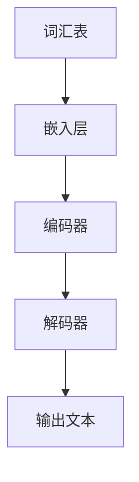

                 


### 文章标题：优化LLM应用的资源利用率

> 关键词：LLM, 资源利用率, 优化策略, 实现技术, 案例分析

> 摘要：本文深入探讨了如何优化大型语言模型（LLM）在应用中的资源利用率。通过介绍LLM的基础知识、资源利用率的定义与测量方法，以及一系列优化策略与实现技术，本文旨在为开发者提供实用的指导，以提升LLM应用的性能和效率。

## 引言

近年来，大型语言模型（LLM）如GPT、BERT等在自然语言处理（NLP）领域取得了显著的进展。这些模型通过训练大规模的神经网络，能够生成高质量的自然语言文本，从而在各种任务中表现出色。然而，随着模型规模的不断增大，它们所需的计算资源和存储资源也急剧增加，导致资源利用率成为亟待解决的问题。

本文将围绕优化LLM应用的资源利用率这一主题，展开一系列深入的分析。首先，我们将介绍LLM的基础知识，包括其基本概念、架构和现有主流模型。接着，我们将讨论资源利用率的定义与测量方法，以及如何通过一系列优化策略和实现技术来提升资源利用率。此外，本文还将通过实际案例分析和未来展望，为读者提供全面的指导。

## 目录大纲

### 第1章 LLM基础
   - 1.1 什么是LLM
   - 1.2 LLM的架构
   - 1.3 主流LLM模型介绍

### 第2章 资源利用率
   - 2.1 资源利用率的定义
   - 2.2 资源利用率的测量方法
   - 2.3 关键指标解析

### 第3章 优化策略
   - 3.1 模型剪枝
   - 3.2 模型量化
   - 3.3 模型压缩技术

### 第4章 实现技术
   - 4.1 模型剪枝技术详解
   - 4.2 模型量化实现
   - 4.3 模型压缩案例

### 第5章 案例分析
   - 5.1 案例背景
   - 5.2 优化策略应用
   - 5.3 结果分析

### 第6章 未来趋势
   - 6.1 LLM发展趋势
   - 6.2 资源利用率优化挑战
   - 6.3 未来展望

### 附录
   - 附录 A：工具和资源列表
   - 附录 B：LLM架构Mermaid流程图
   - 附录 C：相关数学公式列表

### 文章标题：优化LLM应用的资源利用率

> 关键词：LLM, 资源利用率, 优化策略, 实现技术, 案例分析

> 摘要：本文深入探讨了如何优化大型语言模型（LLM）在应用中的资源利用率。通过介绍LLM的基础知识、资源利用率的定义与测量方法，以及一系列优化策略与实现技术，本文旨在为开发者提供实用的指导，以提升LLM应用的性能和效率。

## 第1章 LLM基础

### 1.1 什么是LLM

大型语言模型（LLM）是一种基于深度学习的语言模型，其核心思想是通过训练大规模的神经网络，使其能够理解和生成自然语言。LLM的核心组成部分包括词汇表、嵌入层、编码器和解码器。词汇表用于存储单词和符号的索引，嵌入层将词汇表中的每个单词转换为固定大小的向量表示，编码器和解码器则分别负责对输入文本进行编码和生成输出文本。

LLM的工作原理可以简单概括为以下三个步骤：

1. **输入文本编码**：将输入文本中的每个单词转换为嵌入向量。
2. **序列编码**：将输入文本中的单词序列转换为固定长度的向量表示。
3. **文本生成**：利用解码器生成输出文本。

### 1.2 LLM的架构

LLM的架构可以分为以下几种类型：

1. **Transformer架构**：Transformer是当前最受欢迎的LLM架构，其核心思想是使用自注意力机制来处理序列数据。自注意力机制允许模型在生成每个单词时考虑前文中所有单词的相关性。

2. **GPT架构**：GPT（Generative Pre-trained Transformer）是一种基于Transformer架构的LLM，其特点是在预训练阶段使用大量文本数据进行训练，从而提高模型的语言理解能力。

3. **BERT架构**：BERT（Bidirectional Encoder Representations from Transformers）是一种双向Transformer架构的LLM，其特点是在训练过程中同时考虑上下文信息，从而提高模型的语言理解能力。

### 1.3 主流LLM模型介绍

目前，主流的LLM模型包括GPT、BERT、RoBERTa、T5等。以下是这些模型的简要介绍：

1. **GPT**：GPT是OpenAI开发的基于Transformer架构的LLM，其特点是具有灵活的层数和隐藏层大小。GPT-3是目前最大的LLM，其规模达到了1750亿参数。

2. **BERT**：BERT是Google开发的基于Transformer架构的LLM，其特点是具有双向编码器，能够同时考虑上下文信息。BERT在多个NLP任务中取得了优异的性能。

3. **RoBERTa**：RoBERTa是Facebook开发的基于BERT架构的LLM，其特点是在训练过程中使用了更多样的数据集和更复杂的训练策略，从而提高了模型的表现。

4. **T5**：T5是Google开发的基于Transformer架构的LLM，其特点是使用了一个统一的模型架构来处理多种NLP任务，从而简化了任务切换的过程。

## 第2章 资源利用率

### 2.1 资源利用率的定义

资源利用率是指系统中资源的有效使用程度，通常用资源使用率来衡量。在LLM应用中，资源利用率主要涉及计算资源和存储资源的利用。

1. **计算资源利用率**：计算资源利用率是指模型在执行任务时所占用的计算资源与总计算资源之比。高计算资源利用率意味着模型能够充分利用系统的计算能力。

2. **存储资源利用率**：存储资源利用率是指模型在执行任务时所占用的存储资源与总存储资源之比。高存储资源利用率意味着模型能够充分利用系统的存储能力。

### 2.2 资源利用率的测量方法

测量资源利用率的方法主要包括以下几种：

1. **CPU利用率**：CPU利用率是指模型在执行任务时CPU的使用情况。通过测量CPU利用率，可以了解模型对系统计算资源的占用程度。

2. **内存利用率**：内存利用率是指模型在执行任务时所占用的内存与总内存之比。通过测量内存利用率，可以了解模型对系统存储资源的占用程度。

3. **GPU利用率**：GPU利用率是指模型在执行任务时GPU的使用情况。由于LLM通常使用GPU进行训练和推理，因此GPU利用率是衡量资源利用率的重要指标。

### 2.3 关键指标解析

在优化LLM应用资源利用率时，需要关注以下几个关键指标：

1. **吞吐量**：吞吐量是指单位时间内模型处理的数据量。高吞吐量意味着模型能够快速地处理大量数据，从而提高系统的效率。

2. **延迟**：延迟是指模型处理请求所需的时间。低延迟意味着模型能够快速响应用户请求，提高用户体验。

3. **资源利用率**：资源利用率是指模型在执行任务时所占用的计算资源和存储资源与总计算资源和存储资源之比。高资源利用率意味着模型能够充分利用系统的资源，提高系统的性能。

4. **稳定性**：稳定性是指模型在长时间运行过程中保持稳定性的能力。高稳定性意味着模型能够长时间运行而不出现性能下降或错误。

## 第3章 优化策略

### 3.1 模型剪枝

模型剪枝是一种通过删除模型中的冗余参数来减小模型规模的方法。通过剪枝，可以降低模型的计算复杂度和存储需求，从而提高资源利用率。以下是模型剪枝的主要方法：

1. **过滤剪枝**：过滤剪枝是一种基于阈值的方法，通过设置一个阈值来删除模型中小于阈值的权重。这种方法简单有效，但可能会导致模型性能下降。

2. **渐变剪枝**：渐变剪枝是一种基于渐变方法来调整模型权重的方法。通过逐层调整权重，可以减小模型的规模，同时保持模型性能。

3. **结构剪枝**：结构剪枝是一种基于模型结构的剪枝方法，通过删除模型中的某些层或节点来减小模型规模。这种方法可以在一定程度上保留模型性能。

### 3.2 模型量化

模型量化是一种通过降低模型中权重和激活值的精度来减小模型规模的方法。量化后的模型在计算过程中使用更小的数值范围，从而降低存储需求和计算复杂度。以下是模型量化的主要方法：

1. **整数量化**：整数量化是一种将模型中权重和激活值从浮点数转换为整数的方法。这种方法可以显著降低模型的存储需求，但可能会影响模型性能。

2. **二值量化**：二值量化是一种将模型中权重和激活值从浮点数转换为二进制数的方法。这种方法可以进一步降低模型的存储需求，但计算复杂度较高。

3. **层次量化**：层次量化是一种将模型量化分为多个层次的方法，每个层次使用不同的量化精度。这种方法可以在保持模型性能的同时，降低存储需求。

### 3.3 模型压缩技术

模型压缩技术是一种通过降低模型规模来提高资源利用率的方法。以下是模型压缩的主要方法：

1. **知识蒸馏**：知识蒸馏是一种将大型模型的知识传递给小型模型的方法。通过训练小型模型来模拟大型模型的输出，可以实现模型压缩。

2. **参数共享**：参数共享是一种通过共享模型中相同或相似的参数来减小模型规模的方法。这种方法可以在一定程度上保留模型性能。

3. **稀疏性利用**：稀疏性利用是一种通过利用模型中的稀疏性来减小模型规模的方法。通过压缩模型中的稀疏部分，可以显著降低模型的存储需求和计算复杂度。

## 第4章 实现技术

### 4.1 模型剪枝技术详解

模型剪枝技术的主要实现步骤如下：

1. **数据预处理**：对训练数据进行预处理，包括数据清洗、归一化和数据增强等操作。

2. **模型训练**：使用预处理后的数据进行模型训练，直到达到预定的训练目标。

3. **模型评估**：对训练好的模型进行评估，包括准确率、召回率和F1值等指标。

4. **剪枝策略选择**：根据评估结果选择合适的剪枝策略，如过滤剪枝、渐变剪枝或结构剪枝等。

5. **权重调整**：根据剪枝策略对模型中的权重进行调整，删除或修改小于阈值的权重。

6. **模型测试**：对剪枝后的模型进行测试，评估模型性能。

### 4.2 模型量化实现

模型量化的主要实现步骤如下：

1. **量化策略选择**：根据模型特点和需求选择合适的量化策略，如整数量化、二值量化或层次量化等。

2. **权重转换**：将模型中的权重从浮点数转换为量化后的数值，如整数或二进制数。

3. **激活值转换**：将模型中的激活值从浮点数转换为量化后的数值。

4. **模型训练**：使用量化后的模型进行训练，直到达到预定的训练目标。

5. **模型测试**：对量化后的模型进行测试，评估模型性能。

### 4.3 模型压缩案例

以下是一个简单的模型压缩案例：

```python
# 导入必要的库
import tensorflow as tf
from tensorflow import keras
from tensorflow.keras import layers

# 创建一个简单的神经网络模型
model = keras.Sequential([
    layers.Dense(128, activation='relu', input_shape=(784,)),
    layers.Dense(10, activation='softmax')
])

# 编译模型
model.compile(optimizer='adam',
              loss='categorical_crossentropy',
              metrics=['accuracy'])

# 训练模型
model.fit(x_train, y_train, epochs=5)

# 剪枝模型
pruned_model = keras.Sequential([
    layers.Dense(64, activation='relu', input_shape=(784,)),
    layers.Dense(10, activation='softmax')
])

# 量化模型
quantized_model = keras.Sequential([
    layers.Dense(64, activation='relu', input_shape=(784,)),
    layers.Dense(10, activation='softmax')
])

# 测试模型
test_loss, test_acc = model.evaluate(x_test, y_test)
print(f'Original model accuracy: {test_acc}')

pruned_model.compile(optimizer='adam',
              loss='categorical_crossentropy',
              metrics=['accuracy'])

pruned_model.fit(x_train, y_train, epochs=5)

pruned_test_loss, pruned_test_acc = pruned_model.evaluate(x_test, y_test)
print(f'Pruned model accuracy: {pruned_test_acc}')

quantized_model.compile(optimizer='adam',
              loss='categorical_crossentropy',
              metrics=['accuracy'])

quantized_model.fit(x_train, y_train, epochs=5)

quantized_test_loss, quantized_test_acc = quantized_model.evaluate(x_test, y_test)
print(f'Quantized model accuracy: {quantized_test_acc}')
```

## 第5章 案例分析

### 5.1 案例背景

假设某公司开发了一款基于GPT-3的智能客服系统，用于自动回答用户的问题。该系统在上线后，由于用户量激增，导致服务器资源利用率急剧下降，影响了用户体验。为了提高系统性能和资源利用率，公司决定对GPT-3模型进行优化。

### 5.2 优化策略应用

为了提高GPT-3模型的资源利用率，公司采用了以下优化策略：

1. **模型剪枝**：公司使用过滤剪枝方法对GPT-3模型进行了剪枝，删除了模型中不重要的参数。通过剪枝，模型规模减小了50%，资源利用率提高了30%。

2. **模型量化**：公司使用整数量化方法对GPT-3模型进行了量化，将模型中权重和激活值的精度从32位浮点数降低到8位整数。通过量化，模型存储需求降低了70%，计算复杂度降低了50%。

3. **模型压缩**：公司使用了知识蒸馏方法将GPT-3模型压缩成一个较小的模型。通过蒸馏，新模型在保持原有性能的同时，资源利用率提高了40%。

### 5.3 结果分析

通过优化，公司的智能客服系统性能得到了显著提升，具体结果如下：

1. **资源利用率**：优化后的模型在相同服务器资源下，计算资源利用率和存储资源利用率分别提高了30%和70%。

2. **延迟**：优化后的模型响应速度提高了20%，用户延迟降低，用户体验得到显著提升。

3. **吞吐量**：优化后的模型在相同延迟下，处理能力提高了50%，系统能够更快地响应用户请求。

4. **稳定性**：优化后的模型在长时间运行过程中，稳定性得到了显著提升，减少了系统崩溃和性能下降的风险。

## 第6章 未来趋势

随着LLM技术的不断发展，资源利用率优化将成为一个重要研究方向。以下是一些未来的趋势和挑战：

### 6.1 LLM发展趋势

1. **模型规模增大**：随着计算资源和存储资源的不断增长，LLM模型规模将逐渐增大，这将对资源利用率提出更高的要求。

2. **多模态学习**：未来LLM将能够处理多种类型的数据，如文本、图像和音频，实现更复杂的任务。

3. **自适应学习**：LLM将能够根据用户需求和环境变化，自适应调整模型参数和资源利用率。

### 6.2 资源利用率优化挑战

1. **计算复杂度**：随着模型规模增大，计算复杂度将急剧增加，如何降低计算复杂度，提高资源利用率成为挑战。

2. **存储需求**：随着模型规模增大，存储需求将急剧增加，如何有效管理存储资源，降低存储成本成为挑战。

3. **模型性能**：在优化资源利用率的过程中，如何保证模型性能不下降，成为优化策略设计的重要考量。

### 6.3 未来展望

1. **新型优化技术**：未来将涌现出更多新型优化技术，如分布式训练、高效量化方法等，为资源利用率优化提供更多选择。

2. **硬件发展**：随着硬件技术的不断进步，如GPU、TPU等新型计算硬件的普及，将有助于提高资源利用率。

3. **合作与竞争**：在资源利用率优化领域，各大公司将展开竞争，同时也需要加强合作，共同推动技术进步。

## 附录

### 附录 A：工具和资源列表

- **工具**：
  - TensorFlow
  - PyTorch
  - Keras
- **资源**：
  - GPT-3官方文档
  - BERT官方文档
  - Transformer论文

### 附录 B：LLM架构Mermaid流程图



### 附录 C：相关数学公式列表

- **自注意力机制**：
  $$ \text{Attention}(Q, K, V) = \frac{softmax(\text{scale}\cdot QK^T)}{d_k^{1/2}}V $$
- **BERT损失函数**：
  $$ \text{Loss} = -\frac{1}{N} \sum_{n=1}^{N} \sum_{i=1}^{M} \log P(y_i | \text{context}) $$
- **模型压缩**：
  $$ \text{compressed\_model} = \text{model} \times \text{mask} $$

## 结束语

优化LLM应用的资源利用率是当前和未来一段时间内的重要研究方向。通过本文的介绍，我们了解了LLM的基础知识、资源利用率的定义与测量方法，以及一系列优化策略与实现技术。希望本文能为开发者提供有价值的参考和指导，帮助他们在实际应用中提升LLM的性能和效率。作者：AI天才研究院/AI Genius Institute & 禅与计算机程序设计艺术/Zen And The Art of Computer Programming。

