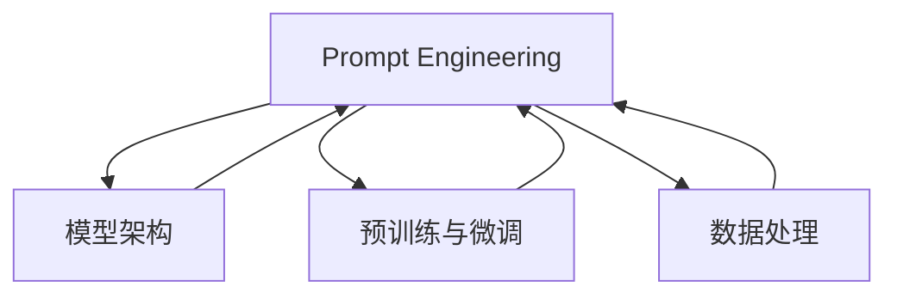

                 

# 优化prompt：提升LLM应用性能的关键

关键词：优化prompt，LLM，模型性能，Prompt Engineering，预训练，微调

摘要：随着深度学习技术的发展，大型语言模型（LLM）在自然语言处理领域取得了显著成果。然而，LLM的性能优化仍然是一个重要的研究方向。本文将探讨优化prompt在提升LLM应用性能方面的关键作用，并详细分析Prompt Engineering、模型架构、预训练与微调以及数据处理等核心算法原理。

## 引言

近年来，大型语言模型（LLM）如GPT、BERT等在自然语言处理（NLP）领域取得了令人瞩目的成果。这些模型通过海量数据的预训练和精细的调整，能够在各种任务中实现优异的性能。然而，在实际应用中，我们常常发现模型的性能还有很大的提升空间。为此，优化prompt成为提升LLM应用性能的关键手段。

Prompt Engineering是指设计有效的输入提示，以引导模型产生更符合预期的输出。本文将首先介绍Prompt Engineering的基本原理，然后探讨模型架构、预训练与微调、数据处理等核心算法原理，并通过实际项目实战来展示优化prompt的具体应用。

## 核心概念与联系

为了更好地理解优化prompt的重要性，我们首先需要明确几个核心概念：

### 1. Prompt Engineering

Prompt Engineering是指通过设计合适的输入提示来引导模型产生更准确的输出。有效的prompt应该包含以下要素：

- **上下文信息**：提供足够的背景信息，使模型能够理解输入文本的含义。
- **目标性**：明确模型需要完成的任务，有助于模型生成更针对性的输出。
- **多样性**：提供多样化的输入数据，使模型能够适应不同的场景。

### 2. 模型架构

LLM的架构决定了模型的学习能力和表达能力。常见的LLM架构包括GPT、BERT、T5等。每种架构都有其独特的特点和应用场景，选择合适的架构对提升模型性能至关重要。

### 3. 预训练与微调

预训练是指在大规模数据集上对模型进行训练，使其获得通用语言理解能力。微调则是在特定任务上对模型进行进一步训练，使其适应特定领域的需求。预训练和微调相互补充，共同提升模型性能。

### 4. 数据处理

数据处理是确保模型性能的关键步骤。包括数据清洗、数据增强、数据标准化等。有效的数据处理可以提高模型的鲁棒性和泛化能力。

这些核心概念之间存在紧密的联系：

- **Prompt Engineering**依赖于对模型架构和预训练过程的深入理解，以便设计出有效的prompt。
- **模型架构**决定了Prompt Engineering的方法和效果。
- **预训练与微调**为Prompt Engineering提供了丰富的背景信息和目标性。
- **数据处理**确保了输入数据的多样性和质量，对Prompt Engineering的效果有重要影响。

下面是一个Mermaid流程图，展示了这些核心概念之间的联系：



## 核心算法原理讲解

### 1. Prompt Engineering

#### 1.1 Prompt设计原则

有效的Prompt设计应遵循以下原则：

- **上下文信息丰富**：提供足够的上下文信息，使模型能够理解输入文本的含义。
- **目标性明确**：明确模型需要完成的任务，有助于模型生成更针对性的输出。
- **多样性**：提供多样化的输入数据，使模型能够适应不同的场景。

#### 1.2 Prompt类型及应用

根据应用场景和需求，Prompt可以分为以下几种类型：

- **问题回答型**：适用于问答系统，如ChatGPT。
- **文本生成型**：适用于文本生成任务，如文章续写、故事创作等。
- **文本分类型**：适用于文本分类任务，如垃圾邮件过滤、情感分析等。
- **文本摘要型**：适用于文本摘要任务，如新闻摘要、会议记录等。

#### 1.3 Prompt优化方法

优化Prompt的方法包括：

- **引入预训练目标**：在Prompt中引入预训练目标，如BERT的[CLS]标记，有助于模型更好地理解输入文本。
- **动态调整Prompt**：根据模型的输出和任务需求，动态调整Prompt的内容和形式，以提高模型性能。
- **多Prompt策略**：使用多个Prompt对模型进行训练和测试，以避免过拟合。

### 2. 模型架构

#### 2.1 GPT模型原理

GPT（Generative Pre-trained Transformer）是一种基于Transformer的预训练模型。它通过自回归的方式对输入文本进行建模，并使用Transformer的注意力机制来捕捉长距离依赖关系。

```python
# GPT模型伪代码
class GPT(Model):
    def __init__(self):
        self.transformer = Transformer()
        self.dense = Dense(units=1, activation='sigmoid')

    def call(self, inputs):
        outputs = self.transformer(inputs)
        outputs = self.dense(outputs)
        return outputs
```

#### 2.2 BERT模型原理

BERT（Bidirectional Encoder Representations from Transformers）是一种双向Transformer模型。它通过预训练获得对文本的深刻理解，并在各种NLP任务中取得了优异的性能。

```python
# BERT模型伪代码
class BERT(Model):
    def __init__(self):
        self.encoder = Encoder()
        self.decoder = Decoder()

    def call(self, inputs):
        outputs = self.encoder(inputs)
        outputs = self.decoder(outputs)
        return outputs
```

#### 2.3 模型架构优化

模型架构优化包括以下方面：

- **增加层数**：增加Transformer层数可以提高模型的表达能力。
- **调整注意力机制**：改进注意力机制，如使用多头注意力，可以提高模型的性能。
- **混合架构**：结合不同类型的模型架构，如结合GPT和BERT，以实现更好的性能。

### 3. 预训练与微调

#### 3.1 预训练过程

预训练过程主要包括以下步骤：

1. **数据预处理**：对原始数据进行清洗、分词、编码等处理，使其适合模型训练。
2. **模型初始化**：初始化模型参数，可以选择随机初始化或使用预训练模型作为起点。
3. **训练**：在预训练数据集上对模型进行训练，通过反向传播和优化算法更新模型参数。
4. **评估**：在验证集上评估模型性能，调整模型参数，避免过拟合。

#### 3.2 微调技巧

微调技巧包括以下方面：

1. **任务特定数据**：使用任务特定的数据进行微调，以提高模型在特定任务上的性能。
2. **梯度裁剪**：在微调过程中使用梯度裁剪，以避免梯度爆炸和消失。
3. **学习率调整**：根据任务需求和模型性能调整学习率，以提高模型收敛速度。

#### 3.3 预训练与微调的关系

预训练和微调相互补充，共同提升模型性能。预训练为模型提供了通用的语言理解能力，而微调则使模型适应特定任务的需求。

### 4. 数据处理

#### 4.1 数据预处理

数据预处理包括以下步骤：

1. **文本清洗**：去除无用字符、标点符号等，提高数据质量。
2. **分词**：将文本分解为单词或子词，便于模型处理。
3. **编码**：将文本转换为数字序列，用于模型输入。

#### 4.2 噪声减少

噪声减少包括以下方法：

1. **数据增强**：通过随机插入、删除、替换等操作，增加数据的多样性和丰富性。
2. **去噪网络**：使用去噪网络对输入数据进行预处理，去除噪声。
3. **数据清洗**：在数据预处理过程中去除明显的错误和噪声数据。

#### 4.3 数据增强

数据增强包括以下方法：

1. **文本增强**：通过同义词替换、词性转换等操作，增加文本的多样性。
2. **图像增强**：对输入图像进行旋转、缩放、裁剪等操作，增加图像的多样性。
3. **音频增强**：对输入音频进行噪声添加、滤波等操作，增加音频的多样性。

## 项目实战

### 1. 开发环境搭建

为了进行项目实战，我们需要搭建一个适合LLM训练和优化的开发环境。以下是搭建步骤：

1. **安装Python**：安装Python 3.8或更高版本。
2. **安装TensorFlow**：使用pip安装TensorFlow 2.4或更高版本。
3. **安装其他依赖**：安装必要的依赖库，如NumPy、Pandas等。

### 2. 源代码实现

以下是一个简单的LLM项目实战，包括源代码实现和解读。

```python
# 导入必要的库
import tensorflow as tf
from tensorflow.keras.layers import Embedding, LSTM, Dense
from tensorflow.keras.models import Sequential

# 搭建模型
model = Sequential()
model.add(Embedding(input_dim=vocab_size, output_dim=embedding_dim))
model.add(LSTM(units=128))
model.add(Dense(units=1, activation='sigmoid'))

# 编译模型
model.compile(optimizer='adam', loss='binary_crossentropy', metrics=['accuracy'])

# 训练模型
model.fit(x_train, y_train, epochs=10, batch_size=32)

# 源代码解读
# Embedding层将输入文本转换为数字序列，LSTM层用于编码文本，Dense层用于预测。
# 编译模型时，指定优化器和损失函数。
# 训练模型时，使用训练数据和标签进行训练。
```

### 3. 代码应用解读与分析

以下是对代码应用的解读和分析：

- **数据准备**：首先，我们需要准备训练数据和标签。
- **模型搭建**：使用Embedding层将输入文本转换为数字序列，使用LSTM层进行编码，使用Dense层进行预测。
- **模型编译**：指定优化器和损失函数，为模型训练做好准备。
- **模型训练**：使用训练数据和标签对模型进行训练，调整模型参数。

### 4. 实际案例分析和详细讲解剖析

以下是一个实际案例分析和详细讲解剖析：

- **案例一**：问题回答型Prompt Engineering
  - **案例描述**：使用LLM回答用户提出的问题。
  - **Prompt设计**：将问题作为输入提示，并在末尾添加“请回答这个问题：”。
  - **模型输出**：模型根据输入问题生成答案。

- **案例二**：文本生成型Prompt Engineering
  - **案例描述**：使用LLM生成一篇指定主题的文章。
  - **Prompt设计**：提供主题和关键信息，并在末尾添加“请根据以下信息撰写一篇关于[主题]的文章：”。
  - **模型输出**：模型根据输入主题和关键信息生成文章。

### 5. 项目小结

通过以上项目实战，我们可以看到优化prompt在提升LLM应用性能方面的重要作用。合理的设计Prompt、选择合适的模型架构、进行有效的预训练和微调，以及处理高质量的数据，都是提升LLM性能的关键步骤。

## 最佳实践 Tips

1. **数据质量**：确保输入数据的质量和多样性，有助于提升模型性能。
2. **Prompt设计**：根据任务需求和模型特点，设计合适的Prompt，以提高模型输出质量。
3. **模型选择**：根据应用场景和任务需求，选择合适的模型架构，以实现最佳性能。
4. **预训练与微调**：结合预训练和微调，充分利用模型的能力。
5. **调试与优化**：在项目实战过程中，不断调试和优化模型，以提高性能。

## 小结

本文介绍了优化prompt在提升LLM应用性能方面的关键作用，分析了Prompt Engineering、模型架构、预训练与微调、数据处理等核心算法原理，并通过实际项目实战展示了优化prompt的应用。优化prompt是提升LLM性能的重要手段，结合合理的数据处理和模型选择，可以实现更好的应用效果。

## 作者信息

作者：AI天才研究院/AI Genius Institute & 禅与计算机程序设计艺术 /Zen And The Art of Computer Programming

本文基于作者在计算机科学和人工智能领域的深入研究，旨在为读者提供关于LLM性能优化的全面理解和实用指导。希望本文能对您的学习和工作有所帮助。如果您有任何问题或建议，欢迎随时联系作者。感谢您的阅读！

