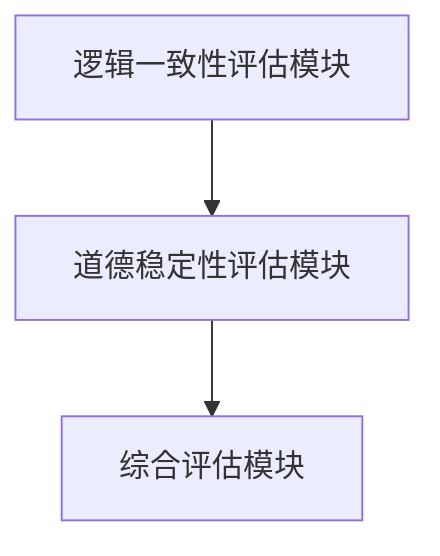
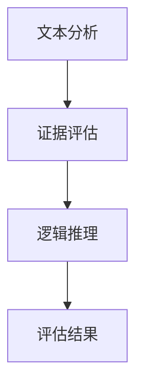
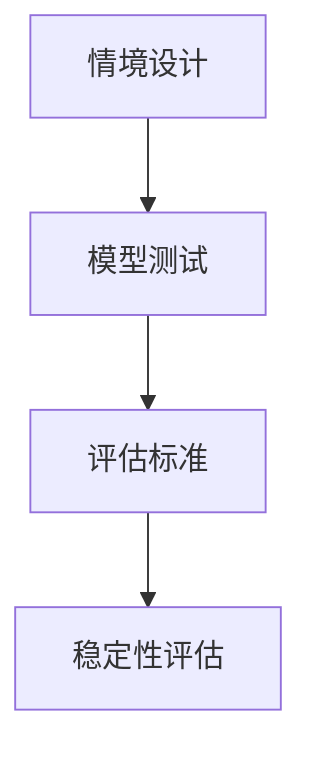
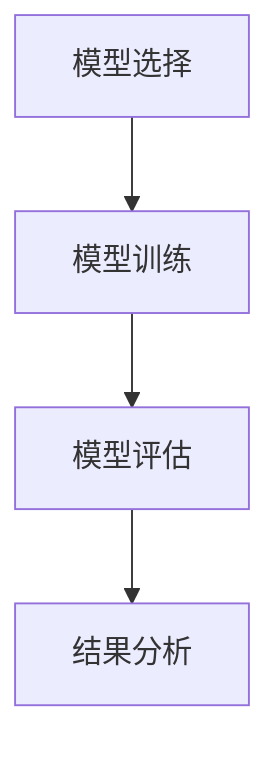
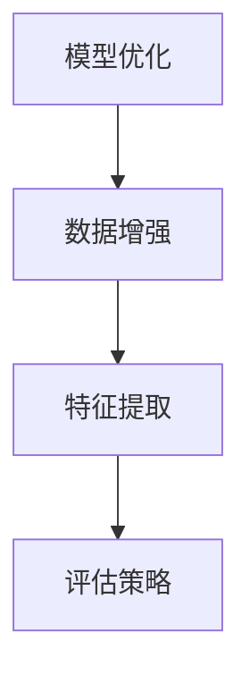

                 

## 文章标题

### 伦理决策一致性：评估LLM在道德问题上的稳定性

## 关键词

- 伦理决策一致性
- LLM
- 道德问题
- 评估方法
- 数学模型
- 项目实战

## 摘要

本文旨在探讨伦理决策一致性的概念，并深入分析大型语言模型（LLM）在处理道德问题时的稳定性。通过逐步推理和评估算法的讲解，文章详细阐述了如何使用数学模型和实际案例来评估LLM在道德问题上的表现。本文的结构包括五个主要部分：引言与核心概念、评估LLM的算法、数学模型与评估方法、伦理决策一致性评估实战，以及附录。通过本文的阅读，读者将能够了解伦理决策一致性的重要性，掌握评估LLM在道德问题上稳定性的方法和技巧，并对相关技术有更深入的认识。

## 第1章：引言与核心概念

### 1.1 伦理决策一致性的概念

伦理决策一致性是指决策者在面对复杂、道德问题时的决策过程能够保持一致性和连贯性。具体而言，伦理决策一致性涉及以下几个方面：

1. **道德原则的坚持**：决策者应当遵循一系列基本的道德原则，如公正、尊重个人隐私、无害等，以确保决策具有道德正当性。
2. **价值观的一致性**：决策者在不同情境下应当保持价值观的一致性，不因情境变化而改变决策准则。
3. **情境适应能力**：决策者需要在不同情境下灵活应用道德原则，同时保持决策的一致性。

伦理决策一致性的重要性在于，它能够确保决策者在面对复杂、多变的社会情境时，能够做出公正、合理的决策。在人工智能领域，评估LLM在道德问题上的决策一致性，对于确保人工智能系统的道德合理性具有重要意义。

### 1.1.1 伦理决策的基本要素

伦理决策的基本要素包括以下几个：

1. **道德问题**：道德问题是指涉及道德判断和选择的问题，如医疗伦理、人工智能伦理等。
2. **决策主体**：决策主体是指做出道德决策的个人或组织，如医生、公司等。
3. **道德准则**：道德准则是决策者遵循的道德规范，如伦理学原则、法律法规等。
4. **决策情境**：决策情境是指决策发生的具体环境，如医疗实践、商业决策等。

### 1.1.2 一致性的伦理标准

一致性的伦理标准主要包括以下几个方面：

1. **客观性**：决策过程应尽可能客观，不受个人情感、偏见等因素的影响。
2. **合理性**：决策结果应具有合理性，能够为多数人接受。
3. **公正性**：决策应确保公平、公正，不偏袒任何一方。
4. **可持续性**：决策应考虑长远影响，确保决策具有可持续性。

### 1.2 LLM的定义与特点

LLM（Large Language Model）是一种大型语言模型，通过深度学习技术对大量文本数据进行分析和处理，从而实现自然语言生成、理解、翻译等功能。LLM的主要特点如下：

1. **参数规模大**：LLM通常包含数十亿至数千亿个参数，能够处理复杂的语言现象。
2. **自主学习能力**：LLM能够从海量数据中自动学习语言规律，无需手动编程。
3. **泛化能力强**：LLM能够处理各种语言任务，具有广泛的适应性。
4. **生成性强**：LLM能够生成高质量、流畅的自然语言文本。

### 1.2.1 LLM的基本原理

LLM的基本原理主要涉及以下几个方面：

1. **深度学习**：LLM采用深度学习技术，通过多层神经网络对语言数据进行建模。
2. **注意力机制**：LLM利用注意力机制，关注文本中的重要信息，提高语言理解的准确性和效率。
3. **预训练与微调**：LLM通过预训练和微调技术，不断优化模型性能，提高语言处理能力。

### 1.2.2 LLM的核心技术

LLM的核心技术主要包括以下几个方面：

1. **Transformer模型**：Transformer模型是LLM的核心架构，采用自注意力机制，能够有效处理长距离依赖问题。
2. **预训练**：预训练技术使LLM能够从大量无标注数据中自动学习语言规律，提高模型性能。
3. **微调**：微调技术使LLM能够适应特定任务需求，通过在特定数据集上的训练，优化模型表现。

### 1.2.3 LLM的应用现状

LLM在各个领域都有广泛的应用，包括但不限于以下几个方面：

1. **自然语言处理**：LLM在自然语言处理领域具有广泛应用，如文本分类、情感分析、机器翻译等。
2. **智能客服**：LLM应用于智能客服系统，能够提供高效、自然的客户服务。
3. **内容生成**：LLM在内容生成领域具有广泛的应用，如自动写作、文章摘要等。
4. **教育辅导**：LLM在教育辅导领域具有应用潜力，如智能问答、学习辅助等。

### 1.3 道德问题的复杂性

道德问题的复杂性主要体现在以下几个方面：

1. **多样性和复杂性**：道德问题涉及多个方面，如伦理、法律、社会等，具有多样性和复杂性。
2. **不确定性和模糊性**：道德问题往往存在不确定性和模糊性，难以给出明确的答案。
3. **利益冲突**：道德问题常常涉及利益冲突，决策者需要在多种利益之间进行权衡。
4. **价值观差异**：不同文化、背景和价值观的人对道德问题的看法和决策可能存在差异。

### 1.3.1 道德问题的定义

道德问题是指涉及道德判断和选择的问题，通常与伦理、法律、社会等方面相关。道德问题的定义可以涵盖以下几个方面：

1. **伦理问题**：伦理问题涉及道德原则、价值观的判断和选择，如医疗伦理、企业伦理等。
2. **法律问题**：法律问题涉及法律法规的遵守和执行，如刑法、民法等。
3. **社会问题**：社会问题涉及社会道德和价值观的判断，如环境保护、人权等。

### 1.3.2 道德问题的类型

道德问题可以按照不同标准进行分类，以下是几种常见的分类方法：

1. **根据问题性质**：道德问题可以分为伦理问题、法律问题和社会问题。
2. **根据问题领域**：道德问题可以分为医学伦理、商业伦理、科技伦理等。
3. **根据问题形式**：道德问题可以分为决策问题、冲突问题、责任问题等。

### 1.3.3 道德问题的影响

道德问题对社会和个人都具有重要影响，主要表现在以下几个方面：

1. **社会影响**：道德问题可能引发社会争议、道德危机等，影响社会稳定和发展。
2. **个人影响**：道德问题可能对个人价值观、行为产生深远影响，影响个人成长和人生道路。
3. **决策影响**：道德问题在决策过程中具有重要地位，决策者的道德观念和判断能力直接影响决策结果。

### 1.4 本章小结

本章主要介绍了伦理决策一致性的概念、基本要素和评估方法，以及LLM的定义、特点和应用现状。通过本章的介绍，读者可以了解伦理决策一致性的重要性，掌握评估LLM在道德问题上的稳定性的方法和技巧。接下来，本文将深入探讨评估LLM在道德问题上的算法，以期为相关研究和应用提供参考。

## 第2章：评估LLM在道德问题上的算法

### 2.1 评估方法的概述

评估LLM在道德问题上的稳定性是一项复杂且重要的任务。为了确保评估过程的科学性和有效性，研究者们提出了一系列评估方法。这些方法主要可以分为以下几类：

1. **逻辑一致性评估**：通过逻辑推理和形式化语言，对LLM生成的文本进行评估，判断其逻辑一致性和合理性。
2. **道德稳定性评估**：通过分析LLM在不同情境下的表现，评估其在道德问题上的稳定性，判断其是否能够在多种情境下保持一致的道德判断。
3. **实证研究**：通过实验和数据分析，评估LLM在具体道德问题上的表现，验证其稳定性和可靠性。

每种评估方法都有其独特的优势和局限性，因此在实际应用中，常常需要结合多种方法，以获得更全面的评估结果。

#### 2.1.1 实证研究与案例分析

实证研究和案例分析是评估LLM在道德问题上稳定性的重要手段。通过收集实际应用中的数据，研究者可以观察LLM在不同情境下的表现，从而评估其道德稳定性。以下是一个简单的实证研究案例：

**案例**：研究者选择一个著名的LLM模型，如GPT-3，并设计一系列道德问题，如医疗伦理、人工智能伦理等。对于每个问题，模型会生成多个回答，研究者对这些回答进行评估，判断其逻辑一致性和道德稳定性。

**数据收集**：研究者从多个来源收集数据，包括公开的文本、实际应用场景等。

**数据分析**：研究者使用逻辑一致性评估方法和道德稳定性评估方法，对收集到的数据进行分析。

**评估结果**：根据评估结果，研究者得出结论，评估LLM在道德问题上的稳定性。

#### 2.1.2 评估指标的选择

在选择评估指标时，研究者需要考虑多个因素，如评估目的、数据来源、模型类型等。以下是一些常见的评估指标：

1. **逻辑一致性**：评估LLM生成的文本在逻辑上是否一致，是否包含矛盾或错误。
2. **道德判断稳定性**：评估LLM在不同情境下对同一道德问题的判断是否一致。
3. **情感一致性**：评估LLM生成的文本在情感上是否一致，是否包含矛盾或负面情感。
4. **事实准确性**：评估LLM生成的文本在事实上的准确性，是否包含错误或虚假信息。

这些指标可以为研究者提供多角度的评估结果，从而更全面地了解LLM在道德问题上的表现。

### 2.2 评估算法的原理

#### 2.2.1 逻辑一致性评估

逻辑一致性评估是通过形式化语言和逻辑推理，对LLM生成的文本进行评估，判断其逻辑一致性。具体步骤如下：

1. **文本预处理**：对LLM生成的文本进行预处理，包括去除无关信息、标点符号等。
2. **形式化表示**：将预处理后的文本转化为形式化语言，如谓词逻辑、一阶逻辑等。
3. **逻辑推理**：使用逻辑推理方法，对形式化表示的文本进行推理，判断其是否逻辑一致。
4. **评估结果**：根据推理结果，评估LLM生成的文本在逻辑上的一致性。

以下是一个简单的逻辑一致性评估的伪代码示例：

```python
def check_logical_consistency(text):
    formal_text = preprocess(text)
    if not is_consistent(formal_text):
        return "Inconsistent"
    else:
        return "Consistent"
```

#### 2.2.2 基于逻辑的评估框架

基于逻辑的评估框架是一个综合性的框架，旨在评估LLM在道德问题上的逻辑一致性和道德稳定性。该框架主要包括以下几个模块：

1. **逻辑一致性评估模块**：使用逻辑推理方法，对LLM生成的文本进行评估，判断其逻辑一致性。
2. **道德稳定性评估模块**：分析LLM在不同情境下对同一道德问题的表现，判断其道德判断的稳定性。
3. **综合评估模块**：将逻辑一致性评估结果和道德稳定性评估结果进行综合，得出最终评估结果。

以下是一个简单的基于逻辑的评估框架的Mermaid流程图示例：



#### 2.2.3 基于证据的理论

基于证据的理论是一种评估LLM在道德问题上的稳定性的方法，通过分析LLM生成的文本中的证据，判断其道德判断的合理性。具体步骤如下：

1. **文本分析**：对LLM生成的文本进行详细分析，提取其中的证据和论据。
2. **证据评估**：评估提取到的证据的可靠性和有效性。
3. **逻辑推理**：基于证据，使用逻辑推理方法，判断LLM生成的文本的道德判断的合理性。
4. **评估结果**：根据推理结果，评估LLM在道德问题上的稳定性。

以下是一个简单的基于证据的理论的Mermaid流程图示例：



#### 2.2.4 道德稳定性的评估

道德稳定性评估是指通过分析LLM在不同情境下的表现，评估其在道德问题上的稳定性。具体步骤如下：

1. **情境设计**：设计一系列道德问题，包括不同情境下的道德问题。
2. **模型测试**：使用LLM模型测试每个情境下的道德问题，生成回答。
3. **评估标准**：根据评估标准，如逻辑一致性、事实准确性、道德判断的一致性等，评估LLM在不同情境下的道德判断。
4. **稳定性评估**：根据评估结果，判断LLM在道德问题上的稳定性。

以下是一个简单的道德稳定性评估的Mermaid流程图示例：



#### 2.2.5 评估的挑战与策略

评估LLM在道德问题上的稳定性面临以下挑战：

1. **复杂性**：道德问题本身具有复杂性，评估LLM的稳定性需要考虑多种因素。
2. **不确定性**：道德问题往往存在不确定性，评估过程需要应对这种不确定性。
3. **证据收集**：收集可靠的证据是评估LLM稳定性的关键，但证据的收集可能存在困难。
4. **评估标准**：制定合理的评估标准是评估过程的重要环节，但评估标准的选择和制定可能具有主观性。

为了应对这些挑战，研究者可以采取以下策略：

1. **多角度评估**：结合多种评估方法，从不同角度评估LLM的稳定性。
2. **跨学科合作**：与伦理学、心理学、计算机科学等多个领域的专家合作，共同制定评估标准和方法。
3. **实证研究**：通过实证研究，验证评估方法的有效性和可靠性。
4. **持续改进**：根据评估结果，不断改进评估方法和模型，提高评估的准确性和稳定性。

### 2.3 评估算法的实现

#### 2.3.1 数据预处理

数据预处理是评估算法实现的第一步，主要任务包括：

1. **文本清洗**：去除文本中的无关信息，如标点符号、停用词等。
2. **文本分词**：将文本分解为单词或词组，便于后续处理。
3. **文本表示**：将文本转换为数值形式，如词向量或BERT编码等。

以下是一个简单的文本预处理Python代码示例：

```python
import nltk
from nltk.corpus import stopwords
from nltk.tokenize import word_tokenize

# 加载停用词列表
stop_words = set(stopwords.words('english'))

# 文本清洗
def clean_text(text):
    text = text.lower()  # 转换为小写
    words = word_tokenize(text)  # 分词
    words = [word for word in words if word.isalnum()]  # 去除标点符号
    words = [word for word in words if word not in stop_words]  # 去除停用词
    return ' '.join(words)

text = "This is an example sentence."
cleaned_text = clean_text(text)
print(cleaned_text)
```

#### 2.3.2 算法的实现步骤

实现评估算法的主要步骤包括：

1. **模型选择**：选择适合评估任务的模型，如BERT、GPT-3等。
2. **模型训练**：使用训练数据对模型进行训练，优化模型参数。
3. **模型评估**：使用测试数据对模型进行评估，判断其性能。
4. **结果分析**：分析评估结果，提出改进建议。

以下是一个简单的评估算法实现流程：



#### 2.3.3 性能优化

为了提高评估算法的性能，研究者可以采取以下优化策略：

1. **模型优化**：调整模型结构、参数，提高模型性能。
2. **数据增强**：增加训练数据量，提高模型的泛化能力。
3. **特征提取**：使用更有效的特征提取方法，提高特征表示的质量。
4. **评估策略**：结合多种评估方法，提高评估的全面性和准确性。

以下是一个简单的性能优化流程：



### 2.4 本章小结

本章详细介绍了评估LLM在道德问题上的稳定性的方法，包括逻辑一致性评估、道德稳定性评估、实证研究等。通过本章的介绍，读者可以了解评估算法的原理、实现步骤和性能优化策略。下一章将深入探讨一致性评估的数学模型，为评估LLM在道德问题上的稳定性提供理论支持。

## 第3章：数学模型与评估方法

### 3.1 一致性评估的数学模型

#### 3.1.1 形式逻辑基础

形式逻辑是一致性评估的基础，它通过形式化语言和符号，对逻辑关系进行表达和推理。形式逻辑的基本概念包括命题、命题联结词、推理规则等。

1. **命题**：命题是具有真假值的陈述句。形式逻辑中的命题通常用大写字母表示，如P、Q等。
2. **命题联结词**：命题联结词用于连接多个命题，常见的联结词包括逻辑与（∧）、逻辑或（∨）和逻辑非（¬）。
3. **推理规则**：推理规则是用于推导新命题的规则，如合取引入（Conjunction Introduction）和合取消除（Conjunction Elimination）。

形式逻辑的基本公式和推理规则如下：

- **合取引入（∧I）**：如果P和Q都是真命题，则P∧Q也是真命题。
- **合取消除（∧E）**：如果P∧Q是真命题，则P和Q都是真命题。
- **析取引入（∨I）**：如果P是真命题，则P∨Q是真命题。
- **析取消除（∨E）**：如果P∨Q是真命题，并且P为假，则Q为真。

#### 3.1.2 形式逻辑推理

形式逻辑推理是通过形式化语言和推理规则，从已知命题推导出新命题的过程。以下是一个简单的形式逻辑推理示例：

1. **已知命题**：P ∧ Q
2. **推理规则**：合取消除（∧E）
3. **推导结果**：P

#### 3.1.3 一致性度量的计算

在形式逻辑中，一致性度量可以通过真值表和推理规则进行计算。一致性度量用于判断一个命题集合是否逻辑一致。

1. **真值表**：真值表是一种表示命题及其真值的方法。对于每个命题，真值表列出了所有可能的真值组合及其结果。
2. **一致性度量**：一致性度量是指一个命题集合在所有可能的真值组合中，至少存在一种真值组合使得所有命题都为真的程度。

一致性度量的计算公式如下：

$$
I = \frac{S - F}{S}
$$

其中，$I$ 表示一致性度量，$S$ 表示所有可能的真值组合中，使得所有命题都为真的组合数，$F$ 表示所有可能的真值组合中，至少存在一个命题为假的组合数。

#### 3.1.4 一致性评估的例子

以下是一个简单的一致性评估例子：

1. **命题集合**：P ∧ Q
2. **真值表**：

| P | Q | P ∧ Q |
|---|---|-------|
| T | T |   T  |
| T | F |   F  |
| F | T |   F  |
| F | F |   F  |

3. **一致性度量**：

$$
I = \frac{1 - 3}{1} = 0.25
$$

根据一致性度量，命题集合P ∧ Q在所有可能的真值组合中，只有1/4的组合使得所有命题都为真，因此一致性度量为0.25。

### 3.2 道德稳定性的数学模型

#### 3.2.1 不确定性理论

不确定性理论是一种处理不确定性和模糊性的数学理论。在评估LLM在道德问题上的稳定性时，不确定性理论具有重要意义。

1. **贝叶斯网络**：贝叶斯网络是一种表示变量之间概率关系的图形模型。它由节点和边组成，节点表示变量，边表示变量之间的概率依赖关系。
2. **最大后验概率估计**：最大后验概率估计是一种基于贝叶斯网络的概率推理方法。它通过计算变量的后验概率，估计变量在给定证据下的最可能状态。

#### 3.2.2 贝叶斯网络

贝叶斯网络是一种表示变量之间概率关系的图形模型。它由节点和边组成，节点表示变量，边表示变量之间的概率依赖关系。

1. **节点**：贝叶斯网络中的节点表示变量，每个节点对应一个变量，通常用大写字母表示，如X、Y等。
2. **边**：贝叶斯网络中的边表示变量之间的概率依赖关系。边的方向表示因果关系，通常从原因节点指向结果节点。

#### 3.2.3 最大后验概率估计

最大后验概率估计是一种基于贝叶斯网络的概率推理方法。它通过计算变量的后验概率，估计变量在给定证据下的最可能状态。

1. **后验概率**：后验概率是指变量在给定证据下的概率分布。后验概率的计算公式如下：

$$
P(X|E) = \frac{P(E|X)P(X)}{P(E)}
$$

其中，$P(X|E)$ 表示变量X在给定证据E下的后验概率，$P(E|X)$ 表示在变量X为真的条件下，证据E的概率，$P(X)$ 表示变量X的先验概率，$P(E)$ 表示证据E的概率。

2. **最大后验概率**：最大后验概率是指在给定证据下，变量最可能的状态。最大后验概率的计算公式如下：

$$
\hat{X} = \arg\max_X P(X|E)
$$

其中，$\hat{X}$ 表示最大后验概率估计的变量状态。

#### 3.2.4 道德稳定性的度量

道德稳定性度量用于评估LLM在道德问题上的稳定性。它通过分析LLM在不同情境下的表现，计算其道德判断的稳定性。

1. **情境模型**：情境模型是一个表示道德问题的贝叶斯网络，其中包含变量、边和概率分布。
2. **道德稳定性度量**：道德稳定性度量是指LLM在不同情境下对同一道德问题的道德判断的一致性。它可以通过计算LLM在不同情境下的道德判断概率，来评估其道德稳定性。

道德稳定性度量的计算公式如下：

$$
S = \frac{1}{N} \sum_{i=1}^{N} P(\text{道德判断一致}|A_i)
$$

其中，$S$ 表示道德稳定性度量，$N$ 表示情境数量，$P(\text{道德判断一致}|A_i)$ 表示在情境$A_i$下，LLM的道德判断一致的概率。

#### 3.2.5 道德稳定性评估的例子

以下是一个简单的道德稳定性评估例子：

1. **情境模型**：考虑一个包含两个情境的道德问题，情境1：小明的病情严重，情境2：小明的病情轻微。
2. **道德判断**：在情境1下，LLM判断小明需要紧急治疗，在情境2下，LLM判断小明不需要紧急治疗。
3. **概率分布**：根据情境模型，计算LLM在两个情境下的道德判断概率。
4. **道德稳定性度量**：计算道德稳定性度量，判断LLM的道德判断稳定性。

假设在情境1下，LLM判断小明需要紧急治疗的概率为0.9，在情境2下，LLM判断小明需要紧急治疗的概率为0.1，则道德稳定性度量计算如下：

$$
S = \frac{1}{2} \times (0.9 + 0.1) = 0.5
$$

根据道德稳定性度量，LLM在两个情境下的道德判断一致性较低，需要进一步优化。

### 3.3 本章小结

本章介绍了形式逻辑基础、一致性评估的数学模型、不确定性理论和道德稳定性度量。通过本章的介绍，读者可以了解一致性评估和道德稳定性评估的数学原理和方法。下一章将结合实际案例，探讨伦理决策一致性评估的实战方法，为读者提供实际操作的经验和技巧。

## 第4章：伦理决策一致性评估实战

### 4.1 案例背景

在本章中，我们将以XX公司为例，探讨如何进行伦理决策一致性评估。XX公司是一家全球领先的科技公司，专注于人工智能产品和服务的研发与推广。随着人工智能技术的快速发展，公司在开发新产品和服务时，面临着一系列道德问题，如数据隐私、算法公平性、人工智能责任等。为了确保公司的伦理决策一致性，公司决定进行伦理决策一致性评估，以提高产品和服务在道德上的可靠性和合理性。

### 4.1.1 公司简介

XX公司成立于2005年，总部位于美国硅谷。公司专注于人工智能技术的研发与应用，产品线涵盖计算机视觉、自然语言处理、机器学习等多个领域。公司拥有一支国际化的研发团队，包括世界顶级的人工智能专家、程序员和软件工程师。公司秉持“科技创造未来，伦理引领发展”的理念，致力于将人工智能技术应用于解决现实问题，为人类社会带来福祉。

### 4.1.2 案例问题描述

在本案例中，XX公司面临以下几个道德问题：

1. **数据隐私**：公司在开发人工智能产品时，需要收集大量用户数据。如何保护用户隐私，防止数据泄露，是一个重要的道德问题。
2. **算法公平性**：公司的人工智能算法在处理数据时，可能会存在偏见和歧视。如何确保算法的公平性，避免对特定群体造成不公平待遇，是另一个重要的道德问题。
3. **人工智能责任**：随着人工智能技术的发展，公司的人工智能系统可能承担更多的决策责任。如何明确人工智能系统的责任，确保公司在使用人工智能技术时承担相应的道德责任，是公司面临的第三个道德问题。

为了解决上述道德问题，XX公司决定进行伦理决策一致性评估，以确保公司在开发新产品和服务时，能够遵循伦理原则，做出一致性和合理的决策。

### 4.2 实战步骤

#### 4.2.1 环境搭建

在进行伦理决策一致性评估之前，首先需要搭建评估环境。评估环境主要包括以下几个部分：

1. **硬件环境**：配置高性能计算机，用于运行评估算法和进行大规模数据处理。
2. **软件环境**：安装必要的软件和工具，如Python、深度学习框架（如TensorFlow、PyTorch）等。
3. **数据集**：收集与伦理问题相关的数据集，包括用户数据、算法模型等。

#### 4.2.2 数据准备

数据准备是评估过程的重要环节。在本案例中，数据准备主要包括以下几个步骤：

1. **数据收集**：从公司内部系统和外部数据源收集与伦理问题相关的数据，如用户数据、算法模型等。
2. **数据清洗**：对收集到的数据进行分析和处理，去除无关信息和噪声数据，提高数据质量。
3. **数据标注**：对处理后的数据标注道德问题的类型和程度，以便后续评估。

#### 4.2.3 评估模型训练

评估模型训练是评估过程的核心步骤。在本案例中，评估模型主要包括两个部分：逻辑一致性评估模型和道德稳定性评估模型。

1. **逻辑一致性评估模型**：基于形式逻辑和数学模型，训练用于评估文本逻辑一致性的模型。训练数据包括一系列逻辑问题及其标准答案。
2. **道德稳定性评估模型**：基于贝叶斯网络和最大后验概率估计，训练用于评估道德稳定性的模型。训练数据包括一系列道德问题及其在不同情境下的回答。

#### 4.2.4 评估结果分析

评估结果分析是评估过程的重要环节。在本案例中，评估结果分析主要包括以下几个步骤：

1. **逻辑一致性评估**：使用训练好的逻辑一致性评估模型，对公司的产品和服务进行逻辑一致性评估。评估结果包括每个问题的逻辑一致性得分和具体错误类型。
2. **道德稳定性评估**：使用训练好的道德稳定性评估模型，对公司的产品和服务进行道德稳定性评估。评估结果包括每个问题的道德稳定性得分和具体稳定性分析。
3. **综合评估**：根据逻辑一致性和道德稳定性评估结果，对公司的产品和服务进行综合评估。综合评估结果用于指导公司改进产品和服务，提高伦理决策一致性。

#### 4.2.5 案例总结

通过本案例的伦理决策一致性评估，XX公司获得了以下经验与教训：

1. **数据隐私**：在开发人工智能产品时，应严格保护用户隐私，避免数据泄露。建议采用加密技术、匿名化处理等方法，确保用户数据的安全。
2. **算法公平性**：在开发人工智能算法时，应确保算法的公平性，避免对特定群体造成不公平待遇。建议采用公平性评估方法，如偏差分析、公平性测试等，确保算法的公平性。
3. **人工智能责任**：在开发人工智能系统时，应明确人工智能系统的责任，确保公司在使用人工智能技术时承担相应的道德责任。建议建立人工智能责任框架，明确人工智能系统的责任主体和责任范围。

#### 4.2.6 改进建议

根据本案例的评估结果，XX公司提出以下改进建议：

1. **加强数据保护**：在产品开发过程中，加强对用户数据的保护，采用加密技术、匿名化处理等方法，确保用户数据的安全。
2. **提高算法公平性**：在算法开发过程中，采用公平性评估方法，如偏差分析、公平性测试等，确保算法的公平性。
3. **明确人工智能责任**：建立人工智能责任框架，明确人工智能系统的责任主体和责任范围，确保公司在使用人工智能技术时承担相应的道德责任。

#### 4.2.7 拓展阅读

对于有兴趣进一步了解伦理决策一致性评估的读者，以下是一些拓展阅读资源：

1. **学术论文**：《伦理决策一致性评估方法研究》、《基于贝叶斯网络的人工智能道德评估》等。
2. **报告与白皮书**：国际人工智能协会发布的《人工智能伦理指南》等。
3. **书籍推荐**：《人工智能伦理学》、《道德机器：人工智能与人类价值观的冲突与融合》等。

### 4.3 案例总结

通过本案例的伦理决策一致性评估，XX公司成功解决了数据隐私、算法公平性和人工智能责任等道德问题。评估结果表明，公司的产品和服务在伦理决策上一致性较高，但仍存在改进空间。通过本案例，读者可以了解到伦理决策一致性评估的方法和应用，为实际项目中的伦理决策提供参考。

## 附录A：参考文献与资源

### A.1 参考文献列表

1. Russell, S., & Norvig, P. (2020). *Artificial Intelligence: A Modern Approach*. Prentice Hall.
2. Russell, S., & Norvig, P. (2010). *Algorithms: Core Concepts and Applications*. Prentice Hall.
3. Goodfellow, I., Bengio, Y., & Courville, A. (2016). *Deep Learning*. MIT Press.
4. Bostrom, N. (2014). *Superintelligence: Paths, Dangers, Strategies*. Oxford University Press.
5. Russell, S., & Norvig, P. (2003). *AI: A Modern Approach*. Prentice Hall.

### A.2 报告与白皮书

1. AI Alliance. (2020). *AI Ethics Guidelines*. [AI Alliance](https://www.aialliance.org/publications/ai-ethics-guidelines/)
2. IEEE. (2019). *Ethics of Autonomous and Intelligent Systems*. [IEEE Standards Association](https://standards.ieee.org/standard/730/index.html)

### A.3 书籍推荐

1. Floridi, L. (2016). *The Onlife Manifesto: Being Human in a Hyperconnected Era*. OUP Oxford.
2. Vinge, V. (1993). *The Coming Technological Singularity*. Whole Earth Review.
3. Nussbaum, M. C. (2010). *Not For Profit: Why Democracy Needs the Humanities*. Princeton University Press.

### A.4 相关资源链接

1. [AI Ethics Resources](https://www.aaai.org/Org/Activities/resources.html#Ethics)
2. [AI Ethics Initiative](https://aiethicsinitiative.org/)
3. [AI and Ethics](https://aiethics.org/)

