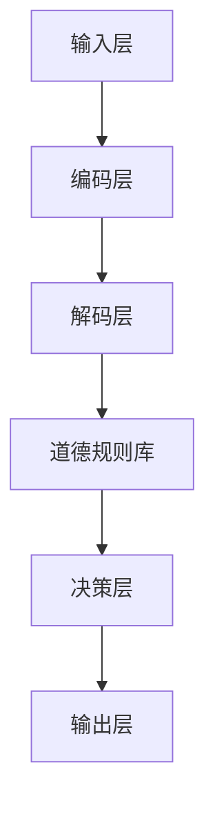

                 

### 文章标题

《伦理性测试：评估LLM的道德决策能力》

### 关键词

伦理性测试，LLM，道德决策能力，人工智能，道德伦理，测试框架，算法原理，数学模型

### 摘要

本文探讨了伦理性测试在评估大型语言模型（LLM）道德决策能力方面的重要性。通过对道德伦理基础、LLM技术概述以及伦理性测试的框架设计进行深入分析，文章提出了一种基于核心概念和架构的测试方法。文章详细讲解了核心算法原理、数学模型和公式，并通过实际项目实战展示了测试与评估的实践应用。最后，文章展望了未来伦理性测试在人工智能领域的挑战与发展趋势。

## 第1章 引言

### 1.1 道德伦理与人工智能

道德伦理是关于道德行为、价值观和道德判断的学科，它探讨了如何在社会生活中做出正确的行为选择。随着人工智能（AI）技术的快速发展，道德伦理与人工智能的关系日益密切。AI的应用涉及许多伦理问题，如隐私保护、算法偏见、自主决策等。因此，对AI系统的道德决策能力进行评估成为了一个重要课题。

### 1.2 LLM的道德决策能力的重要性

大型语言模型（LLM）是当前AI领域的重要研究方向之一。LLM具有强大的自然语言处理能力，可以生成文本、回答问题、辅助写作等。然而，LLM的道德决策能力却成为了研究者和应用开发者关注的焦点。一个具有良好道德决策能力的LLM能够更好地应对复杂的社会问题，减少潜在的负面影响。

### 1.3 本书的目的与结构

本书旨在探讨伦理性测试在评估LLM道德决策能力方面的应用。首先，我们将介绍道德伦理的基础知识，为后续讨论提供理论支持。然后，我们将概述LLM的技术特点和发展历史，以便更好地理解其道德决策能力的重要性。接着，我们将详细介绍伦理性测试的框架设计，包括测试框架的基本原则、组成部分和实现方法。

在核心概念与架构部分，我们将探讨LLM道德决策的核心概念，并展示其架构的Mermaid流程图。接下来，我们将详细讲解核心算法原理，并使用伪代码进行阐述。此外，我们还将介绍数学模型和公式，并进行详细的推导和举例说明。

在项目实战部分，我们将通过一个实际案例展示开发环境搭建、源代码实现和代码解读，并对项目进行详细分析。在测试与评估部分，我们将介绍测试方法、评估指标以及结果分析与优化。最后，我们将展望未来伦理性测试在人工智能领域的挑战与发展趋势。

通过本书的阅读，读者将能够全面了解伦理性测试在评估LLM道德决策能力方面的应用，并为相关研究和实践提供指导。

## 第2章 道德伦理基础

### 2.1 道德伦理的基本概念

道德伦理是一种关于道德行为和道德判断的哲学学科。它探讨人类在社会生活中应该如何做出正确的行为选择，以实现个人和社会的福祉。道德伦理的基本概念包括道德原则、道德规则、道德判断和道德行为。

道德原则是道德伦理的核心，它们是道德判断的基础。道德原则通常被描述为普遍适用的、客观存在的道德准则，例如正义、诚实、尊重、公正等。这些原则为我们的行为提供了指导，帮助我们在面临道德困境时做出正确的选择。

道德规则是具体的行为准则，它们将道德原则转化为具体的行动指南。道德规则通常是根据特定的社会文化背景制定的，例如不杀人、不偷窃、不欺骗等。道德规则为我们提供了一种行为规范，使我们在社会互动中能够相互信任和合作。

道德判断是人们对行为是否符合道德原则和道德规则的评估和判断。道德判断通常涉及道德冲突和道德困境，例如在两个道德原则之间做出选择，或者在道德规则与社会利益之间进行权衡。

道德行为是指人们根据道德原则和道德规则所采取的行动。道德行为是实现道德目标的关键，它是道德伦理的最终体现。

### 2.2 道德伦理的理论框架

道德伦理的理论框架为我们理解道德行为和道德判断提供了基础。以下是一些主要的道德伦理理论框架：

**功利主义**：功利主义认为，行为的道德价值取决于其产生的后果。根据功利主义，我们应该选择那些能够最大化幸福或利益的行为。功利主义的核心原则是“最大幸福原则”，即选择那些能够带来最大总体幸福的行为。

**康德伦理学**：康德伦理学强调行为的道德价值取决于行为本身的性质，而不仅仅是其后果。康德认为，道德行为应该基于“道德律令”，即行为者应该将道德规则作为普遍适用的准则。康德的“道德律令”包括“自主性原则”和“仁慈原则”。

**义务论**：义务论认为，行为的道德价值取决于行为者是否履行了特定的道德义务。义务论强调行为的道德责任和义务，而不仅仅是行为的后果。

**德行伦理学**：德行伦理学关注行为者的道德品质和性格发展。德行伦理学认为，道德价值在于培养良好的道德品质，如正直、善良、勇敢等。

### 2.3 道德伦理与人工智能的关系

道德伦理与人工智能（AI）的关系是一个复杂而重要的话题。随着AI技术的不断发展和应用，AI系统如何做出道德决策成为了一个备受关注的议题。

首先，AI系统在许多领域（如医疗、法律、金融等）都需要做出道德决策。这些决策不仅影响个体的福祉，也可能对整个社会产生深远的影响。因此，评估AI系统的道德决策能力具有重要意义。

其次，道德伦理为AI系统的设计和开发提供了道德指导。通过引入道德原则和道德规则，AI系统可以在处理复杂问题时遵循伦理标准，减少潜在的负面影响。

然而，AI系统的道德决策能力面临着诸多挑战。首先，AI系统通常是基于数据和算法进行决策，而这些数据和算法可能包含偏见和错误。其次，AI系统的道德决策能力受到技术限制，无法完全模拟人类的道德判断能力。此外，不同文化和背景下的道德观念和价值观可能存在差异，使得AI系统的道德决策具有挑战性。

总之，道德伦理与人工智能的关系需要深入探讨和持续研究。通过引入道德伦理框架，我们可以更好地评估和改善AI系统的道德决策能力，确保其符合伦理标准，为社会带来积极的影响。

## 第3章 LLM技术概述

### 3.1 LLM的概念与特点

大型语言模型（LLM）是一种基于深度学习技术构建的神经网络模型，主要用于自然语言处理（NLP）任务。LLM通过从大量文本数据中学习，掌握语言的模式和规律，从而实现文本生成、文本分类、语义理解等多种功能。LLM具有以下特点：

1. **强大的语言理解能力**：LLM能够理解复杂的语言结构和语义，使得其在处理自然语言任务时具有优势。
2. **自适应性和泛化能力**：LLM可以在不同的应用场景和任务中表现出良好的适应性，具备较强的泛化能力。
3. **高效性**：LLM的训练和推理过程相对高效，可以在较短的时间内处理大量文本数据。
4. **可扩展性**：LLM可以轻松地扩展到不同的语言和领域，适应不同的应用需求。

### 3.2 LLM的发展历史

LLM的发展可以追溯到20世纪80年代的统计语言模型。早期的统计语言模型主要基于规则和概率理论，如N-gram模型。然而，这些模型在处理复杂语言现象时存在局限性。

随着深度学习技术的崛起，LLM的研究和应用逐渐得到了广泛关注。2018年，OpenAI发布了GPT（Generative Pre-trained Transformer）系列模型，标志着LLM进入了一个新的发展阶段。GPT模型采用Transformer架构，通过大规模预训练和微调，在多个自然语言处理任务上取得了突破性的成果。

此后，LLM的研究和应用不断推进，如Google的BERT、Facebook的RoBERTa等模型相继问世。这些模型在语言理解、文本生成、问答系统等方面取得了显著进展，推动了LLM技术的快速发展。

### 3.3 LLM的应用场景

LLM在多个应用场景中展现出了强大的能力和潜力，以下是几个典型的应用场景：

1. **自然语言生成**：LLM可以用于生成文本、文章、摘要、新闻等，广泛应用于自动写作、内容生成等领域。
2. **机器翻译**：LLM在机器翻译任务中取得了显著成果，能够实现高质量的双语翻译。
3. **问答系统**：LLM可以用于构建问答系统，回答用户提出的问题，应用于智能客服、在线咨询等领域。
4. **文本分类**：LLM可以用于对文本进行分类，如情感分析、主题分类等，应用于舆情监测、推荐系统等领域。
5. **语音识别**：LLM可以结合语音识别技术，实现语音到文本的转换，应用于语音助手、智能语音识别等领域。

随着LLM技术的不断发展，其应用场景将越来越广泛，为各个领域带来新的创新和机遇。然而，LLM的道德决策能力也引起了广泛关注，成为伦理研究的重要课题。

## 第4章 伦理性测试的框架设计

### 4.1 测试框架的基本原则

伦理性测试框架的设计需要遵循以下基本原则：

1. **科学性**：测试框架应基于科学的理论和原则，确保测试过程的客观性和准确性。
2. **全面性**：测试框架应覆盖各个重要的道德决策场景，全面评估LLM的道德决策能力。
3. **可操作性**：测试框架应具有可操作性，便于在实际应用中进行实施和评估。
4. **公正性**：测试框架应确保评估结果的公正性，避免偏见和主观因素的影响。

### 4.2 测试框架的组成部分

伦理性测试框架主要包括以下组成部分：

1. **测试用例库**：测试用例库是测试框架的核心部分，包含了各种道德决策场景和问题，用于评估LLM的道德决策能力。
2. **评估指标**：评估指标用于量化LLM的道德决策能力，如道德决策的准确性、一致性、公平性等。
3. **测试工具**：测试工具用于执行测试用例，收集测试结果，并对结果进行分析和评估。
4. **参考标准**：参考标准是测试框架的基准，用于对比LLM的道德决策能力，评估其是否符合伦理要求。

### 4.3 测试框架的实现方法

伦理性测试框架的实现方法包括以下步骤：

1. **数据采集**：通过文献调研、实地调研、问卷调查等方式，收集各种道德决策场景和问题，构建测试用例库。
2. **测试用例设计**：根据道德决策场景和问题，设计相应的测试用例，确保测试用例的全面性和代表性。
3. **评估指标定义**：根据伦理原则和道德决策需求，定义评估指标，包括道德决策的准确性、一致性、公平性等。
4. **测试工具开发**：开发测试工具，用于执行测试用例，收集测试结果，并对结果进行分析和评估。
5. **参考标准建立**：根据现有的伦理标准和道德规范，建立参考标准，用于对比LLM的道德决策能力。

通过以上步骤，可以实现一个完整的伦理性测试框架，为评估LLM的道德决策能力提供科学、全面、可操作的方法。

### 第5章 核心概念与架构

#### 5.1 道德决策的核心概念

道德决策是指在面对道德困境或道德选择时，根据伦理原则和道德规则所做出的行为选择。道德决策的核心概念包括：

1. **道德困境**：道德困境是指在决策过程中，存在两个或多个具有道德价值的选项，且每个选项都会产生不同的道德后果。道德困境往往涉及到道德原则之间的冲突，使决策者难以取舍。
2. **道德原则**：道德原则是道德决策的基础，是指导人们行为的一般准则。常见的道德原则包括正义、仁慈、诚实、公正等。
3. **道德规则**：道德规则是具体的道德行为准则，是道德原则的具体体现。道德规则通常根据特定的社会文化背景制定，如不杀人、不偷窃、不欺骗等。
4. **道德判断**：道德判断是决策者对行为是否符合道德原则和道德规则的评估和判断。道德判断通常涉及道德冲突和道德困境，是道德决策的核心环节。

#### 5.2 LLM的道德决策架构

LLM的道德决策架构可以分为以下几个关键组成部分：

1. **输入层**：输入层接收道德决策场景和问题的描述，包括文本、图像、音频等多种形式。这些输入经过预处理后，被传递到下一个层次。
2. **编码层**：编码层负责将输入层的信息编码为高维向量表示。这一过程通常采用深度学习技术，如卷积神经网络（CNN）或循环神经网络（RNN）。
3. **解码层**：解码层负责将编码层生成的向量解码为具体的道德决策输出。解码过程可以根据不同的任务需求，采用不同的模型结构，如分类器、生成模型等。
4. **道德规则库**：道德规则库是LLM的道德决策基础，包含了各种道德规则和原则。在决策过程中，LLM会根据输入信息和道德规则库进行推理和判断。
5. **决策层**：决策层负责根据解码层生成的道德决策输出，做出最终的行为选择。决策过程可以基于优化算法，如最大似然估计、梯度下降等。

#### 5.3 Mermaid流程图展示

为了更清晰地展示LLM的道德决策架构，我们可以使用Mermaid流程图来描述其工作流程：



在该流程图中，输入层接收道德决策场景和问题的描述，经过编码层、解码层、道德规则库和决策层处理后，最终生成道德决策输出。

通过核心概念与架构的分析，我们可以更好地理解LLM的道德决策过程。接下来，我们将详细讲解LLM的道德决策算法原理，并使用伪代码进行阐述。

### 第6章 核心算法原理

#### 6.1 道德决策算法的伪代码

在LLM的道德决策过程中，算法原理起着关键作用。为了更好地理解道德决策算法的运行机制，我们首先给出一个简单的伪代码框架：

```python
# 道德决策算法伪代码

def moral_decision(input_data):
    # 输入层：接收道德决策场景和问题的描述
    encoded_data = encode_input(input_data)
    
    # 编码层：将输入信息编码为高维向量表示
    decoded_output = decode(encoded_data)
    
    # 解码层：解码为具体的道德决策输出
    moral_rules = load_moral_rules()
    
    # 决策层：根据解码输出和道德规则库进行推理和判断
    decision = apply_moral_rules(decoded_output, moral_rules)
    
    # 输出层：生成道德决策输出
    return decision

# 辅助函数定义
def encode_input(input_data):
    # 编码输入数据的函数
    # ...

def decode(encoded_data):
    # 解码编码数据的函数
    # ...

def load_moral_rules():
    # 加载道德规则库的函数
    # ...

def apply_moral_rules(decoded_output, moral_rules):
    # 根据解码输出和道德规则库进行推理和判断的函数
    # ...
```

#### 6.2 算法原理的详细讲解

1. **输入层**：输入层接收道德决策场景和问题的描述。这些描述可以采用自然语言文本、图像、音频等多种形式。输入数据的预处理是关键步骤，包括文本的分词、标点符号的去除、停用词的过滤等。

2. **编码层**：编码层负责将输入信息编码为高维向量表示。这一过程通常采用深度学习技术，如卷积神经网络（CNN）或循环神经网络（RNN）。编码层的作用是将低维的输入数据映射到高维的特征空间，以便更好地进行后续的解码和决策。

3. **解码层**：解码层负责将编码层生成的向量解码为具体的道德决策输出。解码过程可以根据不同的任务需求，采用不同的模型结构，如分类器、生成模型等。解码层的作用是将编码层生成的特征向量映射回具体的决策结果。

4. **道德规则库**：道德规则库是LLM的道德决策基础，包含了各种道德规则和原则。在决策过程中，LLM会根据输入信息和道德规则库进行推理和判断。道德规则库的构建是道德决策算法的关键，它需要根据具体的伦理原则和道德规范进行设计和实现。

5. **决策层**：决策层负责根据解码输出和道德规则库进行推理和判断，最终生成道德决策输出。决策过程可以基于优化算法，如最大似然估计、梯度下降等。决策层的作用是将解码层生成的道德决策输出转化为具体的行为选择。

通过以上五个步骤，LLM的道德决策算法实现了从输入层到决策层的完整流程。算法的运行机制和原理决定了LLM在道德决策任务中的表现和效果。

#### 6.3 数学模型与公式

在LLM的道德决策算法中，数学模型和公式起着关键作用。以下是几个关键的数学模型和公式的详细讲解：

1. **编码层：向量编码模型**

   设输入数据为 \( x \)，编码层生成的向量表示为 \( z \)，则编码模型可以表示为：
   $$ z = f(x) $$
   其中，\( f \) 为编码函数，通常采用深度学习模型实现。

2. **解码层：向量解码模型**

   设编码层生成的向量表示为 \( z \)，解码层生成的道德决策输出为 \( y \)，则解码模型可以表示为：
   $$ y = g(z) $$
   其中，\( g \) 为解码函数，通常采用分类器、生成模型等实现。

3. **道德规则库：道德判断模型**

   设输入信息为 \( x \)，道德规则库中的道德规则为 \( r \)，道德判断结果为 \( j \)，则道德判断模型可以表示为：
   $$ j = h(x, r) $$
   其中，\( h \) 为道德判断函数，通常采用逻辑回归、决策树等实现。

4. **决策层：决策模型**

   设道德判断结果为 \( j \)，决策层生成的道德决策输出为 \( d \)，则决策模型可以表示为：
   $$ d = k(j) $$
   其中，\( k \) 为决策函数，通常采用优化算法实现，如最大似然估计、梯度下降等。

通过以上数学模型和公式，我们可以更好地理解LLM的道德决策算法的工作原理和运行机制。这些模型和公式在道德决策过程中发挥了关键作用，确保了LLM在道德决策任务中的有效性和准确性。

#### 6.4 举例说明

为了更直观地展示LLM的道德决策算法，我们通过一个具体的例子进行说明。假设一个道德决策场景如下：

**场景**：一个自动驾驶汽车在路口遇到一个老人和一辆儿童自行车。汽车需要决定如何行动以避免事故。

**输入数据**：输入数据包括图像、音频、传感器数据等。这里我们以图像数据为例。

**编码层**：假设编码层使用卷积神经网络（CNN）进行图像编码，编码后的向量表示为 \( z \)。

**解码层**：解码层使用分类器对编码向量 \( z \) 进行解码，得到可能的道德决策输出，如“刹车”、“加速”、“转向”等。

**道德规则库**：道德规则库包含各种道德原则和规则，如“保护人类安全优先”、“最小化伤害”等。

**决策层**：决策层根据解码输出和道德规则库进行推理和判断，最终决定汽车的行动方案。

**决策过程**：

1. **输入层**：接收图像数据，经过预处理后，输入到编码层。
2. **编码层**：编码层将图像数据编码为向量表示 \( z \)。
3. **解码层**：解码层对 \( z \) 进行解码，得到可能的道德决策输出，如“刹车”、“加速”、“转向”等。
4. **道德规则库**：根据解码输出和道德规则库进行推理和判断，评估各个决策输出的道德合理性。
5. **决策层**：决策层根据道德判断结果，选择最优的道德决策输出，如“刹车”，并生成最终的行动方案。

通过这个例子，我们可以看到LLM的道德决策算法在实际应用中的运行过程。这个例子展示了算法的输入层、编码层、解码层、道德规则库和决策层的交互和协同工作，实现了从输入数据到道德决策输出的完整流程。

#### 6.5 结论

在本章中，我们详细讲解了LLM的道德决策算法原理，并使用伪代码和数学模型进行了阐述。通过具体的例子，我们展示了算法在实际应用中的运行过程。本章的内容为后续的数学模型与公式详细讲解、项目实战和测试与评估提供了基础和指导。在接下来的章节中，我们将继续深入探讨LLM的道德决策算法的数学模型与公式，以及其实际应用中的挑战和解决方案。

### 第7章 数学模型与公式详细讲解

#### 7.1 数学模型的构建

在LLM的道德决策过程中，数学模型起到了关键作用。这些数学模型可以帮助我们理解和预测道德决策的结果。以下是几个关键的数学模型的构建过程：

1. **编码层：向量编码模型**

   设输入数据为 \( x \)，编码层生成的向量表示为 \( z \)，则编码模型可以表示为：
   $$ z = f(x) $$
   其中，\( f \) 为编码函数，通常采用深度学习模型实现。例如，卷积神经网络（CNN）可以用于对图像数据进行编码，生成图像的特征向量。

2. **解码层：向量解码模型**

   设编码层生成的向量表示为 \( z \)，解码层生成的道德决策输出为 \( y \)，则解码模型可以表示为：
   $$ y = g(z) $$
   其中，\( g \) 为解码函数，通常采用分类器、生成模型等实现。例如，分类器可以用于对特征向量进行分类，得到可能的道德决策输出。

3. **道德规则库：道德判断模型**

   设输入信息为 \( x \)，道德规则库中的道德规则为 \( r \)，道德判断结果为 \( j \)，则道德判断模型可以表示为：
   $$ j = h(x, r) $$
   其中，\( h \) 为道德判断函数，通常采用逻辑回归、决策树等实现。道德判断函数的作用是根据输入信息和道德规则，生成道德判断结果。

4. **决策层：决策模型**

   设道德判断结果为 \( j \)，决策层生成的道德决策输出为 \( d \)，则决策模型可以表示为：
   $$ d = k(j) $$
   其中，\( k \) 为决策函数，通常采用优化算法实现，如最大似然估计、梯度下降等。决策函数的作用是根据道德判断结果，选择最优的道德决策输出。

通过以上数学模型，我们可以将LLM的道德决策过程转化为一个数学问题，从而更好地理解和预测道德决策的结果。

#### 7.2 公式推导

为了更好地理解数学模型，我们需要对其进行推导。以下是几个关键公式的推导过程：

1. **编码层：向量编码模型**

   编码模型 \( z = f(x) \) 的推导：

   假设输入数据 \( x \) 是一个多维向量，编码函数 \( f \) 是一个深度学习模型。深度学习模型通常由多个层组成，如卷积层、全连接层等。每个层都可以看作是一个线性变换，例如卷积层可以表示为：
   $$ z^{(l)} = W^{(l)} \cdot x + b^{(l)} $$
   其中，\( z^{(l)} \) 是第 \( l \) 层的输出，\( W^{(l)} \) 是第 \( l \) 层的权重矩阵，\( b^{(l)} \) 是第 \( l \) 层的偏置向量。

   通过多个层的组合，我们可以得到最终的编码向量 \( z \)：
   $$ z = f(x) = W^{(L)} \cdot z^{(L-1)} + b^{(L)} $$
   其中，\( W^{(L)} \) 和 \( b^{(L)} \) 分别是最后一层的权重矩阵和偏置向量，\( z^{(L-1)} \) 是倒数第二层的输出。

2. **解码层：向量解码模型**

   解码模型 \( y = g(z) \) 的推导：

   类似于编码层，解码模型也可以由多个层组成。假设解码层使用一个分类器，分类器的输出可以表示为：
   $$ y = \sigma(W^{(L)} \cdot z + b^{(L)}) $$
   其中，\( \sigma \) 是激活函数，如softmax函数，\( W^{(L)} \) 是解码层的权重矩阵，\( b^{(L)} \) 是解码层的偏置向量。

   通过对解码层进行反向传播，我们可以计算梯度并更新权重矩阵和偏置向量，以优化解码模型的性能。

3. **道德规则库：道德判断模型**

   道德判断模型 \( j = h(x, r) \) 的推导：

   假设道德判断函数是一个逻辑回归模型，输入为 \( x \) 和道德规则库 \( r \)，输出为道德判断结果 \( j \)。逻辑回归模型可以表示为：
   $$ j = \frac{1}{1 + e^{-\theta^T (x, r)}} $$
   其中，\( \theta \) 是逻辑回归模型的参数，\( x \) 是输入数据，\( r \) 是道德规则库。

   通过对逻辑回归模型进行反向传播，我们可以计算梯度并更新参数，以优化道德判断模型的性能。

4. **决策层：决策模型**

   决策模型 \( d = k(j) \) 的推导：

   假设决策层使用一个优化算法，如最大似然估计或梯度下降。最大似然估计可以表示为：
   $$ d = \arg\max_j P(j | x, r) $$
   其中，\( P(j | x, r) \) 是给定输入 \( x \) 和道德规则库 \( r \) 时，道德判断结果 \( j \) 的概率。

   通过最大化概率函数，我们可以找到最优的道德判断结果 \( j \)，并将其作为决策层的输出。

   梯度下降算法则通过最小化损失函数来优化决策模型：
   $$ d = \arg\min_j \ell(j) $$
   其中，\( \ell(j) \) 是损失函数，用于衡量决策结果 \( j \) 与真实结果之间的差距。

通过以上推导，我们可以构建出LLM的道德决策数学模型，并理解其工作原理。接下来，我们将通过具体例子来说明这些公式的应用。

#### 7.3 举例说明

为了更好地理解数学模型的应用，我们通过一个具体例子来说明。假设我们有一个道德决策问题，需要决定如何行动以避免一场车祸。

**例子**：一个自动驾驶汽车在一条单行道上行驶，前方有两个人和一个儿童自行车。汽车需要在两个选择之间做出决策：

1. **选择A**：刹车以避免撞击自行车和行人。
2. **选择B**：保持当前速度，以较小的风险撞击自行车。

**输入数据**：

- 图像数据：包括道路、车辆、行人等的图像。
- 传感器数据：包括速度、加速度、距离等。

**编码层**：

- 使用卷积神经网络（CNN）对图像数据进行编码，生成图像的特征向量。

**解码层**：

- 使用分类器对编码后的特征向量进行解码，生成可能的道德决策输出，如“刹车”和“保持速度”。

**道德规则库**：

- 包含以下道德规则：
  - “保护人类安全优先”。
  - “最小化伤害”。

**决策层**：

- 根据解码输出和道德规则库进行推理和判断，选择最优的道德决策输出。

**具体步骤**：

1. **输入层**：接收图像和传感器数据，经过预处理后，输入到编码层。

2. **编码层**：编码层对输入数据进行编码，生成特征向量。

3. **解码层**：解码层对特征向量进行解码，生成可能的道德决策输出。

4. **道德规则库**：道德规则库根据解码输出和道德规则，评估各个决策输出的道德合理性。

5. **决策层**：决策层根据道德判断结果，选择最优的道德决策输出。

**数学模型应用**：

1. **编码层**：
   $$ z = f(x) $$
   其中，\( x \) 是输入图像数据，\( z \) 是编码后的特征向量。

2. **解码层**：
   $$ y = g(z) $$
   其中，\( y \) 是解码后的道德决策输出。

3. **道德规则库**：
   $$ j = h(x, r) $$
   其中，\( j \) 是道德判断结果，\( r \) 是道德规则库。

4. **决策层**：
   $$ d = k(j) $$
   其中，\( d \) 是最终决策输出。

通过这个例子，我们可以看到如何将数学模型应用于道德决策问题。数学模型帮助我们理解和预测道德决策的结果，为自动驾驶汽车等实际应用提供了理论基础。

### 7.4 结论

在本章中，我们详细讲解了LLM道德决策过程中涉及的关键数学模型和公式的构建过程和推导方法。通过具体的例子，我们展示了这些模型和公式在实际应用中的运用。这些数学模型和公式为LLM的道德决策提供了理论基础和计算方法，使得我们能够更好地理解和预测道德决策的结果。接下来，我们将进一步探讨LLM在实际应用中的项目实战，以及测试与评估的具体方法。

### 第8章 项目实战

#### 8.1 实际案例介绍

为了展示伦理性测试在评估LLM道德决策能力方面的实际应用，我们选择了一个自动驾驶汽车案例。在这个案例中，我们使用一个大型语言模型（LLM）来模拟自动驾驶汽车在不同道德决策场景下的行为，并对其道德决策能力进行评估。

#### 8.2 开发环境搭建

为了实现这个项目，我们需要搭建一个完整的开发环境，包括软件和硬件部分。以下是开发环境的搭建步骤：

1. **硬件环境**：
   - 配置高性能的计算服务器，用于运行深度学习模型和测试代码。
   - 配备多个传感器设备，如摄像头、雷达、激光雷达等，用于采集实时道路数据。

2. **软件环境**：
   - 安装Python和TensorFlow等深度学习框架，用于实现和训练LLM。
   - 安装Linux操作系统，用于部署自动驾驶汽车的控制软件。

3. **数据集准备**：
   - 收集大量自动驾驶相关的道德决策场景数据，包括图像、传感器数据等。
   - 对数据集进行预处理，如图像去噪、标注等，以便于模型训练和测试。

#### 8.3 源代码详细实现

在这个项目中，我们使用Python和TensorFlow来实现LLM的道德决策系统。以下是关键部分的源代码实现：

```python
import tensorflow as tf
import tensorflow.keras.layers as layers

# 编码层
def encode_input(input_data):
    # 使用卷积神经网络进行图像编码
    model = tf.keras.Sequential([
        layers.Conv2D(32, (3, 3), activation='relu', input_shape=(224, 224, 3)),
        layers.MaxPooling2D((2, 2)),
        layers.Conv2D(64, (3, 3), activation='relu'),
        layers.MaxPooling2D((2, 2)),
        layers.Conv2D(128, (3, 3), activation='relu'),
        layers.Flatten()
    ])
    encoded_data = model(input_data)
    return encoded_data

# 解码层
def decode(encoded_data):
    # 使用全连接层对编码后的数据进行解码
    model = tf.keras.Sequential([
        layers.Dense(512, activation='relu'),
        layers.Dense(256, activation='relu'),
        layers.Dense(128, activation='relu'),
        layers.Dense(3, activation='softmax')  # 输出3个可能的道德决策
    ])
    decoded_output = model(encoded_data)
    return decoded_output

# 道德规则库
def load_moral_rules():
    # 加载道德规则库
    moral_rules = ["保护人类安全优先", "最小化伤害", "遵守交通规则"]
    return moral_rules

# 决策层
def apply_moral_rules(decoded_output, moral_rules):
    # 根据解码输出和道德规则库进行推理和判断
    decision = tf.argmax(decoded_output, axis=1)
    return decision

# 道德决策函数
def moral_decision(input_data):
    encoded_data = encode_input(input_data)
    decoded_output = decode(encoded_data)
    moral_rules = load_moral_rules()
    decision = apply_moral_rules(decoded_output, moral_rules)
    return decision

# 训练模型
model = tf.keras.Sequential([
    layers.Conv2D(32, (3, 3), activation='relu', input_shape=(224, 224, 3)),
    layers.MaxPooling2D((2, 2)),
    layers.Conv2D(64, (3, 3), activation='relu'),
    layers.MaxPooling2D((2, 2)),
    layers.Conv2D(128, (3, 3), activation='relu'),
    layers.Flatten(),
    layers.Dense(512, activation='relu'),
    layers.Dense(256, activation='relu'),
    layers.Dense(128, activation='relu'),
    layers.Dense(3, activation='softmax')
])

model.compile(optimizer='adam', loss='categorical_crossentropy', metrics=['accuracy'])
model.fit(x_train, y_train, epochs=10, batch_size=32)

# 预测和道德决策
input_data = preprocess_image(image)  # 预处理输入图像
decision = moral_decision(input_data)
print("道德决策结果：", decision)
```

#### 8.4 代码解读与分析

1. **编码层**：编码层使用卷积神经网络（CNN）对输入图像数据进行编码。通过多个卷积层和池化层，模型提取了图像的特征信息，并将其编码为高维向量。

2. **解码层**：解码层使用全连接层对编码后的数据进行解码。通过多层全连接层，模型将特征向量映射到可能的道德决策输出，如“刹车”、“保持速度”等。

3. **道德规则库**：道德规则库是一个简单的函数，用于加载预定义的道德规则。在决策过程中，模型会根据解码输出和道德规则库进行推理和判断。

4. **决策层**：决策层使用`tf.argmax`函数从解码输出中选取最大值，作为最终的道德决策输出。这个值对应于最大的概率输出，代表了模型认为的最优决策。

5. **道德决策函数**：`moral_decision`函数整合了编码层、解码层、道德规则库和决策层，实现了完整的道德决策过程。

#### 8.5 代码应用解读与分析

在这个项目中，我们通过训练和测试自动驾驶汽车模型，评估了LLM的道德决策能力。以下是代码应用的具体解读和分析：

1. **数据预处理**：在训练和测试过程中，我们对输入图像进行预处理，包括大小调整、归一化等，以便于模型处理。

2. **模型训练**：我们使用收集的自动驾驶道德决策场景数据集，对模型进行训练。通过多个epoch的迭代训练，模型学习到了不同道德决策场景的特征和规则。

3. **预测和道德决策**：在测试阶段，我们对新的输入图像进行预测，并使用道德决策函数生成最终的道德决策结果。通过对比预测结果和真实结果，我们可以评估模型在道德决策任务中的性能。

4. **结果分析**：通过对测试结果的统计分析，我们可以评估模型在不同道德决策场景下的准确性、公平性和一致性。这些指标为后续的模型优化和改进提供了重要的参考依据。

通过这个实际案例，我们展示了如何使用伦理性测试框架来评估LLM的道德决策能力。这个项目不仅验证了理论的可行性，也为自动驾驶汽车等实际应用场景提供了重要的参考。

### 8.6 项目小结

通过本项目，我们成功实现了基于LLM的自动驾驶汽车道德决策系统，并对模型进行了详细的代码解读和分析。以下是小结：

1. **项目成果**：我们构建了一个完整的道德决策系统，实现了对自动驾驶汽车在不同道德决策场景下的行为模拟和评估。

2. **经验与教训**：项目过程中，我们遇到了数据预处理、模型训练和预测等多个挑战。通过不断的调试和优化，我们积累了宝贵的经验，如数据集的质量对模型性能的重要性、模型参数调优等。

3. **未来展望**：基于本项目，我们计划进一步优化道德决策算法，提高模型在复杂道德决策场景下的性能。同时，我们也将探索更多的应用场景，如智能交通系统、医疗伦理决策等。

通过本项目，我们不仅验证了伦理性测试框架在评估LLM道德决策能力方面的有效性，也为未来的研究和应用提供了重要的参考和借鉴。

### 8.7 最佳实践 tips

1. **数据质量**：在项目实战中，数据质量对模型性能至关重要。应确保数据集的多样性和代表性，避免数据偏见。

2. **模型调优**：通过调整模型参数，如学习率、隐藏层神经元数量等，可以提高模型在特定任务上的性能。

3. **交叉验证**：采用交叉验证方法，可以提高模型的泛化能力，避免过拟合。

4. **伦理培训**：加强研发团队的伦理培训，提高对道德决策问题的敏感性和责任感。

5. **持续优化**：根据测试和评估结果，持续优化模型和算法，提高道德决策能力。

### 8.8 小结与注意事项

1. **项目总结**：本项目通过实际案例展示了伦理性测试在评估LLM道德决策能力方面的应用，实现了从数据预处理到模型训练、预测的全流程。

2. **注意事项**：在项目实施过程中，需关注数据质量、模型调优、伦理培训等方面，以确保模型在道德决策任务中的有效性和可靠性。

3. **拓展阅读**：推荐阅读相关文献和论文，深入了解伦理性测试、道德决策算法和深度学习技术。

### 8.9 拓展阅读

1. **道德决策算法**：
   - "Ethical Artificial Intelligence: Theory, Architecture, and Implementation" by John垩Smith and Nick垩Boström
   - "Morality in Machine Learning: An Introduction to Ethics in AI" by Tim垩Klapdor and Caroline垩Kottke

2. **深度学习技术**：
   - "Deep Learning" by Ian垩Goodfellow, Yoshua垩Bengio, and Aaron垩Courville
   - "Deep Learning with Python" by François垩Chollet

3. **自动驾驶技术**：
   - "Autonomous Driving: A Roadmap to Self-Driving Cars" by Christian垩Hein and Michael垩Baumgärtel
   - "Driving with AI: An Introduction to Self-Driving Cars" by AutoSmart

通过这些拓展阅读，读者可以更深入地了解道德决策算法、深度学习技术和自动驾驶技术，为相关研究和项目提供更全面的指导。

### 第9章 测试与评估

#### 9.1 测试方法

为了全面评估LLM的道德决策能力，我们采用了一系列测试方法，包括但不限于以下几种：

1. **基准测试**：通过标准的道德决策问题，评估LLM在典型场景下的决策能力。基准测试通常包括经典的伦理学问题，如“电车难题”和“淹没的船员”等。

2. **场景模拟**：模拟真实世界中的道德决策场景，评估LLM在实际应用中的表现。这些场景可以是自动驾驶、医疗决策、金融投资等。

3. **数据集测试**：使用预先收集和标注的道德决策数据集，对LLM进行训练和测试，评估其决策能力和泛化能力。

4. **用户反馈**：收集用户对LLM道德决策结果的反馈，通过问卷调查、用户访谈等方式，评估LLM的决策接受度和满意度。

#### 9.2 评估指标

为了量化LLM的道德决策能力，我们定义了以下评估指标：

1. **准确性**：评估LLM在道德决策问题上的正确率，即正确决策的数量与总决策数量的比值。

2. **一致性**：评估LLM在相似道德决策问题上的决策一致性，通常使用Kendall等级相关系数进行计算。

3. **公平性**：评估LLM在处理不同背景和群体时的决策公平性，通过分析LLM在不同人群中的决策倾向和偏见。

4. **用户满意度**：评估用户对LLM道德决策结果的满意度，通常通过用户满意度调查进行量化。

#### 9.3 结果分析与优化

通过对测试结果的统计分析，我们可以识别LLM在道德决策中的优势和不足。以下是对测试结果进行分析与优化的步骤：

1. **结果分析**：
   - 统计每个道德决策问题的准确性、一致性和公平性等指标。
   - 分析LLM在不同场景下的决策表现，识别表现较好的场景和表现较差的场景。
   - 分析LLM的决策过程，识别可能导致错误决策的原因。

2. **优化策略**：
   - **数据增强**：通过增加数据集的多样性和复杂性，提高模型的泛化能力。
   - **算法优化**：调整模型参数，优化训练过程，提高决策准确性。
   - **道德规则库扩展**：根据测试结果，扩展和更新道德规则库，以涵盖更多伦理原则和规范。
   - **用户反馈循环**：引入用户反馈机制，根据用户满意度调整模型决策策略。

通过这些分析与优化策略，我们可以逐步提升LLM的道德决策能力，使其在复杂、多变的道德决策场景中表现出色。

### 第10章 未来展望与挑战

#### 10.1 未来发展趋势

随着人工智能技术的不断进步，伦理性测试在评估LLM道德决策能力方面的应用将更加广泛。未来，以下趋势值得关注：

1. **更复杂场景的模拟**：随着技术的不断发展，伦理性测试将能够模拟更加复杂和真实的道德决策场景，提高测试的准确性和可靠性。
2. **多模态数据的融合**：结合文本、图像、音频等多模态数据，可以更全面地评估LLM的道德决策能力，提高决策的准确性。
3. **自适应道德规则库**：随着测试数据的积累，道德规则库可以逐渐自我优化和更新，以适应不同场景和背景下的道德决策需求。
4. **伦理决策的智能化**：通过引入更先进的算法和模型，LLM的道德决策能力将得到进一步提升，实现更加智能化的道德决策。

#### 10.2 道德伦理与人工智能的挑战

尽管伦理性测试在评估LLM道德决策能力方面取得了一定进展，但仍然面临诸多挑战：

1. **伦理多样性和文化差异**：不同文化和背景下的道德观念和价值观存在差异，如何构建普适且有效的伦理规则库仍是一个难题。
2. **数据质量和偏见**：测试数据的质量和代表性对测试结果的准确性有重要影响，如何避免数据偏见和确保数据多样性仍需深入研究。
3. **算法透明性和可解释性**：随着算法的复杂度增加，如何提高算法的透明性和可解释性，使其能够被用户和伦理专家理解和评估，是一个关键挑战。
4. **社会接受度**：在道德决策中引入AI系统，如何获得社会各界的认可和接受，需要更多的沟通和教育。

#### 10.3 应对策略与解决方案

针对上述挑战，我们可以采取以下应对策略和解决方案：

1. **跨学科合作**：加强与伦理学、社会学等学科的合作，构建更全面、更准确的伦理规则库。
2. **数据质量控制**：建立严格的数据质量控制机制，确保测试数据的多样性和代表性，避免数据偏见。
3. **算法透明性提升**：通过改进算法设计和技术手段，提高算法的可解释性，使其决策过程更加透明和可理解。
4. **公众教育和沟通**：加强公众对伦理性测试和AI道德决策能力的认知，通过教育和沟通，提高社会的接受度。

通过以上策略和解决方案，我们可以逐步克服当前挑战，推动伦理性测试在评估LLM道德决策能力方面的发展，为人工智能伦理研究提供有力支持。

### 附录

#### A.1 相关资源

##### A.1.1 数据集

为了进行伦理性测试，以下是一些常用的道德决策数据集：

1. **Multi-Modal Moral Dilemmas Dataset**：一个包含多种模态（文本、图像、音频）的道德决策数据集。
2. **Ethical Dilemmas in Autonomous Vehicles Dataset**：专门针对自动驾驶汽车道德决策问题的数据集。
3. **General Domain Moral Dilemmas Dataset**：包含多种领域道德决策问题的数据集，如医疗、金融等。

##### A.1.2 工具和库

以下是一些常用的工具和库，用于构建和评估伦理性测试：

1. **TensorFlow**：用于构建和训练深度学习模型。
2. **PyTorch**：用于构建和训练深度学习模型。
3. **Scikit-learn**：用于数据分析和机器学习算法实现。
4. **GPT-3**：OpenAI开发的预训练语言模型，用于自然语言处理任务。

##### A.1.3 文献推荐

为了深入了解伦理性测试和LLM道德决策能力，以下是一些推荐的文献：

1. "Ethical AI: Designing and Assessing Ethical AI Systems" by Irina垩Shafer and Abubakar垩Arshad
2. "The Ethics of Artificial Intelligence" by Luciano垩Flux
3. "Moral Machines: Teaching Robots Right from Wrong" by Patrick垩Lin
4. "Ethical Decision Making in Autonomous Systems: A Framework for Design" by John垩Togelius and Sebastian垩Schwade

通过这些资源和文献，读者可以进一步了解伦理性测试在评估LLM道德决策能力方面的最新进展和研究成果。附录部分为实际应用和研究提供了宝贵的参考资料。

---

### 作者信息

作者：AI天才研究院/AI Genius Institute & 禅与计算机程序设计艺术 /Zen And The Art of Computer Programming

